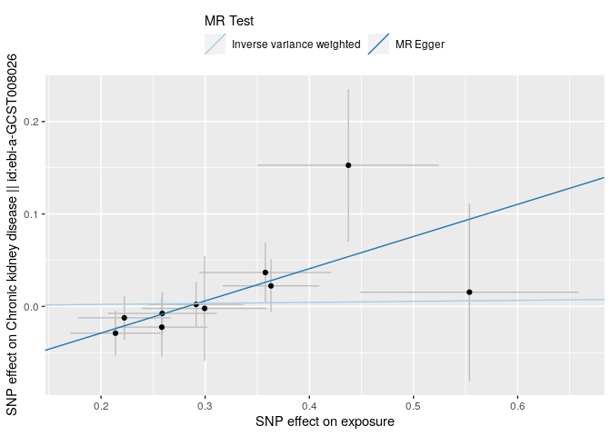
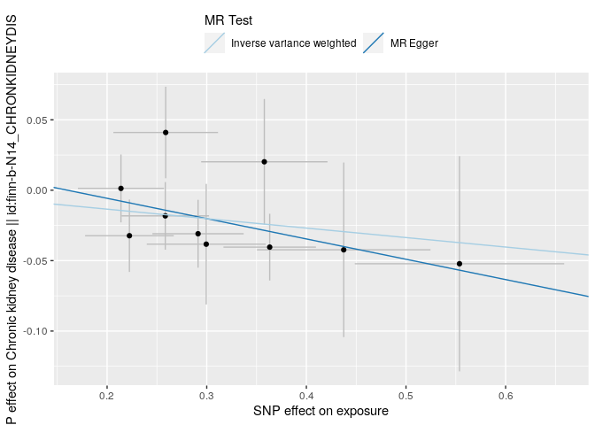
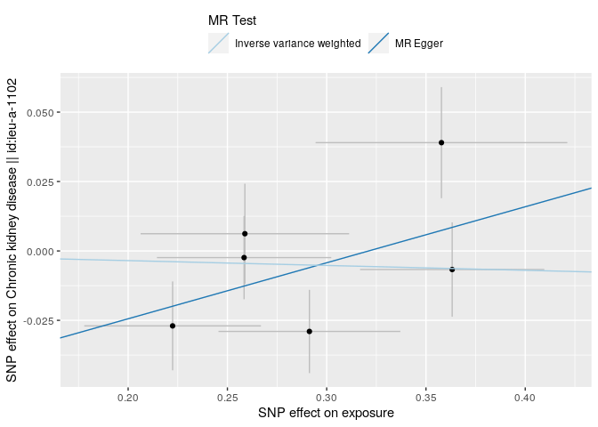
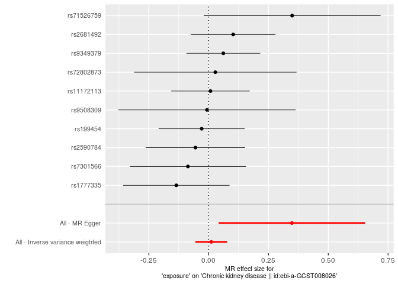
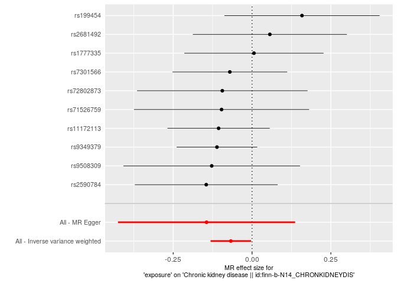
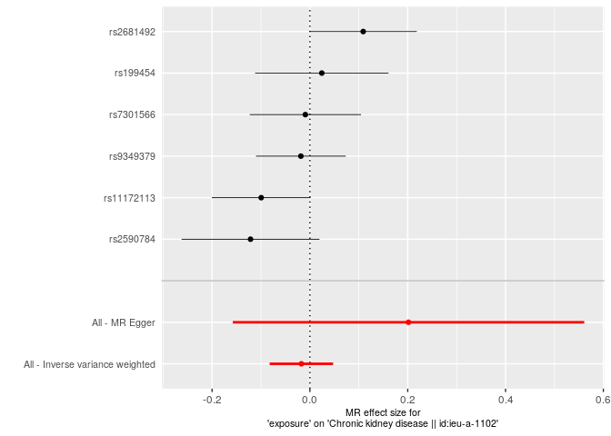
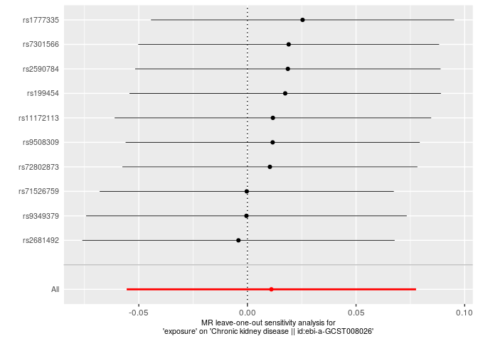
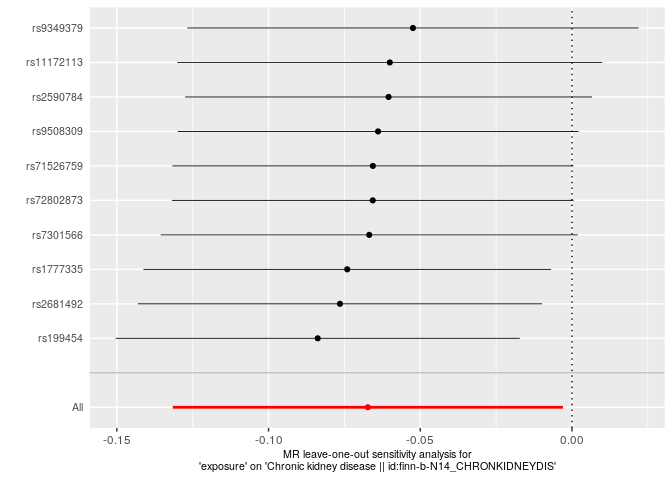
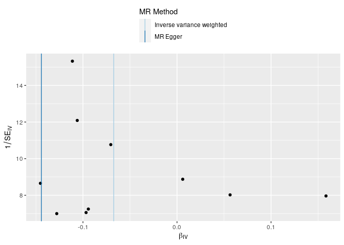

Creatinine & Cystatin C & CKD as possible consequences of FMD
================
Fred Boehm
4/18/23

``` r
library(magrittr)
```

``` r
fmd_file <- here::here("analysis", "data", "fmd", "GCST90026612_buildGRCh37.tsv")
fmd <- TwoSampleMR::read_exposure_data(filename = fmd_file,
                                        sep = "\t",
                                        snp_col = "SNP",
                                        beta_col = "BETA",
                                        effect_allele_col = "EA",
                                        other_allele_col = "OA",
                                        eaf_col = "EAF",
                                        se_col = "SE",
                                        pval_col = "p_value",
                                        chr_col = "chromosome",
                                        pos_col = "base_pair_location",
                                        ncase_col = "N_cases",
                                        ncontrol_col = "N_ctrls"
                                        )
```

    No phenotype name specified, defaulting to 'exposure'.

    Generating sample size from ncase and ncontrol

``` r
#fmd <- vroom::vroom(fmd_file) %>%
#    dplyr::mutate(chr_pos = paste0("chr", chromosome, ":", base_pair_location))
fmd_lead_snps_file <- here::here("analysis", "data", "fmd", "41467_2021_26174_MOESM4_ESM.xlsx") 
fmd_lead_snps <- readxl::read_xlsx(fmd_lead_snps_file, skip = 2) %>%
    dplyr::filter(`P-value` < 10^-6) 
fmd_filt <- fmd %>%
    dplyr::filter(SNP %in% fmd_lead_snps$rsID)
```

``` r
ieugwasr::api_status()
```

    API: public: http://gwas-api.mrcieu.ac.uk/

    $`API version`
    [1] "3.8.7"

    $Access
    [1] "public"

    $`Neo4j status`
    [1] "Available"

    $`ElasticSearch status`
    [1] "Available"

    $`LD reference panel`
    [1] "Available"

    $`1000 genomes annotation VCF`
    [1] "Available"

    $`PLINK executable`
    [1] "Available"

    $Cromwell
    [1] "Available"

    $`Total associations`
    [1] 245791104737

    $`Total complete datasets`
    [1] 42481

    $`Total public datasets`
    [1] 42346

    attr(,"class")
    [1] "ApiStatus"

``` r
ao <- TwoSampleMR::available_outcomes()
```

    Server code: 502; Server is possibly experiencing traffic, trying again...

    Server code: 502; Server is possibly experiencing traffic, trying again...

    Retry succeeded!

``` r
cr_ind <- grepl("creatinine", ao$trait, ignore.case = TRUE) 
ki_ind <- grepl("kidney", ao$trait, ignore.case = TRUE) 
cc_ind <- grepl("cystatin", ao$trait, ignore.case = TRUE)
ao[cc_ind, ]
```

    # A tibble: 20 × 22
       id    trait ncase group_name  year author consortium sex      pmid population
       <chr> <chr> <int> <chr>      <int> <chr>  <chr>      <chr>   <int> <chr>     
     1 ukb-… Cyst…  1500 public      2020 Pan-U… NA         Male… NA      Greater M…
     2 ebi-… Cyst…    NA public      2020 Gilly… NA         NA     3.33e7 European  
     3 ebi-… Cyst…    NA public      2020 Folke… NA         NA     3.31e7 European  
     4 prot… Cyst…    NA public      2018 Sun BB NA         Male…  2.99e7 European  
     5 prot… Cyst…    NA public      2018 Sun BB NA         Male…  2.99e7 European  
     6 prot… Cyst…    NA public      2019 Suhre… NA         Male…  2.82e7 European  
     7 ukb-… Cyst…  6213 public      2020 Pan-U… NA         Male… NA      African A…
     8 prot… Cyst…    NA public      2018 Sun BB NA         Male…  2.99e7 European  
     9 ukb-… Cyst…    NA public      2018 Neale… NA         Male… NA      European  
    10 prot… Cyst…    NA public      2019 Suhre… NA         Male…  2.82e7 European  
    11 prot… Cyst…    NA public      2018 Sun BB NA         Male…  2.99e7 European  
    12 prot… Cyst…    NA public      2019 Suhre… NA         Male…  2.82e7 European  
    13 ukb-… Cyst…  2573 public      2020 Pan-U… NA         Male… NA      East Asian
    14 ukb-… Cyst…    NA public      2018 Neale… NA         Male… NA      European  
    15 prot… Cyst…    NA public      2018 Sun BB NA         Male…  2.99e7 European  
    16 ieu-… Seru…    NA public      2015 Patta… CKDGen     Male…  2.68e7 Mixed     
    17 prot… cyst…    NA public      2018 Folke… NA         Male…  2.84e7 European  
    18 ebi-… Glom…    NA public      2016 Patta… NA         NA     2.68e7 European  
    19 ebi-… Cyst…    NA public      2020 Hilla… NA         NA     3.26e7 European  
    20 ukb-… Cyst…  8422 public      2020 Pan-U… NA         Male… NA      South Asi…
    # ℹ 12 more variables: unit <chr>, sample_size <int>, build <chr>,
    #   ncontrol <int>, category <chr>, subcategory <chr>, ontology <chr>,
    #   note <chr>, mr <int>, nsnp <int>, priority <int>, sd <dbl>

``` r
# get ckd outcomes
ckd_outcomes <- ao[ki_ind, ] %>%
    dplyr::filter(stringr::str_detect(string = trait, pattern = "Chronic"))
ckd <- TwoSampleMR::extract_outcome_data(
    snps = fmd_filt$SNP,
    outcomes = ckd_outcomes$id
)
```

    Extracting data for 10 SNP(s) from 4 GWAS(s)

    Server code: 502; Server is possibly experiencing traffic, trying again...
    Server code: 502; Server is possibly experiencing traffic, trying again...
    Server code: 502; Server is possibly experiencing traffic, trying again...

    Retry succeeded!

    Finding proxies for 6 SNPs in outcome ebi-a-GCST003374

    Extracting data for 6 SNP(s) from 1 GWAS(s)

    Finding proxies for 6 SNPs in outcome ieu-a-1102

    Extracting data for 6 SNP(s) from 1 GWAS(s)

``` r
dat <- TwoSampleMR::harmonise_data(exposure_dat = fmd_filt, outcome_dat = ckd)
```

    Harmonising exposure (oRsx5I) and Chronic kidney disease || id:ebi-a-GCST003374 (ebi-a-GCST003374)

    Harmonising exposure (oRsx5I) and Chronic kidney disease || id:ebi-a-GCST008026 (ebi-a-GCST008026)

    Harmonising exposure (oRsx5I) and Chronic kidney disease || id:finn-b-N14_CHRONKIDNEYDIS (finn-b-N14_CHRONKIDNEYDIS)

    Harmonising exposure (oRsx5I) and Chronic kidney disease || id:ieu-a-1102 (ieu-a-1102)

``` r
res <- TwoSampleMR::mr(dat, method_list = c("mr_egger_regression", "mr_ivw")) 
```

    Analysing 'oRsx5I' on 'ebi-a-GCST003374'

    Analysing 'oRsx5I' on 'ebi-a-GCST008026'

    Analysing 'oRsx5I' on 'finn-b-N14_CHRONKIDNEYDIS'

    Analysing 'oRsx5I' on 'ieu-a-1102'

``` r
res %>%
    knitr::kable() %>%
    print()
```


    |id.exposure |id.outcome                |outcome                                                          |exposure |method                    | nsnp|          b|        se|      pval|
    |:-----------|:-------------------------|:----------------------------------------------------------------|:--------|:-------------------------|----:|----------:|---------:|---------:|
    |oRsx5I      |ebi-a-GCST003374          |Chronic kidney disease &#124;&#124; id:ebi-a-GCST003374          |exposure |MR Egger                  |    6|  0.2017325| 0.1831650| 0.3325532|
    |oRsx5I      |ebi-a-GCST003374          |Chronic kidney disease &#124;&#124; id:ebi-a-GCST003374          |exposure |Inverse variance weighted |    6| -0.0174781| 0.0330773| 0.5972200|
    |oRsx5I      |ebi-a-GCST008026          |Chronic kidney disease &#124;&#124; id:ebi-a-GCST008026          |exposure |MR Egger                  |   10|  0.3480330| 0.1562425| 0.0565154|
    |oRsx5I      |ebi-a-GCST008026          |Chronic kidney disease &#124;&#124; id:ebi-a-GCST008026          |exposure |Inverse variance weighted |   10|  0.0110253| 0.0339760| 0.7455584|
    |oRsx5I      |finn-b-N14_CHRONKIDNEYDIS |Chronic kidney disease &#124;&#124; id:finn-b-N14_CHRONKIDNEYDIS |exposure |MR Egger                  |   10| -0.1442641| 0.1433502| 0.3437007|
    |oRsx5I      |finn-b-N14_CHRONKIDNEYDIS |Chronic kidney disease &#124;&#124; id:finn-b-N14_CHRONKIDNEYDIS |exposure |Inverse variance weighted |   10| -0.0672683| 0.0327985| 0.0402714|
    |oRsx5I      |ieu-a-1102                |Chronic kidney disease &#124;&#124; id:ieu-a-1102                |exposure |MR Egger                  |    6|  0.2017325| 0.1831650| 0.3325532|
    |oRsx5I      |ieu-a-1102                |Chronic kidney disease &#124;&#124; id:ieu-a-1102                |exposure |Inverse variance weighted |    6| -0.0174781| 0.0330773| 0.5972200|

``` r
TwoSampleMR::mr_heterogeneity(dat) %>%
    knitr::kable() %>%
    print()
```


    |id.exposure |id.outcome                |outcome                                                          |exposure |method                    |         Q| Q_df|    Q_pval|
    |:-----------|:-------------------------|:----------------------------------------------------------------|:--------|:-------------------------|---------:|----:|---------:|
    |oRsx5I      |ebi-a-GCST003374          |Chronic kidney disease &#124;&#124; id:ebi-a-GCST003374          |exposure |MR Egger                  |  7.393542|    4| 0.1164963|
    |oRsx5I      |ebi-a-GCST003374          |Chronic kidney disease &#124;&#124; id:ebi-a-GCST003374          |exposure |Inverse variance weighted | 10.122259|    5| 0.0718443|
    |oRsx5I      |ebi-a-GCST008026          |Chronic kidney disease &#124;&#124; id:ebi-a-GCST008026          |exposure |MR Egger                  |  2.645165|    8| 0.9546177|
    |oRsx5I      |ebi-a-GCST008026          |Chronic kidney disease &#124;&#124; id:ebi-a-GCST008026          |exposure |Inverse variance weighted |  7.528531|    9| 0.5822647|
    |oRsx5I      |finn-b-N14_CHRONKIDNEYDIS |Chronic kidney disease &#124;&#124; id:finn-b-N14_CHRONKIDNEYDIS |exposure |MR Egger                  |  5.726122|    8| 0.6778792|
    |oRsx5I      |finn-b-N14_CHRONKIDNEYDIS |Chronic kidney disease &#124;&#124; id:finn-b-N14_CHRONKIDNEYDIS |exposure |Inverse variance weighted |  6.030554|    9| 0.7368565|
    |oRsx5I      |ieu-a-1102                |Chronic kidney disease &#124;&#124; id:ieu-a-1102                |exposure |MR Egger                  |  7.393542|    4| 0.1164963|
    |oRsx5I      |ieu-a-1102                |Chronic kidney disease &#124;&#124; id:ieu-a-1102                |exposure |Inverse variance weighted | 10.122259|    5| 0.0718443|

``` r
TwoSampleMR::mr_pleiotropy_test(dat) %>%
    knitr::kable() %>%
    print()
```


    |id.exposure |id.outcome                |outcome                                                          |exposure | egger_intercept|        se|      pval|
    |:-----------|:-------------------------|:----------------------------------------------------------------|:--------|---------------:|---------:|---------:|
    |oRsx5I      |ebi-a-GCST003374          |Chronic kidney disease &#124;&#124; id:ebi-a-GCST003374          |exposure |      -0.0647748| 0.0533117| 0.2911724|
    |oRsx5I      |ebi-a-GCST008026          |Chronic kidney disease &#124;&#124; id:ebi-a-GCST008026          |exposure |      -0.0983777| 0.0445181| 0.0580961|
    |oRsx5I      |finn-b-N14_CHRONKIDNEYDIS |Chronic kidney disease &#124;&#124; id:finn-b-N14_CHRONKIDNEYDIS |exposure |       0.0230972| 0.0418615| 0.5961892|
    |oRsx5I      |ieu-a-1102                |Chronic kidney disease &#124;&#124; id:ieu-a-1102                |exposure |      -0.0647748| 0.0533117| 0.2911724|

``` r
res_ss <- TwoSampleMR::mr_singlesnp(dat) 
res_ss %>%
    knitr::kable() %>%
    print()
```


    |exposure |outcome                                                          |id.exposure |id.outcome                | samplesize|SNP                             |          b|        se|         p|
    |:--------|:----------------------------------------------------------------|:-----------|:-------------------------|----------:|:-------------------------------|----------:|---------:|---------:|
    |exposure |Chronic kidney disease &#124;&#124; id:ebi-a-GCST003374          |oRsx5I      |ebi-a-GCST003374          |     117165|rs11172113                      | -0.0995537| 0.0514933| 0.0531951|
    |exposure |Chronic kidney disease &#124;&#124; id:ebi-a-GCST003374          |oRsx5I      |ebi-a-GCST003374          |     117165|rs199454                        |  0.0239567| 0.0695518| 0.7305121|
    |exposure |Chronic kidney disease &#124;&#124; id:ebi-a-GCST003374          |oRsx5I      |ebi-a-GCST003374          |     117165|rs2590784                       | -0.1214029| 0.0719424| 0.0915072|
    |exposure |Chronic kidney disease &#124;&#124; id:ebi-a-GCST003374          |oRsx5I      |ebi-a-GCST003374          |     117165|rs2681492                       |  0.1089994| 0.0558971| 0.0511761|
    |exposure |Chronic kidney disease &#124;&#124; id:ebi-a-GCST003374          |oRsx5I      |ebi-a-GCST003374          |     117165|rs7301566                       | -0.0092879| 0.0580495| 0.8728811|
    |exposure |Chronic kidney disease &#124;&#124; id:ebi-a-GCST003374          |oRsx5I      |ebi-a-GCST003374          |     117165|rs9349379                       | -0.0184471| 0.0468062| 0.6934942|
    |exposure |Chronic kidney disease &#124;&#124; id:ebi-a-GCST003374          |oRsx5I      |ebi-a-GCST003374          |     117165|All - Inverse variance weighted | -0.0174781| 0.0330773| 0.5972200|
    |exposure |Chronic kidney disease &#124;&#124; id:ebi-a-GCST003374          |oRsx5I      |ebi-a-GCST003374          |     117165|All - MR Egger                  |  0.2017325| 0.1831650| 0.3325532|
    |exposure |Chronic kidney disease &#124;&#124; id:ebi-a-GCST008026          |oRsx5I      |ebi-a-GCST008026          |       2872|rs11172113                      |  0.0074449| 0.0837721| 0.9291845|
    |exposure |Chronic kidney disease &#124;&#124; id:ebi-a-GCST008026          |oRsx5I      |ebi-a-GCST008026          |       2872|rs1777335                       | -0.1351660| 0.1135643| 0.2339617|
    |exposure |Chronic kidney disease &#124;&#124; id:ebi-a-GCST008026          |oRsx5I      |ebi-a-GCST008026          |       2872|rs199454                        | -0.0291522| 0.0918443| 0.7509330|
    |exposure |Chronic kidney disease &#124;&#124; id:ebi-a-GCST008026          |oRsx5I      |ebi-a-GCST008026          |       2872|rs2590784                       | -0.0552936| 0.1059829| 0.6018639|
    |exposure |Chronic kidney disease &#124;&#124; id:ebi-a-GCST008026          |oRsx5I      |ebi-a-GCST008026          |       2872|rs2681492                       |  0.1025542| 0.0901750| 0.2554210|
    |exposure |Chronic kidney disease &#124;&#124; id:ebi-a-GCST008026          |oRsx5I      |ebi-a-GCST008026          |       2872|rs71526759                      |  0.3488411| 0.1886251| 0.0644018|
    |exposure |Chronic kidney disease &#124;&#124; id:ebi-a-GCST008026          |oRsx5I      |ebi-a-GCST008026          |       2872|rs72802873                      |  0.0278438| 0.1733218| 0.8723708|
    |exposure |Chronic kidney disease &#124;&#124; id:ebi-a-GCST008026          |oRsx5I      |ebi-a-GCST008026          |       2872|rs7301566                       | -0.0867016| 0.1237345| 0.4834860|
    |exposure |Chronic kidney disease &#124;&#124; id:ebi-a-GCST008026          |oRsx5I      |ebi-a-GCST008026          |       2872|rs9349379                       |  0.0612715| 0.0788037| 0.4368518|
    |exposure |Chronic kidney disease &#124;&#124; id:ebi-a-GCST008026          |oRsx5I      |ebi-a-GCST008026          |       2872|rs9508309                       | -0.0070755| 0.1891716| 0.9701642|
    |exposure |Chronic kidney disease &#124;&#124; id:ebi-a-GCST008026          |oRsx5I      |ebi-a-GCST008026          |       2872|All - Inverse variance weighted |  0.0110253| 0.0339760| 0.7455584|
    |exposure |Chronic kidney disease &#124;&#124; id:ebi-a-GCST008026          |oRsx5I      |ebi-a-GCST008026          |       2872|All - MR Egger                  |  0.3480330| 0.1562425| 0.0565154|
    |exposure |Chronic kidney disease &#124;&#124; id:finn-b-N14_CHRONKIDNEYDIS |oRsx5I      |finn-b-N14_CHRONKIDNEYDIS |         NA|rs11172113                      | -0.1060762| 0.0827326| 0.1997873|
    |exposure |Chronic kidney disease &#124;&#124; id:finn-b-N14_CHRONKIDNEYDIS |oRsx5I      |finn-b-N14_CHRONKIDNEYDIS |         NA|rs1777335                       |  0.0060776| 0.1126695| 0.9569814|
    |exposure |Chronic kidney disease &#124;&#124; id:finn-b-N14_CHRONKIDNEYDIS |oRsx5I      |finn-b-N14_CHRONKIDNEYDIS |         NA|rs199454                        |  0.1584235| 0.1255796| 0.2071149|
    |exposure |Chronic kidney disease &#124;&#124; id:finn-b-N14_CHRONKIDNEYDIS |oRsx5I      |finn-b-N14_CHRONKIDNEYDIS |         NA|rs2590784                       | -0.1452338| 0.1155576| 0.2088227|
    |exposure |Chronic kidney disease &#124;&#124; id:finn-b-N14_CHRONKIDNEYDIS |oRsx5I      |finn-b-N14_CHRONKIDNEYDIS |         NA|rs2681492                       |  0.0564561| 0.1246506| 0.6506101|
    |exposure |Chronic kidney disease &#124;&#124; id:finn-b-N14_CHRONKIDNEYDIS |oRsx5I      |finn-b-N14_CHRONKIDNEYDIS |         NA|rs71526759                      | -0.0966857| 0.1417143| 0.4950758|
    |exposure |Chronic kidney disease &#124;&#124; id:finn-b-N14_CHRONKIDNEYDIS |oRsx5I      |finn-b-N14_CHRONKIDNEYDIS |         NA|rs72802873                      | -0.0942749| 0.1379809| 0.4944514|
    |exposure |Chronic kidney disease &#124;&#124; id:finn-b-N14_CHRONKIDNEYDIS |oRsx5I      |finn-b-N14_CHRONKIDNEYDIS |         NA|rs7301566                       | -0.0704334| 0.0928793| 0.4482515|
    |exposure |Chronic kidney disease &#124;&#124; id:finn-b-N14_CHRONKIDNEYDIS |oRsx5I      |finn-b-N14_CHRONKIDNEYDIS |         NA|rs9349379                       | -0.1112335| 0.0652533| 0.0882613|
    |exposure |Chronic kidney disease &#124;&#124; id:finn-b-N14_CHRONKIDNEYDIS |oRsx5I      |finn-b-N14_CHRONKIDNEYDIS |         NA|rs9508309                       | -0.1278798| 0.1429048| 0.3708620|
    |exposure |Chronic kidney disease &#124;&#124; id:finn-b-N14_CHRONKIDNEYDIS |oRsx5I      |finn-b-N14_CHRONKIDNEYDIS |         NA|All - Inverse variance weighted | -0.0672683| 0.0327985| 0.0402714|
    |exposure |Chronic kidney disease &#124;&#124; id:finn-b-N14_CHRONKIDNEYDIS |oRsx5I      |finn-b-N14_CHRONKIDNEYDIS |         NA|All - MR Egger                  | -0.1442641| 0.1433502| 0.3437007|
    |exposure |Chronic kidney disease &#124;&#124; id:ieu-a-1102                |oRsx5I      |ieu-a-1102                |     118143|rs11172113                      | -0.0995537| 0.0514933| 0.0531951|
    |exposure |Chronic kidney disease &#124;&#124; id:ieu-a-1102                |oRsx5I      |ieu-a-1102                |     118143|rs199454                        |  0.0239567| 0.0695518| 0.7305121|
    |exposure |Chronic kidney disease &#124;&#124; id:ieu-a-1102                |oRsx5I      |ieu-a-1102                |     118143|rs2590784                       | -0.1214029| 0.0719424| 0.0915072|
    |exposure |Chronic kidney disease &#124;&#124; id:ieu-a-1102                |oRsx5I      |ieu-a-1102                |     118143|rs2681492                       |  0.1089994| 0.0558971| 0.0511761|
    |exposure |Chronic kidney disease &#124;&#124; id:ieu-a-1102                |oRsx5I      |ieu-a-1102                |     118143|rs7301566                       | -0.0092879| 0.0580495| 0.8728811|
    |exposure |Chronic kidney disease &#124;&#124; id:ieu-a-1102                |oRsx5I      |ieu-a-1102                |     118143|rs9349379                       | -0.0184471| 0.0468062| 0.6934942|
    |exposure |Chronic kidney disease &#124;&#124; id:ieu-a-1102                |oRsx5I      |ieu-a-1102                |     118143|All - Inverse variance weighted | -0.0174781| 0.0330773| 0.5972200|
    |exposure |Chronic kidney disease &#124;&#124; id:ieu-a-1102                |oRsx5I      |ieu-a-1102                |     118143|All - MR Egger                  |  0.2017325| 0.1831650| 0.3325532|

``` r
loo <- TwoSampleMR::mr_leaveoneout(dat) 
loo %>%
    knitr::kable() %>%
    print()
```


    |exposure |outcome                                                          |id.exposure |id.outcome                | samplesize|SNP        |          b|        se|         p|
    |:--------|:----------------------------------------------------------------|:-----------|:-------------------------|----------:|:----------|----------:|---------:|---------:|
    |exposure |Chronic kidney disease &#124;&#124; id:ebi-a-GCST003374          |oRsx5I      |ebi-a-GCST003374          |     117165|rs11172113 |  0.0035332| 0.0342964| 0.9179469|
    |exposure |Chronic kidney disease &#124;&#124; id:ebi-a-GCST003374          |oRsx5I      |ebi-a-GCST003374          |     117165|rs199454   | -0.0226895| 0.0384561| 0.5551839|
    |exposure |Chronic kidney disease &#124;&#124; id:ebi-a-GCST003374          |oRsx5I      |ebi-a-GCST003374          |     117165|rs2590784  | -0.0053611| 0.0342866| 0.8757482|
    |exposure |Chronic kidney disease &#124;&#124; id:ebi-a-GCST003374          |oRsx5I      |ebi-a-GCST003374          |     117165|rs2681492  | -0.0439305| 0.0255632| 0.0857047|
    |exposure |Chronic kidney disease &#124;&#124; id:ebi-a-GCST003374          |oRsx5I      |ebi-a-GCST003374          |     117165|rs7301566  | -0.0190426| 0.0403120| 0.6366558|
    |exposure |Chronic kidney disease &#124;&#124; id:ebi-a-GCST003374          |oRsx5I      |ebi-a-GCST003374          |     117165|rs9349379  | -0.0171608| 0.0426073| 0.6871206|
    |exposure |Chronic kidney disease &#124;&#124; id:ebi-a-GCST003374          |oRsx5I      |ebi-a-GCST003374          |     117165|All        | -0.0174781| 0.0330773| 0.5972200|
    |exposure |Chronic kidney disease &#124;&#124; id:ebi-a-GCST008026          |oRsx5I      |ebi-a-GCST008026          |       2872|rs11172113 |  0.0117302| 0.0371704| 0.7523229|
    |exposure |Chronic kidney disease &#124;&#124; id:ebi-a-GCST008026          |oRsx5I      |ebi-a-GCST008026          |       2872|rs1777335  |  0.0253969| 0.0356069| 0.4756862|
    |exposure |Chronic kidney disease &#124;&#124; id:ebi-a-GCST008026          |oRsx5I      |ebi-a-GCST008026          |       2872|rs199454   |  0.0173952| 0.0365703| 0.6343131|
    |exposure |Chronic kidney disease &#124;&#124; id:ebi-a-GCST008026          |oRsx5I      |ebi-a-GCST008026          |       2872|rs2590784  |  0.0186217| 0.0358691| 0.6036523|
    |exposure |Chronic kidney disease &#124;&#124; id:ebi-a-GCST008026          |oRsx5I      |ebi-a-GCST008026          |       2872|rs2681492  | -0.0041182| 0.0366792| 0.9106044|
    |exposure |Chronic kidney disease &#124;&#124; id:ebi-a-GCST008026          |oRsx5I      |ebi-a-GCST008026          |       2872|rs71526759 | -0.0003027| 0.0345410| 0.9930089|
    |exposure |Chronic kidney disease &#124;&#124; id:ebi-a-GCST008026          |oRsx5I      |ebi-a-GCST008026          |       2872|rs72802873 |  0.0103532| 0.0346483| 0.7650871|
    |exposure |Chronic kidney disease &#124;&#124; id:ebi-a-GCST008026          |oRsx5I      |ebi-a-GCST008026          |       2872|rs7301566  |  0.0189946| 0.0353342| 0.5908737|
    |exposure |Chronic kidney disease &#124;&#124; id:ebi-a-GCST008026          |oRsx5I      |ebi-a-GCST008026          |       2872|rs9349379  | -0.0004476| 0.0376557| 0.9905165|
    |exposure |Chronic kidney disease &#124;&#124; id:ebi-a-GCST008026          |oRsx5I      |ebi-a-GCST008026          |       2872|rs9508309  |  0.0116286| 0.0345376| 0.7363476|
    |exposure |Chronic kidney disease &#124;&#124; id:ebi-a-GCST008026          |oRsx5I      |ebi-a-GCST008026          |       2872|All        |  0.0110253| 0.0339760| 0.7455584|
    |exposure |Chronic kidney disease &#124;&#124; id:finn-b-N14_CHRONKIDNEYDIS |oRsx5I      |finn-b-N14_CHRONKIDNEYDIS |         NA|rs11172113 | -0.0600317| 0.0357259| 0.0928909|
    |exposure |Chronic kidney disease &#124;&#124; id:finn-b-N14_CHRONKIDNEYDIS |oRsx5I      |finn-b-N14_CHRONKIDNEYDIS |         NA|rs1777335  | -0.0740592| 0.0342833| 0.0307562|
    |exposure |Chronic kidney disease &#124;&#124; id:finn-b-N14_CHRONKIDNEYDIS |oRsx5I      |finn-b-N14_CHRONKIDNEYDIS |         NA|rs199454   | -0.0837906| 0.0339779| 0.0136619|
    |exposure |Chronic kidney disease &#124;&#124; id:finn-b-N14_CHRONKIDNEYDIS |oRsx5I      |finn-b-N14_CHRONKIDNEYDIS |         NA|rs2590784  | -0.0604372| 0.0342052| 0.0772451|
    |exposure |Chronic kidney disease &#124;&#124; id:finn-b-N14_CHRONKIDNEYDIS |oRsx5I      |finn-b-N14_CHRONKIDNEYDIS |         NA|rs2681492  | -0.0764714| 0.0339965| 0.0244877|
    |exposure |Chronic kidney disease &#124;&#124; id:finn-b-N14_CHRONKIDNEYDIS |oRsx5I      |finn-b-N14_CHRONKIDNEYDIS |         NA|rs71526759 | -0.0656034| 0.0337139| 0.0516686|
    |exposure |Chronic kidney disease &#124;&#124; id:finn-b-N14_CHRONKIDNEYDIS |oRsx5I      |finn-b-N14_CHRONKIDNEYDIS |         NA|rs72802873 | -0.0656510| 0.0337664| 0.0518628|
    |exposure |Chronic kidney disease &#124;&#124; id:finn-b-N14_CHRONKIDNEYDIS |oRsx5I      |finn-b-N14_CHRONKIDNEYDIS |         NA|rs7301566  | -0.0668174| 0.0350571| 0.0566559|
    |exposure |Chronic kidney disease &#124;&#124; id:finn-b-N14_CHRONKIDNEYDIS |oRsx5I      |finn-b-N14_CHRONKIDNEYDIS |         NA|rs9349379  | -0.0524061| 0.0379394| 0.1671831|
    |exposure |Chronic kidney disease &#124;&#124; id:finn-b-N14_CHRONKIDNEYDIS |oRsx5I      |finn-b-N14_CHRONKIDNEYDIS |         NA|rs9508309  | -0.0638980| 0.0336981| 0.0579350|
    |exposure |Chronic kidney disease &#124;&#124; id:finn-b-N14_CHRONKIDNEYDIS |oRsx5I      |finn-b-N14_CHRONKIDNEYDIS |         NA|All        | -0.0672683| 0.0327985| 0.0402714|
    |exposure |Chronic kidney disease &#124;&#124; id:ieu-a-1102                |oRsx5I      |ieu-a-1102                |     118143|rs11172113 |  0.0035332| 0.0342964| 0.9179469|
    |exposure |Chronic kidney disease &#124;&#124; id:ieu-a-1102                |oRsx5I      |ieu-a-1102                |     118143|rs199454   | -0.0226895| 0.0384561| 0.5551839|
    |exposure |Chronic kidney disease &#124;&#124; id:ieu-a-1102                |oRsx5I      |ieu-a-1102                |     118143|rs2590784  | -0.0053611| 0.0342866| 0.8757482|
    |exposure |Chronic kidney disease &#124;&#124; id:ieu-a-1102                |oRsx5I      |ieu-a-1102                |     118143|rs2681492  | -0.0439305| 0.0255632| 0.0857047|
    |exposure |Chronic kidney disease &#124;&#124; id:ieu-a-1102                |oRsx5I      |ieu-a-1102                |     118143|rs7301566  | -0.0190426| 0.0403120| 0.6366558|
    |exposure |Chronic kidney disease &#124;&#124; id:ieu-a-1102                |oRsx5I      |ieu-a-1102                |     118143|rs9349379  | -0.0171608| 0.0426073| 0.6871206|
    |exposure |Chronic kidney disease &#124;&#124; id:ieu-a-1102                |oRsx5I      |ieu-a-1102                |     118143|All        | -0.0174781| 0.0330773| 0.5972200|

``` r
pp <- TwoSampleMR::mr_scatter_plot(res, dat)
for (index in seq_along(pp)){
    print(pp[[index]])
}
```








``` r
p2 <- TwoSampleMR::mr_forest_plot(res_ss)
for (index in seq_along(p2)){
    print(p2[[index]])
}
```

    Warning: Removed 1 rows containing missing values (`geom_errorbarh()`).

    Warning: Removed 1 rows containing missing values (`geom_point()`).


    Warning: Removed 1 rows containing missing values (`geom_errorbarh()`).
    Removed 1 rows containing missing values (`geom_point()`).



    Warning: Removed 1 rows containing missing values (`geom_errorbarh()`).
    Removed 1 rows containing missing values (`geom_point()`).



    Warning: Removed 1 rows containing missing values (`geom_errorbarh()`).
    Removed 1 rows containing missing values (`geom_point()`).



``` r
p3 <- TwoSampleMR::mr_leaveoneout_plot(loo)
for (index in seq_along(p3)){
    print(p3[[index]])
}
```

    Warning: Removed 1 rows containing missing values (`geom_errorbarh()`).

    Warning: Removed 1 rows containing missing values (`geom_point()`).


    Warning: Removed 1 rows containing missing values (`geom_errorbarh()`).
    Removed 1 rows containing missing values (`geom_point()`).



    Warning: Removed 1 rows containing missing values (`geom_errorbarh()`).
    Removed 1 rows containing missing values (`geom_point()`).



    Warning: Removed 1 rows containing missing values (`geom_errorbarh()`).
    Removed 1 rows containing missing values (`geom_point()`).


``` r
p4 <- TwoSampleMR::mr_funnel_plot(res_ss)
for (index in seq_along(p4)){ 
    print(p4[[index]])
}
```





``` r
# MR RAPS
fmd_lead_snps <- readxl::read_xlsx(fmd_lead_snps_file, skip = 2) 
fmd_filt <- fmd %>%
    dplyr::filter(SNP %in% fmd_lead_snps$rsID)
ckd <- TwoSampleMR::extract_outcome_data(
    snps = fmd_filt$SNP,
    outcomes = ckd_outcomes$id
)
dat <- TwoSampleMR::harmonise_data(exposure_dat = fmd_filt, outcome_dat = ckd)

TwoSampleMR::mr(dat, method_list = c("mr_raps")) %>%
    knitr::kable() %>%
    print()
```

``` r
TwoSampleMR::mr_report(dat, 
    output_path = here::here("analysis", "results"),
    output_type = "md",
    author = "Fred Boehm",
    study = "Two Sample MR"
)
```

``` r
sessioninfo::session_info()
```

    ─ Session info ───────────────────────────────────────────────────────────────
     setting  value
     version  R version 4.2.3 (2023-03-15)
     os       Ubuntu 18.04.6 LTS
     system   x86_64, linux-gnu
     ui       X11
     language en_US:
     collate  en_US.UTF-8
     ctype    en_US.UTF-8
     tz       America/Detroit
     date     2023-04-18
     pandoc   1.19.2.4 @ /usr/bin/ (via rmarkdown)

    ─ Packages ───────────────────────────────────────────────────────────────────
     package     * version date (UTC) lib source
     cellranger    1.1.0   2016-07-27 [2] CRAN (R 4.0.3)
     cli           3.6.1   2023-03-23 [1] CRAN (R 4.2.3)
     codetools     0.2-19  2023-02-01 [1] CRAN (R 4.2.2)
     colorspace    2.1-0   2023-01-23 [1] CRAN (R 4.2.2)
     crul          1.3     2022-09-03 [1] CRAN (R 4.2.3)
     curl          5.0.0   2023-01-12 [1] CRAN (R 4.2.2)
     data.table    1.14.8  2023-02-17 [1] CRAN (R 4.2.2)
     digest        0.6.31  2022-12-11 [1] CRAN (R 4.2.2)
     dplyr         1.1.1   2023-03-22 [1] CRAN (R 4.2.3)
     evaluate      0.20    2023-01-17 [1] CRAN (R 4.2.2)
     fansi         1.0.4   2023-01-22 [1] CRAN (R 4.2.2)
     farver        2.1.1   2022-07-06 [1] CRAN (R 4.2.3)
     fastmap       1.1.1   2023-02-24 [1] CRAN (R 4.2.3)
     foreach       1.5.2   2022-02-02 [2] CRAN (R 4.2.0)
     generics      0.1.3   2022-07-05 [1] CRAN (R 4.2.3)
     ggplot2       3.4.2   2023-04-03 [1] CRAN (R 4.2.3)
     ggrepel       0.9.3   2023-02-03 [1] CRAN (R 4.2.3)
     glmnet        4.1-7   2023-03-23 [1] CRAN (R 4.2.3)
     glue          1.6.2   2022-02-24 [1] CRAN (R 4.2.0)
     gridExtra     2.3     2017-09-09 [2] CRAN (R 4.0.3)
     gtable        0.3.3   2023-03-21 [1] CRAN (R 4.2.3)
     here          1.0.1   2020-12-13 [2] CRAN (R 4.1.1)
     htmltools     0.5.5   2023-03-23 [1] CRAN (R 4.2.3)
     httpcode      0.3.0   2020-04-10 [1] CRAN (R 4.2.2)
     httr          1.4.5   2023-02-24 [1] CRAN (R 4.2.3)
     ieugwasr      0.1.5   2023-04-13 [1] Github (mrcieu/ieugwasr@33e4629)
     iterators     1.0.14  2022-02-05 [2] CRAN (R 4.2.0)
     jsonlite      1.8.4   2022-12-06 [1] CRAN (R 4.2.3)
     knitr         1.42    2023-01-25 [1] CRAN (R 4.2.3)
     labeling      0.4.2   2020-10-20 [2] CRAN (R 4.0.3)
     lattice       0.21-8  2023-04-05 [1] CRAN (R 4.2.3)
     lifecycle     1.0.3   2022-10-07 [1] CRAN (R 4.2.2)
     magrittr    * 2.0.3   2022-03-30 [1] CRAN (R 4.2.0)
     Matrix        1.5-4   2023-04-04 [1] CRAN (R 4.2.3)
     mr.raps       0.4.1   2023-04-18 [1] Github (qingyuanzhao/mr.raps@2a23d84)
     munsell       0.5.0   2018-06-12 [2] CRAN (R 4.0.3)
     nortest       1.0-4   2015-07-30 [2] CRAN (R 4.0.3)
     pillar        1.9.0   2023-03-22 [1] CRAN (R 4.2.3)
     pkgconfig     2.0.3   2019-09-22 [2] CRAN (R 4.0.3)
     plyr          1.8.8   2022-11-11 [1] CRAN (R 4.2.3)
     R6            2.5.1   2021-08-19 [2] CRAN (R 4.1.1)
     Rcpp          1.0.10  2023-01-22 [1] CRAN (R 4.2.2)
     readxl        1.4.2   2023-02-09 [1] CRAN (R 4.2.3)
     rlang         1.1.0   2023-03-14 [1] CRAN (R 4.2.2)
     rmarkdown     2.21    2023-03-26 [1] CRAN (R 4.2.3)
     rootSolve     1.8.2.3 2021-09-29 [2] CRAN (R 4.1.1)
     rprojroot     2.0.3   2022-04-02 [2] CRAN (R 4.2.0)
     rsnps         0.5.0.0 2022-01-28 [1] CRAN (R 4.2.3)
     scales        1.2.1   2022-08-20 [1] CRAN (R 4.2.3)
     sessioninfo   1.2.2   2021-12-06 [1] CRAN (R 4.1.2)
     shape         1.4.6   2021-05-19 [2] CRAN (R 4.1.1)
     stringi       1.7.12  2023-01-11 [1] CRAN (R 4.2.2)
     stringr       1.5.0   2022-12-02 [1] CRAN (R 4.2.3)
     survival      3.5-5   2023-03-12 [1] CRAN (R 4.2.3)
     tibble        3.2.1   2023-03-20 [1] CRAN (R 4.2.3)
     tidyselect    1.2.0   2022-10-10 [1] CRAN (R 4.2.2)
     TwoSampleMR   0.5.6   2023-04-13 [1] Github (MRCIEU/TwoSampleMR@f856a15)
     utf8          1.2.3   2023-01-31 [1] CRAN (R 4.2.3)
     vctrs         0.6.1   2023-03-22 [1] CRAN (R 4.2.3)
     withr         2.5.0   2022-03-03 [1] CRAN (R 4.2.0)
     xfun          0.38    2023-03-24 [1] CRAN (R 4.2.3)
     yaml          2.3.7   2023-01-23 [1] CRAN (R 4.2.3)

     [1] /net/mulan/home/fredboe/R/x86_64-pc-linux-gnu-library/4.0
     [2] /net/mario/cluster/lib/R/site-library-bionic-40
     [3] /usr/local/lib/R/site-library
     [4] /usr/lib/R/site-library
     [5] /usr/lib/R/library

    ──────────────────────────────────────────────────────────────────────────────
