Creatinine & Cystatin C & CKD as possible consequences of FMD
================
Fred Boehm
4/18/23

``` r
library(magrittr)
```

``` r
#ieugwasr::api_status()
ao <- TwoSampleMR::available_outcomes()
```

    API: public: http://gwas-api.mrcieu.ac.uk/

    Server code: 502; Server is possibly experiencing traffic, trying again...

    Retry succeeded!

``` r
cr_ind <- grepl("creatinine", ao$trait, ignore.case = TRUE) 
ki_ind <- grepl("kidney", ao$trait, ignore.case = TRUE) 
cc_ind <- grepl("cystatin", ao$trait, ignore.case = TRUE)
cyc_outcomes <- ao[cc_ind, ] %>%
    dplyr::filter(stringr::str_detect(string = trait, pattern = "Cystatin C") | stringr::str_detect(string = trait, pattern = "eGFRcys") | stringr::str_detect(string = trait, pattern = "Glomerular filtration rate"))
# get ckd outcomes
ckd_outcomes <- ao[ki_ind, ] %>%
    dplyr::filter(stringr::str_detect(string = trait, pattern = "Chronic"))
ckd_outcomes %>%
    knitr::kable() %>%
    print()
```


    |id                        |trait                  | ncase|group_name | year|author    |consortium |sex               |     pmid|population                 |unit     | sample_size|build       | ncontrol|category |subcategory |ontology |note               | mr|     nsnp| priority| sd|
    |:-------------------------|:----------------------|-----:|:----------|----:|:---------|:----------|:-----------------|--------:|:--------------------------|:--------|-----------:|:-----------|--------:|:--------|:-----------|:--------|:------------------|--:|--------:|--------:|--:|
    |ebi-a-GCST003374          |Chronic kidney disease | 12385|public     | 2016|Pattaro C |NA         |NA                | 26831199|European                   |NA       |      117165|HG19/GRCh37 |   104780|NA       |NA          |NA       |NA                 |  1|  2179497|        0| NA|
    |ieu-a-1102                |Chronic kidney disease | 12385|public     | 2015|Pattaro   |CKDGen     |Males and Females | 26831199|Mixed                      |log odds |      117165|HG19/GRCh37 |   104780|Disease  |Kidney      |NA       |NA                 |  1|  2191877|        1| NA|
    |finn-b-N14_CHRONKIDNEYDIS |Chronic kidney disease |  3902|public     | 2021|NA        |NA         |Males and Females |       NA|European                   |NA       |          NA|HG19/GRCh37 |   212841|Binary   |NA          |NA       |N14_CHRONKIDNEYDIS |  1| 16380459|        0| NA|
    |ebi-a-GCST008026          |Chronic kidney disease |  1533|public     | 2019|Wojcik GL |NA         |NA                | 31217584|Hispanic or Latin American |NA       |       20920|HG19/GRCh37 |     1339|NA       |NA          |NA       |NA                 |  1| 17624171|        0| NA|

``` r
cyc_outcomes %>%
    knitr::kable() %>%
    print()
```


    |id               |trait                                   | ncase|group_name | year|author       |consortium |sex               |     pmid|population                                                         |unit                | sample_size|build       | ncontrol|category    |subcategory |ontology    |note                                                                               | mr|     nsnp| priority|   sd|
    |:----------------|:---------------------------------------|-----:|:----------|----:|:------------|:----------|:-----------------|--------:|:------------------------------------------------------------------|:-------------------|-----------:|:-----------|--------:|:-----------|:-----------|:-----------|:----------------------------------------------------------------------------------|--:|--------:|--------:|----:|
    |ukb-e-30720_MID  |Cystatin C                              |  1500|public     | 2020|Pan-UKB team |NA         |Males and Females |       NA|Greater Middle Eastern (Middle Eastern, North African, or Persian) |NA                  |        1500|HG19/GRCh37 |        0|Continuous  |NA          |NA          |NA                                                                                 |  1| 11896897|        0|   NA|
    |ukb-e-30720_AFR  |Cystatin C                              |  6213|public     | 2020|Pan-UKB team |NA         |Males and Females |       NA|African American or Afro-Caribbean                                 |NA                  |        6213|HG19/GRCh37 |        0|Continuous  |NA          |NA          |NA                                                                                 |  1| 15531997|        0|   NA|
    |ukb-d-30720_irnt |Cystatin C                              |    NA|public     | 2018|Neale lab    |NA         |Males and Females |       NA|European                                                           |NA                  |          NA|HG19/GRCh37 |       NA|Metabolites |NA          |NA          |NA                                                                                 |  1| 13586047|        0|   NA|
    |prot-c-2609_59_2 |Cystatin C                              |    NA|public     | 2019|Suhre K      |NA         |Males and Females | 28240269|European                                                           |NA                  |          NA|HG19/GRCh37 |       NA|Continuous  |NA          |EFO_0007937 |name=Cystatin-C; chr=20; start=23626706; end=23638473; entrez=1471; uniprot=P01034 |  1|   501428|        0|   NA|
    |ukb-e-30720_EAS  |Cystatin C                              |  2573|public     | 2020|Pan-UKB team |NA         |Males and Females |       NA|East Asian                                                         |NA                  |        2573|HG19/GRCh37 |        0|Continuous  |NA          |NA          |NA                                                                                 |  1|  8258675|        0|   NA|
    |ukb-d-30720_raw  |Cystatin C                              |    NA|public     | 2018|Neale lab    |NA         |Males and Females |       NA|European                                                           |NA                  |          NA|HG19/GRCh37 |       NA|Metabolites |NA          |NA          |NA                                                                                 |  1| 13586047|        0|   NA|
    |ieu-a-1106       |Serum cystatin C (eGFRcys)              |    NA|public     | 2015|Pattaro      |CKDGen     |Males and Females | 26831199|Mixed                                                              |log ml/min/1.73 m^2 |       33152|HG19/GRCh37 |       NA|Risk factor |Kidney      |NA          |NA                                                                                 |  1|  2197556|        1| 0.23|
    |ebi-a-GCST003375 |Glomerular filtration rate (cystatin C) |    NA|public     | 2016|Pattaro C    |NA         |NA                | 26831199|European                                                           |NA                  |       32834|HG19/GRCh37 |       NA|NA          |NA          |NA          |NA                                                                                 |  1|  2153636|        0|   NA|
    |ukb-e-30720_CSA  |Cystatin C                              |  8422|public     | 2020|Pan-UKB team |NA         |Males and Females |       NA|South Asian                                                        |NA                  |        8422|HG19/GRCh37 |        0|Continuous  |NA          |NA          |NA                                                                                 |  1|  9811995|        0|   NA|

``` r
# creatinine
cre_outcomes <- ao[cr_ind, ] %>%
    dplyr::filter(!(stringr::str_detect(string = trait, pattern = "urine")) & !(stringr::str_detect(string = trait, pattern = "Urinary")))
cre_outcomes %>% 
    knitr::kable() %>%
    print()
```


    |id                |trait                                                              | ncase|group_name | year|author       |consortium |sex               |     pmid|population                                                         |unit                | sample_size|build       | ncontrol|category    |subcategory |ontology |note                                                                          | mr|     nsnp| priority|       sd|
    |:-----------------|:------------------------------------------------------------------|-----:|:----------|----:|:------------|:----------|:-----------------|--------:|:------------------------------------------------------------------|:-------------------|-----------:|:-----------|--------:|:-----------|:-----------|:--------|:-----------------------------------------------------------------------------|--:|--------:|--------:|--------:|
    |ebi-a-GCST003401  |Glomerular filtration rate in non diabetics (creatinine)           |    NA|public     | 2016|Pattaro C    |NA         |NA                | 26831199|European                                                           |NA                  |      118448|HG19/GRCh37 |       NA|NA          |NA          |NA       |NA                                                                            |  1|  2118555|        0|       NA|
    |ukb-e-30700_EAS   |Creatinine                                                         |  2571|public     | 2020|Pan-UKB team |NA         |Males and Females |       NA|East Asian                                                         |NA                  |        2571|HG19/GRCh37 |        0|Continuous  |NA          |NA       |NA                                                                            |  1|  8258983|        0|       NA|
    |ukb-e-recode6_MID |Estimated glomerular filtration rate, serum creatinine + cystain C |  1504|public     | 2020|Pan-UKB team |NA         |Males and Females |       NA|Greater Middle Eastern (Middle Eastern, North African, or Persian) |NA                  |        1504|HG19/GRCh37 |        0|Continuous  |NA          |NA       |NA                                                                            |  1| 11891553|        0|       NA|
    |ebi-a-GCST003371  |Glomerular filtration rate (creatinine)                            |    NA|public     | 2016|Pattaro C    |NA         |NA                | 26831199|African unspecified                                                |NA                  |       16840|HG19/GRCh37 |       NA|NA          |NA          |NA       |NA                                                                            |  1|  2423741|        0|       NA|
    |ebi-a-GCST003373  |Glomerular filtration rate in diabetics (creatinine)               |    NA|public     | 2016|Pattaro C    |NA         |NA                | 26831199|European                                                           |NA                  |       11522|HG19/GRCh37 |       NA|NA          |NA          |NA       |NA                                                                            |  1|  2169300|        0|       NA|
    |ukb-e-recode6_CSA |Estimated glomerular filtration rate, serum creatinine + cystain C |  8431|public     | 2020|Pan-UKB team |NA         |Males and Females |       NA|South Asian                                                        |NA                  |        8431|HG19/GRCh37 |        0|Continuous  |NA          |NA       |NA                                                                            |  1|  9812217|        0|       NA|
    |ukb-e-30700_MID   |Creatinine                                                         |  1498|public     | 2020|Pan-UKB team |NA         |Males and Females |       NA|Greater Middle Eastern (Middle Eastern, North African, or Persian) |NA                  |        1498|HG19/GRCh37 |        0|Continuous  |NA          |NA       |NA                                                                            |  1| 11901524|        0|       NA|
    |ukb-e-recode6_EAS |Estimated glomerular filtration rate, serum creatinine + cystain C |  2576|public     | 2020|Pan-UKB team |NA         |Males and Females |       NA|East Asian                                                         |NA                  |        2576|HG19/GRCh37 |        0|Continuous  |NA          |NA       |NA                                                                            |  1|  8258311|        0|       NA|
    |ukb-e-recode6_AFR |Estimated glomerular filtration rate, serum creatinine + cystain C |  6218|public     | 2020|Pan-UKB team |NA         |Males and Females |       NA|African American or Afro-Caribbean                                 |NA                  |        6218|HG19/GRCh37 |        0|Continuous  |NA          |NA       |NA                                                                            |  1| 15531955|        0|       NA|
    |ebi-a-GCST003372  |Glomerular filtration rate (creatinine)                            |    NA|public     | 2016|Pattaro C    |NA         |NA                | 26831199|European                                                           |NA                  |      133413|HG19/GRCh37 |       NA|NA          |NA          |NA       |NA                                                                            |  1|  2116469|        0|       NA|
    |ukb-e-recode4_MID |Estimated glomerular filtration rate, serum creatinine             |  1502|public     | 2020|Pan-UKB team |NA         |Males and Females |       NA|Greater Middle Eastern (Middle Eastern, North African, or Persian) |NA                  |        1502|HG19/GRCh37 |        0|Continuous  |NA          |NA       |NA                                                                            |  1| 11892972|        0|       NA|
    |ieu-a-1103        |Serum creatinine (eGFRcrea)                                        |    NA|public     | 2015|Pattaro      |CKDGen     |Males and Females | 26831199|Mixed                                                              |log ml/min/1.73 m^2 |       11529|HG19/GRCh37 |       NA|Risk factor |Kidney      |NA       |In subjects with diabetes mellitus                                            |  1|  2197064|        3| 0.240000|
    |ukb-e-30700_CSA   |Creatinine                                                         |  8422|public     | 2020|Pan-UKB team |NA         |Males and Females |       NA|South Asian                                                        |NA                  |        8422|HG19/GRCh37 |        0|Continuous  |NA          |NA       |NA                                                                            |  1|  9812063|        0|       NA|
    |ieu-a-1105        |Serum creatinine (eGFRcrea)                                        |    NA|public     | 2015|Pattaro      |CKDGen     |Males and Females | 26831199|Mixed                                                              |log ml/min/1.73 m^2 |      133814|HG19/GRCh37 |       NA|Risk factor |Kidney      |NA       |NA                                                                            |  1|  2198208|        1| 0.240000|
    |ukb-d-30700_raw   |Creatinine                                                         |    NA|public     | 2018|Neale lab    |NA         |Males and Females |       NA|European                                                           |NA                  |          NA|HG19/GRCh37 |       NA|Metabolites |NA          |NA       |NA                                                                            |  1| 13585973|        0|       NA|
    |ebi-a-GCST005066  |Creatinine levels                                                  |    NA|public     | 2017|Prins BP     |NA         |NA                | 28887542|European                                                           |NA                  |        9803|HG19/GRCh37 |       NA|NA          |NA          |NA       |NA                                                                            |  1| 16819595|        0|       NA|
    |met-c-850         |Creatinine                                                         |    NA|public     | 2016|Kettunen     |NA         |Males and Females | 27005778|European                                                           |SD                  |       24810|HG19/GRCh37 |       NA|Metabolites |Amino acid  |NA       |SD value comes from the original untransformed distribution of the ERF cohort |  1| 12087816|        1| 0.220000|
    |bbj-a-61          |Serum creatinine                                                   |    NA|public     | 2019|Ishigaki K   |NA         |Males and Females | 29403010|East Asian                                                         |NA                  |      142097|HG19/GRCh37 |       NA|Continuous  |NA          |NA       |NA                                                                            |  1|  6108953|        0|       NA|
    |ieu-a-1104        |Serum creatinine (eGFRcrea)                                        |    NA|public     | 2015|Pattaro      |CKDGen     |Males and Females | 26831199|Mixed                                                              |log ml/min/1.73 m^2 |      118460|HG19/GRCh37 |       NA|Risk factor |Kidney      |NA       |Subjects with diabetes mellitus excluded                                      |  1|  2198288|        2| 0.240000|
    |met-d-Creatinine  |Creatinine                                                         |    NA|public     | 2020|Borges CM    |NA         |Males and Females |       NA|European                                                           |NA                  |      110058|HG19/GRCh37 |       NA|Continuous  |NA          |NA       |NA                                                                            |  1| 12321875|        0|       NA|
    |ukb-e-recode4_EAS |Estimated glomerular filtration rate, serum creatinine             |  2574|public     | 2020|Pan-UKB team |NA         |Males and Females |       NA|East Asian                                                         |NA                  |        2574|HG19/GRCh37 |        0|Continuous  |NA          |NA       |NA                                                                            |  1|  8258762|        0|       NA|
    |ieu-a-1099        |Serum creatinine (eGFRcrea)                                        |    NA|public     | 2015|Pattaro      |CKDGen     |Males and Females | 26831199|African American or Afro-Caribbean                                 |log ml/min/1.73 m^2 |       16474|HG19/GRCh37 |       NA|Risk factor |Kidney      |NA       |NA                                                                            |  1|  2453513|        1| 0.240000|
    |met-a-309         |Creatinine                                                         |    NA|public     | 2014|Shin         |NA         |Males and Females | 24816252|European                                                           |log10 units         |        7810|HG19/GRCh37 |       NA|Metabolites |Amino acid  |NA       |NA                                                                            |  1|  2545671|        1| 0.078003|
    |ukb-e-recode4_CSA |Estimated glomerular filtration rate, serum creatinine             |  8432|public     | 2020|Pan-UKB team |NA         |Males and Females |       NA|South Asian                                                        |NA                  |        8432|HG19/GRCh37 |        0|Continuous  |NA          |NA       |NA                                                                            |  1|  9812249|        0|       NA|
    |ukb-e-recode4_AFR |Estimated glomerular filtration rate, serum creatinine             |  6217|public     | 2020|Pan-UKB team |NA         |Males and Females |       NA|African American or Afro-Caribbean                                 |NA                  |        6217|HG19/GRCh37 |        0|Continuous  |NA          |NA       |NA                                                                            |  1| 15531881|        0|       NA|
    |ukb-d-30700_irnt  |Creatinine                                                         |    NA|public     | 2018|Neale lab    |NA         |Males and Females |       NA|European                                                           |NA                  |          NA|HG19/GRCh37 |       NA|Metabolites |NA          |NA       |NA                                                                            |  1| 13585973|        0|       NA|
    |ukb-e-30700_AFR   |Creatinine                                                         |  6212|public     | 2020|Pan-UKB team |NA         |Males and Females |       NA|African American or Afro-Caribbean                                 |NA                  |        6212|HG19/GRCh37 |        0|Continuous  |NA          |NA       |NA                                                                            |  1| 15531868|        0|       NA|

``` r
outcomes <- list(creatinine = cre_outcomes, cystatin = cyc_outcomes, ckd = ckd_outcomes)
```

``` r
fmd_file <- here::here("analysis", "data", "fmd", "GCST90026612_buildGRCh37.tsv")
fmd <- TwoSampleMR::read_exposure_data(filename = fmd_file,
                                        sep = "\t",
                                        snp_col = "SNP",
                                        beta_col = "BETA",
                                        effect_allele_col = "EA",
                                        other_allele_col = "OA",
                                        eaf_col = "EAF",
                                        se_col = "SE",
                                        pval_col = "p_value",
                                        chr_col = "chromosome",
                                        pos_col = "base_pair_location",
                                        ncase_col = "N_cases",
                                        ncontrol_col = "N_ctrls"
                                        )
```

    No phenotype name specified, defaulting to 'exposure'.

    Generating sample size from ncase and ncontrol

``` r
#fmd <- vroom::vroom(fmd_file) %>%
#    dplyr::mutate(chr_pos = paste0("chr", chromosome, ":", base_pair_location))
fmd_lead_snps_file <- here::here("analysis", "data", "fmd", "41467_2021_26174_MOESM4_ESM.xlsx") 

for (threshold in c(10 ^ -6, 10 ^ -5)){
    fmd_lead_snps <- readxl::read_xlsx(fmd_lead_snps_file, skip = 2) %>%
        dplyr::filter(`P-value` < threshold) 
    fmd_filt <- fmd %>%
        dplyr::filter(SNP %in% fmd_lead_snps$rsID)
    cat("## MR for ", threshold, " threshold\n")
    # loop over outcomes object
    for (out in outcomes){
        cat("### MR for ", names(out), " outcomes\n")
        oo <- TwoSampleMR::extract_outcome_data(
            snps = fmd_filt$SNP,
            outcomes = out$id
        )
        dat <- TwoSampleMR::harmonise_data(exposure_dat = fmd_filt, outcome_dat = oo)
        res <- TwoSampleMR::mr(dat, method_list = c("mr_egger_regression", "mr_ivw")) 
        res %>%
            knitr::kable(caption = paste0("MR Egger and MR IVW for ", names(out))) %>%
            print()
        TwoSampleMR::mr_heterogeneity(dat) %>%
            knitr::kable(caption = paste0("Heterogeneity test for ", names(out))) %>%
            print()
        TwoSampleMR::mr_pleiotropy_test(dat) %>%
            knitr::kable(caption = paste0("Pleiotropy test for ", names(out))) %>%
            print()
        res_ss <- TwoSampleMR::mr_singlesnp(dat) 
        res_ss %>%
            knitr::kable(caption = paste0("Single SNP analysis for ", names(out))) %>%
            print()
        loo <- TwoSampleMR::mr_leaveoneout(dat) 
        loo %>%
            knitr::kable(caption = paste0("Leave one out analysis for ", names(out))) %>%
            print()
        cat("### Plots for ", names(out), " outcomes\n")
        pp <- TwoSampleMR::mr_scatter_plot(res, dat)
        for (index in seq_along(pp)){
            print(pp[[index]])
        }
        p2 <- TwoSampleMR::mr_forest_plot(res_ss)
        for (index in seq_along(p2)){
            print(p2[[index]])
        }
        p3 <- TwoSampleMR::mr_leaveoneout_plot(loo)
        for (index in seq_along(p3)){
            print(p3[[index]])
        }
        p4 <- TwoSampleMR::mr_funnel_plot(res_ss)
        for (index in seq_along(p4)){ 
            print(p4[[index]])
        }
    }
}
```

## MR for 1e-06 threshold

### MR for id trait ncase group_name year author consortium sex pmid population unit sample_size build ncontrol category subcategory ontology note mr nsnp priority sd outcomes

    Extracting data for 10 SNP(s) from 27 GWAS(s)

    Server code: 502; Server is possibly experiencing traffic, trying again...

    Retry succeeded!

    Finding proxies for 6 SNPs in outcome ebi-a-GCST003401

    Extracting data for 6 SNP(s) from 1 GWAS(s)

    Finding proxies for 1 SNPs in outcome ukb-e-30700_EAS

    Extracting data for 1 SNP(s) from 1 GWAS(s)

    Server code: 502; Server is possibly experiencing traffic, trying again...
    Server code: 502; Server is possibly experiencing traffic, trying again...

    Retry succeeded!

    Finding proxies for 6 SNPs in outcome ebi-a-GCST003371

    Extracting data for 6 SNP(s) from 1 GWAS(s)

    Finding proxies for 6 SNPs in outcome ebi-a-GCST003373

    Extracting data for 6 SNP(s) from 1 GWAS(s)

    Server code: 502; Server is possibly experiencing traffic, trying again...
    Server code: 502; Server is possibly experiencing traffic, trying again...

    Retry succeeded!

    Finding proxies for 1 SNPs in outcome ukb-e-recode6_EAS

    Extracting data for 1 SNP(s) from 1 GWAS(s)

    Server code: 502; Server is possibly experiencing traffic, trying again...
    Server code: 502; Server is possibly experiencing traffic, trying again...
    Server code: 502; Server is possibly experiencing traffic, trying again...

    Retry succeeded!

    Finding proxies for 2 SNPs in outcome ukb-e-recode6_AFR

    Extracting data for 2 SNP(s) from 1 GWAS(s)

    Server code: 502; Server is possibly experiencing traffic, trying again...
    Server code: 502; Server is possibly experiencing traffic, trying again...

    Retry succeeded!

    Finding proxies for 6 SNPs in outcome ebi-a-GCST003372

    Extracting data for 6 SNP(s) from 1 GWAS(s)

    Server code: 502; Server is possibly experiencing traffic, trying again...

    Retry succeeded!

    Finding proxies for 6 SNPs in outcome ieu-a-1103

    Extracting data for 6 SNP(s) from 1 GWAS(s)

    Server code: 502; Server is possibly experiencing traffic, trying again...

    Retry succeeded!

    Finding proxies for 6 SNPs in outcome ieu-a-1105

    Extracting data for 6 SNP(s) from 1 GWAS(s)

    Server code: 502; Server is possibly experiencing traffic, trying again...
    Server code: 502; Server is possibly experiencing traffic, trying again...

    Retry succeeded!

    Finding proxies for 9 SNPs in outcome ebi-a-GCST005066

    Extracting data for 9 SNP(s) from 1 GWAS(s)

    Server code: 502; Server is possibly experiencing traffic, trying again...
    Server code: 502; Server is possibly experiencing traffic, trying again...

    Retry succeeded!

    Finding proxies for 2 SNPs in outcome bbj-a-61

    Extracting data for 2 SNP(s) from 1 GWAS(s)

    Server code: 502; Server is possibly experiencing traffic, trying again...

    Retry succeeded!

    Finding proxies for 6 SNPs in outcome ieu-a-1104

    Extracting data for 6 SNP(s) from 1 GWAS(s)

    Finding proxies for 1 SNPs in outcome ukb-e-recode4_EAS

    Extracting data for 1 SNP(s) from 1 GWAS(s)

    Finding proxies for 6 SNPs in outcome ieu-a-1099

    Extracting data for 6 SNP(s) from 1 GWAS(s)

    Finding proxies for 5 SNPs in outcome met-a-309

    Extracting data for 5 SNP(s) from 1 GWAS(s)

    Finding proxies for 10 SNPs in outcome ukb-e-recode4_AFR

    Extracting data for 10 SNP(s) from 1 GWAS(s)

    Finding proxies for 10 SNPs in outcome ukb-e-30700_AFR

    Extracting data for 10 SNP(s) from 1 GWAS(s)

    Harmonising exposure (W9v8KN) and Serum creatinine || id:bbj-a-61 (bbj-a-61)

    Harmonising exposure (W9v8KN) and Glomerular filtration rate (creatinine) || id:ebi-a-GCST003371 (ebi-a-GCST003371)

    Harmonising exposure (W9v8KN) and Glomerular filtration rate (creatinine) || id:ebi-a-GCST003372 (ebi-a-GCST003372)

    Harmonising exposure (W9v8KN) and Glomerular filtration rate in diabetics (creatinine) || id:ebi-a-GCST003373 (ebi-a-GCST003373)

    Harmonising exposure (W9v8KN) and Glomerular filtration rate in non diabetics (creatinine) || id:ebi-a-GCST003401 (ebi-a-GCST003401)

    Harmonising exposure (W9v8KN) and Creatinine levels || id:ebi-a-GCST005066 (ebi-a-GCST005066)

    Removing the following SNPs for being palindromic with intermediate allele frequencies:
    rs72802873

    Harmonising exposure (W9v8KN) and Serum creatinine (eGFRcrea) || id:ieu-a-1099 (ieu-a-1099)

    Harmonising exposure (W9v8KN) and Serum creatinine (eGFRcrea) || id:ieu-a-1103 (ieu-a-1103)

    Harmonising exposure (W9v8KN) and Serum creatinine (eGFRcrea) || id:ieu-a-1104 (ieu-a-1104)

    Harmonising exposure (W9v8KN) and Serum creatinine (eGFRcrea) || id:ieu-a-1105 (ieu-a-1105)

    Harmonising exposure (W9v8KN) and Creatinine || id:met-a-309 (met-a-309)

    Harmonising exposure (W9v8KN) and Creatinine || id:met-c-850 (met-c-850)

    Harmonising exposure (W9v8KN) and Creatinine || id:met-d-Creatinine (met-d-Creatinine)

    Harmonising exposure (W9v8KN) and Creatinine || id:ukb-d-30700_irnt (ukb-d-30700_irnt)

    Harmonising exposure (W9v8KN) and Creatinine || id:ukb-d-30700_raw (ukb-d-30700_raw)

    Harmonising exposure (W9v8KN) and Creatinine || id:ukb-e-30700_CSA (ukb-e-30700_CSA)

    Harmonising exposure (W9v8KN) and Creatinine || id:ukb-e-30700_EAS (ukb-e-30700_EAS)

    Harmonising exposure (W9v8KN) and Creatinine || id:ukb-e-30700_MID (ukb-e-30700_MID)

    Harmonising exposure (W9v8KN) and Estimated glomerular filtration rate, serum creatinine || id:ukb-e-recode4_CSA (ukb-e-recode4_CSA)

    Harmonising exposure (W9v8KN) and Estimated glomerular filtration rate, serum creatinine || id:ukb-e-recode4_EAS (ukb-e-recode4_EAS)

    Harmonising exposure (W9v8KN) and Estimated glomerular filtration rate, serum creatinine || id:ukb-e-recode4_MID (ukb-e-recode4_MID)

    Harmonising exposure (W9v8KN) and Estimated glomerular filtration rate, serum creatinine + cystain C || id:ukb-e-recode6_AFR (ukb-e-recode6_AFR)

    Harmonising exposure (W9v8KN) and Estimated glomerular filtration rate, serum creatinine + cystain C || id:ukb-e-recode6_CSA (ukb-e-recode6_CSA)

    Harmonising exposure (W9v8KN) and Estimated glomerular filtration rate, serum creatinine + cystain C || id:ukb-e-recode6_EAS (ukb-e-recode6_EAS)

    Harmonising exposure (W9v8KN) and Estimated glomerular filtration rate, serum creatinine + cystain C || id:ukb-e-recode6_MID (ukb-e-recode6_MID)

    Analysing 'W9v8KN' on 'bbj-a-61'

    Analysing 'W9v8KN' on 'ebi-a-GCST003371'

    Analysing 'W9v8KN' on 'ebi-a-GCST003372'

    Analysing 'W9v8KN' on 'ebi-a-GCST003373'

    Analysing 'W9v8KN' on 'ebi-a-GCST003401'

    No SNPs available for MR analysis of 'W9v8KN' on 'ebi-a-GCST005066'

    Analysing 'W9v8KN' on 'ieu-a-1099'

    Analysing 'W9v8KN' on 'ieu-a-1103'

    Analysing 'W9v8KN' on 'ieu-a-1104'

    Analysing 'W9v8KN' on 'ieu-a-1105'

    Analysing 'W9v8KN' on 'met-a-309'

    Analysing 'W9v8KN' on 'met-c-850'

    Analysing 'W9v8KN' on 'met-d-Creatinine'

    Analysing 'W9v8KN' on 'ukb-d-30700_irnt'

    Analysing 'W9v8KN' on 'ukb-d-30700_raw'

    Analysing 'W9v8KN' on 'ukb-e-30700_CSA'

    Analysing 'W9v8KN' on 'ukb-e-30700_EAS'

    Analysing 'W9v8KN' on 'ukb-e-30700_MID'

    Analysing 'W9v8KN' on 'ukb-e-recode4_CSA'

    Analysing 'W9v8KN' on 'ukb-e-recode4_EAS'

    Analysing 'W9v8KN' on 'ukb-e-recode4_MID'

    Analysing 'W9v8KN' on 'ukb-e-recode6_AFR'

    Analysing 'W9v8KN' on 'ukb-e-recode6_CSA'

    Analysing 'W9v8KN' on 'ukb-e-recode6_EAS'

    Analysing 'W9v8KN' on 'ukb-e-recode6_MID'

    Warning in !is.null(caption) && !is.na(caption): 'length(x) = 22 > 1' in
    coercion to 'logical(1)'

| id.exposure | id.outcome        | outcome                                                                                      | exposure | method                    | nsnp |          b |        se |      pval |
|:------------|:------------------|:---------------------------------------------------------------------------------------------|:---------|:--------------------------|-----:|-----------:|----------:|----------:|
| W9v8KN      | bbj-a-61          | Serum creatinine \|\| id:bbj-a-61                                                            | exposure | MR Egger                  |    8 |  0.0499417 | 0.0301375 | 0.1485704 |
| W9v8KN      | bbj-a-61          | Serum creatinine \|\| id:bbj-a-61                                                            | exposure | Inverse variance weighted |    8 |  0.0123866 | 0.0064465 | 0.0546740 |
| W9v8KN      | ebi-a-GCST003371  | Glomerular filtration rate (creatinine) \|\| id:ebi-a-GCST003371                             | exposure | MR Egger                  |    6 | -0.0308532 | 0.0372892 | 0.4545137 |
| W9v8KN      | ebi-a-GCST003371  | Glomerular filtration rate (creatinine) \|\| id:ebi-a-GCST003371                             | exposure | Inverse variance weighted |    6 | -0.0061951 | 0.0067330 | 0.3575187 |
| W9v8KN      | ebi-a-GCST003372  | Glomerular filtration rate (creatinine) \|\| id:ebi-a-GCST003372                             | exposure | MR Egger                  |    6 | -0.0165371 | 0.0117344 | 0.2315461 |
| W9v8KN      | ebi-a-GCST003372  | Glomerular filtration rate (creatinine) \|\| id:ebi-a-GCST003372                             | exposure | Inverse variance weighted |    6 |  0.0003982 | 0.0022811 | 0.8614306 |
| W9v8KN      | ebi-a-GCST003373  | Glomerular filtration rate in diabetics (creatinine) \|\| id:ebi-a-GCST003373                | exposure | MR Egger                  |    6 |  0.0129421 | 0.0310583 | 0.6982864 |
| W9v8KN      | ebi-a-GCST003373  | Glomerular filtration rate in diabetics (creatinine) \|\| id:ebi-a-GCST003373                | exposure | Inverse variance weighted |    6 |  0.0091430 | 0.0054407 | 0.0928662 |
| W9v8KN      | ebi-a-GCST003401  | Glomerular filtration rate in non diabetics (creatinine) \|\| id:ebi-a-GCST003401            | exposure | MR Egger                  |    6 | -0.0195160 | 0.0105456 | 0.1378880 |
| W9v8KN      | ebi-a-GCST003401  | Glomerular filtration rate in non diabetics (creatinine) \|\| id:ebi-a-GCST003401            | exposure | Inverse variance weighted |    6 | -0.0000520 | 0.0022717 | 0.9817519 |
| W9v8KN      | ieu-a-1099        | Serum creatinine (eGFRcrea) \|\| id:ieu-a-1099                                               | exposure | MR Egger                  |    6 | -0.0308532 | 0.0372892 | 0.4545137 |
| W9v8KN      | ieu-a-1099        | Serum creatinine (eGFRcrea) \|\| id:ieu-a-1099                                               | exposure | Inverse variance weighted |    6 | -0.0061951 | 0.0067330 | 0.3575187 |
| W9v8KN      | ieu-a-1103        | Serum creatinine (eGFRcrea) \|\| id:ieu-a-1103                                               | exposure | MR Egger                  |    6 |  0.0067788 | 0.0313663 | 0.8394699 |
| W9v8KN      | ieu-a-1103        | Serum creatinine (eGFRcrea) \|\| id:ieu-a-1103                                               | exposure | Inverse variance weighted |    6 |  0.0097090 | 0.0054835 | 0.0766305 |
| W9v8KN      | ieu-a-1104        | Serum creatinine (eGFRcrea) \|\| id:ieu-a-1104                                               | exposure | MR Egger                  |    6 | -0.0195160 | 0.0105456 | 0.1378880 |
| W9v8KN      | ieu-a-1104        | Serum creatinine (eGFRcrea) \|\| id:ieu-a-1104                                               | exposure | Inverse variance weighted |    6 | -0.0000520 | 0.0022717 | 0.9817519 |
| W9v8KN      | ieu-a-1105        | Serum creatinine (eGFRcrea) \|\| id:ieu-a-1105                                               | exposure | MR Egger                  |    6 | -0.0165371 | 0.0117344 | 0.2315461 |
| W9v8KN      | ieu-a-1105        | Serum creatinine (eGFRcrea) \|\| id:ieu-a-1105                                               | exposure | Inverse variance weighted |    6 |  0.0003982 | 0.0022811 | 0.8614306 |
| W9v8KN      | met-a-309         | Creatinine \|\| id:met-a-309                                                                 | exposure | MR Egger                  |    7 |  0.0077628 | 0.0122444 | 0.5539534 |
| W9v8KN      | met-a-309         | Creatinine \|\| id:met-a-309                                                                 | exposure | Inverse variance weighted |    7 |  0.0003025 | 0.0023047 | 0.8955630 |
| W9v8KN      | met-c-850         | Creatinine \|\| id:met-c-850                                                                 | exposure | MR Egger                  |   10 | -0.0075323 | 0.0577060 | 0.8993710 |
| W9v8KN      | met-c-850         | Creatinine \|\| id:met-c-850                                                                 | exposure | Inverse variance weighted |   10 | -0.0094108 | 0.0130688 | 0.4714682 |
| W9v8KN      | met-d-Creatinine  | Creatinine \|\| id:met-d-Creatinine                                                          | exposure | MR Egger                  |   10 |  0.0132141 | 0.0258887 | 0.6235400 |
| W9v8KN      | met-d-Creatinine  | Creatinine \|\| id:met-d-Creatinine                                                          | exposure | Inverse variance weighted |   10 | -0.0015789 | 0.0058517 | 0.7872929 |
| W9v8KN      | ukb-d-30700_irnt  | Creatinine \|\| id:ukb-d-30700_irnt                                                          | exposure | MR Egger                  |   10 | -0.0001481 | 0.0176663 | 0.9935173 |
| W9v8KN      | ukb-d-30700_irnt  | Creatinine \|\| id:ukb-d-30700_irnt                                                          | exposure | Inverse variance weighted |   10 | -0.0014697 | 0.0039077 | 0.7068343 |
| W9v8KN      | ukb-d-30700_raw   | Creatinine \|\| id:ukb-d-30700_raw                                                           | exposure | MR Egger                  |   10 |  0.1666358 | 0.2830819 | 0.5723378 |
| W9v8KN      | ukb-d-30700_raw   | Creatinine \|\| id:ukb-d-30700_raw                                                           | exposure | Inverse variance weighted |   10 | -0.0141400 | 0.0642586 | 0.8258330 |
| W9v8KN      | ukb-e-30700_CSA   | Creatinine \|\| id:ukb-e-30700_CSA                                                           | exposure | MR Egger                  |   10 |  0.0586437 | 0.0797263 | 0.4830016 |
| W9v8KN      | ukb-e-30700_CSA   | Creatinine \|\| id:ukb-e-30700_CSA                                                           | exposure | Inverse variance weighted |   10 | -0.0072278 | 0.0180108 | 0.6881986 |
| W9v8KN      | ukb-e-30700_EAS   | Creatinine \|\| id:ukb-e-30700_EAS                                                           | exposure | MR Egger                  |    9 | -0.0957629 | 0.2176767 | 0.6732495 |
| W9v8KN      | ukb-e-30700_EAS   | Creatinine \|\| id:ukb-e-30700_EAS                                                           | exposure | Inverse variance weighted |    9 | -0.0113026 | 0.0414677 | 0.7851878 |
| W9v8KN      | ukb-e-30700_MID   | Creatinine \|\| id:ukb-e-30700_MID                                                           | exposure | MR Egger                  |   10 | -0.0218519 | 0.1920704 | 0.9122231 |
| W9v8KN      | ukb-e-30700_MID   | Creatinine \|\| id:ukb-e-30700_MID                                                           | exposure | Inverse variance weighted |   10 | -0.0404553 | 0.0426389 | 0.3427280 |
| W9v8KN      | ukb-e-recode4_CSA | Estimated glomerular filtration rate, serum creatinine \|\| id:ukb-e-recode4_CSA             | exposure | MR Egger                  |   10 | -0.0621916 | 0.0842668 | 0.4815808 |
| W9v8KN      | ukb-e-recode4_CSA | Estimated glomerular filtration rate, serum creatinine \|\| id:ukb-e-recode4_CSA             | exposure | Inverse variance weighted |   10 |  0.0100960 | 0.0190316 | 0.5957763 |
| W9v8KN      | ukb-e-recode4_EAS | Estimated glomerular filtration rate, serum creatinine \|\| id:ukb-e-recode4_EAS             | exposure | MR Egger                  |    9 |  0.1467836 | 0.2313737 | 0.5459854 |
| W9v8KN      | ukb-e-recode4_EAS | Estimated glomerular filtration rate, serum creatinine \|\| id:ukb-e-recode4_EAS             | exposure | Inverse variance weighted |    9 |  0.0172917 | 0.0446034 | 0.6982555 |
| W9v8KN      | ukb-e-recode4_MID | Estimated glomerular filtration rate, serum creatinine \|\| id:ukb-e-recode4_MID             | exposure | MR Egger                  |   10 |  0.0884764 | 0.1914320 | 0.6562606 |
| W9v8KN      | ukb-e-recode4_MID | Estimated glomerular filtration rate, serum creatinine \|\| id:ukb-e-recode4_MID             | exposure | Inverse variance weighted |   10 |  0.0416306 | 0.0426853 | 0.3294156 |
| W9v8KN      | ukb-e-recode6_AFR | Estimated glomerular filtration rate, serum creatinine + cystain C \|\| id:ukb-e-recode6_AFR | exposure | MR Egger                  |    8 |  0.1033332 | 0.1504416 | 0.5178195 |
| W9v8KN      | ukb-e-recode6_AFR | Estimated glomerular filtration rate, serum creatinine + cystain C \|\| id:ukb-e-recode6_AFR | exposure | Inverse variance weighted |    8 | -0.0048997 | 0.0254327 | 0.8472315 |
| W9v8KN      | ukb-e-recode6_CSA | Estimated glomerular filtration rate, serum creatinine + cystain C \|\| id:ukb-e-recode6_CSA | exposure | MR Egger                  |   10 |  0.0061082 | 0.0757059 | 0.9376756 |
| W9v8KN      | ukb-e-recode6_CSA | Estimated glomerular filtration rate, serum creatinine + cystain C \|\| id:ukb-e-recode6_CSA | exposure | Inverse variance weighted |   10 | -0.0039735 | 0.0161974 | 0.8062096 |
| W9v8KN      | ukb-e-recode6_EAS | Estimated glomerular filtration rate, serum creatinine + cystain C \|\| id:ukb-e-recode6_EAS | exposure | MR Egger                  |    9 | -0.0203177 | 0.1564582 | 0.9003296 |
| W9v8KN      | ukb-e-recode6_EAS | Estimated glomerular filtration rate, serum creatinine + cystain C \|\| id:ukb-e-recode6_EAS | exposure | Inverse variance weighted |    9 |  0.0512823 | 0.0299376 | 0.0867176 |
| W9v8KN      | ukb-e-recode6_MID | Estimated glomerular filtration rate, serum creatinine + cystain C \|\| id:ukb-e-recode6_MID | exposure | MR Egger                  |   10 | -0.2459247 | 0.1697991 | 0.1855576 |
| W9v8KN      | ukb-e-recode6_MID | Estimated glomerular filtration rate, serum creatinine + cystain C \|\| id:ukb-e-recode6_MID | exposure | Inverse variance weighted |   10 | -0.0549468 | 0.0406841 | 0.1768325 |

MR Egger and MR IVW for id Table: MR Egger and MR IVW for trait Table:
MR Egger and MR IVW for ncase Table: MR Egger and MR IVW for group_name
Table: MR Egger and MR IVW for year Table: MR Egger and MR IVW for
author Table: MR Egger and MR IVW for consortium Table: MR Egger and MR
IVW for sex Table: MR Egger and MR IVW for pmid Table: MR Egger and MR
IVW for population Table: MR Egger and MR IVW for unit Table: MR Egger
and MR IVW for sample_size Table: MR Egger and MR IVW for build Table:
MR Egger and MR IVW for ncontrol Table: MR Egger and MR IVW for category
Table: MR Egger and MR IVW for subcategory Table: MR Egger and MR IVW
for ontology Table: MR Egger and MR IVW for note Table: MR Egger and MR
IVW for mr Table: MR Egger and MR IVW for nsnp Table: MR Egger and MR
IVW for priority Table: MR Egger and MR IVW for sd

    Not enough SNPs available for Heterogeneity analysis of 'W9v8KN' on 'ebi-a-GCST005066'

    Warning in !is.null(caption) && !is.na(caption): 'length(x) = 22 > 1' in
    coercion to 'logical(1)'

| id.exposure | id.outcome        | outcome                                                                                      | exposure | method                    |          Q | Q_df |    Q_pval |
|:------------|:------------------|:---------------------------------------------------------------------------------------------|:---------|:--------------------------|-----------:|-----:|----------:|
| W9v8KN      | bbj-a-61          | Serum creatinine \|\| id:bbj-a-61                                                            | exposure | MR Egger                  |  7.7016991 |    6 | 0.2607822 |
| W9v8KN      | bbj-a-61          | Serum creatinine \|\| id:bbj-a-61                                                            | exposure | Inverse variance weighted |  9.7823684 |    7 | 0.2012456 |
| W9v8KN      | ebi-a-GCST003371  | Glomerular filtration rate (creatinine) \|\| id:ebi-a-GCST003371                             | exposure | MR Egger                  |  1.2315592 |    4 | 0.8728758 |
| W9v8KN      | ebi-a-GCST003371  | Glomerular filtration rate (creatinine) \|\| id:ebi-a-GCST003371                             | exposure | Inverse variance weighted |  1.6835695 |    5 | 0.8909632 |
| W9v8KN      | ebi-a-GCST003372  | Glomerular filtration rate (creatinine) \|\| id:ebi-a-GCST003372                             | exposure | MR Egger                  |  9.1776352 |    4 | 0.0568096 |
| W9v8KN      | ebi-a-GCST003372  | Glomerular filtration rate (creatinine) \|\| id:ebi-a-GCST003372                             | exposure | Inverse variance weighted | 14.1080713 |    5 | 0.0149373 |
| W9v8KN      | ebi-a-GCST003373  | Glomerular filtration rate in diabetics (creatinine) \|\| id:ebi-a-GCST003373                | exposure | MR Egger                  |  2.0260851 |    4 | 0.7309609 |
| W9v8KN      | ebi-a-GCST003373  | Glomerular filtration rate in diabetics (creatinine) \|\| id:ebi-a-GCST003373                | exposure | Inverse variance weighted |  2.0415212 |    5 | 0.8433705 |
| W9v8KN      | ebi-a-GCST003401  | Glomerular filtration rate in non diabetics (creatinine) \|\| id:ebi-a-GCST003401            | exposure | MR Egger                  |  7.0559536 |    4 | 0.1329607 |
| W9v8KN      | ebi-a-GCST003401  | Glomerular filtration rate in non diabetics (creatinine) \|\| id:ebi-a-GCST003401            | exposure | Inverse variance weighted | 13.2566692 |    5 | 0.0210886 |
| W9v8KN      | ieu-a-1099        | Serum creatinine (eGFRcrea) \|\| id:ieu-a-1099                                               | exposure | MR Egger                  |  1.2315592 |    4 | 0.8728758 |
| W9v8KN      | ieu-a-1099        | Serum creatinine (eGFRcrea) \|\| id:ieu-a-1099                                               | exposure | Inverse variance weighted |  1.6835695 |    5 | 0.8909632 |
| W9v8KN      | ieu-a-1103        | Serum creatinine (eGFRcrea) \|\| id:ieu-a-1103                                               | exposure | MR Egger                  |  0.6768435 |    4 | 0.9541536 |
| W9v8KN      | ieu-a-1103        | Serum creatinine (eGFRcrea) \|\| id:ieu-a-1103                                               | exposure | Inverse variance weighted |  0.6858457 |    5 | 0.9837365 |
| W9v8KN      | ieu-a-1104        | Serum creatinine (eGFRcrea) \|\| id:ieu-a-1104                                               | exposure | MR Egger                  |  7.0559536 |    4 | 0.1329607 |
| W9v8KN      | ieu-a-1104        | Serum creatinine (eGFRcrea) \|\| id:ieu-a-1104                                               | exposure | Inverse variance weighted | 13.2566692 |    5 | 0.0210886 |
| W9v8KN      | ieu-a-1105        | Serum creatinine (eGFRcrea) \|\| id:ieu-a-1105                                               | exposure | MR Egger                  |  9.1776352 |    4 | 0.0568096 |
| W9v8KN      | ieu-a-1105        | Serum creatinine (eGFRcrea) \|\| id:ieu-a-1105                                               | exposure | Inverse variance weighted | 14.1080713 |    5 | 0.0149373 |
| W9v8KN      | met-a-309         | Creatinine \|\| id:met-a-309                                                                 | exposure | MR Egger                  |  1.8676258 |    5 | 0.8671416 |
| W9v8KN      | met-a-309         | Creatinine \|\| id:met-a-309                                                                 | exposure | Inverse variance weighted |  2.2524867 |    6 | 0.8950751 |
| W9v8KN      | met-c-850         | Creatinine \|\| id:met-c-850                                                                 | exposure | MR Egger                  |  3.4535408 |    8 | 0.9027653 |
| W9v8KN      | met-c-850         | Creatinine \|\| id:met-c-850                                                                 | exposure | Inverse variance weighted |  3.4546578 |    9 | 0.9435185 |
| W9v8KN      | met-d-Creatinine  | Creatinine \|\| id:met-d-Creatinine                                                          | exposure | MR Egger                  | 14.1794616 |    8 | 0.0772061 |
| W9v8KN      | met-d-Creatinine  | Creatinine \|\| id:met-d-Creatinine                                                          | exposure | Inverse variance weighted | 14.7919207 |    9 | 0.0968124 |
| W9v8KN      | ukb-d-30700_irnt  | Creatinine \|\| id:ukb-d-30700_irnt                                                          | exposure | MR Egger                  | 22.3455857 |    8 | 0.0043143 |
| W9v8KN      | ukb-d-30700_irnt  | Creatinine \|\| id:ukb-d-30700_irnt                                                          | exposure | Inverse variance weighted | 22.3621282 |    9 | 0.0077995 |
| W9v8KN      | ukb-d-30700_raw   | Creatinine \|\| id:ukb-d-30700_raw                                                           | exposure | MR Egger                  | 15.3281788 |    8 | 0.0530697 |
| W9v8KN      | ukb-d-30700_raw   | Creatinine \|\| id:ukb-d-30700_raw                                                           | exposure | Inverse variance weighted | 16.1550279 |    9 | 0.0637139 |
| W9v8KN      | ukb-e-30700_CSA   | Creatinine \|\| id:ukb-e-30700_CSA                                                           | exposure | MR Egger                  |  4.8544748 |    8 | 0.7730109 |
| W9v8KN      | ukb-e-30700_CSA   | Creatinine \|\| id:ukb-e-30700_CSA                                                           | exposure | Inverse variance weighted |  5.5738276 |    9 | 0.7816966 |
| W9v8KN      | ukb-e-30700_EAS   | Creatinine \|\| id:ukb-e-30700_EAS                                                           | exposure | MR Egger                  | 12.1169412 |    7 | 0.0967782 |
| W9v8KN      | ukb-e-30700_EAS   | Creatinine \|\| id:ukb-e-30700_EAS                                                           | exposure | Inverse variance weighted | 12.3885604 |    8 | 0.1346910 |
| W9v8KN      | ukb-e-30700_MID   | Creatinine \|\| id:ukb-e-30700_MID                                                           | exposure | MR Egger                  | 10.0707811 |    8 | 0.2600931 |
| W9v8KN      | ukb-e-30700_MID   | Creatinine \|\| id:ukb-e-30700_MID                                                           | exposure | Inverse variance weighted | 10.0832830 |    9 | 0.3437852 |
| W9v8KN      | ukb-e-recode4_CSA | Estimated glomerular filtration rate, serum creatinine \|\| id:ukb-e-recode4_CSA             | exposure | MR Egger                  |  4.5382666 |    8 | 0.8055926 |
| W9v8KN      | ukb-e-recode4_CSA | Estimated glomerular filtration rate, serum creatinine \|\| id:ukb-e-recode4_CSA             | exposure | Inverse variance weighted |  5.3137129 |    9 | 0.8061487 |
| W9v8KN      | ukb-e-recode4_EAS | Estimated glomerular filtration rate, serum creatinine \|\| id:ukb-e-recode4_EAS             | exposure | MR Egger                  | 13.0150376 |    7 | 0.0717428 |
| W9v8KN      | ukb-e-recode4_EAS | Estimated glomerular filtration rate, serum creatinine \|\| id:ukb-e-recode4_EAS             | exposure | Inverse variance weighted | 13.6220475 |    8 | 0.0921642 |
| W9v8KN      | ukb-e-recode4_MID | Estimated glomerular filtration rate, serum creatinine \|\| id:ukb-e-recode4_MID             | exposure | MR Egger                  |  8.9066808 |    8 | 0.3502294 |
| W9v8KN      | ukb-e-recode4_MID | Estimated glomerular filtration rate, serum creatinine \|\| id:ukb-e-recode4_MID             | exposure | Inverse variance weighted |  8.9772588 |    9 | 0.4393761 |
| W9v8KN      | ukb-e-recode6_AFR | Estimated glomerular filtration rate, serum creatinine + cystain C \|\| id:ukb-e-recode6_AFR | exposure | MR Egger                  |  1.7975838 |    6 | 0.9373418 |
| W9v8KN      | ukb-e-recode6_AFR | Estimated glomerular filtration rate, serum creatinine + cystain C \|\| id:ukb-e-recode6_AFR | exposure | Inverse variance weighted |  2.3303971 |    7 | 0.9393181 |
| W9v8KN      | ukb-e-recode6_CSA | Estimated glomerular filtration rate, serum creatinine + cystain C \|\| id:ukb-e-recode6_CSA | exposure | MR Egger                  |  8.9151692 |    8 | 0.3495027 |
| W9v8KN      | ukb-e-recode6_CSA | Estimated glomerular filtration rate, serum creatinine + cystain C \|\| id:ukb-e-recode6_CSA | exposure | Inverse variance weighted |  8.9359944 |    9 | 0.4432034 |
| W9v8KN      | ukb-e-recode6_EAS | Estimated glomerular filtration rate, serum creatinine + cystain C \|\| id:ukb-e-recode6_EAS | exposure | MR Egger                  |  8.9000681 |    7 | 0.2599106 |
| W9v8KN      | ukb-e-recode6_EAS | Estimated glomerular filtration rate, serum creatinine + cystain C \|\| id:ukb-e-recode6_EAS | exposure | Inverse variance weighted |  9.1776017 |    8 | 0.3275361 |
| W9v8KN      | ukb-e-recode6_MID | Estimated glomerular filtration rate, serum creatinine + cystain C \|\| id:ukb-e-recode6_MID | exposure | MR Egger                  |  8.1854621 |    8 | 0.4155667 |
| W9v8KN      | ukb-e-recode6_MID | Estimated glomerular filtration rate, serum creatinine + cystain C \|\| id:ukb-e-recode6_MID | exposure | Inverse variance weighted |  9.5556052 |    9 | 0.3876432 |

Heterogeneity test for id Table: Heterogeneity test for trait Table:
Heterogeneity test for ncase Table: Heterogeneity test for group_name
Table: Heterogeneity test for year Table: Heterogeneity test for author
Table: Heterogeneity test for consortium Table: Heterogeneity test for
sex Table: Heterogeneity test for pmid Table: Heterogeneity test for
population Table: Heterogeneity test for unit Table: Heterogeneity test
for sample_size Table: Heterogeneity test for build Table: Heterogeneity
test for ncontrol Table: Heterogeneity test for category Table:
Heterogeneity test for subcategory Table: Heterogeneity test for
ontology Table: Heterogeneity test for note Table: Heterogeneity test
for mr Table: Heterogeneity test for nsnp Table: Heterogeneity test for
priority Table: Heterogeneity test for sd

    Not enough SNPs available for pleiotropy analysis of 'W9v8KN' on 'ebi-a-GCST005066'

    Warning in !is.null(caption) && !is.na(caption): 'length(x) = 22 > 1' in
    coercion to 'logical(1)'

| id.exposure | id.outcome        | outcome                                                                                      | exposure | egger_intercept |        se |      pval |
|:------------|:------------------|:---------------------------------------------------------------------------------------------|:---------|----------------:|----------:|----------:|
| W9v8KN      | bbj-a-61          | Serum creatinine \|\| id:bbj-a-61                                                            | exposure |      -0.0111908 | 0.0087898 | 0.2500619 |
| W9v8KN      | ebi-a-GCST003371  | Glomerular filtration rate (creatinine) \|\| id:ebi-a-GCST003371                             | exposure |       0.0070805 | 0.0105315 | 0.5382201 |
| W9v8KN      | ebi-a-GCST003372  | Glomerular filtration rate (creatinine) \|\| id:ebi-a-GCST003372                             | exposure |       0.0050186 | 0.0034235 | 0.2165513 |
| W9v8KN      | ebi-a-GCST003373  | Glomerular filtration rate in diabetics (creatinine) \|\| id:ebi-a-GCST003373                | exposure |      -0.0011250 | 0.0090551 | 0.9071168 |
| W9v8KN      | ebi-a-GCST003401  | Glomerular filtration rate in non diabetics (creatinine) \|\| id:ebi-a-GCST003401            | exposure |       0.0057543 | 0.0030692 | 0.1340726 |
| W9v8KN      | ieu-a-1099        | Serum creatinine (eGFRcrea) \|\| id:ieu-a-1099                                               | exposure |       0.0070805 | 0.0105315 | 0.5382201 |
| W9v8KN      | ieu-a-1103        | Serum creatinine (eGFRcrea) \|\| id:ieu-a-1103                                               | exposure |       0.0008706 | 0.0091761 | 0.9289733 |
| W9v8KN      | ieu-a-1104        | Serum creatinine (eGFRcrea) \|\| id:ieu-a-1104                                               | exposure |       0.0057543 | 0.0030692 | 0.1340726 |
| W9v8KN      | ieu-a-1105        | Serum creatinine (eGFRcrea) \|\| id:ieu-a-1105                                               | exposure |       0.0050186 | 0.0034235 | 0.2165513 |
| W9v8KN      | met-a-309         | Creatinine \|\| id:met-a-309                                                                 | exposure |      -0.0022783 | 0.0036725 | 0.5621920 |
| W9v8KN      | met-c-850         | Creatinine \|\| id:met-c-850                                                                 | exposure |      -0.0005600 | 0.0167549 | 0.9741572 |
| W9v8KN      | met-d-Creatinine  | Creatinine \|\| id:met-d-Creatinine                                                          | exposure |      -0.0045256 | 0.0076988 | 0.5728596 |
| W9v8KN      | ukb-d-30700_irnt  | Creatinine \|\| id:ukb-d-30700_irnt                                                          | exposure |      -0.0004043 | 0.0052539 | 0.9405475 |
| W9v8KN      | ukb-d-30700_raw   | Creatinine \|\| id:ukb-d-30700_raw                                                           | exposure |      -0.0553045 | 0.0841875 | 0.5296726 |
| W9v8KN      | ukb-e-30700_CSA   | Creatinine \|\| id:ukb-e-30700_CSA                                                           | exposure |      -0.0203234 | 0.0239622 | 0.4210066 |
| W9v8KN      | ukb-e-30700_EAS   | Creatinine \|\| id:ukb-e-30700_EAS                                                           | exposure |       0.0248868 | 0.0628256 | 0.7038095 |
| W9v8KN      | ukb-e-30700_MID   | Creatinine \|\| id:ukb-e-30700_MID                                                           | exposure |      -0.0056852 | 0.0570488 | 0.9230699 |
| W9v8KN      | ukb-e-recode4_CSA | Estimated glomerular filtration rate, serum creatinine \|\| id:ukb-e-recode4_CSA             | exposure |       0.0223044 | 0.0253288 | 0.4042150 |
| W9v8KN      | ukb-e-recode4_EAS | Estimated glomerular filtration rate, serum creatinine \|\| id:ukb-e-recode4_EAS             | exposure |      -0.0381583 | 0.0667828 | 0.5856126 |
| W9v8KN      | ukb-e-recode4_MID | Estimated glomerular filtration rate, serum creatinine \|\| id:ukb-e-recode4_MID             | exposure |      -0.0143144 | 0.0568528 | 0.8075583 |
| W9v8KN      | ukb-e-recode6_AFR | Estimated glomerular filtration rate, serum creatinine + cystain C \|\| id:ukb-e-recode6_AFR | exposure |      -0.0293663 | 0.0402311 | 0.4929286 |
| W9v8KN      | ukb-e-recode6_CSA | Estimated glomerular filtration rate, serum creatinine + cystain C \|\| id:ukb-e-recode6_CSA | exposure |      -0.0031106 | 0.0227544 | 0.8946439 |
| W9v8KN      | ukb-e-recode6_EAS | Estimated glomerular filtration rate, serum creatinine + cystain C \|\| id:ukb-e-recode6_EAS | exposure |       0.0211014 | 0.0451650 | 0.6545455 |
| W9v8KN      | ukb-e-recode6_MID | Estimated glomerular filtration rate, serum creatinine + cystain C \|\| id:ukb-e-recode6_MID | exposure |       0.0583608 | 0.0504330 | 0.2805744 |

Pleiotropy test for id Table: Pleiotropy test for trait Table:
Pleiotropy test for ncase Table: Pleiotropy test for group_name Table:
Pleiotropy test for year Table: Pleiotropy test for author Table:
Pleiotropy test for consortium Table: Pleiotropy test for sex Table:
Pleiotropy test for pmid Table: Pleiotropy test for population Table:
Pleiotropy test for unit Table: Pleiotropy test for sample_size Table:
Pleiotropy test for build Table: Pleiotropy test for ncontrol Table:
Pleiotropy test for category Table: Pleiotropy test for subcategory
Table: Pleiotropy test for ontology Table: Pleiotropy test for note
Table: Pleiotropy test for mr Table: Pleiotropy test for nsnp Table:
Pleiotropy test for priority Table: Pleiotropy test for sd

    Warning in !is.null(caption) && !is.na(caption): 'length(x) = 22 > 1' in
    coercion to 'logical(1)'

| exposure | outcome                                                                                      | id.exposure | id.outcome        | samplesize | SNP                             |          b |        se |         p |
|:---------|:---------------------------------------------------------------------------------------------|:------------|:------------------|-----------:|:--------------------------------|-----------:|----------:|----------:|
| exposure | Serum creatinine \|\| id:bbj-a-61                                                            | W9v8KN      | bbj-a-61          |         NA | rs11172113                      | -0.0203948 | 0.0161002 | 0.2052491 |
| exposure | Serum creatinine \|\| id:bbj-a-61                                                            | W9v8KN      | bbj-a-61          |         NA | rs1777335                       |  0.0083637 | 0.0199439 | 0.6749513 |
| exposure | Serum creatinine \|\| id:bbj-a-61                                                            | W9v8KN      | bbj-a-61          |         NA | rs199454                        |  0.0177743 | 0.0154057 | 0.2486028 |
| exposure | Serum creatinine \|\| id:bbj-a-61                                                            | W9v8KN      | bbj-a-61          |         NA | rs2590784                       | -0.0088444 | 0.0166007 | 0.5941903 |
| exposure | Serum creatinine \|\| id:bbj-a-61                                                            | W9v8KN      | bbj-a-61          |         NA | rs2681492                       |  0.0301565 | 0.0105198 | 0.0041487 |
| exposure | Serum creatinine \|\| id:bbj-a-61                                                            | W9v8KN      | bbj-a-61          |         NA | rs7301566                       |  0.0340673 | 0.0294930 | 0.2480504 |
| exposure | Serum creatinine \|\| id:bbj-a-61                                                            | W9v8KN      | bbj-a-61          |         NA | rs9349379                       |  0.0141272 | 0.0105534 | 0.1806885 |
| exposure | Serum creatinine \|\| id:bbj-a-61                                                            | W9v8KN      | bbj-a-61          |         NA | rs9508309                       | -0.0284808 | 0.0632721 | 0.6526153 |
| exposure | Serum creatinine \|\| id:bbj-a-61                                                            | W9v8KN      | bbj-a-61          |         NA | All - Inverse variance weighted |  0.0123866 | 0.0064465 | 0.0546740 |
| exposure | Serum creatinine \|\| id:bbj-a-61                                                            | W9v8KN      | bbj-a-61          |         NA | All - MR Egger                  |  0.0499417 | 0.0301375 | 0.1485704 |
| exposure | Glomerular filtration rate (creatinine) \|\| id:ebi-a-GCST003371                             | W9v8KN      | ebi-a-GCST003371  |      16840 | rs11172113                      | -0.0017164 | 0.0133883 | 0.8979866 |
| exposure | Glomerular filtration rate (creatinine) \|\| id:ebi-a-GCST003371                             | W9v8KN      | ebi-a-GCST003371  |      16840 | rs199454                        | -0.0092736 | 0.0243431 | 0.7032386 |
| exposure | Glomerular filtration rate (creatinine) \|\| id:ebi-a-GCST003371                             | W9v8KN      | ebi-a-GCST003371  |      16840 | rs2590784                       | -0.0058453 | 0.0152878 | 0.7021996 |
| exposure | Glomerular filtration rate (creatinine) \|\| id:ebi-a-GCST003371                             | W9v8KN      | ebi-a-GCST003371  |      16840 | rs2681492                       | -0.0173281 | 0.0142538 | 0.2241045 |
| exposure | Glomerular filtration rate (creatinine) \|\| id:ebi-a-GCST003371                             | W9v8KN      | ebi-a-GCST003371  |      16840 | rs7301566                       |  0.0127709 | 0.0201238 | 0.5256793 |
| exposure | Glomerular filtration rate (creatinine) \|\| id:ebi-a-GCST003371                             | W9v8KN      | ebi-a-GCST003371  |      16840 | rs9349379                       | -0.0104626 | 0.0178965 | 0.5588064 |
| exposure | Glomerular filtration rate (creatinine) \|\| id:ebi-a-GCST003371                             | W9v8KN      | ebi-a-GCST003371  |      16840 | All - Inverse variance weighted | -0.0061951 | 0.0067330 | 0.3575187 |
| exposure | Glomerular filtration rate (creatinine) \|\| id:ebi-a-GCST003371                             | W9v8KN      | ebi-a-GCST003371  |      16840 | All - MR Egger                  | -0.0308532 | 0.0372892 | 0.4545137 |
| exposure | Glomerular filtration rate (creatinine) \|\| id:ebi-a-GCST003372                             | W9v8KN      | ebi-a-GCST003372  |     133413 | rs11172113                      |  0.0037762 | 0.0031583 | 0.2318323 |
| exposure | Glomerular filtration rate (creatinine) \|\| id:ebi-a-GCST003372                             | W9v8KN      | ebi-a-GCST003372  |     133413 | rs199454                        | -0.0034776 | 0.0038640 | 0.3681203 |
| exposure | Glomerular filtration rate (creatinine) \|\| id:ebi-a-GCST003372                             | W9v8KN      | ebi-a-GCST003372  |     133413 | rs2590784                       |  0.0076439 | 0.0041367 | 0.0646275 |
| exposure | Glomerular filtration rate (creatinine) \|\| id:ebi-a-GCST003372                             | W9v8KN      | ebi-a-GCST003372  |     133413 | rs2681492                       | -0.0081051 | 0.0030743 | 0.0083800 |
| exposure | Glomerular filtration rate (creatinine) \|\| id:ebi-a-GCST003372                             | W9v8KN      | ebi-a-GCST003372  |     133413 | rs7301566                       |  0.0042570 | 0.0035604 | 0.2318323 |
| exposure | Glomerular filtration rate (creatinine) \|\| id:ebi-a-GCST003372                             | W9v8KN      | ebi-a-GCST003372  |     133413 | rs9349379                       |  0.0011013 | 0.0027533 | 0.6891565 |
| exposure | Glomerular filtration rate (creatinine) \|\| id:ebi-a-GCST003372                             | W9v8KN      | ebi-a-GCST003372  |     133413 | All - Inverse variance weighted |  0.0003982 | 0.0022811 | 0.8614306 |
| exposure | Glomerular filtration rate (creatinine) \|\| id:ebi-a-GCST003372                             | W9v8KN      | ebi-a-GCST003372  |     133413 | All - MR Egger                  | -0.0165371 | 0.0117344 | 0.2315461 |
| exposure | Glomerular filtration rate in diabetics (creatinine) \|\| id:ebi-a-GCST003373                | W9v8KN      | ebi-a-GCST003373  |      11522 | rs11172113                      |  0.0013732 | 0.0127017 | 0.9139099 |
| exposure | Glomerular filtration rate in diabetics (creatinine) \|\| id:ebi-a-GCST003373                | W9v8KN      | ebi-a-GCST003373  |      11522 | rs199454                        |  0.0115920 | 0.0162287 | 0.4750505 |
| exposure | Glomerular filtration rate in diabetics (creatinine) \|\| id:ebi-a-GCST003373                | W9v8KN      | ebi-a-GCST003373  |      11522 | rs2590784                       |  0.0148381 | 0.0166367 | 0.3724509 |
| exposure | Glomerular filtration rate in diabetics (creatinine) \|\| id:ebi-a-GCST003373                | W9v8KN      | ebi-a-GCST003373  |      11522 | rs2681492                       |  0.0005590 | 0.0128563 | 0.9653203 |
| exposure | Glomerular filtration rate in diabetics (creatinine) \|\| id:ebi-a-GCST003373                | W9v8KN      | ebi-a-GCST003373  |      11522 | rs7301566                       |  0.0050310 | 0.0135449 | 0.7103183 |
| exposure | Glomerular filtration rate in diabetics (creatinine) \|\| id:ebi-a-GCST003373                | W9v8KN      | ebi-a-GCST003373  |      11522 | rs9349379                       |  0.0198238 | 0.0107379 | 0.0648699 |
| exposure | Glomerular filtration rate in diabetics (creatinine) \|\| id:ebi-a-GCST003373                | W9v8KN      | ebi-a-GCST003373  |      11522 | All - Inverse variance weighted |  0.0091430 | 0.0054407 | 0.0928662 |
| exposure | Glomerular filtration rate in diabetics (creatinine) \|\| id:ebi-a-GCST003373                | W9v8KN      | ebi-a-GCST003373  |      11522 | All - MR Egger                  |  0.0129421 | 0.0310583 | 0.6982864 |
| exposure | Glomerular filtration rate in non diabetics (creatinine) \|\| id:ebi-a-GCST003401            | W9v8KN      | ebi-a-GCST003401  |     118448 | rs11172113                      |  0.0034329 | 0.0031583 | 0.2770560 |
| exposure | Glomerular filtration rate in non diabetics (creatinine) \|\| id:ebi-a-GCST003401            | W9v8KN      | ebi-a-GCST003401  |     118448 | rs199454                        | -0.0034776 | 0.0042504 | 0.4132534 |
| exposure | Glomerular filtration rate in non diabetics (creatinine) \|\| id:ebi-a-GCST003401            | W9v8KN      | ebi-a-GCST003401  |     118448 | rs2590784                       |  0.0071942 | 0.0041367 | 0.0820118 |
| exposure | Glomerular filtration rate in non diabetics (creatinine) \|\| id:ebi-a-GCST003401            | W9v8KN      | ebi-a-GCST003401  |     118448 | rs2681492                       | -0.0089435 | 0.0033538 | 0.0076608 |
| exposure | Glomerular filtration rate in non diabetics (creatinine) \|\| id:ebi-a-GCST003401            | W9v8KN      | ebi-a-GCST003401  |     118448 | rs7301566                       |  0.0038700 | 0.0035604 | 0.2770560 |
| exposure | Glomerular filtration rate in non diabetics (creatinine) \|\| id:ebi-a-GCST003401            | W9v8KN      | ebi-a-GCST003401  |     118448 | rs9349379                       | -0.0008260 | 0.0027533 | 0.7641772 |
| exposure | Glomerular filtration rate in non diabetics (creatinine) \|\| id:ebi-a-GCST003401            | W9v8KN      | ebi-a-GCST003401  |     118448 | All - Inverse variance weighted | -0.0000520 | 0.0022717 | 0.9817519 |
| exposure | Glomerular filtration rate in non diabetics (creatinine) \|\| id:ebi-a-GCST003401            | W9v8KN      | ebi-a-GCST003401  |     118448 | All - MR Egger                  | -0.0195160 | 0.0105456 | 0.1378880 |
| exposure | Creatinine levels \|\| id:ebi-a-GCST005066                                                   | W9v8KN      | ebi-a-GCST005066  |         NA | No available data               |         NA |        NA |        NA |
| exposure | Serum creatinine (eGFRcrea) \|\| id:ieu-a-1099                                               | W9v8KN      | ieu-a-1099        |      15461 | rs11172113                      | -0.0017164 | 0.0133883 | 0.8979866 |
| exposure | Serum creatinine (eGFRcrea) \|\| id:ieu-a-1099                                               | W9v8KN      | ieu-a-1099        |      15461 | rs199454                        | -0.0092736 | 0.0243431 | 0.7032386 |
| exposure | Serum creatinine (eGFRcrea) \|\| id:ieu-a-1099                                               | W9v8KN      | ieu-a-1099        |      15461 | rs2590784                       | -0.0058453 | 0.0152878 | 0.7021996 |
| exposure | Serum creatinine (eGFRcrea) \|\| id:ieu-a-1099                                               | W9v8KN      | ieu-a-1099        |      15461 | rs2681492                       | -0.0173281 | 0.0142538 | 0.2241045 |
| exposure | Serum creatinine (eGFRcrea) \|\| id:ieu-a-1099                                               | W9v8KN      | ieu-a-1099        |      15461 | rs7301566                       |  0.0127709 | 0.0201238 | 0.5256793 |
| exposure | Serum creatinine (eGFRcrea) \|\| id:ieu-a-1099                                               | W9v8KN      | ieu-a-1099        |      15461 | rs9349379                       | -0.0104626 | 0.0178965 | 0.5588064 |
| exposure | Serum creatinine (eGFRcrea) \|\| id:ieu-a-1099                                               | W9v8KN      | ieu-a-1099        |      15461 | All - Inverse variance weighted | -0.0061951 | 0.0067330 | 0.3575187 |
| exposure | Serum creatinine (eGFRcrea) \|\| id:ieu-a-1099                                               | W9v8KN      | ieu-a-1099        |      15461 | All - MR Egger                  | -0.0308532 | 0.0372892 | 0.4545137 |
| exposure | Serum creatinine (eGFRcrea) \|\| id:ieu-a-1103                                               | W9v8KN      | ieu-a-1103        |      11526 | rs11172113                      |  0.0133883 | 0.0127017 | 0.2918582 |
| exposure | Serum creatinine (eGFRcrea) \|\| id:ieu-a-1103                                               | W9v8KN      | ieu-a-1103        |      11526 | rs199454                        |  0.0011592 | 0.0170015 | 0.9456409 |
| exposure | Serum creatinine (eGFRcrea) \|\| id:ieu-a-1103                                               | W9v8KN      | ieu-a-1103        |      11526 | rs2590784                       |  0.0098921 | 0.0170863 | 0.5626247 |
| exposure | Serum creatinine (eGFRcrea) \|\| id:ieu-a-1103                                               | W9v8KN      | ieu-a-1103        |      11526 | rs2681492                       |  0.0039128 | 0.0128563 | 0.7608629 |
| exposure | Serum creatinine (eGFRcrea) \|\| id:ieu-a-1103                                               | W9v8KN      | ieu-a-1103        |      11526 | rs7301566                       |  0.0143189 | 0.0135449 | 0.2904464 |
| exposure | Serum creatinine (eGFRcrea) \|\| id:ieu-a-1103                                               | W9v8KN      | ieu-a-1103        |      11526 | rs9349379                       |  0.0115639 | 0.0107379 | 0.2815146 |
| exposure | Serum creatinine (eGFRcrea) \|\| id:ieu-a-1103                                               | W9v8KN      | ieu-a-1103        |      11526 | All - Inverse variance weighted |  0.0097090 | 0.0054835 | 0.0766305 |
| exposure | Serum creatinine (eGFRcrea) \|\| id:ieu-a-1103                                               | W9v8KN      | ieu-a-1103        |      11526 | All - MR Egger                  |  0.0067788 | 0.0313663 | 0.8394699 |
| exposure | Serum creatinine (eGFRcrea) \|\| id:ieu-a-1104                                               | W9v8KN      | ieu-a-1104        |     118436 | rs11172113                      |  0.0034329 | 0.0031583 | 0.2770560 |
| exposure | Serum creatinine (eGFRcrea) \|\| id:ieu-a-1104                                               | W9v8KN      | ieu-a-1104        |     118436 | rs199454                        | -0.0034776 | 0.0042504 | 0.4132534 |
| exposure | Serum creatinine (eGFRcrea) \|\| id:ieu-a-1104                                               | W9v8KN      | ieu-a-1104        |     118436 | rs2590784                       |  0.0071942 | 0.0041367 | 0.0820118 |
| exposure | Serum creatinine (eGFRcrea) \|\| id:ieu-a-1104                                               | W9v8KN      | ieu-a-1104        |     118436 | rs2681492                       | -0.0089435 | 0.0033538 | 0.0076608 |
| exposure | Serum creatinine (eGFRcrea) \|\| id:ieu-a-1104                                               | W9v8KN      | ieu-a-1104        |     118436 | rs7301566                       |  0.0038700 | 0.0035604 | 0.2770560 |
| exposure | Serum creatinine (eGFRcrea) \|\| id:ieu-a-1104                                               | W9v8KN      | ieu-a-1104        |     118436 | rs9349379                       | -0.0008260 | 0.0027533 | 0.7641772 |
| exposure | Serum creatinine (eGFRcrea) \|\| id:ieu-a-1104                                               | W9v8KN      | ieu-a-1104        |     118436 | All - Inverse variance weighted | -0.0000520 | 0.0022717 | 0.9817519 |
| exposure | Serum creatinine (eGFRcrea) \|\| id:ieu-a-1104                                               | W9v8KN      | ieu-a-1104        |     118436 | All - MR Egger                  | -0.0195160 | 0.0105456 | 0.1378880 |
| exposure | Serum creatinine (eGFRcrea) \|\| id:ieu-a-1105                                               | W9v8KN      | ieu-a-1105        |     133781 | rs11172113                      |  0.0037762 | 0.0031583 | 0.2318323 |
| exposure | Serum creatinine (eGFRcrea) \|\| id:ieu-a-1105                                               | W9v8KN      | ieu-a-1105        |     133781 | rs199454                        | -0.0034776 | 0.0038640 | 0.3681203 |
| exposure | Serum creatinine (eGFRcrea) \|\| id:ieu-a-1105                                               | W9v8KN      | ieu-a-1105        |     133781 | rs2590784                       |  0.0076439 | 0.0041367 | 0.0646275 |
| exposure | Serum creatinine (eGFRcrea) \|\| id:ieu-a-1105                                               | W9v8KN      | ieu-a-1105        |     133781 | rs2681492                       | -0.0081051 | 0.0030743 | 0.0083800 |
| exposure | Serum creatinine (eGFRcrea) \|\| id:ieu-a-1105                                               | W9v8KN      | ieu-a-1105        |     133781 | rs7301566                       |  0.0042570 | 0.0035604 | 0.2318323 |
| exposure | Serum creatinine (eGFRcrea) \|\| id:ieu-a-1105                                               | W9v8KN      | ieu-a-1105        |     133781 | rs9349379                       |  0.0011013 | 0.0027533 | 0.6891565 |
| exposure | Serum creatinine (eGFRcrea) \|\| id:ieu-a-1105                                               | W9v8KN      | ieu-a-1105        |     133781 | All - Inverse variance weighted |  0.0003982 | 0.0022811 | 0.8614306 |
| exposure | Serum creatinine (eGFRcrea) \|\| id:ieu-a-1105                                               | W9v8KN      | ieu-a-1105        |     133781 | All - MR Egger                  | -0.0165371 | 0.0117344 | 0.2315461 |
| exposure | Creatinine \|\| id:met-a-309                                                                 | W9v8KN      | met-a-309         |       7361 | rs11172113                      |  0.0013732 | 0.0058359 | 0.8139805 |
| exposure | Creatinine \|\| id:met-a-309                                                                 | W9v8KN      | met-a-309         |       7361 | rs199454                        |  0.0030912 | 0.0065688 | 0.6379348 |
| exposure | Creatinine \|\| id:met-a-309                                                                 | W9v8KN      | met-a-309         |       7361 | rs2590784                       | -0.0049460 | 0.0076439 | 0.5175939 |
| exposure | Creatinine \|\| id:met-a-309                                                                 | W9v8KN      | met-a-309         |       7361 | rs2681492                       |  0.0047513 | 0.0050307 | 0.3449426 |
| exposure | Creatinine \|\| id:met-a-309                                                                 | W9v8KN      | met-a-309         |       7361 | rs71526759                      |  0.0034286 | 0.0098286 | 0.7272115 |
| exposure | Creatinine \|\| id:met-a-309                                                                 | W9v8KN      | met-a-309         |       7361 | rs7301566                       | -0.0034830 | 0.0065789 | 0.5965198 |
| exposure | Creatinine \|\| id:met-a-309                                                                 | W9v8KN      | met-a-309         |       7361 | rs9349379                       | -0.0024780 | 0.0046806 | 0.5965198 |
| exposure | Creatinine \|\| id:met-a-309                                                                 | W9v8KN      | met-a-309         |       7361 | All - Inverse variance weighted |  0.0003025 | 0.0023047 | 0.8955630 |
| exposure | Creatinine \|\| id:met-a-309                                                                 | W9v8KN      | met-a-309         |       7361 | All - MR Egger                  |  0.0077628 | 0.0122444 | 0.5539534 |
| exposure | Creatinine \|\| id:met-c-850                                                                 | W9v8KN      | met-c-850         |      22583 | rs11172113                      | -0.0025060 | 0.0342705 | 0.9417072 |
| exposure | Creatinine \|\| id:met-c-850                                                                 | W9v8KN      | met-c-850         |      22583 | rs1777335                       | -0.0027536 | 0.0441935 | 0.9503173 |
| exposure | Creatinine \|\| id:met-c-850                                                                 | W9v8KN      | met-c-850         |      22583 | rs199454                        |  0.0212287 | 0.0473802 | 0.6541165 |
| exposure | Creatinine \|\| id:met-c-850                                                                 | W9v8KN      | met-c-850         |      22583 | rs2590784                       | -0.0083813 | 0.0461915 | 0.8560171 |
| exposure | Creatinine \|\| id:met-c-850                                                                 | W9v8KN      | met-c-850         |      22583 | rs2681492                       | -0.0308496 | 0.0444606 | 0.4877670 |
| exposure | Creatinine \|\| id:met-c-850                                                                 | W9v8KN      | met-c-850         |      22583 | rs71526759                      |  0.0638240 | 0.0601783 | 0.2888800 |
| exposure | Creatinine \|\| id:met-c-850                                                                 | W9v8KN      | met-c-850         |      22583 | rs72802873                      | -0.0421600 | 0.0559274 | 0.4509485 |
| exposure | Creatinine \|\| id:met-c-850                                                                 | W9v8KN      | met-c-850         |      22583 | rs7301566                       | -0.0437926 | 0.0361339 | 0.2255306 |
| exposure | Creatinine \|\| id:met-c-850                                                                 | W9v8KN      | met-c-850         |      22583 | rs9349379                       | -0.0075413 | 0.0270705 | 0.7805671 |
| exposure | Creatinine \|\| id:met-c-850                                                                 | W9v8KN      | met-c-850         |      22583 | rs9508309                       | -0.0051920 | 0.0538264 | 0.9231568 |
| exposure | Creatinine \|\| id:met-c-850                                                                 | W9v8KN      | met-c-850         |      22583 | All - Inverse variance weighted | -0.0094108 | 0.0130688 | 0.4714682 |
| exposure | Creatinine \|\| id:met-c-850                                                                 | W9v8KN      | met-c-850         |      22583 | All - MR Egger                  | -0.0075323 | 0.0577060 | 0.8993710 |
| exposure | Creatinine \|\| id:met-d-Creatinine                                                          | W9v8KN      | met-d-Creatinine  |         NA | rs11172113                      |  0.0229368 | 0.0124193 | 0.0647669 |
| exposure | Creatinine \|\| id:met-d-Creatinine                                                          | W9v8KN      | met-d-Creatinine  |         NA | rs1777335                       |  0.0057032 | 0.0167224 | 0.7330643 |
| exposure | Creatinine \|\| id:met-d-Creatinine                                                          | W9v8KN      | met-d-Creatinine  |         NA | rs199454                        |  0.0159383 | 0.0161726 | 0.3243727 |
| exposure | Creatinine \|\| id:met-d-Creatinine                                                          | W9v8KN      | met-d-Creatinine  |         NA | rs2590784                       | -0.0179009 | 0.0170086 | 0.2925875 |
| exposure | Creatinine \|\| id:met-d-Creatinine                                                          | W9v8KN      | met-d-Creatinine  |         NA | rs2681492                       | -0.0029205 | 0.0132263 | 0.8252411 |
| exposure | Creatinine \|\| id:met-d-Creatinine                                                          | W9v8KN      | met-d-Creatinine  |         NA | rs71526759                      |  0.0112667 | 0.0176003 | 0.5220805 |
| exposure | Creatinine \|\| id:met-d-Creatinine                                                          | W9v8KN      | met-d-Creatinine  |         NA | rs72802873                      |  0.0014000 | 0.0172631 | 0.9353656 |
| exposure | Creatinine \|\| id:met-d-Creatinine                                                          | W9v8KN      | met-d-Creatinine  |         NA | rs7301566                       | -0.0404779 | 0.0139795 | 0.0037853 |
| exposure | Creatinine \|\| id:met-d-Creatinine                                                          | W9v8KN      | met-d-Creatinine  |         NA | rs9349379                       | -0.0025406 | 0.0100246 | 0.7999305 |
| exposure | Creatinine \|\| id:met-d-Creatinine                                                          | W9v8KN      | met-d-Creatinine  |         NA | rs9508309                       | -0.0109163 | 0.0174343 | 0.5312244 |
| exposure | Creatinine \|\| id:met-d-Creatinine                                                          | W9v8KN      | met-d-Creatinine  |         NA | All - Inverse variance weighted | -0.0015789 | 0.0058517 | 0.7872929 |
| exposure | Creatinine \|\| id:met-d-Creatinine                                                          | W9v8KN      | met-d-Creatinine  |         NA | All - MR Egger                  |  0.0132141 | 0.0258887 | 0.6235400 |
| exposure | Creatinine \|\| id:ukb-d-30700_irnt                                                          | W9v8KN      | ukb-d-30700_irnt  |     344104 | rs11172113                      |  0.0035290 | 0.0067552 | 0.6013843 |
| exposure | Creatinine \|\| id:ukb-d-30700_irnt                                                          | W9v8KN      | ukb-d-30700_irnt  |     344104 | rs1777335                       |  0.0177069 | 0.0090893 | 0.0514028 |
| exposure | Creatinine \|\| id:ukb-d-30700_irnt                                                          | W9v8KN      | ukb-d-30700_irnt  |     344104 | rs199454                        |  0.0133887 | 0.0087693 | 0.1268187 |
| exposure | Creatinine \|\| id:ukb-d-30700_irnt                                                          | W9v8KN      | ukb-d-30700_irnt  |     344104 | rs2590784                       | -0.0195283 | 0.0092361 | 0.0344848 |
| exposure | Creatinine \|\| id:ukb-d-30700_irnt                                                          | W9v8KN      | ukb-d-30700_irnt  |     344104 | rs2681492                       |  0.0063351 | 0.0071968 | 0.3787121 |
| exposure | Creatinine \|\| id:ukb-d-30700_irnt                                                          | W9v8KN      | ukb-d-30700_irnt  |     344104 | rs71526759                      | -0.0031415 | 0.0094962 | 0.7407850 |
| exposure | Creatinine \|\| id:ukb-d-30700_irnt                                                          | W9v8KN      | ukb-d-30700_irnt  |     344104 | rs72802873                      | -0.0056150 | 0.0094365 | 0.5518275 |
| exposure | Creatinine \|\| id:ukb-d-30700_irnt                                                          | W9v8KN      | ukb-d-30700_irnt  |     344104 | rs7301566                       | -0.0244238 | 0.0076037 | 0.0013178 |
| exposure | Creatinine \|\| id:ukb-d-30700_irnt                                                          | W9v8KN      | ukb-d-30700_irnt  |     344104 | rs9349379                       | -0.0006714 | 0.0054334 | 0.9016530 |
| exposure | Creatinine \|\| id:ukb-d-30700_irnt                                                          | W9v8KN      | ukb-d-30700_irnt  |     344104 | rs9508309                       | -0.0049416 | 0.0094584 | 0.6013562 |
| exposure | Creatinine \|\| id:ukb-d-30700_irnt                                                          | W9v8KN      | ukb-d-30700_irnt  |     344104 | All - Inverse variance weighted | -0.0014697 | 0.0039077 | 0.7068343 |
| exposure | Creatinine \|\| id:ukb-d-30700_irnt                                                          | W9v8KN      | ukb-d-30700_irnt  |     344104 | All - MR Egger                  | -0.0001481 | 0.0176663 | 0.9935173 |
| exposure | Creatinine \|\| id:ukb-d-30700_raw                                                           | W9v8KN      | ukb-d-30700_raw   |     344104 | rs11172113                      |  0.0996121 | 0.1306934 | 0.4459519 |
| exposure | Creatinine \|\| id:ukb-d-30700_raw                                                           | W9v8KN      | ukb-d-30700_raw   |     344104 | rs1777335                       |  0.1986816 | 0.1758485 | 0.2585414 |
| exposure | Creatinine \|\| id:ukb-d-30700_raw                                                           | W9v8KN      | ukb-d-30700_raw   |     344104 | rs199454                        |  0.2033964 | 0.1696638 | 0.2305978 |
| exposure | Creatinine \|\| id:ukb-d-30700_raw                                                           | W9v8KN      | ukb-d-30700_raw   |     344104 | rs2590784                       | -0.3897797 | 0.1786915 | 0.0291613 |
| exposure | Creatinine \|\| id:ukb-d-30700_raw                                                           | W9v8KN      | ukb-d-30700_raw   |     344104 | rs2681492                       |  0.1314617 | 0.1392342 | 0.3450793 |
| exposure | Creatinine \|\| id:ukb-d-30700_raw                                                           | W9v8KN      | ukb-d-30700_raw   |     344104 | rs71526759                      | -0.0871429 | 0.1837257 | 0.6352792 |
| exposure | Creatinine \|\| id:ukb-d-30700_raw                                                           | W9v8KN      | ukb-d-30700_raw   |     344104 | rs72802873                      |  0.0889381 | 0.1825718 | 0.6261590 |
| exposure | Creatinine \|\| id:ukb-d-30700_raw                                                           | W9v8KN      | ukb-d-30700_raw   |     344104 | rs7301566                       | -0.3831502 | 0.1471130 | 0.0092019 |
| exposure | Creatinine \|\| id:ukb-d-30700_raw                                                           | W9v8KN      | ukb-d-30700_raw   |     344104 | rs9349379                       | -0.0231927 | 0.1051211 | 0.8253816 |
| exposure | Creatinine \|\| id:ukb-d-30700_raw                                                           | W9v8KN      | ukb-d-30700_raw   |     344104 | rs9508309                       | -0.0109760 | 0.1829950 | 0.9521719 |
| exposure | Creatinine \|\| id:ukb-d-30700_raw                                                           | W9v8KN      | ukb-d-30700_raw   |     344104 | All - Inverse variance weighted | -0.0141400 | 0.0642586 | 0.8258330 |
| exposure | Creatinine \|\| id:ukb-d-30700_raw                                                           | W9v8KN      | ukb-d-30700_raw   |     344104 | All - MR Egger                  |  0.1666358 | 0.2830819 | 0.5723378 |
| exposure | Creatinine \|\| id:ukb-e-30700_CSA                                                           | W9v8KN      | ukb-e-30700_CSA   |         NA | rs11172113                      |  0.0629248 | 0.0482321 | 0.1920201 |
| exposure | Creatinine \|\| id:ukb-e-30700_CSA                                                           | W9v8KN      | ukb-e-30700_CSA   |         NA | rs1777335                       | -0.0425386 | 0.0665732 | 0.5228394 |
| exposure | Creatinine \|\| id:ukb-e-30700_CSA                                                           | W9v8KN      | ukb-e-30700_CSA   |         NA | rs199454                        |  0.0168470 | 0.0718315 | 0.8145699 |
| exposure | Creatinine \|\| id:ukb-e-30700_CSA                                                           | W9v8KN      | ukb-e-30700_CSA   |         NA | rs2590784                       | -0.0631745 | 0.0668615 | 0.3447327 |
| exposure | Creatinine \|\| id:ukb-e-30700_CSA                                                           | W9v8KN      | ukb-e-30700_CSA   |         NA | rs2681492                       | -0.0264617 | 0.0405813 | 0.5143585 |
| exposure | Creatinine \|\| id:ukb-e-30700_CSA                                                           | W9v8KN      | ukb-e-30700_CSA   |         NA | rs71526759                      |  0.0448914 | 0.0801829 | 0.5755728 |
| exposure | Creatinine \|\| id:ukb-e-30700_CSA                                                           | W9v8KN      | ukb-e-30700_CSA   |         NA | rs72802873                      | -0.0238757 | 0.0832581 | 0.7742900 |
| exposure | Creatinine \|\| id:ukb-e-30700_CSA                                                           | W9v8KN      | ukb-e-30700_CSA   |         NA | rs7301566                       | -0.0839009 | 0.0626548 | 0.1805387 |
| exposure | Creatinine \|\| id:ukb-e-30700_CSA                                                           | W9v8KN      | ukb-e-30700_CSA   |         NA | rs9349379                       |  0.0085160 | 0.0371696 | 0.8187826 |
| exposure | Creatinine \|\| id:ukb-e-30700_CSA                                                           | W9v8KN      | ukb-e-30700_CSA   |         NA | rs9508309                       | -0.0090751 | 0.0897496 | 0.9194583 |
| exposure | Creatinine \|\| id:ukb-e-30700_CSA                                                           | W9v8KN      | ukb-e-30700_CSA   |         NA | All - Inverse variance weighted | -0.0072278 | 0.0180108 | 0.6881986 |
| exposure | Creatinine \|\| id:ukb-e-30700_CSA                                                           | W9v8KN      | ukb-e-30700_CSA   |         NA | All - MR Egger                  |  0.0586437 | 0.0797263 | 0.4830016 |
| exposure | Creatinine \|\| id:ukb-e-30700_EAS                                                           | W9v8KN      | ukb-e-30700_EAS   |         NA | rs11172113                      | -0.2704085 | 0.0913148 | 0.0030637 |
| exposure | Creatinine \|\| id:ukb-e-30700_EAS                                                           | W9v8KN      | ukb-e-30700_EAS   |         NA | rs1777335                       |  0.0566152 | 0.1165498 | 0.6271372 |
| exposure | Creatinine \|\| id:ukb-e-30700_EAS                                                           | W9v8KN      | ukb-e-30700_EAS   |         NA | rs199454                        |  0.1139104 | 0.0911901 | 0.2116093 |
| exposure | Creatinine \|\| id:ukb-e-30700_EAS                                                           | W9v8KN      | ukb-e-30700_EAS   |         NA | rs2590784                       |  0.0126259 | 0.1072392 | 0.9062770 |
| exposure | Creatinine \|\| id:ukb-e-30700_EAS                                                           | W9v8KN      | ukb-e-30700_EAS   |         NA | rs2681492                       |  0.0679430 | 0.0703186 | 0.3339360 |
| exposure | Creatinine \|\| id:ukb-e-30700_EAS                                                           | W9v8KN      | ukb-e-30700_EAS   |         NA | rs71526759                      | -0.1521143 | 0.3131429 | 0.6271328 |
| exposure | Creatinine \|\| id:ukb-e-30700_EAS                                                           | W9v8KN      | ukb-e-30700_EAS   |         NA | rs7301566                       | -0.0273607 | 0.1469040 | 0.8522497 |
| exposure | Creatinine \|\| id:ukb-e-30700_EAS                                                           | W9v8KN      | ukb-e-30700_EAS   |         NA | rs9349379                       | -0.0460352 | 0.0676762 | 0.4963602 |
| exposure | Creatinine \|\| id:ukb-e-30700_EAS                                                           | W9v8KN      | ukb-e-30700_EAS   |         NA | rs9508309                       |  0.1064775 | 0.2099165 | 0.6119884 |
| exposure | Creatinine \|\| id:ukb-e-30700_EAS                                                           | W9v8KN      | ukb-e-30700_EAS   |         NA | All - Inverse variance weighted | -0.0113026 | 0.0414677 | 0.7851878 |
| exposure | Creatinine \|\| id:ukb-e-30700_EAS                                                           | W9v8KN      | ukb-e-30700_EAS   |         NA | All - MR Egger                  | -0.0957629 | 0.2176767 | 0.6732495 |
| exposure | Creatinine \|\| id:ukb-e-30700_MID                                                           | W9v8KN      | ukb-e-30700_MID   |         NA | rs11172113                      |  0.0798490 | 0.1166152 | 0.4935195 |
| exposure | Creatinine \|\| id:ukb-e-30700_MID                                                           | W9v8KN      | ukb-e-30700_MID   |         NA | rs1777335                       | -0.0232211 | 0.1490884 | 0.8762268 |
| exposure | Creatinine \|\| id:ukb-e-30700_MID                                                           | W9v8KN      | ukb-e-30700_MID   |         NA | rs199454                        | -0.1369011 | 0.1336940 | 0.3058407 |
| exposure | Creatinine \|\| id:ukb-e-30700_MID                                                           | W9v8KN      | ukb-e-30700_MID   |         NA | rs2590784                       | -0.1600270 | 0.1469874 | 0.2762808 |
| exposure | Creatinine \|\| id:ukb-e-30700_MID                                                           | W9v8KN      | ukb-e-30700_MID   |         NA | rs2681492                       |  0.0753214 | 0.0980715 | 0.4424723 |
| exposure | Creatinine \|\| id:ukb-e-30700_MID                                                           | W9v8KN      | ukb-e-30700_MID   |         NA | rs71526759                      | -0.0179429 | 0.2411429 | 0.9406861 |
| exposure | Creatinine \|\| id:ukb-e-30700_MID                                                           | W9v8KN      | ukb-e-30700_MID   |         NA | rs72802873                      | -0.2053459 | 0.1374210 | 0.1351016 |
| exposure | Creatinine \|\| id:ukb-e-30700_MID                                                           | W9v8KN      | ukb-e-30700_MID   |         NA | rs7301566                       | -0.1852167 | 0.1279412 | 0.1477091 |
| exposure | Creatinine \|\| id:ukb-e-30700_MID                                                           | W9v8KN      | ukb-e-30700_MID   |         NA | rs9349379                       | -0.0913271 | 0.0930341 | 0.3262716 |
| exposure | Creatinine \|\| id:ukb-e-30700_MID                                                           | W9v8KN      | ukb-e-30700_MID   |         NA | rs9508309                       |  0.2353255 | 0.1495159 | 0.1155067 |
| exposure | Creatinine \|\| id:ukb-e-30700_MID                                                           | W9v8KN      | ukb-e-30700_MID   |         NA | All - Inverse variance weighted | -0.0404553 | 0.0426389 | 0.3427280 |
| exposure | Creatinine \|\| id:ukb-e-30700_MID                                                           | W9v8KN      | ukb-e-30700_MID   |         NA | All - MR Egger                  | -0.0218519 | 0.1920704 | 0.9122231 |
| exposure | Estimated glomerular filtration rate, serum creatinine \|\| id:ukb-e-recode4_CSA             | W9v8KN      | ukb-e-recode4_CSA |         NA | rs11172113                      | -0.0592173 | 0.0509440 | 0.2450735 |
| exposure | Estimated glomerular filtration rate, serum creatinine \|\| id:ukb-e-recode4_CSA             | W9v8KN      | ukb-e-recode4_CSA |         NA | rs1777335                       |  0.0723235 | 0.0704067 | 0.3043148 |
| exposure | Estimated glomerular filtration rate, serum creatinine \|\| id:ukb-e-recode4_CSA             | W9v8KN      | ukb-e-recode4_CSA |         NA | rs199454                        | -0.0401082 | 0.0759274 | 0.5973298 |
| exposure | Estimated glomerular filtration rate, serum creatinine \|\| id:ukb-e-recode4_CSA             | W9v8KN      | ukb-e-recode4_CSA |         NA | rs2590784                       |  0.0649281 | 0.0706385 | 0.3580120 |
| exposure | Estimated glomerular filtration rate, serum creatinine \|\| id:ukb-e-recode4_CSA             | W9v8KN      | ukb-e-recode4_CSA |         NA | rs2681492                       |  0.0304639 | 0.0428731 | 0.4773565 |
| exposure | Estimated glomerular filtration rate, serum creatinine \|\| id:ukb-e-recode4_CSA             | W9v8KN      | ukb-e-recode4_CSA |         NA | rs71526759                      | -0.0433371 | 0.0847771 | 0.6092187 |
| exposure | Estimated glomerular filtration rate, serum creatinine \|\| id:ukb-e-recode4_CSA             | W9v8KN      | ukb-e-recode4_CSA |         NA | rs72802873                      |  0.0203720 | 0.0880260 | 0.8169791 |
| exposure | Estimated glomerular filtration rate, serum creatinine \|\| id:ukb-e-recode4_CSA             | W9v8KN      | ukb-e-recode4_CSA |         NA | rs7301566                       |  0.0714783 | 0.0662539 | 0.2806523 |
| exposure | Estimated glomerular filtration rate, serum creatinine \|\| id:ukb-e-recode4_CSA             | W9v8KN      | ukb-e-recode4_CSA |         NA | rs9349379                       | -0.0034912 | 0.0392621 | 0.9291454 |
| exposure | Estimated glomerular filtration rate, serum creatinine \|\| id:ukb-e-recode4_CSA             | W9v8KN      | ukb-e-recode4_CSA |         NA | rs9508309                       |  0.0256661 | 0.0948247 | 0.7866456 |
| exposure | Estimated glomerular filtration rate, serum creatinine \|\| id:ukb-e-recode4_CSA             | W9v8KN      | ukb-e-recode4_CSA |         NA | All - Inverse variance weighted |  0.0100960 | 0.0190316 | 0.5957763 |
| exposure | Estimated glomerular filtration rate, serum creatinine \|\| id:ukb-e-recode4_CSA             | W9v8KN      | ukb-e-recode4_CSA |         NA | All - MR Egger                  | -0.0621916 | 0.0842668 | 0.4815808 |
| exposure | Estimated glomerular filtration rate, serum creatinine \|\| id:ukb-e-recode4_EAS             | W9v8KN      | ukb-e-recode4_EAS |         NA | rs11172113                      |  0.2809818 | 0.0937178 | 0.0027161 |
| exposure | Estimated glomerular filtration rate, serum creatinine \|\| id:ukb-e-recode4_EAS             | W9v8KN      | ukb-e-recode4_EAS |         NA | rs1777335                       | -0.0937821 | 0.1195886 | 0.4329190 |
| exposure | Estimated glomerular filtration rate, serum creatinine \|\| id:ukb-e-recode4_EAS             | W9v8KN      | ukb-e-recode4_EAS |         NA | rs199454                        | -0.1060278 | 0.0935858 | 0.2572361 |
| exposure | Estimated glomerular filtration rate, serum creatinine \|\| id:ukb-e-recode4_EAS             | W9v8KN      | ukb-e-recode4_EAS |         NA | rs2590784                       |  0.0067536 | 0.1099371 | 0.9510156 |
| exposure | Estimated glomerular filtration rate, serum creatinine \|\| id:ukb-e-recode4_EAS             | W9v8KN      | ukb-e-recode4_EAS |         NA | rs2681492                       | -0.0692286 | 0.0720235 | 0.3364540 |
| exposure | Estimated glomerular filtration rate, serum creatinine \|\| id:ukb-e-recode4_EAS             | W9v8KN      | ukb-e-recode4_EAS |         NA | rs71526759                      |  0.3664000 | 0.3213714 | 0.2542389 |
| exposure | Estimated glomerular filtration rate, serum creatinine \|\| id:ukb-e-recode4_EAS             | W9v8KN      | ukb-e-recode4_EAS |         NA | rs7301566                       | -0.0043344 | 0.1508127 | 0.9770719 |
| exposure | Estimated glomerular filtration rate, serum creatinine \|\| id:ukb-e-recode4_EAS             | W9v8KN      | ukb-e-recode4_EAS |         NA | rs9349379                       |  0.0581498 | 0.0694659 | 0.4025371 |
| exposure | Estimated glomerular filtration rate, serum creatinine \|\| id:ukb-e-recode4_EAS             | W9v8KN      | ukb-e-recode4_EAS |         NA | rs9508309                       | -0.0533556 | 0.2154925 | 0.8044452 |
| exposure | Estimated glomerular filtration rate, serum creatinine \|\| id:ukb-e-recode4_EAS             | W9v8KN      | ukb-e-recode4_EAS |         NA | All - Inverse variance weighted |  0.0172917 | 0.0446034 | 0.6982555 |
| exposure | Estimated glomerular filtration rate, serum creatinine \|\| id:ukb-e-recode4_EAS             | W9v8KN      | ukb-e-recode4_EAS |         NA | All - MR Egger                  |  0.1467836 | 0.2313737 | 0.5459854 |
| exposure | Estimated glomerular filtration rate, serum creatinine \|\| id:ukb-e-recode4_MID             | W9v8KN      | ukb-e-recode4_MID |         NA | rs11172113                      | -0.0524888 | 0.1236183 | 0.6711252 |
| exposure | Estimated glomerular filtration rate, serum creatinine \|\| id:ukb-e-recode4_MID             | W9v8KN      | ukb-e-recode4_MID |         NA | rs1777335                       |  0.0380645 | 0.1579243 | 0.8095317 |
| exposure | Estimated glomerular filtration rate, serum creatinine \|\| id:ukb-e-recode4_MID             | W9v8KN      | ukb-e-recode4_MID |         NA | rs199454                        |  0.0734544 | 0.1417697 | 0.6043712 |
| exposure | Estimated glomerular filtration rate, serum creatinine \|\| id:ukb-e-recode4_MID             | W9v8KN      | ukb-e-recode4_MID |         NA | rs2590784                       |  0.1420414 | 0.1555306 | 0.3611007 |
| exposure | Estimated glomerular filtration rate, serum creatinine \|\| id:ukb-e-recode4_MID             | W9v8KN      | ukb-e-recode4_MID |         NA | rs2681492                       | -0.0942146 | 0.1039966 | 0.3649680 |
| exposure | Estimated glomerular filtration rate, serum creatinine \|\| id:ukb-e-recode4_MID             | W9v8KN      | ukb-e-recode4_MID |         NA | rs71526759                      | -0.0362057 | 0.2557714 | 0.8874315 |
| exposure | Estimated glomerular filtration rate, serum creatinine \|\| id:ukb-e-recode4_MID             | W9v8KN      | ukb-e-recode4_MID |         NA | rs72802873                      |  0.2557342 | 0.1458010 | 0.0794314 |
| exposure | Estimated glomerular filtration rate, serum creatinine \|\| id:ukb-e-recode4_MID             | W9v8KN      | ukb-e-recode4_MID |         NA | rs7301566                       |  0.1411378 | 0.1356037 | 0.2979635 |
| exposure | Estimated glomerular filtration rate, serum creatinine \|\| id:ukb-e-recode4_MID             | W9v8KN      | ukb-e-recode4_MID |         NA | rs9349379                       |  0.1296256 | 0.0984306 | 0.1878644 |
| exposure | Estimated glomerular filtration rate, serum creatinine \|\| id:ukb-e-recode4_MID             | W9v8KN      | ukb-e-recode4_MID |         NA | rs9508309                       | -0.2156928 | 0.1584641 | 0.1734675 |
| exposure | Estimated glomerular filtration rate, serum creatinine \|\| id:ukb-e-recode4_MID             | W9v8KN      | ukb-e-recode4_MID |         NA | All - Inverse variance weighted |  0.0416306 | 0.0426853 | 0.3294156 |
| exposure | Estimated glomerular filtration rate, serum creatinine \|\| id:ukb-e-recode4_MID             | W9v8KN      | ukb-e-recode4_MID |         NA | All - MR Egger                  |  0.0884764 | 0.1914320 | 0.6562606 |
| exposure | Estimated glomerular filtration rate, serum creatinine + cystain C \|\| id:ukb-e-recode6_AFR | W9v8KN      | ukb-e-recode6_AFR |         NA | rs11172113                      |  0.0406454 | 0.0505321 | 0.4211961 |
| exposure | Estimated glomerular filtration rate, serum creatinine + cystain C \|\| id:ukb-e-recode6_AFR | W9v8KN      | ukb-e-recode6_AFR |         NA | rs1777335                       | -0.0419215 | 0.0762038 | 0.5822352 |
| exposure | Estimated glomerular filtration rate, serum creatinine + cystain C \|\| id:ukb-e-recode6_AFR | W9v8KN      | ukb-e-recode6_AFR |         NA | rs199454                        | -0.0666924 | 0.0578825 | 0.2492377 |
| exposure | Estimated glomerular filtration rate, serum creatinine + cystain C \|\| id:ukb-e-recode6_AFR | W9v8KN      | ukb-e-recode6_AFR |         NA | rs2590784                       | -0.0064973 | 0.0689748 | 0.9249517 |
| exposure | Estimated glomerular filtration rate, serum creatinine + cystain C \|\| id:ukb-e-recode6_AFR | W9v8KN      | ukb-e-recode6_AFR |         NA | rs2681492                       |  0.0103074 | 0.0620179 | 0.8679988 |
| exposure | Estimated glomerular filtration rate, serum creatinine + cystain C \|\| id:ukb-e-recode6_AFR | W9v8KN      | ukb-e-recode6_AFR |         NA | rs7301566                       |  0.0221594 | 0.1010449 | 0.8264141 |
| exposure | Estimated glomerular filtration rate, serum creatinine + cystain C \|\| id:ukb-e-recode6_AFR | W9v8KN      | ukb-e-recode6_AFR |         NA | rs9349379                       |  0.0067896 | 0.1188326 | 0.9544367 |
| exposure | Estimated glomerular filtration rate, serum creatinine + cystain C \|\| id:ukb-e-recode6_AFR | W9v8KN      | ukb-e-recode6_AFR |         NA | rs9508309                       | -0.0074357 | 0.1494491 | 0.9603182 |
| exposure | Estimated glomerular filtration rate, serum creatinine + cystain C \|\| id:ukb-e-recode6_AFR | W9v8KN      | ukb-e-recode6_AFR |         NA | All - Inverse variance weighted | -0.0048997 | 0.0254327 | 0.8472315 |
| exposure | Estimated glomerular filtration rate, serum creatinine + cystain C \|\| id:ukb-e-recode6_AFR | W9v8KN      | ukb-e-recode6_AFR |         NA | All - MR Egger                  |  0.1033332 | 0.1504416 | 0.5178195 |
| exposure | Estimated glomerular filtration rate, serum creatinine + cystain C \|\| id:ukb-e-recode6_CSA | W9v8KN      | ukb-e-recode6_CSA |         NA | rs11172113                      | -0.0793683 | 0.0433574 | 0.0671659 |
| exposure | Estimated glomerular filtration rate, serum creatinine + cystain C \|\| id:ukb-e-recode6_CSA | W9v8KN      | ukb-e-recode6_CSA |         NA | rs1777335                       |  0.0471716 | 0.0598878 | 0.4308922 |
| exposure | Estimated glomerular filtration rate, serum creatinine + cystain C \|\| id:ukb-e-recode6_CSA | W9v8KN      | ukb-e-recode6_CSA |         NA | rs199454                        | -0.1085781 | 0.0646445 | 0.0930318 |
| exposure | Estimated glomerular filtration rate, serum creatinine + cystain C \|\| id:ukb-e-recode6_CSA | W9v8KN      | ukb-e-recode6_CSA |         NA | rs2590784                       |  0.0434038 | 0.0601169 | 0.4703009 |
| exposure | Estimated glomerular filtration rate, serum creatinine + cystain C \|\| id:ukb-e-recode6_CSA | W9v8KN      | ukb-e-recode6_CSA |         NA | rs2681492                       |  0.0009821 | 0.0364729 | 0.9785178 |
| exposure | Estimated glomerular filtration rate, serum creatinine + cystain C \|\| id:ukb-e-recode6_CSA | W9v8KN      | ukb-e-recode6_CSA |         NA | rs71526759                      |  0.0510629 | 0.0722057 | 0.4794510 |
| exposure | Estimated glomerular filtration rate, serum creatinine + cystain C \|\| id:ukb-e-recode6_CSA | W9v8KN      | ukb-e-recode6_CSA |         NA | rs72802873                      |  0.0349287 | 0.0749142 | 0.6410374 |
| exposure | Estimated glomerular filtration rate, serum creatinine + cystain C \|\| id:ukb-e-recode6_CSA | W9v8KN      | ukb-e-recode6_CSA |         NA | rs7301566                       |  0.0016784 | 0.0563854 | 0.9762532 |
| exposure | Estimated glomerular filtration rate, serum creatinine + cystain C \|\| id:ukb-e-recode6_CSA | W9v8KN      | ukb-e-recode6_CSA |         NA | rs9349379                       | -0.0017142 | 0.0334251 | 0.9590984 |
| exposure | Estimated glomerular filtration rate, serum creatinine + cystain C \|\| id:ukb-e-recode6_CSA | W9v8KN      | ukb-e-recode6_CSA |         NA | rs9508309                       |  0.0790985 | 0.0807012 | 0.3270167 |
| exposure | Estimated glomerular filtration rate, serum creatinine + cystain C \|\| id:ukb-e-recode6_CSA | W9v8KN      | ukb-e-recode6_CSA |         NA | All - Inverse variance weighted | -0.0039735 | 0.0161974 | 0.8062096 |
| exposure | Estimated glomerular filtration rate, serum creatinine + cystain C \|\| id:ukb-e-recode6_CSA | W9v8KN      | ukb-e-recode6_CSA |         NA | All - MR Egger                  |  0.0061082 | 0.0757059 | 0.9376756 |
| exposure | Estimated glomerular filtration rate, serum creatinine + cystain C \|\| id:ukb-e-recode6_EAS | W9v8KN      | ukb-e-recode6_EAS |         NA | rs11172113                      |  0.1980776 | 0.0766564 | 0.0097671 |
| exposure | Estimated glomerular filtration rate, serum creatinine + cystain C \|\| id:ukb-e-recode6_EAS | W9v8KN      | ukb-e-recode6_EAS |         NA | rs1777335                       |  0.1178588 | 0.0978495 | 0.2283998 |
| exposure | Estimated glomerular filtration rate, serum creatinine + cystain C \|\| id:ukb-e-recode6_EAS | W9v8KN      | ukb-e-recode6_EAS |         NA | rs199454                        |  0.0947063 | 0.0765456 | 0.2159928 |
| exposure | Estimated glomerular filtration rate, serum creatinine + cystain C \|\| id:ukb-e-recode6_EAS | W9v8KN      | ukb-e-recode6_EAS |         NA | rs2590784                       | -0.0910072 | 0.0899281 | 0.3115381 |
| exposure | Estimated glomerular filtration rate, serum creatinine + cystain C \|\| id:ukb-e-recode6_EAS | W9v8KN      | ukb-e-recode6_EAS |         NA | rs2681492                       |  0.0371437 | 0.0588876 | 0.5282010 |
| exposure | Estimated glomerular filtration rate, serum creatinine + cystain C \|\| id:ukb-e-recode6_EAS | W9v8KN      | ukb-e-recode6_EAS |         NA | rs71526759                      | -0.1040457 | 0.2628571 | 0.6922333 |
| exposure | Estimated glomerular filtration rate, serum creatinine + cystain C \|\| id:ukb-e-recode6_EAS | W9v8KN      | ukb-e-recode6_EAS |         NA | rs7301566                       |  0.1362229 | 0.1232972 | 0.2692317 |
| exposure | Estimated glomerular filtration rate, serum creatinine + cystain C \|\| id:ukb-e-recode6_EAS | W9v8KN      | ukb-e-recode6_EAS |         NA | rs9349379                       | -0.0061509 | 0.0567731 | 0.9137249 |
| exposure | Estimated glomerular filtration rate, serum creatinine + cystain C \|\| id:ukb-e-recode6_EAS | W9v8KN      | ukb-e-recode6_EAS |         NA | rs9508309                       | -0.0480467 | 0.1763272 | 0.7852481 |
| exposure | Estimated glomerular filtration rate, serum creatinine + cystain C \|\| id:ukb-e-recode6_EAS | W9v8KN      | ukb-e-recode6_EAS |         NA | All - Inverse variance weighted |  0.0512823 | 0.0299376 | 0.0867176 |
| exposure | Estimated glomerular filtration rate, serum creatinine + cystain C \|\| id:ukb-e-recode6_EAS | W9v8KN      | ukb-e-recode6_EAS |         NA | All - MR Egger                  | -0.0203177 | 0.1564582 | 0.9003296 |
| exposure | Estimated glomerular filtration rate, serum creatinine + cystain C \|\| id:ukb-e-recode6_MID | W9v8KN      | ukb-e-recode6_MID |         NA | rs11172113                      | -0.1159286 | 0.1143151 | 0.3105283 |
| exposure | Estimated glomerular filtration rate, serum creatinine + cystain C \|\| id:ukb-e-recode6_MID | W9v8KN      | ukb-e-recode6_MID |         NA | rs1777335                       |  0.1298738 | 0.1461898 | 0.3743302 |
| exposure | Estimated glomerular filtration rate, serum creatinine + cystain C \|\| id:ukb-e-recode6_MID | W9v8KN      | ukb-e-recode6_MID |         NA | rs199454                        |  0.0832303 | 0.1311824 | 0.5257791 |
| exposure | Estimated glomerular filtration rate, serum creatinine + cystain C \|\| id:ukb-e-recode6_MID | W9v8KN      | ukb-e-recode6_MID |         NA | rs2590784                       |  0.1339029 | 0.1439299 | 0.3521980 |
| exposure | Estimated glomerular filtration rate, serum creatinine + cystain C \|\| id:ukb-e-recode6_MID | W9v8KN      | ukb-e-recode6_MID |         NA | rs2681492                       | -0.1912521 | 0.0962269 | 0.0468658 |
| exposure | Estimated glomerular filtration rate, serum creatinine + cystain C \|\| id:ukb-e-recode6_MID | W9v8KN      | ukb-e-recode6_MID |         NA | rs71526759                      |  0.1423086 | 0.2368000 | 0.5478631 |
| exposure | Estimated glomerular filtration rate, serum creatinine + cystain C \|\| id:ukb-e-recode6_MID | W9v8KN      | ukb-e-recode6_MID |         NA | rs72802873                      |  0.0521582 | 0.1349287 | 0.6990810 |
| exposure | Estimated glomerular filtration rate, serum creatinine + cystain C \|\| id:ukb-e-recode6_MID | W9v8KN      | ukb-e-recode6_MID |         NA | rs7301566                       | -0.0938854 | 0.1254257 | 0.4541379 |
| exposure | Estimated glomerular filtration rate, serum creatinine + cystain C \|\| id:ukb-e-recode6_MID | W9v8KN      | ukb-e-recode6_MID |         NA | rs9349379                       | -0.1060848 | 0.0909416 | 0.2434062 |
| exposure | Estimated glomerular filtration rate, serum creatinine + cystain C \|\| id:ukb-e-recode6_MID | W9v8KN      | ukb-e-recode6_MID |         NA | rs9508309                       | -0.2086144 | 0.1466110 | 0.1547621 |
| exposure | Estimated glomerular filtration rate, serum creatinine + cystain C \|\| id:ukb-e-recode6_MID | W9v8KN      | ukb-e-recode6_MID |         NA | All - Inverse variance weighted | -0.0549468 | 0.0406841 | 0.1768325 |
| exposure | Estimated glomerular filtration rate, serum creatinine + cystain C \|\| id:ukb-e-recode6_MID | W9v8KN      | ukb-e-recode6_MID |         NA | All - MR Egger                  | -0.2459247 | 0.1697991 | 0.1855576 |

Single SNP analysis for id Table: Single SNP analysis for trait Table:
Single SNP analysis for ncase Table: Single SNP analysis for group_name
Table: Single SNP analysis for year Table: Single SNP analysis for
author Table: Single SNP analysis for consortium Table: Single SNP
analysis for sex Table: Single SNP analysis for pmid Table: Single SNP
analysis for population Table: Single SNP analysis for unit Table:
Single SNP analysis for sample_size Table: Single SNP analysis for build
Table: Single SNP analysis for ncontrol Table: Single SNP analysis for
category Table: Single SNP analysis for subcategory Table: Single SNP
analysis for ontology Table: Single SNP analysis for note Table: Single
SNP analysis for mr Table: Single SNP analysis for nsnp Table: Single
SNP analysis for priority Table: Single SNP analysis for sd

    Warning in !is.null(caption) && !is.na(caption): 'length(x) = 22 > 1' in
    coercion to 'logical(1)'

| exposure | outcome                                                                                      | id.exposure | id.outcome        | samplesize | SNP        |          b |        se |         p |
|:---------|:---------------------------------------------------------------------------------------------|:------------|:------------------|-----------:|:-----------|-----------:|----------:|----------:|
| exposure | Serum creatinine \|\| id:bbj-a-61                                                            | W9v8KN      | bbj-a-61          |         NA | rs11172113 |  0.0166345 | 0.0057957 | 0.0041029 |
| exposure | Serum creatinine \|\| id:bbj-a-61                                                            | W9v8KN      | bbj-a-61          |         NA | rs1777335  |  0.0127117 | 0.0072225 | 0.0784077 |
| exposure | Serum creatinine \|\| id:bbj-a-61                                                            | W9v8KN      | bbj-a-61          |         NA | rs199454   |  0.0116149 | 0.0073916 | 0.1160987 |
| exposure | Serum creatinine \|\| id:bbj-a-61                                                            | W9v8KN      | bbj-a-61          |         NA | rs2590784  |  0.0149546 | 0.0066454 | 0.0244248 |
| exposure | Serum creatinine \|\| id:bbj-a-61                                                            | W9v8KN      | bbj-a-61          |         NA | rs2681492  |  0.0058572 | 0.0063768 | 0.3583452 |
| exposure | Serum creatinine \|\| id:bbj-a-61                                                            | W9v8KN      | bbj-a-61          |         NA | rs7301566  |  0.0116192 | 0.0068795 | 0.0912291 |
| exposure | Serum creatinine \|\| id:bbj-a-61                                                            | W9v8KN      | bbj-a-61          |         NA | rs9349379  |  0.0117526 | 0.0081174 | 0.1476660 |
| exposure | Serum creatinine \|\| id:bbj-a-61                                                            | W9v8KN      | bbj-a-61          |         NA | rs9508309  |  0.0126924 | 0.0068372 | 0.0633989 |
| exposure | Serum creatinine \|\| id:bbj-a-61                                                            | W9v8KN      | bbj-a-61          |         NA | All        |  0.0123866 | 0.0064465 | 0.0546740 |
| exposure | Glomerular filtration rate (creatinine) \|\| id:ebi-a-GCST003371                             | W9v8KN      | ebi-a-GCST003371  |      16840 | rs11172113 | -0.0077112 | 0.0077898 | 0.3222136 |
| exposure | Glomerular filtration rate (creatinine) \|\| id:ebi-a-GCST003371                             | W9v8KN      | ebi-a-GCST003371  |      16840 | rs199454   | -0.0059401 | 0.0070064 | 0.3965433 |
| exposure | Glomerular filtration rate (creatinine) \|\| id:ebi-a-GCST003371                             | W9v8KN      | ebi-a-GCST003371  |      16840 | rs2590784  | -0.0062792 | 0.0074995 | 0.4024324 |
| exposure | Glomerular filtration rate (creatinine) \|\| id:ebi-a-GCST003371                             | W9v8KN      | ebi-a-GCST003371  |      16840 | rs2681492  | -0.0029975 | 0.0076390 | 0.6947706 |
| exposure | Glomerular filtration rate (creatinine) \|\| id:ebi-a-GCST003371                             | W9v8KN      | ebi-a-GCST003371  |      16840 | rs7301566  | -0.0085858 | 0.0071448 | 0.2294840 |
| exposure | Glomerular filtration rate (creatinine) \|\| id:ebi-a-GCST003371                             | W9v8KN      | ebi-a-GCST003371  |      16840 | rs9349379  | -0.0054915 | 0.0072669 | 0.4498418 |
| exposure | Glomerular filtration rate (creatinine) \|\| id:ebi-a-GCST003371                             | W9v8KN      | ebi-a-GCST003371  |      16840 | All        | -0.0061951 | 0.0067330 | 0.3575187 |
| exposure | Glomerular filtration rate (creatinine) \|\| id:ebi-a-GCST003372                             | W9v8KN      | ebi-a-GCST003372  |     133413 | rs11172113 | -0.0003680 | 0.0026806 | 0.8908069 |
| exposure | Glomerular filtration rate (creatinine) \|\| id:ebi-a-GCST003372                             | W9v8KN      | ebi-a-GCST003372  |     133413 | rs199454   |  0.0009443 | 0.0026109 | 0.7175876 |
| exposure | Glomerular filtration rate (creatinine) \|\| id:ebi-a-GCST003372                             | W9v8KN      | ebi-a-GCST003372  |     133413 | rs2590784  | -0.0004770 | 0.0023480 | 0.8390250 |
| exposure | Glomerular filtration rate (creatinine) \|\| id:ebi-a-GCST003372                             | W9v8KN      | ebi-a-GCST003372  |     133413 | rs2681492  |  0.0024594 | 0.0016238 | 0.1298835 |
| exposure | Glomerular filtration rate (creatinine) \|\| id:ebi-a-GCST003372                             | W9v8KN      | ebi-a-GCST003372  |     133413 | rs7301566  | -0.0002588 | 0.0026210 | 0.9213571 |
| exposure | Glomerular filtration rate (creatinine) \|\| id:ebi-a-GCST003372                             | W9v8KN      | ebi-a-GCST003372  |     133413 | rs9349379  |  0.0001721 | 0.0029227 | 0.9530360 |
| exposure | Glomerular filtration rate (creatinine) \|\| id:ebi-a-GCST003372                             | W9v8KN      | ebi-a-GCST003372  |     133413 | All        |  0.0003982 | 0.0022811 | 0.8614306 |
| exposure | Glomerular filtration rate in diabetics (creatinine) \|\| id:ebi-a-GCST003373                | W9v8KN      | ebi-a-GCST003373  |      11522 | rs11172113 |  0.0108890 | 0.0060211 | 0.0705330 |
| exposure | Glomerular filtration rate in diabetics (creatinine) \|\| id:ebi-a-GCST003373                | W9v8KN      | ebi-a-GCST003373  |      11522 | rs199454   |  0.0088329 | 0.0057749 | 0.1261360 |
| exposure | Glomerular filtration rate in diabetics (creatinine) \|\| id:ebi-a-GCST003373                | W9v8KN      | ebi-a-GCST003373  |      11522 | rs2590784  |  0.0084609 | 0.0057573 | 0.1416702 |
| exposure | Glomerular filtration rate in diabetics (creatinine) \|\| id:ebi-a-GCST003373                | W9v8KN      | ebi-a-GCST003373  |      11522 | rs2681492  |  0.0110157 | 0.0060050 | 0.0665895 |
| exposure | Glomerular filtration rate in diabetics (creatinine) \|\| id:ebi-a-GCST003373                | W9v8KN      | ebi-a-GCST003373  |      11522 | rs7301566  |  0.0099341 | 0.0059411 | 0.0945050 |
| exposure | Glomerular filtration rate in diabetics (creatinine) \|\| id:ebi-a-GCST003373                | W9v8KN      | ebi-a-GCST003373  |      11522 | rs9349379  |  0.0054538 | 0.0063108 | 0.3874814 |
| exposure | Glomerular filtration rate in diabetics (creatinine) \|\| id:ebi-a-GCST003373                | W9v8KN      | ebi-a-GCST003373  |      11522 | All        |  0.0091430 | 0.0054407 | 0.0928662 |
| exposure | Glomerular filtration rate in non diabetics (creatinine) \|\| id:ebi-a-GCST003401            | W9v8KN      | ebi-a-GCST003401  |     118448 | rs11172113 | -0.0008969 | 0.0026647 | 0.7364299 |
| exposure | Glomerular filtration rate in non diabetics (creatinine) \|\| id:ebi-a-GCST003401            | W9v8KN      | ebi-a-GCST003401  |     118448 | rs199454   |  0.0003617 | 0.0026140 | 0.8899474 |
| exposure | Glomerular filtration rate in non diabetics (creatinine) \|\| id:ebi-a-GCST003401            | W9v8KN      | ebi-a-GCST003401  |     118448 | rs2590784  | -0.0009820 | 0.0023190 | 0.6719684 |
| exposure | Glomerular filtration rate in non diabetics (creatinine) \|\| id:ebi-a-GCST003401            | W9v8KN      | ebi-a-GCST003401  |     118448 | rs2681492  |  0.0018087 | 0.0016731 | 0.2796836 |
| exposure | Glomerular filtration rate in non diabetics (creatinine) \|\| id:ebi-a-GCST003401            | W9v8KN      | ebi-a-GCST003401  |     118448 | rs7301566  | -0.0007634 | 0.0026071 | 0.7696554 |
| exposure | Glomerular filtration rate in non diabetics (creatinine) \|\| id:ebi-a-GCST003401            | W9v8KN      | ebi-a-GCST003401  |     118448 | rs9349379  |  0.0002154 | 0.0029343 | 0.9414685 |
| exposure | Glomerular filtration rate in non diabetics (creatinine) \|\| id:ebi-a-GCST003401            | W9v8KN      | ebi-a-GCST003401  |     118448 | All        | -0.0000520 | 0.0022717 | 0.9817519 |
| exposure | Creatinine levels \|\| id:ebi-a-GCST005066                                                   | W9v8KN      | ebi-a-GCST005066  |         NA | All        |         NA |        NA |        NA |
| exposure | Serum creatinine (eGFRcrea) \|\| id:ieu-a-1099                                               | W9v8KN      | ieu-a-1099        |      15461 | rs11172113 | -0.0077112 | 0.0077898 | 0.3222136 |
| exposure | Serum creatinine (eGFRcrea) \|\| id:ieu-a-1099                                               | W9v8KN      | ieu-a-1099        |      15461 | rs199454   | -0.0059401 | 0.0070064 | 0.3965433 |
| exposure | Serum creatinine (eGFRcrea) \|\| id:ieu-a-1099                                               | W9v8KN      | ieu-a-1099        |      15461 | rs2590784  | -0.0062792 | 0.0074995 | 0.4024324 |
| exposure | Serum creatinine (eGFRcrea) \|\| id:ieu-a-1099                                               | W9v8KN      | ieu-a-1099        |      15461 | rs2681492  | -0.0029975 | 0.0076390 | 0.6947706 |
| exposure | Serum creatinine (eGFRcrea) \|\| id:ieu-a-1099                                               | W9v8KN      | ieu-a-1099        |      15461 | rs7301566  | -0.0085858 | 0.0071448 | 0.2294840 |
| exposure | Serum creatinine (eGFRcrea) \|\| id:ieu-a-1099                                               | W9v8KN      | ieu-a-1099        |      15461 | rs9349379  | -0.0054915 | 0.0072669 | 0.4498418 |
| exposure | Serum creatinine (eGFRcrea) \|\| id:ieu-a-1099                                               | W9v8KN      | ieu-a-1099        |      15461 | All        | -0.0061951 | 0.0067330 | 0.3575187 |
| exposure | Serum creatinine (eGFRcrea) \|\| id:ieu-a-1103                                               | W9v8KN      | ieu-a-1103        |      11526 | rs11172113 |  0.0088662 | 0.0060792 | 0.1447188 |
| exposure | Serum creatinine (eGFRcrea) \|\| id:ieu-a-1103                                               | W9v8KN      | ieu-a-1103        |      11526 | rs199454   |  0.0107017 | 0.0057931 | 0.0647020 |
| exposure | Serum creatinine (eGFRcrea) \|\| id:ieu-a-1103                                               | W9v8KN      | ieu-a-1103        |      11526 | rs2590784  |  0.0096880 | 0.0057898 | 0.0942700 |
| exposure | Serum creatinine (eGFRcrea) \|\| id:ieu-a-1103                                               | W9v8KN      | ieu-a-1103        |      11526 | rs2681492  |  0.0109979 | 0.0060626 | 0.0696696 |
| exposure | Serum creatinine (eGFRcrea) \|\| id:ieu-a-1103                                               | W9v8KN      | ieu-a-1103        |      11526 | rs7301566  |  0.0088054 | 0.0059969 | 0.1420193 |
| exposure | Serum creatinine (eGFRcrea) \|\| id:ieu-a-1103                                               | W9v8KN      | ieu-a-1103        |      11526 | rs9349379  |  0.0090546 | 0.0063778 | 0.1556940 |
| exposure | Serum creatinine (eGFRcrea) \|\| id:ieu-a-1103                                               | W9v8KN      | ieu-a-1103        |      11526 | All        |  0.0097090 | 0.0054835 | 0.0766305 |
| exposure | Serum creatinine (eGFRcrea) \|\| id:ieu-a-1104                                               | W9v8KN      | ieu-a-1104        |     118436 | rs11172113 | -0.0008969 | 0.0026647 | 0.7364299 |
| exposure | Serum creatinine (eGFRcrea) \|\| id:ieu-a-1104                                               | W9v8KN      | ieu-a-1104        |     118436 | rs199454   |  0.0003617 | 0.0026140 | 0.8899474 |
| exposure | Serum creatinine (eGFRcrea) \|\| id:ieu-a-1104                                               | W9v8KN      | ieu-a-1104        |     118436 | rs2590784  | -0.0009820 | 0.0023190 | 0.6719684 |
| exposure | Serum creatinine (eGFRcrea) \|\| id:ieu-a-1104                                               | W9v8KN      | ieu-a-1104        |     118436 | rs2681492  |  0.0018087 | 0.0016731 | 0.2796836 |
| exposure | Serum creatinine (eGFRcrea) \|\| id:ieu-a-1104                                               | W9v8KN      | ieu-a-1104        |     118436 | rs7301566  | -0.0007634 | 0.0026071 | 0.7696554 |
| exposure | Serum creatinine (eGFRcrea) \|\| id:ieu-a-1104                                               | W9v8KN      | ieu-a-1104        |     118436 | rs9349379  |  0.0002154 | 0.0029343 | 0.9414685 |
| exposure | Serum creatinine (eGFRcrea) \|\| id:ieu-a-1104                                               | W9v8KN      | ieu-a-1104        |     118436 | All        | -0.0000520 | 0.0022717 | 0.9817519 |
| exposure | Serum creatinine (eGFRcrea) \|\| id:ieu-a-1105                                               | W9v8KN      | ieu-a-1105        |     133781 | rs11172113 | -0.0003680 | 0.0026806 | 0.8908069 |
| exposure | Serum creatinine (eGFRcrea) \|\| id:ieu-a-1105                                               | W9v8KN      | ieu-a-1105        |     133781 | rs199454   |  0.0009443 | 0.0026109 | 0.7175876 |
| exposure | Serum creatinine (eGFRcrea) \|\| id:ieu-a-1105                                               | W9v8KN      | ieu-a-1105        |     133781 | rs2590784  | -0.0004770 | 0.0023480 | 0.8390250 |
| exposure | Serum creatinine (eGFRcrea) \|\| id:ieu-a-1105                                               | W9v8KN      | ieu-a-1105        |     133781 | rs2681492  |  0.0024594 | 0.0016238 | 0.1298835 |
| exposure | Serum creatinine (eGFRcrea) \|\| id:ieu-a-1105                                               | W9v8KN      | ieu-a-1105        |     133781 | rs7301566  | -0.0002588 | 0.0026210 | 0.9213571 |
| exposure | Serum creatinine (eGFRcrea) \|\| id:ieu-a-1105                                               | W9v8KN      | ieu-a-1105        |     133781 | rs9349379  |  0.0001721 | 0.0029227 | 0.9530360 |
| exposure | Serum creatinine (eGFRcrea) \|\| id:ieu-a-1105                                               | W9v8KN      | ieu-a-1105        |     133781 | All        |  0.0003982 | 0.0022811 | 0.8614306 |
| exposure | Creatinine \|\| id:met-a-309                                                                 | W9v8KN      | met-a-309         |       7361 | rs11172113 |  0.0001047 | 0.0025086 | 0.9667064 |
| exposure | Creatinine \|\| id:met-a-309                                                                 | W9v8KN      | met-a-309         |       7361 | rs199454   | -0.0000889 | 0.0024612 | 0.9711724 |
| exposure | Creatinine \|\| id:met-a-309                                                                 | W9v8KN      | met-a-309         |       7361 | rs2590784  |  0.0008274 | 0.0024172 | 0.7321315 |
| exposure | Creatinine \|\| id:met-a-309                                                                 | W9v8KN      | met-a-309         |       7361 | rs2681492  | -0.0008792 | 0.0025928 | 0.7345503 |
| exposure | Creatinine \|\| id:met-a-309                                                                 | W9v8KN      | met-a-309         |       7361 | rs71526759 |  0.0001206 | 0.0023708 | 0.9594144 |
| exposure | Creatinine \|\| id:met-a-309                                                                 | W9v8KN      | met-a-309         |       7361 | rs7301566  |  0.0008321 | 0.0024606 | 0.7352447 |
| exposure | Creatinine \|\| id:met-a-309                                                                 | W9v8KN      | met-a-309         |       7361 | rs9349379  |  0.0011924 | 0.0026479 | 0.6524796 |
| exposure | Creatinine \|\| id:met-a-309                                                                 | W9v8KN      | met-a-309         |       7361 | All        |  0.0003025 | 0.0023047 | 0.8955630 |
| exposure | Creatinine \|\| id:met-c-850                                                                 | W9v8KN      | met-c-850         |      22583 | rs11172113 | -0.0105858 | 0.0141371 | 0.4539835 |
| exposure | Creatinine \|\| id:met-c-850                                                                 | W9v8KN      | met-c-850         |      22583 | rs1777335  | -0.0100487 | 0.0136807 | 0.4626332 |
| exposure | Creatinine \|\| id:met-c-850                                                                 | W9v8KN      | met-c-850         |      22583 | rs199454   | -0.0119338 | 0.0135963 | 0.3800914 |
| exposure | Creatinine \|\| id:met-c-850                                                                 | W9v8KN      | met-c-850         |      22583 | rs2590784  | -0.0095004 | 0.0136256 | 0.4856497 |
| exposure | Creatinine \|\| id:met-c-850                                                                 | W9v8KN      | met-c-850         |      22583 | rs2681492  | -0.0073832 | 0.0136729 | 0.5892031 |
| exposure | Creatinine \|\| id:met-c-850                                                                 | W9v8KN      | met-c-850         |      22583 | rs71526759 | -0.0130357 | 0.0133884 | 0.3302280 |
| exposure | Creatinine \|\| id:met-c-850                                                                 | W9v8KN      | met-c-850         |      22583 | rs72802873 | -0.0075192 | 0.0134410 | 0.5758699 |
| exposure | Creatinine \|\| id:met-c-850                                                                 | W9v8KN      | met-c-850         |      22583 | rs7301566  | -0.0042364 | 0.0140178 | 0.7624887 |
| exposure | Creatinine \|\| id:met-c-850                                                                 | W9v8KN      | met-c-850         |      22583 | rs9349379  | -0.0099789 | 0.0149231 | 0.5036941 |
| exposure | Creatinine \|\| id:met-c-850                                                                 | W9v8KN      | met-c-850         |      22583 | rs9508309  | -0.0096751 | 0.0134720 | 0.4726574 |
| exposure | Creatinine \|\| id:met-c-850                                                                 | W9v8KN      | met-c-850         |      22583 | All        | -0.0094108 | 0.0130688 | 0.4714682 |
| exposure | Creatinine \|\| id:met-d-Creatinine                                                          | W9v8KN      | met-d-Creatinine  |         NA | rs11172113 | -0.0054077 | 0.0055654 | 0.3312191 |
| exposure | Creatinine \|\| id:met-d-Creatinine                                                          | W9v8KN      | met-d-Creatinine  |         NA | rs1777335  | -0.0021652 | 0.0064068 | 0.7354010 |
| exposure | Creatinine \|\| id:met-d-Creatinine                                                          | W9v8KN      | met-d-Creatinine  |         NA | rs199454   | -0.0030951 | 0.0061846 | 0.6167602 |
| exposure | Creatinine \|\| id:met-d-Creatinine                                                          | W9v8KN      | met-d-Creatinine  |         NA | rs2590784  | -0.0003122 | 0.0062231 | 0.9599838 |
| exposure | Creatinine \|\| id:met-d-Creatinine                                                          | W9v8KN      | met-d-Creatinine  |         NA | rs2681492  | -0.0013976 | 0.0066103 | 0.8325573 |
| exposure | Creatinine \|\| id:met-d-Creatinine                                                          | W9v8KN      | met-d-Creatinine  |         NA | rs71526759 | -0.0025052 | 0.0063013 | 0.6909447 |
| exposure | Creatinine \|\| id:met-d-Creatinine                                                          | W9v8KN      | met-d-Creatinine  |         NA | rs72802873 | -0.0018029 | 0.0064287 | 0.7791413 |
| exposure | Creatinine \|\| id:met-d-Creatinine                                                          | W9v8KN      | met-d-Creatinine  |         NA | rs7301566  |  0.0030630 | 0.0048291 | 0.5259086 |
| exposure | Creatinine \|\| id:met-d-Creatinine                                                          | W9v8KN      | met-d-Creatinine  |         NA | rs9349379  | -0.0013274 | 0.0069685 | 0.8489250 |
| exposure | Creatinine \|\| id:met-d-Creatinine                                                          | W9v8KN      | met-d-Creatinine  |         NA | rs9508309  | -0.0008918 | 0.0063637 | 0.8885465 |
| exposure | Creatinine \|\| id:met-d-Creatinine                                                          | W9v8KN      | met-d-Creatinine  |         NA | All        | -0.0015789 | 0.0058517 | 0.7872929 |
| exposure | Creatinine \|\| id:ukb-d-30700_irnt                                                          | W9v8KN      | ukb-d-30700_irnt  |     344104 | rs11172113 | -0.0022477 | 0.0043921 | 0.6088203 |
| exposure | Creatinine \|\| id:ukb-d-30700_irnt                                                          | W9v8KN      | ukb-d-30700_irnt  |     344104 | rs1777335  | -0.0030109 | 0.0038168 | 0.4302028 |
| exposure | Creatinine \|\| id:ukb-d-30700_irnt                                                          | W9v8KN      | ukb-d-30700_irnt  |     344104 | rs199454   | -0.0027603 | 0.0040082 | 0.4910375 |
| exposure | Creatinine \|\| id:ukb-d-30700_irnt                                                          | W9v8KN      | ukb-d-30700_irnt  |     344104 | rs2590784  | -0.0000677 | 0.0038861 | 0.9860960 |
| exposure | Creatinine \|\| id:ukb-d-30700_irnt                                                          | W9v8KN      | ukb-d-30700_irnt  |     344104 | rs2681492  | -0.0025205 | 0.0042811 | 0.5560353 |
| exposure | Creatinine \|\| id:ukb-d-30700_irnt                                                          | W9v8KN      | ukb-d-30700_irnt  |     344104 | rs71526759 | -0.0013475 | 0.0042904 | 0.7534732 |
| exposure | Creatinine \|\| id:ukb-d-30700_irnt                                                          | W9v8KN      | ukb-d-30700_irnt  |     344104 | rs72802873 | -0.0011624 | 0.0042756 | 0.7857198 |
| exposure | Creatinine \|\| id:ukb-d-30700_irnt                                                          | W9v8KN      | ukb-d-30700_irnt  |     344104 | rs7301566  |  0.0012604 | 0.0032337 | 0.6967122 |
| exposure | Creatinine \|\| id:ukb-d-30700_irnt                                                          | W9v8KN      | ukb-d-30700_irnt  |     344104 | rs9349379  | -0.0016796 | 0.0046549 | 0.7182347 |
| exposure | Creatinine \|\| id:ukb-d-30700_irnt                                                          | W9v8KN      | ukb-d-30700_irnt  |     344104 | rs9508309  | -0.0012136 | 0.0042809 | 0.7767970 |
| exposure | Creatinine \|\| id:ukb-d-30700_irnt                                                          | W9v8KN      | ukb-d-30700_irnt  |     344104 | All        | -0.0014697 | 0.0039077 | 0.7068343 |
| exposure | Creatinine \|\| id:ukb-d-30700_raw                                                           | W9v8KN      | ukb-d-30700_raw   |     344104 | rs11172113 | -0.0318440 | 0.0712558 | 0.6549491 |
| exposure | Creatinine \|\| id:ukb-d-30700_raw                                                           | W9v8KN      | ukb-d-30700_raw   |     344104 | rs1777335  | -0.0312445 | 0.0672835 | 0.6423822 |
| exposure | Creatinine \|\| id:ukb-d-30700_raw                                                           | W9v8KN      | ukb-d-30700_raw   |     344104 | rs199454   | -0.0330340 | 0.0670104 | 0.6220352 |
| exposure | Creatinine \|\| id:ukb-d-30700_raw                                                           | W9v8KN      | ukb-d-30700_raw   |     344104 | rs2590784  |  0.0150230 | 0.0594163 | 0.8003893 |
| exposure | Creatinine \|\| id:ukb-d-30700_raw                                                           | W9v8KN      | ukb-d-30700_raw   |     344104 | rs2681492  | -0.0337434 | 0.0697562 | 0.6285756 |
| exposure | Creatinine \|\| id:ukb-d-30700_raw                                                           | W9v8KN      | ukb-d-30700_raw   |     344104 | rs71526759 | -0.0088012 | 0.0702336 | 0.9002761 |
| exposure | Creatinine \|\| id:ukb-d-30700_raw                                                           | W9v8KN      | ukb-d-30700_raw   |     344104 | rs72802873 | -0.0217811 | 0.0698851 | 0.7552910 |
| exposure | Creatinine \|\| id:ukb-d-30700_raw                                                           | W9v8KN      | ukb-d-30700_raw   |     344104 | rs7301566  |  0.0297471 | 0.0541543 | 0.5827970 |
| exposure | Creatinine \|\| id:ukb-d-30700_raw                                                           | W9v8KN      | ukb-d-30700_raw   |     344104 | rs9349379  | -0.0117601 | 0.0765713 | 0.8779377 |
| exposure | Creatinine \|\| id:ukb-d-30700_raw                                                           | W9v8KN      | ukb-d-30700_raw   |     344104 | rs9508309  | -0.0143734 | 0.0706248 | 0.8387300 |
| exposure | Creatinine \|\| id:ukb-d-30700_raw                                                           | W9v8KN      | ukb-d-30700_raw   |     344104 | All        | -0.0141400 | 0.0642586 | 0.8258330 |
| exposure | Creatinine \|\| id:ukb-e-30700_CSA                                                           | W9v8KN      | ukb-e-30700_CSA   |         NA | rs11172113 | -0.0185951 | 0.0194153 | 0.3381852 |
| exposure | Creatinine \|\| id:ukb-e-30700_CSA                                                           | W9v8KN      | ukb-e-30700_CSA   |         NA | rs1777335  | -0.0044392 | 0.0187085 | 0.8124396 |
| exposure | Creatinine \|\| id:ukb-e-30700_CSA                                                           | W9v8KN      | ukb-e-30700_CSA   |         NA | rs199454   | -0.0088429 | 0.0186052 | 0.6345799 |
| exposure | Creatinine \|\| id:ukb-e-30700_CSA                                                           | W9v8KN      | ukb-e-30700_CSA   |         NA | rs2590784  | -0.0028505 | 0.0187022 | 0.8788603 |
| exposure | Creatinine \|\| id:ukb-e-30700_CSA                                                           | W9v8KN      | ukb-e-30700_CSA   |         NA | rs2681492  | -0.0025098 | 0.0200988 | 0.9006243 |
| exposure | Creatinine \|\| id:ukb-e-30700_CSA                                                           | W9v8KN      | ukb-e-30700_CSA   |         NA | rs71526759 | -0.0099972 | 0.0184832 | 0.5885901 |
| exposure | Creatinine \|\| id:ukb-e-30700_CSA                                                           | W9v8KN      | ukb-e-30700_CSA   |         NA | rs72802873 | -0.0064104 | 0.0184477 | 0.7282203 |
| exposure | Creatinine \|\| id:ukb-e-30700_CSA                                                           | W9v8KN      | ukb-e-30700_CSA   |         NA | rs7301566  | -0.0003212 | 0.0188045 | 0.9863706 |
| exposure | Creatinine \|\| id:ukb-e-30700_CSA                                                           | W9v8KN      | ukb-e-30700_CSA   |         NA | rs9349379  | -0.0120586 | 0.0205895 | 0.5580984 |
| exposure | Creatinine \|\| id:ukb-e-30700_CSA                                                           | W9v8KN      | ukb-e-30700_CSA   |         NA | rs9508309  | -0.0071502 | 0.0183848 | 0.6973347 |
| exposure | Creatinine \|\| id:ukb-e-30700_CSA                                                           | W9v8KN      | ukb-e-30700_CSA   |         NA | All        | -0.0072278 | 0.0180108 | 0.6881986 |
| exposure | Creatinine \|\| id:ukb-e-30700_EAS                                                           | W9v8KN      | ukb-e-30700_EAS   |         NA | rs11172113 |  0.0285035 | 0.0357913 | 0.4258109 |
| exposure | Creatinine \|\| id:ukb-e-30700_EAS                                                           | W9v8KN      | ukb-e-30700_EAS   |         NA | rs1777335  | -0.0173489 | 0.0455663 | 0.7033964 |
| exposure | Creatinine \|\| id:ukb-e-30700_EAS                                                           | W9v8KN      | ukb-e-30700_EAS   |         NA | rs199454   | -0.0305997 | 0.0432402 | 0.4791516 |
| exposure | Creatinine \|\| id:ukb-e-30700_EAS                                                           | W9v8KN      | ukb-e-30700_EAS   |         NA | rs2590784  | -0.0138600 | 0.0465358 | 0.7658287 |
| exposure | Creatinine \|\| id:ukb-e-30700_EAS                                                           | W9v8KN      | ukb-e-30700_EAS   |         NA | rs2681492  | -0.0342525 | 0.0468967 | 0.4651576 |
| exposure | Creatinine \|\| id:ukb-e-30700_EAS                                                           | W9v8KN      | ukb-e-30700_EAS   |         NA | rs71526759 | -0.0096898 | 0.0442144 | 0.8265295 |
| exposure | Creatinine \|\| id:ukb-e-30700_EAS                                                           | W9v8KN      | ukb-e-30700_EAS   |         NA | rs7301566  | -0.0104316 | 0.0454942 | 0.8186402 |
| exposure | Creatinine \|\| id:ukb-e-30700_EAS                                                           | W9v8KN      | ukb-e-30700_EAS   |         NA | rs9349379  | -0.0001868 | 0.0502132 | 0.9970314 |
| exposure | Creatinine \|\| id:ukb-e-30700_EAS                                                           | W9v8KN      | ukb-e-30700_EAS   |         NA | rs9508309  | -0.0143474 | 0.0443111 | 0.7460987 |
| exposure | Creatinine \|\| id:ukb-e-30700_EAS                                                           | W9v8KN      | ukb-e-30700_EAS   |         NA | All        | -0.0113026 | 0.0414677 | 0.7851878 |
| exposure | Creatinine \|\| id:ukb-e-30700_MID                                                           | W9v8KN      | ukb-e-30700_MID   |         NA | rs11172113 | -0.0567561 | 0.0452120 | 0.2093578 |
| exposure | Creatinine \|\| id:ukb-e-30700_MID                                                           | W9v8KN      | ukb-e-30700_MID   |         NA | rs1777335  | -0.0418126 | 0.0469389 | 0.3730433 |
| exposure | Creatinine \|\| id:ukb-e-30700_MID                                                           | W9v8KN      | ukb-e-30700_MID   |         NA | rs199454   | -0.0308248 | 0.0460638 | 0.5033823 |
| exposure | Creatinine \|\| id:ukb-e-30700_MID                                                           | W9v8KN      | ukb-e-30700_MID   |         NA | rs2590784  | -0.0307451 | 0.0453267 | 0.4975823 |
| exposure | Creatinine \|\| id:ukb-e-30700_MID                                                           | W9v8KN      | ukb-e-30700_MID   |         NA | rs2681492  | -0.0639538 | 0.0452920 | 0.1579406 |
| exposure | Creatinine \|\| id:ukb-e-30700_MID                                                           | W9v8KN      | ukb-e-30700_MID   |         NA | rs71526759 | -0.0411016 | 0.0458495 | 0.3700152 |
| exposure | Creatinine \|\| id:ukb-e-30700_MID                                                           | W9v8KN      | ukb-e-30700_MID   |         NA | rs72802873 | -0.0249542 | 0.0434520 | 0.5657695 |
| exposure | Creatinine \|\| id:ukb-e-30700_MID                                                           | W9v8KN      | ukb-e-30700_MID   |         NA | rs7301566  | -0.0245250 | 0.0441637 | 0.5786760 |
| exposure | Creatinine \|\| id:ukb-e-30700_MID                                                           | W9v8KN      | ukb-e-30700_MID   |         NA | rs9349379  | -0.0287168 | 0.0492485 | 0.5598267 |
| exposure | Creatinine \|\| id:ukb-e-30700_MID                                                           | W9v8KN      | ukb-e-30700_MID   |         NA | rs9508309  | -0.0620412 | 0.0418302 | 0.1380302 |
| exposure | Creatinine \|\| id:ukb-e-30700_MID                                                           | W9v8KN      | ukb-e-30700_MID   |         NA | All        | -0.0404553 | 0.0426389 | 0.3427280 |
| exposure | Estimated glomerular filtration rate, serum creatinine \|\| id:ukb-e-recode4_CSA             | W9v8KN      | ukb-e-recode4_CSA |         NA | rs11172113 |  0.0213384 | 0.0205171 | 0.2983250 |
| exposure | Estimated glomerular filtration rate, serum creatinine \|\| id:ukb-e-recode4_CSA             | W9v8KN      | ukb-e-recode4_CSA |         NA | rs1777335  |  0.0051908 | 0.0197675 | 0.7928661 |
| exposure | Estimated glomerular filtration rate, serum creatinine \|\| id:ukb-e-recode4_CSA             | W9v8KN      | ukb-e-recode4_CSA |         NA | rs199454   |  0.0134617 | 0.0196592 | 0.4935008 |
| exposure | Estimated glomerular filtration rate, serum creatinine \|\| id:ukb-e-recode4_CSA             | W9v8KN      | ukb-e-recode4_CSA |         NA | rs2590784  |  0.0058043 | 0.0197624 | 0.7689856 |
| exposure | Estimated glomerular filtration rate, serum creatinine \|\| id:ukb-e-recode4_CSA             | W9v8KN      | ukb-e-recode4_CSA |         NA | rs2681492  |  0.0050974 | 0.0212389 | 0.8103264 |
| exposure | Estimated glomerular filtration rate, serum creatinine \|\| id:ukb-e-recode4_CSA             | W9v8KN      | ukb-e-recode4_CSA |         NA | rs71526759 |  0.0129317 | 0.0195301 | 0.5078807 |
| exposure | Estimated glomerular filtration rate, serum creatinine \|\| id:ukb-e-recode4_CSA             | W9v8KN      | ukb-e-recode4_CSA |         NA | rs72802873 |  0.0095921 | 0.0194927 | 0.6226584 |
| exposure | Estimated glomerular filtration rate, serum creatinine \|\| id:ukb-e-recode4_CSA             | W9v8KN      | ukb-e-recode4_CSA |         NA | rs7301566  |  0.0045755 | 0.0198690 | 0.8178702 |
| exposure | Estimated glomerular filtration rate, serum creatinine \|\| id:ukb-e-recode4_CSA             | W9v8KN      | ukb-e-recode4_CSA |         NA | rs9349379  |  0.0142690 | 0.0217588 | 0.5119653 |
| exposure | Estimated glomerular filtration rate, serum creatinine \|\| id:ukb-e-recode4_CSA             | W9v8KN      | ukb-e-recode4_CSA |         NA | rs9508309  |  0.0094425 | 0.0194269 | 0.6269317 |
| exposure | Estimated glomerular filtration rate, serum creatinine \|\| id:ukb-e-recode4_CSA             | W9v8KN      | ukb-e-recode4_CSA |         NA | All        |  0.0100960 | 0.0190316 | 0.5957763 |
| exposure | Estimated glomerular filtration rate, serum creatinine \|\| id:ukb-e-recode4_EAS             | W9v8KN      | ukb-e-recode4_EAS |         NA | rs11172113 | -0.0231685 | 0.0367104 | 0.5279657 |
| exposure | Estimated glomerular filtration rate, serum creatinine \|\| id:ukb-e-recode4_EAS             | W9v8KN      | ukb-e-recode4_EAS |         NA | rs1777335  |  0.0271733 | 0.0480125 | 0.5714184 |
| exposure | Estimated glomerular filtration rate, serum creatinine \|\| id:ukb-e-recode4_EAS             | W9v8KN      | ukb-e-recode4_EAS |         NA | rs199454   |  0.0362753 | 0.0473050 | 0.4431776 |
| exposure | Estimated glomerular filtration rate, serum creatinine \|\| id:ukb-e-recode4_EAS             | W9v8KN      | ukb-e-recode4_EAS |         NA | rs2590784  |  0.0184194 | 0.0501509 | 0.7134100 |
| exposure | Estimated glomerular filtration rate, serum creatinine \|\| id:ukb-e-recode4_EAS             | W9v8KN      | ukb-e-recode4_EAS |         NA | rs2681492  |  0.0424443 | 0.0503328 | 0.3990758 |
| exposure | Estimated glomerular filtration rate, serum creatinine \|\| id:ukb-e-recode4_EAS             | W9v8KN      | ukb-e-recode4_EAS |         NA | rs71526759 |  0.0132971 | 0.0458060 | 0.7715928 |
| exposure | Estimated glomerular filtration rate, serum creatinine \|\| id:ukb-e-recode4_EAS             | W9v8KN      | ukb-e-recode4_EAS |         NA | rs7301566  |  0.0184628 | 0.0489181 | 0.7058600 |
| exposure | Estimated glomerular filtration rate, serum creatinine \|\| id:ukb-e-recode4_EAS             | W9v8KN      | ukb-e-recode4_EAS |         NA | rs9349379  |  0.0042384 | 0.0538473 | 0.9372628 |
| exposure | Estimated glomerular filtration rate, serum creatinine \|\| id:ukb-e-recode4_EAS             | W9v8KN      | ukb-e-recode4_EAS |         NA | rs9508309  |  0.0191151 | 0.0480986 | 0.6910619 |
| exposure | Estimated glomerular filtration rate, serum creatinine \|\| id:ukb-e-recode4_EAS             | W9v8KN      | ukb-e-recode4_EAS |         NA | All        |  0.0172917 | 0.0446034 | 0.6982555 |
| exposure | Estimated glomerular filtration rate, serum creatinine \|\| id:ukb-e-recode4_MID             | W9v8KN      | ukb-e-recode4_MID |         NA | rs11172113 |  0.0543717 | 0.0463810 | 0.2410830 |
| exposure | Estimated glomerular filtration rate, serum creatinine \|\| id:ukb-e-recode4_MID             | W9v8KN      | ukb-e-recode4_MID |         NA | rs1777335  |  0.0419116 | 0.0469640 | 0.3721673 |
| exposure | Estimated glomerular filtration rate, serum creatinine \|\| id:ukb-e-recode4_MID             | W9v8KN      | ukb-e-recode4_MID |         NA | rs199454   |  0.0384580 | 0.0472711 | 0.4158957 |
| exposure | Estimated glomerular filtration rate, serum creatinine \|\| id:ukb-e-recode4_MID             | W9v8KN      | ukb-e-recode4_MID |         NA | rs2590784  |  0.0334513 | 0.0458272 | 0.4654241 |
| exposure | Estimated glomerular filtration rate, serum creatinine \|\| id:ukb-e-recode4_MID             | W9v8KN      | ukb-e-recode4_MID |         NA | rs2681492  |  0.0691527 | 0.0468100 | 0.1395932 |
| exposure | Estimated glomerular filtration rate, serum creatinine \|\| id:ukb-e-recode4_MID             | W9v8KN      | ukb-e-recode4_MID |         NA | rs71526759 |  0.0438606 | 0.0456165 | 0.3362975 |
| exposure | Estimated glomerular filtration rate, serum creatinine \|\| id:ukb-e-recode4_MID             | W9v8KN      | ukb-e-recode4_MID |         NA | rs72802873 |  0.0215593 | 0.0446412 | 0.6291342 |
| exposure | Estimated glomerular filtration rate, serum creatinine \|\| id:ukb-e-recode4_MID             | W9v8KN      | ukb-e-recode4_MID |         NA | rs7301566  |  0.0306864 | 0.0460259 | 0.5049507 |
| exposure | Estimated glomerular filtration rate, serum creatinine \|\| id:ukb-e-recode4_MID             | W9v8KN      | ukb-e-recode4_MID |         NA | rs9349379  |  0.0212494 | 0.0473714 | 0.6537413 |
| exposure | Estimated glomerular filtration rate, serum creatinine \|\| id:ukb-e-recode4_MID             | W9v8KN      | ukb-e-recode4_MID |         NA | rs9508309  |  0.0617626 | 0.0443236 | 0.1634845 |
| exposure | Estimated glomerular filtration rate, serum creatinine \|\| id:ukb-e-recode4_MID             | W9v8KN      | ukb-e-recode4_MID |         NA | All        |  0.0416306 | 0.0426853 | 0.3294156 |
| exposure | Estimated glomerular filtration rate, serum creatinine + cystain C \|\| id:ukb-e-recode6_AFR | W9v8KN      | ukb-e-recode6_AFR |         NA | rs11172113 | -0.0203505 | 0.0294322 | 0.4892915 |
| exposure | Estimated glomerular filtration rate, serum creatinine + cystain C \|\| id:ukb-e-recode6_AFR | W9v8KN      | ukb-e-recode6_AFR |         NA | rs1777335  | -0.0002590 | 0.0269796 | 0.9923393 |
| exposure | Estimated glomerular filtration rate, serum creatinine + cystain C \|\| id:ukb-e-recode6_AFR | W9v8KN      | ukb-e-recode6_AFR |         NA | rs199454   |  0.0098841 | 0.0283121 | 0.7270039 |
| exposure | Estimated glomerular filtration rate, serum creatinine + cystain C \|\| id:ukb-e-recode6_AFR | W9v8KN      | ukb-e-recode6_AFR |         NA | rs2590784  | -0.0046483 | 0.0273606 | 0.8650971 |
| exposure | Estimated glomerular filtration rate, serum creatinine + cystain C \|\| id:ukb-e-recode6_AFR | W9v8KN      | ukb-e-recode6_AFR |         NA | rs2681492  | -0.0079741 | 0.0278853 | 0.7749088 |
| exposure | Estimated glomerular filtration rate, serum creatinine + cystain C \|\| id:ukb-e-recode6_AFR | W9v8KN      | ukb-e-recode6_AFR |         NA | rs7301566  | -0.0067298 | 0.0262787 | 0.7978778 |
| exposure | Estimated glomerular filtration rate, serum creatinine + cystain C \|\| id:ukb-e-recode6_AFR | W9v8KN      | ukb-e-recode6_AFR |         NA | rs9349379  | -0.0054608 | 0.0260360 | 0.8338704 |
| exposure | Estimated glomerular filtration rate, serum creatinine + cystain C \|\| id:ukb-e-recode6_AFR | W9v8KN      | ukb-e-recode6_AFR |         NA | rs9508309  | -0.0048240 | 0.0258092 | 0.8517301 |
| exposure | Estimated glomerular filtration rate, serum creatinine + cystain C \|\| id:ukb-e-recode6_AFR | W9v8KN      | ukb-e-recode6_AFR |         NA | All        | -0.0048997 | 0.0254327 | 0.8472315 |
| exposure | Estimated glomerular filtration rate, serum creatinine + cystain C \|\| id:ukb-e-recode6_CSA | W9v8KN      | ukb-e-recode6_CSA |         NA | rs11172113 |  0.0082553 | 0.0174616 | 0.6363780 |
| exposure | Estimated glomerular filtration rate, serum creatinine + cystain C \|\| id:ukb-e-recode6_CSA | W9v8KN      | ukb-e-recode6_CSA |         NA | rs1777335  | -0.0080100 | 0.0169805 | 0.6371258 |
| exposure | Estimated glomerular filtration rate, serum creatinine + cystain C \|\| id:ukb-e-recode6_CSA | W9v8KN      | ukb-e-recode6_CSA |         NA | rs199454   |  0.0030335 | 0.0167311 | 0.8561234 |
| exposure | Estimated glomerular filtration rate, serum creatinine + cystain C \|\| id:ukb-e-recode6_CSA | W9v8KN      | ukb-e-recode6_CSA |         NA | rs2590784  | -0.0076820 | 0.0170970 | 0.6532018 |
| exposure | Estimated glomerular filtration rate, serum creatinine + cystain C \|\| id:ukb-e-recode6_CSA | W9v8KN      | ukb-e-recode6_CSA |         NA | rs2681492  | -0.0051910 | 0.0190815 | 0.7855899 |
| exposure | Estimated glomerular filtration rate, serum creatinine + cystain C \|\| id:ukb-e-recode6_CSA | W9v8KN      | ukb-e-recode6_CSA |         NA | rs71526759 | -0.0068897 | 0.0169544 | 0.6844725 |
| exposure | Estimated glomerular filtration rate, serum creatinine + cystain C \|\| id:ukb-e-recode6_CSA | W9v8KN      | ukb-e-recode6_CSA |         NA | rs72802873 | -0.0058813 | 0.0172537 | 0.7332000 |
| exposure | Estimated glomerular filtration rate, serum creatinine + cystain C \|\| id:ukb-e-recode6_CSA | W9v8KN      | ukb-e-recode6_CSA |         NA | rs7301566  | -0.0044819 | 0.0178610 | 0.8018684 |
| exposure | Estimated glomerular filtration rate, serum creatinine + cystain C \|\| id:ukb-e-recode6_CSA | W9v8KN      | ukb-e-recode6_CSA |         NA | rs9349379  | -0.0046669 | 0.0195635 | 0.8114537 |
| exposure | Estimated glomerular filtration rate, serum creatinine + cystain C \|\| id:ukb-e-recode6_CSA | W9v8KN      | ukb-e-recode6_CSA |         NA | rs9508309  | -0.0074604 | 0.0165338 | 0.6518289 |
| exposure | Estimated glomerular filtration rate, serum creatinine + cystain C \|\| id:ukb-e-recode6_CSA | W9v8KN      | ukb-e-recode6_CSA |         NA | All        | -0.0039735 | 0.0161974 | 0.8062096 |
| exposure | Estimated glomerular filtration rate, serum creatinine + cystain C \|\| id:ukb-e-recode6_EAS | W9v8KN      | ukb-e-recode6_EAS |         NA | rs11172113 |  0.0287727 | 0.0300176 | 0.3377969 |
| exposure | Estimated glomerular filtration rate, serum creatinine + cystain C \|\| id:ukb-e-recode6_EAS | W9v8KN      | ukb-e-recode6_EAS |         NA | rs1777335  |  0.0453671 | 0.0324661 | 0.1623022 |
| exposure | Estimated glomerular filtration rate, serum creatinine + cystain C \|\| id:ukb-e-recode6_EAS | W9v8KN      | ukb-e-recode6_EAS |         NA | rs199454   |  0.0446014 | 0.0336759 | 0.1853602 |
| exposure | Estimated glomerular filtration rate, serum creatinine + cystain C \|\| id:ukb-e-recode6_EAS | W9v8KN      | ukb-e-recode6_EAS |         NA | rs2590784  |  0.0664983 | 0.0294075 | 0.0237428 |
| exposure | Estimated glomerular filtration rate, serum creatinine + cystain C \|\| id:ukb-e-recode6_EAS | W9v8KN      | ukb-e-recode6_EAS |         NA | rs2681492  |  0.0553939 | 0.0362140 | 0.1261087 |
| exposure | Estimated glomerular filtration rate, serum creatinine + cystain C \|\| id:ukb-e-recode6_EAS | W9v8KN      | ukb-e-recode6_EAS |         NA | rs71526759 |  0.0530587 | 0.0315617 | 0.0927417 |
| exposure | Estimated glomerular filtration rate, serum creatinine + cystain C \|\| id:ukb-e-recode6_EAS | W9v8KN      | ukb-e-recode6_EAS |         NA | rs7301566  |  0.0466806 | 0.0319519 | 0.1440252 |
| exposure | Estimated glomerular filtration rate, serum creatinine + cystain C \|\| id:ukb-e-recode6_EAS | W9v8KN      | ukb-e-recode6_EAS |         NA | rs9349379  |  0.0696572 | 0.0339560 | 0.0402286 |
| exposure | Estimated glomerular filtration rate, serum creatinine + cystain C \|\| id:ukb-e-recode6_EAS | W9v8KN      | ukb-e-recode6_EAS |         NA | rs9508309  |  0.0538425 | 0.0318345 | 0.0907739 |
| exposure | Estimated glomerular filtration rate, serum creatinine + cystain C \|\| id:ukb-e-recode6_EAS | W9v8KN      | ukb-e-recode6_EAS |         NA | All        |  0.0512823 | 0.0299376 | 0.0867176 |
| exposure | Estimated glomerular filtration rate, serum creatinine + cystain C \|\| id:ukb-e-recode6_MID | W9v8KN      | ukb-e-recode6_MID |         NA | rs11172113 | -0.0466865 | 0.0451976 | 0.3016319 |
| exposure | Estimated glomerular filtration rate, serum creatinine + cystain C \|\| id:ukb-e-recode6_MID | W9v8KN      | ukb-e-recode6_MID |         NA | rs1777335  | -0.0694894 | 0.0410076 | 0.0901605 |
| exposure | Estimated glomerular filtration rate, serum creatinine + cystain C \|\| id:ukb-e-recode6_MID | W9v8KN      | ukb-e-recode6_MID |         NA | rs199454   | -0.0687112 | 0.0422630 | 0.1039920 |
| exposure | Estimated glomerular filtration rate, serum creatinine + cystain C \|\| id:ukb-e-recode6_MID | W9v8KN      | ukb-e-recode6_MID |         NA | rs2590784  | -0.0703150 | 0.0410587 | 0.0867956 |
| exposure | Estimated glomerular filtration rate, serum creatinine + cystain C \|\| id:ukb-e-recode6_MID | W9v8KN      | ukb-e-recode6_MID |         NA | rs2681492  | -0.0273526 | 0.0432961 | 0.5275460 |
| exposure | Estimated glomerular filtration rate, serum creatinine + cystain C \|\| id:ukb-e-recode6_MID | W9v8KN      | ukb-e-recode6_MID |         NA | rs71526759 | -0.0605876 | 0.0420984 | 0.1500971 |
| exposure | Estimated glomerular filtration rate, serum creatinine + cystain C \|\| id:ukb-e-recode6_MID | W9v8KN      | ukb-e-recode6_MID |         NA | rs72802873 | -0.0649770 | 0.0434697 | 0.1349754 |
| exposure | Estimated glomerular filtration rate, serum creatinine + cystain C \|\| id:ukb-e-recode6_MID | W9v8KN      | ukb-e-recode6_MID |         NA | rs7301566  | -0.0506636 | 0.0452082 | 0.2624265 |
| exposure | Estimated glomerular filtration rate, serum creatinine + cystain C \|\| id:ukb-e-recode6_MID | W9v8KN      | ukb-e-recode6_MID |         NA | rs9349379  | -0.0430683 | 0.0469154 | 0.3586202 |
| exposure | Estimated glomerular filtration rate, serum creatinine + cystain C \|\| id:ukb-e-recode6_MID | W9v8KN      | ukb-e-recode6_MID |         NA | rs9508309  | -0.0429302 | 0.0419385 | 0.3060021 |
| exposure | Estimated glomerular filtration rate, serum creatinine + cystain C \|\| id:ukb-e-recode6_MID | W9v8KN      | ukb-e-recode6_MID |         NA | All        | -0.0549468 | 0.0406841 | 0.1768325 |

Leave one out analysis for id Table: Leave one out analysis for trait
Table: Leave one out analysis for ncase Table: Leave one out analysis
for group_name Table: Leave one out analysis for year Table: Leave one
out analysis for author Table: Leave one out analysis for consortium
Table: Leave one out analysis for sex Table: Leave one out analysis for
pmid Table: Leave one out analysis for population Table: Leave one out
analysis for unit Table: Leave one out analysis for sample_size Table:
Leave one out analysis for build Table: Leave one out analysis for
ncontrol Table: Leave one out analysis for category Table: Leave one out
analysis for subcategory Table: Leave one out analysis for ontology
Table: Leave one out analysis for note Table: Leave one out analysis for
mr Table: Leave one out analysis for nsnp Table: Leave one out analysis
for priority Table: Leave one out analysis for sd

### Plots for id trait ncase group_name year author consortium sex pmid population unit sample_size build ncontrol category subcategory ontology note mr nsnp priority sd outcomes

<div class="cell-output-display">


</div>

<div class="cell-output-display">


</div>

<div class="cell-output-display">


</div>

<div class="cell-output-display">


</div>

<div class="cell-output-display">


</div>

<div class="cell-output-display">


</div>

<div class="cell-output-display">


</div>

<div class="cell-output-display">


</div>

<div class="cell-output-display">


</div>

<div class="cell-output-display">


</div>

<div class="cell-output-display">


</div>

<div class="cell-output-display">


</div>

<div class="cell-output-display">


</div>

<div class="cell-output-display">


</div>

<div class="cell-output-display">


</div>

<div class="cell-output-display">


</div>

<div class="cell-output-display">


</div>

<div class="cell-output-display">


</div>

<div class="cell-output-display">


</div>

<div class="cell-output-display">


</div>

<div class="cell-output-display">


</div>

<div class="cell-output-display">


</div>

<div class="cell-output-display">


</div>

<div class="cell-output-display">


</div>

<div class="cell-output-display">


</div>

    Warning: Removed 1 rows containing missing values (`geom_errorbarh()`).

    Warning: Removed 1 rows containing missing values (`geom_point()`).

<div class="cell-output-display">


</div>

    Warning: Removed 1 rows containing missing values (`geom_errorbarh()`).
    Removed 1 rows containing missing values (`geom_point()`).

<div class="cell-output-display">


</div>

    Warning: Removed 1 rows containing missing values (`geom_errorbarh()`).
    Removed 1 rows containing missing values (`geom_point()`).

<div class="cell-output-display">


</div>

    Warning: Removed 1 rows containing missing values (`geom_errorbarh()`).
    Removed 1 rows containing missing values (`geom_point()`).

<div class="cell-output-display">

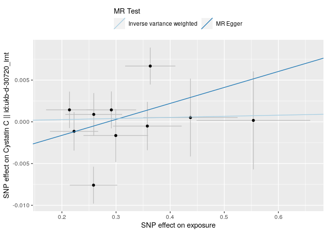

</div>

    Warning: Removed 1 rows containing missing values (`geom_errorbarh()`).
    Removed 1 rows containing missing values (`geom_point()`).

<div class="cell-output-display">


</div>

<div class="cell-output-display">


</div>

    Warning: Removed 1 rows containing missing values (`geom_errorbarh()`).
    Removed 1 rows containing missing values (`geom_point()`).

<div class="cell-output-display">


</div>

    Warning: Removed 1 rows containing missing values (`geom_errorbarh()`).
    Removed 1 rows containing missing values (`geom_point()`).

<div class="cell-output-display">


</div>

    Warning: Removed 1 rows containing missing values (`geom_errorbarh()`).
    Removed 1 rows containing missing values (`geom_point()`).

<div class="cell-output-display">


</div>

    Warning: Removed 1 rows containing missing values (`geom_errorbarh()`).
    Removed 1 rows containing missing values (`geom_point()`).

<div class="cell-output-display">


</div>

    Warning: Removed 1 rows containing missing values (`geom_errorbarh()`).
    Removed 1 rows containing missing values (`geom_point()`).

<div class="cell-output-display">


</div>

    Warning: Removed 1 rows containing missing values (`geom_errorbarh()`).
    Removed 1 rows containing missing values (`geom_point()`).

<div class="cell-output-display">


</div>

    Warning: Removed 1 rows containing missing values (`geom_errorbarh()`).
    Removed 1 rows containing missing values (`geom_point()`).

<div class="cell-output-display">


</div>

    Warning: Removed 1 rows containing missing values (`geom_errorbarh()`).
    Removed 1 rows containing missing values (`geom_point()`).

<div class="cell-output-display">

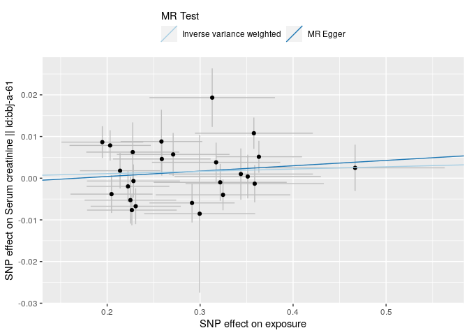

</div>

    Warning: Removed 1 rows containing missing values (`geom_errorbarh()`).
    Removed 1 rows containing missing values (`geom_point()`).

<div class="cell-output-display">


</div>

    Warning: Removed 1 rows containing missing values (`geom_errorbarh()`).
    Removed 1 rows containing missing values (`geom_point()`).

<div class="cell-output-display">


</div>

    Warning: Removed 1 rows containing missing values (`geom_errorbarh()`).
    Removed 1 rows containing missing values (`geom_point()`).

<div class="cell-output-display">


</div>

    Warning: Removed 1 rows containing missing values (`geom_errorbarh()`).
    Removed 1 rows containing missing values (`geom_point()`).

<div class="cell-output-display">


</div>

    Warning: Removed 1 rows containing missing values (`geom_errorbarh()`).
    Removed 1 rows containing missing values (`geom_point()`).

<div class="cell-output-display">


</div>

    Warning: Removed 1 rows containing missing values (`geom_errorbarh()`).
    Removed 1 rows containing missing values (`geom_point()`).

<div class="cell-output-display">


</div>

    Warning: Removed 1 rows containing missing values (`geom_errorbarh()`).
    Removed 1 rows containing missing values (`geom_point()`).

<div class="cell-output-display">


</div>

    Warning: Removed 1 rows containing missing values (`geom_errorbarh()`).
    Removed 1 rows containing missing values (`geom_point()`).

<div class="cell-output-display">


</div>

    Warning: Removed 1 rows containing missing values (`geom_errorbarh()`).
    Removed 1 rows containing missing values (`geom_point()`).

<div class="cell-output-display">

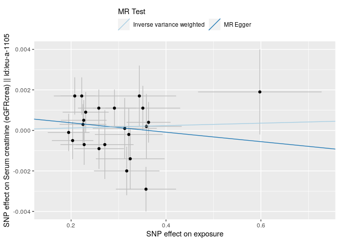

</div>

    Warning: Removed 1 rows containing missing values (`geom_errorbarh()`).
    Removed 1 rows containing missing values (`geom_point()`).

<div class="cell-output-display">


</div>

    Warning: Removed 1 rows containing missing values (`geom_errorbarh()`).
    Removed 1 rows containing missing values (`geom_point()`).

<div class="cell-output-display">


</div>

    Warning: Removed 1 rows containing missing values (`geom_errorbarh()`).
    Removed 1 rows containing missing values (`geom_point()`).

<div class="cell-output-display">


</div>

    Warning: Removed 1 rows containing missing values (`geom_errorbarh()`).
    Removed 1 rows containing missing values (`geom_point()`).

<div class="cell-output-display">


</div>

    Warning: Removed 1 rows containing missing values (`geom_errorbarh()`).
    Removed 1 rows containing missing values (`geom_point()`).

<div class="cell-output-display">


</div>

    Warning: Removed 1 rows containing missing values (`geom_errorbarh()`).
    Removed 1 rows containing missing values (`geom_point()`).

<div class="cell-output-display">


</div>

    Warning: Removed 1 rows containing missing values (`geom_errorbarh()`).
    Removed 1 rows containing missing values (`geom_point()`).

<div class="cell-output-display">


</div>

<div class="cell-output-display">


</div>

    Warning: Removed 1 rows containing missing values (`geom_errorbarh()`).
    Removed 1 rows containing missing values (`geom_point()`).

<div class="cell-output-display">


</div>

    Warning: Removed 1 rows containing missing values (`geom_errorbarh()`).
    Removed 1 rows containing missing values (`geom_point()`).

<div class="cell-output-display">


</div>

    Warning: Removed 1 rows containing missing values (`geom_errorbarh()`).
    Removed 1 rows containing missing values (`geom_point()`).

<div class="cell-output-display">


</div>

    Warning: Removed 1 rows containing missing values (`geom_errorbarh()`).
    Removed 1 rows containing missing values (`geom_point()`).

<div class="cell-output-display">


</div>

    Warning: Removed 1 rows containing missing values (`geom_errorbarh()`).
    Removed 1 rows containing missing values (`geom_point()`).

<div class="cell-output-display">

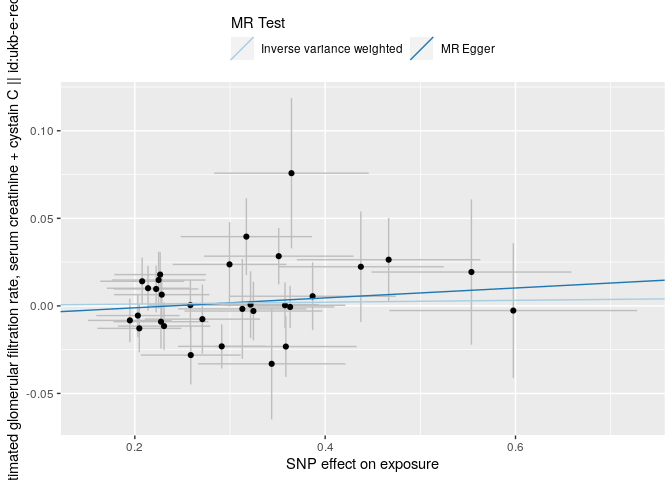

</div>

    Warning: Removed 1 rows containing missing values (`geom_errorbarh()`).
    Removed 1 rows containing missing values (`geom_point()`).

<div class="cell-output-display">


</div>

    Warning: Removed 1 rows containing missing values (`geom_errorbarh()`).
    Removed 1 rows containing missing values (`geom_point()`).

<div class="cell-output-display">


</div>

    Warning: Removed 1 rows containing missing values (`geom_errorbarh()`).
    Removed 1 rows containing missing values (`geom_point()`).

<div class="cell-output-display">


</div>

    Warning: Removed 1 rows containing missing values (`geom_errorbarh()`).
    Removed 1 rows containing missing values (`geom_point()`).

<div class="cell-output-display">


</div>

    Warning: Removed 1 rows containing missing values (`geom_errorbarh()`).
    Removed 1 rows containing missing values (`geom_point()`).

<div class="cell-output-display">


</div>

    Warning: Removed 1 rows containing missing values (`geom_errorbarh()`).
    Removed 1 rows containing missing values (`geom_point()`).

<div class="cell-output-display">


</div>

    Warning: Removed 1 rows containing missing values (`geom_errorbarh()`).
    Removed 1 rows containing missing values (`geom_point()`).

<div class="cell-output-display">

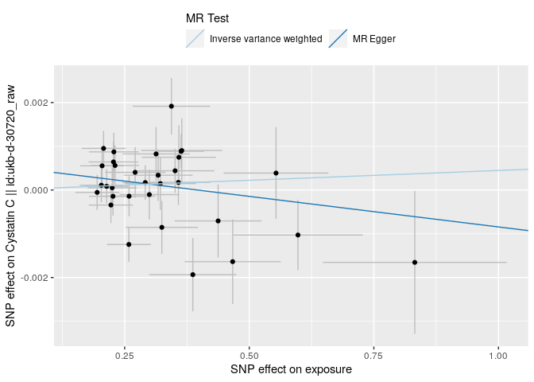

</div>

    Warning: Removed 1 rows containing missing values (`geom_errorbarh()`).
    Removed 1 rows containing missing values (`geom_point()`).

<div class="cell-output-display">


</div>

    Warning: Removed 1 rows containing missing values (`geom_errorbarh()`).
    Removed 1 rows containing missing values (`geom_point()`).

<div class="cell-output-display">


</div>

    Warning: Removed 1 rows containing missing values (`geom_errorbarh()`).
    Removed 1 rows containing missing values (`geom_point()`).

<div class="cell-output-display">


</div>

    Warning: Removed 1 rows containing missing values (`geom_errorbarh()`).
    Removed 1 rows containing missing values (`geom_point()`).

<div class="cell-output-display">


</div>

    Warning: Removed 1 rows containing missing values (`geom_errorbarh()`).
    Removed 1 rows containing missing values (`geom_point()`).

<div class="cell-output-display">


</div>

    Warning: Removed 1 rows containing missing values (`geom_errorbarh()`).
    Removed 1 rows containing missing values (`geom_point()`).

<div class="cell-output-display">


</div>

    Warning: Removed 1 rows containing missing values (`geom_errorbarh()`).
    Removed 1 rows containing missing values (`geom_point()`).

<div class="cell-output-display">

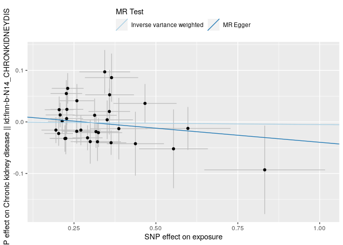

</div>

<div class="cell-output-display">


</div>

<div class="cell-output-display">


</div>

<div class="cell-output-display">


</div>

<div class="cell-output-display">


</div>

<div class="cell-output-display">


</div>

<div class="cell-output-display">


</div>

<div class="cell-output-display">


</div>

<div class="cell-output-display">


</div>

<div class="cell-output-display">


</div>

<div class="cell-output-display">


</div>

<div class="cell-output-display">


</div>

<div class="cell-output-display">


</div>

<div class="cell-output-display">


</div>

<div class="cell-output-display">


</div>

<div class="cell-output-display">


</div>

<div class="cell-output-display">


</div>

<div class="cell-output-display">


</div>

<div class="cell-output-display">


</div>

<div class="cell-output-display">


</div>

<div class="cell-output-display">


</div>

<div class="cell-output-display">


</div>

<div class="cell-output-display">


</div>

<div class="cell-output-display">


</div>

<div class="cell-output-display">


</div>

### MR for id trait ncase group_name year author consortium sex pmid population unit sample_size build ncontrol category subcategory ontology note mr nsnp priority sd outcomes

    Extracting data for 10 SNP(s) from 9 GWAS(s)

    Server code: 502; Server is possibly experiencing traffic, trying again...

    Retry succeeded!

    Finding proxies for 2 SNPs in outcome ukb-e-30720_AFR

    Extracting data for 2 SNP(s) from 1 GWAS(s)

    Server code: 502; Server is possibly experiencing traffic, trying again...

    Retry succeeded!

    Finding proxies for 7 SNPs in outcome prot-c-2609_59_2

    Extracting data for 7 SNP(s) from 1 GWAS(s)

    Server code: 502; Server is possibly experiencing traffic, trying again...

    Retry succeeded!

    Finding proxies for 1 SNPs in outcome ukb-e-30720_EAS

    Extracting data for 1 SNP(s) from 1 GWAS(s)

    Server code: 502; Server is possibly experiencing traffic, trying again...
    Server code: 502; Server is possibly experiencing traffic, trying again...
    Server code: 502; Server is possibly experiencing traffic, trying again...
    Server code: 502; Server is possibly experiencing traffic, trying again...

    Retry succeeded!

    Finding proxies for 6 SNPs in outcome ieu-a-1106

    Extracting data for 6 SNP(s) from 1 GWAS(s)

    Server code: 502; Server is possibly experiencing traffic, trying again...

    Retry succeeded!

    Finding proxies for 6 SNPs in outcome ebi-a-GCST003375

    Extracting data for 6 SNP(s) from 1 GWAS(s)

    Harmonising exposure (W9v8KN) and Glomerular filtration rate (cystatin C) || id:ebi-a-GCST003375 (ebi-a-GCST003375)

    Harmonising exposure (W9v8KN) and Serum cystatin C (eGFRcys) || id:ieu-a-1106 (ieu-a-1106)

    Harmonising exposure (W9v8KN) and Cystatin C || id:prot-c-2609_59_2 (prot-c-2609_59_2)

    Harmonising exposure (W9v8KN) and Cystatin C || id:ukb-d-30720_irnt (ukb-d-30720_irnt)

    Harmonising exposure (W9v8KN) and Cystatin C || id:ukb-d-30720_raw (ukb-d-30720_raw)

    Harmonising exposure (W9v8KN) and Cystatin C || id:ukb-e-30720_AFR (ukb-e-30720_AFR)

    Harmonising exposure (W9v8KN) and Cystatin C || id:ukb-e-30720_CSA (ukb-e-30720_CSA)

    Harmonising exposure (W9v8KN) and Cystatin C || id:ukb-e-30720_EAS (ukb-e-30720_EAS)

    Harmonising exposure (W9v8KN) and Cystatin C || id:ukb-e-30720_MID (ukb-e-30720_MID)

    Analysing 'W9v8KN' on 'ebi-a-GCST003375'

    Analysing 'W9v8KN' on 'ieu-a-1106'

    Analysing 'W9v8KN' on 'prot-c-2609_59_2'

    Analysing 'W9v8KN' on 'ukb-d-30720_irnt'

    Analysing 'W9v8KN' on 'ukb-d-30720_raw'

    Analysing 'W9v8KN' on 'ukb-e-30720_AFR'

    Analysing 'W9v8KN' on 'ukb-e-30720_CSA'

    Analysing 'W9v8KN' on 'ukb-e-30720_EAS'

    Analysing 'W9v8KN' on 'ukb-e-30720_MID'

    Warning in !is.null(caption) && !is.na(caption): 'length(x) = 22 > 1' in
    coercion to 'logical(1)'

| id.exposure | id.outcome       | outcome                                                          | exposure | method                    | nsnp |          b |        se |      pval |
|:------------|:-----------------|:-----------------------------------------------------------------|:---------|:--------------------------|-----:|-----------:|----------:|----------:|
| W9v8KN      | ebi-a-GCST003375 | Glomerular filtration rate (cystatin C) \|\| id:ebi-a-GCST003375 | exposure | MR Egger                  |    6 | -0.0103318 | 0.0186586 | 0.6092581 |
| W9v8KN      | ebi-a-GCST003375 | Glomerular filtration rate (cystatin C) \|\| id:ebi-a-GCST003375 | exposure | Inverse variance weighted |    6 | -0.0004819 | 0.0030260 | 0.8734598 |
| W9v8KN      | ieu-a-1106       | Serum cystatin C (eGFRcys) \|\| id:ieu-a-1106                    | exposure | MR Egger                  |    6 | -0.0102715 | 0.0209548 | 0.6496807 |
| W9v8KN      | ieu-a-1106       | Serum cystatin C (eGFRcys) \|\| id:ieu-a-1106                    | exposure | Inverse variance weighted |    6 | -0.0005065 | 0.0033731 | 0.8806472 |
| W9v8KN      | prot-c-2609_59_2 | Cystatin C \|\| id:prot-c-2609_59_2                              | exposure | MR Egger                  |    6 | -0.3811137 | 0.5644642 | 0.5365802 |
| W9v8KN      | prot-c-2609_59_2 | Cystatin C \|\| id:prot-c-2609_59_2                              | exposure | Inverse variance weighted |    6 | -0.0091609 | 0.0941108 | 0.9224551 |
| W9v8KN      | ukb-d-30720_irnt | Cystatin C \|\| id:ukb-d-30720_irnt                              | exposure | MR Egger                  |   10 |  0.0191350 | 0.0186923 | 0.3359400 |
| W9v8KN      | ukb-d-30720_irnt | Cystatin C \|\| id:ukb-d-30720_irnt                              | exposure | Inverse variance weighted |   10 |  0.0013242 | 0.0043741 | 0.7620868 |
| W9v8KN      | ukb-d-30720_raw  | Cystatin C \|\| id:ukb-d-30720_raw                               | exposure | MR Egger                  |   10 |  0.0034374 | 0.0028112 | 0.2562191 |
| W9v8KN      | ukb-d-30720_raw  | Cystatin C \|\| id:ukb-d-30720_raw                               | exposure | Inverse variance weighted |   10 | -0.0000791 | 0.0006829 | 0.9077318 |
| W9v8KN      | ukb-e-30720_AFR  | Cystatin C \|\| id:ukb-e-30720_AFR                               | exposure | MR Egger                  |    8 | -0.1359232 | 0.1786155 | 0.4755016 |
| W9v8KN      | ukb-e-30720_AFR  | Cystatin C \|\| id:ukb-e-30720_AFR                               | exposure | Inverse variance weighted |    8 |  0.0027891 | 0.0301980 | 0.9264126 |
| W9v8KN      | ukb-e-30720_CSA  | Cystatin C \|\| id:ukb-e-30720_CSA                               | exposure | MR Egger                  |   10 | -0.0078977 | 0.0882685 | 0.9309050 |
| W9v8KN      | ukb-e-30720_CSA  | Cystatin C \|\| id:ukb-e-30720_CSA                               | exposure | Inverse variance weighted |   10 |  0.0034604 | 0.0188193 | 0.8541113 |
| W9v8KN      | ukb-e-30720_EAS  | Cystatin C \|\| id:ukb-e-30720_EAS                               | exposure | MR Egger                  |    9 |  0.0348597 | 0.1842157 | 0.8552799 |
| W9v8KN      | ukb-e-30720_EAS  | Cystatin C \|\| id:ukb-e-30720_EAS                               | exposure | Inverse variance weighted |    9 | -0.0593502 | 0.0353765 | 0.0934112 |
| W9v8KN      | ukb-e-30720_MID  | Cystatin C \|\| id:ukb-e-30720_MID                               | exposure | MR Egger                  |   10 |  0.3034197 | 0.2034669 | 0.1742350 |
| W9v8KN      | ukb-e-30720_MID  | Cystatin C \|\| id:ukb-e-30720_MID                               | exposure | Inverse variance weighted |   10 |  0.0656700 | 0.0490388 | 0.1805238 |

MR Egger and MR IVW for id Table: MR Egger and MR IVW for trait Table:
MR Egger and MR IVW for ncase Table: MR Egger and MR IVW for group_name
Table: MR Egger and MR IVW for year Table: MR Egger and MR IVW for
author Table: MR Egger and MR IVW for consortium Table: MR Egger and MR
IVW for sex Table: MR Egger and MR IVW for pmid Table: MR Egger and MR
IVW for population Table: MR Egger and MR IVW for unit Table: MR Egger
and MR IVW for sample_size Table: MR Egger and MR IVW for build Table:
MR Egger and MR IVW for ncontrol Table: MR Egger and MR IVW for category
Table: MR Egger and MR IVW for subcategory Table: MR Egger and MR IVW
for ontology Table: MR Egger and MR IVW for note Table: MR Egger and MR
IVW for mr Table: MR Egger and MR IVW for nsnp Table: MR Egger and MR
IVW for priority Table: MR Egger and MR IVW for sd

    Warning in !is.null(caption) && !is.na(caption): 'length(x) = 22 > 1' in
    coercion to 'logical(1)'

| id.exposure | id.outcome       | outcome                                                          | exposure | method                    |         Q | Q_df |    Q_pval |
|:------------|:-----------------|:-----------------------------------------------------------------|:---------|:--------------------------|----------:|-----:|----------:|
| W9v8KN      | ebi-a-GCST003375 | Glomerular filtration rate (cystatin C) \|\| id:ebi-a-GCST003375 | exposure | MR Egger                  |  5.049180 |    4 | 0.2822884 |
| W9v8KN      | ebi-a-GCST003375 | Glomerular filtration rate (cystatin C) \|\| id:ebi-a-GCST003375 | exposure | Inverse variance weighted |  5.412086 |    5 | 0.3676822 |
| W9v8KN      | ieu-a-1106       | Serum cystatin C (eGFRcys) \|\| id:ieu-a-1106                    | exposure | MR Egger                  |  6.368350 |    4 | 0.1732767 |
| W9v8KN      | ieu-a-1106       | Serum cystatin C (eGFRcys) \|\| id:ieu-a-1106                    | exposure | Inverse variance weighted |  6.725029 |    5 | 0.2419065 |
| W9v8KN      | prot-c-2609_59_2 | Cystatin C \|\| id:prot-c-2609_59_2                              | exposure | MR Egger                  |  9.886757 |    4 | 0.0423791 |
| W9v8KN      | prot-c-2609_59_2 | Cystatin C \|\| id:prot-c-2609_59_2                              | exposure | Inverse variance weighted | 10.994613 |    5 | 0.0514869 |
| W9v8KN      | ukb-d-30720_irnt | Cystatin C \|\| id:ukb-d-30720_irnt                              | exposure | MR Egger                  | 19.815452 |    8 | 0.0110573 |
| W9v8KN      | ukb-d-30720_irnt | Cystatin C \|\| id:ukb-d-30720_irnt                              | exposure | Inverse variance weighted | 22.195149 |    9 | 0.0082806 |
| W9v8KN      | ukb-d-30720_raw  | Cystatin C \|\| id:ukb-d-30720_raw                               | exposure | MR Egger                  | 14.049098 |    8 | 0.0804946 |
| W9v8KN      | ukb-d-30720_raw  | Cystatin C \|\| id:ukb-d-30720_raw                               | exposure | Inverse variance weighted | 16.956974 |    9 | 0.0493940 |
| W9v8KN      | ukb-e-30720_AFR  | Cystatin C \|\| id:ukb-e-30720_AFR                               | exposure | MR Egger                  |  1.417774 |    6 | 0.9647683 |
| W9v8KN      | ukb-e-30720_AFR  | Cystatin C \|\| id:ukb-e-30720_AFR                               | exposure | Inverse variance weighted |  2.038623 |    7 | 0.9576717 |
| W9v8KN      | ukb-e-30720_CSA  | Cystatin C \|\| id:ukb-e-30720_CSA                               | exposure | MR Egger                  |  9.006794 |    8 | 0.3417232 |
| W9v8KN      | ukb-e-30720_CSA  | Cystatin C \|\| id:ukb-e-30720_CSA                               | exposure | Inverse variance weighted |  9.026438 |    9 | 0.4348373 |
| W9v8KN      | ukb-e-30720_EAS  | Cystatin C \|\| id:ukb-e-30720_EAS                               | exposure | MR Egger                  |  8.675600 |    7 | 0.2767931 |
| W9v8KN      | ukb-e-30720_EAS  | Cystatin C \|\| id:ukb-e-30720_EAS                               | exposure | Inverse variance weighted |  9.013452 |    8 | 0.3411624 |
| W9v8KN      | ukb-e-30720_MID  | Cystatin C \|\| id:ukb-e-30720_MID                               | exposure | MR Egger                  |  9.919298 |    8 | 0.2707359 |
| W9v8KN      | ukb-e-30720_MID  | Cystatin C \|\| id:ukb-e-30720_MID                               | exposure | Inverse variance weighted | 11.711439 |    9 | 0.2300701 |

Heterogeneity test for id Table: Heterogeneity test for trait Table:
Heterogeneity test for ncase Table: Heterogeneity test for group_name
Table: Heterogeneity test for year Table: Heterogeneity test for author
Table: Heterogeneity test for consortium Table: Heterogeneity test for
sex Table: Heterogeneity test for pmid Table: Heterogeneity test for
population Table: Heterogeneity test for unit Table: Heterogeneity test
for sample_size Table: Heterogeneity test for build Table: Heterogeneity
test for ncontrol Table: Heterogeneity test for category Table:
Heterogeneity test for subcategory Table: Heterogeneity test for
ontology Table: Heterogeneity test for note Table: Heterogeneity test
for mr Table: Heterogeneity test for nsnp Table: Heterogeneity test for
priority Table: Heterogeneity test for sd

    Warning in !is.null(caption) && !is.na(caption): 'length(x) = 22 > 1' in
    coercion to 'logical(1)'

| id.exposure | id.outcome       | outcome                                                          | exposure | egger_intercept |        se |      pval |
|:------------|:-----------------|:-----------------------------------------------------------------|:---------|----------------:|----------:|----------:|
| W9v8KN      | ebi-a-GCST003375 | Glomerular filtration rate (cystatin C) \|\| id:ebi-a-GCST003375 | exposure |       0.0028897 | 0.0053893 | 0.6202578 |
| W9v8KN      | ieu-a-1106       | Serum cystatin C (eGFRcys) \|\| id:ieu-a-1106                    | exposure |       0.0028648 | 0.0060525 | 0.6606589 |
| W9v8KN      | prot-c-2609_59_2 | Cystatin C \|\| id:prot-c-2609_59_2                              | exposure |       0.1115957 | 0.1666874 | 0.5398439 |
| W9v8KN      | ukb-d-30720_irnt | Cystatin C \|\| id:ukb-d-30720_irnt                              | exposure |      -0.0054488 | 0.0055590 | 0.3557075 |
| W9v8KN      | ukb-d-30720_raw  | Cystatin C \|\| id:ukb-d-30720_raw                               | exposure |      -0.0010758 | 0.0008360 | 0.2341498 |
| W9v8KN      | ukb-e-30720_AFR  | Cystatin C \|\| id:ukb-e-30720_AFR                               | exposure |       0.0376351 | 0.0477640 | 0.4607181 |
| W9v8KN      | ukb-e-30720_CSA  | Cystatin C \|\| id:ukb-e-30720_CSA                               | exposure |       0.0035042 | 0.0265284 | 0.8981740 |
| W9v8KN      | ukb-e-30720_EAS  | Cystatin C \|\| id:ukb-e-30720_EAS                               | exposure |      -0.0277648 | 0.0531780 | 0.6177030 |
| W9v8KN      | ukb-e-30720_MID  | Cystatin C \|\| id:ukb-e-30720_MID                               | exposure |      -0.0726628 | 0.0604396 | 0.2636462 |

Pleiotropy test for id Table: Pleiotropy test for trait Table:
Pleiotropy test for ncase Table: Pleiotropy test for group_name Table:
Pleiotropy test for year Table: Pleiotropy test for author Table:
Pleiotropy test for consortium Table: Pleiotropy test for sex Table:
Pleiotropy test for pmid Table: Pleiotropy test for population Table:
Pleiotropy test for unit Table: Pleiotropy test for sample_size Table:
Pleiotropy test for build Table: Pleiotropy test for ncontrol Table:
Pleiotropy test for category Table: Pleiotropy test for subcategory
Table: Pleiotropy test for ontology Table: Pleiotropy test for note
Table: Pleiotropy test for mr Table: Pleiotropy test for nsnp Table:
Pleiotropy test for priority Table: Pleiotropy test for sd

    Warning in !is.null(caption) && !is.na(caption): 'length(x) = 22 > 1' in
    coercion to 'logical(1)'

| exposure | outcome                                                          | id.exposure | id.outcome       | samplesize | SNP                             |          b |        se |         p |
|:---------|:-----------------------------------------------------------------|:------------|:-----------------|-----------:|:--------------------------------|-----------:|----------:|----------:|
| exposure | Glomerular filtration rate (cystatin C) \|\| id:ebi-a-GCST003375 | W9v8KN      | ebi-a-GCST003375 |      32834 | rs11172113                      |  0.0113285 | 0.0068658 | 0.0989429 |
| exposure | Glomerular filtration rate (cystatin C) \|\| id:ebi-a-GCST003375 | W9v8KN      | ebi-a-GCST003375 |      32834 | rs199454                        | -0.0100464 | 0.0085008 | 0.2372779 |
| exposure | Glomerular filtration rate (cystatin C) \|\| id:ebi-a-GCST003375 | W9v8KN      | ebi-a-GCST003375 |      32834 | rs2590784                       |  0.0004496 | 0.0085432 | 0.9580255 |
| exposure | Glomerular filtration rate (cystatin C) \|\| id:ebi-a-GCST003375 | W9v8KN      | ebi-a-GCST003375 |      32834 | rs2681492                       | -0.0033538 | 0.0072666 | 0.6444123 |
| exposure | Glomerular filtration rate (cystatin C) \|\| id:ebi-a-GCST003375 | W9v8KN      | ebi-a-GCST003375 |      32834 | rs7301566                       |  0.0030960 | 0.0069659 | 0.6567213 |
| exposure | Glomerular filtration rate (cystatin C) \|\| id:ebi-a-GCST003375 | W9v8KN      | ebi-a-GCST003375 |      32834 | rs9349379                       | -0.0055066 | 0.0057819 | 0.3409038 |
| exposure | Glomerular filtration rate (cystatin C) \|\| id:ebi-a-GCST003375 | W9v8KN      | ebi-a-GCST003375 |      32834 | All - Inverse variance weighted | -0.0004819 | 0.0030260 | 0.8734598 |
| exposure | Glomerular filtration rate (cystatin C) \|\| id:ebi-a-GCST003375 | W9v8KN      | ebi-a-GCST003375 |      32834 | All - MR Egger                  | -0.0103318 | 0.0186586 | 0.6092581 |
| exposure | Serum cystatin C (eGFRcys) \|\| id:ieu-a-1106                    | W9v8KN      | ieu-a-1106       |      33144 | rs11172113                      |  0.0113285 | 0.0068658 | 0.0989429 |
| exposure | Serum cystatin C (eGFRcys) \|\| id:ieu-a-1106                    | W9v8KN      | ieu-a-1106       |      33144 | rs199454                        | -0.0131376 | 0.0085008 | 0.1222364 |
| exposure | Serum cystatin C (eGFRcys) \|\| id:ieu-a-1106                    | W9v8KN      | ieu-a-1106       |      33144 | rs2590784                       |  0.0004496 | 0.0085432 | 0.9580255 |
| exposure | Serum cystatin C (eGFRcys) \|\| id:ieu-a-1106                    | W9v8KN      | ieu-a-1106       |      33144 | rs2681492                       | -0.0033538 | 0.0072666 | 0.6444123 |
| exposure | Serum cystatin C (eGFRcys) \|\| id:ieu-a-1106                    | W9v8KN      | ieu-a-1106       |      33144 | rs7301566                       |  0.0050310 | 0.0069659 | 0.4701579 |
| exposure | Serum cystatin C (eGFRcys) \|\| id:ieu-a-1106                    | W9v8KN      | ieu-a-1106       |      33144 | rs9349379                       | -0.0055066 | 0.0057819 | 0.3409038 |
| exposure | Serum cystatin C (eGFRcys) \|\| id:ieu-a-1106                    | W9v8KN      | ieu-a-1106       |      33144 | All - Inverse variance weighted | -0.0005065 | 0.0033731 | 0.8806472 |
| exposure | Serum cystatin C (eGFRcys) \|\| id:ieu-a-1106                    | W9v8KN      | ieu-a-1106       |      33144 | All - MR Egger                  | -0.0102715 | 0.0209548 | 0.6496807 |
| exposure | Cystatin C \|\| id:prot-c-2609_59_2                              | W9v8KN      | prot-c-2609_59_2 |        995 | rs11172113                      | -0.2993821 | 0.1485029 | 0.0437998 |
| exposure | Cystatin C \|\| id:prot-c-2609_59_2                              | W9v8KN      | prot-c-2609_59_2 |        995 | rs199454                        |  0.4146059 | 0.2053520 | 0.0434871 |
| exposure | Cystatin C \|\| id:prot-c-2609_59_2                              | W9v8KN      | prot-c-2609_59_2 |        995 | rs2590784                       |  0.2787770 | 0.2005589 | 0.1645287 |
| exposure | Cystatin C \|\| id:prot-c-2609_59_2                              | W9v8KN      | prot-c-2609_59_2 |        995 | rs2681492                       |  0.0667412 | 0.1556828 | 0.6681416 |
| exposure | Cystatin C \|\| id:prot-c-2609_59_2                              | W9v8KN      | prot-c-2609_59_2 |        995 | rs7301566                       | -0.1265480 | 0.1635832 | 0.4391673 |
| exposure | Cystatin C \|\| id:prot-c-2609_59_2                              | W9v8KN      | prot-c-2609_59_2 |        995 | rs9349379                       | -0.0460352 | 0.1149157 | 0.6887147 |
| exposure | Cystatin C \|\| id:prot-c-2609_59_2                              | W9v8KN      | prot-c-2609_59_2 |        995 | All - Inverse variance weighted | -0.0091609 | 0.0941108 | 0.9224551 |
| exposure | Cystatin C \|\| id:prot-c-2609_59_2                              | W9v8KN      | prot-c-2609_59_2 |        995 | All - MR Egger                  | -0.3811137 | 0.5644642 | 0.5365802 |
| exposure | Cystatin C \|\| id:ukb-d-30720_irnt                              | W9v8KN      | ukb-d-30720_irnt |     344264 | rs11172113                      |  0.0049008 | 0.0075898 | 0.5184673 |
| exposure | Cystatin C \|\| id:ukb-d-30720_irnt                              | W9v8KN      | ukb-d-30720_irnt |     344264 | rs1777335                       |  0.0066919 | 0.0102122 | 0.5122856 |
| exposure | Cystatin C \|\| id:ukb-d-30720_irnt                              | W9v8KN      | ukb-d-30720_irnt |     344264 | rs199454                        |  0.0034326 | 0.0098539 | 0.7275780 |
| exposure | Cystatin C \|\| id:ukb-d-30720_irnt                              | W9v8KN      | ukb-d-30720_irnt |     344264 | rs2590784                       | -0.0051281 | 0.0103772 | 0.6211846 |
| exposure | Cystatin C \|\| id:ukb-d-30720_irnt                              | W9v8KN      | ukb-d-30720_irnt |     344264 | rs2681492                       | -0.0014246 | 0.0080858 | 0.8601515 |
| exposure | Cystatin C \|\| id:ukb-d-30720_irnt                              | W9v8KN      | ukb-d-30720_irnt |     344264 | rs71526759                      |  0.0011686 | 0.0106702 | 0.9127869 |
| exposure | Cystatin C \|\| id:ukb-d-30720_irnt                              | W9v8KN      | ukb-d-30720_irnt |     344264 | rs72802873                      |  0.0003054 | 0.0106039 | 0.9770222 |
| exposure | Cystatin C \|\| id:ukb-d-30720_irnt                              | W9v8KN      | ukb-d-30720_irnt |     344264 | rs7301566                       | -0.0293704 | 0.0085430 | 0.0005861 |
| exposure | Cystatin C \|\| id:ukb-d-30720_irnt                              | W9v8KN      | ukb-d-30720_irnt |     344264 | rs9349379                       |  0.0183929 | 0.0061044 | 0.0025861 |
| exposure | Cystatin C \|\| id:ukb-d-30720_irnt                              | W9v8KN      | ukb-d-30720_irnt |     344264 | rs9508309                       | -0.0054932 | 0.0106270 | 0.6052236 |
| exposure | Cystatin C \|\| id:ukb-d-30720_irnt                              | W9v8KN      | ukb-d-30720_irnt |     344264 | All - Inverse variance weighted |  0.0013242 | 0.0043741 | 0.7620868 |
| exposure | Cystatin C \|\| id:ukb-d-30720_irnt                              | W9v8KN      | ukb-d-30720_irnt |     344264 | All - MR Egger                  |  0.0191350 | 0.0186923 | 0.3359400 |
| exposure | Cystatin C \|\| id:ukb-d-30720_raw                               | W9v8KN      | ukb-d-30720_raw  |     344264 | rs11172113                      |  0.0005862 | 0.0013555 | 0.6654356 |
| exposure | Cystatin C \|\| id:ukb-d-30720_raw                               | W9v8KN      | ukb-d-30720_raw  |     344264 | rs1777335                       |  0.0003945 | 0.0018239 | 0.8287804 |
| exposure | Cystatin C \|\| id:ukb-d-30720_raw                               | W9v8KN      | ukb-d-30720_raw  |     344264 | rs199454                        | -0.0005464 | 0.0017600 | 0.7562251 |
| exposure | Cystatin C \|\| id:ukb-d-30720_raw                               | W9v8KN      | ukb-d-30720_raw  |     344264 | rs2590784                       | -0.0015415 | 0.0018534 | 0.4055738 |
| exposure | Cystatin C \|\| id:ukb-d-30720_raw                               | W9v8KN      | ukb-d-30720_raw  |     344264 | rs2681492                       |  0.0004880 | 0.0014442 | 0.7354235 |
| exposure | Cystatin C \|\| id:ukb-d-30720_raw                               | W9v8KN      | ukb-d-30720_raw  |     344264 | rs71526759                      | -0.0016147 | 0.0019058 | 0.3968425 |
| exposure | Cystatin C \|\| id:ukb-d-30720_raw                               | W9v8KN      | ukb-d-30720_raw  |     344264 | rs72802873                      |  0.0006999 | 0.0018940 | 0.7117442 |
| exposure | Cystatin C \|\| id:ukb-d-30720_raw                               | W9v8KN      | ukb-d-30720_raw  |     344264 | rs7301566                       | -0.0048166 | 0.0015258 | 0.0015955 |
| exposure | Cystatin C \|\| id:ukb-d-30720_raw                               | W9v8KN      | ukb-d-30720_raw  |     344264 | rs9349379                       |  0.0024363 | 0.0010903 | 0.0254522 |
| exposure | Cystatin C \|\| id:ukb-d-30720_raw                               | W9v8KN      | ukb-d-30720_raw  |     344264 | rs9508309                       | -0.0003504 | 0.0018980 | 0.8535534 |
| exposure | Cystatin C \|\| id:ukb-d-30720_raw                               | W9v8KN      | ukb-d-30720_raw  |     344264 | All - Inverse variance weighted | -0.0000791 | 0.0006829 | 0.9077318 |
| exposure | Cystatin C \|\| id:ukb-d-30720_raw                               | W9v8KN      | ukb-d-30720_raw  |     344264 | All - MR Egger                  |  0.0034374 | 0.0028112 | 0.2562191 |
| exposure | Cystatin C \|\| id:ukb-e-30720_AFR                               | W9v8KN      | ukb-e-30720_AFR  |         NA | rs11172113                      | -0.0457261 | 0.0600069 | 0.4460518 |
| exposure | Cystatin C \|\| id:ukb-e-30720_AFR                               | W9v8KN      | ukb-e-30720_AFR  |         NA | rs1777335                       |  0.0471716 | 0.0904628 | 0.6020554 |
| exposure | Cystatin C \|\| id:ukb-e-30720_AFR                               | W9v8KN      | ukb-e-30720_AFR  |         NA | rs199454                        |  0.0693586 | 0.0687403 | 0.3129776 |
| exposure | Cystatin C \|\| id:ukb-e-30720_AFR                               | W9v8KN      | ukb-e-30720_AFR  |         NA | rs2590784                       |  0.0118885 | 0.0818795 | 0.8845570 |
| exposure | Cystatin C \|\| id:ukb-e-30720_AFR                               | W9v8KN      | ukb-e-30720_AFR  |         NA | rs2681492                       | -0.0197652 | 0.0736445 | 0.7884014 |
| exposure | Cystatin C \|\| id:ukb-e-30720_AFR                               | W9v8KN      | ukb-e-30720_AFR  |         NA | rs7301566                       | -0.0315983 | 0.1199690 | 0.7922522 |
| exposure | Cystatin C \|\| id:ukb-e-30720_AFR                               | W9v8KN      | ukb-e-30720_AFR  |         NA | rs9349379                       | -0.0160352 | 0.1410518 | 0.9094888 |
| exposure | Cystatin C \|\| id:ukb-e-30720_AFR                               | W9v8KN      | ukb-e-30720_AFR  |         NA | rs9508309                       |  0.0058932 | 0.1774290 | 0.9735038 |
| exposure | Cystatin C \|\| id:ukb-e-30720_AFR                               | W9v8KN      | ukb-e-30720_AFR  |         NA | All - Inverse variance weighted |  0.0027891 | 0.0301980 | 0.9264126 |
| exposure | Cystatin C \|\| id:ukb-e-30720_AFR                               | W9v8KN      | ukb-e-30720_AFR  |         NA | All - MR Egger                  | -0.1359232 | 0.1786155 | 0.4755016 |
| exposure | Cystatin C \|\| id:ukb-e-30720_CSA                               | W9v8KN      | ukb-e-30720_CSA  |         NA | rs11172113                      |  0.0945074 | 0.0502918 | 0.0602198 |
| exposure | Cystatin C \|\| id:ukb-e-30720_CSA                               | W9v8KN      | ukb-e-30720_CSA  |         NA | rs1777335                       | -0.0495091 | 0.0694717 | 0.4760615 |
| exposure | Cystatin C \|\| id:ukb-e-30720_CSA                               | W9v8KN      | ukb-e-30720_CSA  |         NA | rs199454                        |  0.1229134 | 0.0749614 | 0.1010695 |
| exposure | Cystatin C \|\| id:ukb-e-30720_CSA                               | W9v8KN      | ukb-e-30720_CSA  |         NA | rs2590784                       | -0.0554406 | 0.0697392 | 0.4266304 |
| exposure | Cystatin C \|\| id:ukb-e-30720_CSA                               | W9v8KN      | ukb-e-30720_CSA  |         NA | rs2681492                       |  0.0044857 | 0.0423421 | 0.9156295 |
| exposure | Cystatin C \|\| id:ukb-e-30720_CSA                               | W9v8KN      | ukb-e-30720_CSA  |         NA | rs71526759                      | -0.0619200 | 0.0837029 | 0.4594458 |
| exposure | Cystatin C \|\| id:ukb-e-30720_CSA                               | W9v8KN      | ukb-e-30720_CSA  |         NA | rs72802873                      | -0.0364096 | 0.0868521 | 0.6750598 |
| exposure | Cystatin C \|\| id:ukb-e-30720_CSA                               | W9v8KN      | ukb-e-30720_CSA  |         NA | rs7301566                       | -0.0096749 | 0.0653638 | 0.8823297 |
| exposure | Cystatin C \|\| id:ukb-e-30720_CSA                               | W9v8KN      | ukb-e-30720_CSA  |         NA | rs9349379                       | -0.0061949 | 0.0387941 | 0.8731271 |
| exposure | Cystatin C \|\| id:ukb-e-30720_CSA                               | W9v8KN      | ukb-e-30720_CSA  |         NA | rs9508309                       | -0.0897496 | 0.0936227 | 0.3377449 |
| exposure | Cystatin C \|\| id:ukb-e-30720_CSA                               | W9v8KN      | ukb-e-30720_CSA  |         NA | All - Inverse variance weighted |  0.0034604 | 0.0188193 | 0.8541113 |
| exposure | Cystatin C \|\| id:ukb-e-30720_CSA                               | W9v8KN      | ukb-e-30720_CSA  |         NA | All - MR Egger                  | -0.0078977 | 0.0882685 | 0.9309050 |
| exposure | Cystatin C \|\| id:ukb-e-30720_EAS                               | W9v8KN      | ukb-e-30720_EAS  |         NA | rs11172113                      | -0.2299348 | 0.0913835 | 0.0118644 |
| exposure | Cystatin C \|\| id:ukb-e-30720_EAS                               | W9v8KN      | ukb-e-30720_EAS  |         NA | rs1777335                       | -0.1410005 | 0.1166433 | 0.2267329 |
| exposure | Cystatin C \|\| id:ukb-e-30720_EAS                               | W9v8KN      | ukb-e-30720_EAS  |         NA | rs199454                        | -0.1126352 | 0.0912287 | 0.2169622 |
| exposure | Cystatin C \|\| id:ukb-e-30720_EAS                               | W9v8KN      | ukb-e-30720_EAS  |         NA | rs2590784                       |  0.1042716 | 0.1073291 | 0.3312932 |
| exposure | Cystatin C \|\| id:ukb-e-30720_EAS                               | W9v8KN      | ukb-e-30720_EAS  |         NA | rs2681492                       | -0.0440190 | 0.0702907 | 0.5311559 |
| exposure | Cystatin C \|\| id:ukb-e-30720_EAS                               | W9v8KN      | ukb-e-30720_EAS  |         NA | rs71526759                      |  0.1609371 | 0.3133714 | 0.6075549 |
| exposure | Cystatin C \|\| id:ukb-e-30720_EAS                               | W9v8KN      | ukb-e-30720_EAS  |         NA | rs7301566                       | -0.1580882 | 0.1469427 | 0.2819946 |
| exposure | Cystatin C \|\| id:ukb-e-30720_EAS                               | W9v8KN      | ukb-e-30720_EAS  |         NA | rs9349379                       |  0.0096531 | 0.0676487 | 0.8865316 |
| exposure | Cystatin C \|\| id:ukb-e-30720_EAS                               | W9v8KN      | ukb-e-30720_EAS  |         NA | rs9508309                       |  0.0631720 | 0.2101169 | 0.7636802 |
| exposure | Cystatin C \|\| id:ukb-e-30720_EAS                               | W9v8KN      | ukb-e-30720_EAS  |         NA | All - Inverse variance weighted | -0.0593502 | 0.0353765 | 0.0934112 |
| exposure | Cystatin C \|\| id:ukb-e-30720_EAS                               | W9v8KN      | ukb-e-30720_EAS  |         NA | All - MR Egger                  |  0.0348597 | 0.1842157 | 0.8552799 |
| exposure | Cystatin C \|\| id:ukb-e-30720_MID                               | W9v8KN      | ukb-e-30720_MID  |         NA | rs11172113                      |  0.1403364 | 0.1244078 | 0.2593050 |
| exposure | Cystatin C \|\| id:ukb-e-30720_MID                               | W9v8KN      | ukb-e-30720_MID  |         NA | rs1777335                       | -0.1504909 | 0.1591865 | 0.3444677 |
| exposure | Cystatin C \|\| id:ukb-e-30720_MID                               | W9v8KN      | ukb-e-30720_MID  |         NA | rs199454                        | -0.0972952 | 0.1427743 | 0.4955796 |
| exposure | Cystatin C \|\| id:ukb-e-30720_MID                               | W9v8KN      | ukb-e-30720_MID  |         NA | rs2590784                       | -0.1793165 | 0.1569245 | 0.2531659 |
| exposure | Cystatin C \|\| id:ukb-e-30720_MID                               | W9v8KN      | ukb-e-30720_MID  |         NA | rs2681492                       |  0.2482113 | 0.1046954 | 0.0177498 |
| exposure | Cystatin C \|\| id:ukb-e-30720_MID                               | W9v8KN      | ukb-e-30720_MID  |         NA | rs71526759                      | -0.1459886 | 0.2573714 | 0.5705585 |
| exposure | Cystatin C \|\| id:ukb-e-30720_MID                               | W9v8KN      | ukb-e-30720_MID  |         NA | rs72802873                      | -0.0591656 | 0.1467221 | 0.6867646 |
| exposure | Cystatin C \|\| id:ukb-e-30720_MID                               | W9v8KN      | ukb-e-30720_MID  |         NA | rs7301566                       |  0.1239551 | 0.1365325 | 0.3639417 |
| exposure | Cystatin C \|\| id:ukb-e-30720_MID                               | W9v8KN      | ukb-e-30720_MID  |         NA | rs9349379                       |  0.1137115 | 0.0991740 | 0.2515531 |
| exposure | Cystatin C \|\| id:ukb-e-30720_MID                               | W9v8KN      | ukb-e-30720_MID  |         NA | rs9508309                       |  0.2178965 | 0.1595659 | 0.1720778 |
| exposure | Cystatin C \|\| id:ukb-e-30720_MID                               | W9v8KN      | ukb-e-30720_MID  |         NA | All - Inverse variance weighted |  0.0656700 | 0.0490388 | 0.1805238 |
| exposure | Cystatin C \|\| id:ukb-e-30720_MID                               | W9v8KN      | ukb-e-30720_MID  |         NA | All - MR Egger                  |  0.3034197 | 0.2034669 | 0.1742350 |

Single SNP analysis for id Table: Single SNP analysis for trait Table:
Single SNP analysis for ncase Table: Single SNP analysis for group_name
Table: Single SNP analysis for year Table: Single SNP analysis for
author Table: Single SNP analysis for consortium Table: Single SNP
analysis for sex Table: Single SNP analysis for pmid Table: Single SNP
analysis for population Table: Single SNP analysis for unit Table:
Single SNP analysis for sample_size Table: Single SNP analysis for build
Table: Single SNP analysis for ncontrol Table: Single SNP analysis for
category Table: Single SNP analysis for subcategory Table: Single SNP
analysis for ontology Table: Single SNP analysis for note Table: Single
SNP analysis for mr Table: Single SNP analysis for nsnp Table: Single
SNP analysis for priority Table: Single SNP analysis for sd

    Warning in !is.null(caption) && !is.na(caption): 'length(x) = 22 > 1' in
    coercion to 'logical(1)'

<div class="cell-output-display">


</div>

| exposure | outcome                                                          | id.exposure | id.outcome       | samplesize | SNP        |          b |        se |         p |
|:---------|:-----------------------------------------------------------------|:------------|:-----------------|-----------:|:-----------|-----------:|----------:|----------:|
| exposure | Glomerular filtration rate (cystatin C) \|\| id:ebi-a-GCST003375 | W9v8KN      | ebi-a-GCST003375 |      32834 | rs11172113 | -0.0030649 | 0.0032108 | 0.3398010 |
| exposure | Glomerular filtration rate (cystatin C) \|\| id:ebi-a-GCST003375 | W9v8KN      | ebi-a-GCST003375 |      32834 | rs199454   |  0.0007862 | 0.0030953 | 0.7995084 |
| exposure | Glomerular filtration rate (cystatin C) \|\| id:ebi-a-GCST003375 | W9v8KN      | ebi-a-GCST003375 |      32834 | rs2590784  | -0.0006041 | 0.0035936 | 0.8665097 |
| exposure | Glomerular filtration rate (cystatin C) \|\| id:ebi-a-GCST003375 | W9v8KN      | ebi-a-GCST003375 |      32834 | rs2681492  |  0.0000659 | 0.0036278 | 0.9855022 |
| exposure | Glomerular filtration rate (cystatin C) \|\| id:ebi-a-GCST003375 | W9v8KN      | ebi-a-GCST003375 |      32834 | rs7301566  | -0.0012374 | 0.0036116 | 0.7318935 |
| exposure | Glomerular filtration rate (cystatin C) \|\| id:ebi-a-GCST003375 | W9v8KN      | ebi-a-GCST003375 |      32834 | rs9349379  |  0.0012202 | 0.0035299 | 0.7295833 |
| exposure | Glomerular filtration rate (cystatin C) \|\| id:ebi-a-GCST003375 | W9v8KN      | ebi-a-GCST003375 |      32834 | All        | -0.0004819 | 0.0030260 | 0.8734598 |
| exposure | Serum cystatin C (eGFRcys) \|\| id:ieu-a-1106                    | W9v8KN      | ieu-a-1106       |      33144 | rs11172113 | -0.0030948 | 0.0032108 | 0.3351107 |
| exposure | Serum cystatin C (eGFRcys) \|\| id:ieu-a-1106                    | W9v8KN      | ieu-a-1106       |      33144 | rs199454   |  0.0011682 | 0.0031810 | 0.7134332 |
| exposure | Serum cystatin C (eGFRcys) \|\| id:ieu-a-1106                    | W9v8KN      | ieu-a-1106       |      33144 | rs2590784  | -0.0006318 | 0.0040066 | 0.8746991 |
| exposure | Serum cystatin C (eGFRcys) \|\| id:ieu-a-1106                    | W9v8KN      | ieu-a-1106       |      33144 | rs2681492  |  0.0000367 | 0.0040589 | 0.9927846 |
| exposure | Serum cystatin C (eGFRcys) \|\| id:ieu-a-1106                    | W9v8KN      | ieu-a-1106       |      33144 | rs7301566  | -0.0016756 | 0.0039070 | 0.6680118 |
| exposure | Serum cystatin C (eGFRcys) \|\| id:ieu-a-1106                    | W9v8KN      | ieu-a-1106       |      33144 | rs9349379  |  0.0011874 | 0.0040256 | 0.7680273 |
| exposure | Serum cystatin C (eGFRcys) \|\| id:ieu-a-1106                    | W9v8KN      | ieu-a-1106       |      33144 | All        | -0.0005065 | 0.0033731 | 0.8806472 |
| exposure | Cystatin C \|\| id:prot-c-2609_59_2                              | W9v8KN      | prot-c-2609_59_2 |        995 | rs11172113 |  0.0556899 | 0.0882510 | 0.5280144 |
| exposure | Cystatin C \|\| id:prot-c-2609_59_2                              | W9v8KN      | prot-c-2609_59_2 |        995 | rs199454   | -0.0539112 | 0.0836576 | 0.5192984 |
| exposure | Cystatin C \|\| id:prot-c-2609_59_2                              | W9v8KN      | prot-c-2609_59_2 |        995 | rs2590784  | -0.0412019 | 0.0986909 | 0.6763242 |
| exposure | Cystatin C \|\| id:prot-c-2609_59_2                              | W9v8KN      | prot-c-2609_59_2 |        995 | rs2681492  | -0.0242885 | 0.1137246 | 0.8308800 |
| exposure | Cystatin C \|\| id:prot-c-2609_59_2                              | W9v8KN      | prot-c-2609_59_2 |        995 | rs7301566  |  0.0116389 | 0.1109692 | 0.9164681 |
| exposure | Cystatin C \|\| id:prot-c-2609_59_2                              | W9v8KN      | prot-c-2609_59_2 |        995 | rs9349379  |  0.0070219 | 0.1253597 | 0.9553307 |
| exposure | Cystatin C \|\| id:prot-c-2609_59_2                              | W9v8KN      | prot-c-2609_59_2 |        995 | All        | -0.0091609 | 0.0941108 | 0.9224551 |
| exposure | Cystatin C \|\| id:ukb-d-30720_irnt                              | W9v8KN      | ukb-d-30720_irnt |     344264 | rs11172113 |  0.0007676 | 0.0049585 | 0.8769816 |
| exposure | Cystatin C \|\| id:ukb-d-30720_irnt                              | W9v8KN      | ukb-d-30720_irnt |     344264 | rs1777335  |  0.0008928 | 0.0047897 | 0.8521276 |
| exposure | Cystatin C \|\| id:ukb-d-30720_irnt                              | W9v8KN      | ukb-d-30720_irnt |     344264 | rs199454   |  0.0011411 | 0.0048312 | 0.8132784 |
| exposure | Cystatin C \|\| id:ukb-d-30720_irnt                              | W9v8KN      | ukb-d-30720_irnt |     344264 | rs2590784  |  0.0018251 | 0.0047707 | 0.7020361 |
| exposure | Cystatin C \|\| id:ukb-d-30720_irnt                              | W9v8KN      | ukb-d-30720_irnt |     344264 | rs2681492  |  0.0016943 | 0.0049272 | 0.7309485 |
| exposure | Cystatin C \|\| id:ukb-d-30720_irnt                              | W9v8KN      | ukb-d-30720_irnt |     344264 | rs71526759 |  0.0013356 | 0.0048060 | 0.7810894 |
| exposure | Cystatin C \|\| id:ukb-d-30720_irnt                              | W9v8KN      | ukb-d-30720_irnt |     344264 | rs72802873 |  0.0013997 | 0.0048072 | 0.7709194 |
| exposure | Cystatin C \|\| id:ukb-d-30720_irnt                              | W9v8KN      | ukb-d-30720_irnt |     344264 | rs7301566  |  0.0049752 | 0.0029463 | 0.0912958 |
| exposure | Cystatin C \|\| id:ukb-d-30720_irnt                              | W9v8KN      | ukb-d-30720_irnt |     344264 | rs9349379  | -0.0031638 | 0.0038846 | 0.4153802 |
| exposure | Cystatin C \|\| id:ukb-d-30720_irnt                              | W9v8KN      | ukb-d-30720_irnt |     344264 | rs9508309  |  0.0018271 | 0.0047594 | 0.7010587 |
| exposure | Cystatin C \|\| id:ukb-d-30720_irnt                              | W9v8KN      | ukb-d-30720_irnt |     344264 | All        |  0.0013242 | 0.0043741 | 0.7620868 |
| exposure | Cystatin C \|\| id:ukb-d-30720_raw                               | W9v8KN      | ukb-d-30720_raw  |     344264 | rs11172113 | -0.0001827 | 0.0007722 | 0.8129691 |
| exposure | Cystatin C \|\| id:ukb-d-30720_raw                               | W9v8KN      | ukb-d-30720_raw  |     344264 | rs1777335  | -0.0001172 | 0.0007512 | 0.8760128 |
| exposure | Cystatin C \|\| id:ukb-d-30720_raw                               | W9v8KN      | ukb-d-30720_raw  |     344264 | rs199454   | -0.0000386 | 0.0007534 | 0.9591678 |
| exposure | Cystatin C \|\| id:ukb-d-30720_raw                               | W9v8KN      | ukb-d-30720_raw  |     344264 | rs2590784  |  0.0000344 | 0.0007368 | 0.9627724 |
| exposure | Cystatin C \|\| id:ukb-d-30720_raw                               | W9v8KN      | ukb-d-30720_raw  |     344264 | rs2681492  | -0.0001555 | 0.0007675 | 0.8394391 |
| exposure | Cystatin C \|\| id:ukb-d-30720_raw                               | W9v8KN      | ukb-d-30720_raw  |     344264 | rs71526759 |  0.0000331 | 0.0007347 | 0.9640202 |
| exposure | Cystatin C \|\| id:ukb-d-30720_raw                               | W9v8KN      | ukb-d-30720_raw  |     344264 | rs72802873 | -0.0001369 | 0.0007466 | 0.8545438 |
| exposure | Cystatin C \|\| id:ukb-d-30720_raw                               | W9v8KN      | ukb-d-30720_raw  |     344264 | rs7301566  |  0.0004844 | 0.0005262 | 0.3573484 |
| exposure | Cystatin C \|\| id:ukb-d-30720_raw                               | W9v8KN      | ukb-d-30720_raw  |     344264 | rs9349379  | -0.0007405 | 0.0006324 | 0.2415958 |
| exposure | Cystatin C \|\| id:ukb-d-30720_raw                               | W9v8KN      | ukb-d-30720_raw  |     344264 | rs9508309  | -0.0000591 | 0.0007500 | 0.9371548 |
| exposure | Cystatin C \|\| id:ukb-d-30720_raw                               | W9v8KN      | ukb-d-30720_raw  |     344264 | All        | -0.0000791 | 0.0006829 | 0.9077318 |
| exposure | Cystatin C \|\| id:ukb-e-30720_AFR                               | W9v8KN      | ukb-e-30720_AFR  |         NA | rs11172113 |  0.0192425 | 0.0349455 | 0.5818777 |
| exposure | Cystatin C \|\| id:ukb-e-30720_AFR                               | W9v8KN      | ukb-e-30720_AFR  |         NA | rs1777335  | -0.0027769 | 0.0320356 | 0.9309255 |
| exposure | Cystatin C \|\| id:ukb-e-30720_AFR                               | W9v8KN      | ukb-e-30720_AFR  |         NA | rs199454   | -0.0131304 | 0.0336154 | 0.6960879 |
| exposure | Cystatin C \|\| id:ukb-e-30720_AFR                               | W9v8KN      | ukb-e-30720_AFR  |         NA | rs2590784  |  0.0013565 | 0.0324882 | 0.9666954 |
| exposure | Cystatin C \|\| id:ukb-e-30720_AFR                               | W9v8KN      | ukb-e-30720_AFR  |         NA | rs2681492  |  0.0073479 | 0.0331095 | 0.8243705 |
| exposure | Cystatin C \|\| id:ukb-e-30720_AFR                               | W9v8KN      | ukb-e-30720_AFR  |         NA | rs7301566  |  0.0051152 | 0.0312027 | 0.8697814 |
| exposure | Cystatin C \|\| id:ukb-e-30720_AFR                               | W9v8KN      | ukb-e-30720_AFR  |         NA | rs9349379  |  0.0036933 | 0.0309148 | 0.9049047 |
| exposure | Cystatin C \|\| id:ukb-e-30720_AFR                               | W9v8KN      | ukb-e-30720_AFR  |         NA | rs9508309  |  0.0026965 | 0.0306451 | 0.9298846 |
| exposure | Cystatin C \|\| id:ukb-e-30720_AFR                               | W9v8KN      | ukb-e-30720_AFR  |         NA | All        |  0.0027891 | 0.0301980 | 0.9264126 |
| exposure | Cystatin C \|\| id:ukb-e-30720_CSA                               | W9v8KN      | ukb-e-30720_CSA  |         NA | rs11172113 | -0.0113141 | 0.0202592 | 0.5765234 |
| exposure | Cystatin C \|\| id:ukb-e-30720_CSA                               | W9v8KN      | ukb-e-30720_CSA  |         NA | rs1777335  |  0.0076420 | 0.0200005 | 0.7023933 |
| exposure | Cystatin C \|\| id:ukb-e-30720_CSA                               | W9v8KN      | ukb-e-30720_CSA  |         NA | rs199454   | -0.0045498 | 0.0194116 | 0.8146851 |
| exposure | Cystatin C \|\| id:ukb-e-30720_CSA                               | W9v8KN      | ukb-e-30720_CSA  |         NA | rs2590784  |  0.0080719 | 0.0198248 | 0.6838894 |
| exposure | Cystatin C \|\| id:ukb-e-30720_CSA                               | W9v8KN      | ukb-e-30720_CSA  |         NA | rs2681492  |  0.0032089 | 0.0222739 | 0.8854479 |
| exposure | Cystatin C \|\| id:ukb-e-30720_CSA                               | W9v8KN      | ukb-e-30720_CSA  |         NA | rs71526759 |  0.0069307 | 0.0197413 | 0.7255327 |
| exposure | Cystatin C \|\| id:ukb-e-30720_CSA                               | W9v8KN      | ukb-e-30720_CSA  |         NA | rs72802873 |  0.0054185 | 0.0201933 | 0.7884421 |
| exposure | Cystatin C \|\| id:ukb-e-30720_CSA                               | W9v8KN      | ukb-e-30720_CSA  |         NA | rs7301566  |  0.0046439 | 0.0207899 | 0.8232448 |
| exposure | Cystatin C \|\| id:ukb-e-30720_CSA                               | W9v8KN      | ukb-e-30720_CSA  |         NA | rs9349379  |  0.0064205 | 0.0227139 | 0.7774308 |
| exposure | Cystatin C \|\| id:ukb-e-30720_CSA                               | W9v8KN      | ukb-e-30720_CSA  |         NA | rs9508309  |  0.0073733 | 0.0191821 | 0.7006953 |
| exposure | Cystatin C \|\| id:ukb-e-30720_CSA                               | W9v8KN      | ukb-e-30720_CSA  |         NA | All        |  0.0034604 | 0.0188193 | 0.8541113 |
| exposure | Cystatin C \|\| id:ukb-e-30720_EAS                               | W9v8KN      | ukb-e-30720_EAS  |         NA | rs11172113 | -0.0331791 | 0.0357938 | 0.3539514 |
| exposure | Cystatin C \|\| id:ukb-e-30720_EAS                               | W9v8KN      | ukb-e-30720_EAS  |         NA | rs1777335  | -0.0520915 | 0.0382784 | 0.1735584 |
| exposure | Cystatin C \|\| id:ukb-e-30720_EAS                               | W9v8KN      | ukb-e-30720_EAS  |         NA | rs199454   | -0.0511432 | 0.0397301 | 0.1980018 |
| exposure | Cystatin C \|\| id:ukb-e-30720_EAS                               | W9v8KN      | ukb-e-30720_EAS  |         NA | rs2590784  | -0.0768112 | 0.0350616 | 0.0284701 |
| exposure | Cystatin C \|\| id:ukb-e-30720_EAS                               | W9v8KN      | ukb-e-30720_EAS  |         NA | rs2681492  | -0.0637965 | 0.0428081 | 0.1361476 |
| exposure | Cystatin C \|\| id:ukb-e-30720_EAS                               | W9v8KN      | ukb-e-30720_EAS  |         NA | rs71526759 | -0.0618704 | 0.0369652 | 0.0941805 |
| exposure | Cystatin C \|\| id:ukb-e-30720_EAS                               | W9v8KN      | ukb-e-30720_EAS  |         NA | rs7301566  | -0.0539952 | 0.0377918 | 0.1530748 |
| exposure | Cystatin C \|\| id:ukb-e-30720_EAS                               | W9v8KN      | ukb-e-30720_EAS  |         NA | rs9349379  | -0.0814670 | 0.0400102 | 0.0417346 |
| exposure | Cystatin C \|\| id:ukb-e-30720_EAS                               | W9v8KN      | ukb-e-30720_EAS  |         NA | rs9508309  | -0.0625123 | 0.0375555 | 0.0960065 |
| exposure | Cystatin C \|\| id:ukb-e-30720_EAS                               | W9v8KN      | ukb-e-30720_EAS  |         NA | All        | -0.0593502 | 0.0353765 | 0.0934112 |
| exposure | Cystatin C \|\| id:ukb-e-30720_MID                               | W9v8KN      | ukb-e-30720_MID  |         NA | rs11172113 |  0.0555457 | 0.0544512 | 0.3076808 |
| exposure | Cystatin C \|\| id:ukb-e-30720_MID                               | W9v8KN      | ukb-e-30720_MID  |         NA | rs1777335  |  0.0826746 | 0.0492202 | 0.0930178 |
| exposure | Cystatin C \|\| id:ukb-e-30720_MID                               | W9v8KN      | ukb-e-30720_MID  |         NA | rs199454   |  0.0819173 | 0.0510996 | 0.1089143 |
| exposure | Cystatin C \|\| id:ukb-e-30720_MID                               | W9v8KN      | ukb-e-30720_MID  |         NA | rs2590784  |  0.0855472 | 0.0476111 | 0.0723691 |
| exposure | Cystatin C \|\| id:ukb-e-30720_MID                               | W9v8KN      | ukb-e-30720_MID  |         NA | rs2681492  |  0.0286524 | 0.0473085 | 0.5447468 |
| exposure | Cystatin C \|\| id:ukb-e-30720_MID                               | W9v8KN      | ukb-e-30720_MID  |         NA | rs71526759 |  0.0717446 | 0.0511637 | 0.1608385 |
| exposure | Cystatin C \|\| id:ukb-e-30720_MID                               | W9v8KN      | ukb-e-30720_MID  |         NA | rs72802873 |  0.0773931 | 0.0525296 | 0.1406635 |
| exposure | Cystatin C \|\| id:ukb-e-30720_MID                               | W9v8KN      | ukb-e-30720_MID  |         NA | rs7301566  |  0.0592559 | 0.0543255 | 0.2753799 |
| exposure | Cystatin C \|\| id:ukb-e-30720_MID                               | W9v8KN      | ukb-e-30720_MID  |         NA | rs9349379  |  0.0545548 | 0.0570014 | 0.3385282 |
| exposure | Cystatin C \|\| id:ukb-e-30720_MID                               | W9v8KN      | ukb-e-30720_MID  |         NA | rs9508309  |  0.0537563 | 0.0516982 | 0.2984276 |
| exposure | Cystatin C \|\| id:ukb-e-30720_MID                               | W9v8KN      | ukb-e-30720_MID  |         NA | All        |  0.0656700 | 0.0490388 | 0.1805238 |

Leave one out analysis for id Table: Leave one out analysis for trait
Table: Leave one out analysis for ncase Table: Leave one out analysis
for group_name Table: Leave one out analysis for year Table: Leave one
out analysis for author Table: Leave one out analysis for consortium
Table: Leave one out analysis for sex Table: Leave one out analysis for
pmid Table: Leave one out analysis for population Table: Leave one out
analysis for unit Table: Leave one out analysis for sample_size Table:
Leave one out analysis for build Table: Leave one out analysis for
ncontrol Table: Leave one out analysis for category Table: Leave one out
analysis for subcategory Table: Leave one out analysis for ontology
Table: Leave one out analysis for note Table: Leave one out analysis for
mr Table: Leave one out analysis for nsnp Table: Leave one out analysis
for priority Table: Leave one out analysis for sd

### Plots for id trait ncase group_name year author consortium sex pmid population unit sample_size build ncontrol category subcategory ontology note mr nsnp priority sd outcomes

<div class="cell-output-display">


</div>

<div class="cell-output-display">


</div>

<div class="cell-output-display">


</div>

<div class="cell-output-display">


</div>

<div class="cell-output-display">


</div>

<div class="cell-output-display">


</div>

<div class="cell-output-display">


</div>

<div class="cell-output-display">


</div>

<div class="cell-output-display">


</div>

    Warning: Removed 1 rows containing missing values (`geom_errorbarh()`).
    Removed 1 rows containing missing values (`geom_point()`).

<div class="cell-output-display">

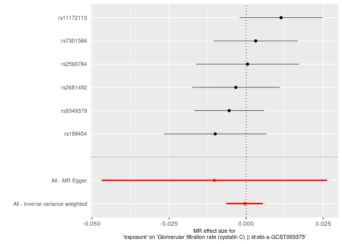

</div>

    Warning: Removed 1 rows containing missing values (`geom_errorbarh()`).
    Removed 1 rows containing missing values (`geom_point()`).

<div class="cell-output-display">


</div>

    Warning: Removed 1 rows containing missing values (`geom_errorbarh()`).
    Removed 1 rows containing missing values (`geom_point()`).

<div class="cell-output-display">


</div>

    Warning: Removed 1 rows containing missing values (`geom_errorbarh()`).
    Removed 1 rows containing missing values (`geom_point()`).

<div class="cell-output-display">


</div>

    Warning: Removed 1 rows containing missing values (`geom_errorbarh()`).
    Removed 1 rows containing missing values (`geom_point()`).

<div class="cell-output-display">


</div>

    Warning: Removed 1 rows containing missing values (`geom_errorbarh()`).
    Removed 1 rows containing missing values (`geom_point()`).

<div class="cell-output-display">


</div>

    Warning: Removed 1 rows containing missing values (`geom_errorbarh()`).
    Removed 1 rows containing missing values (`geom_point()`).

<div class="cell-output-display">


</div>

    Warning: Removed 1 rows containing missing values (`geom_errorbarh()`).
    Removed 1 rows containing missing values (`geom_point()`).

<div class="cell-output-display">


</div>

    Warning: Removed 1 rows containing missing values (`geom_errorbarh()`).
    Removed 1 rows containing missing values (`geom_point()`).

<div class="cell-output-display">


</div>

    Warning: Removed 1 rows containing missing values (`geom_errorbarh()`).
    Removed 1 rows containing missing values (`geom_point()`).

<div class="cell-output-display">


</div>

    Warning: Removed 1 rows containing missing values (`geom_errorbarh()`).
    Removed 1 rows containing missing values (`geom_point()`).

<div class="cell-output-display">


</div>

    Warning: Removed 1 rows containing missing values (`geom_errorbarh()`).
    Removed 1 rows containing missing values (`geom_point()`).

<div class="cell-output-display">


</div>

    Warning: Removed 1 rows containing missing values (`geom_errorbarh()`).
    Removed 1 rows containing missing values (`geom_point()`).

<div class="cell-output-display">


</div>

    Warning: Removed 1 rows containing missing values (`geom_errorbarh()`).
    Removed 1 rows containing missing values (`geom_point()`).

<div class="cell-output-display">

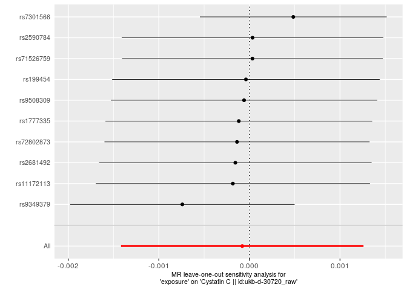

</div>

    Warning: Removed 1 rows containing missing values (`geom_errorbarh()`).
    Removed 1 rows containing missing values (`geom_point()`).

<div class="cell-output-display">


</div>

    Warning: Removed 1 rows containing missing values (`geom_errorbarh()`).
    Removed 1 rows containing missing values (`geom_point()`).

<div class="cell-output-display">


</div>

    Warning: Removed 1 rows containing missing values (`geom_errorbarh()`).
    Removed 1 rows containing missing values (`geom_point()`).

<div class="cell-output-display">


</div>

    Warning: Removed 1 rows containing missing values (`geom_errorbarh()`).
    Removed 1 rows containing missing values (`geom_point()`).

<div class="cell-output-display">


</div>

<div class="cell-output-display">


</div>

<div class="cell-output-display">


</div>

<div class="cell-output-display">


</div>

<div class="cell-output-display">


</div>

<div class="cell-output-display">


</div>

<div class="cell-output-display">


</div>

<div class="cell-output-display">


</div>

<div class="cell-output-display">


</div>

### MR for id trait ncase group_name year author consortium sex pmid population unit sample_size build ncontrol category subcategory ontology note mr nsnp priority sd outcomes

    Extracting data for 10 SNP(s) from 4 GWAS(s)

    Server code: 502; Server is possibly experiencing traffic, trying again...

    Retry succeeded!

    Finding proxies for 6 SNPs in outcome ebi-a-GCST003374

    Extracting data for 6 SNP(s) from 1 GWAS(s)

    Finding proxies for 6 SNPs in outcome ieu-a-1102

    Extracting data for 6 SNP(s) from 1 GWAS(s)

    Server code: 502; Server is possibly experiencing traffic, trying again...
    Server code: 502; Server is possibly experiencing traffic, trying again...

    Retry succeeded!

    Harmonising exposure (W9v8KN) and Chronic kidney disease || id:ebi-a-GCST003374 (ebi-a-GCST003374)

    Harmonising exposure (W9v8KN) and Chronic kidney disease || id:ebi-a-GCST008026 (ebi-a-GCST008026)

    Harmonising exposure (W9v8KN) and Chronic kidney disease || id:finn-b-N14_CHRONKIDNEYDIS (finn-b-N14_CHRONKIDNEYDIS)

    Harmonising exposure (W9v8KN) and Chronic kidney disease || id:ieu-a-1102 (ieu-a-1102)

    Analysing 'W9v8KN' on 'ebi-a-GCST003374'

    Analysing 'W9v8KN' on 'ebi-a-GCST008026'

    Analysing 'W9v8KN' on 'finn-b-N14_CHRONKIDNEYDIS'

    Analysing 'W9v8KN' on 'ieu-a-1102'

    Warning in !is.null(caption) && !is.na(caption): 'length(x) = 22 > 1' in
    coercion to 'logical(1)'

| id.exposure | id.outcome                | outcome                                                  | exposure | method                    | nsnp |          b |        se |      pval |
|:------------|:--------------------------|:---------------------------------------------------------|:---------|:--------------------------|-----:|-----------:|----------:|----------:|
| W9v8KN      | ebi-a-GCST003374          | Chronic kidney disease \|\| id:ebi-a-GCST003374          | exposure | MR Egger                  |    6 |  0.2015762 | 0.1833087 | 0.3332176 |
| W9v8KN      | ebi-a-GCST003374          | Chronic kidney disease \|\| id:ebi-a-GCST003374          | exposure | Inverse variance weighted |    6 | -0.0174349 | 0.0330881 | 0.5982461 |
| W9v8KN      | ebi-a-GCST008026          | Chronic kidney disease \|\| id:ebi-a-GCST008026          | exposure | MR Egger                  |   10 |  0.3480330 | 0.1562425 | 0.0565154 |
| W9v8KN      | ebi-a-GCST008026          | Chronic kidney disease \|\| id:ebi-a-GCST008026          | exposure | Inverse variance weighted |   10 |  0.0110253 | 0.0339760 | 0.7455584 |
| W9v8KN      | finn-b-N14_CHRONKIDNEYDIS | Chronic kidney disease \|\| id:finn-b-N14_CHRONKIDNEYDIS | exposure | MR Egger                  |   10 | -0.1442641 | 0.1433502 | 0.3437007 |
| W9v8KN      | finn-b-N14_CHRONKIDNEYDIS | Chronic kidney disease \|\| id:finn-b-N14_CHRONKIDNEYDIS | exposure | Inverse variance weighted |   10 | -0.0672683 | 0.0327985 | 0.0402714 |
| W9v8KN      | ieu-a-1102                | Chronic kidney disease \|\| id:ieu-a-1102                | exposure | MR Egger                  |    6 |  0.2015762 | 0.1833087 | 0.3332176 |
| W9v8KN      | ieu-a-1102                | Chronic kidney disease \|\| id:ieu-a-1102                | exposure | Inverse variance weighted |    6 | -0.0174349 | 0.0330881 | 0.5982461 |

MR Egger and MR IVW for id Table: MR Egger and MR IVW for trait Table:
MR Egger and MR IVW for ncase Table: MR Egger and MR IVW for group_name
Table: MR Egger and MR IVW for year Table: MR Egger and MR IVW for
author Table: MR Egger and MR IVW for consortium Table: MR Egger and MR
IVW for sex Table: MR Egger and MR IVW for pmid Table: MR Egger and MR
IVW for population Table: MR Egger and MR IVW for unit Table: MR Egger
and MR IVW for sample_size Table: MR Egger and MR IVW for build Table:
MR Egger and MR IVW for ncontrol Table: MR Egger and MR IVW for category
Table: MR Egger and MR IVW for subcategory Table: MR Egger and MR IVW
for ontology Table: MR Egger and MR IVW for note Table: MR Egger and MR
IVW for mr Table: MR Egger and MR IVW for nsnp Table: MR Egger and MR
IVW for priority Table: MR Egger and MR IVW for sd

    Warning in !is.null(caption) && !is.na(caption): 'length(x) = 22 > 1' in
    coercion to 'logical(1)'

| id.exposure | id.outcome                | outcome                                                  | exposure | method                    |         Q | Q_df |    Q_pval |
|:------------|:--------------------------|:---------------------------------------------------------|:---------|:--------------------------|----------:|-----:|----------:|
| W9v8KN      | ebi-a-GCST003374          | Chronic kidney disease \|\| id:ebi-a-GCST003374          | exposure | MR Egger                  |  7.405151 |    4 | 0.1159652 |
| W9v8KN      | ebi-a-GCST003374          | Chronic kidney disease \|\| id:ebi-a-GCST003374          | exposure | Inverse variance weighted | 10.128906 |    5 | 0.0716641 |
| W9v8KN      | ebi-a-GCST008026          | Chronic kidney disease \|\| id:ebi-a-GCST008026          | exposure | MR Egger                  |  2.645165 |    8 | 0.9546177 |
| W9v8KN      | ebi-a-GCST008026          | Chronic kidney disease \|\| id:ebi-a-GCST008026          | exposure | Inverse variance weighted |  7.528531 |    9 | 0.5822647 |
| W9v8KN      | finn-b-N14_CHRONKIDNEYDIS | Chronic kidney disease \|\| id:finn-b-N14_CHRONKIDNEYDIS | exposure | MR Egger                  |  5.726122 |    8 | 0.6778792 |
| W9v8KN      | finn-b-N14_CHRONKIDNEYDIS | Chronic kidney disease \|\| id:finn-b-N14_CHRONKIDNEYDIS | exposure | Inverse variance weighted |  6.030554 |    9 | 0.7368565 |
| W9v8KN      | ieu-a-1102                | Chronic kidney disease \|\| id:ieu-a-1102                | exposure | MR Egger                  |  7.405151 |    4 | 0.1159652 |
| W9v8KN      | ieu-a-1102                | Chronic kidney disease \|\| id:ieu-a-1102                | exposure | Inverse variance weighted | 10.128906 |    5 | 0.0716641 |

Heterogeneity test for id Table: Heterogeneity test for trait Table:
Heterogeneity test for ncase Table: Heterogeneity test for group_name
Table: Heterogeneity test for year Table: Heterogeneity test for author
Table: Heterogeneity test for consortium Table: Heterogeneity test for
sex Table: Heterogeneity test for pmid Table: Heterogeneity test for
population Table: Heterogeneity test for unit Table: Heterogeneity test
for sample_size Table: Heterogeneity test for build Table: Heterogeneity
test for ncontrol Table: Heterogeneity test for category Table:
Heterogeneity test for subcategory Table: Heterogeneity test for
ontology Table: Heterogeneity test for note Table: Heterogeneity test
for mr Table: Heterogeneity test for nsnp Table: Heterogeneity test for
priority Table: Heterogeneity test for sd

    Warning in !is.null(caption) && !is.na(caption): 'length(x) = 22 > 1' in
    coercion to 'logical(1)'

| id.exposure | id.outcome                | outcome                                                  | exposure | egger_intercept |        se |      pval |
|:------------|:--------------------------|:---------------------------------------------------------|:---------|----------------:|----------:|----------:|
| W9v8KN      | ebi-a-GCST003374          | Chronic kidney disease \|\| id:ebi-a-GCST003374          | exposure |      -0.0647158 | 0.0533536 | 0.2918767 |
| W9v8KN      | ebi-a-GCST008026          | Chronic kidney disease \|\| id:ebi-a-GCST008026          | exposure |      -0.0983777 | 0.0445181 | 0.0580961 |
| W9v8KN      | finn-b-N14_CHRONKIDNEYDIS | Chronic kidney disease \|\| id:finn-b-N14_CHRONKIDNEYDIS | exposure |       0.0230972 | 0.0418615 | 0.5961892 |
| W9v8KN      | ieu-a-1102                | Chronic kidney disease \|\| id:ieu-a-1102                | exposure |      -0.0647158 | 0.0533536 | 0.2918767 |

Pleiotropy test for id Table: Pleiotropy test for trait Table:
Pleiotropy test for ncase Table: Pleiotropy test for group_name Table:
Pleiotropy test for year Table: Pleiotropy test for author Table:
Pleiotropy test for consortium Table: Pleiotropy test for sex Table:
Pleiotropy test for pmid Table: Pleiotropy test for population Table:
Pleiotropy test for unit Table: Pleiotropy test for sample_size Table:
Pleiotropy test for build Table: Pleiotropy test for ncontrol Table:
Pleiotropy test for category Table: Pleiotropy test for subcategory
Table: Pleiotropy test for ontology Table: Pleiotropy test for note
Table: Pleiotropy test for mr Table: Pleiotropy test for nsnp Table:
Pleiotropy test for priority Table: Pleiotropy test for sd

    Warning in !is.null(caption) && !is.na(caption): 'length(x) = 22 > 1' in
    coercion to 'logical(1)'

| exposure | outcome                                                  | id.exposure | id.outcome                | samplesize | SNP                             |          b |        se |         p |
|:---------|:---------------------------------------------------------|:------------|:--------------------------|-----------:|:--------------------------------|-----------:|----------:|----------:|
| exposure | Chronic kidney disease \|\| id:ebi-a-GCST003374          | W9v8KN      | ebi-a-GCST003374          |     117165 | rs11172113                      | -0.0995537 | 0.0514933 | 0.0531951 |
| exposure | Chronic kidney disease \|\| id:ebi-a-GCST003374          | W9v8KN      | ebi-a-GCST003374          |     117165 | rs199454                        |  0.0243431 | 0.0695518 | 0.7263387 |
| exposure | Chronic kidney disease \|\| id:ebi-a-GCST003374          | W9v8KN      | ebi-a-GCST003374          |     117165 | rs2590784                       | -0.1214029 | 0.0719424 | 0.0915072 |
| exposure | Chronic kidney disease \|\| id:ebi-a-GCST003374          | W9v8KN      | ebi-a-GCST003374          |     117165 | rs2681492                       |  0.1089994 | 0.0558971 | 0.0511761 |
| exposure | Chronic kidney disease \|\| id:ebi-a-GCST003374          | W9v8KN      | ebi-a-GCST003374          |     117165 | rs7301566                       | -0.0092879 | 0.0580495 | 0.8728811 |
| exposure | Chronic kidney disease \|\| id:ebi-a-GCST003374          | W9v8KN      | ebi-a-GCST003374          |     117165 | rs9349379                       | -0.0184471 | 0.0468062 | 0.6934942 |
| exposure | Chronic kidney disease \|\| id:ebi-a-GCST003374          | W9v8KN      | ebi-a-GCST003374          |     117165 | All - Inverse variance weighted | -0.0174349 | 0.0330881 | 0.5982461 |
| exposure | Chronic kidney disease \|\| id:ebi-a-GCST003374          | W9v8KN      | ebi-a-GCST003374          |     117165 | All - MR Egger                  |  0.2015762 | 0.1833087 | 0.3332176 |
| exposure | Chronic kidney disease \|\| id:ebi-a-GCST008026          | W9v8KN      | ebi-a-GCST008026          |       2872 | rs11172113                      |  0.0074449 | 0.0837721 | 0.9291845 |
| exposure | Chronic kidney disease \|\| id:ebi-a-GCST008026          | W9v8KN      | ebi-a-GCST008026          |       2872 | rs1777335                       | -0.1351660 | 0.1135643 | 0.2339617 |
| exposure | Chronic kidney disease \|\| id:ebi-a-GCST008026          | W9v8KN      | ebi-a-GCST008026          |       2872 | rs199454                        | -0.0291522 | 0.0918443 | 0.7509330 |
| exposure | Chronic kidney disease \|\| id:ebi-a-GCST008026          | W9v8KN      | ebi-a-GCST008026          |       2872 | rs2590784                       | -0.0552936 | 0.1059829 | 0.6018639 |
| exposure | Chronic kidney disease \|\| id:ebi-a-GCST008026          | W9v8KN      | ebi-a-GCST008026          |       2872 | rs2681492                       |  0.1025542 | 0.0901750 | 0.2554210 |
| exposure | Chronic kidney disease \|\| id:ebi-a-GCST008026          | W9v8KN      | ebi-a-GCST008026          |       2872 | rs71526759                      |  0.3488411 | 0.1886251 | 0.0644018 |
| exposure | Chronic kidney disease \|\| id:ebi-a-GCST008026          | W9v8KN      | ebi-a-GCST008026          |       2872 | rs72802873                      |  0.0278438 | 0.1733218 | 0.8723708 |
| exposure | Chronic kidney disease \|\| id:ebi-a-GCST008026          | W9v8KN      | ebi-a-GCST008026          |       2872 | rs7301566                       | -0.0867016 | 0.1237345 | 0.4834860 |
| exposure | Chronic kidney disease \|\| id:ebi-a-GCST008026          | W9v8KN      | ebi-a-GCST008026          |       2872 | rs9349379                       |  0.0612715 | 0.0788037 | 0.4368518 |
| exposure | Chronic kidney disease \|\| id:ebi-a-GCST008026          | W9v8KN      | ebi-a-GCST008026          |       2872 | rs9508309                       | -0.0070755 | 0.1891716 | 0.9701642 |
| exposure | Chronic kidney disease \|\| id:ebi-a-GCST008026          | W9v8KN      | ebi-a-GCST008026          |       2872 | All - Inverse variance weighted |  0.0110253 | 0.0339760 | 0.7455584 |
| exposure | Chronic kidney disease \|\| id:ebi-a-GCST008026          | W9v8KN      | ebi-a-GCST008026          |       2872 | All - MR Egger                  |  0.3480330 | 0.1562425 | 0.0565154 |
| exposure | Chronic kidney disease \|\| id:finn-b-N14_CHRONKIDNEYDIS | W9v8KN      | finn-b-N14_CHRONKIDNEYDIS |         NA | rs11172113                      | -0.1060762 | 0.0827326 | 0.1997873 |
| exposure | Chronic kidney disease \|\| id:finn-b-N14_CHRONKIDNEYDIS | W9v8KN      | finn-b-N14_CHRONKIDNEYDIS |         NA | rs1777335                       |  0.0060776 | 0.1126695 | 0.9569814 |
| exposure | Chronic kidney disease \|\| id:finn-b-N14_CHRONKIDNEYDIS | W9v8KN      | finn-b-N14_CHRONKIDNEYDIS |         NA | rs199454                        |  0.1584235 | 0.1255796 | 0.2071149 |
| exposure | Chronic kidney disease \|\| id:finn-b-N14_CHRONKIDNEYDIS | W9v8KN      | finn-b-N14_CHRONKIDNEYDIS |         NA | rs2590784                       | -0.1452338 | 0.1155576 | 0.2088227 |
| exposure | Chronic kidney disease \|\| id:finn-b-N14_CHRONKIDNEYDIS | W9v8KN      | finn-b-N14_CHRONKIDNEYDIS |         NA | rs2681492                       |  0.0564561 | 0.1246506 | 0.6506101 |
| exposure | Chronic kidney disease \|\| id:finn-b-N14_CHRONKIDNEYDIS | W9v8KN      | finn-b-N14_CHRONKIDNEYDIS |         NA | rs71526759                      | -0.0966857 | 0.1417143 | 0.4950758 |
| exposure | Chronic kidney disease \|\| id:finn-b-N14_CHRONKIDNEYDIS | W9v8KN      | finn-b-N14_CHRONKIDNEYDIS |         NA | rs72802873                      | -0.0942749 | 0.1379809 | 0.4944514 |
| exposure | Chronic kidney disease \|\| id:finn-b-N14_CHRONKIDNEYDIS | W9v8KN      | finn-b-N14_CHRONKIDNEYDIS |         NA | rs7301566                       | -0.0704334 | 0.0928793 | 0.4482515 |
| exposure | Chronic kidney disease \|\| id:finn-b-N14_CHRONKIDNEYDIS | W9v8KN      | finn-b-N14_CHRONKIDNEYDIS |         NA | rs9349379                       | -0.1112335 | 0.0652533 | 0.0882613 |
| exposure | Chronic kidney disease \|\| id:finn-b-N14_CHRONKIDNEYDIS | W9v8KN      | finn-b-N14_CHRONKIDNEYDIS |         NA | rs9508309                       | -0.1278798 | 0.1429048 | 0.3708620 |
| exposure | Chronic kidney disease \|\| id:finn-b-N14_CHRONKIDNEYDIS | W9v8KN      | finn-b-N14_CHRONKIDNEYDIS |         NA | All - Inverse variance weighted | -0.0672683 | 0.0327985 | 0.0402714 |
| exposure | Chronic kidney disease \|\| id:finn-b-N14_CHRONKIDNEYDIS | W9v8KN      | finn-b-N14_CHRONKIDNEYDIS |         NA | All - MR Egger                  | -0.1442641 | 0.1433502 | 0.3437007 |
| exposure | Chronic kidney disease \|\| id:ieu-a-1102                | W9v8KN      | ieu-a-1102                |     118143 | rs11172113                      | -0.0995537 | 0.0514933 | 0.0531951 |
| exposure | Chronic kidney disease \|\| id:ieu-a-1102                | W9v8KN      | ieu-a-1102                |     118143 | rs199454                        |  0.0243431 | 0.0695518 | 0.7263387 |
| exposure | Chronic kidney disease \|\| id:ieu-a-1102                | W9v8KN      | ieu-a-1102                |     118143 | rs2590784                       | -0.1214029 | 0.0719424 | 0.0915072 |
| exposure | Chronic kidney disease \|\| id:ieu-a-1102                | W9v8KN      | ieu-a-1102                |     118143 | rs2681492                       |  0.1089994 | 0.0558971 | 0.0511761 |
| exposure | Chronic kidney disease \|\| id:ieu-a-1102                | W9v8KN      | ieu-a-1102                |     118143 | rs7301566                       | -0.0092879 | 0.0580495 | 0.8728811 |
| exposure | Chronic kidney disease \|\| id:ieu-a-1102                | W9v8KN      | ieu-a-1102                |     118143 | rs9349379                       | -0.0184471 | 0.0468062 | 0.6934942 |
| exposure | Chronic kidney disease \|\| id:ieu-a-1102                | W9v8KN      | ieu-a-1102                |     118143 | All - Inverse variance weighted | -0.0174349 | 0.0330881 | 0.5982461 |
| exposure | Chronic kidney disease \|\| id:ieu-a-1102                | W9v8KN      | ieu-a-1102                |     118143 | All - MR Egger                  |  0.2015762 | 0.1833087 | 0.3332176 |

Single SNP analysis for id Table: Single SNP analysis for trait Table:
Single SNP analysis for ncase Table: Single SNP analysis for group_name
Table: Single SNP analysis for year Table: Single SNP analysis for
author Table: Single SNP analysis for consortium Table: Single SNP
analysis for sex Table: Single SNP analysis for pmid Table: Single SNP
analysis for population Table: Single SNP analysis for unit Table:
Single SNP analysis for sample_size Table: Single SNP analysis for build
Table: Single SNP analysis for ncontrol Table: Single SNP analysis for
category Table: Single SNP analysis for subcategory Table: Single SNP
analysis for ontology Table: Single SNP analysis for note Table: Single
SNP analysis for mr Table: Single SNP analysis for nsnp Table: Single
SNP analysis for priority Table: Single SNP analysis for sd

    Warning in !is.null(caption) && !is.na(caption): 'length(x) = 22 > 1' in
    coercion to 'logical(1)'

<div class="cell-output-display">


</div>

| exposure | outcome                                                  | id.exposure | id.outcome                | samplesize | SNP        |          b |        se |         p |
|:---------|:---------------------------------------------------------|:------------|:--------------------------|-----------:|:-----------|-----------:|----------:|----------:|
| exposure | Chronic kidney disease \|\| id:ebi-a-GCST003374          | W9v8KN      | ebi-a-GCST003374          |     117165 | rs11172113 |  0.0035874 | 0.0343046 | 0.9167119 |
| exposure | Chronic kidney disease \|\| id:ebi-a-GCST003374          | W9v8KN      | ebi-a-GCST003374          |     117165 | rs199454   | -0.0226895 | 0.0384561 | 0.5551839 |
| exposure | Chronic kidney disease \|\| id:ebi-a-GCST003374          | W9v8KN      | ebi-a-GCST003374          |     117165 | rs2590784  | -0.0053129 | 0.0342969 | 0.8768933 |
| exposure | Chronic kidney disease \|\| id:ebi-a-GCST003374          | W9v8KN      | ebi-a-GCST003374          |     117165 | rs2681492  | -0.0438783 | 0.0255632 | 0.0860775 |
| exposure | Chronic kidney disease \|\| id:ebi-a-GCST003374          | W9v8KN      | ebi-a-GCST003374          |     117165 | rs7301566  | -0.0189911 | 0.0403257 | 0.6376811 |
| exposure | Chronic kidney disease \|\| id:ebi-a-GCST003374          | W9v8KN      | ebi-a-GCST003374          |     117165 | rs9349379  | -0.0171035 | 0.0426212 | 0.6882066 |
| exposure | Chronic kidney disease \|\| id:ebi-a-GCST003374          | W9v8KN      | ebi-a-GCST003374          |     117165 | All        | -0.0174349 | 0.0330881 | 0.5982461 |
| exposure | Chronic kidney disease \|\| id:ebi-a-GCST008026          | W9v8KN      | ebi-a-GCST008026          |       2872 | rs11172113 |  0.0117302 | 0.0371704 | 0.7523229 |
| exposure | Chronic kidney disease \|\| id:ebi-a-GCST008026          | W9v8KN      | ebi-a-GCST008026          |       2872 | rs1777335  |  0.0253969 | 0.0356069 | 0.4756862 |
| exposure | Chronic kidney disease \|\| id:ebi-a-GCST008026          | W9v8KN      | ebi-a-GCST008026          |       2872 | rs199454   |  0.0173952 | 0.0365703 | 0.6343131 |
| exposure | Chronic kidney disease \|\| id:ebi-a-GCST008026          | W9v8KN      | ebi-a-GCST008026          |       2872 | rs2590784  |  0.0186217 | 0.0358691 | 0.6036523 |
| exposure | Chronic kidney disease \|\| id:ebi-a-GCST008026          | W9v8KN      | ebi-a-GCST008026          |       2872 | rs2681492  | -0.0041182 | 0.0366792 | 0.9106044 |
| exposure | Chronic kidney disease \|\| id:ebi-a-GCST008026          | W9v8KN      | ebi-a-GCST008026          |       2872 | rs71526759 | -0.0003027 | 0.0345410 | 0.9930089 |
| exposure | Chronic kidney disease \|\| id:ebi-a-GCST008026          | W9v8KN      | ebi-a-GCST008026          |       2872 | rs72802873 |  0.0103532 | 0.0346483 | 0.7650871 |
| exposure | Chronic kidney disease \|\| id:ebi-a-GCST008026          | W9v8KN      | ebi-a-GCST008026          |       2872 | rs7301566  |  0.0189946 | 0.0353342 | 0.5908737 |
| exposure | Chronic kidney disease \|\| id:ebi-a-GCST008026          | W9v8KN      | ebi-a-GCST008026          |       2872 | rs9349379  | -0.0004476 | 0.0376557 | 0.9905165 |
| exposure | Chronic kidney disease \|\| id:ebi-a-GCST008026          | W9v8KN      | ebi-a-GCST008026          |       2872 | rs9508309  |  0.0116286 | 0.0345376 | 0.7363476 |
| exposure | Chronic kidney disease \|\| id:ebi-a-GCST008026          | W9v8KN      | ebi-a-GCST008026          |       2872 | All        |  0.0110253 | 0.0339760 | 0.7455584 |
| exposure | Chronic kidney disease \|\| id:finn-b-N14_CHRONKIDNEYDIS | W9v8KN      | finn-b-N14_CHRONKIDNEYDIS |         NA | rs11172113 | -0.0600317 | 0.0357259 | 0.0928909 |
| exposure | Chronic kidney disease \|\| id:finn-b-N14_CHRONKIDNEYDIS | W9v8KN      | finn-b-N14_CHRONKIDNEYDIS |         NA | rs1777335  | -0.0740592 | 0.0342833 | 0.0307562 |
| exposure | Chronic kidney disease \|\| id:finn-b-N14_CHRONKIDNEYDIS | W9v8KN      | finn-b-N14_CHRONKIDNEYDIS |         NA | rs199454   | -0.0837906 | 0.0339779 | 0.0136619 |
| exposure | Chronic kidney disease \|\| id:finn-b-N14_CHRONKIDNEYDIS | W9v8KN      | finn-b-N14_CHRONKIDNEYDIS |         NA | rs2590784  | -0.0604372 | 0.0342052 | 0.0772451 |
| exposure | Chronic kidney disease \|\| id:finn-b-N14_CHRONKIDNEYDIS | W9v8KN      | finn-b-N14_CHRONKIDNEYDIS |         NA | rs2681492  | -0.0764714 | 0.0339965 | 0.0244877 |
| exposure | Chronic kidney disease \|\| id:finn-b-N14_CHRONKIDNEYDIS | W9v8KN      | finn-b-N14_CHRONKIDNEYDIS |         NA | rs71526759 | -0.0656034 | 0.0337139 | 0.0516686 |
| exposure | Chronic kidney disease \|\| id:finn-b-N14_CHRONKIDNEYDIS | W9v8KN      | finn-b-N14_CHRONKIDNEYDIS |         NA | rs72802873 | -0.0656510 | 0.0337664 | 0.0518628 |
| exposure | Chronic kidney disease \|\| id:finn-b-N14_CHRONKIDNEYDIS | W9v8KN      | finn-b-N14_CHRONKIDNEYDIS |         NA | rs7301566  | -0.0668174 | 0.0350571 | 0.0566559 |
| exposure | Chronic kidney disease \|\| id:finn-b-N14_CHRONKIDNEYDIS | W9v8KN      | finn-b-N14_CHRONKIDNEYDIS |         NA | rs9349379  | -0.0524061 | 0.0379394 | 0.1671831 |
| exposure | Chronic kidney disease \|\| id:finn-b-N14_CHRONKIDNEYDIS | W9v8KN      | finn-b-N14_CHRONKIDNEYDIS |         NA | rs9508309  | -0.0638980 | 0.0336981 | 0.0579350 |
| exposure | Chronic kidney disease \|\| id:finn-b-N14_CHRONKIDNEYDIS | W9v8KN      | finn-b-N14_CHRONKIDNEYDIS |         NA | All        | -0.0672683 | 0.0327985 | 0.0402714 |
| exposure | Chronic kidney disease \|\| id:ieu-a-1102                | W9v8KN      | ieu-a-1102                |     118143 | rs11172113 |  0.0035874 | 0.0343046 | 0.9167119 |
| exposure | Chronic kidney disease \|\| id:ieu-a-1102                | W9v8KN      | ieu-a-1102                |     118143 | rs199454   | -0.0226895 | 0.0384561 | 0.5551839 |
| exposure | Chronic kidney disease \|\| id:ieu-a-1102                | W9v8KN      | ieu-a-1102                |     118143 | rs2590784  | -0.0053129 | 0.0342969 | 0.8768933 |
| exposure | Chronic kidney disease \|\| id:ieu-a-1102                | W9v8KN      | ieu-a-1102                |     118143 | rs2681492  | -0.0438783 | 0.0255632 | 0.0860775 |
| exposure | Chronic kidney disease \|\| id:ieu-a-1102                | W9v8KN      | ieu-a-1102                |     118143 | rs7301566  | -0.0189911 | 0.0403257 | 0.6376811 |
| exposure | Chronic kidney disease \|\| id:ieu-a-1102                | W9v8KN      | ieu-a-1102                |     118143 | rs9349379  | -0.0171035 | 0.0426212 | 0.6882066 |
| exposure | Chronic kidney disease \|\| id:ieu-a-1102                | W9v8KN      | ieu-a-1102                |     118143 | All        | -0.0174349 | 0.0330881 | 0.5982461 |

Leave one out analysis for id Table: Leave one out analysis for trait
Table: Leave one out analysis for ncase Table: Leave one out analysis
for group_name Table: Leave one out analysis for year Table: Leave one
out analysis for author Table: Leave one out analysis for consortium
Table: Leave one out analysis for sex Table: Leave one out analysis for
pmid Table: Leave one out analysis for population Table: Leave one out
analysis for unit Table: Leave one out analysis for sample_size Table:
Leave one out analysis for build Table: Leave one out analysis for
ncontrol Table: Leave one out analysis for category Table: Leave one out
analysis for subcategory Table: Leave one out analysis for ontology
Table: Leave one out analysis for note Table: Leave one out analysis for
mr Table: Leave one out analysis for nsnp Table: Leave one out analysis
for priority Table: Leave one out analysis for sd

### Plots for id trait ncase group_name year author consortium sex pmid population unit sample_size build ncontrol category subcategory ontology note mr nsnp priority sd outcomes

<div class="cell-output-display">


</div>

<div class="cell-output-display">


</div>

<div class="cell-output-display">


</div>

<div class="cell-output-display">


</div>

    Warning: Removed 1 rows containing missing values (`geom_errorbarh()`).
    Removed 1 rows containing missing values (`geom_point()`).

<div class="cell-output-display">


</div>

    Warning: Removed 1 rows containing missing values (`geom_errorbarh()`).
    Removed 1 rows containing missing values (`geom_point()`).

<div class="cell-output-display">


</div>

    Warning: Removed 1 rows containing missing values (`geom_errorbarh()`).
    Removed 1 rows containing missing values (`geom_point()`).

<div class="cell-output-display">


</div>

    Warning: Removed 1 rows containing missing values (`geom_errorbarh()`).
    Removed 1 rows containing missing values (`geom_point()`).

<div class="cell-output-display">


</div>

    Warning: Removed 1 rows containing missing values (`geom_errorbarh()`).
    Removed 1 rows containing missing values (`geom_point()`).

<div class="cell-output-display">


</div>

    Warning: Removed 1 rows containing missing values (`geom_errorbarh()`).
    Removed 1 rows containing missing values (`geom_point()`).

<div class="cell-output-display">


</div>

    Warning: Removed 1 rows containing missing values (`geom_errorbarh()`).
    Removed 1 rows containing missing values (`geom_point()`).

<div class="cell-output-display">


</div>

    Warning: Removed 1 rows containing missing values (`geom_errorbarh()`).
    Removed 1 rows containing missing values (`geom_point()`).

<div class="cell-output-display">


</div>

<div class="cell-output-display">


</div>

<div class="cell-output-display">


</div>

<div class="cell-output-display">


</div>

## MR for 1e-05 threshold

### MR for id trait ncase group_name year author consortium sex pmid population unit sample_size build ncontrol category subcategory ontology note mr nsnp priority sd outcomes

    Extracting data for 32 SNP(s) from 27 GWAS(s)

    Server code: 502; Server is possibly experiencing traffic, trying again...
    Server code: 502; Server is possibly experiencing traffic, trying again...
    Server code: 502; Server is possibly experiencing traffic, trying again...
    Server code: 502; Server is possibly experiencing traffic, trying again...
    Server code: 502; Server is possibly experiencing traffic, trying again...

    Retry succeeded!

    Finding proxies for 16 SNPs in outcome ebi-a-GCST003401

    Extracting data for 16 SNP(s) from 1 GWAS(s)

    Server code: 502; Server is possibly experiencing traffic, trying again...
    Server code: 502; Server is possibly experiencing traffic, trying again...

    Retry succeeded!

    Finding proxies for 5 SNPs in outcome ukb-e-30700_EAS

    Extracting data for 5 SNP(s) from 1 GWAS(s)

    Server code: 502; Server is possibly experiencing traffic, trying again...
    Server code: 502; Server is possibly experiencing traffic, trying again...
    Server code: 502; Server is possibly experiencing traffic, trying again...

    Retry succeeded!

    Finding proxies for 19 SNPs in outcome ebi-a-GCST003371

    Extracting data for 19 SNP(s) from 1 GWAS(s)

    Finding proxies for 16 SNPs in outcome ebi-a-GCST003373

    Extracting data for 16 SNP(s) from 1 GWAS(s)

    Finding proxies for 2 SNPs in outcome ukb-e-recode6_CSA

    Extracting data for 2 SNP(s) from 1 GWAS(s)

    Finding proxies for 5 SNPs in outcome ukb-e-recode6_EAS

    Extracting data for 5 SNP(s) from 1 GWAS(s)

    Finding proxies for 9 SNPs in outcome ukb-e-recode6_AFR

    Extracting data for 9 SNP(s) from 1 GWAS(s)

    Server code: 502; Server is possibly experiencing traffic, trying again...

    Retry succeeded!

    Finding proxies for 16 SNPs in outcome ebi-a-GCST003372

    Extracting data for 16 SNP(s) from 1 GWAS(s)

    Server code: 502; Server is possibly experiencing traffic, trying again...
    Server code: 502; Server is possibly experiencing traffic, trying again...
    Server code: 502; Server is possibly experiencing traffic, trying again...
    Server code: 502; Server is possibly experiencing traffic, trying again...
    Server code: 502; Server is possibly experiencing traffic, trying again...
    Server code: 502; Server is possibly experiencing traffic, trying again...

    Server error: 502

    Failed to retrieve results from server. See error status message in the returned object and contact the developers if the problem persists.

    Finding proxies for 16 SNPs in outcome ieu-a-1103

    Extracting data for 16 SNP(s) from 1 GWAS(s)

    Server code: 502; Server is possibly experiencing traffic, trying again...
    Server code: 502; Server is possibly experiencing traffic, trying again...

    Retry succeeded!

    Finding proxies for 2 SNPs in outcome ukb-e-30700_CSA

    Extracting data for 2 SNP(s) from 1 GWAS(s)

    Finding proxies for 16 SNPs in outcome ieu-a-1105

    Extracting data for 16 SNP(s) from 1 GWAS(s)

    Server code: 502; Server is possibly experiencing traffic, trying again...
    Server code: 502; Server is possibly experiencing traffic, trying again...
    Server code: 502; Server is possibly experiencing traffic, trying again...

    Retry succeeded!

    Finding proxies for 27 SNPs in outcome ebi-a-GCST005066

    Extracting data for 27 SNP(s) from 1 GWAS(s)

    Server code: 502; Server is possibly experiencing traffic, trying again...
    Server code: 502; Server is possibly experiencing traffic, trying again...
    Server code: 502; Server is possibly experiencing traffic, trying again...
    Server code: 502; Server is possibly experiencing traffic, trying again...

    Retry succeeded!

    Finding proxies for 8 SNPs in outcome bbj-a-61

    Extracting data for 8 SNP(s) from 1 GWAS(s)

    Finding proxies for 16 SNPs in outcome ieu-a-1104

    Extracting data for 16 SNP(s) from 1 GWAS(s)

    Server code: 502; Server is possibly experiencing traffic, trying again...
    Server code: 502; Server is possibly experiencing traffic, trying again...

    Retry succeeded!

    Finding proxies for 5 SNPs in outcome ukb-e-recode4_EAS

    Extracting data for 5 SNP(s) from 1 GWAS(s)

    Finding proxies for 17 SNPs in outcome ieu-a-1099

    Extracting data for 17 SNP(s) from 1 GWAS(s)

    Finding proxies for 15 SNPs in outcome met-a-309

    Extracting data for 15 SNP(s) from 1 GWAS(s)

    Server code: 502; Server is possibly experiencing traffic, trying again...

    Retry succeeded!

    Finding proxies for 2 SNPs in outcome ukb-e-recode4_CSA

    Extracting data for 2 SNP(s) from 1 GWAS(s)

    Server code: 502; Server is possibly experiencing traffic, trying again...
    Server code: 502; Server is possibly experiencing traffic, trying again...
    Server code: 502; Server is possibly experiencing traffic, trying again...

    Retry succeeded!

    Finding proxies for 32 SNPs in outcome ukb-e-recode4_AFR

    Extracting data for 32 SNP(s) from 1 GWAS(s)

    Finding proxies for 32 SNPs in outcome ukb-e-30700_AFR

    Extracting data for 32 SNP(s) from 1 GWAS(s)

    Harmonising exposure (W9v8KN) and Serum creatinine || id:bbj-a-61 (bbj-a-61)

    Harmonising exposure (W9v8KN) and Glomerular filtration rate (creatinine) || id:ebi-a-GCST003371 (ebi-a-GCST003371)

    Harmonising exposure (W9v8KN) and Glomerular filtration rate (creatinine) || id:ebi-a-GCST003372 (ebi-a-GCST003372)

    Harmonising exposure (W9v8KN) and Glomerular filtration rate in diabetics (creatinine) || id:ebi-a-GCST003373 (ebi-a-GCST003373)

    Harmonising exposure (W9v8KN) and Glomerular filtration rate in non diabetics (creatinine) || id:ebi-a-GCST003401 (ebi-a-GCST003401)

    Harmonising exposure (W9v8KN) and Creatinine levels || id:ebi-a-GCST005066 (ebi-a-GCST005066)

    Removing the following SNPs for being palindromic with intermediate allele frequencies:
    rs72675157, rs72802873

    Harmonising exposure (W9v8KN) and Serum creatinine (eGFRcrea) || id:ieu-a-1099 (ieu-a-1099)

    Harmonising exposure (W9v8KN) and Serum creatinine (eGFRcrea) || id:ieu-a-1103 (ieu-a-1103)

    Harmonising exposure (W9v8KN) and Serum creatinine (eGFRcrea) || id:ieu-a-1104 (ieu-a-1104)

    Harmonising exposure (W9v8KN) and Serum creatinine (eGFRcrea) || id:ieu-a-1105 (ieu-a-1105)

    Harmonising exposure (W9v8KN) and Creatinine || id:met-a-309 (met-a-309)

    Harmonising exposure (W9v8KN) and Creatinine || id:met-c-850 (met-c-850)

    Harmonising exposure (W9v8KN) and Creatinine || id:met-d-Creatinine (met-d-Creatinine)

    Harmonising exposure (W9v8KN) and Creatinine || id:ukb-d-30700_irnt (ukb-d-30700_irnt)

    Harmonising exposure (W9v8KN) and Creatinine || id:ukb-d-30700_raw (ukb-d-30700_raw)

    Harmonising exposure (W9v8KN) and Creatinine || id:ukb-e-30700_CSA (ukb-e-30700_CSA)

    Harmonising exposure (W9v8KN) and Creatinine || id:ukb-e-30700_EAS (ukb-e-30700_EAS)

    Harmonising exposure (W9v8KN) and Creatinine || id:ukb-e-30700_MID (ukb-e-30700_MID)

    Harmonising exposure (W9v8KN) and Estimated glomerular filtration rate, serum creatinine || id:ukb-e-recode4_CSA (ukb-e-recode4_CSA)

    Harmonising exposure (W9v8KN) and Estimated glomerular filtration rate, serum creatinine || id:ukb-e-recode4_EAS (ukb-e-recode4_EAS)

    Harmonising exposure (W9v8KN) and Estimated glomerular filtration rate, serum creatinine || id:ukb-e-recode4_MID (ukb-e-recode4_MID)

    Harmonising exposure (W9v8KN) and Estimated glomerular filtration rate, serum creatinine + cystain C || id:ukb-e-recode6_AFR (ukb-e-recode6_AFR)

    Harmonising exposure (W9v8KN) and Estimated glomerular filtration rate, serum creatinine + cystain C || id:ukb-e-recode6_CSA (ukb-e-recode6_CSA)

    Harmonising exposure (W9v8KN) and Estimated glomerular filtration rate, serum creatinine + cystain C || id:ukb-e-recode6_EAS (ukb-e-recode6_EAS)

    Harmonising exposure (W9v8KN) and Estimated glomerular filtration rate, serum creatinine + cystain C || id:ukb-e-recode6_MID (ukb-e-recode6_MID)

    Analysing 'W9v8KN' on 'bbj-a-61'

    Analysing 'W9v8KN' on 'ebi-a-GCST003371'

    Analysing 'W9v8KN' on 'ebi-a-GCST003372'

    Analysing 'W9v8KN' on 'ebi-a-GCST003373'

    Analysing 'W9v8KN' on 'ebi-a-GCST003401'

    Analysing 'W9v8KN' on 'ebi-a-GCST005066'

    Analysing 'W9v8KN' on 'ieu-a-1099'

    Analysing 'W9v8KN' on 'ieu-a-1103'

    Analysing 'W9v8KN' on 'ieu-a-1104'

    Analysing 'W9v8KN' on 'ieu-a-1105'

    Analysing 'W9v8KN' on 'met-a-309'

    Analysing 'W9v8KN' on 'met-c-850'

    Analysing 'W9v8KN' on 'met-d-Creatinine'

    Analysing 'W9v8KN' on 'ukb-d-30700_irnt'

    Analysing 'W9v8KN' on 'ukb-d-30700_raw'

    Analysing 'W9v8KN' on 'ukb-e-30700_CSA'

    Analysing 'W9v8KN' on 'ukb-e-30700_EAS'

    Analysing 'W9v8KN' on 'ukb-e-30700_MID'

    Analysing 'W9v8KN' on 'ukb-e-recode4_CSA'

    Analysing 'W9v8KN' on 'ukb-e-recode4_EAS'

    Analysing 'W9v8KN' on 'ukb-e-recode4_MID'

    Analysing 'W9v8KN' on 'ukb-e-recode6_AFR'

    Analysing 'W9v8KN' on 'ukb-e-recode6_CSA'

    Analysing 'W9v8KN' on 'ukb-e-recode6_EAS'

    Analysing 'W9v8KN' on 'ukb-e-recode6_MID'

    Warning in !is.null(caption) && !is.na(caption): 'length(x) = 22 > 1' in
    coercion to 'logical(1)'

| id.exposure | id.outcome        | outcome                                                                                      | exposure | method                    | nsnp |          b |        se |      pval |
|:------------|:------------------|:---------------------------------------------------------------------------------------------|:---------|:--------------------------|-----:|-----------:|----------:|----------:|
| W9v8KN      | bbj-a-61          | Serum creatinine \|\| id:bbj-a-61                                                            | exposure | MR Egger                  |   25 |  0.0124593 | 0.0186263 | 0.5102133 |
| W9v8KN      | bbj-a-61          | Serum creatinine \|\| id:bbj-a-61                                                            | exposure | Inverse variance weighted |   25 |  0.0053524 | 0.0042992 | 0.2131356 |
| W9v8KN      | ebi-a-GCST003371  | Glomerular filtration rate (creatinine) \|\| id:ebi-a-GCST003371                             | exposure | MR Egger                  |   17 | -0.0264792 | 0.0198244 | 0.2015668 |
| W9v8KN      | ebi-a-GCST003371  | Glomerular filtration rate (creatinine) \|\| id:ebi-a-GCST003371                             | exposure | Inverse variance weighted |   17 | -0.0017984 | 0.0040301 | 0.6554312 |
| W9v8KN      | ebi-a-GCST003372  | Glomerular filtration rate (creatinine) \|\| id:ebi-a-GCST003372                             | exposure | MR Egger                  |   16 | -0.0068296 | 0.0051269 | 0.2041000 |
| W9v8KN      | ebi-a-GCST003372  | Glomerular filtration rate (creatinine) \|\| id:ebi-a-GCST003372                             | exposure | Inverse variance weighted |   16 |  0.0002451 | 0.0011886 | 0.8366429 |
| W9v8KN      | ebi-a-GCST003373  | Glomerular filtration rate in diabetics (creatinine) \|\| id:ebi-a-GCST003373                | exposure | MR Egger                  |   22 |  0.0175560 | 0.0147321 | 0.2473332 |
| W9v8KN      | ebi-a-GCST003373  | Glomerular filtration rate in diabetics (creatinine) \|\| id:ebi-a-GCST003373                | exposure | Inverse variance weighted |   22 |  0.0068345 | 0.0034873 | 0.0500159 |
| W9v8KN      | ebi-a-GCST003401  | Glomerular filtration rate in non diabetics (creatinine) \|\| id:ebi-a-GCST003401            | exposure | MR Egger                  |   22 | -0.0019845 | 0.0039097 | 0.6172937 |
| W9v8KN      | ebi-a-GCST003401  | Glomerular filtration rate in non diabetics (creatinine) \|\| id:ebi-a-GCST003401            | exposure | Inverse variance weighted |   22 |  0.0001475 | 0.0009389 | 0.8751233 |
| W9v8KN      | ebi-a-GCST005066  | Creatinine levels \|\| id:ebi-a-GCST005066                                                   | exposure | MR Egger                  |    5 | -0.0386598 | 0.0731864 | 0.6339163 |
| W9v8KN      | ebi-a-GCST005066  | Creatinine levels \|\| id:ebi-a-GCST005066                                                   | exposure | Inverse variance weighted |    5 | -0.0055446 | 0.0151699 | 0.7147382 |
| W9v8KN      | ieu-a-1099        | Serum creatinine (eGFRcrea) \|\| id:ieu-a-1099                                               | exposure | MR Egger                  |   18 | -0.0263980 | 0.0197804 | 0.2007044 |
| W9v8KN      | ieu-a-1099        | Serum creatinine (eGFRcrea) \|\| id:ieu-a-1099                                               | exposure | Inverse variance weighted |   18 | -0.0017349 | 0.0039704 | 0.6621391 |
| W9v8KN      | ieu-a-1103        | Serum creatinine (eGFRcrea) \|\| id:ieu-a-1103                                               | exposure | MR Egger                  |   22 |  0.0163528 | 0.0147452 | 0.2805766 |
| W9v8KN      | ieu-a-1103        | Serum creatinine (eGFRcrea) \|\| id:ieu-a-1103                                               | exposure | Inverse variance weighted |   22 |  0.0080712 | 0.0034792 | 0.0203473 |
| W9v8KN      | ieu-a-1104        | Serum creatinine (eGFRcrea) \|\| id:ieu-a-1104                                               | exposure | MR Egger                  |   22 | -0.0019225 | 0.0038506 | 0.6230295 |
| W9v8KN      | ieu-a-1104        | Serum creatinine (eGFRcrea) \|\| id:ieu-a-1104                                               | exposure | Inverse variance weighted |   22 |  0.0002100 | 0.0009273 | 0.8208003 |
| W9v8KN      | ieu-a-1105        | Serum creatinine (eGFRcrea) \|\| id:ieu-a-1105                                               | exposure | MR Egger                  |   22 | -0.0022542 | 0.0038870 | 0.5684270 |
| W9v8KN      | ieu-a-1105        | Serum creatinine (eGFRcrea) \|\| id:ieu-a-1105                                               | exposure | Inverse variance weighted |   22 |  0.0006485 | 0.0009328 | 0.4869557 |
| W9v8KN      | met-a-309         | Creatinine \|\| id:met-a-309                                                                 | exposure | MR Egger                  |   23 |  0.0051128 | 0.0057837 | 0.3867032 |
| W9v8KN      | met-a-309         | Creatinine \|\| id:met-a-309                                                                 | exposure | Inverse variance weighted |   23 |  0.0004000 | 0.0013919 | 0.7737981 |
| W9v8KN      | met-c-850         | Creatinine \|\| id:met-c-850                                                                 | exposure | MR Egger                  |   32 |  0.0157893 | 0.0264676 | 0.5552833 |
| W9v8KN      | met-c-850         | Creatinine \|\| id:met-c-850                                                                 | exposure | Inverse variance weighted |   32 |  0.0086967 | 0.0077450 | 0.2614854 |
| W9v8KN      | met-d-Creatinine  | Creatinine \|\| id:met-d-Creatinine                                                          | exposure | MR Egger                  |   32 | -0.0131280 | 0.0120110 | 0.2830949 |
| W9v8KN      | met-d-Creatinine  | Creatinine \|\| id:met-d-Creatinine                                                          | exposure | Inverse variance weighted |   32 | -0.0015599 | 0.0034603 | 0.6521399 |
| W9v8KN      | ukb-d-30700_irnt  | Creatinine \|\| id:ukb-d-30700_irnt                                                          | exposure | MR Egger                  |   32 | -0.0128036 | 0.0075095 | 0.0985357 |
| W9v8KN      | ukb-d-30700_irnt  | Creatinine \|\| id:ukb-d-30700_irnt                                                          | exposure | Inverse variance weighted |   32 |  0.0011776 | 0.0022465 | 0.6001364 |
| W9v8KN      | ukb-d-30700_raw   | Creatinine \|\| id:ukb-d-30700_raw                                                           | exposure | MR Egger                  |   32 | -0.2102256 | 0.1470066 | 0.1630380 |
| W9v8KN      | ukb-d-30700_raw   | Creatinine \|\| id:ukb-d-30700_raw                                                           | exposure | Inverse variance weighted |   32 |  0.0212036 | 0.0432709 | 0.6241201 |
| W9v8KN      | ukb-e-30700_CSA   | Creatinine \|\| id:ukb-e-30700_CSA                                                           | exposure | MR Egger                  |   31 | -0.0448662 | 0.0466442 | 0.3440608 |
| W9v8KN      | ukb-e-30700_CSA   | Creatinine \|\| id:ukb-e-30700_CSA                                                           | exposure | Inverse variance weighted |   31 |  0.0016166 | 0.0121353 | 0.8940236 |
| W9v8KN      | ukb-e-30700_EAS   | Creatinine \|\| id:ukb-e-30700_EAS                                                           | exposure | MR Egger                  |   28 |  0.0737186 | 0.0923397 | 0.4319045 |
| W9v8KN      | ukb-e-30700_EAS   | Creatinine \|\| id:ukb-e-30700_EAS                                                           | exposure | Inverse variance weighted |   28 |  0.0324147 | 0.0215917 | 0.1332893 |
| W9v8KN      | ukb-e-30700_MID   | Creatinine \|\| id:ukb-e-30700_MID                                                           | exposure | MR Egger                  |   32 | -0.1010045 | 0.0940365 | 0.2913419 |
| W9v8KN      | ukb-e-30700_MID   | Creatinine \|\| id:ukb-e-30700_MID                                                           | exposure | Inverse variance weighted |   32 |  0.0149530 | 0.0268029 | 0.5769230 |
| W9v8KN      | ukb-e-recode4_CSA | Estimated glomerular filtration rate, serum creatinine \|\| id:ukb-e-recode4_CSA             | exposure | MR Egger                  |   31 |  0.0359981 | 0.0514303 | 0.4895422 |
| W9v8KN      | ukb-e-recode4_CSA | Estimated glomerular filtration rate, serum creatinine \|\| id:ukb-e-recode4_CSA             | exposure | Inverse variance weighted |   31 | -0.0005135 | 0.0132619 | 0.9691129 |
| W9v8KN      | ukb-e-recode4_EAS | Estimated glomerular filtration rate, serum creatinine \|\| id:ukb-e-recode4_EAS             | exposure | MR Egger                  |   28 | -0.0732097 | 0.0948043 | 0.4469476 |
| W9v8KN      | ukb-e-recode4_EAS | Estimated glomerular filtration rate, serum creatinine \|\| id:ukb-e-recode4_EAS             | exposure | Inverse variance weighted |   28 | -0.0333392 | 0.0221598 | 0.1324543 |
| W9v8KN      | ukb-e-recode4_MID | Estimated glomerular filtration rate, serum creatinine \|\| id:ukb-e-recode4_MID             | exposure | MR Egger                  |   32 |  0.0886423 | 0.1025355 | 0.3941713 |
| W9v8KN      | ukb-e-recode4_MID | Estimated glomerular filtration rate, serum creatinine \|\| id:ukb-e-recode4_MID             | exposure | Inverse variance weighted |   32 | -0.0200701 | 0.0290142 | 0.4891048 |
| W9v8KN      | ukb-e-recode6_AFR | Estimated glomerular filtration rate, serum creatinine + cystain C \|\| id:ukb-e-recode6_AFR | exposure | MR Egger                  |   26 |  0.0287275 | 0.0815499 | 0.7277112 |
| W9v8KN      | ukb-e-recode6_AFR | Estimated glomerular filtration rate, serum creatinine + cystain C \|\| id:ukb-e-recode6_AFR | exposure | Inverse variance weighted |   26 | -0.0171504 | 0.0164189 | 0.2962310 |
| W9v8KN      | ukb-e-recode6_CSA | Estimated glomerular filtration rate, serum creatinine + cystain C \|\| id:ukb-e-recode6_CSA | exposure | MR Egger                  |   31 |  0.0282682 | 0.0396553 | 0.4816360 |
| W9v8KN      | ukb-e-recode6_CSA | Estimated glomerular filtration rate, serum creatinine + cystain C \|\| id:ukb-e-recode6_CSA | exposure | Inverse variance weighted |   31 |  0.0052914 | 0.0102983 | 0.6073836 |
| W9v8KN      | ukb-e-recode6_EAS | Estimated glomerular filtration rate, serum creatinine + cystain C \|\| id:ukb-e-recode6_EAS | exposure | MR Egger                  |   28 | -0.0797180 | 0.0902880 | 0.3853654 |
| W9v8KN      | ukb-e-recode6_EAS | Estimated glomerular filtration rate, serum creatinine + cystain C \|\| id:ukb-e-recode6_EAS | exposure | Inverse variance weighted |   28 | -0.0068753 | 0.0213090 | 0.7469626 |
| W9v8KN      | ukb-e-recode6_MID | Estimated glomerular filtration rate, serum creatinine + cystain C \|\| id:ukb-e-recode6_MID | exposure | MR Egger                  |   32 | -0.1443502 | 0.0937049 | 0.1339273 |
| W9v8KN      | ukb-e-recode6_MID | Estimated glomerular filtration rate, serum creatinine + cystain C \|\| id:ukb-e-recode6_MID | exposure | Inverse variance weighted |   32 | -0.0348145 | 0.0266288 | 0.1910775 |

MR Egger and MR IVW for id Table: MR Egger and MR IVW for trait Table:
MR Egger and MR IVW for ncase Table: MR Egger and MR IVW for group_name
Table: MR Egger and MR IVW for year Table: MR Egger and MR IVW for
author Table: MR Egger and MR IVW for consortium Table: MR Egger and MR
IVW for sex Table: MR Egger and MR IVW for pmid Table: MR Egger and MR
IVW for population Table: MR Egger and MR IVW for unit Table: MR Egger
and MR IVW for sample_size Table: MR Egger and MR IVW for build Table:
MR Egger and MR IVW for ncontrol Table: MR Egger and MR IVW for category
Table: MR Egger and MR IVW for subcategory Table: MR Egger and MR IVW
for ontology Table: MR Egger and MR IVW for note Table: MR Egger and MR
IVW for mr Table: MR Egger and MR IVW for nsnp Table: MR Egger and MR
IVW for priority Table: MR Egger and MR IVW for sd

    Warning in !is.null(caption) && !is.na(caption): 'length(x) = 22 > 1' in
    coercion to 'logical(1)'

| id.exposure | id.outcome        | outcome                                                                                      | exposure | method                    |         Q | Q_df |    Q_pval |
|:------------|:------------------|:---------------------------------------------------------------------------------------------|:---------|:--------------------------|----------:|-----:|----------:|
| W9v8KN      | bbj-a-61          | Serum creatinine \|\| id:bbj-a-61                                                            | exposure | MR Egger                  | 42.100488 |   23 | 0.0088368 |
| W9v8KN      | bbj-a-61          | Serum creatinine \|\| id:bbj-a-61                                                            | exposure | Inverse variance weighted | 42.382540 |   24 | 0.0116885 |
| W9v8KN      | ebi-a-GCST003371  | Glomerular filtration rate (creatinine) \|\| id:ebi-a-GCST003371                             | exposure | MR Egger                  | 10.334852 |   15 | 0.7981650 |
| W9v8KN      | ebi-a-GCST003371  | Glomerular filtration rate (creatinine) \|\| id:ebi-a-GCST003371                             | exposure | Inverse variance weighted | 11.951617 |   16 | 0.7473036 |
| W9v8KN      | ebi-a-GCST003372  | Glomerular filtration rate (creatinine) \|\| id:ebi-a-GCST003372                             | exposure | MR Egger                  | 19.320334 |   14 | 0.1530666 |
| W9v8KN      | ebi-a-GCST003372  | Glomerular filtration rate (creatinine) \|\| id:ebi-a-GCST003372                             | exposure | Inverse variance weighted | 22.087565 |   15 | 0.1055283 |
| W9v8KN      | ebi-a-GCST003373  | Glomerular filtration rate in diabetics (creatinine) \|\| id:ebi-a-GCST003373                | exposure | MR Egger                  | 16.978583 |   20 | 0.6543639 |
| W9v8KN      | ebi-a-GCST003373  | Glomerular filtration rate in diabetics (creatinine) \|\| id:ebi-a-GCST003373                | exposure | Inverse variance weighted | 17.539673 |   21 | 0.6779194 |
| W9v8KN      | ebi-a-GCST003401  | Glomerular filtration rate in non diabetics (creatinine) \|\| id:ebi-a-GCST003401            | exposure | MR Egger                  | 23.929181 |   20 | 0.2454994 |
| W9v8KN      | ebi-a-GCST003401  | Glomerular filtration rate in non diabetics (creatinine) \|\| id:ebi-a-GCST003401            | exposure | Inverse variance weighted | 24.307540 |   21 | 0.2783972 |
| W9v8KN      | ebi-a-GCST005066  | Creatinine levels \|\| id:ebi-a-GCST005066                                                   | exposure | MR Egger                  |  7.705743 |    3 | 0.0525012 |
| W9v8KN      | ebi-a-GCST005066  | Creatinine levels \|\| id:ebi-a-GCST005066                                                   | exposure | Inverse variance weighted |  8.261309 |    4 | 0.0824617 |
| W9v8KN      | ieu-a-1099        | Serum creatinine (eGFRcrea) \|\| id:ieu-a-1099                                               | exposure | MR Egger                  | 10.339615 |   16 | 0.8483013 |
| W9v8KN      | ieu-a-1099        | Serum creatinine (eGFRcrea) \|\| id:ieu-a-1099                                               | exposure | Inverse variance weighted | 11.959505 |   17 | 0.8025831 |
| W9v8KN      | ieu-a-1103        | Serum creatinine (eGFRcrea) \|\| id:ieu-a-1103                                               | exposure | MR Egger                  | 11.393747 |   20 | 0.9353655 |
| W9v8KN      | ieu-a-1103        | Serum creatinine (eGFRcrea) \|\| id:ieu-a-1103                                               | exposure | Inverse variance weighted | 11.727792 |   21 | 0.9466766 |
| W9v8KN      | ieu-a-1104        | Serum creatinine (eGFRcrea) \|\| id:ieu-a-1104                                               | exposure | MR Egger                  | 23.158743 |   20 | 0.2810673 |
| W9v8KN      | ieu-a-1104        | Serum creatinine (eGFRcrea) \|\| id:ieu-a-1104                                               | exposure | Inverse variance weighted | 23.536547 |   21 | 0.3160513 |
| W9v8KN      | ieu-a-1105        | Serum creatinine (eGFRcrea) \|\| id:ieu-a-1105                                               | exposure | MR Egger                  | 25.015036 |   20 | 0.2008565 |
| W9v8KN      | ieu-a-1105        | Serum creatinine (eGFRcrea) \|\| id:ieu-a-1105                                               | exposure | Inverse variance weighted | 25.756071 |   21 | 0.2159031 |
| W9v8KN      | met-a-309         | Creatinine \|\| id:met-a-309                                                                 | exposure | MR Egger                  | 14.343363 |   21 | 0.8544034 |
| W9v8KN      | met-a-309         | Creatinine \|\| id:met-a-309                                                                 | exposure | Inverse variance weighted | 15.048139 |   22 | 0.8601638 |
| W9v8KN      | met-c-850         | Creatinine \|\| id:met-c-850                                                                 | exposure | MR Egger                  | 25.617622 |   30 | 0.6944968 |
| W9v8KN      | met-c-850         | Creatinine \|\| id:met-c-850                                                                 | exposure | Inverse variance weighted | 25.696154 |   31 | 0.7357516 |
| W9v8KN      | met-d-Creatinine  | Creatinine \|\| id:met-d-Creatinine                                                          | exposure | MR Egger                  | 43.637094 |   30 | 0.0514266 |
| W9v8KN      | met-d-Creatinine  | Creatinine \|\| id:met-d-Creatinine                                                          | exposure | Inverse variance weighted | 45.108442 |   31 | 0.0487532 |
| W9v8KN      | ukb-d-30700_irnt  | Creatinine \|\| id:ukb-d-30700_irnt                                                          | exposure | MR Egger                  | 57.003687 |   30 | 0.0020899 |
| W9v8KN      | ukb-d-30700_irnt  | Creatinine \|\| id:ukb-d-30700_irnt                                                          | exposure | Inverse variance weighted | 64.179393 |   31 | 0.0004220 |
| W9v8KN      | ukb-d-30700_raw   | Creatinine \|\| id:ukb-d-30700_raw                                                           | exposure | MR Egger                  | 58.359276 |   30 | 0.0014480 |
| W9v8KN      | ukb-d-30700_raw   | Creatinine \|\| id:ukb-d-30700_raw                                                           | exposure | Inverse variance weighted | 63.611853 |   31 | 0.0004958 |
| W9v8KN      | ukb-e-30700_CSA   | Creatinine \|\| id:ukb-e-30700_CSA                                                           | exposure | MR Egger                  | 32.424977 |   29 | 0.3015326 |
| W9v8KN      | ukb-e-30700_CSA   | Creatinine \|\| id:ukb-e-30700_CSA                                                           | exposure | Inverse variance weighted | 33.615786 |   30 | 0.2964522 |
| W9v8KN      | ukb-e-30700_EAS   | Creatinine \|\| id:ukb-e-30700_EAS                                                           | exposure | MR Egger                  | 29.850995 |   26 | 0.2738302 |
| W9v8KN      | ukb-e-30700_EAS   | Creatinine \|\| id:ukb-e-30700_EAS                                                           | exposure | Inverse variance weighted | 30.094420 |   27 | 0.3099280 |
| W9v8KN      | ukb-e-30700_MID   | Creatinine \|\| id:ukb-e-30700_MID                                                           | exposure | MR Egger                  | 30.656729 |   30 | 0.4324195 |
| W9v8KN      | ukb-e-30700_MID   | Creatinine \|\| id:ukb-e-30700_MID                                                           | exposure | Inverse variance weighted | 32.344903 |   31 | 0.4001775 |
| W9v8KN      | ukb-e-recode4_CSA | Estimated glomerular filtration rate, serum creatinine \|\| id:ukb-e-recode4_CSA             | exposure | MR Egger                  | 35.296114 |   29 | 0.1949805 |
| W9v8KN      | ukb-e-recode4_CSA | Estimated glomerular filtration rate, serum creatinine \|\| id:ukb-e-recode4_CSA             | exposure | Inverse variance weighted | 35.953949 |   30 | 0.2095889 |
| W9v8KN      | ukb-e-recode4_EAS | Estimated glomerular filtration rate, serum creatinine \|\| id:ukb-e-recode4_EAS             | exposure | MR Egger                  | 29.897120 |   26 | 0.2718952 |
| W9v8KN      | ukb-e-recode4_EAS | Estimated glomerular filtration rate, serum creatinine \|\| id:ukb-e-recode4_EAS             | exposure | Inverse variance weighted | 30.112638 |   27 | 0.3091166 |
| W9v8KN      | ukb-e-recode4_MID | Estimated glomerular filtration rate, serum creatinine \|\| id:ukb-e-recode4_MID             | exposure | MR Egger                  | 32.423684 |   30 | 0.3480890 |
| W9v8KN      | ukb-e-recode4_MID | Estimated glomerular filtration rate, serum creatinine \|\| id:ukb-e-recode4_MID             | exposure | Inverse variance weighted | 33.743546 |   31 | 0.3362051 |
| W9v8KN      | ukb-e-recode6_AFR | Estimated glomerular filtration rate, serum creatinine + cystain C \|\| id:ukb-e-recode6_AFR | exposure | MR Egger                  | 21.207743 |   24 | 0.6264415 |
| W9v8KN      | ukb-e-recode6_AFR | Estimated glomerular filtration rate, serum creatinine + cystain C \|\| id:ukb-e-recode6_AFR | exposure | Inverse variance weighted | 21.537604 |   25 | 0.6622831 |
| W9v8KN      | ukb-e-recode6_CSA | Estimated glomerular filtration rate, serum creatinine + cystain C \|\| id:ukb-e-recode6_CSA | exposure | MR Egger                  | 28.747380 |   29 | 0.4782788 |
| W9v8KN      | ukb-e-recode6_CSA | Estimated glomerular filtration rate, serum creatinine + cystain C \|\| id:ukb-e-recode6_CSA | exposure | Inverse variance weighted | 29.107381 |   30 | 0.5119609 |
| W9v8KN      | ukb-e-recode6_EAS | Estimated glomerular filtration rate, serum creatinine + cystain C \|\| id:ukb-e-recode6_EAS | exposure | MR Egger                  | 40.563635 |   26 | 0.0343164 |
| W9v8KN      | ukb-e-recode6_EAS | Estimated glomerular filtration rate, serum creatinine + cystain C \|\| id:ukb-e-recode6_EAS | exposure | Inverse variance weighted | 41.639762 |   27 | 0.0357068 |
| W9v8KN      | ukb-e-recode6_MID | Estimated glomerular filtration rate, serum creatinine + cystain C \|\| id:ukb-e-recode6_MID | exposure | MR Egger                  | 31.663441 |   30 | 0.3833418 |
| W9v8KN      | ukb-e-recode6_MID | Estimated glomerular filtration rate, serum creatinine + cystain C \|\| id:ukb-e-recode6_MID | exposure | Inverse variance weighted | 33.230215 |   31 | 0.3590430 |

Heterogeneity test for id Table: Heterogeneity test for trait Table:
Heterogeneity test for ncase Table: Heterogeneity test for group_name
Table: Heterogeneity test for year Table: Heterogeneity test for author
Table: Heterogeneity test for consortium Table: Heterogeneity test for
sex Table: Heterogeneity test for pmid Table: Heterogeneity test for
population Table: Heterogeneity test for unit Table: Heterogeneity test
for sample_size Table: Heterogeneity test for build Table: Heterogeneity
test for ncontrol Table: Heterogeneity test for category Table:
Heterogeneity test for subcategory Table: Heterogeneity test for
ontology Table: Heterogeneity test for note Table: Heterogeneity test
for mr Table: Heterogeneity test for nsnp Table: Heterogeneity test for
priority Table: Heterogeneity test for sd

    Warning in !is.null(caption) && !is.na(caption): 'length(x) = 22 > 1' in
    coercion to 'logical(1)'

| id.exposure | id.outcome        | outcome                                                                                      | exposure | egger_intercept |        se |      pval |
|:------------|:------------------|:---------------------------------------------------------------------------------------------|:---------|----------------:|----------:|----------:|
| W9v8KN      | bbj-a-61          | Serum creatinine \|\| id:bbj-a-61                                                            | exposure |      -0.0020729 | 0.0052807 | 0.6982725 |
| W9v8KN      | ebi-a-GCST003371  | Glomerular filtration rate (creatinine) \|\| id:ebi-a-GCST003371                             | exposure |       0.0066409 | 0.0052228 | 0.2229061 |
| W9v8KN      | ebi-a-GCST003372  | Glomerular filtration rate (creatinine) \|\| id:ebi-a-GCST003372                             | exposure |       0.0019507 | 0.0013776 | 0.1786228 |
| W9v8KN      | ebi-a-GCST003373  | Glomerular filtration rate in diabetics (creatinine) \|\| id:ebi-a-GCST003373                | exposure |      -0.0030493 | 0.0040709 | 0.4625408 |
| W9v8KN      | ebi-a-GCST003401  | Glomerular filtration rate in non diabetics (creatinine) \|\| id:ebi-a-GCST003401            | exposure |       0.0006135 | 0.0010910 | 0.5801299 |
| W9v8KN      | ebi-a-GCST005066  | Creatinine levels \|\| id:ebi-a-GCST005066                                                   | exposure |       0.0110358 | 0.0237292 | 0.6735569 |
| W9v8KN      | ieu-a-1099        | Serum creatinine (eGFRcrea) \|\| id:ieu-a-1099                                               | exposure |       0.0066297 | 0.0052090 | 0.2212913 |
| W9v8KN      | ieu-a-1103        | Serum creatinine (eGFRcrea) \|\| id:ieu-a-1103                                               | exposure |      -0.0023561 | 0.0040765 | 0.5697381 |
| W9v8KN      | ieu-a-1104        | Serum creatinine (eGFRcrea) \|\| id:ieu-a-1104                                               | exposure |       0.0006133 | 0.0010737 | 0.5742253 |
| W9v8KN      | ieu-a-1105        | Serum creatinine (eGFRcrea) \|\| id:ieu-a-1105                                               | exposure |       0.0008350 | 0.0010848 | 0.4504611 |
| W9v8KN      | met-a-309         | Creatinine \|\| id:met-a-309                                                                 | exposure |      -0.0013850 | 0.0016497 | 0.4106392 |
| W9v8KN      | met-c-850         | Creatinine \|\| id:met-c-850                                                                 | exposure |      -0.0021279 | 0.0075933 | 0.7812202 |
| W9v8KN      | met-d-Creatinine  | Creatinine \|\| id:met-d-Creatinine                                                          | exposure |       0.0034709 | 0.0034511 | 0.3225791 |
| W9v8KN      | ukb-d-30700_irnt  | Creatinine \|\| id:ukb-d-30700_irnt                                                          | exposure |       0.0041890 | 0.0021556 | 0.0614136 |
| W9v8KN      | ukb-d-30700_raw   | Creatinine \|\| id:ukb-d-30700_raw                                                           | exposure |       0.0693400 | 0.0421980 | 0.1107821 |
| W9v8KN      | ukb-e-30700_CSA   | Creatinine \|\| id:ukb-e-30700_CSA                                                           | exposure |       0.0136187 | 0.0131964 | 0.3106018 |
| W9v8KN      | ukb-e-30700_EAS   | Creatinine \|\| id:ukb-e-30700_EAS                                                           | exposure |      -0.0119225 | 0.0258926 | 0.6490155 |
| W9v8KN      | ukb-e-30700_MID   | Creatinine \|\| id:ukb-e-30700_MID                                                           | exposure |       0.0344001 | 0.0267642 | 0.2085200 |
| W9v8KN      | ukb-e-recode4_CSA | Estimated glomerular filtration rate, serum creatinine \|\| id:ukb-e-recode4_CSA             | exposure |      -0.0106973 | 0.0145506 | 0.4681338 |
| W9v8KN      | ukb-e-recode4_EAS | Estimated glomerular filtration rate, serum creatinine \|\| id:ukb-e-recode4_EAS             | exposure |       0.0115087 | 0.0265835 | 0.6686389 |
| W9v8KN      | ukb-e-recode4_MID | Estimated glomerular filtration rate, serum creatinine \|\| id:ukb-e-recode4_MID             | exposure |      -0.0322413 | 0.0291755 | 0.2779092 |
| W9v8KN      | ukb-e-recode6_AFR | Estimated glomerular filtration rate, serum creatinine + cystain C \|\| id:ukb-e-recode6_AFR | exposure |      -0.0121743 | 0.0211972 | 0.5710854 |
| W9v8KN      | ukb-e-recode6_CSA | Estimated glomerular filtration rate, serum creatinine + cystain C \|\| id:ukb-e-recode6_CSA | exposure |      -0.0067340 | 0.0112233 | 0.5531658 |
| W9v8KN      | ukb-e-recode6_EAS | Estimated glomerular filtration rate, serum creatinine + cystain C \|\| id:ukb-e-recode6_EAS | exposure |       0.0210282 | 0.0253194 | 0.4138066 |
| W9v8KN      | ukb-e-recode6_MID | Estimated glomerular filtration rate, serum creatinine + cystain C \|\| id:ukb-e-recode6_MID | exposure |       0.0324873 | 0.0266643 | 0.2325727 |

Pleiotropy test for id Table: Pleiotropy test for trait Table:
Pleiotropy test for ncase Table: Pleiotropy test for group_name Table:
Pleiotropy test for year Table: Pleiotropy test for author Table:
Pleiotropy test for consortium Table: Pleiotropy test for sex Table:
Pleiotropy test for pmid Table: Pleiotropy test for population Table:
Pleiotropy test for unit Table: Pleiotropy test for sample_size Table:
Pleiotropy test for build Table: Pleiotropy test for ncontrol Table:
Pleiotropy test for category Table: Pleiotropy test for subcategory
Table: Pleiotropy test for ontology Table: Pleiotropy test for note
Table: Pleiotropy test for mr Table: Pleiotropy test for nsnp Table:
Pleiotropy test for priority Table: Pleiotropy test for sd

    Warning in !is.null(caption) && !is.na(caption): 'length(x) = 22 > 1' in
    coercion to 'logical(1)'

| exposure | outcome                                                                                      | id.exposure | id.outcome        | samplesize | SNP                             |          b |        se |         p |
|:---------|:---------------------------------------------------------------------------------------------|:------------|:------------------|-----------:|:--------------------------------|-----------:|----------:|----------:|
| exposure | Serum creatinine \|\| id:bbj-a-61                                                            | W9v8KN      | bbj-a-61          |         NA | rs10840912                      | -0.0337952 | 0.0161342 | 0.0362031 |
| exposure | Serum creatinine \|\| id:bbj-a-61                                                            | W9v8KN      | bbj-a-61          |         NA | rs11100901                      |  0.0275077 | 0.0313143 | 0.3797055 |
| exposure | Serum creatinine \|\| id:bbj-a-61                                                            | W9v8KN      | bbj-a-61          |         NA | rs11140030                      |  0.0210406 | 0.0190295 | 0.2688644 |
| exposure | Serum creatinine \|\| id:bbj-a-61                                                            | W9v8KN      | bbj-a-61          |         NA | rs11172113                      | -0.0203948 | 0.0161002 | 0.2052491 |
| exposure | Serum creatinine \|\| id:bbj-a-61                                                            | W9v8KN      | bbj-a-61          |         NA | rs115074093                     | -0.0108057 | 0.0280745 | 0.7003157 |
| exposure | Serum creatinine \|\| id:bbj-a-61                                                            | W9v8KN      | bbj-a-61          |         NA | rs11759769                      | -0.0233911 | 0.0250533 | 0.3504831 |
| exposure | Serum creatinine \|\| id:bbj-a-61                                                            | W9v8KN      | bbj-a-61          |         NA | rs12226396                      | -0.0123167 | 0.0113863 | 0.2793814 |
| exposure | Serum creatinine \|\| id:bbj-a-61                                                            | W9v8KN      | bbj-a-61          |         NA | rs13198397                      |  0.0011278 | 0.0149146 | 0.9397211 |
| exposure | Serum creatinine \|\| id:bbj-a-61                                                            | W9v8KN      | bbj-a-61          |         NA | rs1777335                       |  0.0083637 | 0.0199439 | 0.6749513 |
| exposure | Serum creatinine \|\| id:bbj-a-61                                                            | W9v8KN      | bbj-a-61          |         NA | rs199454                        |  0.0177743 | 0.0154057 | 0.2486028 |
| exposure | Serum creatinine \|\| id:bbj-a-61                                                            | W9v8KN      | bbj-a-61          |         NA | rs2383206                       |  0.0386762 | 0.0178691 | 0.0304323 |
| exposure | Serum creatinine \|\| id:bbj-a-61                                                            | W9v8KN      | bbj-a-61          |         NA | rs2424245                       |  0.0119956 | 0.0148676 | 0.4197657 |
| exposure | Serum creatinine \|\| id:bbj-a-61                                                            | W9v8KN      | bbj-a-61          |         NA | rs2590784                       | -0.0088444 | 0.0166007 | 0.5941903 |
| exposure | Serum creatinine \|\| id:bbj-a-61                                                            | W9v8KN      | bbj-a-61          |         NA | rs2681492                       |  0.0301565 | 0.0105198 | 0.0041487 |
| exposure | Serum creatinine \|\| id:bbj-a-61                                                            | W9v8KN      | bbj-a-61          |         NA | rs4653694                       |  0.0617572 | 0.0224345 | 0.0059092 |
| exposure | Serum creatinine \|\| id:bbj-a-61                                                            | W9v8KN      | bbj-a-61          |         NA | rs55980066                      | -0.0186810 | 0.0220371 | 0.3966019 |
| exposure | Serum creatinine \|\| id:bbj-a-61                                                            | W9v8KN      | bbj-a-61          |         NA | rs61941733                      |  0.0053118 | 0.0119241 | 0.6559854 |
| exposure | Serum creatinine \|\| id:bbj-a-61                                                            | W9v8KN      | bbj-a-61          |         NA | rs6584579                       |  0.0444148 | 0.0195585 | 0.0231551 |
| exposure | Serum creatinine \|\| id:bbj-a-61                                                            | W9v8KN      | bbj-a-61          |         NA | rs6912572                       | -0.0029807 | 0.0174551 | 0.8644083 |
| exposure | Serum creatinine \|\| id:bbj-a-61                                                            | W9v8KN      | bbj-a-61          |         NA | rs7072877                       | -0.0291851 | 0.0186606 | 0.1178187 |
| exposure | Serum creatinine \|\| id:bbj-a-61                                                            | W9v8KN      | bbj-a-61          |         NA | rs7301566                       |  0.0340673 | 0.0294930 | 0.2480504 |
| exposure | Serum creatinine \|\| id:bbj-a-61                                                            | W9v8KN      | bbj-a-61          |         NA | rs74637014                      | -0.0030970 | 0.0137873 | 0.8222688 |
| exposure | Serum creatinine \|\| id:bbj-a-61                                                            | W9v8KN      | bbj-a-61          |         NA | rs7745460                       | -0.0036800 | 0.0124422 | 0.7674094 |
| exposure | Serum creatinine \|\| id:bbj-a-61                                                            | W9v8KN      | bbj-a-61          |         NA | rs9349379                       |  0.0141272 | 0.0105534 | 0.1806885 |
| exposure | Serum creatinine \|\| id:bbj-a-61                                                            | W9v8KN      | bbj-a-61          |         NA | rs9508309                       | -0.0284808 | 0.0632721 | 0.6526153 |
| exposure | Serum creatinine \|\| id:bbj-a-61                                                            | W9v8KN      | bbj-a-61          |         NA | All - Inverse variance weighted |  0.0053524 | 0.0042992 | 0.2131356 |
| exposure | Serum creatinine \|\| id:bbj-a-61                                                            | W9v8KN      | bbj-a-61          |         NA | All - MR Egger                  |  0.0124593 | 0.0186263 | 0.5102133 |
| exposure | Glomerular filtration rate (creatinine) \|\| id:ebi-a-GCST003371                             | W9v8KN      | ebi-a-GCST003371  |      16840 | rs10840912                      |  0.0335393 | 0.0242718 | 0.1670275 |
| exposure | Glomerular filtration rate (creatinine) \|\| id:ebi-a-GCST003371                             | W9v8KN      | ebi-a-GCST003371  |      16840 | rs11100901                      | -0.0312088 | 0.0167033 | 0.0617034 |
| exposure | Glomerular filtration rate (creatinine) \|\| id:ebi-a-GCST003371                             | W9v8KN      | ebi-a-GCST003371  |      16840 | rs11172113                      | -0.0017164 | 0.0133883 | 0.8979866 |
| exposure | Glomerular filtration rate (creatinine) \|\| id:ebi-a-GCST003371                             | W9v8KN      | ebi-a-GCST003371  |      16840 | rs11759769                      | -0.0004444 | 0.0257778 | 0.9862441 |
| exposure | Glomerular filtration rate (creatinine) \|\| id:ebi-a-GCST003371                             | W9v8KN      | ebi-a-GCST003371  |      16840 | rs12226396                      | -0.0462107 | 0.0292668 | 0.1143481 |
| exposure | Glomerular filtration rate (creatinine) \|\| id:ebi-a-GCST003371                             | W9v8KN      | ebi-a-GCST003371  |      16840 | rs1652244                       |  0.0178142 | 0.0279249 | 0.5235186 |
| exposure | Glomerular filtration rate (creatinine) \|\| id:ebi-a-GCST003371                             | W9v8KN      | ebi-a-GCST003371  |      16840 | rs199454                        |  0.0034776 | 0.0135240 | 0.7970685 |
| exposure | Glomerular filtration rate (creatinine) \|\| id:ebi-a-GCST003371                             | W9v8KN      | ebi-a-GCST003371  |      16840 | rs2383206                       |  0.0132874 | 0.0182087 | 0.4655554 |
| exposure | Glomerular filtration rate (creatinine) \|\| id:ebi-a-GCST003371                             | W9v8KN      | ebi-a-GCST003371  |      16840 | rs2424245                       |  0.0015763 | 0.0116646 | 0.8925050 |
| exposure | Glomerular filtration rate (creatinine) \|\| id:ebi-a-GCST003371                             | W9v8KN      | ebi-a-GCST003371  |      16840 | rs2590784                       | -0.0058453 | 0.0152878 | 0.7021996 |
| exposure | Glomerular filtration rate (creatinine) \|\| id:ebi-a-GCST003371                             | W9v8KN      | ebi-a-GCST003371  |      16840 | rs2681492                       | -0.0173281 | 0.0142538 | 0.2241045 |
| exposure | Glomerular filtration rate (creatinine) \|\| id:ebi-a-GCST003371                             | W9v8KN      | ebi-a-GCST003371  |      16840 | rs6584579                       |  0.0061602 | 0.0174538 | 0.7241325 |
| exposure | Glomerular filtration rate (creatinine) \|\| id:ebi-a-GCST003371                             | W9v8KN      | ebi-a-GCST003371  |      16840 | rs7072877                       |  0.0108366 | 0.0160381 | 0.4992466 |
| exposure | Glomerular filtration rate (creatinine) \|\| id:ebi-a-GCST003371                             | W9v8KN      | ebi-a-GCST003371  |      16840 | rs7301566                       |  0.0119969 | 0.0197368 | 0.5432915 |
| exposure | Glomerular filtration rate (creatinine) \|\| id:ebi-a-GCST003371                             | W9v8KN      | ebi-a-GCST003371  |      16840 | rs74637014                      | -0.0102612 | 0.0189677 | 0.5885189 |
| exposure | Glomerular filtration rate (creatinine) \|\| id:ebi-a-GCST003371                             | W9v8KN      | ebi-a-GCST003371  |      16840 | rs7745460                       | -0.0011151 | 0.0128241 | 0.9307061 |
| exposure | Glomerular filtration rate (creatinine) \|\| id:ebi-a-GCST003371                             | W9v8KN      | ebi-a-GCST003371  |      16840 | rs9349379                       | -0.0104626 | 0.0178965 | 0.5588064 |
| exposure | Glomerular filtration rate (creatinine) \|\| id:ebi-a-GCST003371                             | W9v8KN      | ebi-a-GCST003371  |      16840 | All - Inverse variance weighted | -0.0017984 | 0.0040301 | 0.6554312 |
| exposure | Glomerular filtration rate (creatinine) \|\| id:ebi-a-GCST003371                             | W9v8KN      | ebi-a-GCST003371  |      16840 | All - MR Egger                  | -0.0264792 | 0.0198244 | 0.2015668 |
| exposure | Glomerular filtration rate (creatinine) \|\| id:ebi-a-GCST003372                             | W9v8KN      | ebi-a-GCST003372  |     133413 | rs10840912                      |  0.0022065 | 0.0044131 | 0.6170751 |
| exposure | Glomerular filtration rate (creatinine) \|\| id:ebi-a-GCST003372                             | W9v8KN      | ebi-a-GCST003372  |     133413 | rs11100901                      | -0.0030769 | 0.0043956 | 0.4839273 |
| exposure | Glomerular filtration rate (creatinine) \|\| id:ebi-a-GCST003372                             | W9v8KN      | ebi-a-GCST003372  |     133413 | rs11140030                      | -0.0025830 | 0.0062731 | 0.6805119 |
| exposure | Glomerular filtration rate (creatinine) \|\| id:ebi-a-GCST003372                             | W9v8KN      | ebi-a-GCST003372  |     133413 | rs11172113                      |  0.0037762 | 0.0031583 | 0.2318323 |
| exposure | Glomerular filtration rate (creatinine) \|\| id:ebi-a-GCST003372                             | W9v8KN      | ebi-a-GCST003372  |     133413 | rs11759769                      |  0.0013333 | 0.0044444 | 0.7641772 |
| exposure | Glomerular filtration rate (creatinine) \|\| id:ebi-a-GCST003372                             | W9v8KN      | ebi-a-GCST003372  |     133413 | rs12226396                      | -0.0043130 | 0.0046211 | 0.3506479 |
| exposure | Glomerular filtration rate (creatinine) \|\| id:ebi-a-GCST003372                             | W9v8KN      | ebi-a-GCST003372  |     133413 | rs13198397                      |  0.0031321 | 0.0031321 | 0.3173105 |
| exposure | Glomerular filtration rate (creatinine) \|\| id:ebi-a-GCST003372                             | W9v8KN      | ebi-a-GCST003372  |     133413 | rs1652244                       |  0.0081849 | 0.0044295 | 0.0646275 |
| exposure | Glomerular filtration rate (creatinine) \|\| id:ebi-a-GCST003372                             | W9v8KN      | ebi-a-GCST003372  |     133413 | rs2383206                       | -0.0024606 | 0.0045276 | 0.5868006 |
| exposure | Glomerular filtration rate (creatinine) \|\| id:ebi-a-GCST003372                             | W9v8KN      | ebi-a-GCST003372  |     133413 | rs2424245                       | -0.0063052 | 0.0037831 | 0.0955807 |
| exposure | Glomerular filtration rate (creatinine) \|\| id:ebi-a-GCST003372                             | W9v8KN      | ebi-a-GCST003372  |     133413 | rs2590784                       |  0.0076439 | 0.0041367 | 0.0646275 |
| exposure | Glomerular filtration rate (creatinine) \|\| id:ebi-a-GCST003372                             | W9v8KN      | ebi-a-GCST003372  |     133413 | rs2681492                       | -0.0081051 | 0.0030743 | 0.0083800 |
| exposure | Glomerular filtration rate (creatinine) \|\| id:ebi-a-GCST003372                             | W9v8KN      | ebi-a-GCST003372  |     133413 | rs6584579                       | -0.0005133 | 0.0047228 | 0.9134439 |
| exposure | Glomerular filtration rate (creatinine) \|\| id:ebi-a-GCST003372                             | W9v8KN      | ebi-a-GCST003372  |     133413 | rs7072877                       |  0.0039012 | 0.0043346 | 0.3681203 |
| exposure | Glomerular filtration rate (creatinine) \|\| id:ebi-a-GCST003372                             | W9v8KN      | ebi-a-GCST003372  |     133413 | rs7745460                       |  0.0005576 | 0.0044606 | 0.9005236 |
| exposure | Glomerular filtration rate (creatinine) \|\| id:ebi-a-GCST003372                             | W9v8KN      | ebi-a-GCST003372  |     133413 | rs9349379                       |  0.0011013 | 0.0027533 | 0.6891565 |
| exposure | Glomerular filtration rate (creatinine) \|\| id:ebi-a-GCST003372                             | W9v8KN      | ebi-a-GCST003372  |     133413 | All - Inverse variance weighted |  0.0002451 | 0.0011886 | 0.8366429 |
| exposure | Glomerular filtration rate (creatinine) \|\| id:ebi-a-GCST003372                             | W9v8KN      | ebi-a-GCST003372  |     133413 | All - MR Egger                  | -0.0068296 | 0.0051269 | 0.2041000 |
| exposure | Glomerular filtration rate in diabetics (creatinine) \|\| id:ebi-a-GCST003373                | W9v8KN      | ebi-a-GCST003373  |      11522 | rs10840912                      |  0.0022065 | 0.0180936 | 0.9029377 |
| exposure | Glomerular filtration rate in diabetics (creatinine) \|\| id:ebi-a-GCST003373                | W9v8KN      | ebi-a-GCST003373  |      11522 | rs11100901                      |  0.0175824 | 0.0184615 | 0.3409038 |
| exposure | Glomerular filtration rate in diabetics (creatinine) \|\| id:ebi-a-GCST003373                | W9v8KN      | ebi-a-GCST003373  |      11522 | rs11140030                      |  0.0007380 | 0.0313653 | 0.9812280 |
| exposure | Glomerular filtration rate in diabetics (creatinine) \|\| id:ebi-a-GCST003373                | W9v8KN      | ebi-a-GCST003373  |      11522 | rs11172113                      |  0.0013732 | 0.0127017 | 0.9139099 |
| exposure | Glomerular filtration rate in diabetics (creatinine) \|\| id:ebi-a-GCST003373                | W9v8KN      | ebi-a-GCST003373  |      11522 | rs115074093                     |  0.0186155 | 0.0180337 | 0.3019512 |
| exposure | Glomerular filtration rate in diabetics (creatinine) \|\| id:ebi-a-GCST003373                | W9v8KN      | ebi-a-GCST003373  |      11522 | rs11759769                      | -0.0244444 | 0.0186667 | 0.1903570 |
| exposure | Glomerular filtration rate in diabetics (creatinine) \|\| id:ebi-a-GCST003373                | W9v8KN      | ebi-a-GCST003373  |      11522 | rs12226396                      | -0.0043130 | 0.0187924 | 0.8184740 |
| exposure | Glomerular filtration rate in diabetics (creatinine) \|\| id:ebi-a-GCST003373                | W9v8KN      | ebi-a-GCST003373  |      11522 | rs13198397                      |  0.0079727 | 0.0133827 | 0.5513458 |
| exposure | Glomerular filtration rate in diabetics (creatinine) \|\| id:ebi-a-GCST003373                | W9v8KN      | ebi-a-GCST003373  |      11522 | rs1652244                       |  0.0312951 | 0.0182956 | 0.0871686 |
| exposure | Glomerular filtration rate in diabetics (creatinine) \|\| id:ebi-a-GCST003373                | W9v8KN      | ebi-a-GCST003373  |      11522 | rs199454                        |  0.0003864 | 0.0170015 | 0.9818678 |
| exposure | Glomerular filtration rate in diabetics (creatinine) \|\| id:ebi-a-GCST003373                | W9v8KN      | ebi-a-GCST003373  |      11522 | rs2383206                       |  0.0068898 | 0.0177165 | 0.6973583 |
| exposure | Glomerular filtration rate in diabetics (creatinine) \|\| id:ebi-a-GCST003373                | W9v8KN      | ebi-a-GCST003373  |      11522 | rs2424245                       | -0.0315259 | 0.0167087 | 0.0591882 |
| exposure | Glomerular filtration rate in diabetics (creatinine) \|\| id:ebi-a-GCST003373                | W9v8KN      | ebi-a-GCST003373  |      11522 | rs2590784                       |  0.0148381 | 0.0166367 | 0.3724509 |
| exposure | Glomerular filtration rate in diabetics (creatinine) \|\| id:ebi-a-GCST003373                | W9v8KN      | ebi-a-GCST003373  |      11522 | rs2681492                       |  0.0005590 | 0.0128563 | 0.9653203 |
| exposure | Glomerular filtration rate in diabetics (creatinine) \|\| id:ebi-a-GCST003373                | W9v8KN      | ebi-a-GCST003373  |      11522 | rs4653694                       |  0.0293930 | 0.0236422 | 0.2137782 |
| exposure | Glomerular filtration rate in diabetics (creatinine) \|\| id:ebi-a-GCST003373                | W9v8KN      | ebi-a-GCST003373  |      11522 | rs6584579                       |  0.0097536 | 0.0184805 | 0.5976536 |
| exposure | Glomerular filtration rate in diabetics (creatinine) \|\| id:ebi-a-GCST003373                | W9v8KN      | ebi-a-GCST003373  |      11522 | rs7072877                       | -0.0108366 | 0.0182055 | 0.5516843 |
| exposure | Glomerular filtration rate in diabetics (creatinine) \|\| id:ebi-a-GCST003373                | W9v8KN      | ebi-a-GCST003373  |      11522 | rs7301566                       |  0.0058050 | 0.0135449 | 0.6682351 |
| exposure | Glomerular filtration rate in diabetics (creatinine) \|\| id:ebi-a-GCST003373                | W9v8KN      | ebi-a-GCST003373  |      11522 | rs74637014                      |  0.0093284 | 0.0171020 | 0.5854409 |
| exposure | Glomerular filtration rate in diabetics (creatinine) \|\| id:ebi-a-GCST003373                | W9v8KN      | ebi-a-GCST003373  |      11522 | rs7745460                       |  0.0050181 | 0.0186786 | 0.7881939 |
| exposure | Glomerular filtration rate in diabetics (creatinine) \|\| id:ebi-a-GCST003373                | W9v8KN      | ebi-a-GCST003373  |      11522 | rs79341671                      |  0.0317885 | 0.0165635 | 0.0549600 |
| exposure | Glomerular filtration rate in diabetics (creatinine) \|\| id:ebi-a-GCST003373                | W9v8KN      | ebi-a-GCST003373  |      11522 | rs9349379                       |  0.0198238 | 0.0107379 | 0.0648699 |
| exposure | Glomerular filtration rate in diabetics (creatinine) \|\| id:ebi-a-GCST003373                | W9v8KN      | ebi-a-GCST003373  |      11522 | All - Inverse variance weighted |  0.0068345 | 0.0034873 | 0.0500159 |
| exposure | Glomerular filtration rate in diabetics (creatinine) \|\| id:ebi-a-GCST003373                | W9v8KN      | ebi-a-GCST003373  |      11522 | All - MR Egger                  |  0.0175560 | 0.0147321 | 0.2473332 |
| exposure | Glomerular filtration rate in non diabetics (creatinine) \|\| id:ebi-a-GCST003401            | W9v8KN      | ebi-a-GCST003401  |     118448 | rs10840912                      |  0.0022065 | 0.0044131 | 0.6170751 |
| exposure | Glomerular filtration rate in non diabetics (creatinine) \|\| id:ebi-a-GCST003401            | W9v8KN      | ebi-a-GCST003401  |     118448 | rs11100901                      | -0.0065934 | 0.0048352 | 0.1726820 |
| exposure | Glomerular filtration rate in non diabetics (creatinine) \|\| id:ebi-a-GCST003401            | W9v8KN      | ebi-a-GCST003401  |     118448 | rs11140030                      | -0.0003690 | 0.0066421 | 0.9556959 |
| exposure | Glomerular filtration rate in non diabetics (creatinine) \|\| id:ebi-a-GCST003401            | W9v8KN      | ebi-a-GCST003401  |     118448 | rs11172113                      |  0.0034329 | 0.0031583 | 0.2770560 |
| exposure | Glomerular filtration rate in non diabetics (creatinine) \|\| id:ebi-a-GCST003401            | W9v8KN      | ebi-a-GCST003401  |     118448 | rs115074093                     |  0.0029087 | 0.0046539 | 0.5319711 |
| exposure | Glomerular filtration rate in non diabetics (creatinine) \|\| id:ebi-a-GCST003401            | W9v8KN      | ebi-a-GCST003401  |     118448 | rs11759769                      |  0.0035556 | 0.0048889 | 0.4670589 |
| exposure | Glomerular filtration rate in non diabetics (creatinine) \|\| id:ebi-a-GCST003401            | W9v8KN      | ebi-a-GCST003401  |     118448 | rs12226396                      | -0.0043130 | 0.0046211 | 0.3506479 |
| exposure | Glomerular filtration rate in non diabetics (creatinine) \|\| id:ebi-a-GCST003401            | W9v8KN      | ebi-a-GCST003401  |     118448 | rs13198397                      |  0.0025626 | 0.0034169 | 0.4532547 |
| exposure | Glomerular filtration rate in non diabetics (creatinine) \|\| id:ebi-a-GCST003401            | W9v8KN      | ebi-a-GCST003401  |     118448 | rs1652244                       |  0.0057776 | 0.0048146 | 0.2301393 |
| exposure | Glomerular filtration rate in non diabetics (creatinine) \|\| id:ebi-a-GCST003401            | W9v8KN      | ebi-a-GCST003401  |     118448 | rs199454                        | -0.0046368 | 0.0042504 | 0.2753129 |
| exposure | Glomerular filtration rate in non diabetics (creatinine) \|\| id:ebi-a-GCST003401            | W9v8KN      | ebi-a-GCST003401  |     118448 | rs2383206                       | -0.0039370 | 0.0045276 | 0.3845381 |
| exposure | Glomerular filtration rate in non diabetics (creatinine) \|\| id:ebi-a-GCST003401            | W9v8KN      | ebi-a-GCST003401  |     118448 | rs2424245                       | -0.0040984 | 0.0040984 | 0.3173105 |
| exposure | Glomerular filtration rate in non diabetics (creatinine) \|\| id:ebi-a-GCST003401            | W9v8KN      | ebi-a-GCST003401  |     118448 | rs2590784                       |  0.0071942 | 0.0041367 | 0.0820118 |
| exposure | Glomerular filtration rate in non diabetics (creatinine) \|\| id:ebi-a-GCST003401            | W9v8KN      | ebi-a-GCST003401  |     118448 | rs2681492                       | -0.0089435 | 0.0033538 | 0.0076608 |
| exposure | Glomerular filtration rate in non diabetics (creatinine) \|\| id:ebi-a-GCST003401            | W9v8KN      | ebi-a-GCST003401  |     118448 | rs4653694                       | -0.0003195 | 0.0047923 | 0.9468471 |
| exposure | Glomerular filtration rate in non diabetics (creatinine) \|\| id:ebi-a-GCST003401            | W9v8KN      | ebi-a-GCST003401  |     118448 | rs6584579                       | -0.0020534 | 0.0047228 | 0.6637202 |
| exposure | Glomerular filtration rate in non diabetics (creatinine) \|\| id:ebi-a-GCST003401            | W9v8KN      | ebi-a-GCST003401  |     118448 | rs7072877                       |  0.0052016 | 0.0047681 | 0.2753129 |
| exposure | Glomerular filtration rate in non diabetics (creatinine) \|\| id:ebi-a-GCST003401            | W9v8KN      | ebi-a-GCST003401  |     118448 | rs7301566                       |  0.0042570 | 0.0035604 | 0.2318323 |
| exposure | Glomerular filtration rate in non diabetics (creatinine) \|\| id:ebi-a-GCST003401            | W9v8KN      | ebi-a-GCST003401  |     118448 | rs74637014                      | -0.0021766 | 0.0043532 | 0.6170751 |
| exposure | Glomerular filtration rate in non diabetics (creatinine) \|\| id:ebi-a-GCST003401            | W9v8KN      | ebi-a-GCST003401  |     118448 | rs7745460                       |  0.0005576 | 0.0047393 | 0.9063473 |
| exposure | Glomerular filtration rate in non diabetics (creatinine) \|\| id:ebi-a-GCST003401            | W9v8KN      | ebi-a-GCST003401  |     118448 | rs79341671                      |  0.0035135 | 0.0035135 | 0.3173105 |
| exposure | Glomerular filtration rate in non diabetics (creatinine) \|\| id:ebi-a-GCST003401            | W9v8KN      | ebi-a-GCST003401  |     118448 | rs9349379                       | -0.0008260 | 0.0027533 | 0.7641772 |
| exposure | Glomerular filtration rate in non diabetics (creatinine) \|\| id:ebi-a-GCST003401            | W9v8KN      | ebi-a-GCST003401  |     118448 | All - Inverse variance weighted |  0.0001475 | 0.0009389 | 0.8751233 |
| exposure | Glomerular filtration rate in non diabetics (creatinine) \|\| id:ebi-a-GCST003401            | W9v8KN      | ebi-a-GCST003401  |     118448 | All - MR Egger                  | -0.0019845 | 0.0039097 | 0.6172937 |
| exposure | Creatinine levels \|\| id:ebi-a-GCST005066                                                   | W9v8KN      | ebi-a-GCST005066  |       9803 | rs11100901                      |  0.0439560 | 0.0263929 | 0.0958231 |
| exposure | Creatinine levels \|\| id:ebi-a-GCST005066                                                   | W9v8KN      | ebi-a-GCST005066  |       9803 | rs115074093                     | -0.0290867 | 0.0241888 | 0.2291750 |
| exposure | Creatinine levels \|\| id:ebi-a-GCST005066                                                   | W9v8KN      | ebi-a-GCST005066  |       9803 | rs4653694                       | -0.0319489 | 0.0225441 | 0.1564320 |
| exposure | Creatinine levels \|\| id:ebi-a-GCST005066                                                   | W9v8KN      | ebi-a-GCST005066  |       9803 | rs61941733                      |  0.0214270 | 0.0214270 | 0.3173105 |
| exposure | Creatinine levels \|\| id:ebi-a-GCST005066                                                   | W9v8KN      | ebi-a-GCST005066  |       9803 | rs7745460                       | -0.0278784 | 0.0243655 | 0.2525510 |
| exposure | Creatinine levels \|\| id:ebi-a-GCST005066                                                   | W9v8KN      | ebi-a-GCST005066  |       9803 | All - Inverse variance weighted | -0.0055446 | 0.0151699 | 0.7147382 |
| exposure | Creatinine levels \|\| id:ebi-a-GCST005066                                                   | W9v8KN      | ebi-a-GCST005066  |       9803 | All - MR Egger                  | -0.0386598 | 0.0731864 | 0.6339163 |
| exposure | Serum creatinine (eGFRcrea) \|\| id:ieu-a-1099                                               | W9v8KN      | ieu-a-1099        |      15461 | rs10840912                      |  0.0335393 | 0.0242718 | 0.1670275 |
| exposure | Serum creatinine (eGFRcrea) \|\| id:ieu-a-1099                                               | W9v8KN      | ieu-a-1099        |      15461 | rs11100901                      | -0.0312088 | 0.0167033 | 0.0617034 |
| exposure | Serum creatinine (eGFRcrea) \|\| id:ieu-a-1099                                               | W9v8KN      | ieu-a-1099        |      15461 | rs11140030                      |  0.0000000 | 0.0258303 | 1.0000000 |
| exposure | Serum creatinine (eGFRcrea) \|\| id:ieu-a-1099                                               | W9v8KN      | ieu-a-1099        |      15461 | rs11172113                      | -0.0017164 | 0.0133883 | 0.8979866 |
| exposure | Serum creatinine (eGFRcrea) \|\| id:ieu-a-1099                                               | W9v8KN      | ieu-a-1099        |      15461 | rs11759769                      |  0.0000000 | 0.0231111 | 1.0000000 |
| exposure | Serum creatinine (eGFRcrea) \|\| id:ieu-a-1099                                               | W9v8KN      | ieu-a-1099        |      15461 | rs12226396                      | -0.0462107 | 0.0292668 | 0.1143481 |
| exposure | Serum creatinine (eGFRcrea) \|\| id:ieu-a-1099                                               | W9v8KN      | ieu-a-1099        |      15461 | rs1652244                       |  0.0178142 | 0.0279249 | 0.5235186 |
| exposure | Serum creatinine (eGFRcrea) \|\| id:ieu-a-1099                                               | W9v8KN      | ieu-a-1099        |      15461 | rs199454                        |  0.0034776 | 0.0135240 | 0.7970685 |
| exposure | Serum creatinine (eGFRcrea) \|\| id:ieu-a-1099                                               | W9v8KN      | ieu-a-1099        |      15461 | rs2383206                       |  0.0132874 | 0.0182087 | 0.4655554 |
| exposure | Serum creatinine (eGFRcrea) \|\| id:ieu-a-1099                                               | W9v8KN      | ieu-a-1099        |      15461 | rs2424245                       |  0.0015763 | 0.0116646 | 0.8925050 |
| exposure | Serum creatinine (eGFRcrea) \|\| id:ieu-a-1099                                               | W9v8KN      | ieu-a-1099        |      15461 | rs2590784                       | -0.0058453 | 0.0152878 | 0.7021996 |
| exposure | Serum creatinine (eGFRcrea) \|\| id:ieu-a-1099                                               | W9v8KN      | ieu-a-1099        |      15461 | rs2681492                       | -0.0173281 | 0.0142538 | 0.2241045 |
| exposure | Serum creatinine (eGFRcrea) \|\| id:ieu-a-1099                                               | W9v8KN      | ieu-a-1099        |      15461 | rs6584579                       |  0.0061602 | 0.0174538 | 0.7241325 |
| exposure | Serum creatinine (eGFRcrea) \|\| id:ieu-a-1099                                               | W9v8KN      | ieu-a-1099        |      15461 | rs7072877                       |  0.0108366 | 0.0160381 | 0.4992466 |
| exposure | Serum creatinine (eGFRcrea) \|\| id:ieu-a-1099                                               | W9v8KN      | ieu-a-1099        |      15461 | rs7301566                       |  0.0119969 | 0.0197368 | 0.5432915 |
| exposure | Serum creatinine (eGFRcrea) \|\| id:ieu-a-1099                                               | W9v8KN      | ieu-a-1099        |      15461 | rs74637014                      | -0.0102612 | 0.0189677 | 0.5885189 |
| exposure | Serum creatinine (eGFRcrea) \|\| id:ieu-a-1099                                               | W9v8KN      | ieu-a-1099        |      15461 | rs7745460                       | -0.0011151 | 0.0128241 | 0.9307061 |
| exposure | Serum creatinine (eGFRcrea) \|\| id:ieu-a-1099                                               | W9v8KN      | ieu-a-1099        |      15461 | rs9349379                       | -0.0104626 | 0.0178965 | 0.5588064 |
| exposure | Serum creatinine (eGFRcrea) \|\| id:ieu-a-1099                                               | W9v8KN      | ieu-a-1099        |      15461 | All - Inverse variance weighted | -0.0017349 | 0.0039704 | 0.6621391 |
| exposure | Serum creatinine (eGFRcrea) \|\| id:ieu-a-1099                                               | W9v8KN      | ieu-a-1099        |      15461 | All - MR Egger                  | -0.0263980 | 0.0197804 | 0.2007044 |
| exposure | Serum creatinine (eGFRcrea) \|\| id:ieu-a-1103                                               | W9v8KN      | ieu-a-1103        |      11520 | rs10840912                      |  0.0008826 | 0.0180936 | 0.9610942 |
| exposure | Serum creatinine (eGFRcrea) \|\| id:ieu-a-1103                                               | W9v8KN      | ieu-a-1103        |      11520 | rs11100901                      |  0.0035165 | 0.0184615 | 0.8489360 |
| exposure | Serum creatinine (eGFRcrea) \|\| id:ieu-a-1103                                               | W9v8KN      | ieu-a-1103        |      11520 | rs11140030                      |  0.0007380 | 0.0313653 | 0.9812280 |
| exposure | Serum creatinine (eGFRcrea) \|\| id:ieu-a-1103                                               | W9v8KN      | ieu-a-1103        |      11520 | rs11172113                      |  0.0133883 | 0.0127017 | 0.2918582 |
| exposure | Serum creatinine (eGFRcrea) \|\| id:ieu-a-1103                                               | W9v8KN      | ieu-a-1103        |      11520 | rs115074093                     |  0.0255963 | 0.0180337 | 0.1557956 |
| exposure | Serum creatinine (eGFRcrea) \|\| id:ieu-a-1103                                               | W9v8KN      | ieu-a-1103        |      11520 | rs11759769                      | -0.0071111 | 0.0186667 | 0.7032386 |
| exposure | Serum creatinine (eGFRcrea) \|\| id:ieu-a-1103                                               | W9v8KN      | ieu-a-1103        |      11520 | rs12226396                      |  0.0098583 | 0.0191004 | 0.6057643 |
| exposure | Serum creatinine (eGFRcrea) \|\| id:ieu-a-1103                                               | W9v8KN      | ieu-a-1103        |      11520 | rs13198397                      |  0.0025626 | 0.0133827 | 0.8481422 |
| exposure | Serum creatinine (eGFRcrea) \|\| id:ieu-a-1103                                               | W9v8KN      | ieu-a-1103        |      11520 | rs1652244                       |  0.0274434 | 0.0182956 | 0.1336144 |
| exposure | Serum creatinine (eGFRcrea) \|\| id:ieu-a-1103                                               | W9v8KN      | ieu-a-1103        |      11520 | rs199454                        |  0.0085008 | 0.0162287 | 0.6004110 |
| exposure | Serum creatinine (eGFRcrea) \|\| id:ieu-a-1103                                               | W9v8KN      | ieu-a-1103        |      11520 | rs2383206                       |  0.0088583 | 0.0177165 | 0.6170751 |
| exposure | Serum creatinine (eGFRcrea) \|\| id:ieu-a-1103                                               | W9v8KN      | ieu-a-1103        |      11520 | rs2424245                       | -0.0261665 | 0.0167087 | 0.1173398 |
| exposure | Serum creatinine (eGFRcrea) \|\| id:ieu-a-1103                                               | W9v8KN      | ieu-a-1103        |      11520 | rs2590784                       |  0.0098921 | 0.0170863 | 0.5626247 |
| exposure | Serum creatinine (eGFRcrea) \|\| id:ieu-a-1103                                               | W9v8KN      | ieu-a-1103        |      11520 | rs2681492                       |  0.0039128 | 0.0128563 | 0.7608629 |
| exposure | Serum creatinine (eGFRcrea) \|\| id:ieu-a-1103                                               | W9v8KN      | ieu-a-1103        |      11520 | rs4653694                       |  0.0111821 | 0.0207668 | 0.5902585 |
| exposure | Serum creatinine (eGFRcrea) \|\| id:ieu-a-1103                                               | W9v8KN      | ieu-a-1103        |      11520 | rs6584579                       |  0.0128337 | 0.0184805 | 0.4874035 |
| exposure | Serum creatinine (eGFRcrea) \|\| id:ieu-a-1103                                               | W9v8KN      | ieu-a-1103        |      11520 | rs7072877                       | -0.0121370 | 0.0182055 | 0.5049851 |
| exposure | Serum creatinine (eGFRcrea) \|\| id:ieu-a-1103                                               | W9v8KN      | ieu-a-1103        |      11520 | rs7301566                       |  0.0150929 | 0.0135449 | 0.2651566 |
| exposure | Serum creatinine (eGFRcrea) \|\| id:ieu-a-1103                                               | W9v8KN      | ieu-a-1103        |      11520 | rs74637014                      |  0.0000000 | 0.0174129 | 1.0000000 |
| exposure | Serum creatinine (eGFRcrea) \|\| id:ieu-a-1103                                               | W9v8KN      | ieu-a-1103        |      11520 | rs7745460                       |  0.0139392 | 0.0189573 | 0.4621604 |
| exposure | Serum creatinine (eGFRcrea) \|\| id:ieu-a-1103                                               | W9v8KN      | ieu-a-1103        |      11520 | rs79341671                      |  0.0317885 | 0.0165635 | 0.0549600 |
| exposure | Serum creatinine (eGFRcrea) \|\| id:ieu-a-1103                                               | W9v8KN      | ieu-a-1103        |      11520 | rs9349379                       |  0.0115639 | 0.0107379 | 0.2815146 |
| exposure | Serum creatinine (eGFRcrea) \|\| id:ieu-a-1103                                               | W9v8KN      | ieu-a-1103        |      11520 | All - Inverse variance weighted |  0.0080712 | 0.0034792 | 0.0203473 |
| exposure | Serum creatinine (eGFRcrea) \|\| id:ieu-a-1103                                               | W9v8KN      | ieu-a-1103        |      11520 | All - MR Egger                  |  0.0163528 | 0.0147452 | 0.2805766 |
| exposure | Serum creatinine (eGFRcrea) \|\| id:ieu-a-1104                                               | W9v8KN      | ieu-a-1104        |     118366 | rs10840912                      |  0.0022065 | 0.0044131 | 0.6170751 |
| exposure | Serum creatinine (eGFRcrea) \|\| id:ieu-a-1104                                               | W9v8KN      | ieu-a-1104        |     118366 | rs11100901                      | -0.0065934 | 0.0048352 | 0.1726820 |
| exposure | Serum creatinine (eGFRcrea) \|\| id:ieu-a-1104                                               | W9v8KN      | ieu-a-1104        |     118366 | rs11140030                      | -0.0003690 | 0.0066421 | 0.9556959 |
| exposure | Serum creatinine (eGFRcrea) \|\| id:ieu-a-1104                                               | W9v8KN      | ieu-a-1104        |     118366 | rs11172113                      |  0.0034329 | 0.0031583 | 0.2770560 |
| exposure | Serum creatinine (eGFRcrea) \|\| id:ieu-a-1104                                               | W9v8KN      | ieu-a-1104        |     118366 | rs115074093                     |  0.0029087 | 0.0046539 | 0.5319711 |
| exposure | Serum creatinine (eGFRcrea) \|\| id:ieu-a-1104                                               | W9v8KN      | ieu-a-1104        |     118366 | rs11759769                      |  0.0035556 | 0.0048889 | 0.4670589 |
| exposure | Serum creatinine (eGFRcrea) \|\| id:ieu-a-1104                                               | W9v8KN      | ieu-a-1104        |     118366 | rs12226396                      | -0.0043130 | 0.0046211 | 0.3506479 |
| exposure | Serum creatinine (eGFRcrea) \|\| id:ieu-a-1104                                               | W9v8KN      | ieu-a-1104        |     118366 | rs13198397                      |  0.0025626 | 0.0034169 | 0.4532547 |
| exposure | Serum creatinine (eGFRcrea) \|\| id:ieu-a-1104                                               | W9v8KN      | ieu-a-1104        |     118366 | rs1652244                       |  0.0057776 | 0.0048146 | 0.2301393 |
| exposure | Serum creatinine (eGFRcrea) \|\| id:ieu-a-1104                                               | W9v8KN      | ieu-a-1104        |     118366 | rs199454                        | -0.0034776 | 0.0042504 | 0.4132534 |
| exposure | Serum creatinine (eGFRcrea) \|\| id:ieu-a-1104                                               | W9v8KN      | ieu-a-1104        |     118366 | rs2383206                       | -0.0039370 | 0.0045276 | 0.3845381 |
| exposure | Serum creatinine (eGFRcrea) \|\| id:ieu-a-1104                                               | W9v8KN      | ieu-a-1104        |     118366 | rs2424245                       | -0.0040984 | 0.0040984 | 0.3173105 |
| exposure | Serum creatinine (eGFRcrea) \|\| id:ieu-a-1104                                               | W9v8KN      | ieu-a-1104        |     118366 | rs2590784                       |  0.0071942 | 0.0041367 | 0.0820118 |
| exposure | Serum creatinine (eGFRcrea) \|\| id:ieu-a-1104                                               | W9v8KN      | ieu-a-1104        |     118366 | rs2681492                       | -0.0089435 | 0.0033538 | 0.0076608 |
| exposure | Serum creatinine (eGFRcrea) \|\| id:ieu-a-1104                                               | W9v8KN      | ieu-a-1104        |     118366 | rs4653694                       |  0.0009585 | 0.0054313 | 0.8599243 |
| exposure | Serum creatinine (eGFRcrea) \|\| id:ieu-a-1104                                               | W9v8KN      | ieu-a-1104        |     118366 | rs6584579                       | -0.0020534 | 0.0047228 | 0.6637202 |
| exposure | Serum creatinine (eGFRcrea) \|\| id:ieu-a-1104                                               | W9v8KN      | ieu-a-1104        |     118366 | rs7072877                       |  0.0052016 | 0.0047681 | 0.2753129 |
| exposure | Serum creatinine (eGFRcrea) \|\| id:ieu-a-1104                                               | W9v8KN      | ieu-a-1104        |     118366 | rs7301566                       |  0.0038700 | 0.0035604 | 0.2770560 |
| exposure | Serum creatinine (eGFRcrea) \|\| id:ieu-a-1104                                               | W9v8KN      | ieu-a-1104        |     118366 | rs74637014                      | -0.0021766 | 0.0043532 | 0.6170751 |
| exposure | Serum creatinine (eGFRcrea) \|\| id:ieu-a-1104                                               | W9v8KN      | ieu-a-1104        |     118366 | rs7745460                       |  0.0005576 | 0.0047393 | 0.9063473 |
| exposure | Serum creatinine (eGFRcrea) \|\| id:ieu-a-1104                                               | W9v8KN      | ieu-a-1104        |     118366 | rs79341671                      |  0.0035135 | 0.0035135 | 0.3173105 |
| exposure | Serum creatinine (eGFRcrea) \|\| id:ieu-a-1104                                               | W9v8KN      | ieu-a-1104        |     118366 | rs9349379                       | -0.0008260 | 0.0027533 | 0.7641772 |
| exposure | Serum creatinine (eGFRcrea) \|\| id:ieu-a-1104                                               | W9v8KN      | ieu-a-1104        |     118366 | All - Inverse variance weighted |  0.0002100 | 0.0009273 | 0.8208003 |
| exposure | Serum creatinine (eGFRcrea) \|\| id:ieu-a-1104                                               | W9v8KN      | ieu-a-1104        |     118366 | All - MR Egger                  | -0.0019225 | 0.0038506 | 0.6230295 |
| exposure | Serum creatinine (eGFRcrea) \|\| id:ieu-a-1105                                               | W9v8KN      | ieu-a-1105        |     133709 | rs10840912                      |  0.0022065 | 0.0044131 | 0.6170751 |
| exposure | Serum creatinine (eGFRcrea) \|\| id:ieu-a-1105                                               | W9v8KN      | ieu-a-1105        |     133709 | rs11100901                      | -0.0030769 | 0.0043956 | 0.4839273 |
| exposure | Serum creatinine (eGFRcrea) \|\| id:ieu-a-1105                                               | W9v8KN      | ieu-a-1105        |     133709 | rs11140030                      | -0.0025830 | 0.0062731 | 0.6805119 |
| exposure | Serum creatinine (eGFRcrea) \|\| id:ieu-a-1105                                               | W9v8KN      | ieu-a-1105        |     133709 | rs11172113                      |  0.0037762 | 0.0031583 | 0.2318323 |
| exposure | Serum creatinine (eGFRcrea) \|\| id:ieu-a-1105                                               | W9v8KN      | ieu-a-1105        |     133709 | rs115074093                     |  0.0049447 | 0.0043630 | 0.2570743 |
| exposure | Serum creatinine (eGFRcrea) \|\| id:ieu-a-1105                                               | W9v8KN      | ieu-a-1105        |     133709 | rs11759769                      |  0.0013333 | 0.0044444 | 0.7641772 |
| exposure | Serum creatinine (eGFRcrea) \|\| id:ieu-a-1105                                               | W9v8KN      | ieu-a-1105        |     133709 | rs12226396                      | -0.0043130 | 0.0046211 | 0.3506479 |
| exposure | Serum creatinine (eGFRcrea) \|\| id:ieu-a-1105                                               | W9v8KN      | ieu-a-1105        |     133709 | rs13198397                      |  0.0031321 | 0.0031321 | 0.3173105 |
| exposure | Serum creatinine (eGFRcrea) \|\| id:ieu-a-1105                                               | W9v8KN      | ieu-a-1105        |     133709 | rs1652244                       |  0.0081849 | 0.0044295 | 0.0646275 |
| exposure | Serum creatinine (eGFRcrea) \|\| id:ieu-a-1105                                               | W9v8KN      | ieu-a-1105        |     133709 | rs199454                        | -0.0034776 | 0.0042504 | 0.4132534 |
| exposure | Serum creatinine (eGFRcrea) \|\| id:ieu-a-1105                                               | W9v8KN      | ieu-a-1105        |     133709 | rs2383206                       | -0.0024606 | 0.0045276 | 0.5868006 |
| exposure | Serum creatinine (eGFRcrea) \|\| id:ieu-a-1105                                               | W9v8KN      | ieu-a-1105        |     133709 | rs2424245                       | -0.0063052 | 0.0037831 | 0.0955807 |
| exposure | Serum creatinine (eGFRcrea) \|\| id:ieu-a-1105                                               | W9v8KN      | ieu-a-1105        |     133709 | rs2590784                       |  0.0076439 | 0.0041367 | 0.0646275 |
| exposure | Serum creatinine (eGFRcrea) \|\| id:ieu-a-1105                                               | W9v8KN      | ieu-a-1105        |     133709 | rs2681492                       | -0.0081051 | 0.0030743 | 0.0083800 |
| exposure | Serum creatinine (eGFRcrea) \|\| id:ieu-a-1105                                               | W9v8KN      | ieu-a-1105        |     133709 | rs4653694                       |  0.0022364 | 0.0051118 | 0.6617488 |
| exposure | Serum creatinine (eGFRcrea) \|\| id:ieu-a-1105                                               | W9v8KN      | ieu-a-1105        |     133709 | rs6584579                       | -0.0005133 | 0.0047228 | 0.9134439 |
| exposure | Serum creatinine (eGFRcrea) \|\| id:ieu-a-1105                                               | W9v8KN      | ieu-a-1105        |     133709 | rs7072877                       |  0.0039012 | 0.0043346 | 0.3681203 |
| exposure | Serum creatinine (eGFRcrea) \|\| id:ieu-a-1105                                               | W9v8KN      | ieu-a-1105        |     133709 | rs7301566                       |  0.0038700 | 0.0035604 | 0.2770560 |
| exposure | Serum creatinine (eGFRcrea) \|\| id:ieu-a-1105                                               | W9v8KN      | ieu-a-1105        |     133709 | rs74637014                      | -0.0009328 | 0.0040423 | 0.8174941 |
| exposure | Serum creatinine (eGFRcrea) \|\| id:ieu-a-1105                                               | W9v8KN      | ieu-a-1105        |     133709 | rs7745460                       |  0.0005576 | 0.0044606 | 0.9005236 |
| exposure | Serum creatinine (eGFRcrea) \|\| id:ieu-a-1105                                               | W9v8KN      | ieu-a-1105        |     133709 | rs79341671                      |  0.0031789 | 0.0035135 | 0.3655915 |
| exposure | Serum creatinine (eGFRcrea) \|\| id:ieu-a-1105                                               | W9v8KN      | ieu-a-1105        |     133709 | rs9349379                       |  0.0011013 | 0.0027533 | 0.6891565 |
| exposure | Serum creatinine (eGFRcrea) \|\| id:ieu-a-1105                                               | W9v8KN      | ieu-a-1105        |     133709 | All - Inverse variance weighted |  0.0006485 | 0.0009328 | 0.4869557 |
| exposure | Serum creatinine (eGFRcrea) \|\| id:ieu-a-1105                                               | W9v8KN      | ieu-a-1105        |     133709 | All - MR Egger                  | -0.0022542 | 0.0038870 | 0.5684270 |
| exposure | Creatinine \|\| id:met-a-309                                                                 | W9v8KN      | met-a-309         |       7361 | rs10840912                      | -0.0079435 | 0.0075022 | 0.2896802 |
| exposure | Creatinine \|\| id:met-a-309                                                                 | W9v8KN      | met-a-309         |       7361 | rs11100901                      |  0.0057143 | 0.0074725 | 0.4444467 |
| exposure | Creatinine \|\| id:met-a-309                                                                 | W9v8KN      | met-a-309         |       7361 | rs11140030                      | -0.0199262 | 0.0151292 | 0.1878141 |
| exposure | Creatinine \|\| id:met-a-309                                                                 | W9v8KN      | met-a-309         |       7361 | rs11172113                      |  0.0013732 | 0.0058359 | 0.8139805 |
| exposure | Creatinine \|\| id:met-a-309                                                                 | W9v8KN      | met-a-309         |       7361 | rs115074093                     | -0.0104712 | 0.0075625 | 0.1661701 |
| exposure | Creatinine \|\| id:met-a-309                                                                 | W9v8KN      | met-a-309         |       7361 | rs11759769                      | -0.0097778 | 0.0075556 | 0.1956248 |
| exposure | Creatinine \|\| id:met-a-309                                                                 | W9v8KN      | met-a-309         |       7361 | rs12226396                      | -0.0021565 | 0.0077018 | 0.7794775 |
| exposure | Creatinine \|\| id:met-a-309                                                                 | W9v8KN      | met-a-309         |       7361 | rs13198397                      |  0.0068337 | 0.0051253 | 0.1824224 |
| exposure | Creatinine \|\| id:met-a-309                                                                 | W9v8KN      | met-a-309         |       7361 | rs1652244                       |  0.0028888 | 0.0081849 | 0.7241325 |
| exposure | Creatinine \|\| id:met-a-309                                                                 | W9v8KN      | met-a-309         |       7361 | rs199454                        |  0.0030912 | 0.0065688 | 0.6379348 |
| exposure | Creatinine \|\| id:met-a-309                                                                 | W9v8KN      | met-a-309         |       7361 | rs2383206                       |  0.0044291 | 0.0078740 | 0.5737754 |
| exposure | Creatinine \|\| id:met-a-309                                                                 | W9v8KN      | met-a-309         |       7361 | rs2424245                       |  0.0025221 | 0.0056747 | 0.6567213 |
| exposure | Creatinine \|\| id:met-a-309                                                                 | W9v8KN      | met-a-309         |       7361 | rs2590784                       | -0.0049460 | 0.0076439 | 0.5175939 |
| exposure | Creatinine \|\| id:met-a-309                                                                 | W9v8KN      | met-a-309         |       7361 | rs2681492                       |  0.0047513 | 0.0050307 | 0.3449426 |
| exposure | Creatinine \|\| id:met-a-309                                                                 | W9v8KN      | met-a-309         |       7361 | rs4653694                       | -0.0028754 | 0.0060703 | 0.6357251 |
| exposure | Creatinine \|\| id:met-a-309                                                                 | W9v8KN      | met-a-309         |       7361 | rs6584579                       |  0.0015400 | 0.0087269 | 0.8599243 |
| exposure | Creatinine \|\| id:met-a-309                                                                 | W9v8KN      | met-a-309         |       7361 | rs7072877                       | -0.0021673 | 0.0073689 | 0.7686680 |
| exposure | Creatinine \|\| id:met-a-309                                                                 | W9v8KN      | met-a-309         |       7361 | rs71526759                      |  0.0034286 | 0.0098286 | 0.7272115 |
| exposure | Creatinine \|\| id:met-a-309                                                                 | W9v8KN      | met-a-309         |       7361 | rs7301566                       | -0.0034830 | 0.0065789 | 0.5965198 |
| exposure | Creatinine \|\| id:met-a-309                                                                 | W9v8KN      | met-a-309         |       7361 | rs74637014                      |  0.0087065 | 0.0055970 | 0.1198138 |
| exposure | Creatinine \|\| id:met-a-309                                                                 | W9v8KN      | met-a-309         |       7361 | rs7745460                       | -0.0036242 | 0.0075272 | 0.6301743 |
| exposure | Creatinine \|\| id:met-a-309                                                                 | W9v8KN      | met-a-309         |       7361 | rs79341671                      |  0.0035135 | 0.0060231 | 0.5596689 |
| exposure | Creatinine \|\| id:met-a-309                                                                 | W9v8KN      | met-a-309         |       7361 | rs9349379                       | -0.0024780 | 0.0046806 | 0.5965198 |
| exposure | Creatinine \|\| id:met-a-309                                                                 | W9v8KN      | met-a-309         |       7361 | All - Inverse variance weighted |  0.0004000 | 0.0013919 | 0.7737981 |
| exposure | Creatinine \|\| id:met-a-309                                                                 | W9v8KN      | met-a-309         |       7361 | All - MR Egger                  |  0.0051128 | 0.0057837 | 0.3867032 |
| exposure | Creatinine \|\| id:met-c-850                                                                 | W9v8KN      | met-c-850         |      24808 | rs10840912                      | -0.0277758 | 0.0462577 | 0.5482011 |
| exposure | Creatinine \|\| id:met-c-850                                                                 | W9v8KN      | met-c-850         |      24808 | rs11100901                      |  0.0384527 | 0.0526198 | 0.4649221 |
| exposure | Creatinine \|\| id:met-c-850                                                                 | W9v8KN      | met-c-850         |      24808 | rs11140030                      |  0.0713173 | 0.0482509 | 0.1393940 |
| exposure | Creatinine \|\| id:met-c-850                                                                 | W9v8KN      | met-c-850         |      24808 | rs11172113                      | -0.0025060 | 0.0342705 | 0.9417072 |
| exposure | Creatinine \|\| id:met-c-850                                                                 | W9v8KN      | met-c-850         |      24808 | rs115074093                     | -0.0415910 | 0.0501018 | 0.4064649 |
| exposure | Creatinine \|\| id:met-c-850                                                                 | W9v8KN      | met-c-850         |      24808 | rs11759769                      | -0.0968311 | 0.0511956 | 0.0585714 |
| exposure | Creatinine \|\| id:met-c-850                                                                 | W9v8KN      | met-c-850         |      24808 | rs12226396                      |  0.0527634 | 0.0370271 | 0.1541590 |
| exposure | Creatinine \|\| id:met-c-850                                                                 | W9v8KN      | met-c-850         |      24808 | rs13198397                      | -0.0596811 | 0.0392198 | 0.1280824 |
| exposure | Creatinine \|\| id:met-c-850                                                                 | W9v8KN      | met-c-850         |      24808 | rs148521708                     |  0.0025982 | 0.0618588 | 0.9664965 |
| exposure | Creatinine \|\| id:met-c-850                                                                 | W9v8KN      | met-c-850         |      24808 | rs1652244                       |  0.0175253 | 0.0468705 | 0.7084723 |
| exposure | Creatinine \|\| id:met-c-850                                                                 | W9v8KN      | met-c-850         |      24808 | rs1777335                       | -0.0027536 | 0.0441935 | 0.9503173 |
| exposure | Creatinine \|\| id:met-c-850                                                                 | W9v8KN      | met-c-850         |      24808 | rs199454                        |  0.0212287 | 0.0473802 | 0.6541165 |
| exposure | Creatinine \|\| id:met-c-850                                                                 | W9v8KN      | met-c-850         |      24808 | rs2383206                       |  0.0231250 | 0.0452953 | 0.6096740 |
| exposure | Creatinine \|\| id:met-c-850                                                                 | W9v8KN      | met-c-850         |      24808 | rs2424245                       |  0.0719105 | 0.0404508 | 0.0754489 |
| exposure | Creatinine \|\| id:met-c-850                                                                 | W9v8KN      | met-c-850         |      24808 | rs2590784                       | -0.0083813 | 0.0461915 | 0.8560171 |
| exposure | Creatinine \|\| id:met-c-850                                                                 | W9v8KN      | met-c-850         |      24808 | rs2681492                       | -0.0308496 | 0.0444606 | 0.4877670 |
| exposure | Creatinine \|\| id:met-c-850                                                                 | W9v8KN      | met-c-850         |      24808 | rs41444548                      |  0.1140976 | 0.0549040 | 0.0376974 |
| exposure | Creatinine \|\| id:met-c-850                                                                 | W9v8KN      | met-c-850         |      24808 | rs4653694                       |  0.0042556 | 0.0443259 | 0.9235151 |
| exposure | Creatinine \|\| id:met-c-850                                                                 | W9v8KN      | met-c-850         |      24808 | rs55980066                      |  0.0125354 | 0.0490865 | 0.7984341 |
| exposure | Creatinine \|\| id:met-c-850                                                                 | W9v8KN      | met-c-850         |      24808 | rs61941733                      |  0.0313349 | 0.0355089 | 0.3775322 |
| exposure | Creatinine \|\| id:met-c-850                                                                 | W9v8KN      | met-c-850         |      24808 | rs6584579                       |  0.0308265 | 0.0494405 | 0.5329511 |
| exposure | Creatinine \|\| id:met-c-850                                                                 | W9v8KN      | met-c-850         |      24808 | rs6912572                       |  0.0273850 | 0.0508103 | 0.5899106 |
| exposure | Creatinine \|\| id:met-c-850                                                                 | W9v8KN      | met-c-850         |      24808 | rs7072877                       |  0.0435284 | 0.0500087 | 0.3840726 |
| exposure | Creatinine \|\| id:met-c-850                                                                 | W9v8KN      | met-c-850         |      24808 | rs71526759                      |  0.0638240 | 0.0601783 | 0.2888800 |
| exposure | Creatinine \|\| id:met-c-850                                                                 | W9v8KN      | met-c-850         |      24808 | rs72675157                      |  0.0100601 | 0.0417546 | 0.8096065 |
| exposure | Creatinine \|\| id:met-c-850                                                                 | W9v8KN      | met-c-850         |      24808 | rs72802873                      | -0.0421600 | 0.0559274 | 0.4509485 |
| exposure | Creatinine \|\| id:met-c-850                                                                 | W9v8KN      | met-c-850         |      24808 | rs7301566                       | -0.0437926 | 0.0361339 | 0.2255306 |
| exposure | Creatinine \|\| id:met-c-850                                                                 | W9v8KN      | met-c-850         |      24808 | rs74637014                      |  0.0303918 | 0.0466947 | 0.5151353 |
| exposure | Creatinine \|\| id:met-c-850                                                                 | W9v8KN      | met-c-850         |      24808 | rs7745460                       |  0.0292222 | 0.0497240 | 0.5567419 |
| exposure | Creatinine \|\| id:met-c-850                                                                 | W9v8KN      | met-c-850         |      24808 | rs79341671                      |  0.0180492 | 0.0333043 | 0.5878549 |
| exposure | Creatinine \|\| id:met-c-850                                                                 | W9v8KN      | met-c-850         |      24808 | rs9349379                       | -0.0075413 | 0.0270705 | 0.7805671 |
| exposure | Creatinine \|\| id:met-c-850                                                                 | W9v8KN      | met-c-850         |      24808 | rs9508309                       | -0.0051920 | 0.0538264 | 0.9231568 |
| exposure | Creatinine \|\| id:met-c-850                                                                 | W9v8KN      | met-c-850         |      24808 | All - Inverse variance weighted |  0.0086967 | 0.0077450 | 0.2614854 |
| exposure | Creatinine \|\| id:met-c-850                                                                 | W9v8KN      | met-c-850         |      24808 | All - MR Egger                  |  0.0157893 | 0.0264676 | 0.5552833 |
| exposure | Creatinine \|\| id:met-d-Creatinine                                                          | W9v8KN      | met-d-Creatinine  |         NA | rs10840912                      | -0.0177102 | 0.0178915 | 0.3222414 |
| exposure | Creatinine \|\| id:met-d-Creatinine                                                          | W9v8KN      | met-d-Creatinine  |         NA | rs11100901                      |  0.0010334 | 0.0188158 | 0.9562019 |
| exposure | Creatinine \|\| id:met-d-Creatinine                                                          | W9v8KN      | met-d-Creatinine  |         NA | rs11140030                      |  0.0094168 | 0.0194963 | 0.6290951 |
| exposure | Creatinine \|\| id:met-d-Creatinine                                                          | W9v8KN      | met-d-Creatinine  |         NA | rs11172113                      |  0.0229368 | 0.0124193 | 0.0647669 |
| exposure | Creatinine \|\| id:met-d-Creatinine                                                          | W9v8KN      | met-d-Creatinine  |         NA | rs115074093                     | -0.0191959 | 0.0173657 | 0.2689901 |
| exposure | Creatinine \|\| id:met-d-Creatinine                                                          | W9v8KN      | met-d-Creatinine  |         NA | rs11759769                      |  0.0026768 | 0.0193575 | 0.8900162 |
| exposure | Creatinine \|\| id:met-d-Creatinine                                                          | W9v8KN      | met-d-Creatinine  |         NA | rs12226396                      | -0.0027562 | 0.0170502 | 0.8715809 |
| exposure | Creatinine \|\| id:met-d-Creatinine                                                          | W9v8KN      | met-d-Creatinine  |         NA | rs13198397                      | -0.0167213 | 0.0131302 | 0.2028421 |
| exposure | Creatinine \|\| id:met-d-Creatinine                                                          | W9v8KN      | met-d-Creatinine  |         NA | rs148521708                     |  0.0224232 | 0.0197325 | 0.2558055 |
| exposure | Creatinine \|\| id:met-d-Creatinine                                                          | W9v8KN      | met-d-Creatinine  |         NA | rs1652244                       |  0.0411813 | 0.0176184 | 0.0194181 |
| exposure | Creatinine \|\| id:met-d-Creatinine                                                          | W9v8KN      | met-d-Creatinine  |         NA | rs1777335                       |  0.0057032 | 0.0167224 | 0.7330643 |
| exposure | Creatinine \|\| id:met-d-Creatinine                                                          | W9v8KN      | met-d-Creatinine  |         NA | rs199454                        |  0.0159383 | 0.0161726 | 0.3243727 |
| exposure | Creatinine \|\| id:met-d-Creatinine                                                          | W9v8KN      | met-d-Creatinine  |         NA | rs2383206                       | -0.0120407 | 0.0175269 | 0.4920903 |
| exposure | Creatinine \|\| id:met-d-Creatinine                                                          | W9v8KN      | met-d-Creatinine  |         NA | rs2424245                       |  0.0128907 | 0.0169271 | 0.4463334 |
| exposure | Creatinine \|\| id:met-d-Creatinine                                                          | W9v8KN      | met-d-Creatinine  |         NA | rs2590784                       | -0.0179009 | 0.0170086 | 0.2925875 |
| exposure | Creatinine \|\| id:met-d-Creatinine                                                          | W9v8KN      | met-d-Creatinine  |         NA | rs2681492                       | -0.0029205 | 0.0132263 | 0.8252411 |
| exposure | Creatinine \|\| id:met-d-Creatinine                                                          | W9v8KN      | met-d-Creatinine  |         NA | rs41444548                      | -0.0076829 | 0.0186249 | 0.6799696 |
| exposure | Creatinine \|\| id:met-d-Creatinine                                                          | W9v8KN      | met-d-Creatinine  |         NA | rs4653694                       |  0.0277020 | 0.0181305 | 0.1265312 |
| exposure | Creatinine \|\| id:met-d-Creatinine                                                          | W9v8KN      | met-d-Creatinine  |         NA | rs55980066                      |  0.0197106 | 0.0180966 | 0.2760692 |
| exposure | Creatinine \|\| id:met-d-Creatinine                                                          | W9v8KN      | met-d-Creatinine  |         NA | rs61941733                      |  0.0102234 | 0.0189803 | 0.5901421 |
| exposure | Creatinine \|\| id:met-d-Creatinine                                                          | W9v8KN      | met-d-Creatinine  |         NA | rs6584579                       | -0.0074026 | 0.0187753 | 0.6933807 |
| exposure | Creatinine \|\| id:met-d-Creatinine                                                          | W9v8KN      | met-d-Creatinine  |         NA | rs6912572                       | -0.0171934 | 0.0175005 | 0.3258759 |
| exposure | Creatinine \|\| id:met-d-Creatinine                                                          | W9v8KN      | met-d-Creatinine  |         NA | rs7072877                       | -0.0115151 | 0.0180992 | 0.5246315 |
| exposure | Creatinine \|\| id:met-d-Creatinine                                                          | W9v8KN      | met-d-Creatinine  |         NA | rs71526759                      |  0.0112667 | 0.0176003 | 0.5220805 |
| exposure | Creatinine \|\| id:met-d-Creatinine                                                          | W9v8KN      | met-d-Creatinine  |         NA | rs72675157                      | -0.0301387 | 0.0173650 | 0.0826343 |
| exposure | Creatinine \|\| id:met-d-Creatinine                                                          | W9v8KN      | met-d-Creatinine  |         NA | rs72802873                      |  0.0014000 | 0.0172631 | 0.9353656 |
| exposure | Creatinine \|\| id:met-d-Creatinine                                                          | W9v8KN      | met-d-Creatinine  |         NA | rs7301566                       | -0.0404779 | 0.0139795 | 0.0037853 |
| exposure | Creatinine \|\| id:met-d-Creatinine                                                          | W9v8KN      | met-d-Creatinine  |         NA | rs74637014                      |  0.0283442 | 0.0170826 | 0.0970675 |
| exposure | Creatinine \|\| id:met-d-Creatinine                                                          | W9v8KN      | met-d-Creatinine  |         NA | rs7745460                       |  0.0176094 | 0.0185408 | 0.3422308 |
| exposure | Creatinine \|\| id:met-d-Creatinine                                                          | W9v8KN      | met-d-Creatinine  |         NA | rs79341671                      | -0.0310972 | 0.0122858 | 0.0113688 |
| exposure | Creatinine \|\| id:met-d-Creatinine                                                          | W9v8KN      | met-d-Creatinine  |         NA | rs9349379                       | -0.0025406 | 0.0100246 | 0.7999305 |
| exposure | Creatinine \|\| id:met-d-Creatinine                                                          | W9v8KN      | met-d-Creatinine  |         NA | rs9508309                       | -0.0109163 | 0.0174343 | 0.5312244 |
| exposure | Creatinine \|\| id:met-d-Creatinine                                                          | W9v8KN      | met-d-Creatinine  |         NA | All - Inverse variance weighted | -0.0015599 | 0.0034603 | 0.6521399 |
| exposure | Creatinine \|\| id:met-d-Creatinine                                                          | W9v8KN      | met-d-Creatinine  |         NA | All - MR Egger                  | -0.0131280 | 0.0120110 | 0.2830949 |
| exposure | Creatinine \|\| id:ukb-d-30700_irnt                                                          | W9v8KN      | ukb-d-30700_irnt  |     344104 | rs10840912                      |  0.0010998 | 0.0097207 | 0.9099172 |
| exposure | Creatinine \|\| id:ukb-d-30700_irnt                                                          | W9v8KN      | ukb-d-30700_irnt  |     344104 | rs11100901                      |  0.0298651 | 0.0102048 | 0.0034273 |
| exposure | Creatinine \|\| id:ukb-d-30700_irnt                                                          | W9v8KN      | ukb-d-30700_irnt  |     344104 | rs11140030                      |  0.0004494 | 0.0106089 | 0.9662131 |
| exposure | Creatinine \|\| id:ukb-d-30700_irnt                                                          | W9v8KN      | ukb-d-30700_irnt  |     344104 | rs11172113                      |  0.0035290 | 0.0067552 | 0.6013843 |
| exposure | Creatinine \|\| id:ukb-d-30700_irnt                                                          | W9v8KN      | ukb-d-30700_irnt  |     344104 | rs115074093                     | -0.0215128 | 0.0093679 | 0.0216515 |
| exposure | Creatinine \|\| id:ukb-d-30700_irnt                                                          | W9v8KN      | ukb-d-30700_irnt  |     344104 | rs11759769                      |  0.0060511 | 0.0105098 | 0.5647773 |
| exposure | Creatinine \|\| id:ukb-d-30700_irnt                                                          | W9v8KN      | ukb-d-30700_irnt  |     344104 | rs12226396                      | -0.0158226 | 0.0093068 | 0.0891122 |
| exposure | Creatinine \|\| id:ukb-d-30700_irnt                                                          | W9v8KN      | ukb-d-30700_irnt  |     344104 | rs13198397                      |  0.0044616 | 0.0071446 | 0.5323242 |
| exposure | Creatinine \|\| id:ukb-d-30700_irnt                                                          | W9v8KN      | ukb-d-30700_irnt  |     344104 | rs148521708                     | -0.0151864 | 0.0108061 | 0.1599159 |
| exposure | Creatinine \|\| id:ukb-d-30700_irnt                                                          | W9v8KN      | ukb-d-30700_irnt  |     344104 | rs1652244                       |  0.0318883 | 0.0095773 | 0.0008698 |
| exposure | Creatinine \|\| id:ukb-d-30700_irnt                                                          | W9v8KN      | ukb-d-30700_irnt  |     344104 | rs1777335                       |  0.0177069 | 0.0090893 | 0.0514028 |
| exposure | Creatinine \|\| id:ukb-d-30700_irnt                                                          | W9v8KN      | ukb-d-30700_irnt  |     344104 | rs199454                        |  0.0133887 | 0.0087693 | 0.1268187 |
| exposure | Creatinine \|\| id:ukb-d-30700_irnt                                                          | W9v8KN      | ukb-d-30700_irnt  |     344104 | rs2383206                       |  0.0178381 | 0.0095443 | 0.0616256 |
| exposure | Creatinine \|\| id:ukb-d-30700_irnt                                                          | W9v8KN      | ukb-d-30700_irnt  |     344104 | rs2424245                       |  0.0012539 | 0.0092465 | 0.8921307 |
| exposure | Creatinine \|\| id:ukb-d-30700_irnt                                                          | W9v8KN      | ukb-d-30700_irnt  |     344104 | rs2590784                       | -0.0195283 | 0.0092361 | 0.0344848 |
| exposure | Creatinine \|\| id:ukb-d-30700_irnt                                                          | W9v8KN      | ukb-d-30700_irnt  |     344104 | rs2681492                       |  0.0063351 | 0.0071968 | 0.3787121 |
| exposure | Creatinine \|\| id:ukb-d-30700_irnt                                                          | W9v8KN      | ukb-d-30700_irnt  |     344104 | rs41444548                      |  0.0016356 | 0.0101034 | 0.8713955 |
| exposure | Creatinine \|\| id:ukb-d-30700_irnt                                                          | W9v8KN      | ukb-d-30700_irnt  |     344104 | rs4653694                       |  0.0064527 | 0.0098281 | 0.5114659 |
| exposure | Creatinine \|\| id:ukb-d-30700_irnt                                                          | W9v8KN      | ukb-d-30700_irnt  |     344104 | rs55980066                      |  0.0144358 | 0.0098661 | 0.1434233 |
| exposure | Creatinine \|\| id:ukb-d-30700_irnt                                                          | W9v8KN      | ukb-d-30700_irnt  |     344104 | rs61941733                      | -0.0022222 | 0.0103274 | 0.8296310 |
| exposure | Creatinine \|\| id:ukb-d-30700_irnt                                                          | W9v8KN      | ukb-d-30700_irnt  |     344104 | rs6584579                       | -0.0100934 | 0.0102192 | 0.3233031 |
| exposure | Creatinine \|\| id:ukb-d-30700_irnt                                                          | W9v8KN      | ukb-d-30700_irnt  |     344104 | rs6912572                       |  0.0063311 | 0.0095243 | 0.5062199 |
| exposure | Creatinine \|\| id:ukb-d-30700_irnt                                                          | W9v8KN      | ukb-d-30700_irnt  |     344104 | rs7072877                       |  0.0047195 | 0.0098344 | 0.6312976 |
| exposure | Creatinine \|\| id:ukb-d-30700_irnt                                                          | W9v8KN      | ukb-d-30700_irnt  |     344104 | rs71526759                      | -0.0031415 | 0.0094962 | 0.7407850 |
| exposure | Creatinine \|\| id:ukb-d-30700_irnt                                                          | W9v8KN      | ukb-d-30700_irnt  |     344104 | rs72675157                      | -0.0020898 | 0.0097713 | 0.8306497 |
| exposure | Creatinine \|\| id:ukb-d-30700_irnt                                                          | W9v8KN      | ukb-d-30700_irnt  |     344104 | rs72802873                      | -0.0056150 | 0.0094365 | 0.5518275 |
| exposure | Creatinine \|\| id:ukb-d-30700_irnt                                                          | W9v8KN      | ukb-d-30700_irnt  |     344104 | rs7301566                       | -0.0244238 | 0.0076037 | 0.0013178 |
| exposure | Creatinine \|\| id:ukb-d-30700_irnt                                                          | W9v8KN      | ukb-d-30700_irnt  |     344104 | rs74637014                      |  0.0014003 | 0.0092764 | 0.8800096 |
| exposure | Creatinine \|\| id:ukb-d-30700_irnt                                                          | W9v8KN      | ukb-d-30700_irnt  |     344104 | rs7745460                       |  0.0175933 | 0.0101673 | 0.0835622 |
| exposure | Creatinine \|\| id:ukb-d-30700_irnt                                                          | W9v8KN      | ukb-d-30700_irnt  |     344104 | rs79341671                      | -0.0053788 | 0.0067104 | 0.4228071 |
| exposure | Creatinine \|\| id:ukb-d-30700_irnt                                                          | W9v8KN      | ukb-d-30700_irnt  |     344104 | rs9349379                       | -0.0006714 | 0.0054334 | 0.9016530 |
| exposure | Creatinine \|\| id:ukb-d-30700_irnt                                                          | W9v8KN      | ukb-d-30700_irnt  |     344104 | rs9508309                       | -0.0049416 | 0.0094584 | 0.6013562 |
| exposure | Creatinine \|\| id:ukb-d-30700_irnt                                                          | W9v8KN      | ukb-d-30700_irnt  |     344104 | All - Inverse variance weighted |  0.0011776 | 0.0022465 | 0.6001364 |
| exposure | Creatinine \|\| id:ukb-d-30700_irnt                                                          | W9v8KN      | ukb-d-30700_irnt  |     344104 | All - MR Egger                  | -0.0128036 | 0.0075095 | 0.0985357 |
| exposure | Creatinine \|\| id:ukb-d-30700_raw                                                           | W9v8KN      | ukb-d-30700_raw   |     344104 | rs10840912                      | -0.1977979 | 0.1880627 | 0.2929070 |
| exposure | Creatinine \|\| id:ukb-d-30700_raw                                                           | W9v8KN      | ukb-d-30700_raw   |     344104 | rs11100901                      |  0.5037802 | 0.1974418 | 0.0107249 |
| exposure | Creatinine \|\| id:ukb-d-30700_raw                                                           | W9v8KN      | ukb-d-30700_raw   |     344104 | rs11140030                      |  0.0787749 | 0.2052472 | 0.7011230 |
| exposure | Creatinine \|\| id:ukb-d-30700_raw                                                           | W9v8KN      | ukb-d-30700_raw   |     344104 | rs11172113                      |  0.0996121 | 0.1306934 | 0.4459519 |
| exposure | Creatinine \|\| id:ukb-d-30700_raw                                                           | W9v8KN      | ukb-d-30700_raw   |     344104 | rs115074093                     | -0.4336242 | 0.1812449 | 0.0167351 |
| exposure | Creatinine \|\| id:ukb-d-30700_raw                                                           | W9v8KN      | ukb-d-30700_raw   |     344104 | rs11759769                      |  0.0286191 | 0.2033378 | 0.8880701 |
| exposure | Creatinine \|\| id:ukb-d-30700_raw                                                           | W9v8KN      | ukb-d-30700_raw   |     344104 | rs12226396                      | -0.0705391 | 0.1800616 | 0.6952430 |
| exposure | Creatinine \|\| id:ukb-d-30700_raw                                                           | W9v8KN      | ukb-d-30700_raw   |     344104 | rs13198397                      |  0.0540774 | 0.1382318 | 0.6956431 |
| exposure | Creatinine \|\| id:ukb-d-30700_raw                                                           | W9v8KN      | ukb-d-30700_raw   |     344104 | rs148521708                     | -0.5641934 | 0.2090667 | 0.0069626 |
| exposure | Creatinine \|\| id:ukb-d-30700_raw                                                           | W9v8KN      | ukb-d-30700_raw   |     344104 | rs1652244                       |  0.7448724 | 0.1852913 | 0.0000582 |
| exposure | Creatinine \|\| id:ukb-d-30700_raw                                                           | W9v8KN      | ukb-d-30700_raw   |     344104 | rs1777335                       |  0.1986816 | 0.1758485 | 0.2585414 |
| exposure | Creatinine \|\| id:ukb-d-30700_raw                                                           | W9v8KN      | ukb-d-30700_raw   |     344104 | rs199454                        |  0.2033964 | 0.1696638 | 0.2305978 |
| exposure | Creatinine \|\| id:ukb-d-30700_raw                                                           | W9v8KN      | ukb-d-30700_raw   |     344104 | rs2383206                       |  0.3643504 | 0.1846555 | 0.0484801 |
| exposure | Creatinine \|\| id:ukb-d-30700_raw                                                           | W9v8KN      | ukb-d-30700_raw   |     344104 | rs2424245                       | -0.0222919 | 0.1788966 | 0.9008340 |
| exposure | Creatinine \|\| id:ukb-d-30700_raw                                                           | W9v8KN      | ukb-d-30700_raw   |     344104 | rs2590784                       | -0.3897797 | 0.1786915 | 0.0291613 |
| exposure | Creatinine \|\| id:ukb-d-30700_raw                                                           | W9v8KN      | ukb-d-30700_raw   |     344104 | rs2681492                       |  0.1314617 | 0.1392342 | 0.3450793 |
| exposure | Creatinine \|\| id:ukb-d-30700_raw                                                           | W9v8KN      | ukb-d-30700_raw   |     344104 | rs41444548                      |  0.1434257 | 0.1954717 | 0.4631065 |
| exposure | Creatinine \|\| id:ukb-d-30700_raw                                                           | W9v8KN      | ukb-d-30700_raw   |     344104 | rs4653694                       |  0.0677157 | 0.1901470 | 0.7217487 |
| exposure | Creatinine \|\| id:ukb-d-30700_raw                                                           | W9v8KN      | ukb-d-30700_raw   |     344104 | rs55980066                      |  0.2489839 | 0.1908891 | 0.1921184 |
| exposure | Creatinine \|\| id:ukb-d-30700_raw                                                           | W9v8KN      | ukb-d-30700_raw   |     344104 | rs61941733                      | -0.0265952 | 0.1998072 | 0.8941107 |
| exposure | Creatinine \|\| id:ukb-d-30700_raw                                                           | W9v8KN      | ukb-d-30700_raw   |     344104 | rs6584579                       | -0.2095072 | 0.1977105 | 0.2892963 |
| exposure | Creatinine \|\| id:ukb-d-30700_raw                                                           | W9v8KN      | ukb-d-30700_raw   |     344104 | rs6912572                       |  0.2192685 | 0.1842663 | 0.2340643 |
| exposure | Creatinine \|\| id:ukb-d-30700_raw                                                           | W9v8KN      | ukb-d-30700_raw   |     344104 | rs7072877                       |  0.0396121 | 0.1902644 | 0.8350769 |
| exposure | Creatinine \|\| id:ukb-d-30700_raw                                                           | W9v8KN      | ukb-d-30700_raw   |     344104 | rs71526759                      | -0.0871429 | 0.1837257 | 0.6352792 |
| exposure | Creatinine \|\| id:ukb-d-30700_raw                                                           | W9v8KN      | ukb-d-30700_raw   |     344104 | rs72675157                      | -0.0938181 | 0.1890518 | 0.6197139 |
| exposure | Creatinine \|\| id:ukb-d-30700_raw                                                           | W9v8KN      | ukb-d-30700_raw   |     344104 | rs72802873                      |  0.0889381 | 0.1825718 | 0.6261590 |
| exposure | Creatinine \|\| id:ukb-d-30700_raw                                                           | W9v8KN      | ukb-d-30700_raw   |     344104 | rs7301566                       | -0.3831502 | 0.1471130 | 0.0092019 |
| exposure | Creatinine \|\| id:ukb-d-30700_raw                                                           | W9v8KN      | ukb-d-30700_raw   |     344104 | rs74637014                      |  0.0531872 | 0.1794745 | 0.7669631 |
| exposure | Creatinine \|\| id:ukb-d-30700_raw                                                           | W9v8KN      | ukb-d-30700_raw   |     344104 | rs7745460                       |  0.1968637 | 0.1967103 | 0.3169334 |
| exposure | Creatinine \|\| id:ukb-d-30700_raw                                                           | W9v8KN      | ukb-d-30700_raw   |     344104 | rs79341671                      | -0.0815493 | 0.1298277 | 0.5299157 |
| exposure | Creatinine \|\| id:ukb-d-30700_raw                                                           | W9v8KN      | ukb-d-30700_raw   |     344104 | rs9349379                       | -0.0231927 | 0.1051211 | 0.8253816 |
| exposure | Creatinine \|\| id:ukb-d-30700_raw                                                           | W9v8KN      | ukb-d-30700_raw   |     344104 | rs9508309                       | -0.0109760 | 0.1829950 | 0.9521719 |
| exposure | Creatinine \|\| id:ukb-d-30700_raw                                                           | W9v8KN      | ukb-d-30700_raw   |     344104 | All - Inverse variance weighted |  0.0212036 | 0.0432709 | 0.6241201 |
| exposure | Creatinine \|\| id:ukb-d-30700_raw                                                           | W9v8KN      | ukb-d-30700_raw   |     344104 | All - MR Egger                  | -0.2102256 | 0.1470066 | 0.1630380 |
| exposure | Creatinine \|\| id:ukb-e-30700_CSA                                                           | W9v8KN      | ukb-e-30700_CSA   |         NA | rs10840912                      |  0.0924537 | 0.0628420 | 0.1412349 |
| exposure | Creatinine \|\| id:ukb-e-30700_CSA                                                           | W9v8KN      | ukb-e-30700_CSA   |         NA | rs11100901                      |  0.0899780 | 0.0751209 | 0.2310040 |
| exposure | Creatinine \|\| id:ukb-e-30700_CSA                                                           | W9v8KN      | ukb-e-30700_CSA   |         NA | rs11140030                      | -0.0069077 | 0.0809225 | 0.9319732 |
| exposure | Creatinine \|\| id:ukb-e-30700_CSA                                                           | W9v8KN      | ukb-e-30700_CSA   |         NA | rs11172113                      |  0.0629248 | 0.0482321 | 0.1920201 |
| exposure | Creatinine \|\| id:ukb-e-30700_CSA                                                           | W9v8KN      | ukb-e-30700_CSA   |         NA | rs115074093                     |  0.0726294 | 0.1025887 | 0.4789657 |
| exposure | Creatinine \|\| id:ukb-e-30700_CSA                                                           | W9v8KN      | ukb-e-30700_CSA   |         NA | rs11759769                      | -0.0519556 | 0.0800000 | 0.5160511 |
| exposure | Creatinine \|\| id:ukb-e-30700_CSA                                                           | W9v8KN      | ukb-e-30700_CSA   |         NA | rs12226396                      | -0.0020206 | 0.0573937 | 0.9719150 |
| exposure | Creatinine \|\| id:ukb-e-30700_CSA                                                           | W9v8KN      | ukb-e-30700_CSA   |         NA | rs13198397                      | -0.0926253 | 0.0509396 | 0.0690131 |
| exposure | Creatinine \|\| id:ukb-e-30700_CSA                                                           | W9v8KN      | ukb-e-30700_CSA   |         NA | rs148521708                     |  0.0511375 | 0.0556360 | 0.3580197 |
| exposure | Creatinine \|\| id:ukb-e-30700_CSA                                                           | W9v8KN      | ukb-e-30700_CSA   |         NA | rs1652244                       | -0.0734232 | 0.0716899 | 0.3057515 |
| exposure | Creatinine \|\| id:ukb-e-30700_CSA                                                           | W9v8KN      | ukb-e-30700_CSA   |         NA | rs1777335                       | -0.0425386 | 0.0665732 | 0.5228394 |
| exposure | Creatinine \|\| id:ukb-e-30700_CSA                                                           | W9v8KN      | ukb-e-30700_CSA   |         NA | rs199454                        |  0.0168470 | 0.0718315 | 0.8145699 |
| exposure | Creatinine \|\| id:ukb-e-30700_CSA                                                           | W9v8KN      | ukb-e-30700_CSA   |         NA | rs2383206                       |  0.1290846 | 0.0674705 | 0.0557222 |
| exposure | Creatinine \|\| id:ukb-e-30700_CSA                                                           | W9v8KN      | ukb-e-30700_CSA   |         NA | rs2424245                       | -0.0700189 | 0.0767339 | 0.3615110 |
| exposure | Creatinine \|\| id:ukb-e-30700_CSA                                                           | W9v8KN      | ukb-e-30700_CSA   |         NA | rs2590784                       | -0.0631745 | 0.0668615 | 0.3447327 |
| exposure | Creatinine \|\| id:ukb-e-30700_CSA                                                           | W9v8KN      | ukb-e-30700_CSA   |         NA | rs2681492                       | -0.0264617 | 0.0405813 | 0.5143585 |
| exposure | Creatinine \|\| id:ukb-e-30700_CSA                                                           | W9v8KN      | ukb-e-30700_CSA   |         NA | rs41444548                      | -0.2899067 | 0.1310752 | 0.0269833 |
| exposure | Creatinine \|\| id:ukb-e-30700_CSA                                                           | W9v8KN      | ukb-e-30700_CSA   |         NA | rs4653694                       | -0.0009588 | 0.1012141 | 0.9924419 |
| exposure | Creatinine \|\| id:ukb-e-30700_CSA                                                           | W9v8KN      | ukb-e-30700_CSA   |         NA | rs55980066                      | -0.0468246 | 0.0741573 | 0.5277640 |
| exposure | Creatinine \|\| id:ukb-e-30700_CSA                                                           | W9v8KN      | ukb-e-30700_CSA   |         NA | rs61941733                      | -0.0922648 | 0.0567817 | 0.1041827 |
| exposure | Creatinine \|\| id:ukb-e-30700_CSA                                                           | W9v8KN      | ukb-e-30700_CSA   |         NA | rs6584579                       |  0.1216632 | 0.0708419 | 0.0859077 |
| exposure | Creatinine \|\| id:ukb-e-30700_CSA                                                           | W9v8KN      | ukb-e-30700_CSA   |         NA | rs6912572                       |  0.0227508 | 0.0645204 | 0.7243781 |
| exposure | Creatinine \|\| id:ukb-e-30700_CSA                                                           | W9v8KN      | ukb-e-30700_CSA   |         NA | rs7072877                       |  0.0141873 | 0.0654530 | 0.8283993 |
| exposure | Creatinine \|\| id:ukb-e-30700_CSA                                                           | W9v8KN      | ukb-e-30700_CSA   |         NA | rs71526759                      |  0.0448914 | 0.0801829 | 0.5755728 |
| exposure | Creatinine \|\| id:ukb-e-30700_CSA                                                           | W9v8KN      | ukb-e-30700_CSA   |         NA | rs72802873                      | -0.0238757 | 0.0832581 | 0.7742900 |
| exposure | Creatinine \|\| id:ukb-e-30700_CSA                                                           | W9v8KN      | ukb-e-30700_CSA   |         NA | rs7301566                       | -0.0839009 | 0.0626548 | 0.1805387 |
| exposure | Creatinine \|\| id:ukb-e-30700_CSA                                                           | W9v8KN      | ukb-e-30700_CSA   |         NA | rs74637014                      |  0.0128327 | 0.0658893 | 0.8455795 |
| exposure | Creatinine \|\| id:ukb-e-30700_CSA                                                           | W9v8KN      | ukb-e-30700_CSA   |         NA | rs7745460                       |  0.0850850 | 0.0535824 | 0.1123023 |
| exposure | Creatinine \|\| id:ukb-e-30700_CSA                                                           | W9v8KN      | ukb-e-30700_CSA   |         NA | rs79341671                      |  0.0183202 | 0.0713736 | 0.7974252 |
| exposure | Creatinine \|\| id:ukb-e-30700_CSA                                                           | W9v8KN      | ukb-e-30700_CSA   |         NA | rs9349379                       |  0.0085160 | 0.0371696 | 0.8187826 |
| exposure | Creatinine \|\| id:ukb-e-30700_CSA                                                           | W9v8KN      | ukb-e-30700_CSA   |         NA | rs9508309                       | -0.0090751 | 0.0897496 | 0.9194583 |
| exposure | Creatinine \|\| id:ukb-e-30700_CSA                                                           | W9v8KN      | ukb-e-30700_CSA   |         NA | All - Inverse variance weighted |  0.0016166 | 0.0121353 | 0.8940236 |
| exposure | Creatinine \|\| id:ukb-e-30700_CSA                                                           | W9v8KN      | ukb-e-30700_CSA   |         NA | All - MR Egger                  | -0.0448662 | 0.0466442 | 0.3440608 |
| exposure | Creatinine \|\| id:ukb-e-30700_EAS                                                           | W9v8KN      | ukb-e-30700_EAS   |         NA | rs10840912                      |  0.1348191 | 0.1089585 | 0.2159598 |
| exposure | Creatinine \|\| id:ukb-e-30700_EAS                                                           | W9v8KN      | ukb-e-30700_EAS   |         NA | rs11100901                      |  0.1173187 | 0.2105055 | 0.5773096 |
| exposure | Creatinine \|\| id:ukb-e-30700_EAS                                                           | W9v8KN      | ukb-e-30700_EAS   |         NA | rs11140030                      |  0.1197048 | 0.1134317 | 0.2912870 |
| exposure | Creatinine \|\| id:ukb-e-30700_EAS                                                           | W9v8KN      | ukb-e-30700_EAS   |         NA | rs11172113                      | -0.2704085 | 0.0913148 | 0.0030637 |
| exposure | Creatinine \|\| id:ukb-e-30700_EAS                                                           | W9v8KN      | ukb-e-30700_EAS   |         NA | rs115074093                     |  0.1927865 | 0.3359511 | 0.5660674 |
| exposure | Creatinine \|\| id:ukb-e-30700_EAS                                                           | W9v8KN      | ukb-e-30700_EAS   |         NA | rs11759769                      |  0.1259111 | 0.2491111 | 0.6132487 |
| exposure | Creatinine \|\| id:ukb-e-30700_EAS                                                           | W9v8KN      | ukb-e-30700_EAS   |         NA | rs12226396                      |  0.1601047 | 0.0811152 | 0.0484052 |
| exposure | Creatinine \|\| id:ukb-e-30700_EAS                                                           | W9v8KN      | ukb-e-30700_EAS   |         NA | rs13198397                      |  0.0514522 | 0.0877563 | 0.5576688 |
| exposure | Creatinine \|\| id:ukb-e-30700_EAS                                                           | W9v8KN      | ukb-e-30700_EAS   |         NA | rs1652244                       | -0.0302215 | 0.1730862 | 0.8613911 |
| exposure | Creatinine \|\| id:ukb-e-30700_EAS                                                           | W9v8KN      | ukb-e-30700_EAS   |         NA | rs1777335                       |  0.0566152 | 0.1165498 | 0.6271372 |
| exposure | Creatinine \|\| id:ukb-e-30700_EAS                                                           | W9v8KN      | ukb-e-30700_EAS   |         NA | rs199454                        |  0.1139104 | 0.0911901 | 0.2116093 |
| exposure | Creatinine \|\| id:ukb-e-30700_EAS                                                           | W9v8KN      | ukb-e-30700_EAS   |         NA | rs2383206                       |  0.1197835 | 0.1140748 | 0.2936983 |
| exposure | Creatinine \|\| id:ukb-e-30700_EAS                                                           | W9v8KN      | ukb-e-30700_EAS   |         NA | rs2424245                       |  0.0001147 | 0.0947982 | 0.9990349 |
| exposure | Creatinine \|\| id:ukb-e-30700_EAS                                                           | W9v8KN      | ukb-e-30700_EAS   |         NA | rs2590784                       |  0.0126259 | 0.1072392 | 0.9062770 |
| exposure | Creatinine \|\| id:ukb-e-30700_EAS                                                           | W9v8KN      | ukb-e-30700_EAS   |         NA | rs2681492                       |  0.0679430 | 0.0703186 | 0.3339360 |
| exposure | Creatinine \|\| id:ukb-e-30700_EAS                                                           | W9v8KN      | ukb-e-30700_EAS   |         NA | rs4653694                       | -0.0136166 | 0.1330990 | 0.9185151 |
| exposure | Creatinine \|\| id:ukb-e-30700_EAS                                                           | W9v8KN      | ukb-e-30700_EAS   |         NA | rs55980066                      | -0.2305813 | 0.1332193 | 0.0834803 |
| exposure | Creatinine \|\| id:ukb-e-30700_EAS                                                           | W9v8KN      | ukb-e-30700_EAS   |         NA | rs61941733                      |  0.1026570 | 0.0799657 | 0.1992252 |
| exposure | Creatinine \|\| id:ukb-e-30700_EAS                                                           | W9v8KN      | ukb-e-30700_EAS   |         NA | rs6584579                       | -0.0365760 | 0.1232033 | 0.7665619 |
| exposure | Creatinine \|\| id:ukb-e-30700_EAS                                                           | W9v8KN      | ukb-e-30700_EAS   |         NA | rs6912572                       |  0.1431012 | 0.1094612 | 0.1911031 |
| exposure | Creatinine \|\| id:ukb-e-30700_EAS                                                           | W9v8KN      | ukb-e-30700_EAS   |         NA | rs7072877                       | -0.0965323 | 0.1084959 | 0.3736096 |
| exposure | Creatinine \|\| id:ukb-e-30700_EAS                                                           | W9v8KN      | ukb-e-30700_EAS   |         NA | rs71526759                      | -0.1521143 | 0.3131429 | 0.6271328 |
| exposure | Creatinine \|\| id:ukb-e-30700_EAS                                                           | W9v8KN      | ukb-e-30700_EAS   |         NA | rs7301566                       | -0.0273607 | 0.1469040 | 0.8522497 |
| exposure | Creatinine \|\| id:ukb-e-30700_EAS                                                           | W9v8KN      | ukb-e-30700_EAS   |         NA | rs74637014                      |  0.1772699 | 0.0928794 | 0.0563132 |
| exposure | Creatinine \|\| id:ukb-e-30700_EAS                                                           | W9v8KN      | ukb-e-30700_EAS   |         NA | rs7745460                       | -0.0319208 | 0.0844996 | 0.7056066 |
| exposure | Creatinine \|\| id:ukb-e-30700_EAS                                                           | W9v8KN      | ukb-e-30700_EAS   |         NA | rs79341671                      |  0.0947298 | 0.2357370 | 0.6877979 |
| exposure | Creatinine \|\| id:ukb-e-30700_EAS                                                           | W9v8KN      | ukb-e-30700_EAS   |         NA | rs9349379                       | -0.0460352 | 0.0676762 | 0.4963602 |
| exposure | Creatinine \|\| id:ukb-e-30700_EAS                                                           | W9v8KN      | ukb-e-30700_EAS   |         NA | rs9508309                       |  0.1064775 | 0.2099165 | 0.6119884 |
| exposure | Creatinine \|\| id:ukb-e-30700_EAS                                                           | W9v8KN      | ukb-e-30700_EAS   |         NA | All - Inverse variance weighted |  0.0324147 | 0.0215917 | 0.1332893 |
| exposure | Creatinine \|\| id:ukb-e-30700_EAS                                                           | W9v8KN      | ukb-e-30700_EAS   |         NA | All - MR Egger                  |  0.0737186 | 0.0923397 | 0.4319045 |
| exposure | Creatinine \|\| id:ukb-e-30700_MID                                                           | W9v8KN      | ukb-e-30700_MID   |         NA | rs10840912                      |  0.2649162 | 0.1710062 | 0.1213430 |
| exposure | Creatinine \|\| id:ukb-e-30700_MID                                                           | W9v8KN      | ukb-e-30700_MID   |         NA | rs11100901                      | -0.0609231 | 0.1627692 | 0.7081877 |
| exposure | Creatinine \|\| id:ukb-e-30700_MID                                                           | W9v8KN      | ukb-e-30700_MID   |         NA | rs11140030                      |  0.1825092 | 0.1941328 | 0.3471532 |
| exposure | Creatinine \|\| id:ukb-e-30700_MID                                                           | W9v8KN      | ukb-e-30700_MID   |         NA | rs11172113                      |  0.0798490 | 0.1166152 | 0.4935195 |
| exposure | Creatinine \|\| id:ukb-e-30700_MID                                                           | W9v8KN      | ukb-e-30700_MID   |         NA | rs115074093                     |  0.1966550 | 0.2713787 | 0.4686658 |
| exposure | Creatinine \|\| id:ukb-e-30700_MID                                                           | W9v8KN      | ukb-e-30700_MID   |         NA | rs11759769                      |  0.3160444 | 0.1648444 | 0.0552089 |
| exposure | Creatinine \|\| id:ukb-e-30700_MID                                                           | W9v8KN      | ukb-e-30700_MID   |         NA | rs12226396                      |  0.1292668 | 0.1734442 | 0.4560946 |
| exposure | Creatinine \|\| id:ukb-e-30700_MID                                                           | W9v8KN      | ukb-e-30700_MID   |         NA | rs13198397                      |  0.0834852 | 0.1205296 | 0.4885274 |
| exposure | Creatinine \|\| id:ukb-e-30700_MID                                                           | W9v8KN      | ukb-e-30700_MID   |         NA | rs148521708                     | -0.1419855 | 0.1452430 | 0.3282860 |
| exposure | Creatinine \|\| id:ukb-e-30700_MID                                                           | W9v8KN      | ukb-e-30700_MID   |         NA | rs1652244                       | -0.1119884 | 0.1721714 | 0.5154033 |
| exposure | Creatinine \|\| id:ukb-e-30700_MID                                                           | W9v8KN      | ukb-e-30700_MID   |         NA | rs1777335                       | -0.0232211 | 0.1490884 | 0.8762268 |
| exposure | Creatinine \|\| id:ukb-e-30700_MID                                                           | W9v8KN      | ukb-e-30700_MID   |         NA | rs199454                        | -0.1369011 | 0.1336940 | 0.3058407 |
| exposure | Creatinine \|\| id:ukb-e-30700_MID                                                           | W9v8KN      | ukb-e-30700_MID   |         NA | rs2383206                       |  0.1632874 | 0.1647638 | 0.3216663 |
| exposure | Creatinine \|\| id:ukb-e-30700_MID                                                           | W9v8KN      | ukb-e-30700_MID   |         NA | rs2424245                       | -0.0390605 | 0.1196091 | 0.7439944 |
| exposure | Creatinine \|\| id:ukb-e-30700_MID                                                           | W9v8KN      | ukb-e-30700_MID   |         NA | rs2590784                       | -0.1600270 | 0.1469874 | 0.2762808 |
| exposure | Creatinine \|\| id:ukb-e-30700_MID                                                           | W9v8KN      | ukb-e-30700_MID   |         NA | rs2681492                       |  0.0753214 | 0.0980715 | 0.4424723 |
| exposure | Creatinine \|\| id:ukb-e-30700_MID                                                           | W9v8KN      | ukb-e-30700_MID   |         NA | rs41444548                      | -0.1530444 | 0.2598190 | 0.5558327 |
| exposure | Creatinine \|\| id:ukb-e-30700_MID                                                           | W9v8KN      | ukb-e-30700_MID   |         NA | rs4653694                       | -0.1276677 | 0.2078594 | 0.5390817 |
| exposure | Creatinine \|\| id:ukb-e-30700_MID                                                           | W9v8KN      | ukb-e-30700_MID   |         NA | rs55980066                      |  0.1845628 | 0.1659502 | 0.2660703 |
| exposure | Creatinine \|\| id:ukb-e-30700_MID                                                           | W9v8KN      | ukb-e-30700_MID   |         NA | rs61941733                      |  0.0605957 | 0.1705378 | 0.7223491 |
| exposure | Creatinine \|\| id:ukb-e-30700_MID                                                           | W9v8KN      | ukb-e-30700_MID   |         NA | rs6584579                       | -0.0858316 | 0.1616016 | 0.5953281 |
| exposure | Creatinine \|\| id:ukb-e-30700_MID                                                           | W9v8KN      | ukb-e-30700_MID   |         NA | rs6912572                       |  0.1097240 | 0.1558038 | 0.4812801 |
| exposure | Creatinine \|\| id:ukb-e-30700_MID                                                           | W9v8KN      | ukb-e-30700_MID   |         NA | rs7072877                       |  0.4196359 | 0.1623320 | 0.0097366 |
| exposure | Creatinine \|\| id:ukb-e-30700_MID                                                           | W9v8KN      | ukb-e-30700_MID   |         NA | rs71526759                      | -0.0179429 | 0.2411429 | 0.9406861 |
| exposure | Creatinine \|\| id:ukb-e-30700_MID                                                           | W9v8KN      | ukb-e-30700_MID   |         NA | rs72675157                      |  0.0666987 | 0.1356808 | 0.6230124 |
| exposure | Creatinine \|\| id:ukb-e-30700_MID                                                           | W9v8KN      | ukb-e-30700_MID   |         NA | rs72802873                      | -0.2053459 | 0.1374210 | 0.1351016 |
| exposure | Creatinine \|\| id:ukb-e-30700_MID                                                           | W9v8KN      | ukb-e-30700_MID   |         NA | rs7301566                       | -0.1852167 | 0.1279412 | 0.1477091 |
| exposure | Creatinine \|\| id:ukb-e-30700_MID                                                           | W9v8KN      | ukb-e-30700_MID   |         NA | rs74637014                      |  0.0287966 | 0.1910137 | 0.8801674 |
| exposure | Creatinine \|\| id:ukb-e-30700_MID                                                           | W9v8KN      | ukb-e-30700_MID   |         NA | rs7745460                       | -0.0636186 | 0.1270700 | 0.6166117 |
| exposure | Creatinine \|\| id:ukb-e-30700_MID                                                           | W9v8KN      | ukb-e-30700_MID   |         NA | rs79341671                      | -0.1185043 | 0.1903965 | 0.5336738 |
| exposure | Creatinine \|\| id:ukb-e-30700_MID                                                           | W9v8KN      | ukb-e-30700_MID   |         NA | rs9349379                       | -0.0913271 | 0.0930341 | 0.3262716 |
| exposure | Creatinine \|\| id:ukb-e-30700_MID                                                           | W9v8KN      | ukb-e-30700_MID   |         NA | rs9508309                       |  0.2353255 | 0.1495159 | 0.1155067 |
| exposure | Creatinine \|\| id:ukb-e-30700_MID                                                           | W9v8KN      | ukb-e-30700_MID   |         NA | All - Inverse variance weighted |  0.0149530 | 0.0268029 | 0.5769230 |
| exposure | Creatinine \|\| id:ukb-e-30700_MID                                                           | W9v8KN      | ukb-e-30700_MID   |         NA | All - MR Egger                  | -0.1010045 | 0.0940365 | 0.2913419 |
| exposure | Estimated glomerular filtration rate, serum creatinine \|\| id:ukb-e-recode4_CSA             | W9v8KN      | ukb-e-recode4_CSA |         NA | rs10840912                      | -0.1202560 | 0.0664166 | 0.0701980 |
| exposure | Estimated glomerular filtration rate, serum creatinine \|\| id:ukb-e-recode4_CSA             | W9v8KN      | ukb-e-recode4_CSA |         NA | rs11100901                      | -0.0872088 | 0.0793846 | 0.2719599 |
| exposure | Estimated glomerular filtration rate, serum creatinine \|\| id:ukb-e-recode4_CSA             | W9v8KN      | ukb-e-recode4_CSA |         NA | rs11140030                      |  0.0157048 | 0.0854613 | 0.8541977 |
| exposure | Estimated glomerular filtration rate, serum creatinine \|\| id:ukb-e-recode4_CSA             | W9v8KN      | ukb-e-recode4_CSA |         NA | rs11172113                      | -0.0592173 | 0.0509440 | 0.2450735 |
| exposure | Estimated glomerular filtration rate, serum creatinine \|\| id:ukb-e-recode4_CSA             | W9v8KN      | ukb-e-recode4_CSA |         NA | rs115074093                     | -0.1009308 | 0.1084642 | 0.3520893 |
| exposure | Estimated glomerular filtration rate, serum creatinine \|\| id:ukb-e-recode4_CSA             | W9v8KN      | ukb-e-recode4_CSA |         NA | rs11759769                      |  0.0870222 | 0.0845333 | 0.3032717 |
| exposure | Estimated glomerular filtration rate, serum creatinine \|\| id:ukb-e-recode4_CSA             | W9v8KN      | ukb-e-recode4_CSA |         NA | rs12226396                      |  0.0269100 | 0.0606901 | 0.6574757 |
| exposure | Estimated glomerular filtration rate, serum creatinine \|\| id:ukb-e-recode4_CSA             | W9v8KN      | ukb-e-recode4_CSA |         NA | rs13198397                      |  0.1019362 | 0.0538440 | 0.0583342 |
| exposure | Estimated glomerular filtration rate, serum creatinine \|\| id:ukb-e-recode4_CSA             | W9v8KN      | ukb-e-recode4_CSA |         NA | rs148521708                     | -0.0730352 | 0.0587901 | 0.2141243 |
| exposure | Estimated glomerular filtration rate, serum creatinine \|\| id:ukb-e-recode4_CSA             | W9v8KN      | ukb-e-recode4_CSA |         NA | rs1652244                       |  0.0702937 | 0.0757342 | 0.3533232 |
| exposure | Estimated glomerular filtration rate, serum creatinine \|\| id:ukb-e-recode4_CSA             | W9v8KN      | ukb-e-recode4_CSA |         NA | rs1777335                       |  0.0723235 | 0.0704067 | 0.3043148 |
| exposure | Estimated glomerular filtration rate, serum creatinine \|\| id:ukb-e-recode4_CSA             | W9v8KN      | ukb-e-recode4_CSA |         NA | rs199454                        | -0.0401082 | 0.0759274 | 0.5973298 |
| exposure | Estimated glomerular filtration rate, serum creatinine \|\| id:ukb-e-recode4_CSA             | W9v8KN      | ukb-e-recode4_CSA |         NA | rs2383206                       | -0.1309055 | 0.0713091 | 0.0663948 |
| exposure | Estimated glomerular filtration rate, serum creatinine \|\| id:ukb-e-recode4_CSA             | W9v8KN      | ukb-e-recode4_CSA |         NA | rs2424245                       |  0.0822194 | 0.0810214 | 0.3102079 |
| exposure | Estimated glomerular filtration rate, serum creatinine \|\| id:ukb-e-recode4_CSA             | W9v8KN      | ukb-e-recode4_CSA |         NA | rs2590784                       |  0.0649281 | 0.0706385 | 0.3580120 |
| exposure | Estimated glomerular filtration rate, serum creatinine \|\| id:ukb-e-recode4_CSA             | W9v8KN      | ukb-e-recode4_CSA |         NA | rs2681492                       |  0.0304639 | 0.0428731 | 0.4773565 |
| exposure | Estimated glomerular filtration rate, serum creatinine \|\| id:ukb-e-recode4_CSA             | W9v8KN      | ukb-e-recode4_CSA |         NA | rs41444548                      |  0.3343390 | 0.1384257 | 0.0157224 |
| exposure | Estimated glomerular filtration rate, serum creatinine \|\| id:ukb-e-recode4_CSA             | W9v8KN      | ukb-e-recode4_CSA |         NA | rs4653694                       | -0.0285016 | 0.1069649 | 0.7898868 |
| exposure | Estimated glomerular filtration rate, serum creatinine \|\| id:ukb-e-recode4_CSA             | W9v8KN      | ukb-e-recode4_CSA |         NA | rs55980066                      |  0.0569614 | 0.0783586 | 0.4672672 |
| exposure | Estimated glomerular filtration rate, serum creatinine \|\| id:ukb-e-recode4_CSA             | W9v8KN      | ukb-e-recode4_CSA |         NA | rs61941733                      |  0.0947932 | 0.0600171 | 0.1142361 |
| exposure | Estimated glomerular filtration rate, serum creatinine \|\| id:ukb-e-recode4_CSA             | W9v8KN      | ukb-e-recode4_CSA |         NA | rs6584579                       | -0.0981006 | 0.0748460 | 0.1899593 |
| exposure | Estimated glomerular filtration rate, serum creatinine \|\| id:ukb-e-recode4_CSA             | W9v8KN      | ukb-e-recode4_CSA |         NA | rs6912572                       | -0.0143452 | 0.0681997 | 0.8334020 |
| exposure | Estimated glomerular filtration rate, serum creatinine \|\| id:ukb-e-recode4_CSA             | W9v8KN      | ukb-e-recode4_CSA |         NA | rs7072877                       | -0.0334764 | 0.0691374 | 0.6282435 |
| exposure | Estimated glomerular filtration rate, serum creatinine \|\| id:ukb-e-recode4_CSA             | W9v8KN      | ukb-e-recode4_CSA |         NA | rs71526759                      | -0.0433371 | 0.0847771 | 0.6092187 |
| exposure | Estimated glomerular filtration rate, serum creatinine \|\| id:ukb-e-recode4_CSA             | W9v8KN      | ukb-e-recode4_CSA |         NA | rs72802873                      |  0.0203720 | 0.0880260 | 0.8169791 |
| exposure | Estimated glomerular filtration rate, serum creatinine \|\| id:ukb-e-recode4_CSA             | W9v8KN      | ukb-e-recode4_CSA |         NA | rs7301566                       |  0.0714783 | 0.0662539 | 0.2806523 |
| exposure | Estimated glomerular filtration rate, serum creatinine \|\| id:ukb-e-recode4_CSA             | W9v8KN      | ukb-e-recode4_CSA |         NA | rs74637014                      | -0.0364739 | 0.0696206 | 0.6003519 |
| exposure | Estimated glomerular filtration rate, serum creatinine \|\| id:ukb-e-recode4_CSA             | W9v8KN      | ukb-e-recode4_CSA |         NA | rs7745460                       | -0.0732924 | 0.0565933 | 0.1952947 |
| exposure | Estimated glomerular filtration rate, serum creatinine \|\| id:ukb-e-recode4_CSA             | W9v8KN      | ukb-e-recode4_CSA |         NA | rs79341671                      | -0.0508784 | 0.0754559 | 0.5001337 |
| exposure | Estimated glomerular filtration rate, serum creatinine \|\| id:ukb-e-recode4_CSA             | W9v8KN      | ukb-e-recode4_CSA |         NA | rs9349379                       | -0.0034912 | 0.0392621 | 0.9291454 |
| exposure | Estimated glomerular filtration rate, serum creatinine \|\| id:ukb-e-recode4_CSA             | W9v8KN      | ukb-e-recode4_CSA |         NA | rs9508309                       |  0.0256661 | 0.0948247 | 0.7866456 |
| exposure | Estimated glomerular filtration rate, serum creatinine \|\| id:ukb-e-recode4_CSA             | W9v8KN      | ukb-e-recode4_CSA |         NA | All - Inverse variance weighted | -0.0005135 | 0.0132619 | 0.9691129 |
| exposure | Estimated glomerular filtration rate, serum creatinine \|\| id:ukb-e-recode4_CSA             | W9v8KN      | ukb-e-recode4_CSA |         NA | All - MR Egger                  |  0.0359981 | 0.0514303 | 0.4895422 |
| exposure | Estimated glomerular filtration rate, serum creatinine \|\| id:ukb-e-recode4_EAS             | W9v8KN      | ukb-e-recode4_EAS |         NA | rs10840912                      | -0.1179170 | 0.1118270 | 0.2916727 |
| exposure | Estimated glomerular filtration rate, serum creatinine \|\| id:ukb-e-recode4_EAS             | W9v8KN      | ukb-e-recode4_EAS |         NA | rs11100901                      | -0.1107692 | 0.2160440 | 0.6081499 |
| exposure | Estimated glomerular filtration rate, serum creatinine \|\| id:ukb-e-recode4_EAS             | W9v8KN      | ukb-e-recode4_EAS |         NA | rs11140030                      | -0.1786716 | 0.1164207 | 0.1248559 |
| exposure | Estimated glomerular filtration rate, serum creatinine \|\| id:ukb-e-recode4_EAS             | W9v8KN      | ukb-e-recode4_EAS |         NA | rs11172113                      |  0.2809818 | 0.0937178 | 0.0027161 |
| exposure | Estimated glomerular filtration rate, serum creatinine \|\| id:ukb-e-recode4_EAS             | W9v8KN      | ukb-e-recode4_EAS |         NA | rs115074093                     | -0.1503200 | 0.3449680 | 0.6630178 |
| exposure | Estimated glomerular filtration rate, serum creatinine \|\| id:ukb-e-recode4_EAS             | W9v8KN      | ukb-e-recode4_EAS |         NA | rs11759769                      | -0.0317733 | 0.2557333 | 0.9011221 |
| exposure | Estimated glomerular filtration rate, serum creatinine \|\| id:ukb-e-recode4_EAS             | W9v8KN      | ukb-e-recode4_EAS |         NA | rs12226396                      | -0.1596734 | 0.0832717 | 0.0551746 |
| exposure | Estimated glomerular filtration rate, serum creatinine \|\| id:ukb-e-recode4_EAS             | W9v8KN      | ukb-e-recode4_EAS |         NA | rs13198397                      | -0.0941629 | 0.0900342 | 0.2956270 |
| exposure | Estimated glomerular filtration rate, serum creatinine \|\| id:ukb-e-recode4_EAS             | W9v8KN      | ukb-e-recode4_EAS |         NA | rs1652244                       |  0.0065575 | 0.1775638 | 0.9705404 |
| exposure | Estimated glomerular filtration rate, serum creatinine \|\| id:ukb-e-recode4_EAS             | W9v8KN      | ukb-e-recode4_EAS |         NA | rs1777335                       | -0.0937821 | 0.1195886 | 0.4329190 |
| exposure | Estimated glomerular filtration rate, serum creatinine \|\| id:ukb-e-recode4_EAS             | W9v8KN      | ukb-e-recode4_EAS |         NA | rs199454                        | -0.1060278 | 0.0935858 | 0.2572361 |
| exposure | Estimated glomerular filtration rate, serum creatinine \|\| id:ukb-e-recode4_EAS             | W9v8KN      | ukb-e-recode4_EAS |         NA | rs2383206                       | -0.1038878 | 0.1170768 | 0.3748918 |
| exposure | Estimated glomerular filtration rate, serum creatinine \|\| id:ukb-e-recode4_EAS             | W9v8KN      | ukb-e-recode4_EAS |         NA | rs2424245                       | -0.0326293 | 0.0972888 | 0.7373342 |
| exposure | Estimated glomerular filtration rate, serum creatinine \|\| id:ukb-e-recode4_EAS             | W9v8KN      | ukb-e-recode4_EAS |         NA | rs2590784                       |  0.0067536 | 0.1099371 | 0.9510156 |
| exposure | Estimated glomerular filtration rate, serum creatinine \|\| id:ukb-e-recode4_EAS             | W9v8KN      | ukb-e-recode4_EAS |         NA | rs2681492                       | -0.0692286 | 0.0720235 | 0.3364540 |
| exposure | Estimated glomerular filtration rate, serum creatinine \|\| id:ukb-e-recode4_EAS             | W9v8KN      | ukb-e-recode4_EAS |         NA | rs4653694                       |  0.0054153 | 0.1366134 | 0.9683803 |
| exposure | Estimated glomerular filtration rate, serum creatinine \|\| id:ukb-e-recode4_EAS             | W9v8KN      | ukb-e-recode4_EAS |         NA | rs55980066                      |  0.2057157 | 0.1366878 | 0.1323232 |
| exposure | Estimated glomerular filtration rate, serum creatinine \|\| id:ukb-e-recode4_EAS             | W9v8KN      | ukb-e-recode4_EAS |         NA | rs61941733                      | -0.0969359 | 0.0820441 | 0.2374004 |
| exposure | Estimated glomerular filtration rate, serum creatinine \|\| id:ukb-e-recode4_EAS             | W9v8KN      | ukb-e-recode4_EAS |         NA | rs6584579                       |  0.0348409 | 0.1262834 | 0.7826292 |
| exposure | Estimated glomerular filtration rate, serum creatinine \|\| id:ukb-e-recode4_EAS             | W9v8KN      | ukb-e-recode4_EAS |         NA | rs6912572                       | -0.0796759 | 0.1123084 | 0.4780525 |
| exposure | Estimated glomerular filtration rate, serum creatinine \|\| id:ukb-e-recode4_EAS             | W9v8KN      | ukb-e-recode4_EAS |         NA | rs7072877                       |  0.0715648 | 0.1113134 | 0.5202807 |
| exposure | Estimated glomerular filtration rate, serum creatinine \|\| id:ukb-e-recode4_EAS             | W9v8KN      | ukb-e-recode4_EAS |         NA | rs71526759                      |  0.3664000 | 0.3213714 | 0.2542389 |
| exposure | Estimated glomerular filtration rate, serum creatinine \|\| id:ukb-e-recode4_EAS             | W9v8KN      | ukb-e-recode4_EAS |         NA | rs7301566                       | -0.0043344 | 0.1508127 | 0.9770719 |
| exposure | Estimated glomerular filtration rate, serum creatinine \|\| id:ukb-e-recode4_EAS             | W9v8KN      | ukb-e-recode4_EAS |         NA | rs74637014                      | -0.1947450 | 0.0953047 | 0.0410135 |
| exposure | Estimated glomerular filtration rate, serum creatinine \|\| id:ukb-e-recode4_EAS             | W9v8KN      | ukb-e-recode4_EAS |         NA | rs7745460                       |  0.0429328 | 0.0867020 | 0.6204753 |
| exposure | Estimated glomerular filtration rate, serum creatinine \|\| id:ukb-e-recode4_EAS             | W9v8KN      | ukb-e-recode4_EAS |         NA | rs79341671                      | -0.0666890 | 0.2420947 | 0.7829579 |
| exposure | Estimated glomerular filtration rate, serum creatinine \|\| id:ukb-e-recode4_EAS             | W9v8KN      | ukb-e-recode4_EAS |         NA | rs9349379                       |  0.0581498 | 0.0694659 | 0.4025371 |
| exposure | Estimated glomerular filtration rate, serum creatinine \|\| id:ukb-e-recode4_EAS             | W9v8KN      | ukb-e-recode4_EAS |         NA | rs9508309                       | -0.0533556 | 0.2154925 | 0.8044452 |
| exposure | Estimated glomerular filtration rate, serum creatinine \|\| id:ukb-e-recode4_EAS             | W9v8KN      | ukb-e-recode4_EAS |         NA | All - Inverse variance weighted | -0.0333392 | 0.0221598 | 0.1324543 |
| exposure | Estimated glomerular filtration rate, serum creatinine \|\| id:ukb-e-recode4_EAS             | W9v8KN      | ukb-e-recode4_EAS |         NA | All - MR Egger                  | -0.0732097 | 0.0948043 | 0.4469476 |
| exposure | Estimated glomerular filtration rate, serum creatinine \|\| id:ukb-e-recode4_MID             | W9v8KN      | ukb-e-recode4_MID |         NA | rs10840912                      | -0.2110768 | 0.1809356 | 0.2433779 |
| exposure | Estimated glomerular filtration rate, serum creatinine \|\| id:ukb-e-recode4_MID             | W9v8KN      | ukb-e-recode4_MID |         NA | rs11100901                      |  0.0552967 | 0.1718681 | 0.7476503 |
| exposure | Estimated glomerular filtration rate, serum creatinine \|\| id:ukb-e-recode4_MID             | W9v8KN      | ukb-e-recode4_MID |         NA | rs11140030                      | -0.1995572 | 0.2058672 | 0.3323709 |
| exposure | Estimated glomerular filtration rate, serum creatinine \|\| id:ukb-e-recode4_MID             | W9v8KN      | ukb-e-recode4_MID |         NA | rs11172113                      | -0.0524888 | 0.1236183 | 0.6711252 |
| exposure | Estimated glomerular filtration rate, serum creatinine \|\| id:ukb-e-recode4_MID             | W9v8KN      | ukb-e-recode4_MID |         NA | rs115074093                     | -0.3234439 | 0.2879290 | 0.2612907 |
| exposure | Estimated glomerular filtration rate, serum creatinine \|\| id:ukb-e-recode4_MID             | W9v8KN      | ukb-e-recode4_MID |         NA | rs11759769                      | -0.2861778 | 0.1747111 | 0.1014205 |
| exposure | Estimated glomerular filtration rate, serum creatinine \|\| id:ukb-e-recode4_MID             | W9v8KN      | ukb-e-recode4_MID |         NA | rs12226396                      | -0.1776956 | 0.1839803 | 0.3341240 |
| exposure | Estimated glomerular filtration rate, serum creatinine \|\| id:ukb-e-recode4_MID             | W9v8KN      | ukb-e-recode4_MID |         NA | rs13198397                      | -0.1387528 | 0.1277620 | 0.2774674 |
| exposure | Estimated glomerular filtration rate, serum creatinine \|\| id:ukb-e-recode4_MID             | W9v8KN      | ukb-e-recode4_MID |         NA | rs148521708                     |  0.2231644 | 0.1541107 | 0.1475949 |
| exposure | Estimated glomerular filtration rate, serum creatinine \|\| id:ukb-e-recode4_MID             | W9v8KN      | ukb-e-recode4_MID |         NA | rs1652244                       |  0.1550313 | 0.1824747 | 0.3955452 |
| exposure | Estimated glomerular filtration rate, serum creatinine \|\| id:ukb-e-recode4_MID             | W9v8KN      | ukb-e-recode4_MID |         NA | rs1777335                       |  0.0380645 | 0.1579243 | 0.8095317 |
| exposure | Estimated glomerular filtration rate, serum creatinine \|\| id:ukb-e-recode4_MID             | W9v8KN      | ukb-e-recode4_MID |         NA | rs199454                        |  0.0734544 | 0.1417697 | 0.6043712 |
| exposure | Estimated glomerular filtration rate, serum creatinine \|\| id:ukb-e-recode4_MID             | W9v8KN      | ukb-e-recode4_MID |         NA | rs2383206                       | -0.2761811 | 0.1746063 | 0.1137098 |
| exposure | Estimated glomerular filtration rate, serum creatinine \|\| id:ukb-e-recode4_MID             | W9v8KN      | ukb-e-recode4_MID |         NA | rs2424245                       |  0.0877049 | 0.1268285 | 0.4892365 |
| exposure | Estimated glomerular filtration rate, serum creatinine \|\| id:ukb-e-recode4_MID             | W9v8KN      | ukb-e-recode4_MID |         NA | rs2590784                       |  0.1420414 | 0.1555306 | 0.3611007 |
| exposure | Estimated glomerular filtration rate, serum creatinine \|\| id:ukb-e-recode4_MID             | W9v8KN      | ukb-e-recode4_MID |         NA | rs2681492                       | -0.0942146 | 0.1039966 | 0.3649680 |
| exposure | Estimated glomerular filtration rate, serum creatinine \|\| id:ukb-e-recode4_MID             | W9v8KN      | ukb-e-recode4_MID |         NA | rs41444548                      |  0.0883982 | 0.2756445 | 0.7484404 |
| exposure | Estimated glomerular filtration rate, serum creatinine \|\| id:ukb-e-recode4_MID             | W9v8KN      | ukb-e-recode4_MID |         NA | rs4653694                       |  0.0995847 | 0.2200319 | 0.6508427 |
| exposure | Estimated glomerular filtration rate, serum creatinine \|\| id:ukb-e-recode4_MID             | W9v8KN      | ukb-e-recode4_MID |         NA | rs55980066                      | -0.1190034 | 0.1758671 | 0.4986175 |
| exposure | Estimated glomerular filtration rate, serum creatinine \|\| id:ukb-e-recode4_MID             | W9v8KN      | ukb-e-recode4_MID |         NA | rs61941733                      | -0.2108207 | 0.1809299 | 0.2439356 |
| exposure | Estimated glomerular filtration rate, serum creatinine \|\| id:ukb-e-recode4_MID             | W9v8KN      | ukb-e-recode4_MID |         NA | rs6584579                       |  0.0324333 | 0.1710986 | 0.8496548 |
| exposure | Estimated glomerular filtration rate, serum creatinine \|\| id:ukb-e-recode4_MID             | W9v8KN      | ukb-e-recode4_MID |         NA | rs6912572                       | -0.0075953 | 0.1651336 | 0.9633145 |
| exposure | Estimated glomerular filtration rate, serum creatinine \|\| id:ukb-e-recode4_MID             | W9v8KN      | ukb-e-recode4_MID |         NA | rs7072877                       | -0.4642393 | 0.1721283 | 0.0069956 |
| exposure | Estimated glomerular filtration rate, serum creatinine \|\| id:ukb-e-recode4_MID             | W9v8KN      | ukb-e-recode4_MID |         NA | rs71526759                      | -0.0362057 | 0.2557714 | 0.8874315 |
| exposure | Estimated glomerular filtration rate, serum creatinine \|\| id:ukb-e-recode4_MID             | W9v8KN      | ukb-e-recode4_MID |         NA | rs72675157                      | -0.0772383 | 0.1439731 | 0.5916286 |
| exposure | Estimated glomerular filtration rate, serum creatinine \|\| id:ukb-e-recode4_MID             | W9v8KN      | ukb-e-recode4_MID |         NA | rs72802873                      |  0.2557342 | 0.1458010 | 0.0794314 |
| exposure | Estimated glomerular filtration rate, serum creatinine \|\| id:ukb-e-recode4_MID             | W9v8KN      | ukb-e-recode4_MID |         NA | rs7301566                       |  0.1411378 | 0.1356037 | 0.2979635 |
| exposure | Estimated glomerular filtration rate, serum creatinine \|\| id:ukb-e-recode4_MID             | W9v8KN      | ukb-e-recode4_MID |         NA | rs74637014                      | -0.0310945 | 0.2026430 | 0.8780475 |
| exposure | Estimated glomerular filtration rate, serum creatinine \|\| id:ukb-e-recode4_MID             | W9v8KN      | ukb-e-recode4_MID |         NA | rs7745460                       |  0.0118205 | 0.1347087 | 0.9300767 |
| exposure | Estimated glomerular filtration rate, serum creatinine \|\| id:ukb-e-recode4_MID             | W9v8KN      | ukb-e-recode4_MID |         NA | rs79341671                      |  0.1145558 | 0.2021081 | 0.5708469 |
| exposure | Estimated glomerular filtration rate, serum creatinine \|\| id:ukb-e-recode4_MID             | W9v8KN      | ukb-e-recode4_MID |         NA | rs9349379                       |  0.1296256 | 0.0984306 | 0.1878644 |
| exposure | Estimated glomerular filtration rate, serum creatinine \|\| id:ukb-e-recode4_MID             | W9v8KN      | ukb-e-recode4_MID |         NA | rs9508309                       | -0.2156928 | 0.1584641 | 0.1734675 |
| exposure | Estimated glomerular filtration rate, serum creatinine \|\| id:ukb-e-recode4_MID             | W9v8KN      | ukb-e-recode4_MID |         NA | All - Inverse variance weighted | -0.0200701 | 0.0290142 | 0.4891048 |
| exposure | Estimated glomerular filtration rate, serum creatinine \|\| id:ukb-e-recode4_MID             | W9v8KN      | ukb-e-recode4_MID |         NA | All - MR Egger                  |  0.0886423 | 0.1025355 | 0.3941713 |
| exposure | Estimated glomerular filtration rate, serum creatinine + cystain C \|\| id:ukb-e-recode6_AFR | W9v8KN      | ukb-e-recode6_AFR |         NA | rs10840912                      |  0.0980583 | 0.1049868 | 0.3503009 |
| exposure | Estimated glomerular filtration rate, serum creatinine + cystain C \|\| id:ukb-e-recode6_AFR | W9v8KN      | ukb-e-recode6_AFR |         NA | rs11100901                      | -0.0991648 | 0.0767033 | 0.1960676 |
| exposure | Estimated glomerular filtration rate, serum creatinine + cystain C \|\| id:ukb-e-recode6_AFR | W9v8KN      | ukb-e-recode6_AFR |         NA | rs11140030                      | -0.0818819 | 0.0857196 | 0.3394612 |
| exposure | Estimated glomerular filtration rate, serum creatinine + cystain C \|\| id:ukb-e-recode6_AFR | W9v8KN      | ukb-e-recode6_AFR |         NA | rs11172113                      |  0.0406454 | 0.0505321 | 0.4211961 |
| exposure | Estimated glomerular filtration rate, serum creatinine + cystain C \|\| id:ukb-e-recode6_AFR | W9v8KN      | ukb-e-recode6_AFR |         NA | rs115074093                     | -0.2030541 | 0.2208261 | 0.3578234 |
| exposure | Estimated glomerular filtration rate, serum creatinine + cystain C \|\| id:ukb-e-recode6_AFR | W9v8KN      | ukb-e-recode6_AFR |         NA | rs11759769                      |  0.0710667 | 0.1096889 | 0.5170541 |
| exposure | Estimated glomerular filtration rate, serum creatinine + cystain C \|\| id:ukb-e-recode6_AFR | W9v8KN      | ukb-e-recode6_AFR |         NA | rs12226396                      | -0.3154652 | 0.1316697 | 0.0165804 |
| exposure | Estimated glomerular filtration rate, serum creatinine + cystain C \|\| id:ukb-e-recode6_AFR | W9v8KN      | ukb-e-recode6_AFR |         NA | rs13198397                      |  0.0469248 | 0.1382403 | 0.7342754 |
| exposure | Estimated glomerular filtration rate, serum creatinine + cystain C \|\| id:ukb-e-recode6_AFR | W9v8KN      | ukb-e-recode6_AFR |         NA | rs148521708                     | -0.1420114 | 0.1278438 | 0.2666463 |
| exposure | Estimated glomerular filtration rate, serum creatinine + cystain C \|\| id:ukb-e-recode6_AFR | W9v8KN      | ukb-e-recode6_AFR |         NA | rs1652244                       | -0.2638902 | 0.1610977 | 0.1014060 |
| exposure | Estimated glomerular filtration rate, serum creatinine + cystain C \|\| id:ukb-e-recode6_AFR | W9v8KN      | ukb-e-recode6_AFR |         NA | rs1777335                       | -0.0419215 | 0.0762038 | 0.5822352 |
| exposure | Estimated glomerular filtration rate, serum creatinine + cystain C \|\| id:ukb-e-recode6_AFR | W9v8KN      | ukb-e-recode6_AFR |         NA | rs199454                        | -0.0666924 | 0.0578825 | 0.2492377 |
| exposure | Estimated glomerular filtration rate, serum creatinine + cystain C \|\| id:ukb-e-recode6_AFR | W9v8KN      | ukb-e-recode6_AFR |         NA | rs2383206                       | -0.0430413 | 0.0767224 | 0.5747971 |
| exposure | Estimated glomerular filtration rate, serum creatinine + cystain C \|\| id:ukb-e-recode6_AFR | W9v8KN      | ukb-e-recode6_AFR |         NA | rs2424245                       |  0.0620744 | 0.0497793 | 0.2124005 |
| exposure | Estimated glomerular filtration rate, serum creatinine + cystain C \|\| id:ukb-e-recode6_AFR | W9v8KN      | ukb-e-recode6_AFR |         NA | rs2590784                       | -0.0064973 | 0.0689748 | 0.9249517 |
| exposure | Estimated glomerular filtration rate, serum creatinine + cystain C \|\| id:ukb-e-recode6_AFR | W9v8KN      | ukb-e-recode6_AFR |         NA | rs2681492                       |  0.0103074 | 0.0620179 | 0.8679988 |
| exposure | Estimated glomerular filtration rate, serum creatinine + cystain C \|\| id:ukb-e-recode6_AFR | W9v8KN      | ukb-e-recode6_AFR |         NA | rs4653694                       |  0.0933546 | 0.2295847 | 0.6842842 |
| exposure | Estimated glomerular filtration rate, serum creatinine + cystain C \|\| id:ukb-e-recode6_AFR | W9v8KN      | ukb-e-recode6_AFR |         NA | rs55980066                      |  0.0385393 | 0.1065950 | 0.7176891 |
| exposure | Estimated glomerular filtration rate, serum creatinine + cystain C \|\| id:ukb-e-recode6_AFR | W9v8KN      | ukb-e-recode6_AFR |         NA | rs6584579                       | -0.0220072 | 0.0754620 | 0.7705675 |
| exposure | Estimated glomerular filtration rate, serum creatinine + cystain C \|\| id:ukb-e-recode6_AFR | W9v8KN      | ukb-e-recode6_AFR |         NA | rs6912572                       | -0.2597021 | 0.1455979 | 0.0744733 |
| exposure | Estimated glomerular filtration rate, serum creatinine + cystain C \|\| id:ukb-e-recode6_AFR | W9v8KN      | ukb-e-recode6_AFR |         NA | rs7072877                       |  0.0010100 | 0.0738188 | 0.9890839 |
| exposure | Estimated glomerular filtration rate, serum creatinine + cystain C \|\| id:ukb-e-recode6_AFR | W9v8KN      | ukb-e-recode6_AFR |         NA | rs7301566                       |  0.0221594 | 0.1010449 | 0.8264141 |
| exposure | Estimated glomerular filtration rate, serum creatinine + cystain C \|\| id:ukb-e-recode6_AFR | W9v8KN      | ukb-e-recode6_AFR |         NA | rs74637014                      | -0.0241947 | 0.2103545 | 0.9084305 |
| exposure | Estimated glomerular filtration rate, serum creatinine + cystain C \|\| id:ukb-e-recode6_AFR | W9v8KN      | ukb-e-recode6_AFR |         NA | rs7745460                       | -0.0305548 | 0.0539169 | 0.5709172 |
| exposure | Estimated glomerular filtration rate, serum creatinine + cystain C \|\| id:ukb-e-recode6_AFR | W9v8KN      | ukb-e-recode6_AFR |         NA | rs9349379                       |  0.0067896 | 0.1188326 | 0.9544367 |
| exposure | Estimated glomerular filtration rate, serum creatinine + cystain C \|\| id:ukb-e-recode6_AFR | W9v8KN      | ukb-e-recode6_AFR |         NA | rs9508309                       | -0.0074357 | 0.1494491 | 0.9603182 |
| exposure | Estimated glomerular filtration rate, serum creatinine + cystain C \|\| id:ukb-e-recode6_AFR | W9v8KN      | ukb-e-recode6_AFR |         NA | All - Inverse variance weighted | -0.0171504 | 0.0164189 | 0.2962310 |
| exposure | Estimated glomerular filtration rate, serum creatinine + cystain C \|\| id:ukb-e-recode6_AFR | W9v8KN      | ukb-e-recode6_AFR |         NA | All - MR Egger                  |  0.0287275 | 0.0815499 | 0.7277112 |
| exposure | Estimated glomerular filtration rate, serum creatinine + cystain C \|\| id:ukb-e-recode6_CSA | W9v8KN      | ukb-e-recode6_CSA |         NA | rs10840912                      |  0.0788614 | 0.0565313 | 0.1630147 |
| exposure | Estimated glomerular filtration rate, serum creatinine + cystain C \|\| id:ukb-e-recode6_CSA | W9v8KN      | ukb-e-recode6_CSA |         NA | rs11100901                      | -0.0397495 | 0.0675604 | 0.5562947 |
| exposure | Estimated glomerular filtration rate, serum creatinine + cystain C \|\| id:ukb-e-recode6_CSA | W9v8KN      | ukb-e-recode6_CSA |         NA | rs11140030                      | -0.0279262 | 0.0727675 | 0.7011468 |
| exposure | Estimated glomerular filtration rate, serum creatinine + cystain C \|\| id:ukb-e-recode6_CSA | W9v8KN      | ukb-e-recode6_CSA |         NA | rs11172113                      | -0.0793683 | 0.0433574 | 0.0671659 |
| exposure | Estimated glomerular filtration rate, serum creatinine + cystain C \|\| id:ukb-e-recode6_CSA | W9v8KN      | ukb-e-recode6_CSA |         NA | rs115074093                     | -0.0787958 | 0.0840605 | 0.3485681 |
| exposure | Estimated glomerular filtration rate, serum creatinine + cystain C \|\| id:ukb-e-recode6_CSA | W9v8KN      | ukb-e-recode6_CSA |         NA | rs11759769                      |  0.0656000 | 0.0719556 | 0.3619404 |
| exposure | Estimated glomerular filtration rate, serum creatinine + cystain C \|\| id:ukb-e-recode6_CSA | W9v8KN      | ukb-e-recode6_CSA |         NA | rs12226396                      | -0.0090203 | 0.0516636 | 0.8613959 |
| exposure | Estimated glomerular filtration rate, serum creatinine + cystain C \|\| id:ukb-e-recode6_CSA | W9v8KN      | ukb-e-recode6_CSA |         NA | rs13198397                      |  0.0808371 | 0.0458428 | 0.0778408 |
| exposure | Estimated glomerular filtration rate, serum creatinine + cystain C \|\| id:ukb-e-recode6_CSA | W9v8KN      | ukb-e-recode6_CSA |         NA | rs148521708                     |  0.0142451 | 0.0500517 | 0.7759449 |
| exposure | Estimated glomerular filtration rate, serum creatinine + cystain C \|\| id:ukb-e-recode6_CSA | W9v8KN      | ukb-e-recode6_CSA |         NA | rs1652244                       |  0.0676456 | 0.0644680 | 0.2940444 |
| exposure | Estimated glomerular filtration rate, serum creatinine + cystain C \|\| id:ukb-e-recode6_CSA | W9v8KN      | ukb-e-recode6_CSA |         NA | rs1777335                       |  0.0471716 | 0.0598878 | 0.4308922 |
| exposure | Estimated glomerular filtration rate, serum creatinine + cystain C \|\| id:ukb-e-recode6_CSA | W9v8KN      | ukb-e-recode6_CSA |         NA | rs199454                        | -0.1085781 | 0.0646445 | 0.0930318 |
| exposure | Estimated glomerular filtration rate, serum creatinine + cystain C \|\| id:ukb-e-recode6_CSA | W9v8KN      | ukb-e-recode6_CSA |         NA | rs2383206                       | -0.0272195 | 0.0606791 | 0.6537342 |
| exposure | Estimated glomerular filtration rate, serum creatinine + cystain C \|\| id:ukb-e-recode6_CSA | W9v8KN      | ukb-e-recode6_CSA |         NA | rs2424245                       |  0.1246847 | 0.0689786 | 0.0706708 |
| exposure | Estimated glomerular filtration rate, serum creatinine + cystain C \|\| id:ukb-e-recode6_CSA | W9v8KN      | ukb-e-recode6_CSA |         NA | rs2590784                       |  0.0434038 | 0.0601169 | 0.4703009 |
| exposure | Estimated glomerular filtration rate, serum creatinine + cystain C \|\| id:ukb-e-recode6_CSA | W9v8KN      | ukb-e-recode6_CSA |         NA | rs2681492                       |  0.0009821 | 0.0364729 | 0.9785178 |
| exposure | Estimated glomerular filtration rate, serum creatinine + cystain C \|\| id:ukb-e-recode6_CSA | W9v8KN      | ukb-e-recode6_CSA |         NA | rs41444548                      |  0.2078442 | 0.1178278 | 0.0777376 |
| exposure | Estimated glomerular filtration rate, serum creatinine + cystain C \|\| id:ukb-e-recode6_CSA | W9v8KN      | ukb-e-recode6_CSA |         NA | rs4653694                       | -0.0054888 | 0.0910224 | 0.9519152 |
| exposure | Estimated glomerular filtration rate, serum creatinine + cystain C \|\| id:ukb-e-recode6_CSA | W9v8KN      | ukb-e-recode6_CSA |         NA | rs55980066                      | -0.0626771 | 0.0667318 | 0.3476082 |
| exposure | Estimated glomerular filtration rate, serum creatinine + cystain C \|\| id:ukb-e-recode6_CSA | W9v8KN      | ukb-e-recode6_CSA |         NA | rs61941733                      |  0.0565245 | 0.0510821 | 0.2684913 |
| exposure | Estimated glomerular filtration rate, serum creatinine + cystain C \|\| id:ukb-e-recode6_CSA | W9v8KN      | ukb-e-recode6_CSA |         NA | rs6584579                       | -0.0425257 | 0.0637064 | 0.5044361 |
| exposure | Estimated glomerular filtration rate, serum creatinine + cystain C \|\| id:ukb-e-recode6_CSA | W9v8KN      | ukb-e-recode6_CSA |         NA | rs6912572                       |  0.0280727 | 0.0580377 | 0.6286001 |
| exposure | Estimated glomerular filtration rate, serum creatinine + cystain C \|\| id:ukb-e-recode6_CSA | W9v8KN      | ukb-e-recode6_CSA |         NA | rs7072877                       | -0.0500217 | 0.0588643 | 0.3954479 |
| exposure | Estimated glomerular filtration rate, serum creatinine + cystain C \|\| id:ukb-e-recode6_CSA | W9v8KN      | ukb-e-recode6_CSA |         NA | rs71526759                      |  0.0510629 | 0.0722057 | 0.4794510 |
| exposure | Estimated glomerular filtration rate, serum creatinine + cystain C \|\| id:ukb-e-recode6_CSA | W9v8KN      | ukb-e-recode6_CSA |         NA | rs72802873                      |  0.0349287 | 0.0749142 | 0.6410374 |
| exposure | Estimated glomerular filtration rate, serum creatinine + cystain C \|\| id:ukb-e-recode6_CSA | W9v8KN      | ukb-e-recode6_CSA |         NA | rs7301566                       |  0.0016784 | 0.0563854 | 0.9762532 |
| exposure | Estimated glomerular filtration rate, serum creatinine + cystain C \|\| id:ukb-e-recode6_CSA | W9v8KN      | ukb-e-recode6_CSA |         NA | rs74637014                      |  0.0022015 | 0.0592351 | 0.9703532 |
| exposure | Estimated glomerular filtration rate, serum creatinine + cystain C \|\| id:ukb-e-recode6_CSA | W9v8KN      | ukb-e-recode6_CSA |         NA | rs7745460                       | -0.0647338 | 0.0481740 | 0.1790292 |
| exposure | Estimated glomerular filtration rate, serum creatinine + cystain C \|\| id:ukb-e-recode6_CSA | W9v8KN      | ukb-e-recode6_CSA |         NA | rs79341671                      | -0.0044855 | 0.0643299 | 0.9444110 |
| exposure | Estimated glomerular filtration rate, serum creatinine + cystain C \|\| id:ukb-e-recode6_CSA | W9v8KN      | ukb-e-recode6_CSA |         NA | rs9349379                       | -0.0017142 | 0.0334251 | 0.9590984 |
| exposure | Estimated glomerular filtration rate, serum creatinine + cystain C \|\| id:ukb-e-recode6_CSA | W9v8KN      | ukb-e-recode6_CSA |         NA | rs9508309                       |  0.0790985 | 0.0807012 | 0.3270167 |
| exposure | Estimated glomerular filtration rate, serum creatinine + cystain C \|\| id:ukb-e-recode6_CSA | W9v8KN      | ukb-e-recode6_CSA |         NA | All - Inverse variance weighted |  0.0052914 | 0.0102983 | 0.6073836 |
| exposure | Estimated glomerular filtration rate, serum creatinine + cystain C \|\| id:ukb-e-recode6_CSA | W9v8KN      | ukb-e-recode6_CSA |         NA | All - MR Egger                  |  0.0282682 | 0.0396553 | 0.4816360 |
| exposure | Estimated glomerular filtration rate, serum creatinine + cystain C \|\| id:ukb-e-recode6_EAS | W9v8KN      | ukb-e-recode6_EAS |         NA | rs10840912                      | -0.0786408 | 0.0914828 | 0.3899965 |
| exposure | Estimated glomerular filtration rate, serum creatinine + cystain C \|\| id:ukb-e-recode6_EAS | W9v8KN      | ukb-e-recode6_EAS |         NA | rs11100901                      | -0.0625934 | 0.1767473 | 0.7232334 |
| exposure | Estimated glomerular filtration rate, serum creatinine + cystain C \|\| id:ukb-e-recode6_EAS | W9v8KN      | ukb-e-recode6_EAS |         NA | rs11140030                      |  0.0103875 | 0.0952399 | 0.9131499 |
| exposure | Estimated glomerular filtration rate, serum creatinine + cystain C \|\| id:ukb-e-recode6_EAS | W9v8KN      | ukb-e-recode6_EAS |         NA | rs11172113                      |  0.1980776 | 0.0766564 | 0.0097671 |
| exposure | Estimated glomerular filtration rate, serum creatinine + cystain C \|\| id:ukb-e-recode6_EAS | W9v8KN      | ukb-e-recode6_EAS |         NA | rs115074093                     |  0.0509308 | 0.2821699 | 0.8567625 |
| exposure | Estimated glomerular filtration rate, serum creatinine + cystain C \|\| id:ukb-e-recode6_EAS | W9v8KN      | ukb-e-recode6_EAS |         NA | rs11759769                      | -0.2854667 | 0.2092444 | 0.1724815 |
| exposure | Estimated glomerular filtration rate, serum creatinine + cystain C \|\| id:ukb-e-recode6_EAS | W9v8KN      | ukb-e-recode6_EAS |         NA | rs12226396                      |  0.0330561 | 0.0681146 | 0.6274630 |
| exposure | Estimated glomerular filtration rate, serum creatinine + cystain C \|\| id:ukb-e-recode6_EAS | W9v8KN      | ukb-e-recode6_EAS |         NA | rs13198397                      | -0.0826879 | 0.0736617 | 0.2616347 |
| exposure | Estimated glomerular filtration rate, serum creatinine + cystain C \|\| id:ukb-e-recode6_EAS | W9v8KN      | ukb-e-recode6_EAS |         NA | rs1652244                       |  0.1355320 | 0.1452576 | 0.3507962 |
| exposure | Estimated glomerular filtration rate, serum creatinine + cystain C \|\| id:ukb-e-recode6_EAS | W9v8KN      | ukb-e-recode6_EAS |         NA | rs1777335                       |  0.1178588 | 0.0978495 | 0.2283998 |
| exposure | Estimated glomerular filtration rate, serum creatinine + cystain C \|\| id:ukb-e-recode6_EAS | W9v8KN      | ukb-e-recode6_EAS |         NA | rs199454                        |  0.0947063 | 0.0765456 | 0.2159928 |
| exposure | Estimated glomerular filtration rate, serum creatinine + cystain C \|\| id:ukb-e-recode6_EAS | W9v8KN      | ukb-e-recode6_EAS |         NA | rs2383206                       | -0.2174213 | 0.0957185 | 0.0231188 |
| exposure | Estimated glomerular filtration rate, serum creatinine + cystain C \|\| id:ukb-e-recode6_EAS | W9v8KN      | ukb-e-recode6_EAS |         NA | rs2424245                       | -0.0818411 | 0.0795712 | 0.3037024 |
| exposure | Estimated glomerular filtration rate, serum creatinine + cystain C \|\| id:ukb-e-recode6_EAS | W9v8KN      | ukb-e-recode6_EAS |         NA | rs2590784                       | -0.0910072 | 0.0899281 | 0.3115381 |
| exposure | Estimated glomerular filtration rate, serum creatinine + cystain C \|\| id:ukb-e-recode6_EAS | W9v8KN      | ukb-e-recode6_EAS |         NA | rs2681492                       |  0.0371437 | 0.0588876 | 0.5282010 |
| exposure | Estimated glomerular filtration rate, serum creatinine + cystain C \|\| id:ukb-e-recode6_EAS | W9v8KN      | ukb-e-recode6_EAS |         NA | rs4653694                       | -0.1133546 | 0.1117891 | 0.3105808 |
| exposure | Estimated glomerular filtration rate, serum creatinine + cystain C \|\| id:ukb-e-recode6_EAS | W9v8KN      | ukb-e-recode6_EAS |         NA | rs55980066                      |  0.1117733 | 0.1117245 | 0.3170989 |
| exposure | Estimated glomerular filtration rate, serum creatinine + cystain C \|\| id:ukb-e-recode6_EAS | W9v8KN      | ukb-e-recode6_EAS |         NA | rs61941733                      | -0.0676666 | 0.0670238 | 0.3126914 |
| exposure | Estimated glomerular filtration rate, serum creatinine + cystain C \|\| id:ukb-e-recode6_EAS | W9v8KN      | ukb-e-recode6_EAS |         NA | rs6584579                       |  0.0934292 | 0.1032854 | 0.3656919 |
| exposure | Estimated glomerular filtration rate, serum creatinine + cystain C \|\| id:ukb-e-recode6_EAS | W9v8KN      | ukb-e-recode6_EAS |         NA | rs6912572                       | -0.0570740 | 0.0918966 | 0.5345551 |
| exposure | Estimated glomerular filtration rate, serum creatinine + cystain C \|\| id:ukb-e-recode6_EAS | W9v8KN      | ukb-e-recode6_EAS |         NA | rs7072877                       |  0.0951452 | 0.0910273 | 0.2959129 |
| exposure | Estimated glomerular filtration rate, serum creatinine + cystain C \|\| id:ukb-e-recode6_EAS | W9v8KN      | ukb-e-recode6_EAS |         NA | rs71526759                      | -0.1040457 | 0.2628571 | 0.6922333 |
| exposure | Estimated glomerular filtration rate, serum creatinine + cystain C \|\| id:ukb-e-recode6_EAS | W9v8KN      | ukb-e-recode6_EAS |         NA | rs7301566                       |  0.1362229 | 0.1232972 | 0.2692317 |
| exposure | Estimated glomerular filtration rate, serum creatinine + cystain C \|\| id:ukb-e-recode6_EAS | W9v8KN      | ukb-e-recode6_EAS |         NA | rs74637014                      | -0.2179415 | 0.0778296 | 0.0051065 |
| exposure | Estimated glomerular filtration rate, serum creatinine + cystain C \|\| id:ukb-e-recode6_EAS | W9v8KN      | ukb-e-recode6_EAS |         NA | rs7745460                       |  0.0657931 | 0.0709228 | 0.3535772 |
| exposure | Estimated glomerular filtration rate, serum creatinine + cystain C \|\| id:ukb-e-recode6_EAS | W9v8KN      | ukb-e-recode6_EAS |         NA | rs79341671                      | -0.3889911 | 0.1980927 | 0.0495669 |
| exposure | Estimated glomerular filtration rate, serum creatinine + cystain C \|\| id:ukb-e-recode6_EAS | W9v8KN      | ukb-e-recode6_EAS |         NA | rs9349379                       | -0.0061509 | 0.0567731 | 0.9137249 |
| exposure | Estimated glomerular filtration rate, serum creatinine + cystain C \|\| id:ukb-e-recode6_EAS | W9v8KN      | ukb-e-recode6_EAS |         NA | rs9508309                       | -0.0480467 | 0.1763272 | 0.7852481 |
| exposure | Estimated glomerular filtration rate, serum creatinine + cystain C \|\| id:ukb-e-recode6_EAS | W9v8KN      | ukb-e-recode6_EAS |         NA | All - Inverse variance weighted | -0.0068753 | 0.0213090 | 0.7469626 |
| exposure | Estimated glomerular filtration rate, serum creatinine + cystain C \|\| id:ukb-e-recode6_EAS | W9v8KN      | ukb-e-recode6_EAS |         NA | All - MR Egger                  | -0.0797180 | 0.0902880 | 0.3853654 |
| exposure | Estimated glomerular filtration rate, serum creatinine + cystain C \|\| id:ukb-e-recode6_MID | W9v8KN      | ukb-e-recode6_MID |         NA | rs10840912                      | -0.2107679 | 0.1672992 | 0.2077322 |
| exposure | Estimated glomerular filtration rate, serum creatinine + cystain C \|\| id:ukb-e-recode6_MID | W9v8KN      | ukb-e-recode6_MID |         NA | rs11100901                      |  0.2482198 | 0.1589890 | 0.1184675 |
| exposure | Estimated glomerular filtration rate, serum creatinine + cystain C \|\| id:ukb-e-recode6_MID | W9v8KN      | ukb-e-recode6_MID |         NA | rs11140030                      | -0.2774170 | 0.1909594 | 0.1462922 |
| exposure | Estimated glomerular filtration rate, serum creatinine + cystain C \|\| id:ukb-e-recode6_MID | W9v8KN      | ukb-e-recode6_MID |         NA | rs11172113                      | -0.1159286 | 0.1143151 | 0.3105283 |
| exposure | Estimated glomerular filtration rate, serum creatinine + cystain C \|\| id:ukb-e-recode6_MID | W9v8KN      | ukb-e-recode6_MID |         NA | rs115074093                     |  0.1525596 | 0.2708842 | 0.5733047 |
| exposure | Estimated glomerular filtration rate, serum creatinine + cystain C \|\| id:ukb-e-recode6_MID | W9v8KN      | ukb-e-recode6_MID |         NA | rs11759769                      | -0.2095556 | 0.1613333 | 0.1939789 |
| exposure | Estimated glomerular filtration rate, serum creatinine + cystain C \|\| id:ukb-e-recode6_MID | W9v8KN      | ukb-e-recode6_MID |         NA | rs12226396                      | -0.0518484 | 0.1702403 | 0.7607011 |
| exposure | Estimated glomerular filtration rate, serum creatinine + cystain C \|\| id:ukb-e-recode6_MID | W9v8KN      | ukb-e-recode6_MID |         NA | rs13198397                      | -0.0246669 | 0.1181948 | 0.8346850 |
| exposure | Estimated glomerular filtration rate, serum creatinine + cystain C \|\| id:ukb-e-recode6_MID | W9v8KN      | ukb-e-recode6_MID |         NA | rs148521708                     |  0.1494054 | 0.1421148 | 0.2931205 |
| exposure | Estimated glomerular filtration rate, serum creatinine + cystain C \|\| id:ukb-e-recode6_MID | W9v8KN      | ukb-e-recode6_MID |         NA | rs1652244                       |  0.1782378 | 0.1684641 | 0.2900479 |
| exposure | Estimated glomerular filtration rate, serum creatinine + cystain C \|\| id:ukb-e-recode6_MID | W9v8KN      | ukb-e-recode6_MID |         NA | rs1777335                       |  0.1298738 | 0.1461898 | 0.3743302 |
| exposure | Estimated glomerular filtration rate, serum creatinine + cystain C \|\| id:ukb-e-recode6_MID | W9v8KN      | ukb-e-recode6_MID |         NA | rs199454                        |  0.0832303 | 0.1311824 | 0.5257791 |
| exposure | Estimated glomerular filtration rate, serum creatinine + cystain C \|\| id:ukb-e-recode6_MID | W9v8KN      | ukb-e-recode6_MID |         NA | rs2383206                       |  0.1360236 | 0.1617126 | 0.4002671 |
| exposure | Estimated glomerular filtration rate, serum creatinine + cystain C \|\| id:ukb-e-recode6_MID | W9v8KN      | ukb-e-recode6_MID |         NA | rs2424245                       | -0.0173581 | 0.1172446 | 0.8823029 |
| exposure | Estimated glomerular filtration rate, serum creatinine + cystain C \|\| id:ukb-e-recode6_MID | W9v8KN      | ukb-e-recode6_MID |         NA | rs2590784                       |  0.1339029 | 0.1439299 | 0.3521980 |
| exposure | Estimated glomerular filtration rate, serum creatinine + cystain C \|\| id:ukb-e-recode6_MID | W9v8KN      | ukb-e-recode6_MID |         NA | rs2681492                       | -0.1912521 | 0.0962269 | 0.0468658 |
| exposure | Estimated glomerular filtration rate, serum creatinine + cystain C \|\| id:ukb-e-recode6_MID | W9v8KN      | ukb-e-recode6_MID |         NA | rs41444548                      |  0.1859572 | 0.2548546 | 0.4655981 |
| exposure | Estimated glomerular filtration rate, serum creatinine + cystain C \|\| id:ukb-e-recode6_MID | W9v8KN      | ukb-e-recode6_MID |         NA | rs4653694                       |  0.0360064 | 0.2027157 | 0.8590213 |
| exposure | Estimated glomerular filtration rate, serum creatinine + cystain C \|\| id:ukb-e-recode6_MID | W9v8KN      | ukb-e-recode6_MID |         NA | rs55980066                      |  0.0841720 | 0.1626282 | 0.6047563 |
| exposure | Estimated glomerular filtration rate, serum creatinine + cystain C \|\| id:ukb-e-recode6_MID | W9v8KN      | ukb-e-recode6_MID |         NA | rs61941733                      | -0.2854082 | 0.1667452 | 0.0869626 |
| exposure | Estimated glomerular filtration rate, serum creatinine + cystain C \|\| id:ukb-e-recode6_MID | W9v8KN      | ukb-e-recode6_MID |         NA | rs6584579                       |  0.0845483 | 0.1582649 | 0.5931894 |
| exposure | Estimated glomerular filtration rate, serum creatinine + cystain C \|\| id:ukb-e-recode6_MID | W9v8KN      | ukb-e-recode6_MID |         NA | rs6912572                       | -0.0990802 | 0.1526938 | 0.5164151 |
| exposure | Estimated glomerular filtration rate, serum creatinine + cystain C \|\| id:ukb-e-recode6_MID | W9v8KN      | ukb-e-recode6_MID |         NA | rs7072877                       | -0.2982661 | 0.1591678 | 0.0609427 |
| exposure | Estimated glomerular filtration rate, serum creatinine + cystain C \|\| id:ukb-e-recode6_MID | W9v8KN      | ukb-e-recode6_MID |         NA | rs71526759                      |  0.1423086 | 0.2368000 | 0.5478631 |
| exposure | Estimated glomerular filtration rate, serum creatinine + cystain C \|\| id:ukb-e-recode6_MID | W9v8KN      | ukb-e-recode6_MID |         NA | rs72675157                      | -0.1800264 | 0.1331571 | 0.1763799 |
| exposure | Estimated glomerular filtration rate, serum creatinine + cystain C \|\| id:ukb-e-recode6_MID | W9v8KN      | ukb-e-recode6_MID |         NA | rs72802873                      |  0.0521582 | 0.1349287 | 0.6990810 |
| exposure | Estimated glomerular filtration rate, serum creatinine + cystain C \|\| id:ukb-e-recode6_MID | W9v8KN      | ukb-e-recode6_MID |         NA | rs7301566                       | -0.0938854 | 0.1254257 | 0.4541379 |
| exposure | Estimated glomerular filtration rate, serum creatinine + cystain C \|\| id:ukb-e-recode6_MID | W9v8KN      | ukb-e-recode6_MID |         NA | rs74637014                      | -0.1951493 | 0.1873134 | 0.2974893 |
| exposure | Estimated glomerular filtration rate, serum creatinine + cystain C \|\| id:ukb-e-recode6_MID | W9v8KN      | ukb-e-recode6_MID |         NA | rs7745460                       |  0.1164762 | 0.1246167 | 0.3499555 |
| exposure | Estimated glomerular filtration rate, serum creatinine + cystain C \|\| id:ukb-e-recode6_MID | W9v8KN      | ukb-e-recode6_MID |         NA | rs79341671                      |  0.1417099 | 0.1870504 | 0.4486888 |
| exposure | Estimated glomerular filtration rate, serum creatinine + cystain C \|\| id:ukb-e-recode6_MID | W9v8KN      | ukb-e-recode6_MID |         NA | rs9349379                       | -0.1060848 | 0.0909416 | 0.2434062 |
| exposure | Estimated glomerular filtration rate, serum creatinine + cystain C \|\| id:ukb-e-recode6_MID | W9v8KN      | ukb-e-recode6_MID |         NA | rs9508309                       | -0.2086144 | 0.1466110 | 0.1547621 |
| exposure | Estimated glomerular filtration rate, serum creatinine + cystain C \|\| id:ukb-e-recode6_MID | W9v8KN      | ukb-e-recode6_MID |         NA | All - Inverse variance weighted | -0.0348145 | 0.0266288 | 0.1910775 |
| exposure | Estimated glomerular filtration rate, serum creatinine + cystain C \|\| id:ukb-e-recode6_MID | W9v8KN      | ukb-e-recode6_MID |         NA | All - MR Egger                  | -0.1443502 | 0.0937049 | 0.1339273 |

Single SNP analysis for id Table: Single SNP analysis for trait Table:
Single SNP analysis for ncase Table: Single SNP analysis for group_name
Table: Single SNP analysis for year Table: Single SNP analysis for
author Table: Single SNP analysis for consortium Table: Single SNP
analysis for sex Table: Single SNP analysis for pmid Table: Single SNP
analysis for population Table: Single SNP analysis for unit Table:
Single SNP analysis for sample_size Table: Single SNP analysis for build
Table: Single SNP analysis for ncontrol Table: Single SNP analysis for
category Table: Single SNP analysis for subcategory Table: Single SNP
analysis for ontology Table: Single SNP analysis for note Table: Single
SNP analysis for mr Table: Single SNP analysis for nsnp Table: Single
SNP analysis for priority Table: Single SNP analysis for sd

    Warning in !is.null(caption) && !is.na(caption): 'length(x) = 22 > 1' in
    coercion to 'logical(1)'

<div class="cell-output-display">


</div>

| exposure | outcome                                                                                      | id.exposure | id.outcome        | samplesize | SNP         |          b |        se |         p |
|:---------|:---------------------------------------------------------------------------------------------|:------------|:------------------|-----------:|:------------|-----------:|----------:|----------:|
| exposure | Serum creatinine \|\| id:bbj-a-61                                                            | W9v8KN      | bbj-a-61          |         NA | rs10840912  |  0.0069924 | 0.0041456 | 0.0916635 |
| exposure | Serum creatinine \|\| id:bbj-a-61                                                            | W9v8KN      | bbj-a-61          |         NA | rs11100901  |  0.0051134 | 0.0043888 | 0.2439811 |
| exposure | Serum creatinine \|\| id:bbj-a-61                                                            | W9v8KN      | bbj-a-61          |         NA | rs11140030  |  0.0048855 | 0.0044196 | 0.2689751 |
| exposure | Serum creatinine \|\| id:bbj-a-61                                                            | W9v8KN      | bbj-a-61          |         NA | rs11172113  |  0.0064357 | 0.0043398 | 0.1380890 |
| exposure | Serum creatinine \|\| id:bbj-a-61                                                            | W9v8KN      | bbj-a-61          |         NA | rs115074093 |  0.0055699 | 0.0044035 | 0.2059208 |
| exposure | Serum creatinine \|\| id:bbj-a-61                                                            | W9v8KN      | bbj-a-61          |         NA | rs11759769  |  0.0058398 | 0.0043582 | 0.1802577 |
| exposure | Serum creatinine \|\| id:bbj-a-61                                                            | W9v8KN      | bbj-a-61          |         NA | rs12226396  |  0.0069041 | 0.0044366 | 0.1196691 |
| exposure | Serum creatinine \|\| id:bbj-a-61                                                            | W9v8KN      | bbj-a-61          |         NA | rs13198397  |  0.0055610 | 0.0044943 | 0.2159560 |
| exposure | Serum creatinine \|\| id:bbj-a-61                                                            | W9v8KN      | bbj-a-61          |         NA | rs1777335   |  0.0052710 | 0.0044493 | 0.2361452 |
| exposure | Serum creatinine \|\| id:bbj-a-61                                                            | W9v8KN      | bbj-a-61          |         NA | rs199454    |  0.0047794 | 0.0044556 | 0.2834234 |
| exposure | Serum creatinine \|\| id:bbj-a-61                                                            | W9v8KN      | bbj-a-61          |         NA | rs2383206   |  0.0042231 | 0.0042718 | 0.3228602 |
| exposure | Serum creatinine \|\| id:bbj-a-61                                                            | W9v8KN      | bbj-a-61          |         NA | rs2424245   |  0.0050222 | 0.0044883 | 0.2631574 |
| exposure | Serum creatinine \|\| id:bbj-a-61                                                            | W9v8KN      | bbj-a-61          |         NA | rs2590784   |  0.0059129 | 0.0044371 | 0.1826672 |
| exposure | Serum creatinine \|\| id:bbj-a-61                                                            | W9v8KN      | bbj-a-61          |         NA | rs2681492   |  0.0027616 | 0.0042679 | 0.5175991 |
| exposure | Serum creatinine \|\| id:bbj-a-61                                                            | W9v8KN      | bbj-a-61          |         NA | rs4653694   |  0.0041546 | 0.0040861 | 0.3092669 |
| exposure | Serum creatinine \|\| id:bbj-a-61                                                            | W9v8KN      | bbj-a-61          |         NA | rs55980066  |  0.0058818 | 0.0043756 | 0.1788762 |
| exposure | Serum creatinine \|\| id:bbj-a-61                                                            | W9v8KN      | bbj-a-61          |         NA | rs61941733  |  0.0053556 | 0.0045628 | 0.2404872 |
| exposure | Serum creatinine \|\| id:bbj-a-61                                                            | W9v8KN      | bbj-a-61          |         NA | rs6584579   |  0.0042536 | 0.0042321 | 0.3148533 |
| exposure | Serum creatinine \|\| id:bbj-a-61                                                            | W9v8KN      | bbj-a-61          |         NA | rs6912572   |  0.0056489 | 0.0044566 | 0.2049673 |
| exposure | Serum creatinine \|\| id:bbj-a-61                                                            | W9v8KN      | bbj-a-61          |         NA | rs7072877   |  0.0064227 | 0.0042693 | 0.1324849 |
| exposure | Serum creatinine \|\| id:bbj-a-61                                                            | W9v8KN      | bbj-a-61          |         NA | rs7301566   |  0.0050027 | 0.0043680 | 0.2520818 |
| exposure | Serum creatinine \|\| id:bbj-a-61                                                            | W9v8KN      | bbj-a-61          |         NA | rs74637014  |  0.0058447 | 0.0044965 | 0.1936578 |
| exposure | Serum creatinine \|\| id:bbj-a-61                                                            | W9v8KN      | bbj-a-61          |         NA | rs7745460   |  0.0060074 | 0.0045176 | 0.1835982 |
| exposure | Serum creatinine \|\| id:bbj-a-61                                                            | W9v8KN      | bbj-a-61          |         NA | rs9349379   |  0.0044423 | 0.0045720 | 0.3312398 |
| exposure | Serum creatinine \|\| id:bbj-a-61                                                            | W9v8KN      | bbj-a-61          |         NA | rs9508309   |  0.0054411 | 0.0043825 | 0.2144005 |
| exposure | Serum creatinine \|\| id:bbj-a-61                                                            | W9v8KN      | bbj-a-61          |         NA | All         |  0.0053524 | 0.0042992 | 0.2131356 |
| exposure | Glomerular filtration rate (creatinine) \|\| id:ebi-a-GCST003371                             | W9v8KN      | ebi-a-GCST003371  |      16840 | rs10840912  | -0.0028002 | 0.0040869 | 0.4932305 |
| exposure | Glomerular filtration rate (creatinine) \|\| id:ebi-a-GCST003371                             | W9v8KN      | ebi-a-GCST003371  |      16840 | rs11100901  |  0.0000196 | 0.0041528 | 0.9962363 |
| exposure | Glomerular filtration rate (creatinine) \|\| id:ebi-a-GCST003371                             | W9v8KN      | ebi-a-GCST003371  |      16840 | rs11172113  | -0.0018065 | 0.0042261 | 0.6690412 |
| exposure | Glomerular filtration rate (creatinine) \|\| id:ebi-a-GCST003371                             | W9v8KN      | ebi-a-GCST003371  |      16840 | rs11759769  | -0.0018323 | 0.0040803 | 0.6533910 |
| exposure | Glomerular filtration rate (creatinine) \|\| id:ebi-a-GCST003371                             | W9v8KN      | ebi-a-GCST003371  |      16840 | rs12226396  | -0.0009399 | 0.0040689 | 0.8173112 |
| exposure | Glomerular filtration rate (creatinine) \|\| id:ebi-a-GCST003371                             | W9v8KN      | ebi-a-GCST003371  |      16840 | rs1652244   | -0.0022155 | 0.0040728 | 0.5864475 |
| exposure | Glomerular filtration rate (creatinine) \|\| id:ebi-a-GCST003371                             | W9v8KN      | ebi-a-GCST003371  |      16840 | rs199454    | -0.0023125 | 0.0042219 | 0.5838675 |
| exposure | Glomerular filtration rate (creatinine) \|\| id:ebi-a-GCST003371                             | W9v8KN      | ebi-a-GCST003371  |      16840 | rs2383206   | -0.0025754 | 0.0041326 | 0.5331550 |
| exposure | Glomerular filtration rate (creatinine) \|\| id:ebi-a-GCST003371                             | W9v8KN      | ebi-a-GCST003371  |      16840 | rs2424245   | -0.0022558 | 0.0042946 | 0.5993982 |
| exposure | Glomerular filtration rate (creatinine) \|\| id:ebi-a-GCST003371                             | W9v8KN      | ebi-a-GCST003371  |      16840 | rs2590784   | -0.0014961 | 0.0041779 | 0.7202670 |
| exposure | Glomerular filtration rate (creatinine) \|\| id:ebi-a-GCST003371                             | W9v8KN      | ebi-a-GCST003371  |      16840 | rs2681492   | -0.0004490 | 0.0042016 | 0.9148953 |
| exposure | Glomerular filtration rate (creatinine) \|\| id:ebi-a-GCST003371                             | W9v8KN      | ebi-a-GCST003371  |      16840 | rs6584579   | -0.0022466 | 0.0041421 | 0.5875556 |
| exposure | Glomerular filtration rate (creatinine) \|\| id:ebi-a-GCST003371                             | W9v8KN      | ebi-a-GCST003371  |      16840 | rs7072877   | -0.0026500 | 0.0041637 | 0.5244914 |
| exposure | Glomerular filtration rate (creatinine) \|\| id:ebi-a-GCST003371                             | W9v8KN      | ebi-a-GCST003371  |      16840 | rs7301566   | -0.0023986 | 0.0041169 | 0.5601473 |
| exposure | Glomerular filtration rate (creatinine) \|\| id:ebi-a-GCST003371                             | W9v8KN      | ebi-a-GCST003371  |      16840 | rs74637014  | -0.0013982 | 0.0041243 | 0.7345900 |
| exposure | Glomerular filtration rate (creatinine) \|\| id:ebi-a-GCST003371                             | W9v8KN      | ebi-a-GCST003371  |      16840 | rs7745460   | -0.0018732 | 0.0042452 | 0.6590258 |
| exposure | Glomerular filtration rate (creatinine) \|\| id:ebi-a-GCST003371                             | W9v8KN      | ebi-a-GCST003371  |      16840 | rs9349379   | -0.0013355 | 0.0041364 | 0.7467916 |
| exposure | Glomerular filtration rate (creatinine) \|\| id:ebi-a-GCST003371                             | W9v8KN      | ebi-a-GCST003371  |      16840 | All         | -0.0017984 | 0.0040301 | 0.6554312 |
| exposure | Glomerular filtration rate (creatinine) \|\| id:ebi-a-GCST003372                             | W9v8KN      | ebi-a-GCST003372  |     133413 | rs10840912  |  0.0001434 | 0.0012559 | 0.9090661 |
| exposure | Glomerular filtration rate (creatinine) \|\| id:ebi-a-GCST003372                             | W9v8KN      | ebi-a-GCST003372  |     133413 | rs11100901  |  0.0004187 | 0.0012448 | 0.7366178 |
| exposure | Glomerular filtration rate (creatinine) \|\| id:ebi-a-GCST003372                             | W9v8KN      | ebi-a-GCST003372  |     133413 | rs11140030  |  0.0003158 | 0.0012397 | 0.7989549 |
| exposure | Glomerular filtration rate (creatinine) \|\| id:ebi-a-GCST003372                             | W9v8KN      | ebi-a-GCST003372  |     133413 | rs11172113  | -0.0001307 | 0.0012530 | 0.9169052 |
| exposure | Glomerular filtration rate (creatinine) \|\| id:ebi-a-GCST003372                             | W9v8KN      | ebi-a-GCST003372  |     133413 | rs11759769  |  0.0001895 | 0.0012595 | 0.8803952 |
| exposure | Glomerular filtration rate (creatinine) \|\| id:ebi-a-GCST003372                             | W9v8KN      | ebi-a-GCST003372  |     133413 | rs12226396  |  0.0004595 | 0.0012296 | 0.7086143 |
| exposure | Glomerular filtration rate (creatinine) \|\| id:ebi-a-GCST003372                             | W9v8KN      | ebi-a-GCST003372  |     133413 | rs13198397  | -0.0000679 | 0.0012674 | 0.9572811 |
| exposure | Glomerular filtration rate (creatinine) \|\| id:ebi-a-GCST003372                             | W9v8KN      | ebi-a-GCST003372  |     133413 | rs1652244   | -0.0001632 | 0.0011611 | 0.8882513 |
| exposure | Glomerular filtration rate (creatinine) \|\| id:ebi-a-GCST003372                             | W9v8KN      | ebi-a-GCST003372  |     133413 | rs2383206   |  0.0003779 | 0.0012494 | 0.7622807 |
| exposure | Glomerular filtration rate (creatinine) \|\| id:ebi-a-GCST003372                             | W9v8KN      | ebi-a-GCST003372  |     133413 | rs2424245   |  0.0007158 | 0.0011775 | 0.5432699 |
| exposure | Glomerular filtration rate (creatinine) \|\| id:ebi-a-GCST003372                             | W9v8KN      | ebi-a-GCST003372  |     133413 | rs2590784   | -0.0001944 | 0.0011652 | 0.8674902 |
| exposure | Glomerular filtration rate (creatinine) \|\| id:ebi-a-GCST003372                             | W9v8KN      | ebi-a-GCST003372  |     133413 | rs2681492   |  0.0011885 | 0.0010334 | 0.2500958 |
| exposure | Glomerular filtration rate (creatinine) \|\| id:ebi-a-GCST003372                             | W9v8KN      | ebi-a-GCST003372  |     133413 | rs6584579   |  0.0002792 | 0.0012569 | 0.8242297 |
| exposure | Glomerular filtration rate (creatinine) \|\| id:ebi-a-GCST003372                             | W9v8KN      | ebi-a-GCST003372  |     133413 | rs7072877   |  0.0000483 | 0.0012414 | 0.9689406 |
| exposure | Glomerular filtration rate (creatinine) \|\| id:ebi-a-GCST003372                             | W9v8KN      | ebi-a-GCST003372  |     133413 | rs7745460   |  0.0002292 | 0.0012610 | 0.8557377 |
| exposure | Glomerular filtration rate (creatinine) \|\| id:ebi-a-GCST003372                             | W9v8KN      | ebi-a-GCST003372  |     133413 | rs9349379   |  0.0001210 | 0.0013132 | 0.9265804 |
| exposure | Glomerular filtration rate (creatinine) \|\| id:ebi-a-GCST003372                             | W9v8KN      | ebi-a-GCST003372  |     133413 | All         |  0.0002451 | 0.0011886 | 0.8366429 |
| exposure | Glomerular filtration rate in diabetics (creatinine) \|\| id:ebi-a-GCST003373                | W9v8KN      | ebi-a-GCST003373  |      11522 | rs10840912  |  0.0070130 | 0.0035539 | 0.0484589 |
| exposure | Glomerular filtration rate in diabetics (creatinine) \|\| id:ebi-a-GCST003373                | W9v8KN      | ebi-a-GCST003373  |      11522 | rs11100901  |  0.0064368 | 0.0035512 | 0.0698997 |
| exposure | Glomerular filtration rate in diabetics (creatinine) \|\| id:ebi-a-GCST003373                | W9v8KN      | ebi-a-GCST003373  |      11522 | rs11140030  |  0.0069108 | 0.0035090 | 0.0489046 |
| exposure | Glomerular filtration rate in diabetics (creatinine) \|\| id:ebi-a-GCST003373                | W9v8KN      | ebi-a-GCST003373  |      11522 | rs11172113  |  0.0072797 | 0.0036266 | 0.0447196 |
| exposure | Glomerular filtration rate in diabetics (creatinine) \|\| id:ebi-a-GCST003373                | W9v8KN      | ebi-a-GCST003373  |      11522 | rs115074093 |  0.0063768 | 0.0035544 | 0.0728006 |
| exposure | Glomerular filtration rate in diabetics (creatinine) \|\| id:ebi-a-GCST003373                | W9v8KN      | ebi-a-GCST003373  |      11522 | rs11759769  |  0.0079656 | 0.0035498 | 0.0248339 |
| exposure | Glomerular filtration rate in diabetics (creatinine) \|\| id:ebi-a-GCST003373                | W9v8KN      | ebi-a-GCST003373  |      11522 | rs12226396  |  0.0072320 | 0.0035489 | 0.0415687 |
| exposure | Glomerular filtration rate in diabetics (creatinine) \|\| id:ebi-a-GCST003373                | W9v8KN      | ebi-a-GCST003373  |      11522 | rs13198397  |  0.0067515 | 0.0036121 | 0.0615999 |
| exposure | Glomerular filtration rate in diabetics (creatinine) \|\| id:ebi-a-GCST003373                | W9v8KN      | ebi-a-GCST003373  |      11522 | rs1652244   |  0.0059123 | 0.0035524 | 0.0960520 |
| exposure | Glomerular filtration rate in diabetics (creatinine) \|\| id:ebi-a-GCST003373                | W9v8KN      | ebi-a-GCST003373  |      11522 | rs199454    |  0.0071177 | 0.0035630 | 0.0457556 |
| exposure | Glomerular filtration rate in diabetics (creatinine) \|\| id:ebi-a-GCST003373                | W9v8KN      | ebi-a-GCST003373  |      11522 | rs2383206   |  0.0068322 | 0.0035569 | 0.0547494 |
| exposure | Glomerular filtration rate in diabetics (creatinine) \|\| id:ebi-a-GCST003373                | W9v8KN      | ebi-a-GCST003373  |      11522 | rs2424245   |  0.0085815 | 0.0035658 | 0.0161009 |
| exposure | Glomerular filtration rate in diabetics (creatinine) \|\| id:ebi-a-GCST003373                | W9v8KN      | ebi-a-GCST003373  |      11522 | rs2590784   |  0.0064666 | 0.0035665 | 0.0698077 |
| exposure | Glomerular filtration rate in diabetics (creatinine) \|\| id:ebi-a-GCST003373                | W9v8KN      | ebi-a-GCST003373  |      11522 | rs2681492   |  0.0073329 | 0.0036231 | 0.0429791 |
| exposure | Glomerular filtration rate in diabetics (creatinine) \|\| id:ebi-a-GCST003373                | W9v8KN      | ebi-a-GCST003373  |      11522 | rs4653694   |  0.0063327 | 0.0035258 | 0.0724797 |
| exposure | Glomerular filtration rate in diabetics (creatinine) \|\| id:ebi-a-GCST003373                | W9v8KN      | ebi-a-GCST003373  |      11522 | rs6584579   |  0.0067267 | 0.0035511 | 0.0581895 |
| exposure | Glomerular filtration rate in diabetics (creatinine) \|\| id:ebi-a-GCST003373                | W9v8KN      | ebi-a-GCST003373  |      11522 | rs7072877   |  0.0075075 | 0.0035531 | 0.0346031 |
| exposure | Glomerular filtration rate in diabetics (creatinine) \|\| id:ebi-a-GCST003373                | W9v8KN      | ebi-a-GCST003373  |      11522 | rs7301566   |  0.0069075 | 0.0036089 | 0.0556187 |
| exposure | Glomerular filtration rate in diabetics (creatinine) \|\| id:ebi-a-GCST003373                | W9v8KN      | ebi-a-GCST003373  |      11522 | rs74637014  |  0.0067263 | 0.0035621 | 0.0589887 |
| exposure | Glomerular filtration rate in diabetics (creatinine) \|\| id:ebi-a-GCST003373                | W9v8KN      | ebi-a-GCST003373  |      11522 | rs7745460   |  0.0069001 | 0.0035497 | 0.0519137 |
| exposure | Glomerular filtration rate in diabetics (creatinine) \|\| id:ebi-a-GCST003373                | W9v8KN      | ebi-a-GCST003373  |      11522 | rs79341671  |  0.0056770 | 0.0035672 | 0.1115120 |
| exposure | Glomerular filtration rate in diabetics (creatinine) \|\| id:ebi-a-GCST003373                | W9v8KN      | ebi-a-GCST003373  |      11522 | rs9349379   |  0.0053029 | 0.0036871 | 0.1503707 |
| exposure | Glomerular filtration rate in diabetics (creatinine) \|\| id:ebi-a-GCST003373                | W9v8KN      | ebi-a-GCST003373  |      11522 | All         |  0.0068345 | 0.0034873 | 0.0500159 |
| exposure | Glomerular filtration rate in non diabetics (creatinine) \|\| id:ebi-a-GCST003401            | W9v8KN      | ebi-a-GCST003401  |     118448 | rs10840912  |  0.0000638 | 0.0009768 | 0.9479590 |
| exposure | Glomerular filtration rate in non diabetics (creatinine) \|\| id:ebi-a-GCST003401            | W9v8KN      | ebi-a-GCST003401  |     118448 | rs11100901  |  0.0003745 | 0.0009368 | 0.6893233 |
| exposure | Glomerular filtration rate in non diabetics (creatinine) \|\| id:ebi-a-GCST003401            | W9v8KN      | ebi-a-GCST003401  |     118448 | rs11140030  |  0.0001566 | 0.0009703 | 0.8717728 |
| exposure | Glomerular filtration rate in non diabetics (creatinine) \|\| id:ebi-a-GCST003401            | W9v8KN      | ebi-a-GCST003401  |     118448 | rs11172113  | -0.0001240 | 0.0009766 | 0.8989544 |
| exposure | Glomerular filtration rate in non diabetics (creatinine) \|\| id:ebi-a-GCST003401            | W9v8KN      | ebi-a-GCST003401  |     118448 | rs115074093 |  0.0000469 | 0.0009720 | 0.9614967 |
| exposure | Glomerular filtration rate in non diabetics (creatinine) \|\| id:ebi-a-GCST003401            | W9v8KN      | ebi-a-GCST003401  |     118448 | rs11759769  |  0.0000354 | 0.0009676 | 0.9708247 |
| exposure | Glomerular filtration rate in non diabetics (creatinine) \|\| id:ebi-a-GCST003401            | W9v8KN      | ebi-a-GCST003401  |     118448 | rs12226396  |  0.0003125 | 0.0009600 | 0.7447902 |
| exposure | Glomerular filtration rate in non diabetics (creatinine) \|\| id:ebi-a-GCST003401            | W9v8KN      | ebi-a-GCST003401  |     118448 | rs13198397  | -0.0000210 | 0.0009841 | 0.9829929 |
| exposure | Glomerular filtration rate in non diabetics (creatinine) \|\| id:ebi-a-GCST003401            | W9v8KN      | ebi-a-GCST003401  |     118448 | rs1652244   | -0.0000437 | 0.0009494 | 0.9632932 |
| exposure | Glomerular filtration rate in non diabetics (creatinine) \|\| id:ebi-a-GCST003401            | W9v8KN      | ebi-a-GCST003401  |     118448 | rs199454    |  0.0003581 | 0.0009559 | 0.7079372 |
| exposure | Glomerular filtration rate in non diabetics (creatinine) \|\| id:ebi-a-GCST003401            | W9v8KN      | ebi-a-GCST003401  |     118448 | rs2383206   |  0.0003051 | 0.0009632 | 0.7514044 |
| exposure | Glomerular filtration rate in non diabetics (creatinine) \|\| id:ebi-a-GCST003401            | W9v8KN      | ebi-a-GCST003401  |     118448 | rs2424245   |  0.0003492 | 0.0009616 | 0.7165010 |
| exposure | Glomerular filtration rate in non diabetics (creatinine) \|\| id:ebi-a-GCST003401            | W9v8KN      | ebi-a-GCST003401  |     118448 | rs2590784   | -0.0001807 | 0.0009207 | 0.8444401 |
| exposure | Glomerular filtration rate in non diabetics (creatinine) \|\| id:ebi-a-GCST003401            | W9v8KN      | ebi-a-GCST003401  |     118448 | rs2681492   |  0.0008077 | 0.0009038 | 0.3714718 |
| exposure | Glomerular filtration rate in non diabetics (creatinine) \|\| id:ebi-a-GCST003401            | W9v8KN      | ebi-a-GCST003401  |     118448 | rs4653694   |  0.0001636 | 0.0009782 | 0.8672071 |
| exposure | Glomerular filtration rate in non diabetics (creatinine) \|\| id:ebi-a-GCST003401            | W9v8KN      | ebi-a-GCST003401  |     118448 | rs6584579   |  0.0002253 | 0.0009744 | 0.8171012 |
| exposure | Glomerular filtration rate in non diabetics (creatinine) \|\| id:ebi-a-GCST003401            | W9v8KN      | ebi-a-GCST003401  |     118448 | rs7072877   | -0.0000276 | 0.0009549 | 0.9769326 |
| exposure | Glomerular filtration rate in non diabetics (creatinine) \|\| id:ebi-a-GCST003401            | W9v8KN      | ebi-a-GCST003401  |     118448 | rs7301566   | -0.0001151 | 0.0009630 | 0.9048520 |
| exposure | Glomerular filtration rate in non diabetics (creatinine) \|\| id:ebi-a-GCST003401            | W9v8KN      | ebi-a-GCST003401  |     118448 | rs74637014  |  0.0002449 | 0.0009760 | 0.8019049 |
| exposure | Glomerular filtration rate in non diabetics (creatinine) \|\| id:ebi-a-GCST003401            | W9v8KN      | ebi-a-GCST003401  |     118448 | rs7745460   |  0.0001332 | 0.0009786 | 0.8917698 |
| exposure | Glomerular filtration rate in non diabetics (creatinine) \|\| id:ebi-a-GCST003401            | W9v8KN      | ebi-a-GCST003401  |     118448 | rs79341671  | -0.0000737 | 0.0009730 | 0.9395818 |
| exposure | Glomerular filtration rate in non diabetics (creatinine) \|\| id:ebi-a-GCST003401            | W9v8KN      | ebi-a-GCST003401  |     118448 | rs9349379   |  0.0002563 | 0.0010114 | 0.7999848 |
| exposure | Glomerular filtration rate in non diabetics (creatinine) \|\| id:ebi-a-GCST003401            | W9v8KN      | ebi-a-GCST003401  |     118448 | All         |  0.0001475 | 0.0009389 | 0.8751233 |
| exposure | Creatinine levels \|\| id:ebi-a-GCST005066                                                   | W9v8KN      | ebi-a-GCST005066  |       9803 | rs11100901  | -0.0149702 | 0.0134209 | 0.2646611 |
| exposure | Creatinine levels \|\| id:ebi-a-GCST005066                                                   | W9v8KN      | ebi-a-GCST005066  |       9803 | rs115074093 | -0.0000067 | 0.0180369 | 0.9997021 |
| exposure | Creatinine levels \|\| id:ebi-a-GCST005066                                                   | W9v8KN      | ebi-a-GCST005066  |       9803 | rs4653694   |  0.0018696 | 0.0175901 | 0.9153535 |
| exposure | Creatinine levels \|\| id:ebi-a-GCST005066                                                   | W9v8KN      | ebi-a-GCST005066  |       9803 | rs61941733  | -0.0141880 | 0.0173940 | 0.4146810 |
| exposure | Creatinine levels \|\| id:ebi-a-GCST005066                                                   | W9v8KN      | ebi-a-GCST005066  |       9803 | rs7745460   | -0.0003845 | 0.0181779 | 0.9831265 |
| exposure | Creatinine levels \|\| id:ebi-a-GCST005066                                                   | W9v8KN      | ebi-a-GCST005066  |       9803 | All         | -0.0055446 | 0.0151699 | 0.7147382 |
| exposure | Serum creatinine (eGFRcrea) \|\| id:ieu-a-1099                                               | W9v8KN      | ieu-a-1099        |      15461 | rs10840912  | -0.0027048 | 0.0040246 | 0.5015499 |
| exposure | Serum creatinine (eGFRcrea) \|\| id:ieu-a-1099                                               | W9v8KN      | ieu-a-1099        |      15461 | rs11100901  |  0.0000302 | 0.0040876 | 0.9941141 |
| exposure | Serum creatinine (eGFRcrea) \|\| id:ieu-a-1099                                               | W9v8KN      | ieu-a-1099        |      15461 | rs11140030  | -0.0017769 | 0.0040182 | 0.6583321 |
| exposure | Serum creatinine (eGFRcrea) \|\| id:ieu-a-1099                                               | W9v8KN      | ieu-a-1099        |      15461 | rs11172113  | -0.0017367 | 0.0041574 | 0.6761421 |
| exposure | Serum creatinine (eGFRcrea) \|\| id:ieu-a-1099                                               | W9v8KN      | ieu-a-1099        |      15461 | rs11759769  | -0.0017877 | 0.0040303 | 0.6573634 |
| exposure | Serum creatinine (eGFRcrea) \|\| id:ieu-a-1099                                               | W9v8KN      | ieu-a-1099        |      15461 | rs12226396  | -0.0009010 | 0.0040075 | 0.8221065 |
| exposure | Serum creatinine (eGFRcrea) \|\| id:ieu-a-1099                                               | W9v8KN      | ieu-a-1099        |      15461 | rs1652244   | -0.0021383 | 0.0040112 | 0.5939785 |
| exposure | Serum creatinine (eGFRcrea) \|\| id:ieu-a-1099                                               | W9v8KN      | ieu-a-1099        |      15461 | rs199454    | -0.0022266 | 0.0041534 | 0.5919049 |
| exposure | Serum creatinine (eGFRcrea) \|\| id:ieu-a-1099                                               | W9v8KN      | ieu-a-1099        |      15461 | rs2383206   | -0.0024848 | 0.0040683 | 0.5413476 |
| exposure | Serum creatinine (eGFRcrea) \|\| id:ieu-a-1099                                               | W9v8KN      | ieu-a-1099        |      15461 | rs2424245   | -0.0021688 | 0.0042225 | 0.6075111 |
| exposure | Serum creatinine (eGFRcrea) \|\| id:ieu-a-1099                                               | W9v8KN      | ieu-a-1099        |      15461 | rs2590784   | -0.0014376 | 0.0041115 | 0.7265950 |
| exposure | Serum creatinine (eGFRcrea) \|\| id:ieu-a-1099                                               | W9v8KN      | ieu-a-1099        |      15461 | rs2681492   | -0.0004233 | 0.0041340 | 0.9184526 |
| exposure | Serum creatinine (eGFRcrea) \|\| id:ieu-a-1099                                               | W9v8KN      | ieu-a-1099        |      15461 | rs6584579   | -0.0021658 | 0.0040773 | 0.5952974 |
| exposure | Serum creatinine (eGFRcrea) \|\| id:ieu-a-1099                                               | W9v8KN      | ieu-a-1099        |      15461 | rs7072877   | -0.0025557 | 0.0040980 | 0.5328610 |
| exposure | Serum creatinine (eGFRcrea) \|\| id:ieu-a-1099                                               | W9v8KN      | ieu-a-1099        |      15461 | rs7301566   | -0.0023141 | 0.0040533 | 0.5680599 |
| exposure | Serum creatinine (eGFRcrea) \|\| id:ieu-a-1099                                               | W9v8KN      | ieu-a-1099        |      15461 | rs74637014  | -0.0013442 | 0.0040604 | 0.7406033 |
| exposure | Serum creatinine (eGFRcrea) \|\| id:ieu-a-1099                                               | W9v8KN      | ieu-a-1099        |      15461 | rs7745460   | -0.0018006 | 0.0041756 | 0.6663027 |
| exposure | Serum creatinine (eGFRcrea) \|\| id:ieu-a-1099                                               | W9v8KN      | ieu-a-1099        |      15461 | rs9349379   | -0.0012831 | 0.0040719 | 0.7526742 |
| exposure | Serum creatinine (eGFRcrea) \|\| id:ieu-a-1099                                               | W9v8KN      | ieu-a-1099        |      15461 | All         | -0.0017349 | 0.0039704 | 0.6621391 |
| exposure | Serum creatinine (eGFRcrea) \|\| id:ieu-a-1103                                               | W9v8KN      | ieu-a-1103        |      11520 | rs10840912  |  0.0083472 | 0.0035453 | 0.0185507 |
| exposure | Serum creatinine (eGFRcrea) \|\| id:ieu-a-1103                                               | W9v8KN      | ieu-a-1103        |      11520 | rs11100901  |  0.0082390 | 0.0035426 | 0.0200369 |
| exposure | Serum creatinine (eGFRcrea) \|\| id:ieu-a-1103                                               | W9v8KN      | ieu-a-1103        |      11520 | rs11140030  |  0.0081626 | 0.0035008 | 0.0197186 |
| exposure | Serum creatinine (eGFRcrea) \|\| id:ieu-a-1103                                               | W9v8KN      | ieu-a-1103        |      11520 | rs11172113  |  0.0076399 | 0.0036175 | 0.0346921 |
| exposure | Serum creatinine (eGFRcrea) \|\| id:ieu-a-1103                                               | W9v8KN      | ieu-a-1103        |      11520 | rs115074093 |  0.0073937 | 0.0035458 | 0.0370487 |
| exposure | Serum creatinine (eGFRcrea) \|\| id:ieu-a-1103                                               | W9v8KN      | ieu-a-1103        |      11520 | rs11759769  |  0.0086176 | 0.0035412 | 0.0149525 |
| exposure | Serum creatinine (eGFRcrea) \|\| id:ieu-a-1103                                               | W9v8KN      | ieu-a-1103        |      11520 | rs12226396  |  0.0080099 | 0.0035384 | 0.0235902 |
| exposure | Serum creatinine (eGFRcrea) \|\| id:ieu-a-1103                                               | W9v8KN      | ieu-a-1103        |      11520 | rs13198397  |  0.0084705 | 0.0036030 | 0.0187263 |
| exposure | Serum creatinine (eGFRcrea) \|\| id:ieu-a-1103                                               | W9v8KN      | ieu-a-1103        |      11520 | rs1652244   |  0.0073444 | 0.0035438 | 0.0382232 |
| exposure | Serum creatinine (eGFRcrea) \|\| id:ieu-a-1103                                               | W9v8KN      | ieu-a-1103        |      11520 | rs199454    |  0.0080505 | 0.0035620 | 0.0238129 |
| exposure | Serum creatinine (eGFRcrea) \|\| id:ieu-a-1103                                               | W9v8KN      | ieu-a-1103        |      11520 | rs2383206   |  0.0080397 | 0.0035482 | 0.0234629 |
| exposure | Serum creatinine (eGFRcrea) \|\| id:ieu-a-1103                                               | W9v8KN      | ieu-a-1103        |      11520 | rs2424245   |  0.0096230 | 0.0035571 | 0.0068250 |
| exposure | Serum creatinine (eGFRcrea) \|\| id:ieu-a-1103                                               | W9v8KN      | ieu-a-1103        |      11520 | rs2590784   |  0.0079925 | 0.0035536 | 0.0245052 |
| exposure | Serum creatinine (eGFRcrea) \|\| id:ieu-a-1103                                               | W9v8KN      | ieu-a-1103        |      11520 | rs2681492   |  0.0083998 | 0.0036140 | 0.0201124 |
| exposure | Serum creatinine (eGFRcrea) \|\| id:ieu-a-1103                                               | W9v8KN      | ieu-a-1103        |      11520 | rs4653694   |  0.0079814 | 0.0035290 | 0.0237199 |
| exposure | Serum creatinine (eGFRcrea) \|\| id:ieu-a-1103                                               | W9v8KN      | ieu-a-1103        |      11520 | rs6584579   |  0.0078962 | 0.0035425 | 0.0258138 |
| exposure | Serum creatinine (eGFRcrea) \|\| id:ieu-a-1103                                               | W9v8KN      | ieu-a-1103        |      11520 | rs7072877   |  0.0088372 | 0.0035445 | 0.0126585 |
| exposure | Serum creatinine (eGFRcrea) \|\| id:ieu-a-1103                                               | W9v8KN      | ieu-a-1103        |      11520 | rs7301566   |  0.0075752 | 0.0035999 | 0.0353552 |
| exposure | Serum creatinine (eGFRcrea) \|\| id:ieu-a-1103                                               | W9v8KN      | ieu-a-1103        |      11520 | rs74637014  |  0.0084068 | 0.0035508 | 0.0179028 |
| exposure | Serum creatinine (eGFRcrea) \|\| id:ieu-a-1103                                               | W9v8KN      | ieu-a-1103        |      11520 | rs7745460   |  0.0078667 | 0.0035393 | 0.0262368 |
| exposure | Serum creatinine (eGFRcrea) \|\| id:ieu-a-1103                                               | W9v8KN      | ieu-a-1103        |      11520 | rs79341671  |  0.0069765 | 0.0035585 | 0.0499382 |
| exposure | Serum creatinine (eGFRcrea) \|\| id:ieu-a-1103                                               | W9v8KN      | ieu-a-1103        |      11520 | rs9349379   |  0.0076616 | 0.0036775 | 0.0372205 |
| exposure | Serum creatinine (eGFRcrea) \|\| id:ieu-a-1103                                               | W9v8KN      | ieu-a-1103        |      11520 | All         |  0.0080712 | 0.0034792 | 0.0203473 |
| exposure | Serum creatinine (eGFRcrea) \|\| id:ieu-a-1104                                               | W9v8KN      | ieu-a-1104        |     118366 | rs10840912  |  0.0001282 | 0.0009651 | 0.8943426 |
| exposure | Serum creatinine (eGFRcrea) \|\| id:ieu-a-1104                                               | W9v8KN      | ieu-a-1104        |     118366 | rs11100901  |  0.0004409 | 0.0009232 | 0.6329697 |
| exposure | Serum creatinine (eGFRcrea) \|\| id:ieu-a-1104                                               | W9v8KN      | ieu-a-1104        |     118366 | rs11140030  |  0.0002203 | 0.0009584 | 0.8182047 |
| exposure | Serum creatinine (eGFRcrea) \|\| id:ieu-a-1104                                               | W9v8KN      | ieu-a-1104        |     118366 | rs11172113  | -0.0000585 | 0.0009650 | 0.9516699 |
| exposure | Serum creatinine (eGFRcrea) \|\| id:ieu-a-1104                                               | W9v8KN      | ieu-a-1104        |     118366 | rs115074093 |  0.0001109 | 0.0009603 | 0.9080220 |
| exposure | Serum creatinine (eGFRcrea) \|\| id:ieu-a-1104                                               | W9v8KN      | ieu-a-1104        |     118366 | rs11759769  |  0.0000991 | 0.0009558 | 0.9174238 |
| exposure | Serum creatinine (eGFRcrea) \|\| id:ieu-a-1104                                               | W9v8KN      | ieu-a-1104        |     118366 | rs12226396  |  0.0003786 | 0.0009471 | 0.6893401 |
| exposure | Serum creatinine (eGFRcrea) \|\| id:ieu-a-1104                                               | W9v8KN      | ieu-a-1104        |     118366 | rs13198397  |  0.0000446 | 0.0009724 | 0.9634336 |
| exposure | Serum creatinine (eGFRcrea) \|\| id:ieu-a-1104                                               | W9v8KN      | ieu-a-1104        |     118366 | rs1652244   |  0.0000195 | 0.0009375 | 0.9834234 |
| exposure | Serum creatinine (eGFRcrea) \|\| id:ieu-a-1104                                               | W9v8KN      | ieu-a-1104        |     118366 | rs199454    |  0.0003736 | 0.0009547 | 0.6955568 |
| exposure | Serum creatinine (eGFRcrea) \|\| id:ieu-a-1104                                               | W9v8KN      | ieu-a-1104        |     118366 | rs2383206   |  0.0003713 | 0.0009504 | 0.6960414 |
| exposure | Serum creatinine (eGFRcrea) \|\| id:ieu-a-1104                                               | W9v8KN      | ieu-a-1104        |     118366 | rs2424245   |  0.0004162 | 0.0009484 | 0.6607474 |
| exposure | Serum creatinine (eGFRcrea) \|\| id:ieu-a-1104                                               | W9v8KN      | ieu-a-1104        |     118366 | rs2590784   | -0.0001178 | 0.0009085 | 0.8968602 |
| exposure | Serum creatinine (eGFRcrea) \|\| id:ieu-a-1104                                               | W9v8KN      | ieu-a-1104        |     118366 | rs2681492   |  0.0008800 | 0.0009074 | 0.3321040 |
| exposure | Serum creatinine (eGFRcrea) \|\| id:ieu-a-1104                                               | W9v8KN      | ieu-a-1104        |     118366 | rs4653694   |  0.0001901 | 0.0009624 | 0.8434449 |
| exposure | Serum creatinine (eGFRcrea) \|\| id:ieu-a-1104                                               | W9v8KN      | ieu-a-1104        |     118366 | rs6584579   |  0.0002907 | 0.0009620 | 0.7625519 |
| exposure | Serum creatinine (eGFRcrea) \|\| id:ieu-a-1104                                               | W9v8KN      | ieu-a-1104        |     118366 | rs7072877   |  0.0000357 | 0.0009430 | 0.9697813 |
| exposure | Serum creatinine (eGFRcrea) \|\| id:ieu-a-1104                                               | W9v8KN      | ieu-a-1104        |     118366 | rs7301566   | -0.0000257 | 0.0009566 | 0.9785453 |
| exposure | Serum creatinine (eGFRcrea) \|\| id:ieu-a-1104                                               | W9v8KN      | ieu-a-1104        |     118366 | rs74637014  |  0.0003107 | 0.0009635 | 0.7470767 |
| exposure | Serum creatinine (eGFRcrea) \|\| id:ieu-a-1104                                               | W9v8KN      | ieu-a-1104        |     118366 | rs7745460   |  0.0001978 | 0.0009667 | 0.8379145 |
| exposure | Serum creatinine (eGFRcrea) \|\| id:ieu-a-1104                                               | W9v8KN      | ieu-a-1104        |     118366 | rs79341671  | -0.0000089 | 0.0009613 | 0.9926474 |
| exposure | Serum creatinine (eGFRcrea) \|\| id:ieu-a-1104                                               | W9v8KN      | ieu-a-1104        |     118366 | rs9349379   |  0.0003267 | 0.0009989 | 0.7436221 |
| exposure | Serum creatinine (eGFRcrea) \|\| id:ieu-a-1104                                               | W9v8KN      | ieu-a-1104        |     118366 | All         |  0.0002100 | 0.0009273 | 0.8208003 |
| exposure | Serum creatinine (eGFRcrea) \|\| id:ieu-a-1105                                               | W9v8KN      | ieu-a-1105        |     133709 | rs10840912  |  0.0005896 | 0.0009713 | 0.5438730 |
| exposure | Serum creatinine (eGFRcrea) \|\| id:ieu-a-1105                                               | W9v8KN      | ieu-a-1105        |     133709 | rs11100901  |  0.0007905 | 0.0009597 | 0.4101337 |
| exposure | Serum creatinine (eGFRcrea) \|\| id:ieu-a-1105                                               | W9v8KN      | ieu-a-1105        |     133709 | rs11140030  |  0.0007078 | 0.0009595 | 0.4607267 |
| exposure | Serum creatinine (eGFRcrea) \|\| id:ieu-a-1105                                               | W9v8KN      | ieu-a-1105        |     133709 | rs11172113  |  0.0004090 | 0.0009712 | 0.6737069 |
| exposure | Serum creatinine (eGFRcrea) \|\| id:ieu-a-1105                                               | W9v8KN      | ieu-a-1105        |     133709 | rs115074093 |  0.0004821 | 0.0009549 | 0.6136412 |
| exposure | Serum creatinine (eGFRcrea) \|\| id:ieu-a-1105                                               | W9v8KN      | ieu-a-1105        |     133709 | rs11759769  |  0.0006229 | 0.0009730 | 0.5220377 |
| exposure | Serum creatinine (eGFRcrea) \|\| id:ieu-a-1105                                               | W9v8KN      | ieu-a-1105        |     133709 | rs12226396  |  0.0008190 | 0.0009494 | 0.3883386 |
| exposure | Serum creatinine (eGFRcrea) \|\| id:ieu-a-1105                                               | W9v8KN      | ieu-a-1105        |     133709 | rs13198397  |  0.0004548 | 0.0009793 | 0.6423141 |
| exposure | Serum creatinine (eGFRcrea) \|\| id:ieu-a-1105                                               | W9v8KN      | ieu-a-1105        |     133709 | rs1652244   |  0.0003657 | 0.0009151 | 0.6894165 |
| exposure | Serum creatinine (eGFRcrea) \|\| id:ieu-a-1105                                               | W9v8KN      | ieu-a-1105        |     133709 | rs199454    |  0.0008171 | 0.0009564 | 0.3929243 |
| exposure | Serum creatinine (eGFRcrea) \|\| id:ieu-a-1105                                               | W9v8KN      | ieu-a-1105        |     133709 | rs2383206   |  0.0007599 | 0.0009636 | 0.4303148 |
| exposure | Serum creatinine (eGFRcrea) \|\| id:ieu-a-1105                                               | W9v8KN      | ieu-a-1105        |     133709 | rs2424245   |  0.0010111 | 0.0009103 | 0.2666605 |
| exposure | Serum creatinine (eGFRcrea) \|\| id:ieu-a-1105                                               | W9v8KN      | ieu-a-1105        |     133709 | rs2590784   |  0.0003459 | 0.0009180 | 0.7063452 |
| exposure | Serum creatinine (eGFRcrea) \|\| id:ieu-a-1105                                               | W9v8KN      | ieu-a-1105        |     133709 | rs2681492   |  0.0013589 | 0.0008758 | 0.1207733 |
| exposure | Serum creatinine (eGFRcrea) \|\| id:ieu-a-1105                                               | W9v8KN      | ieu-a-1105        |     133709 | rs4653694   |  0.0006041 | 0.0009672 | 0.5322299 |
| exposure | Serum creatinine (eGFRcrea) \|\| id:ieu-a-1105                                               | W9v8KN      | ieu-a-1105        |     133709 | rs6584579   |  0.0006866 | 0.0009702 | 0.4791443 |
| exposure | Serum creatinine (eGFRcrea) \|\| id:ieu-a-1105                                               | W9v8KN      | ieu-a-1105        |     133709 | rs7072877   |  0.0005208 | 0.0009633 | 0.5887415 |
| exposure | Serum creatinine (eGFRcrea) \|\| id:ieu-a-1105                                               | W9v8KN      | ieu-a-1105        |     133709 | rs7301566   |  0.0004575 | 0.0009671 | 0.6361857 |
| exposure | Serum creatinine (eGFRcrea) \|\| id:ieu-a-1105                                               | W9v8KN      | ieu-a-1105        |     133709 | rs74637014  |  0.0007202 | 0.0009743 | 0.4597523 |
| exposure | Serum creatinine (eGFRcrea) \|\| id:ieu-a-1105                                               | W9v8KN      | ieu-a-1105        |     133709 | rs7745460   |  0.0006518 | 0.0009734 | 0.5030753 |
| exposure | Serum creatinine (eGFRcrea) \|\| id:ieu-a-1105                                               | W9v8KN      | ieu-a-1105        |     133709 | rs79341671  |  0.0004942 | 0.0009740 | 0.6119048 |
| exposure | Serum creatinine (eGFRcrea) \|\| id:ieu-a-1105                                               | W9v8KN      | ieu-a-1105        |     133709 | rs9349379   |  0.0006017 | 0.0010034 | 0.5487367 |
| exposure | Serum creatinine (eGFRcrea) \|\| id:ieu-a-1105                                               | W9v8KN      | ieu-a-1105        |     133709 | All         |  0.0006485 | 0.0009328 | 0.4869557 |
| exposure | Creatinine \|\| id:met-a-309                                                                 | W9v8KN      | met-a-309         |       7361 | rs10840912  |  0.0006975 | 0.0014165 | 0.6224348 |
| exposure | Creatinine \|\| id:met-a-309                                                                 | W9v8KN      | met-a-309         |       7361 | rs11100901  |  0.0002090 | 0.0014167 | 0.8826953 |
| exposure | Creatinine \|\| id:met-a-309                                                                 | W9v8KN      | met-a-309         |       7361 | rs11140030  |  0.0005736 | 0.0013978 | 0.6815702 |
| exposure | Creatinine \|\| id:met-a-309                                                                 | W9v8KN      | met-a-309         |       7361 | rs11172113  |  0.0003413 | 0.0014332 | 0.8117532 |
| exposure | Creatinine \|\| id:met-a-309                                                                 | W9v8KN      | met-a-309         |       7361 | rs115074093 |  0.0007812 | 0.0014161 | 0.5811725 |
| exposure | Creatinine \|\| id:met-a-309                                                                 | W9v8KN      | met-a-309         |       7361 | rs11759769  |  0.0007576 | 0.0014161 | 0.5926716 |
| exposure | Creatinine \|\| id:met-a-309                                                                 | W9v8KN      | met-a-309         |       7361 | rs12226396  |  0.0004864 | 0.0014152 | 0.7310934 |
| exposure | Creatinine \|\| id:met-a-309                                                                 | W9v8KN      | met-a-309         |       7361 | rs13198397  | -0.0001122 | 0.0014462 | 0.9381446 |
| exposure | Creatinine \|\| id:met-a-309                                                                 | W9v8KN      | met-a-309         |       7361 | rs1652244   |  0.0003259 | 0.0014125 | 0.8175076 |
| exposure | Creatinine \|\| id:met-a-309                                                                 | W9v8KN      | met-a-309         |       7361 | rs199454    |  0.0002735 | 0.0014242 | 0.8476978 |
| exposure | Creatinine \|\| id:met-a-309                                                                 | W9v8KN      | met-a-309         |       7361 | rs2383206   |  0.0002701 | 0.0014142 | 0.8485372 |
| exposure | Creatinine \|\| id:met-a-309                                                                 | W9v8KN      | met-a-309         |       7361 | rs2424245   |  0.0002642 | 0.0014357 | 0.8539993 |
| exposure | Creatinine \|\| id:met-a-309                                                                 | W9v8KN      | met-a-309         |       7361 | rs2590784   |  0.0005834 | 0.0014155 | 0.6802485 |
| exposure | Creatinine \|\| id:met-a-309                                                                 | W9v8KN      | met-a-309         |       7361 | rs2681492   |  0.0000393 | 0.0014484 | 0.9783272 |
| exposure | Creatinine \|\| id:met-a-309                                                                 | W9v8KN      | met-a-309         |       7361 | rs4653694   |  0.0005818 | 0.0014300 | 0.6841082 |
| exposure | Creatinine \|\| id:met-a-309                                                                 | W9v8KN      | met-a-309         |       7361 | rs6584579   |  0.0003703 | 0.0014099 | 0.7928386 |
| exposure | Creatinine \|\| id:met-a-309                                                                 | W9v8KN      | met-a-309         |       7361 | rs7072877   |  0.0004950 | 0.0014174 | 0.7269000 |
| exposure | Creatinine \|\| id:met-a-309                                                                 | W9v8KN      | met-a-309         |       7361 | rs71526759  |  0.0003381 | 0.0014061 | 0.8099950 |
| exposure | Creatinine \|\| id:met-a-309                                                                 | W9v8KN      | met-a-309         |       7361 | rs7301566   |  0.0005820 | 0.0014241 | 0.6827842 |
| exposure | Creatinine \|\| id:met-a-309                                                                 | W9v8KN      | met-a-309         |       7361 | rs74637014  | -0.0001475 | 0.0014370 | 0.9182366 |
| exposure | Creatinine \|\| id:met-a-309                                                                 | W9v8KN      | met-a-309         |       7361 | rs7745460   |  0.0005425 | 0.0014163 | 0.7016834 |
| exposure | Creatinine \|\| id:met-a-309                                                                 | W9v8KN      | met-a-309         |       7361 | rs79341671  |  0.0002244 | 0.0014306 | 0.8753609 |
| exposure | Creatinine \|\| id:met-a-309                                                                 | W9v8KN      | met-a-309         |       7361 | rs9349379   |  0.0006792 | 0.0014578 | 0.6412728 |
| exposure | Creatinine \|\| id:met-a-309                                                                 | W9v8KN      | met-a-309         |       7361 | All         |  0.0004000 | 0.0013919 | 0.7737981 |
| exposure | Creatinine \|\| id:met-c-850                                                                 | W9v8KN      | met-c-850         |      24808 | rs10840912  |  0.0097487 | 0.0078559 | 0.2146279 |
| exposure | Creatinine \|\| id:met-c-850                                                                 | W9v8KN      | met-c-850         |      24808 | rs11100901  |  0.0080378 | 0.0078303 | 0.3046524 |
| exposure | Creatinine \|\| id:met-c-850                                                                 | W9v8KN      | met-c-850         |      24808 | rs11140030  |  0.0070407 | 0.0078467 | 0.3695735 |
| exposure | Creatinine \|\| id:met-c-850                                                                 | W9v8KN      | met-c-850         |      24808 | rs11172113  |  0.0092997 | 0.0079507 | 0.2421320 |
| exposure | Creatinine \|\| id:met-c-850                                                                 | W9v8KN      | met-c-850         |      24808 | rs115074093 |  0.0099279 | 0.0078392 | 0.2053570 |
| exposure | Creatinine \|\| id:met-c-850                                                                 | W9v8KN      | met-c-850         |      24808 | rs11759769  |  0.0111685 | 0.0078352 | 0.1540335 |
| exposure | Creatinine \|\| id:met-c-850                                                                 | W9v8KN      | met-c-850         |      24808 | rs12226396  |  0.0066805 | 0.0079202 | 0.3989608 |
| exposure | Creatinine \|\| id:met-c-850                                                                 | W9v8KN      | met-c-850         |      24808 | rs13198397  |  0.0114715 | 0.0079006 | 0.1465067 |
| exposure | Creatinine \|\| id:met-c-850                                                                 | W9v8KN      | met-c-850         |      24808 | rs148521708 |  0.0087939 | 0.0078064 | 0.2599571 |
| exposure | Creatinine \|\| id:met-c-850                                                                 | W9v8KN      | met-c-850         |      24808 | rs1652244   |  0.0084489 | 0.0078529 | 0.2819756 |
| exposure | Creatinine \|\| id:met-c-850                                                                 | W9v8KN      | met-c-850         |      24808 | rs1777335   |  0.0090596 | 0.0078667 | 0.2494732 |
| exposure | Creatinine \|\| id:met-c-850                                                                 | W9v8KN      | met-c-850         |      24808 | rs199454    |  0.0083527 | 0.0078506 | 0.2873478 |
| exposure | Creatinine \|\| id:met-c-850                                                                 | W9v8KN      | met-c-850         |      24808 | rs2383206   |  0.0082622 | 0.0078608 | 0.2932265 |
| exposure | Creatinine \|\| id:met-c-850                                                                 | W9v8KN      | met-c-850         |      24808 | rs2424245   |  0.0062912 | 0.0078910 | 0.4252990 |
| exposure | Creatinine \|\| id:met-c-850                                                                 | W9v8KN      | met-c-850         |      24808 | rs2590784   |  0.0091908 | 0.0078562 | 0.2420523 |
| exposure | Creatinine \|\| id:met-c-850                                                                 | W9v8KN      | met-c-850         |      24808 | rs2681492   |  0.0099344 | 0.0078652 | 0.2065642 |
| exposure | Creatinine \|\| id:met-c-850                                                                 | W9v8KN      | met-c-850         |      24808 | rs41444548  |  0.0065568 | 0.0078232 | 0.4019643 |
| exposure | Creatinine \|\| id:met-c-850                                                                 | W9v8KN      | met-c-850         |      24808 | rs4653694   |  0.0088366 | 0.0078660 | 0.2612704 |
| exposure | Creatinine \|\| id:met-c-850                                                                 | W9v8KN      | met-c-850         |      24808 | rs55980066  |  0.0085987 | 0.0078432 | 0.2729360 |
| exposure | Creatinine \|\| id:met-c-850                                                                 | W9v8KN      | met-c-850         |      24808 | rs61941733  |  0.0075660 | 0.0079361 | 0.3404048 |
| exposure | Creatinine \|\| id:met-c-850                                                                 | W9v8KN      | met-c-850         |      24808 | rs6584579   |  0.0081400 | 0.0078418 | 0.2992567 |
| exposure | Creatinine \|\| id:met-c-850                                                                 | W9v8KN      | met-c-850         |      24808 | rs6912572   |  0.0082522 | 0.0078366 | 0.2923234 |
| exposure | Creatinine \|\| id:met-c-850                                                                 | W9v8KN      | met-c-850         |      24808 | rs7072877   |  0.0078408 | 0.0078396 | 0.3172376 |
| exposure | Creatinine \|\| id:met-c-850                                                                 | W9v8KN      | met-c-850         |      24808 | rs71526759  |  0.0077682 | 0.0078099 | 0.3199009 |
| exposure | Creatinine \|\| id:met-c-850                                                                 | W9v8KN      | met-c-850         |      24808 | rs72675157  |  0.0086482 | 0.0078818 | 0.2725375 |
| exposure | Creatinine \|\| id:met-c-850                                                                 | W9v8KN      | met-c-850         |      24808 | rs72802873  |  0.0096911 | 0.0078203 | 0.2152638 |
| exposure | Creatinine \|\| id:met-c-850                                                                 | W9v8KN      | met-c-850         |      24808 | rs7301566   |  0.0112243 | 0.0079293 | 0.1569050 |
| exposure | Creatinine \|\| id:met-c-850                                                                 | W9v8KN      | met-c-850         |      24808 | rs74637014  |  0.0080830 | 0.0078538 | 0.3033914 |
| exposure | Creatinine \|\| id:met-c-850                                                                 | W9v8KN      | met-c-850         |      24808 | rs7745460   |  0.0081864 | 0.0078407 | 0.2964427 |
| exposure | Creatinine \|\| id:met-c-850                                                                 | W9v8KN      | met-c-850         |      24808 | rs79341671  |  0.0081620 | 0.0079633 | 0.3053837 |
| exposure | Creatinine \|\| id:met-c-850                                                                 | W9v8KN      | met-c-850         |      24808 | rs9349379   |  0.0101444 | 0.0080829 | 0.2094593 |
| exposure | Creatinine \|\| id:met-c-850                                                                 | W9v8KN      | met-c-850         |      24808 | rs9508309   |  0.0089904 | 0.0078264 | 0.2506714 |
| exposure | Creatinine \|\| id:met-c-850                                                                 | W9v8KN      | met-c-850         |      24808 | All         |  0.0086967 | 0.0077450 | 0.2614854 |
| exposure | Creatinine \|\| id:met-d-Creatinine                                                          | W9v8KN      | met-d-Creatinine  |         NA | rs10840912  | -0.0011338 | 0.0035304 | 0.7481047 |
| exposure | Creatinine \|\| id:met-d-Creatinine                                                          | W9v8KN      | met-d-Creatinine  |         NA | rs11100901  | -0.0016216 | 0.0035584 | 0.6485960 |
| exposure | Creatinine \|\| id:met-d-Creatinine                                                          | W9v8KN      | met-d-Creatinine  |         NA | rs11140030  | -0.0018028 | 0.0035434 | 0.6109174 |
| exposure | Creatinine \|\| id:met-d-Creatinine                                                          | W9v8KN      | met-d-Creatinine  |         NA | rs11172113  | -0.0029405 | 0.0034467 | 0.3935843 |
| exposure | Creatinine \|\| id:met-d-Creatinine                                                          | W9v8KN      | met-d-Creatinine  |         NA | rs115074093 | -0.0010652 | 0.0035244 | 0.7624795 |
| exposure | Creatinine \|\| id:met-d-Creatinine                                                          | W9v8KN      | met-d-Creatinine  |         NA | rs11759769  | -0.0016550 | 0.0035549 | 0.6415282 |
| exposure | Creatinine \|\| id:met-d-Creatinine                                                          | W9v8KN      | met-d-Creatinine  |         NA | rs12226396  | -0.0015250 | 0.0035682 | 0.6690898 |
| exposure | Creatinine \|\| id:met-d-Creatinine                                                          | W9v8KN      | met-d-Creatinine  |         NA | rs13198397  | -0.0008000 | 0.0035482 | 0.8216276 |
| exposure | Creatinine \|\| id:met-d-Creatinine                                                          | W9v8KN      | met-d-Creatinine  |         NA | rs148521708 | -0.0020777 | 0.0034953 | 0.5522324 |
| exposure | Creatinine \|\| id:met-d-Creatinine                                                          | W9v8KN      | met-d-Creatinine  |         NA | rs1652244   | -0.0027238 | 0.0033176 | 0.4116386 |
| exposure | Creatinine \|\| id:met-d-Creatinine                                                          | W9v8KN      | met-d-Creatinine  |         NA | rs1777335   | -0.0017801 | 0.0035628 | 0.6173283 |
| exposure | Creatinine \|\| id:met-d-Creatinine                                                          | W9v8KN      | met-d-Creatinine  |         NA | rs199454    | -0.0021283 | 0.0035260 | 0.5461097 |
| exposure | Creatinine \|\| id:met-d-Creatinine                                                          | W9v8KN      | met-d-Creatinine  |         NA | rs2383206   | -0.0012714 | 0.0035511 | 0.7203170 |
| exposure | Creatinine \|\| id:met-d-Creatinine                                                          | W9v8KN      | met-d-Creatinine  |         NA | rs2424245   | -0.0019872 | 0.0035394 | 0.5744902 |
| exposure | Creatinine \|\| id:met-d-Creatinine                                                          | W9v8KN      | met-d-Creatinine  |         NA | rs2590784   | -0.0010815 | 0.0035309 | 0.7593858 |
| exposure | Creatinine \|\| id:met-d-Creatinine                                                          | W9v8KN      | met-d-Creatinine  |         NA | rs2681492   | -0.0014927 | 0.0036029 | 0.6786416 |
| exposure | Creatinine \|\| id:met-d-Creatinine                                                          | W9v8KN      | met-d-Creatinine  |         NA | rs41444548  | -0.0014111 | 0.0035556 | 0.6914669 |
| exposure | Creatinine \|\| id:met-d-Creatinine                                                          | W9v8KN      | met-d-Creatinine  |         NA | rs4653694   | -0.0023112 | 0.0034553 | 0.5035633 |
| exposure | Creatinine \|\| id:met-d-Creatinine                                                          | W9v8KN      | met-d-Creatinine  |         NA | rs55980066  | -0.0021081 | 0.0035062 | 0.5476633 |
| exposure | Creatinine \|\| id:met-d-Creatinine                                                          | W9v8KN      | met-d-Creatinine  |         NA | rs61941733  | -0.0018353 | 0.0035428 | 0.6044279 |
| exposure | Creatinine \|\| id:met-d-Creatinine                                                          | W9v8KN      | met-d-Creatinine  |         NA | rs6584579   | -0.0014202 | 0.0035554 | 0.6895549 |
| exposure | Creatinine \|\| id:met-d-Creatinine                                                          | W9v8KN      | met-d-Creatinine  |         NA | rs6912572   | -0.0011282 | 0.0035332 | 0.7494791 |
| exposure | Creatinine \|\| id:met-d-Creatinine                                                          | W9v8KN      | met-d-Creatinine  |         NA | rs7072877   | -0.0013034 | 0.0035503 | 0.7135322 |
| exposure | Creatinine \|\| id:met-d-Creatinine                                                          | W9v8KN      | met-d-Creatinine  |         NA | rs71526759  | -0.0019099 | 0.0035436 | 0.5899009 |
| exposure | Creatinine \|\| id:met-d-Creatinine                                                          | W9v8KN      | met-d-Creatinine  |         NA | rs72675157  | -0.0007581 | 0.0034547 | 0.8263038 |
| exposure | Creatinine \|\| id:met-d-Creatinine                                                          | W9v8KN      | met-d-Creatinine  |         NA | rs72802873  | -0.0016439 | 0.0035659 | 0.6447898 |
| exposure | Creatinine \|\| id:met-d-Creatinine                                                          | W9v8KN      | met-d-Creatinine  |         NA | rs7301566   |  0.0001509 | 0.0032558 | 0.9630368 |
| exposure | Creatinine \|\| id:met-d-Creatinine                                                          | W9v8KN      | met-d-Creatinine  |         NA | rs74637014  | -0.0024276 | 0.0034412 | 0.4805291 |
| exposure | Creatinine \|\| id:met-d-Creatinine                                                          | W9v8KN      | met-d-Creatinine  |         NA | rs7745460   | -0.0020300 | 0.0035169 | 0.5637951 |
| exposure | Creatinine \|\| id:met-d-Creatinine                                                          | W9v8KN      | met-d-Creatinine  |         NA | rs79341671  |  0.0001433 | 0.0033635 | 0.9660262 |
| exposure | Creatinine \|\| id:met-d-Creatinine                                                          | W9v8KN      | met-d-Creatinine  |         NA | rs9349379   | -0.0014724 | 0.0036706 | 0.6883196 |
| exposure | Creatinine \|\| id:met-d-Creatinine                                                          | W9v8KN      | met-d-Creatinine  |         NA | rs9508309   | -0.0012995 | 0.0035544 | 0.7146544 |
| exposure | Creatinine \|\| id:met-d-Creatinine                                                          | W9v8KN      | met-d-Creatinine  |         NA | All         | -0.0015599 | 0.0034603 | 0.6521399 |
| exposure | Creatinine \|\| id:ukb-d-30700_irnt                                                          | W9v8KN      | ukb-d-30700_irnt  |     344104 | rs10840912  |  0.0011797 | 0.0023137 | 0.6101386 |
| exposure | Creatinine \|\| id:ukb-d-30700_irnt                                                          | W9v8KN      | ukb-d-30700_irnt  |     344104 | rs11100901  |  0.0004900 | 0.0021602 | 0.8205555 |
| exposure | Creatinine \|\| id:ukb-d-30700_irnt                                                          | W9v8KN      | ukb-d-30700_irnt  |     344104 | rs11140030  |  0.0011937 | 0.0023087 | 0.6051090 |
| exposure | Creatinine \|\| id:ukb-d-30700_irnt                                                          | W9v8KN      | ukb-d-30700_irnt  |     344104 | rs11172113  |  0.0010449 | 0.0023448 | 0.6558664 |
| exposure | Creatinine \|\| id:ukb-d-30700_irnt                                                          | W9v8KN      | ukb-d-30700_irnt  |     344104 | rs115074093 |  0.0018259 | 0.0022045 | 0.4075121 |
| exposure | Creatinine \|\| id:ukb-d-30700_irnt                                                          | W9v8KN      | ukb-d-30700_irnt  |     344104 | rs11759769  |  0.0010676 | 0.0023053 | 0.6432745 |
| exposure | Creatinine \|\| id:ukb-d-30700_irnt                                                          | W9v8KN      | ukb-d-30700_irnt  |     344104 | rs12226396  |  0.0016699 | 0.0022536 | 0.4587038 |
| exposure | Creatinine \|\| id:ukb-d-30700_irnt                                                          | W9v8KN      | ukb-d-30700_irnt  |     344104 | rs13198397  |  0.0010129 | 0.0023361 | 0.6645841 |
| exposure | Creatinine \|\| id:ukb-d-30700_irnt                                                          | W9v8KN      | ukb-d-30700_irnt  |     344104 | rs148521708 |  0.0015265 | 0.0022653 | 0.5004032 |
| exposure | Creatinine \|\| id:ukb-d-30700_irnt                                                          | W9v8KN      | ukb-d-30700_irnt  |     344104 | rs1652244   |  0.0003392 | 0.0021156 | 0.8726291 |
| exposure | Creatinine \|\| id:ukb-d-30700_irnt                                                          | W9v8KN      | ukb-d-30700_irnt  |     344104 | rs1777335   |  0.0006751 | 0.0022557 | 0.7647307 |
| exposure | Creatinine \|\| id:ukb-d-30700_irnt                                                          | W9v8KN      | ukb-d-30700_irnt  |     344104 | rs199454    |  0.0007779 | 0.0022842 | 0.7334484 |
| exposure | Creatinine \|\| id:ukb-d-30700_irnt                                                          | W9v8KN      | ukb-d-30700_irnt  |     344104 | rs2383206   |  0.0007195 | 0.0022576 | 0.7499490 |
| exposure | Creatinine \|\| id:ukb-d-30700_irnt                                                          | W9v8KN      | ukb-d-30700_irnt  |     344104 | rs2424245   |  0.0011754 | 0.0023169 | 0.6119377 |
| exposure | Creatinine \|\| id:ukb-d-30700_irnt                                                          | W9v8KN      | ukb-d-30700_irnt  |     344104 | rs2590784   |  0.0017867 | 0.0022216 | 0.4212567 |
| exposure | Creatinine \|\| id:ukb-d-30700_irnt                                                          | W9v8KN      | ukb-d-30700_irnt  |     344104 | rs2681492   |  0.0009229 | 0.0023295 | 0.6919748 |
| exposure | Creatinine \|\| id:ukb-d-30700_irnt                                                          | W9v8KN      | ukb-d-30700_irnt  |     344104 | rs41444548  |  0.0011664 | 0.0023114 | 0.6138072 |
| exposure | Creatinine \|\| id:ukb-d-30700_irnt                                                          | W9v8KN      | ukb-d-30700_irnt  |     344104 | rs4653694   |  0.0010410 | 0.0023077 | 0.6518993 |
| exposure | Creatinine \|\| id:ukb-d-30700_irnt                                                          | W9v8KN      | ukb-d-30700_irnt  |     344104 | rs55980066  |  0.0008371 | 0.0022792 | 0.7134148 |
| exposure | Creatinine \|\| id:ukb-d-30700_irnt                                                          | W9v8KN      | ukb-d-30700_irnt  |     344104 | rs61941733  |  0.0012571 | 0.0023082 | 0.5859967 |
| exposure | Creatinine \|\| id:ukb-d-30700_irnt                                                          | W9v8KN      | ukb-d-30700_irnt  |     344104 | rs6584579   |  0.0014470 | 0.0022882 | 0.5271460 |
| exposure | Creatinine \|\| id:ukb-d-30700_irnt                                                          | W9v8KN      | ukb-d-30700_irnt  |     344104 | rs6912572   |  0.0010353 | 0.0023095 | 0.6539508 |
| exposure | Creatinine \|\| id:ukb-d-30700_irnt                                                          | W9v8KN      | ukb-d-30700_irnt  |     344104 | rs7072877   |  0.0010860 | 0.0023106 | 0.6383316 |
| exposure | Creatinine \|\| id:ukb-d-30700_irnt                                                          | W9v8KN      | ukb-d-30700_irnt  |     344104 | rs71526759  |  0.0012976 | 0.0023113 | 0.5745081 |
| exposure | Creatinine \|\| id:ukb-d-30700_irnt                                                          | W9v8KN      | ukb-d-30700_irnt  |     344104 | rs72675157  |  0.0012632 | 0.0023113 | 0.5846888 |
| exposure | Creatinine \|\| id:ukb-d-30700_irnt                                                          | W9v8KN      | ukb-d-30700_irnt  |     344104 | rs72802873  |  0.0013688 | 0.0023059 | 0.5527761 |
| exposure | Creatinine \|\| id:ukb-d-30700_irnt                                                          | W9v8KN      | ukb-d-30700_irnt  |     344104 | rs7301566   |  0.0023046 | 0.0021072 | 0.2741165 |
| exposure | Creatinine \|\| id:ukb-d-30700_irnt                                                          | W9v8KN      | ukb-d-30700_irnt  |     344104 | rs74637014  |  0.0011711 | 0.0023167 | 0.6131915 |
| exposure | Creatinine \|\| id:ukb-d-30700_irnt                                                          | W9v8KN      | ukb-d-30700_irnt  |     344104 | rs7745460   |  0.0007812 | 0.0022625 | 0.7298878 |
| exposure | Creatinine \|\| id:ukb-d-30700_irnt                                                          | W9v8KN      | ukb-d-30700_irnt  |     344104 | rs79341671  |  0.0015529 | 0.0023295 | 0.5050270 |
| exposure | Creatinine \|\| id:ukb-d-30700_irnt                                                          | W9v8KN      | ukb-d-30700_irnt  |     344104 | rs9349379   |  0.0013440 | 0.0023818 | 0.5725574 |
| exposure | Creatinine \|\| id:ukb-d-30700_irnt                                                          | W9v8KN      | ukb-d-30700_irnt  |     344104 | rs9508309   |  0.0013490 | 0.0023076 | 0.5588177 |
| exposure | Creatinine \|\| id:ukb-d-30700_irnt                                                          | W9v8KN      | ukb-d-30700_irnt  |     344104 | All         |  0.0011776 | 0.0022465 | 0.6001364 |
| exposure | Creatinine \|\| id:ukb-d-30700_raw                                                           | W9v8KN      | ukb-d-30700_raw   |     344104 | rs10840912  |  0.0270033 | 0.0440745 | 0.5400915 |
| exposure | Creatinine \|\| id:ukb-d-30700_raw                                                           | W9v8KN      | ukb-d-30700_raw   |     344104 | rs11100901  |  0.0096374 | 0.0423160 | 0.8198415 |
| exposure | Creatinine \|\| id:ukb-d-30700_raw                                                           | W9v8KN      | ukb-d-30700_raw   |     344104 | rs11140030  |  0.0199290 | 0.0444423 | 0.6538475 |
| exposure | Creatinine \|\| id:ukb-d-30700_raw                                                           | W9v8KN      | ukb-d-30700_raw   |     344104 | rs11172113  |  0.0167786 | 0.0450749 | 0.7097164 |
| exposure | Creatinine \|\| id:ukb-d-30700_raw                                                           | W9v8KN      | ukb-d-30700_raw   |     344104 | rs115074093 |  0.0341982 | 0.0422779 | 0.4185776 |
| exposure | Creatinine \|\| id:ukb-d-30700_raw                                                           | W9v8KN      | ukb-d-30700_raw   |     344104 | rs11759769  |  0.0210362 | 0.0444792 | 0.6362523 |
| exposure | Creatinine \|\| id:ukb-d-30700_raw                                                           | W9v8KN      | ukb-d-30700_raw   |     344104 | rs12226396  |  0.0238603 | 0.0445247 | 0.5920357 |
| exposure | Creatinine \|\| id:ukb-d-30700_raw                                                           | W9v8KN      | ukb-d-30700_raw   |     344104 | rs13198397  |  0.0195550 | 0.0450545 | 0.6642663 |
| exposure | Creatinine \|\| id:ukb-d-30700_raw                                                           | W9v8KN      | ukb-d-30700_raw   |     344104 | rs148521708 |  0.0336848 | 0.0415607 | 0.4176545 |
| exposure | Creatinine \|\| id:ukb-d-30700_raw                                                           | W9v8KN      | ukb-d-30700_raw   |     344104 | rs1652244   |  0.0014456 | 0.0387038 | 0.9702063 |
| exposure | Creatinine \|\| id:ukb-d-30700_raw                                                           | W9v8KN      | ukb-d-30700_raw   |     344104 | rs1777335   |  0.0158073 | 0.0442799 | 0.7211018 |
| exposure | Creatinine \|\| id:ukb-d-30700_raw                                                           | W9v8KN      | ukb-d-30700_raw   |     344104 | rs199454    |  0.0152393 | 0.0442799 | 0.7307271 |
| exposure | Creatinine \|\| id:ukb-d-30700_raw                                                           | W9v8KN      | ukb-d-30700_raw   |     344104 | rs2383206   |  0.0117684 | 0.0433254 | 0.7859081 |
| exposure | Creatinine \|\| id:ukb-d-30700_raw                                                           | W9v8KN      | ukb-d-30700_raw   |     344104 | rs2424245   |  0.0224801 | 0.0446056 | 0.6142794 |
| exposure | Creatinine \|\| id:ukb-d-30700_raw                                                           | W9v8KN      | ukb-d-30700_raw   |     344104 | rs2590784   |  0.0332934 | 0.0426755 | 0.4353004 |
| exposure | Creatinine \|\| id:ukb-d-30700_raw                                                           | W9v8KN      | ukb-d-30700_raw   |     344104 | rs2681492   |  0.0157576 | 0.0448256 | 0.7251894 |
| exposure | Creatinine \|\| id:ukb-d-30700_raw                                                           | W9v8KN      | ukb-d-30700_raw   |     344104 | rs41444548  |  0.0182134 | 0.0443806 | 0.6815186 |
| exposure | Creatinine \|\| id:ukb-d-30700_raw                                                           | W9v8KN      | ukb-d-30700_raw   |     344104 | rs4653694   |  0.0199994 | 0.0445304 | 0.6533473 |
| exposure | Creatinine \|\| id:ukb-d-30700_raw                                                           | W9v8KN      | ukb-d-30700_raw   |     344104 | rs55980066  |  0.0153532 | 0.0440331 | 0.7273337 |
| exposure | Creatinine \|\| id:ukb-d-30700_raw                                                           | W9v8KN      | ukb-d-30700_raw   |     344104 | rs61941733  |  0.0223216 | 0.0444771 | 0.6157610 |
| exposure | Creatinine \|\| id:ukb-d-30700_raw                                                           | W9v8KN      | ukb-d-30700_raw   |     344104 | rs6584579   |  0.0267177 | 0.0440182 | 0.5438706 |
| exposure | Creatinine \|\| id:ukb-d-30700_raw                                                           | W9v8KN      | ukb-d-30700_raw   |     344104 | rs6912572   |  0.0157339 | 0.0441713 | 0.7216892 |
| exposure | Creatinine \|\| id:ukb-d-30700_raw                                                           | W9v8KN      | ukb-d-30700_raw   |     344104 | rs7072877   |  0.0207276 | 0.0445478 | 0.6417252 |
| exposure | Creatinine \|\| id:ukb-d-30700_raw                                                           | W9v8KN      | ukb-d-30700_raw   |     344104 | rs71526759  |  0.0242137 | 0.0444675 | 0.5860793 |
| exposure | Creatinine \|\| id:ukb-d-30700_raw                                                           | W9v8KN      | ukb-d-30700_raw   |     344104 | rs72675157  |  0.0242170 | 0.0444254 | 0.5856731 |
| exposure | Creatinine \|\| id:ukb-d-30700_raw                                                           | W9v8KN      | ukb-d-30700_raw   |     344104 | rs72802873  |  0.0192972 | 0.0445512 | 0.6649086 |
| exposure | Creatinine \|\| id:ukb-d-30700_raw                                                           | W9v8KN      | ukb-d-30700_raw   |     344104 | rs7301566   |  0.0390020 | 0.0420653 | 0.3538343 |
| exposure | Creatinine \|\| id:ukb-d-30700_raw                                                           | W9v8KN      | ukb-d-30700_raw   |     344104 | rs74637014  |  0.0202711 | 0.0446112 | 0.6495443 |
| exposure | Creatinine \|\| id:ukb-d-30700_raw                                                           | W9v8KN      | ukb-d-30700_raw   |     344104 | rs7745460   |  0.0169613 | 0.0442274 | 0.7013476 |
| exposure | Creatinine \|\| id:ukb-d-30700_raw                                                           | W9v8KN      | ukb-d-30700_raw   |     344104 | rs79341671  |  0.0270845 | 0.0449913 | 0.5471784 |
| exposure | Creatinine \|\| id:ukb-d-30700_raw                                                           | W9v8KN      | ukb-d-30700_raw   |     344104 | rs9349379   |  0.0251994 | 0.0458527 | 0.5826123 |
| exposure | Creatinine \|\| id:ukb-d-30700_raw                                                           | W9v8KN      | ukb-d-30700_raw   |     344104 | rs9508309   |  0.0221050 | 0.0445868 | 0.6200540 |
| exposure | Creatinine \|\| id:ukb-d-30700_raw                                                           | W9v8KN      | ukb-d-30700_raw   |     344104 | All         |  0.0212036 | 0.0432709 | 0.6241201 |
| exposure | Creatinine \|\| id:ukb-e-30700_CSA                                                           | W9v8KN      | ukb-e-30700_CSA   |         NA | rs10840912  | -0.0015105 | 0.0121432 | 0.9010057 |
| exposure | Creatinine \|\| id:ukb-e-30700_CSA                                                           | W9v8KN      | ukb-e-30700_CSA   |         NA | rs11100901  | -0.0004904 | 0.0122231 | 0.9679998 |
| exposure | Creatinine \|\| id:ukb-e-30700_CSA                                                           | W9v8KN      | ukb-e-30700_CSA   |         NA | rs11140030  |  0.0017912 | 0.0124664 | 0.8857524 |
| exposure | Creatinine \|\| id:ukb-e-30700_CSA                                                           | W9v8KN      | ukb-e-30700_CSA   |         NA | rs11172113  | -0.0020544 | 0.0123790 | 0.8681911 |
| exposure | Creatinine \|\| id:ukb-e-30700_CSA                                                           | W9v8KN      | ukb-e-30700_CSA   |         NA | rs115074093 |  0.0007186 | 0.0123306 | 0.9535271 |
| exposure | Creatinine \|\| id:ukb-e-30700_CSA                                                           | W9v8KN      | ukb-e-30700_CSA   |         NA | rs11759769  |  0.0027398 | 0.0123863 | 0.8249404 |
| exposure | Creatinine \|\| id:ukb-e-30700_CSA                                                           | W9v8KN      | ukb-e-30700_CSA   |         NA | rs12226396  |  0.0017678 | 0.0125958 | 0.8883881 |
| exposure | Creatinine \|\| id:ukb-e-30700_CSA                                                           | W9v8KN      | ukb-e-30700_CSA   |         NA | rs13198397  |  0.0066445 | 0.0119692 | 0.5788030 |
| exposure | Creatinine \|\| id:ukb-e-30700_CSA                                                           | W9v8KN      | ukb-e-30700_CSA   |         NA | rs148521708 | -0.0005792 | 0.0124573 | 0.9629136 |
| exposure | Creatinine \|\| id:ukb-e-30700_CSA                                                           | W9v8KN      | ukb-e-30700_CSA   |         NA | rs1652244   |  0.0035859 | 0.0122928 | 0.7705118 |
| exposure | Creatinine \|\| id:ukb-e-30700_CSA                                                           | W9v8KN      | ukb-e-30700_CSA   |         NA | rs1777335   |  0.0029660 | 0.0124452 | 0.8116295 |
| exposure | Creatinine \|\| id:ukb-e-30700_CSA                                                           | W9v8KN      | ukb-e-30700_CSA   |         NA | rs199454    |  0.0012185 | 0.0124944 | 0.9223092 |
| exposure | Creatinine \|\| id:ukb-e-30700_CSA                                                           | W9v8KN      | ukb-e-30700_CSA   |         NA | rs2383206   | -0.0021729 | 0.0118204 | 0.8541528 |
| exposure | Creatinine \|\| id:ukb-e-30700_CSA                                                           | W9v8KN      | ukb-e-30700_CSA   |         NA | rs2424245   |  0.0032521 | 0.0123162 | 0.7917447 |
| exposure | Creatinine \|\| id:ukb-e-30700_CSA                                                           | W9v8KN      | ukb-e-30700_CSA   |         NA | rs2590784   |  0.0035791 | 0.0123467 | 0.7719078 |
| exposure | Creatinine \|\| id:ukb-e-30700_CSA                                                           | W9v8KN      | ukb-e-30700_CSA   |         NA | rs2681492   |  0.0040517 | 0.0127669 | 0.7509702 |
| exposure | Creatinine \|\| id:ukb-e-30700_CSA                                                           | W9v8KN      | ukb-e-30700_CSA   |         NA | rs41444548  |  0.0038638 | 0.0115082 | 0.7370625 |
| exposure | Creatinine \|\| id:ukb-e-30700_CSA                                                           | W9v8KN      | ukb-e-30700_CSA   |         NA | rs4653694   |  0.0016501 | 0.0124226 | 0.8943292 |
| exposure | Creatinine \|\| id:ukb-e-30700_CSA                                                           | W9v8KN      | ukb-e-30700_CSA   |         NA | rs55980066  |  0.0028026 | 0.0124115 | 0.8213498 |
| exposure | Creatinine \|\| id:ukb-e-30700_CSA                                                           | W9v8KN      | ukb-e-30700_CSA   |         NA | rs61941733  |  0.0056061 | 0.0120563 | 0.6419360 |
| exposure | Creatinine \|\| id:ukb-e-30700_CSA                                                           | W9v8KN      | ukb-e-30700_CSA   |         NA | rs6584579   | -0.0016117 | 0.0119465 | 0.8926826 |
| exposure | Creatinine \|\| id:ukb-e-30700_CSA                                                           | W9v8KN      | ukb-e-30700_CSA   |         NA | rs6912572   |  0.0009276 | 0.0125217 | 0.9409453 |
| exposure | Creatinine \|\| id:ukb-e-30700_CSA                                                           | W9v8KN      | ukb-e-30700_CSA   |         NA | rs7072877   |  0.0012188 | 0.0125295 | 0.9225108 |
| exposure | Creatinine \|\| id:ukb-e-30700_CSA                                                           | W9v8KN      | ukb-e-30700_CSA   |         NA | rs71526759  |  0.0007135 | 0.0124156 | 0.9541704 |
| exposure | Creatinine \|\| id:ukb-e-30700_CSA                                                           | W9v8KN      | ukb-e-30700_CSA   |         NA | rs72802873  |  0.0021093 | 0.0124437 | 0.8654002 |
| exposure | Creatinine \|\| id:ukb-e-30700_CSA                                                           | W9v8KN      | ukb-e-30700_CSA   |         NA | rs7301566   |  0.0045788 | 0.0121895 | 0.7071874 |
| exposure | Creatinine \|\| id:ukb-e-30700_CSA                                                           | W9v8KN      | ukb-e-30700_CSA   |         NA | rs74637014  |  0.0012665 | 0.0125284 | 0.9194810 |
| exposure | Creatinine \|\| id:ukb-e-30700_CSA                                                           | W9v8KN      | ukb-e-30700_CSA   |         NA | rs7745460   | -0.0023875 | 0.0121480 | 0.8441907 |
| exposure | Creatinine \|\| id:ukb-e-30700_CSA                                                           | W9v8KN      | ukb-e-30700_CSA   |         NA | rs79341671  |  0.0011743 | 0.0124947 | 0.9251249 |
| exposure | Creatinine \|\| id:ukb-e-30700_CSA                                                           | W9v8KN      | ukb-e-30700_CSA   |         NA | rs9349379   |  0.0008913 | 0.0129680 | 0.9452046 |
| exposure | Creatinine \|\| id:ukb-e-30700_CSA                                                           | W9v8KN      | ukb-e-30700_CSA   |         NA | rs9508309   |  0.0017939 | 0.0124420 | 0.8853552 |
| exposure | Creatinine \|\| id:ukb-e-30700_CSA                                                           | W9v8KN      | ukb-e-30700_CSA   |         NA | All         |  0.0016166 | 0.0121353 | 0.8940236 |
| exposure | Creatinine \|\| id:ukb-e-30700_EAS                                                           | W9v8KN      | ukb-e-30700_EAS   |         NA | rs10840912  |  0.0286751 | 0.0220578 | 0.1936013 |
| exposure | Creatinine \|\| id:ukb-e-30700_EAS                                                           | W9v8KN      | ukb-e-30700_EAS   |         NA | rs11100901  |  0.0316057 | 0.0220472 | 0.1517022 |
| exposure | Creatinine \|\| id:ukb-e-30700_EAS                                                           | W9v8KN      | ukb-e-30700_EAS   |         NA | rs11140030  |  0.0294818 | 0.0221410 | 0.1830084 |
| exposure | Creatinine \|\| id:ukb-e-30700_EAS                                                           | W9v8KN      | ukb-e-30700_EAS   |         NA | rs11172113  |  0.0484070 | 0.0209846 | 0.0210670 |
| exposure | Creatinine \|\| id:ukb-e-30700_EAS                                                           | W9v8KN      | ukb-e-30700_EAS   |         NA | rs115074093 |  0.0318182 | 0.0219600 | 0.1473611 |
| exposure | Creatinine \|\| id:ukb-e-30700_EAS                                                           | W9v8KN      | ukb-e-30700_EAS   |         NA | rs11759769  |  0.0317803 | 0.0220255 | 0.1490525 |
| exposure | Creatinine \|\| id:ukb-e-30700_EAS                                                           | W9v8KN      | ukb-e-30700_EAS   |         NA | rs12226396  |  0.0237465 | 0.0217149 | 0.2741493 |
| exposure | Creatinine \|\| id:ukb-e-30700_EAS                                                           | W9v8KN      | ukb-e-30700_EAS   |         NA | rs13198397  |  0.0313214 | 0.0226073 | 0.1659143 |
| exposure | Creatinine \|\| id:ukb-e-30700_EAS                                                           | W9v8KN      | ukb-e-30700_EAS   |         NA | rs1652244   |  0.0333016 | 0.0221093 | 0.1320096 |
| exposure | Creatinine \|\| id:ukb-e-30700_EAS                                                           | W9v8KN      | ukb-e-30700_EAS   |         NA | rs1777335   |  0.0316459 | 0.0223333 | 0.1564882 |
| exposure | Creatinine \|\| id:ukb-e-30700_EAS                                                           | W9v8KN      | ukb-e-30700_EAS   |         NA | rs199454    |  0.0280985 | 0.0222605 | 0.2068557 |
| exposure | Creatinine \|\| id:ukb-e-30700_EAS                                                           | W9v8KN      | ukb-e-30700_EAS   |         NA | rs2383206   |  0.0295132 | 0.0221391 | 0.1825038 |
| exposure | Creatinine \|\| id:ukb-e-30700_EAS                                                           | W9v8KN      | ukb-e-30700_EAS   |         NA | rs2424245   |  0.0339914 | 0.0224880 | 0.1306525 |
| exposure | Creatinine \|\| id:ukb-e-30700_EAS                                                           | W9v8KN      | ukb-e-30700_EAS   |         NA | rs2590784   |  0.0331616 | 0.0224013 | 0.1387810 |
| exposure | Creatinine \|\| id:ukb-e-30700_EAS                                                           | W9v8KN      | ukb-e-30700_EAS   |         NA | rs2681492   |  0.0291317 | 0.0228904 | 0.2031378 |
| exposure | Creatinine \|\| id:ukb-e-30700_EAS                                                           | W9v8KN      | ukb-e-30700_EAS   |         NA | rs4653694   |  0.0335278 | 0.0222221 | 0.1313604 |
| exposure | Creatinine \|\| id:ukb-e-30700_EAS                                                           | W9v8KN      | ukb-e-30700_EAS   |         NA | rs55980066  |  0.0387625 | 0.0207379 | 0.0615996 |
| exposure | Creatinine \|\| id:ukb-e-30700_EAS                                                           | W9v8KN      | ukb-e-30700_EAS   |         NA | rs61941733  |  0.0274986 | 0.0224456 | 0.2205298 |
| exposure | Creatinine \|\| id:ukb-e-30700_EAS                                                           | W9v8KN      | ukb-e-30700_EAS   |         NA | rs6584579   |  0.0343697 | 0.0221927 | 0.1214565 |
| exposure | Creatinine \|\| id:ukb-e-30700_EAS                                                           | W9v8KN      | ukb-e-30700_EAS   |         NA | rs6912572   |  0.0284110 | 0.0219996 | 0.1965539 |
| exposure | Creatinine \|\| id:ukb-e-30700_EAS                                                           | W9v8KN      | ukb-e-30700_EAS   |         NA | rs7072877   |  0.0371653 | 0.0218527 | 0.0889958 |
| exposure | Creatinine \|\| id:ukb-e-30700_EAS                                                           | W9v8KN      | ukb-e-30700_EAS   |         NA | rs71526759  |  0.0332052 | 0.0219220 | 0.1298488 |
| exposure | Creatinine \|\| id:ukb-e-30700_EAS                                                           | W9v8KN      | ukb-e-30700_EAS   |         NA | rs7301566   |  0.0335961 | 0.0221570 | 0.1294493 |
| exposure | Creatinine \|\| id:ukb-e-30700_EAS                                                           | W9v8KN      | ukb-e-30700_EAS   |         NA | rs74637014  |  0.0250334 | 0.0215774 | 0.2459802 |
| exposure | Creatinine \|\| id:ukb-e-30700_EAS                                                           | W9v8KN      | ukb-e-30700_EAS   |         NA | rs7745460   |  0.0364179 | 0.0224441 | 0.1046731 |
| exposure | Creatinine \|\| id:ukb-e-30700_EAS                                                           | W9v8KN      | ukb-e-30700_EAS   |         NA | rs79341671  |  0.0319421 | 0.0220605 | 0.1476349 |
| exposure | Creatinine \|\| id:ukb-e-30700_EAS                                                           | W9v8KN      | ukb-e-30700_EAS   |         NA | rs9349379   |  0.0402990 | 0.0225080 | 0.0733844 |
| exposure | Creatinine \|\| id:ukb-e-30700_EAS                                                           | W9v8KN      | ukb-e-30700_EAS   |         NA | rs9508309   |  0.0317050 | 0.0220620 | 0.1506938 |
| exposure | Creatinine \|\| id:ukb-e-30700_EAS                                                           | W9v8KN      | ukb-e-30700_EAS   |         NA | All         |  0.0324147 | 0.0215917 | 0.1332893 |
| exposure | Creatinine \|\| id:ukb-e-30700_MID                                                           | W9v8KN      | ukb-e-30700_MID   |         NA | rs10840912  |  0.0089257 | 0.0266236 | 0.7374326 |
| exposure | Creatinine \|\| id:ukb-e-30700_MID                                                           | W9v8KN      | ukb-e-30700_MID   |         NA | rs11100901  |  0.0169775 | 0.0275117 | 0.5371694 |
| exposure | Creatinine \|\| id:ukb-e-30700_MID                                                           | W9v8KN      | ukb-e-30700_MID   |         NA | rs11140030  |  0.0118349 | 0.0271739 | 0.6631828 |
| exposure | Creatinine \|\| id:ukb-e-30700_MID                                                           | W9v8KN      | ukb-e-30700_MID   |         NA | rs11172113  |  0.0114920 | 0.0278217 | 0.6795630 |
| exposure | Creatinine \|\| id:ukb-e-30700_MID                                                           | W9v8KN      | ukb-e-30700_MID   |         NA | rs115074093 |  0.0132382 | 0.0271821 | 0.6262453 |
| exposure | Creatinine \|\| id:ukb-e-30700_MID                                                           | W9v8KN      | ukb-e-30700_MID   |         NA | rs11759769  |  0.0071256 | 0.0265787 | 0.7886273 |
| exposure | Creatinine \|\| id:ukb-e-30700_MID                                                           | W9v8KN      | ukb-e-30700_MID   |         NA | rs12226396  |  0.0122753 | 0.0273732 | 0.6538338 |
| exposure | Creatinine \|\| id:ukb-e-30700_MID                                                           | W9v8KN      | ukb-e-30700_MID   |         NA | rs13198397  |  0.0115433 | 0.0277687 | 0.6776346 |
| exposure | Creatinine \|\| id:ukb-e-30700_MID                                                           | W9v8KN      | ukb-e-30700_MID   |         NA | rs148521708 |  0.0202480 | 0.0271801 | 0.4562969 |
| exposure | Creatinine \|\| id:ukb-e-30700_MID                                                           | W9v8KN      | ukb-e-30700_MID   |         NA | rs1652244   |  0.0179716 | 0.0273298 | 0.5108076 |
| exposure | Creatinine \|\| id:ukb-e-30700_MID                                                           | W9v8KN      | ukb-e-30700_MID   |         NA | rs1777335   |  0.0161733 | 0.0276491 | 0.5585831 |
| exposure | Creatinine \|\| id:ukb-e-30700_MID                                                           | W9v8KN      | ukb-e-30700_MID   |         NA | rs199454    |  0.0210369 | 0.0272040 | 0.4393439 |
| exposure | Creatinine \|\| id:ukb-e-30700_MID                                                           | W9v8KN      | ukb-e-30700_MID   |         NA | rs2383206   |  0.0110929 | 0.0272411 | 0.6838534 |
| exposure | Creatinine \|\| id:ukb-e-30700_MID                                                           | W9v8KN      | ukb-e-30700_MID   |         NA | rs2424245   |  0.0176839 | 0.0278337 | 0.5252046 |
| exposure | Creatinine \|\| id:ukb-e-30700_MID                                                           | W9v8KN      | ukb-e-30700_MID   |         NA | rs2590784   |  0.0207129 | 0.0270570 | 0.4439574 |
| exposure | Creatinine \|\| id:ukb-e-30700_MID                                                           | W9v8KN      | ukb-e-30700_MID   |         NA | rs2681492   |  0.0102981 | 0.0280980 | 0.7139859 |
| exposure | Creatinine \|\| id:ukb-e-30700_MID                                                           | W9v8KN      | ukb-e-30700_MID   |         NA | rs41444548  |  0.0166841 | 0.0272066 | 0.5397195 |
| exposure | Creatinine \|\| id:ukb-e-30700_MID                                                           | W9v8KN      | ukb-e-30700_MID   |         NA | rs4653694   |  0.0172626 | 0.0272618 | 0.5265940 |
| exposure | Creatinine \|\| id:ukb-e-30700_MID                                                           | W9v8KN      | ukb-e-30700_MID   |         NA | rs55980066  |  0.0106037 | 0.0271323 | 0.6959332 |
| exposure | Creatinine \|\| id:ukb-e-30700_MID                                                           | W9v8KN      | ukb-e-30700_MID   |         NA | rs61941733  |  0.0138462 | 0.0275431 | 0.6151677 |
| exposure | Creatinine \|\| id:ukb-e-30700_MID                                                           | W9v8KN      | ukb-e-30700_MID   |         NA | rs6584579   |  0.0176821 | 0.0274414 | 0.5193425 |
| exposure | Creatinine \|\| id:ukb-e-30700_MID                                                           | W9v8KN      | ukb-e-30700_MID   |         NA | rs6912572   |  0.0121864 | 0.0274776 | 0.6574018 |
| exposure | Creatinine \|\| id:ukb-e-30700_MID                                                           | W9v8KN      | ukb-e-30700_MID   |         NA | rs7072877   |  0.0040956 | 0.0265895 | 0.8775864 |
| exposure | Creatinine \|\| id:ukb-e-30700_MID                                                           | W9v8KN      | ukb-e-30700_MID   |         NA | rs71526759  |  0.0153471 | 0.0274008 | 0.5754122 |
| exposure | Creatinine \|\| id:ukb-e-30700_MID                                                           | W9v8KN      | ukb-e-30700_MID   |         NA | rs72675157  |  0.0129424 | 0.0277053 | 0.6403958 |
| exposure | Creatinine \|\| id:ukb-e-30700_MID                                                           | W9v8KN      | ukb-e-30700_MID   |         NA | rs72802873  |  0.0232889 | 0.0267316 | 0.3836379 |
| exposure | Creatinine \|\| id:ukb-e-30700_MID                                                           | W9v8KN      | ukb-e-30700_MID   |         NA | rs7301566   |  0.0237424 | 0.0268097 | 0.3758384 |
| exposure | Creatinine \|\| id:ukb-e-30700_MID                                                           | W9v8KN      | ukb-e-30700_MID   |         NA | rs74637014  |  0.0146867 | 0.0275045 | 0.5933594 |
| exposure | Creatinine \|\| id:ukb-e-30700_MID                                                           | W9v8KN      | ukb-e-30700_MID   |         NA | rs7745460   |  0.0184526 | 0.0276737 | 0.5049050 |
| exposure | Creatinine \|\| id:ukb-e-30700_MID                                                           | W9v8KN      | ukb-e-30700_MID   |         NA | rs79341671  |  0.0175368 | 0.0272947 | 0.5205484 |
| exposure | Creatinine \|\| id:ukb-e-30700_MID                                                           | W9v8KN      | ukb-e-30700_MID   |         NA | rs9349379   |  0.0241381 | 0.0277696 | 0.3847214 |
| exposure | Creatinine \|\| id:ukb-e-30700_MID                                                           | W9v8KN      | ukb-e-30700_MID   |         NA | rs9508309   |  0.0079499 | 0.0266994 | 0.7658906 |
| exposure | Creatinine \|\| id:ukb-e-30700_MID                                                           | W9v8KN      | ukb-e-30700_MID   |         NA | All         |  0.0149530 | 0.0268029 | 0.5769230 |
| exposure | Estimated glomerular filtration rate, serum creatinine \|\| id:ukb-e-recode4_CSA             | W9v8KN      | ukb-e-recode4_CSA |         NA | rs10840912  |  0.0036072 | 0.0130615 | 0.7824160 |
| exposure | Estimated glomerular filtration rate, serum creatinine \|\| id:ukb-e-recode4_CSA             | W9v8KN      | ukb-e-recode4_CSA |         NA | rs11100901  |  0.0015535 | 0.0134147 | 0.9078067 |
| exposure | Estimated glomerular filtration rate, serum creatinine \|\| id:ukb-e-recode4_CSA             | W9v8KN      | ukb-e-recode4_CSA |         NA | rs11140030  | -0.0008461 | 0.0136192 | 0.9504647 |
| exposure | Estimated glomerular filtration rate, serum creatinine \|\| id:ukb-e-recode4_CSA             | W9v8KN      | ukb-e-recode4_CSA |         NA | rs11172113  |  0.0030049 | 0.0136124 | 0.8252906 |
| exposure | Estimated glomerular filtration rate, serum creatinine \|\| id:ukb-e-recode4_CSA             | W9v8KN      | ukb-e-recode4_CSA |         NA | rs115074093 |  0.0007549 | 0.0134087 | 0.9551012 |
| exposure | Estimated glomerular filtration rate, serum creatinine \|\| id:ukb-e-recode4_CSA             | W9v8KN      | ukb-e-recode4_CSA |         NA | rs11759769  | -0.0023489 | 0.0134202 | 0.8610582 |
| exposure | Estimated glomerular filtration rate, serum creatinine \|\| id:ukb-e-recode4_CSA             | W9v8KN      | ukb-e-recode4_CSA |         NA | rs12226396  | -0.0016515 | 0.0137249 | 0.9042233 |
| exposure | Estimated glomerular filtration rate, serum creatinine \|\| id:ukb-e-recode4_CSA             | W9v8KN      | ukb-e-recode4_CSA |         NA | rs13198397  | -0.0059759 | 0.0130888 | 0.6479838 |
| exposure | Estimated glomerular filtration rate, serum creatinine \|\| id:ukb-e-recode4_CSA             | W9v8KN      | ukb-e-recode4_CSA |         NA | rs148521708 |  0.0027023 | 0.0134764 | 0.8410734 |
| exposure | Estimated glomerular filtration rate, serum creatinine \|\| id:ukb-e-recode4_CSA             | W9v8KN      | ukb-e-recode4_CSA |         NA | rs1652244   | -0.0023728 | 0.0134930 | 0.8604114 |
| exposure | Estimated glomerular filtration rate, serum creatinine \|\| id:ukb-e-recode4_CSA             | W9v8KN      | ukb-e-recode4_CSA |         NA | rs1777335   | -0.0027356 | 0.0134812 | 0.8391975 |
| exposure | Estimated glomerular filtration rate, serum creatinine \|\| id:ukb-e-recode4_CSA             | W9v8KN      | ukb-e-recode4_CSA |         NA | rs199454    |  0.0005207 | 0.0136105 | 0.9694805 |
| exposure | Estimated glomerular filtration rate, serum creatinine \|\| id:ukb-e-recode4_CSA             | W9v8KN      | ukb-e-recode4_CSA |         NA | rs2383206   |  0.0033614 | 0.0130157 | 0.7962064 |
| exposure | Estimated glomerular filtration rate, serum creatinine \|\| id:ukb-e-recode4_CSA             | W9v8KN      | ukb-e-recode4_CSA |         NA | rs2424245   | -0.0024054 | 0.0134381 | 0.8579418 |
| exposure | Estimated glomerular filtration rate, serum creatinine \|\| id:ukb-e-recode4_CSA             | W9v8KN      | ukb-e-recode4_CSA |         NA | rs2590784   | -0.0024965 | 0.0135220 | 0.8535231 |
| exposure | Estimated glomerular filtration rate, serum creatinine \|\| id:ukb-e-recode4_CSA             | W9v8KN      | ukb-e-recode4_CSA |         NA | rs2681492   | -0.0032013 | 0.0139502 | 0.8184947 |
| exposure | Estimated glomerular filtration rate, serum creatinine \|\| id:ukb-e-recode4_CSA             | W9v8KN      | ukb-e-recode4_CSA |         NA | rs41444548  | -0.0030978 | 0.0123805 | 0.8024184 |
| exposure | Estimated glomerular filtration rate, serum creatinine \|\| id:ukb-e-recode4_CSA             | W9v8KN      | ukb-e-recode4_CSA |         NA | rs4653694   | -0.0001499 | 0.0135629 | 0.9911840 |
| exposure | Estimated glomerular filtration rate, serum creatinine \|\| id:ukb-e-recode4_CSA             | W9v8KN      | ukb-e-recode4_CSA |         NA | rs55980066  | -0.0019208 | 0.0135477 | 0.8872506 |
| exposure | Estimated glomerular filtration rate, serum creatinine \|\| id:ukb-e-recode4_CSA             | W9v8KN      | ukb-e-recode4_CSA |         NA | rs61941733  | -0.0045614 | 0.0132590 | 0.7308324 |
| exposure | Estimated glomerular filtration rate, serum creatinine \|\| id:ukb-e-recode4_CSA             | W9v8KN      | ukb-e-recode4_CSA |         NA | rs6584579   |  0.0021117 | 0.0133329 | 0.8741529 |
| exposure | Estimated glomerular filtration rate, serum creatinine \|\| id:ukb-e-recode4_CSA             | W9v8KN      | ukb-e-recode4_CSA |         NA | rs6912572   | -0.0000629 | 0.0136985 | 0.9963373 |
| exposure | Estimated glomerular filtration rate, serum creatinine \|\| id:ukb-e-recode4_CSA             | W9v8KN      | ukb-e-recode4_CSA |         NA | rs7072877   |  0.0005306 | 0.0136558 | 0.9690085 |
| exposure | Estimated glomerular filtration rate, serum creatinine \|\| id:ukb-e-recode4_CSA             | W9v8KN      | ukb-e-recode4_CSA |         NA | rs71526759  |  0.0003791 | 0.0135790 | 0.9777264 |
| exposure | Estimated glomerular filtration rate, serum creatinine \|\| id:ukb-e-recode4_CSA             | W9v8KN      | ukb-e-recode4_CSA |         NA | rs72802873  | -0.0009167 | 0.0136073 | 0.9462882 |
| exposure | Estimated glomerular filtration rate, serum creatinine \|\| id:ukb-e-recode4_CSA             | W9v8KN      | ukb-e-recode4_CSA |         NA | rs7301566   | -0.0030036 | 0.0134848 | 0.8237384 |
| exposure | Estimated glomerular filtration rate, serum creatinine \|\| id:ukb-e-recode4_CSA             | W9v8KN      | ukb-e-recode4_CSA |         NA | rs74637014  |  0.0006092 | 0.0136451 | 0.9643866 |
| exposure | Estimated glomerular filtration rate, serum creatinine \|\| id:ukb-e-recode4_CSA             | W9v8KN      | ukb-e-recode4_CSA |         NA | rs7745460   |  0.0029814 | 0.0134717 | 0.8248546 |
| exposure | Estimated glomerular filtration rate, serum creatinine \|\| id:ukb-e-recode4_CSA             | W9v8KN      | ukb-e-recode4_CSA |         NA | rs79341671  |  0.0008190 | 0.0135787 | 0.9519052 |
| exposure | Estimated glomerular filtration rate, serum creatinine \|\| id:ukb-e-recode4_CSA             | W9v8KN      | ukb-e-recode4_CSA |         NA | rs9349379   | -0.0002002 | 0.0141792 | 0.9887343 |
| exposure | Estimated glomerular filtration rate, serum creatinine \|\| id:ukb-e-recode4_CSA             | W9v8KN      | ukb-e-recode4_CSA |         NA | rs9508309   | -0.0009479 | 0.0135854 | 0.9443754 |
| exposure | Estimated glomerular filtration rate, serum creatinine \|\| id:ukb-e-recode4_CSA             | W9v8KN      | ukb-e-recode4_CSA |         NA | All         | -0.0005135 | 0.0132619 | 0.9691129 |
| exposure | Estimated glomerular filtration rate, serum creatinine \|\| id:ukb-e-recode4_EAS             | W9v8KN      | ukb-e-recode4_EAS |         NA | rs10840912  | -0.0302527 | 0.0227628 | 0.1838347 |
| exposure | Estimated glomerular filtration rate, serum creatinine \|\| id:ukb-e-recode4_EAS             | W9v8KN      | ukb-e-recode4_EAS |         NA | rs11100901  | -0.0326019 | 0.0226403 | 0.1498689 |
| exposure | Estimated glomerular filtration rate, serum creatinine \|\| id:ukb-e-recode4_EAS             | W9v8KN      | ukb-e-recode4_EAS |         NA | rs11140030  | -0.0284596 | 0.0223354 | 0.2025966 |
| exposure | Estimated glomerular filtration rate, serum creatinine \|\| id:ukb-e-recode4_EAS             | W9v8KN      | ukb-e-recode4_EAS |         NA | rs11172113  | -0.0499278 | 0.0215298 | 0.0203946 |
| exposure | Estimated glomerular filtration rate, serum creatinine \|\| id:ukb-e-recode4_EAS             | W9v8KN      | ukb-e-recode4_EAS |         NA | rs115074093 | -0.0329048 | 0.0225804 | 0.1450530 |
| exposure | Estimated glomerular filtration rate, serum creatinine \|\| id:ukb-e-recode4_EAS             | W9v8KN      | ukb-e-recode4_EAS |         NA | rs11759769  | -0.0333498 | 0.0226583 | 0.1410584 |
| exposure | Estimated glomerular filtration rate, serum creatinine \|\| id:ukb-e-recode4_EAS             | W9v8KN      | ukb-e-recode4_EAS |         NA | rs12226396  | -0.0247735 | 0.0223623 | 0.2679376 |
| exposure | Estimated glomerular filtration rate, serum creatinine \|\| id:ukb-e-recode4_EAS             | W9v8KN      | ukb-e-recode4_EAS |         NA | rs13198397  | -0.0298458 | 0.0230345 | 0.1950799 |
| exposure | Estimated glomerular filtration rate, serum creatinine \|\| id:ukb-e-recode4_EAS             | W9v8KN      | ukb-e-recode4_EAS |         NA | rs1652244   | -0.0339043 | 0.0227219 | 0.1356623 |
| exposure | Estimated glomerular filtration rate, serum creatinine \|\| id:ukb-e-recode4_EAS             | W9v8KN      | ukb-e-recode4_EAS |         NA | rs1777335   | -0.0314193 | 0.0228371 | 0.1688845 |
| exposure | Estimated glomerular filtration rate, serum creatinine \|\| id:ukb-e-recode4_EAS             | W9v8KN      | ukb-e-recode4_EAS |         NA | rs199454    | -0.0294916 | 0.0229262 | 0.1983126 |
| exposure | Estimated glomerular filtration rate, serum creatinine \|\| id:ukb-e-recode4_EAS             | W9v8KN      | ukb-e-recode4_EAS |         NA | rs2383206   | -0.0309978 | 0.0228101 | 0.1741621 |
| exposure | Estimated glomerular filtration rate, serum creatinine \|\| id:ukb-e-recode4_EAS             | W9v8KN      | ukb-e-recode4_EAS |         NA | rs2424245   | -0.0333739 | 0.0231262 | 0.1489863 |
| exposure | Estimated glomerular filtration rate, serum creatinine \|\| id:ukb-e-recode4_EAS             | W9v8KN      | ukb-e-recode4_EAS |         NA | rs2590784   | -0.0348550 | 0.0229520 | 0.1288624 |
| exposure | Estimated glomerular filtration rate, serum creatinine \|\| id:ukb-e-recode4_EAS             | W9v8KN      | ukb-e-recode4_EAS |         NA | rs2681492   | -0.0300105 | 0.0234993 | 0.2015751 |
| exposure | Estimated glomerular filtration rate, serum creatinine \|\| id:ukb-e-recode4_EAS             | W9v8KN      | ukb-e-recode4_EAS |         NA | rs4653694   | -0.0342756 | 0.0228218 | 0.1331278 |
| exposure | Estimated glomerular filtration rate, serum creatinine \|\| id:ukb-e-recode4_EAS             | W9v8KN      | ukb-e-recode4_EAS |         NA | rs55980066  | -0.0391088 | 0.0216315 | 0.0706136 |
| exposure | Estimated glomerular filtration rate, serum creatinine \|\| id:ukb-e-recode4_EAS             | W9v8KN      | ukb-e-recode4_EAS |         NA | rs61941733  | -0.0288882 | 0.0231081 | 0.2112509 |
| exposure | Estimated glomerular filtration rate, serum creatinine \|\| id:ukb-e-recode4_EAS             | W9v8KN      | ukb-e-recode4_EAS |         NA | rs6584579   | -0.0352751 | 0.0227860 | 0.1215970 |
| exposure | Estimated glomerular filtration rate, serum creatinine \|\| id:ukb-e-recode4_EAS             | W9v8KN      | ukb-e-recode4_EAS |         NA | rs6912572   | -0.0316632 | 0.0229192 | 0.1671215 |
| exposure | Estimated glomerular filtration rate, serum creatinine \|\| id:ukb-e-recode4_EAS             | W9v8KN      | ukb-e-recode4_EAS |         NA | rs7072877   | -0.0372043 | 0.0226398 | 0.1003183 |
| exposure | Estimated glomerular filtration rate, serum creatinine \|\| id:ukb-e-recode4_EAS             | W9v8KN      | ukb-e-recode4_EAS |         NA | rs71526759  | -0.0350507 | 0.0220386 | 0.1117397 |
| exposure | Estimated glomerular filtration rate, serum creatinine \|\| id:ukb-e-recode4_EAS             | W9v8KN      | ukb-e-recode4_EAS |         NA | rs7301566   | -0.0339118 | 0.0227894 | 0.1367375 |
| exposure | Estimated glomerular filtration rate, serum creatinine \|\| id:ukb-e-recode4_EAS             | W9v8KN      | ukb-e-recode4_EAS |         NA | rs74637014  | -0.0251165 | 0.0219607 | 0.2527479 |
| exposure | Estimated glomerular filtration rate, serum creatinine \|\| id:ukb-e-recode4_EAS             | W9v8KN      | ukb-e-recode4_EAS |         NA | rs7745460   | -0.0380845 | 0.0229539 | 0.0970805 |
| exposure | Estimated glomerular filtration rate, serum creatinine \|\| id:ukb-e-recode4_EAS             | W9v8KN      | ukb-e-recode4_EAS |         NA | rs79341671  | -0.0330868 | 0.0226600 | 0.1442513 |
| exposure | Estimated glomerular filtration rate, serum creatinine \|\| id:ukb-e-recode4_EAS             | W9v8KN      | ukb-e-recode4_EAS |         NA | rs9349379   | -0.0425252 | 0.0229254 | 0.0636051 |
| exposure | Estimated glomerular filtration rate, serum creatinine \|\| id:ukb-e-recode4_EAS             | W9v8KN      | ukb-e-recode4_EAS |         NA | rs9508309   | -0.0331476 | 0.0226864 | 0.1439823 |
| exposure | Estimated glomerular filtration rate, serum creatinine \|\| id:ukb-e-recode4_EAS             | W9v8KN      | ukb-e-recode4_EAS |         NA | All         | -0.0333392 | 0.0221598 | 0.1324543 |
| exposure | Estimated glomerular filtration rate, serum creatinine \|\| id:ukb-e-recode4_MID             | W9v8KN      | ukb-e-recode4_MID |         NA | rs10840912  | -0.0154487 | 0.0293393 | 0.5985047 |
| exposure | Estimated glomerular filtration rate, serum creatinine \|\| id:ukb-e-recode4_MID             | W9v8KN      | ukb-e-recode4_MID |         NA | rs11100901  | -0.0220964 | 0.0298000 | 0.4583979 |
| exposure | Estimated glomerular filtration rate, serum creatinine \|\| id:ukb-e-recode4_MID             | W9v8KN      | ukb-e-recode4_MID |         NA | rs11140030  | -0.0167339 | 0.0294231 | 0.5695375 |
| exposure | Estimated glomerular filtration rate, serum creatinine \|\| id:ukb-e-recode4_MID             | W9v8KN      | ukb-e-recode4_MID |         NA | rs11172113  | -0.0183419 | 0.0302372 | 0.5441148 |
| exposure | Estimated glomerular filtration rate, serum creatinine \|\| id:ukb-e-recode4_MID             | W9v8KN      | ukb-e-recode4_MID |         NA | rs115074093 | -0.0172133 | 0.0291361 | 0.5546608 |
| exposure | Estimated glomerular filtration rate, serum creatinine \|\| id:ukb-e-recode4_MID             | W9v8KN      | ukb-e-recode4_MID |         NA | rs11759769  | -0.0131525 | 0.0288017 | 0.6479177 |
| exposure | Estimated glomerular filtration rate, serum creatinine \|\| id:ukb-e-recode4_MID             | W9v8KN      | ukb-e-recode4_MID |         NA | rs12226396  | -0.0163844 | 0.0295026 | 0.5786519 |
| exposure | Estimated glomerular filtration rate, serum creatinine \|\| id:ukb-e-recode4_MID             | W9v8KN      | ukb-e-recode4_MID |         NA | rs13198397  | -0.0141673 | 0.0298100 | 0.6346060 |
| exposure | Estimated glomerular filtration rate, serum creatinine \|\| id:ukb-e-recode4_MID             | W9v8KN      | ukb-e-recode4_MID |         NA | rs148521708 | -0.0282571 | 0.0288192 | 0.3268416 |
| exposure | Estimated glomerular filtration rate, serum creatinine \|\| id:ukb-e-recode4_MID             | W9v8KN      | ukb-e-recode4_MID |         NA | rs1652244   | -0.0242338 | 0.0294226 | 0.4101405 |
| exposure | Estimated glomerular filtration rate, serum creatinine \|\| id:ukb-e-recode4_MID             | W9v8KN      | ukb-e-recode4_MID |         NA | rs1777335   | -0.0219305 | 0.0298998 | 0.4632749 |
| exposure | Estimated glomerular filtration rate, serum creatinine \|\| id:ukb-e-recode4_MID             | W9v8KN      | ukb-e-recode4_MID |         NA | rs199454    | -0.0238128 | 0.0298757 | 0.4254149 |
| exposure | Estimated glomerular filtration rate, serum creatinine \|\| id:ukb-e-recode4_MID             | W9v8KN      | ukb-e-recode4_MID |         NA | rs2383206   | -0.0134042 | 0.0288814 | 0.6425683 |
| exposure | Estimated glomerular filtration rate, serum creatinine \|\| id:ukb-e-recode4_MID             | W9v8KN      | ukb-e-recode4_MID |         NA | rs2424245   | -0.0255135 | 0.0298877 | 0.3933011 |
| exposure | Estimated glomerular filtration rate, serum creatinine \|\| id:ukb-e-recode4_MID             | W9v8KN      | ukb-e-recode4_MID |         NA | rs2590784   | -0.0254241 | 0.0294741 | 0.3883620 |
| exposure | Estimated glomerular filtration rate, serum creatinine \|\| id:ukb-e-recode4_MID             | W9v8KN      | ukb-e-recode4_MID |         NA | rs2681492   | -0.0143598 | 0.0303591 | 0.6362139 |
| exposure | Estimated glomerular filtration rate, serum creatinine \|\| id:ukb-e-recode4_MID             | W9v8KN      | ukb-e-recode4_MID |         NA | rs41444548  | -0.0211855 | 0.0295762 | 0.4738055 |
| exposure | Estimated glomerular filtration rate, serum creatinine \|\| id:ukb-e-recode4_MID             | W9v8KN      | ukb-e-recode4_MID |         NA | rs4653694   | -0.0220125 | 0.0295995 | 0.4570716 |
| exposure | Estimated glomerular filtration rate, serum creatinine \|\| id:ukb-e-recode4_MID             | W9v8KN      | ukb-e-recode4_MID |         NA | rs55980066  | -0.0175328 | 0.0297256 | 0.5553094 |
| exposure | Estimated glomerular filtration rate, serum creatinine \|\| id:ukb-e-recode4_MID             | W9v8KN      | ukb-e-recode4_MID |         NA | rs61941733  | -0.0154546 | 0.0293406 | 0.5983820 |
| exposure | Estimated glomerular filtration rate, serum creatinine \|\| id:ukb-e-recode4_MID             | W9v8KN      | ukb-e-recode4_MID |         NA | rs6584579   | -0.0214947 | 0.0298484 | 0.4714446 |
| exposure | Estimated glomerular filtration rate, serum creatinine \|\| id:ukb-e-recode4_MID             | W9v8KN      | ukb-e-recode4_MID |         NA | rs6912572   | -0.0204342 | 0.0299185 | 0.4946101 |
| exposure | Estimated glomerular filtration rate, serum creatinine \|\| id:ukb-e-recode4_MID             | W9v8KN      | ukb-e-recode4_MID |         NA | rs7072877   | -0.0081653 | 0.0281799 | 0.7720032 |
| exposure | Estimated glomerular filtration rate, serum creatinine \|\| id:ukb-e-recode4_MID             | W9v8KN      | ukb-e-recode4_MID |         NA | rs71526759  | -0.0198770 | 0.0296679 | 0.5028677 |
| exposure | Estimated glomerular filtration rate, serum creatinine \|\| id:ukb-e-recode4_MID             | W9v8KN      | ukb-e-recode4_MID |         NA | rs72675157  | -0.0178544 | 0.0299868 | 0.5515700 |
| exposure | Estimated glomerular filtration rate, serum creatinine \|\| id:ukb-e-recode4_MID             | W9v8KN      | ukb-e-recode4_MID |         NA | rs72802873  | -0.0304828 | 0.0283440 | 0.2821686 |
| exposure | Estimated glomerular filtration rate, serum creatinine \|\| id:ukb-e-recode4_MID             | W9v8KN      | ukb-e-recode4_MID |         NA | rs7301566   | -0.0271478 | 0.0294681 | 0.3569149 |
| exposure | Estimated glomerular filtration rate, serum creatinine \|\| id:ukb-e-recode4_MID             | W9v8KN      | ukb-e-recode4_MID |         NA | rs74637014  | -0.0198585 | 0.0297742 | 0.5047917 |
| exposure | Estimated glomerular filtration rate, serum creatinine \|\| id:ukb-e-recode4_MID             | W9v8KN      | ukb-e-recode4_MID |         NA | rs7745460   | -0.0214897 | 0.0301169 | 0.4755104 |
| exposure | Estimated glomerular filtration rate, serum creatinine \|\| id:ukb-e-recode4_MID             | W9v8KN      | ukb-e-recode4_MID |         NA | rs79341671  | -0.0226681 | 0.0295768 | 0.4434281 |
| exposure | Estimated glomerular filtration rate, serum creatinine \|\| id:ukb-e-recode4_MID             | W9v8KN      | ukb-e-recode4_MID |         NA | rs9349379   | -0.0330559 | 0.0295791 | 0.2637634 |
| exposure | Estimated glomerular filtration rate, serum creatinine \|\| id:ukb-e-recode4_MID             | W9v8KN      | ukb-e-recode4_MID |         NA | rs9508309   | -0.0138537 | 0.0292524 | 0.6357900 |
| exposure | Estimated glomerular filtration rate, serum creatinine \|\| id:ukb-e-recode4_MID             | W9v8KN      | ukb-e-recode4_MID |         NA | All         | -0.0200701 | 0.0290142 | 0.4891048 |
| exposure | Estimated glomerular filtration rate, serum creatinine + cystain C \|\| id:ukb-e-recode6_AFR | W9v8KN      | ukb-e-recode6_AFR |         NA | rs10840912  | -0.0200388 | 0.0166235 | 0.2280287 |
| exposure | Estimated glomerular filtration rate, serum creatinine + cystain C \|\| id:ukb-e-recode6_AFR | W9v8KN      | ukb-e-recode6_AFR |         NA | rs11100901  | -0.0132120 | 0.0168085 | 0.4318512 |
| exposure | Estimated glomerular filtration rate, serum creatinine + cystain C \|\| id:ukb-e-recode6_AFR | W9v8KN      | ukb-e-recode6_AFR |         NA | rs11140030  | -0.0146850 | 0.0167287 | 0.3800323 |
| exposure | Estimated glomerular filtration rate, serum creatinine + cystain C \|\| id:ukb-e-recode6_AFR | W9v8KN      | ukb-e-recode6_AFR |         NA | rs11172113  | -0.0239723 | 0.0173609 | 0.1673340 |
| exposure | Estimated glomerular filtration rate, serum creatinine + cystain C \|\| id:ukb-e-recode6_AFR | W9v8KN      | ukb-e-recode6_AFR |         NA | rs115074093 | -0.0161170 | 0.0164645 | 0.3276338 |
| exposure | Estimated glomerular filtration rate, serum creatinine + cystain C \|\| id:ukb-e-recode6_AFR | W9v8KN      | ukb-e-recode6_AFR |         NA | rs11759769  | -0.0191723 | 0.0166060 | 0.2482795 |
| exposure | Estimated glomerular filtration rate, serum creatinine + cystain C \|\| id:ukb-e-recode6_AFR | W9v8KN      | ukb-e-recode6_AFR |         NA | rs12226396  | -0.0124385 | 0.0165481 | 0.4522581 |
| exposure | Estimated glomerular filtration rate, serum creatinine + cystain C \|\| id:ukb-e-recode6_AFR | W9v8KN      | ukb-e-recode6_AFR |         NA | rs13198397  | -0.0180672 | 0.0165360 | 0.2745695 |
| exposure | Estimated glomerular filtration rate, serum creatinine + cystain C \|\| id:ukb-e-recode6_AFR | W9v8KN      | ukb-e-recode6_AFR |         NA | rs148521708 | -0.0150564 | 0.0165560 | 0.3631288 |
| exposure | Estimated glomerular filtration rate, serum creatinine + cystain C \|\| id:ukb-e-recode6_AFR | W9v8KN      | ukb-e-recode6_AFR |         NA | rs1652244   | -0.0145605 | 0.0165049 | 0.3776725 |
| exposure | Estimated glomerular filtration rate, serum creatinine + cystain C \|\| id:ukb-e-recode6_AFR | W9v8KN      | ukb-e-recode6_AFR |         NA | rs1777335   | -0.0159445 | 0.0168138 | 0.3429802 |
| exposure | Estimated glomerular filtration rate, serum creatinine + cystain C \|\| id:ukb-e-recode6_AFR | W9v8KN      | ukb-e-recode6_AFR |         NA | rs199454    | -0.0128153 | 0.0171222 | 0.4541829 |
| exposure | Estimated glomerular filtration rate, serum creatinine + cystain C \|\| id:ukb-e-recode6_AFR | W9v8KN      | ukb-e-recode6_AFR |         NA | rs2383206   | -0.0159077 | 0.0168083 | 0.3439346 |
| exposure | Estimated glomerular filtration rate, serum creatinine + cystain C \|\| id:ukb-e-recode6_AFR | W9v8KN      | ukb-e-recode6_AFR |         NA | rs2424245   | -0.0268214 | 0.0173922 | 0.1230369 |
| exposure | Estimated glomerular filtration rate, serum creatinine + cystain C \|\| id:ukb-e-recode6_AFR | W9v8KN      | ukb-e-recode6_AFR |         NA | rs2590784   | -0.0177903 | 0.0169049 | 0.2926263 |
| exposure | Estimated glomerular filtration rate, serum creatinine + cystain C \|\| id:ukb-e-recode6_AFR | W9v8KN      | ukb-e-recode6_AFR |         NA | rs2681492   | -0.0192200 | 0.0170265 | 0.2589698 |
| exposure | Estimated glomerular filtration rate, serum creatinine + cystain C \|\| id:ukb-e-recode6_AFR | W9v8KN      | ukb-e-recode6_AFR |         NA | rs4653694   | -0.0177185 | 0.0164611 | 0.2817546 |
| exposure | Estimated glomerular filtration rate, serum creatinine + cystain C \|\| id:ukb-e-recode6_AFR | W9v8KN      | ukb-e-recode6_AFR |         NA | rs55980066  | -0.0185038 | 0.0166172 | 0.2654815 |
| exposure | Estimated glomerular filtration rate, serum creatinine + cystain C \|\| id:ukb-e-recode6_AFR | W9v8KN      | ukb-e-recode6_AFR |         NA | rs6584579   | -0.0169090 | 0.0168219 | 0.3148110 |
| exposure | Estimated glomerular filtration rate, serum creatinine + cystain C \|\| id:ukb-e-recode6_AFR | W9v8KN      | ukb-e-recode6_AFR |         NA | rs6912572   | -0.0140262 | 0.0165243 | 0.3959819 |
| exposure | Estimated glomerular filtration rate, serum creatinine + cystain C \|\| id:ukb-e-recode6_AFR | W9v8KN      | ukb-e-recode6_AFR |         NA | rs7072877   | -0.0180956 | 0.0168408 | 0.2825946 |
| exposure | Estimated glomerular filtration rate, serum creatinine + cystain C \|\| id:ukb-e-recode6_AFR | W9v8KN      | ukb-e-recode6_AFR |         NA | rs7301566   | -0.0182165 | 0.0166401 | 0.2736332 |
| exposure | Estimated glomerular filtration rate, serum creatinine + cystain C \|\| id:ukb-e-recode6_AFR | W9v8KN      | ukb-e-recode6_AFR |         NA | rs74637014  | -0.0171072 | 0.0164692 | 0.2989250 |
| exposure | Estimated glomerular filtration rate, serum creatinine + cystain C \|\| id:ukb-e-recode6_AFR | W9v8KN      | ukb-e-recode6_AFR |         NA | rs7745460   | -0.0157803 | 0.0172376 | 0.3599522 |
| exposure | Estimated glomerular filtration rate, serum creatinine + cystain C \|\| id:ukb-e-recode6_AFR | W9v8KN      | ukb-e-recode6_AFR |         NA | rs9349379   | -0.0176163 | 0.0165779 | 0.2879468 |
| exposure | Estimated glomerular filtration rate, serum creatinine + cystain C \|\| id:ukb-e-recode6_AFR | W9v8KN      | ukb-e-recode6_AFR |         NA | rs9508309   | -0.0172691 | 0.0165189 | 0.2958326 |
| exposure | Estimated glomerular filtration rate, serum creatinine + cystain C \|\| id:ukb-e-recode6_AFR | W9v8KN      | ukb-e-recode6_AFR |         NA | All         | -0.0171504 | 0.0164189 | 0.2962310 |
| exposure | Estimated glomerular filtration rate, serum creatinine + cystain C \|\| id:ukb-e-recode6_CSA | W9v8KN      | ukb-e-recode6_CSA |         NA | rs10840912  |  0.0027661 | 0.0104735 | 0.7916998 |
| exposure | Estimated glomerular filtration rate, serum creatinine + cystain C \|\| id:ukb-e-recode6_CSA | W9v8KN      | ukb-e-recode6_CSA |         NA | rs11100901  |  0.0063628 | 0.0104200 | 0.5414442 |
| exposure | Estimated glomerular filtration rate, serum creatinine + cystain C \|\| id:ukb-e-recode6_CSA | W9v8KN      | ukb-e-recode6_CSA |         NA | rs11140030  |  0.0059703 | 0.0104030 | 0.5660350 |
| exposure | Estimated glomerular filtration rate, serum creatinine + cystain C \|\| id:ukb-e-recode6_CSA | W9v8KN      | ukb-e-recode6_CSA |         NA | rs11172113  |  0.0103531 | 0.0106017 | 0.3287895 |
| exposure | Estimated glomerular filtration rate, serum creatinine + cystain C \|\| id:ukb-e-recode6_CSA | W9v8KN      | ukb-e-recode6_CSA |         NA | rs115074093 |  0.0065727 | 0.0103764 | 0.5264590 |
| exposure | Estimated glomerular filtration rate, serum creatinine + cystain C \|\| id:ukb-e-recode6_CSA | W9v8KN      | ukb-e-recode6_CSA |         NA | rs11759769  |  0.0040302 | 0.0104054 | 0.6985191 |
| exposure | Estimated glomerular filtration rate, serum creatinine + cystain C \|\| id:ukb-e-recode6_CSA | W9v8KN      | ukb-e-recode6_CSA |         NA | rs12226396  |  0.0058836 | 0.0105142 | 0.5757624 |
| exposure | Estimated glomerular filtration rate, serum creatinine + cystain C \|\| id:ukb-e-recode6_CSA | W9v8KN      | ukb-e-recode6_CSA |         NA | rs13198397  |  0.0012764 | 0.0105684 | 0.9038707 |
| exposure | Estimated glomerular filtration rate, serum creatinine + cystain C \|\| id:ukb-e-recode6_CSA | W9v8KN      | ukb-e-recode6_CSA |         NA | rs148521708 |  0.0048956 | 0.0105368 | 0.6422076 |
| exposure | Estimated glomerular filtration rate, serum creatinine + cystain C \|\| id:ukb-e-recode6_CSA | W9v8KN      | ukb-e-recode6_CSA |         NA | rs1652244   |  0.0036586 | 0.0104322 | 0.7258143 |
| exposure | Estimated glomerular filtration rate, serum creatinine + cystain C \|\| id:ukb-e-recode6_CSA | W9v8KN      | ukb-e-recode6_CSA |         NA | rs1777335   |  0.0040152 | 0.0104540 | 0.7009144 |
| exposure | Estimated glomerular filtration rate, serum creatinine + cystain C \|\| id:ukb-e-recode6_CSA | W9v8KN      | ukb-e-recode6_CSA |         NA | rs199454    |  0.0082565 | 0.0104315 | 0.4286561 |
| exposure | Estimated glomerular filtration rate, serum creatinine + cystain C \|\| id:ukb-e-recode6_CSA | W9v8KN      | ukb-e-recode6_CSA |         NA | rs2383206   |  0.0062556 | 0.0104499 | 0.5494211 |
| exposure | Estimated glomerular filtration rate, serum creatinine + cystain C \|\| id:ukb-e-recode6_CSA | W9v8KN      | ukb-e-recode6_CSA |         NA | rs2424245   |  0.0025695 | 0.0104150 | 0.8051328 |
| exposure | Estimated glomerular filtration rate, serum creatinine + cystain C \|\| id:ukb-e-recode6_CSA | W9v8KN      | ukb-e-recode6_CSA |         NA | rs2590784   |  0.0041392 | 0.0104528 | 0.6921159 |
| exposure | Estimated glomerular filtration rate, serum creatinine + cystain C \|\| id:ukb-e-recode6_CSA | W9v8KN      | ukb-e-recode6_CSA |         NA | rs2681492   |  0.0056647 | 0.0107521 | 0.5983026 |
| exposure | Estimated glomerular filtration rate, serum creatinine + cystain C \|\| id:ukb-e-recode6_CSA | W9v8KN      | ukb-e-recode6_CSA |         NA | rs41444548  |  0.0037322 | 0.0103378 | 0.7180840 |
| exposure | Estimated glomerular filtration rate, serum creatinine + cystain C \|\| id:ukb-e-recode6_CSA | W9v8KN      | ukb-e-recode6_CSA |         NA | rs4653694   |  0.0054312 | 0.0103815 | 0.6008635 |
| exposure | Estimated glomerular filtration rate, serum creatinine + cystain C \|\| id:ukb-e-recode6_CSA | W9v8KN      | ukb-e-recode6_CSA |         NA | rs55980066  |  0.0069496 | 0.0104231 | 0.5049347 |
| exposure | Estimated glomerular filtration rate, serum creatinine + cystain C \|\| id:ukb-e-recode6_CSA | W9v8KN      | ukb-e-recode6_CSA |         NA | rs61941733  |  0.0031209 | 0.0105142 | 0.7666007 |
| exposure | Estimated glomerular filtration rate, serum creatinine + cystain C \|\| id:ukb-e-recode6_CSA | W9v8KN      | ukb-e-recode6_CSA |         NA | rs6584579   |  0.0065744 | 0.0104355 | 0.5286914 |
| exposure | Estimated glomerular filtration rate, serum creatinine + cystain C \|\| id:ukb-e-recode6_CSA | W9v8KN      | ukb-e-recode6_CSA |         NA | rs6912572   |  0.0045508 | 0.0104643 | 0.6636461 |
| exposure | Estimated glomerular filtration rate, serum creatinine + cystain C \|\| id:ukb-e-recode6_CSA | W9v8KN      | ukb-e-recode6_CSA |         NA | rs7072877   |  0.0070378 | 0.0104596 | 0.5010381 |
| exposure | Estimated glomerular filtration rate, serum creatinine + cystain C \|\| id:ukb-e-recode6_CSA | W9v8KN      | ukb-e-recode6_CSA |         NA | rs71526759  |  0.0043410 | 0.0104046 | 0.6765210 |
| exposure | Estimated glomerular filtration rate, serum creatinine + cystain C \|\| id:ukb-e-recode6_CSA | W9v8KN      | ukb-e-recode6_CSA |         NA | rs72802873  |  0.0047205 | 0.0103970 | 0.6498086 |
| exposure | Estimated glomerular filtration rate, serum creatinine + cystain C \|\| id:ukb-e-recode6_CSA | W9v8KN      | ukb-e-recode6_CSA |         NA | rs7301566   |  0.0054161 | 0.0104931 | 0.6057458 |
| exposure | Estimated glomerular filtration rate, serum creatinine + cystain C \|\| id:ukb-e-recode6_CSA | W9v8KN      | ukb-e-recode6_CSA |         NA | rs74637014  |  0.0053877 | 0.0104764 | 0.6070634 |
| exposure | Estimated glomerular filtration rate, serum creatinine + cystain C \|\| id:ukb-e-recode6_CSA | W9v8KN      | ukb-e-recode6_CSA |         NA | rs7745460   |  0.0086447 | 0.0105420 | 0.4122019 |
| exposure | Estimated glomerular filtration rate, serum creatinine + cystain C \|\| id:ukb-e-recode6_CSA | W9v8KN      | ukb-e-recode6_CSA |         NA | rs79341671  |  0.0055485 | 0.0104479 | 0.5953721 |
| exposure | Estimated glomerular filtration rate, serum creatinine + cystain C \|\| id:ukb-e-recode6_CSA | W9v8KN      | ukb-e-recode6_CSA |         NA | rs9349379   |  0.0060261 | 0.0108358 | 0.5781222 |
| exposure | Estimated glomerular filtration rate, serum creatinine + cystain C \|\| id:ukb-e-recode6_CSA | W9v8KN      | ukb-e-recode6_CSA |         NA | rs9508309   |  0.0040696 | 0.0103832 | 0.6951023 |
| exposure | Estimated glomerular filtration rate, serum creatinine + cystain C \|\| id:ukb-e-recode6_CSA | W9v8KN      | ukb-e-recode6_CSA |         NA | All         |  0.0052914 | 0.0102983 | 0.6073836 |
| exposure | Estimated glomerular filtration rate, serum creatinine + cystain C \|\| id:ukb-e-recode6_EAS | W9v8KN      | ukb-e-recode6_EAS |         NA | rs10840912  | -0.0042585 | 0.0219373 | 0.8460818 |
| exposure | Estimated glomerular filtration rate, serum creatinine + cystain C \|\| id:ukb-e-recode6_EAS | W9v8KN      | ukb-e-recode6_EAS |         NA | rs11100901  | -0.0063452 | 0.0217917 | 0.7709189 |
| exposure | Estimated glomerular filtration rate, serum creatinine + cystain C \|\| id:ukb-e-recode6_EAS | W9v8KN      | ukb-e-recode6_EAS |         NA | rs11140030  | -0.0074544 | 0.0220672 | 0.7355092 |
| exposure | Estimated glomerular filtration rate, serum creatinine + cystain C \|\| id:ukb-e-recode6_EAS | W9v8KN      | ukb-e-recode6_EAS |         NA | rs11172113  | -0.0176862 | 0.0201667 | 0.3804851 |
| exposure | Estimated glomerular filtration rate, serum creatinine + cystain C \|\| id:ukb-e-recode6_EAS | W9v8KN      | ukb-e-recode6_EAS |         NA | rs115074093 | -0.0070898 | 0.0217442 | 0.7443812 |
| exposure | Estimated glomerular filtration rate, serum creatinine + cystain C \|\| id:ukb-e-recode6_EAS | W9v8KN      | ukb-e-recode6_EAS |         NA | rs11759769  | -0.0049892 | 0.0213163 | 0.8149432 |
| exposure | Estimated glomerular filtration rate, serum creatinine + cystain C \|\| id:ukb-e-recode6_EAS | W9v8KN      | ukb-e-recode6_EAS |         NA | rs12226396  | -0.0095810 | 0.0223395 | 0.6680077 |
| exposure | Estimated glomerular filtration rate, serum creatinine + cystain C \|\| id:ukb-e-recode6_EAS | W9v8KN      | ukb-e-recode6_EAS |         NA | rs13198397  | -0.0025255 | 0.0220268 | 0.9087184 |
| exposure | Estimated glomerular filtration rate, serum creatinine + cystain C \|\| id:ukb-e-recode6_EAS | W9v8KN      | ukb-e-recode6_EAS |         NA | rs1652244   | -0.0088906 | 0.0216106 | 0.6807793 |
| exposure | Estimated glomerular filtration rate, serum creatinine + cystain C \|\| id:ukb-e-recode6_EAS | W9v8KN      | ukb-e-recode6_EAS |         NA | rs1777335   | -0.0108327 | 0.0216081 | 0.6161409 |
| exposure | Estimated glomerular filtration rate, serum creatinine + cystain C \|\| id:ukb-e-recode6_EAS | W9v8KN      | ukb-e-recode6_EAS |         NA | rs199454    | -0.0122499 | 0.0217802 | 0.5738211 |
| exposure | Estimated glomerular filtration rate, serum creatinine + cystain C \|\| id:ukb-e-recode6_EAS | W9v8KN      | ukb-e-recode6_EAS |         NA | rs2383206   |  0.0001154 | 0.0207052 | 0.9955514 |
| exposure | Estimated glomerular filtration rate, serum creatinine + cystain C \|\| id:ukb-e-recode6_EAS | W9v8KN      | ukb-e-recode6_EAS |         NA | rs2424245   | -0.0032192 | 0.0219882 | 0.8835997 |
| exposure | Estimated glomerular filtration rate, serum creatinine + cystain C \|\| id:ukb-e-recode6_EAS | W9v8KN      | ukb-e-recode6_EAS |         NA | rs2590784   | -0.0036965 | 0.0218787 | 0.8658322 |
| exposure | Estimated glomerular filtration rate, serum creatinine + cystain C \|\| id:ukb-e-recode6_EAS | W9v8KN      | ukb-e-recode6_EAS |         NA | rs2681492   | -0.0109595 | 0.0225329 | 0.6267001 |
| exposure | Estimated glomerular filtration rate, serum creatinine + cystain C \|\| id:ukb-e-recode6_EAS | W9v8KN      | ukb-e-recode6_EAS |         NA | rs4653694   | -0.0043061 | 0.0217288 | 0.8429096 |
| exposure | Estimated glomerular filtration rate, serum creatinine + cystain C \|\| id:ukb-e-recode6_EAS | W9v8KN      | ukb-e-recode6_EAS |         NA | rs55980066  | -0.0097415 | 0.0216687 | 0.6530227 |
| exposure | Estimated glomerular filtration rate, serum creatinine + cystain C \|\| id:ukb-e-recode6_EAS | W9v8KN      | ukb-e-recode6_EAS |         NA | rs61941733  | -0.0026114 | 0.0222248 | 0.9064645 |
| exposure | Estimated glomerular filtration rate, serum creatinine + cystain C \|\| id:ukb-e-recode6_EAS | W9v8KN      | ukb-e-recode6_EAS |         NA | rs6584579   | -0.0097222 | 0.0217630 | 0.6550681 |
| exposure | Estimated glomerular filtration rate, serum creatinine + cystain C \|\| id:ukb-e-recode6_EAS | W9v8KN      | ukb-e-recode6_EAS |         NA | rs6912572   | -0.0050619 | 0.0220214 | 0.8181983 |
| exposure | Estimated glomerular filtration rate, serum creatinine + cystain C \|\| id:ukb-e-recode6_EAS | W9v8KN      | ukb-e-recode6_EAS |         NA | rs7072877   | -0.0106340 | 0.0217628 | 0.6251021 |
| exposure | Estimated glomerular filtration rate, serum creatinine + cystain C \|\| id:ukb-e-recode6_EAS | W9v8KN      | ukb-e-recode6_EAS |         NA | rs71526759  | -0.0064594 | 0.0217254 | 0.7662211 |
| exposure | Estimated glomerular filtration rate, serum creatinine + cystain C \|\| id:ukb-e-recode6_EAS | W9v8KN      | ukb-e-recode6_EAS |         NA | rs7301566   | -0.0097015 | 0.0215636 | 0.6527818 |
| exposure | Estimated glomerular filtration rate, serum creatinine + cystain C \|\| id:ukb-e-recode6_EAS | W9v8KN      | ukb-e-recode6_EAS |         NA | rs74637014  |  0.0039080 | 0.0200903 | 0.8457676 |
| exposure | Estimated glomerular filtration rate, serum creatinine + cystain C \|\| id:ukb-e-recode6_EAS | W9v8KN      | ukb-e-recode6_EAS |         NA | rs7745460   | -0.0113933 | 0.0220781 | 0.6058214 |
| exposure | Estimated glomerular filtration rate, serum creatinine + cystain C \|\| id:ukb-e-recode6_EAS | W9v8KN      | ukb-e-recode6_EAS |         NA | rs79341671  | -0.0039865 | 0.0207925 | 0.8479540 |
| exposure | Estimated glomerular filtration rate, serum creatinine + cystain C \|\| id:ukb-e-recode6_EAS | W9v8KN      | ukb-e-recode6_EAS |         NA | rs9349379   | -0.0069481 | 0.0227802 | 0.7603616 |
| exposure | Estimated glomerular filtration rate, serum creatinine + cystain C \|\| id:ukb-e-recode6_EAS | W9v8KN      | ukb-e-recode6_EAS |         NA | rs9508309   | -0.0064817 | 0.0218041 | 0.7662611 |
| exposure | Estimated glomerular filtration rate, serum creatinine + cystain C \|\| id:ukb-e-recode6_EAS | W9v8KN      | ukb-e-recode6_EAS |         NA | All         | -0.0068753 | 0.0213090 | 0.7469626 |
| exposure | Estimated glomerular filtration rate, serum creatinine + cystain C \|\| id:ukb-e-recode6_MID | W9v8KN      | ukb-e-recode6_MID |         NA | rs10840912  | -0.0305553 | 0.0269236 | 0.2564230 |
| exposure | Estimated glomerular filtration rate, serum creatinine + cystain C \|\| id:ukb-e-recode6_MID | W9v8KN      | ukb-e-recode6_MID |         NA | rs11100901  | -0.0424204 | 0.0260630 | 0.1036074 |
| exposure | Estimated glomerular filtration rate, serum creatinine + cystain C \|\| id:ukb-e-recode6_MID | W9v8KN      | ukb-e-recode6_MID |         NA | rs11140030  | -0.0303322 | 0.0266337 | 0.2547582 |
| exposure | Estimated glomerular filtration rate, serum creatinine + cystain C \|\| id:ukb-e-recode6_MID | W9v8KN      | ukb-e-recode6_MID |         NA | rs11172113  | -0.0304895 | 0.0275587 | 0.2685758 |
| exposure | Estimated glomerular filtration rate, serum creatinine + cystain C \|\| id:ukb-e-recode6_MID | W9v8KN      | ukb-e-recode6_MID |         NA | rs115074093 | -0.0365190 | 0.0269936 | 0.1760946 |
| exposure | Estimated glomerular filtration rate, serum creatinine + cystain C \|\| id:ukb-e-recode6_MID | W9v8KN      | ukb-e-recode6_MID |         NA | rs11759769  | -0.0302577 | 0.0269185 | 0.2609922 |
| exposure | Estimated glomerular filtration rate, serum creatinine + cystain C \|\| id:ukb-e-recode6_MID | W9v8KN      | ukb-e-recode6_MID |         NA | rs12226396  | -0.0344166 | 0.0273791 | 0.2087393 |
| exposure | Estimated glomerular filtration rate, serum creatinine + cystain C \|\| id:ukb-e-recode6_MID | W9v8KN      | ukb-e-recode6_MID |         NA | rs13198397  | -0.0353189 | 0.0277303 | 0.2027861 |
| exposure | Estimated glomerular filtration rate, serum creatinine + cystain C \|\| id:ukb-e-recode6_MID | W9v8KN      | ukb-e-recode6_MID |         NA | rs148521708 | -0.0410526 | 0.0267944 | 0.1254894 |
| exposure | Estimated glomerular filtration rate, serum creatinine + cystain C \|\| id:ukb-e-recode6_MID | W9v8KN      | ukb-e-recode6_MID |         NA | rs1652244   | -0.0398990 | 0.0267067 | 0.1351837 |
| exposure | Estimated glomerular filtration rate, serum creatinine + cystain C \|\| id:ukb-e-recode6_MID | W9v8KN      | ukb-e-recode6_MID |         NA | rs1777335   | -0.0400748 | 0.0269506 | 0.1370218 |
| exposure | Estimated glomerular filtration rate, serum creatinine + cystain C \|\| id:ukb-e-recode6_MID | W9v8KN      | ukb-e-recode6_MID |         NA | rs199454    | -0.0395335 | 0.0272527 | 0.1468844 |
| exposure | Estimated glomerular filtration rate, serum creatinine + cystain C \|\| id:ukb-e-recode6_MID | W9v8KN      | ukb-e-recode6_MID |         NA | rs2383206   | -0.0392481 | 0.0269415 | 0.1451745 |
| exposure | Estimated glomerular filtration rate, serum creatinine + cystain C \|\| id:ukb-e-recode6_MID | W9v8KN      | ukb-e-recode6_MID |         NA | rs2424245   | -0.0356970 | 0.0277351 | 0.1980699 |
| exposure | Estimated glomerular filtration rate, serum creatinine + cystain C \|\| id:ukb-e-recode6_MID | W9v8KN      | ukb-e-recode6_MID |         NA | rs2590784   | -0.0403797 | 0.0269178 | 0.1335856 |
| exposure | Estimated glomerular filtration rate, serum creatinine + cystain C \|\| id:ukb-e-recode6_MID | W9v8KN      | ukb-e-recode6_MID |         NA | rs2681492   | -0.0227788 | 0.0268610 | 0.3964241 |
| exposure | Estimated glomerular filtration rate, serum creatinine + cystain C \|\| id:ukb-e-recode6_MID | W9v8KN      | ukb-e-recode6_MID |         NA | rs41444548  | -0.0370861 | 0.0268957 | 0.1679306 |
| exposure | Estimated glomerular filtration rate, serum creatinine + cystain C \|\| id:ukb-e-recode6_MID | W9v8KN      | ukb-e-recode6_MID |         NA | rs4653694   | -0.0359732 | 0.0272386 | 0.1866111 |
| exposure | Estimated glomerular filtration rate, serum creatinine + cystain C \|\| id:ukb-e-recode6_MID | W9v8KN      | ukb-e-recode6_MID |         NA | rs55980066  | -0.0378669 | 0.0271866 | 0.1636649 |
| exposure | Estimated glomerular filtration rate, serum creatinine + cystain C \|\| id:ukb-e-recode6_MID | W9v8KN      | ukb-e-recode6_MID |         NA | rs61941733  | -0.0287071 | 0.0264259 | 0.2773356 |
| exposure | Estimated glomerular filtration rate, serum creatinine + cystain C \|\| id:ukb-e-recode6_MID | W9v8KN      | ukb-e-recode6_MID |         NA | rs6584579   | -0.0380523 | 0.0271914 | 0.1616863 |
| exposure | Estimated glomerular filtration rate, serum creatinine + cystain C \|\| id:ukb-e-recode6_MID | W9v8KN      | ukb-e-recode6_MID |         NA | rs6912572   | -0.0329379 | 0.0273859 | 0.2290807 |
| exposure | Estimated glomerular filtration rate, serum creatinine + cystain C \|\| id:ukb-e-recode6_MID | W9v8KN      | ukb-e-recode6_MID |         NA | rs7072877   | -0.0277511 | 0.0262428 | 0.2902951 |
| exposure | Estimated glomerular filtration rate, serum creatinine + cystain C \|\| id:ukb-e-recode6_MID | W9v8KN      | ukb-e-recode6_MID |         NA | rs71526759  | -0.0369289 | 0.0269971 | 0.1713485 |
| exposure | Estimated glomerular filtration rate, serum creatinine + cystain C \|\| id:ukb-e-recode6_MID | W9v8KN      | ukb-e-recode6_MID |         NA | rs72675157  | -0.0291869 | 0.0270709 | 0.2809589 |
| exposure | Estimated glomerular filtration rate, serum creatinine + cystain C \|\| id:ukb-e-recode6_MID | W9v8KN      | ukb-e-recode6_MID |         NA | rs72802873  | -0.0380938 | 0.0273951 | 0.1643676 |
| exposure | Estimated glomerular filtration rate, serum creatinine + cystain C \|\| id:ukb-e-recode6_MID | W9v8KN      | ukb-e-recode6_MID |         NA | rs7301566   | -0.0322216 | 0.0275602 | 0.2423498 |
| exposure | Estimated glomerular filtration rate, serum creatinine + cystain C \|\| id:ukb-e-recode6_MID | W9v8KN      | ukb-e-recode6_MID |         NA | rs74637014  | -0.0317335 | 0.0270190 | 0.2402000 |
| exposure | Estimated glomerular filtration rate, serum creatinine + cystain C \|\| id:ukb-e-recode6_MID | W9v8KN      | ukb-e-recode6_MID |         NA | rs7745460   | -0.0415458 | 0.0270162 | 0.1240954 |
| exposure | Estimated glomerular filtration rate, serum creatinine + cystain C \|\| id:ukb-e-recode6_MID | W9v8KN      | ukb-e-recode6_MID |         NA | rs79341671  | -0.0382163 | 0.0269527 | 0.1562196 |
| exposure | Estimated glomerular filtration rate, serum creatinine + cystain C \|\| id:ukb-e-recode6_MID | W9v8KN      | ukb-e-recode6_MID |         NA | rs9349379   | -0.0286183 | 0.0279362 | 0.3056385 |
| exposure | Estimated glomerular filtration rate, serum creatinine + cystain C \|\| id:ukb-e-recode6_MID | W9v8KN      | ukb-e-recode6_MID |         NA | rs9508309   | -0.0292959 | 0.0268889 | 0.2759248 |
| exposure | Estimated glomerular filtration rate, serum creatinine + cystain C \|\| id:ukb-e-recode6_MID | W9v8KN      | ukb-e-recode6_MID |         NA | All         | -0.0348145 | 0.0266288 | 0.1910775 |

Leave one out analysis for id Table: Leave one out analysis for trait
Table: Leave one out analysis for ncase Table: Leave one out analysis
for group_name Table: Leave one out analysis for year Table: Leave one
out analysis for author Table: Leave one out analysis for consortium
Table: Leave one out analysis for sex Table: Leave one out analysis for
pmid Table: Leave one out analysis for population Table: Leave one out
analysis for unit Table: Leave one out analysis for sample_size Table:
Leave one out analysis for build Table: Leave one out analysis for
ncontrol Table: Leave one out analysis for category Table: Leave one out
analysis for subcategory Table: Leave one out analysis for ontology
Table: Leave one out analysis for note Table: Leave one out analysis for
mr Table: Leave one out analysis for nsnp Table: Leave one out analysis
for priority Table: Leave one out analysis for sd

### Plots for id trait ncase group_name year author consortium sex pmid population unit sample_size build ncontrol category subcategory ontology note mr nsnp priority sd outcomes

<div class="cell-output-display">


</div>

<div class="cell-output-display">


</div>

<div class="cell-output-display">


</div>

<div class="cell-output-display">


</div>

<div class="cell-output-display">


</div>

<div class="cell-output-display">


</div>

<div class="cell-output-display">


</div>

<div class="cell-output-display">


</div>

<div class="cell-output-display">


</div>

<div class="cell-output-display">


</div>

<div class="cell-output-display">


</div>

<div class="cell-output-display">

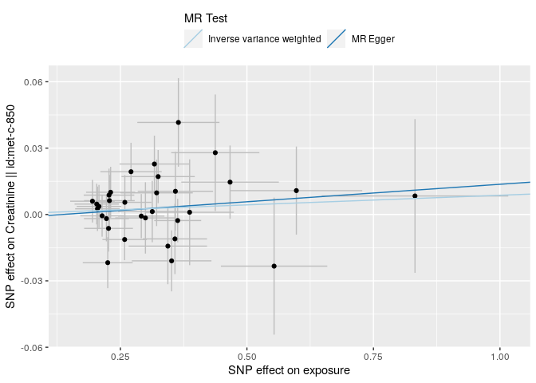

</div>

<div class="cell-output-display">


</div>

<div class="cell-output-display">


</div>

<div class="cell-output-display">


</div>

<div class="cell-output-display">

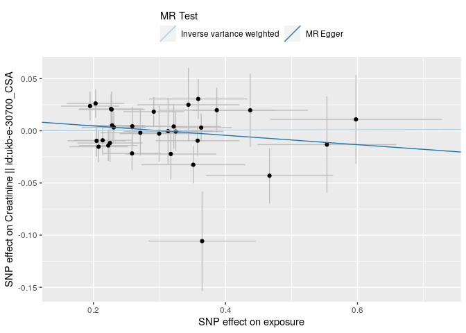

</div>

<div class="cell-output-display">


</div>

<div class="cell-output-display">


</div>

<div class="cell-output-display">


</div>

<div class="cell-output-display">


</div>

<div class="cell-output-display">


</div>

<div class="cell-output-display">


</div>

<div class="cell-output-display">


</div>

<div class="cell-output-display">


</div>

<div class="cell-output-display">


</div>

    Warning: Removed 1 rows containing missing values (`geom_errorbarh()`).
    Removed 1 rows containing missing values (`geom_point()`).

<div class="cell-output-display">


</div>

    Warning: Removed 1 rows containing missing values (`geom_errorbarh()`).
    Removed 1 rows containing missing values (`geom_point()`).

<div class="cell-output-display">


</div>

    Warning: Removed 1 rows containing missing values (`geom_errorbarh()`).
    Removed 1 rows containing missing values (`geom_point()`).

<div class="cell-output-display">


</div>

    Warning: Removed 1 rows containing missing values (`geom_errorbarh()`).
    Removed 1 rows containing missing values (`geom_point()`).

<div class="cell-output-display">


</div>

    Warning: Removed 1 rows containing missing values (`geom_errorbarh()`).
    Removed 1 rows containing missing values (`geom_point()`).

<div class="cell-output-display">


</div>

    Warning: Removed 1 rows containing missing values (`geom_errorbarh()`).
    Removed 1 rows containing missing values (`geom_point()`).

<div class="cell-output-display">


</div>

    Warning: Removed 1 rows containing missing values (`geom_errorbarh()`).
    Removed 1 rows containing missing values (`geom_point()`).

<div class="cell-output-display">


</div>

    Warning: Removed 1 rows containing missing values (`geom_errorbarh()`).
    Removed 1 rows containing missing values (`geom_point()`).

<div class="cell-output-display">


</div>

    Warning: Removed 1 rows containing missing values (`geom_errorbarh()`).
    Removed 1 rows containing missing values (`geom_point()`).

<div class="cell-output-display">


</div>

    Warning: Removed 1 rows containing missing values (`geom_errorbarh()`).
    Removed 1 rows containing missing values (`geom_point()`).

<div class="cell-output-display">


</div>

    Warning: Removed 1 rows containing missing values (`geom_errorbarh()`).
    Removed 1 rows containing missing values (`geom_point()`).

<div class="cell-output-display">


</div>

    Warning: Removed 1 rows containing missing values (`geom_errorbarh()`).
    Removed 1 rows containing missing values (`geom_point()`).

<div class="cell-output-display">


</div>

    Warning: Removed 1 rows containing missing values (`geom_errorbarh()`).
    Removed 1 rows containing missing values (`geom_point()`).

<div class="cell-output-display">


</div>

    Warning: Removed 1 rows containing missing values (`geom_errorbarh()`).
    Removed 1 rows containing missing values (`geom_point()`).

<div class="cell-output-display">


</div>

    Warning: Removed 1 rows containing missing values (`geom_errorbarh()`).
    Removed 1 rows containing missing values (`geom_point()`).

<div class="cell-output-display">


</div>

    Warning: Removed 1 rows containing missing values (`geom_errorbarh()`).
    Removed 1 rows containing missing values (`geom_point()`).

<div class="cell-output-display">


</div>

    Warning: Removed 1 rows containing missing values (`geom_errorbarh()`).
    Removed 1 rows containing missing values (`geom_point()`).

<div class="cell-output-display">


</div>

    Warning: Removed 1 rows containing missing values (`geom_errorbarh()`).
    Removed 1 rows containing missing values (`geom_point()`).

<div class="cell-output-display">


</div>

    Warning: Removed 1 rows containing missing values (`geom_errorbarh()`).
    Removed 1 rows containing missing values (`geom_point()`).

<div class="cell-output-display">


</div>

    Warning: Removed 1 rows containing missing values (`geom_errorbarh()`).
    Removed 1 rows containing missing values (`geom_point()`).

<div class="cell-output-display">


</div>

    Warning: Removed 1 rows containing missing values (`geom_errorbarh()`).
    Removed 1 rows containing missing values (`geom_point()`).

<div class="cell-output-display">


</div>

    Warning: Removed 1 rows containing missing values (`geom_errorbarh()`).
    Removed 1 rows containing missing values (`geom_point()`).

<div class="cell-output-display">


</div>

    Warning: Removed 1 rows containing missing values (`geom_errorbarh()`).
    Removed 1 rows containing missing values (`geom_point()`).

<div class="cell-output-display">


</div>

    Warning: Removed 1 rows containing missing values (`geom_errorbarh()`).
    Removed 1 rows containing missing values (`geom_point()`).

<div class="cell-output-display">


</div>

    Warning: Removed 1 rows containing missing values (`geom_errorbarh()`).
    Removed 1 rows containing missing values (`geom_point()`).

<div class="cell-output-display">


</div>

    Warning: Removed 1 rows containing missing values (`geom_errorbarh()`).
    Removed 1 rows containing missing values (`geom_point()`).

<div class="cell-output-display">


</div>

    Warning: Removed 1 rows containing missing values (`geom_errorbarh()`).
    Removed 1 rows containing missing values (`geom_point()`).

<div class="cell-output-display">


</div>

    Warning: Removed 1 rows containing missing values (`geom_errorbarh()`).
    Removed 1 rows containing missing values (`geom_point()`).

<div class="cell-output-display">


</div>

    Warning: Removed 1 rows containing missing values (`geom_errorbarh()`).
    Removed 1 rows containing missing values (`geom_point()`).

<div class="cell-output-display">


</div>

    Warning: Removed 1 rows containing missing values (`geom_errorbarh()`).
    Removed 1 rows containing missing values (`geom_point()`).

<div class="cell-output-display">


</div>

    Warning: Removed 1 rows containing missing values (`geom_errorbarh()`).
    Removed 1 rows containing missing values (`geom_point()`).

<div class="cell-output-display">


</div>

    Warning: Removed 1 rows containing missing values (`geom_errorbarh()`).
    Removed 1 rows containing missing values (`geom_point()`).

<div class="cell-output-display">


</div>

    Warning: Removed 1 rows containing missing values (`geom_errorbarh()`).
    Removed 1 rows containing missing values (`geom_point()`).

<div class="cell-output-display">


</div>

    Warning: Removed 1 rows containing missing values (`geom_errorbarh()`).
    Removed 1 rows containing missing values (`geom_point()`).

<div class="cell-output-display">


</div>

    Warning: Removed 1 rows containing missing values (`geom_errorbarh()`).
    Removed 1 rows containing missing values (`geom_point()`).

<div class="cell-output-display">


</div>

    Warning: Removed 1 rows containing missing values (`geom_errorbarh()`).
    Removed 1 rows containing missing values (`geom_point()`).

<div class="cell-output-display">


</div>

    Warning: Removed 1 rows containing missing values (`geom_errorbarh()`).
    Removed 1 rows containing missing values (`geom_point()`).

<div class="cell-output-display">


</div>

    Warning: Removed 1 rows containing missing values (`geom_errorbarh()`).
    Removed 1 rows containing missing values (`geom_point()`).

<div class="cell-output-display">


</div>

    Warning: Removed 1 rows containing missing values (`geom_errorbarh()`).
    Removed 1 rows containing missing values (`geom_point()`).

<div class="cell-output-display">


</div>

    Warning: Removed 1 rows containing missing values (`geom_errorbarh()`).
    Removed 1 rows containing missing values (`geom_point()`).

<div class="cell-output-display">


</div>

    Warning: Removed 1 rows containing missing values (`geom_errorbarh()`).
    Removed 1 rows containing missing values (`geom_point()`).

<div class="cell-output-display">


</div>

    Warning: Removed 1 rows containing missing values (`geom_errorbarh()`).
    Removed 1 rows containing missing values (`geom_point()`).

<div class="cell-output-display">


</div>

    Warning: Removed 1 rows containing missing values (`geom_errorbarh()`).
    Removed 1 rows containing missing values (`geom_point()`).

<div class="cell-output-display">


</div>

    Warning: Removed 1 rows containing missing values (`geom_errorbarh()`).
    Removed 1 rows containing missing values (`geom_point()`).

<div class="cell-output-display">


</div>

    Warning: Removed 1 rows containing missing values (`geom_errorbarh()`).
    Removed 1 rows containing missing values (`geom_point()`).

<div class="cell-output-display">


</div>

    Warning: Removed 1 rows containing missing values (`geom_errorbarh()`).
    Removed 1 rows containing missing values (`geom_point()`).

<div class="cell-output-display">


</div>

    Warning: Removed 1 rows containing missing values (`geom_errorbarh()`).
    Removed 1 rows containing missing values (`geom_point()`).

<div class="cell-output-display">


</div>

    Warning: Removed 1 rows containing missing values (`geom_errorbarh()`).
    Removed 1 rows containing missing values (`geom_point()`).

<div class="cell-output-display">


</div>

    Warning: Removed 1 rows containing missing values (`geom_errorbarh()`).
    Removed 1 rows containing missing values (`geom_point()`).

<div class="cell-output-display">

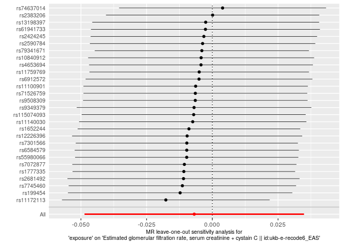

</div>

    Warning: Removed 1 rows containing missing values (`geom_errorbarh()`).
    Removed 1 rows containing missing values (`geom_point()`).

<div class="cell-output-display">


</div>

<div class="cell-output-display">


</div>

<div class="cell-output-display">


</div>

<div class="cell-output-display">


</div>

<div class="cell-output-display">


</div>

<div class="cell-output-display">


</div>

<div class="cell-output-display">


</div>

<div class="cell-output-display">


</div>

<div class="cell-output-display">


</div>

<div class="cell-output-display">


</div>

<div class="cell-output-display">


</div>

<div class="cell-output-display">


</div>

<div class="cell-output-display">


</div>

<div class="cell-output-display">


</div>

<div class="cell-output-display">


</div>

<div class="cell-output-display">


</div>

<div class="cell-output-display">


</div>

<div class="cell-output-display">


</div>

<div class="cell-output-display">


</div>

<div class="cell-output-display">


</div>

<div class="cell-output-display">


</div>

<div class="cell-output-display">


</div>

<div class="cell-output-display">


</div>

<div class="cell-output-display">


</div>

<div class="cell-output-display">


</div>

### MR for id trait ncase group_name year author consortium sex pmid population unit sample_size build ncontrol category subcategory ontology note mr nsnp priority sd outcomes

    Extracting data for 32 SNP(s) from 9 GWAS(s)

    Server code: 502; Server is possibly experiencing traffic, trying again...

    Retry succeeded!

    Finding proxies for 9 SNPs in outcome ukb-e-30720_AFR

    Extracting data for 9 SNP(s) from 1 GWAS(s)

    Server code: 502; Server is possibly experiencing traffic, trying again...
    Server code: 502; Server is possibly experiencing traffic, trying again...
    Server code: 502; Server is possibly experiencing traffic, trying again...
    Server code: 502; Server is possibly experiencing traffic, trying again...

    Retry succeeded!

    Finding proxies for 26 SNPs in outcome prot-c-2609_59_2

    Extracting data for 26 SNP(s) from 1 GWAS(s)

    Server code: 502; Server is possibly experiencing traffic, trying again...

    Retry succeeded!

    Finding proxies for 5 SNPs in outcome ukb-e-30720_EAS

    Extracting data for 5 SNP(s) from 1 GWAS(s)

    Server code: 502; Server is possibly experiencing traffic, trying again...
    Server code: 502; Server is possibly experiencing traffic, trying again...

    Retry succeeded!

    Finding proxies for 16 SNPs in outcome ieu-a-1106

    Extracting data for 16 SNP(s) from 1 GWAS(s)

    Finding proxies for 16 SNPs in outcome ebi-a-GCST003375

    Extracting data for 16 SNP(s) from 1 GWAS(s)

    Server code: 502; Server is possibly experiencing traffic, trying again...
    Server code: 502; Server is possibly experiencing traffic, trying again...
    Server code: 502; Server is possibly experiencing traffic, trying again...

    Retry succeeded!

    Finding proxies for 2 SNPs in outcome ukb-e-30720_CSA

    Extracting data for 2 SNP(s) from 1 GWAS(s)

    Server code: 502; Server is possibly experiencing traffic, trying again...

    Retry succeeded!

    Harmonising exposure (W9v8KN) and Glomerular filtration rate (cystatin C) || id:ebi-a-GCST003375 (ebi-a-GCST003375)

    Harmonising exposure (W9v8KN) and Serum cystatin C (eGFRcys) || id:ieu-a-1106 (ieu-a-1106)

    Harmonising exposure (W9v8KN) and Cystatin C || id:prot-c-2609_59_2 (prot-c-2609_59_2)

    Harmonising exposure (W9v8KN) and Cystatin C || id:ukb-d-30720_irnt (ukb-d-30720_irnt)

    Harmonising exposure (W9v8KN) and Cystatin C || id:ukb-d-30720_raw (ukb-d-30720_raw)

    Harmonising exposure (W9v8KN) and Cystatin C || id:ukb-e-30720_AFR (ukb-e-30720_AFR)

    Harmonising exposure (W9v8KN) and Cystatin C || id:ukb-e-30720_CSA (ukb-e-30720_CSA)

    Harmonising exposure (W9v8KN) and Cystatin C || id:ukb-e-30720_EAS (ukb-e-30720_EAS)

    Harmonising exposure (W9v8KN) and Cystatin C || id:ukb-e-30720_MID (ukb-e-30720_MID)

    Analysing 'W9v8KN' on 'ebi-a-GCST003375'

    Analysing 'W9v8KN' on 'ieu-a-1106'

    Analysing 'W9v8KN' on 'prot-c-2609_59_2'

    Analysing 'W9v8KN' on 'ukb-d-30720_irnt'

    Analysing 'W9v8KN' on 'ukb-d-30720_raw'

    Analysing 'W9v8KN' on 'ukb-e-30720_AFR'

    Analysing 'W9v8KN' on 'ukb-e-30720_CSA'

    Analysing 'W9v8KN' on 'ukb-e-30720_EAS'

    Analysing 'W9v8KN' on 'ukb-e-30720_MID'

    Warning in !is.null(caption) && !is.na(caption): 'length(x) = 22 > 1' in
    coercion to 'logical(1)'

| id.exposure | id.outcome       | outcome                                                          | exposure | method                    | nsnp |          b |        se |      pval |
|:------------|:-----------------|:-----------------------------------------------------------------|:---------|:--------------------------|-----:|-----------:|----------:|----------:|
| W9v8KN      | ebi-a-GCST003375 | Glomerular filtration rate (cystatin C) \|\| id:ebi-a-GCST003375 | exposure | MR Egger                  |   22 | -0.0046794 | 0.0078758 | 0.5590769 |
| W9v8KN      | ebi-a-GCST003375 | Glomerular filtration rate (cystatin C) \|\| id:ebi-a-GCST003375 | exposure | Inverse variance weighted |   22 |  0.0001131 | 0.0018518 | 0.9513000 |
| W9v8KN      | ieu-a-1106       | Serum cystatin C (eGFRcys) \|\| id:ieu-a-1106                    | exposure | MR Egger                  |   22 | -0.0047170 | 0.0078820 | 0.5562530 |
| W9v8KN      | ieu-a-1106       | Serum cystatin C (eGFRcys) \|\| id:ieu-a-1106                    | exposure | Inverse variance weighted |   22 |  0.0000851 | 0.0018554 | 0.9634128 |
| W9v8KN      | prot-c-2609_59_2 | Cystatin C \|\| id:prot-c-2609_59_2                              | exposure | MR Egger                  |   12 |  0.3634559 | 0.2493712 | 0.1756571 |
| W9v8KN      | prot-c-2609_59_2 | Cystatin C \|\| id:prot-c-2609_59_2                              | exposure | Inverse variance weighted |   12 |  0.0197584 | 0.0676286 | 0.7701641 |
| W9v8KN      | ukb-d-30720_irnt | Cystatin C \|\| id:ukb-d-30720_irnt                              | exposure | MR Egger                  |   32 | -0.0046196 | 0.0094538 | 0.6286399 |
| W9v8KN      | ukb-d-30720_irnt | Cystatin C \|\| id:ukb-d-30720_irnt                              | exposure | Inverse variance weighted |   32 |  0.0044105 | 0.0027091 | 0.1035216 |
| W9v8KN      | ukb-d-30720_raw  | Cystatin C \|\| id:ukb-d-30720_raw                               | exposure | MR Egger                  |   32 | -0.0013967 | 0.0014745 | 0.3510972 |
| W9v8KN      | ukb-d-30720_raw  | Cystatin C \|\| id:ukb-d-30720_raw                               | exposure | Inverse variance weighted |   32 |  0.0004471 | 0.0004274 | 0.2954599 |
| W9v8KN      | ukb-e-30720_AFR  | Cystatin C \|\| id:ukb-e-30720_AFR                               | exposure | MR Egger                  |   26 | -0.0326708 | 0.0968362 | 0.7387619 |
| W9v8KN      | ukb-e-30720_AFR  | Cystatin C \|\| id:ukb-e-30720_AFR                               | exposure | Inverse variance weighted |   26 |  0.0179420 | 0.0194975 | 0.3574584 |
| W9v8KN      | ukb-e-30720_CSA  | Cystatin C \|\| id:ukb-e-30720_CSA                               | exposure | MR Egger                  |   31 | -0.0388525 | 0.0459918 | 0.4051551 |
| W9v8KN      | ukb-e-30720_CSA  | Cystatin C \|\| id:ukb-e-30720_CSA                               | exposure | Inverse variance weighted |   31 | -0.0070651 | 0.0119448 | 0.5541965 |
| W9v8KN      | ukb-e-30720_EAS  | Cystatin C \|\| id:ukb-e-30720_EAS                               | exposure | MR Egger                  |   28 |  0.0928496 | 0.1074996 | 0.3956400 |
| W9v8KN      | ukb-e-30720_EAS  | Cystatin C \|\| id:ukb-e-30720_EAS                               | exposure | Inverse variance weighted |   28 |  0.0097064 | 0.0253413 | 0.7017003 |
| W9v8KN      | ukb-e-30720_MID  | Cystatin C \|\| id:ukb-e-30720_MID                               | exposure | MR Egger                  |   32 |  0.1716698 | 0.1092570 | 0.1266136 |
| W9v8KN      | ukb-e-30720_MID  | Cystatin C \|\| id:ukb-e-30720_MID                               | exposure | Inverse variance weighted |   32 |  0.0426665 | 0.0310709 | 0.1696917 |

MR Egger and MR IVW for id Table: MR Egger and MR IVW for trait Table:
MR Egger and MR IVW for ncase Table: MR Egger and MR IVW for group_name
Table: MR Egger and MR IVW for year Table: MR Egger and MR IVW for
author Table: MR Egger and MR IVW for consortium Table: MR Egger and MR
IVW for sex Table: MR Egger and MR IVW for pmid Table: MR Egger and MR
IVW for population Table: MR Egger and MR IVW for unit Table: MR Egger
and MR IVW for sample_size Table: MR Egger and MR IVW for build Table:
MR Egger and MR IVW for ncontrol Table: MR Egger and MR IVW for category
Table: MR Egger and MR IVW for subcategory Table: MR Egger and MR IVW
for ontology Table: MR Egger and MR IVW for note Table: MR Egger and MR
IVW for mr Table: MR Egger and MR IVW for nsnp Table: MR Egger and MR
IVW for priority Table: MR Egger and MR IVW for sd

    Warning in !is.null(caption) && !is.na(caption): 'length(x) = 22 > 1' in
    coercion to 'logical(1)'

| id.exposure | id.outcome       | outcome                                                          | exposure | method                    |        Q | Q_df |    Q_pval |
|:------------|:-----------------|:-----------------------------------------------------------------|:---------|:--------------------------|---------:|-----:|----------:|
| W9v8KN      | ebi-a-GCST003375 | Glomerular filtration rate (cystatin C) \|\| id:ebi-a-GCST003375 | exposure | MR Egger                  | 15.82793 |   20 | 0.7272400 |
| W9v8KN      | ebi-a-GCST003375 | Glomerular filtration rate (cystatin C) \|\| id:ebi-a-GCST003375 | exposure | Inverse variance weighted | 16.21988 |   21 | 0.7571724 |
| W9v8KN      | ieu-a-1106       | Serum cystatin C (eGFRcys) \|\| id:ieu-a-1106                    | exposure | MR Egger                  | 16.93654 |   20 | 0.6570903 |
| W9v8KN      | ieu-a-1106       | Serum cystatin C (eGFRcys) \|\| id:ieu-a-1106                    | exposure | Inverse variance weighted | 17.32951 |   21 | 0.6909488 |
| W9v8KN      | prot-c-2609_59_2 | Cystatin C \|\| id:prot-c-2609_59_2                              | exposure | MR Egger                  | 18.16783 |   10 | 0.0521977 |
| W9v8KN      | prot-c-2609_59_2 | Cystatin C \|\| id:prot-c-2609_59_2                              | exposure | Inverse variance weighted | 21.86766 |   11 | 0.0254188 |
| W9v8KN      | ukb-d-30720_irnt | Cystatin C \|\| id:ukb-d-30720_irnt                              | exposure | MR Egger                  | 71.56714 |   30 | 0.0000299 |
| W9v8KN      | ukb-d-30720_irnt | Cystatin C \|\| id:ukb-d-30720_irnt                              | exposure | Inverse variance weighted | 73.93845 |   31 | 0.0000228 |
| W9v8KN      | ukb-d-30720_raw  | Cystatin C \|\| id:ukb-d-30720_raw                               | exposure | MR Egger                  | 54.57879 |   30 | 0.0039603 |
| W9v8KN      | ukb-d-30720_raw  | Cystatin C \|\| id:ukb-d-30720_raw                               | exposure | Inverse variance weighted | 57.67796 |   31 | 0.0025094 |
| W9v8KN      | ukb-e-30720_AFR  | Cystatin C \|\| id:ukb-e-30720_AFR                               | exposure | MR Egger                  | 21.53934 |   24 | 0.6067407 |
| W9v8KN      | ukb-e-30720_AFR  | Cystatin C \|\| id:ukb-e-30720_AFR                               | exposure | Inverse variance weighted | 21.82406 |   25 | 0.6458823 |
| W9v8KN      | ukb-e-30720_CSA  | Cystatin C \|\| id:ukb-e-30720_CSA                               | exposure | MR Egger                  | 28.52899 |   29 | 0.4897835 |
| W9v8KN      | ukb-e-30720_CSA  | Cystatin C \|\| id:ukb-e-30720_CSA                               | exposure | Inverse variance weighted | 29.04123 |   30 | 0.5154313 |
| W9v8KN      | ukb-e-30720_EAS  | Cystatin C \|\| id:ukb-e-30720_EAS                               | exposure | MR Egger                  | 40.44469 |   26 | 0.0352632 |
| W9v8KN      | ukb-e-30720_EAS  | Cystatin C \|\| id:ukb-e-30720_EAS                               | exposure | Inverse variance weighted | 41.43077 |   27 | 0.0374211 |
| W9v8KN      | ukb-e-30720_MID  | Cystatin C \|\| id:ukb-e-30720_MID                               | exposure | MR Egger                  | 36.33602 |   30 | 0.1972811 |
| W9v8KN      | ukb-e-30720_MID  | Cystatin C \|\| id:ukb-e-30720_MID                               | exposure | Inverse variance weighted | 38.17053 |   31 | 0.1756941 |

Heterogeneity test for id Table: Heterogeneity test for trait Table:
Heterogeneity test for ncase Table: Heterogeneity test for group_name
Table: Heterogeneity test for year Table: Heterogeneity test for author
Table: Heterogeneity test for consortium Table: Heterogeneity test for
sex Table: Heterogeneity test for pmid Table: Heterogeneity test for
population Table: Heterogeneity test for unit Table: Heterogeneity test
for sample_size Table: Heterogeneity test for build Table: Heterogeneity
test for ncontrol Table: Heterogeneity test for category Table:
Heterogeneity test for subcategory Table: Heterogeneity test for
ontology Table: Heterogeneity test for note Table: Heterogeneity test
for mr Table: Heterogeneity test for nsnp Table: Heterogeneity test for
priority Table: Heterogeneity test for sd

    Warning in !is.null(caption) && !is.na(caption): 'length(x) = 22 > 1' in
    coercion to 'logical(1)'

| id.exposure | id.outcome       | outcome                                                          | exposure | egger_intercept |        se |      pval |
|:------------|:-----------------|:-----------------------------------------------------------------|:---------|----------------:|----------:|----------:|
| W9v8KN      | ebi-a-GCST003375 | Glomerular filtration rate (cystatin C) \|\| id:ebi-a-GCST003375 | exposure |       0.0013500 | 0.0021563 | 0.5383582 |
| W9v8KN      | ieu-a-1106       | Serum cystatin C (eGFRcys) \|\| id:ieu-a-1106                    | exposure |       0.0013522 | 0.0021570 | 0.5378356 |
| W9v8KN      | prot-c-2609_59_2 | Cystatin C \|\| id:prot-c-2609_59_2                              | exposure |      -0.1073903 | 0.0752534 | 0.1840355 |
| W9v8KN      | ukb-d-30720_irnt | Cystatin C \|\| id:ukb-d-30720_irnt                              | exposure |       0.0027056 | 0.0027137 | 0.3267357 |
| W9v8KN      | ukb-d-30720_raw  | Cystatin C \|\| id:ukb-d-30720_raw                               | exposure |       0.0005524 | 0.0004233 | 0.2017523 |
| W9v8KN      | ukb-e-30720_AFR  | Cystatin C \|\| id:ukb-e-30720_AFR                               | exposure |       0.0134309 | 0.0251708 | 0.5985319 |
| W9v8KN      | ukb-e-30720_CSA  | Cystatin C \|\| id:ukb-e-30720_CSA                               | exposure |       0.0093164 | 0.0130169 | 0.4798927 |
| W9v8KN      | ukb-e-30720_EAS  | Cystatin C \|\| id:ukb-e-30720_EAS                               | exposure |      -0.0240024 | 0.0301470 | 0.4331379 |
| W9v8KN      | ukb-e-30720_MID  | Cystatin C \|\| id:ukb-e-30720_MID                               | exposure |      -0.0382705 | 0.0310965 | 0.2279971 |

Pleiotropy test for id Table: Pleiotropy test for trait Table:
Pleiotropy test for ncase Table: Pleiotropy test for group_name Table:
Pleiotropy test for year Table: Pleiotropy test for author Table:
Pleiotropy test for consortium Table: Pleiotropy test for sex Table:
Pleiotropy test for pmid Table: Pleiotropy test for population Table:
Pleiotropy test for unit Table: Pleiotropy test for sample_size Table:
Pleiotropy test for build Table: Pleiotropy test for ncontrol Table:
Pleiotropy test for category Table: Pleiotropy test for subcategory
Table: Pleiotropy test for ontology Table: Pleiotropy test for note
Table: Pleiotropy test for mr Table: Pleiotropy test for nsnp Table:
Pleiotropy test for priority Table: Pleiotropy test for sd

    Warning in !is.null(caption) && !is.na(caption): 'length(x) = 22 > 1' in
    coercion to 'logical(1)'

| exposure | outcome                                                          | id.exposure | id.outcome       | samplesize | SNP                             |          b |        se |         p |
|:---------|:-----------------------------------------------------------------|:------------|:-----------------|-----------:|:--------------------------------|-----------:|----------:|----------:|
| exposure | Glomerular filtration rate (cystatin C) \|\| id:ebi-a-GCST003375 | W9v8KN      | ebi-a-GCST003375 |      32834 | rs10840912                      | -0.0048544 | 0.0097087 | 0.6170751 |
| exposure | Glomerular filtration rate (cystatin C) \|\| id:ebi-a-GCST003375 | W9v8KN      | ebi-a-GCST003375 |      32834 | rs11100901                      | -0.0030769 | 0.0096703 | 0.7503470 |
| exposure | Glomerular filtration rate (cystatin C) \|\| id:ebi-a-GCST003375 | W9v8KN      | ebi-a-GCST003375 |      32834 | rs11140030                      | -0.0044280 | 0.0147601 | 0.7641772 |
| exposure | Glomerular filtration rate (cystatin C) \|\| id:ebi-a-GCST003375 | W9v8KN      | ebi-a-GCST003375 |      32834 | rs11172113                      |  0.0113285 | 0.0068658 | 0.0989429 |
| exposure | Glomerular filtration rate (cystatin C) \|\| id:ebi-a-GCST003375 | W9v8KN      | ebi-a-GCST003375 |      32834 | rs115074093                     |  0.0055265 | 0.0101803 | 0.5872282 |
| exposure | Glomerular filtration rate (cystatin C) \|\| id:ebi-a-GCST003375 | W9v8KN      | ebi-a-GCST003375 |      32834 | rs11759769                      | -0.0026667 | 0.0097778 | 0.7850629 |
| exposure | Glomerular filtration rate (cystatin C) \|\| id:ebi-a-GCST003375 | W9v8KN      | ebi-a-GCST003375 |      32834 | rs12226396                      |  0.0126309 | 0.0104744 | 0.2278629 |
| exposure | Glomerular filtration rate (cystatin C) \|\| id:ebi-a-GCST003375 | W9v8KN      | ebi-a-GCST003375 |      32834 | rs13198397                      | -0.0042711 | 0.0071185 | 0.5485062 |
| exposure | Glomerular filtration rate (cystatin C) \|\| id:ebi-a-GCST003375 | W9v8KN      | ebi-a-GCST003375 |      32834 | rs1652244                       | -0.0009629 | 0.0096293 | 0.9203443 |
| exposure | Glomerular filtration rate (cystatin C) \|\| id:ebi-a-GCST003375 | W9v8KN      | ebi-a-GCST003375 |      32834 | rs199454                        | -0.0100464 | 0.0085008 | 0.2372779 |
| exposure | Glomerular filtration rate (cystatin C) \|\| id:ebi-a-GCST003375 | W9v8KN      | ebi-a-GCST003375 |      32834 | rs2383206                       |  0.0152559 | 0.0088583 | 0.0850293 |
| exposure | Glomerular filtration rate (cystatin C) \|\| id:ebi-a-GCST003375 | W9v8KN      | ebi-a-GCST003375 |      32834 | rs2424245                       | -0.0163934 | 0.0088272 | 0.0632908 |
| exposure | Glomerular filtration rate (cystatin C) \|\| id:ebi-a-GCST003375 | W9v8KN      | ebi-a-GCST003375 |      32834 | rs2590784                       |  0.0004496 | 0.0085432 | 0.9580255 |
| exposure | Glomerular filtration rate (cystatin C) \|\| id:ebi-a-GCST003375 | W9v8KN      | ebi-a-GCST003375 |      32834 | rs2681492                       | -0.0033538 | 0.0072666 | 0.6444123 |
| exposure | Glomerular filtration rate (cystatin C) \|\| id:ebi-a-GCST003375 | W9v8KN      | ebi-a-GCST003375 |      32834 | rs4653694                       |  0.0143770 | 0.0115016 | 0.2112995 |
| exposure | Glomerular filtration rate (cystatin C) \|\| id:ebi-a-GCST003375 | W9v8KN      | ebi-a-GCST003375 |      32834 | rs6584579                       |  0.0030801 | 0.0097536 | 0.7521623 |
| exposure | Glomerular filtration rate (cystatin C) \|\| id:ebi-a-GCST003375 | W9v8KN      | ebi-a-GCST003375 |      32834 | rs7072877                       | -0.0013004 | 0.0095362 | 0.8915338 |
| exposure | Glomerular filtration rate (cystatin C) \|\| id:ebi-a-GCST003375 | W9v8KN      | ebi-a-GCST003375 |      32834 | rs7301566                       |  0.0030960 | 0.0069659 | 0.6567213 |
| exposure | Glomerular filtration rate (cystatin C) \|\| id:ebi-a-GCST003375 | W9v8KN      | ebi-a-GCST003375 |      32834 | rs74637014                      |  0.0006219 | 0.0093284 | 0.9468471 |
| exposure | Glomerular filtration rate (cystatin C) \|\| id:ebi-a-GCST003375 | W9v8KN      | ebi-a-GCST003375 |      32834 | rs7745460                       |  0.0008364 | 0.0105938 | 0.9370745 |
| exposure | Glomerular filtration rate (cystatin C) \|\| id:ebi-a-GCST003375 | W9v8KN      | ebi-a-GCST003375 |      32834 | rs79341671                      |  0.0018404 | 0.0088673 | 0.8355826 |
| exposure | Glomerular filtration rate (cystatin C) \|\| id:ebi-a-GCST003375 | W9v8KN      | ebi-a-GCST003375 |      32834 | rs9349379                       | -0.0055066 | 0.0057819 | 0.3409038 |
| exposure | Glomerular filtration rate (cystatin C) \|\| id:ebi-a-GCST003375 | W9v8KN      | ebi-a-GCST003375 |      32834 | All - Inverse variance weighted |  0.0001131 | 0.0018518 | 0.9513000 |
| exposure | Glomerular filtration rate (cystatin C) \|\| id:ebi-a-GCST003375 | W9v8KN      | ebi-a-GCST003375 |      32834 | All - MR Egger                  | -0.0046794 | 0.0078758 | 0.5590769 |
| exposure | Serum cystatin C (eGFRcys) \|\| id:ieu-a-1106                    | W9v8KN      | ieu-a-1106       |      33145 | rs10840912                      | -0.0048544 | 0.0097087 | 0.6170751 |
| exposure | Serum cystatin C (eGFRcys) \|\| id:ieu-a-1106                    | W9v8KN      | ieu-a-1106       |      33145 | rs11100901                      | -0.0030769 | 0.0096703 | 0.7503470 |
| exposure | Serum cystatin C (eGFRcys) \|\| id:ieu-a-1106                    | W9v8KN      | ieu-a-1106       |      33145 | rs11140030                      | -0.0044280 | 0.0147601 | 0.7641772 |
| exposure | Serum cystatin C (eGFRcys) \|\| id:ieu-a-1106                    | W9v8KN      | ieu-a-1106       |      33145 | rs11172113                      |  0.0113285 | 0.0068658 | 0.0989429 |
| exposure | Serum cystatin C (eGFRcys) \|\| id:ieu-a-1106                    | W9v8KN      | ieu-a-1106       |      33145 | rs115074093                     |  0.0055265 | 0.0101803 | 0.5872282 |
| exposure | Serum cystatin C (eGFRcys) \|\| id:ieu-a-1106                    | W9v8KN      | ieu-a-1106       |      33145 | rs11759769                      | -0.0026667 | 0.0097778 | 0.7850629 |
| exposure | Serum cystatin C (eGFRcys) \|\| id:ieu-a-1106                    | W9v8KN      | ieu-a-1106       |      33145 | rs12226396                      |  0.0126309 | 0.0104744 | 0.2278629 |
| exposure | Serum cystatin C (eGFRcys) \|\| id:ieu-a-1106                    | W9v8KN      | ieu-a-1106       |      33145 | rs13198397                      | -0.0042711 | 0.0071185 | 0.5485062 |
| exposure | Serum cystatin C (eGFRcys) \|\| id:ieu-a-1106                    | W9v8KN      | ieu-a-1106       |      33145 | rs1652244                       | -0.0009629 | 0.0096293 | 0.9203443 |
| exposure | Serum cystatin C (eGFRcys) \|\| id:ieu-a-1106                    | W9v8KN      | ieu-a-1106       |      33145 | rs199454                        | -0.0131376 | 0.0085008 | 0.1222364 |
| exposure | Serum cystatin C (eGFRcys) \|\| id:ieu-a-1106                    | W9v8KN      | ieu-a-1106       |      33145 | rs2383206                       |  0.0152559 | 0.0088583 | 0.0850293 |
| exposure | Serum cystatin C (eGFRcys) \|\| id:ieu-a-1106                    | W9v8KN      | ieu-a-1106       |      33145 | rs2424245                       | -0.0163934 | 0.0088272 | 0.0632908 |
| exposure | Serum cystatin C (eGFRcys) \|\| id:ieu-a-1106                    | W9v8KN      | ieu-a-1106       |      33145 | rs2590784                       |  0.0004496 | 0.0085432 | 0.9580255 |
| exposure | Serum cystatin C (eGFRcys) \|\| id:ieu-a-1106                    | W9v8KN      | ieu-a-1106       |      33145 | rs2681492                       | -0.0033538 | 0.0072666 | 0.6444123 |
| exposure | Serum cystatin C (eGFRcys) \|\| id:ieu-a-1106                    | W9v8KN      | ieu-a-1106       |      33145 | rs4653694                       |  0.0143770 | 0.0124601 | 0.2485632 |
| exposure | Serum cystatin C (eGFRcys) \|\| id:ieu-a-1106                    | W9v8KN      | ieu-a-1106       |      33145 | rs6584579                       |  0.0030801 | 0.0097536 | 0.7521623 |
| exposure | Serum cystatin C (eGFRcys) \|\| id:ieu-a-1106                    | W9v8KN      | ieu-a-1106       |      33145 | rs7072877                       | -0.0013004 | 0.0095362 | 0.8915338 |
| exposure | Serum cystatin C (eGFRcys) \|\| id:ieu-a-1106                    | W9v8KN      | ieu-a-1106       |      33145 | rs7301566                       |  0.0050310 | 0.0069659 | 0.4701579 |
| exposure | Serum cystatin C (eGFRcys) \|\| id:ieu-a-1106                    | W9v8KN      | ieu-a-1106       |      33145 | rs74637014                      |  0.0015547 | 0.0093284 | 0.8676323 |
| exposure | Serum cystatin C (eGFRcys) \|\| id:ieu-a-1106                    | W9v8KN      | ieu-a-1106       |      33145 | rs7745460                       |  0.0008364 | 0.0105938 | 0.9370745 |
| exposure | Serum cystatin C (eGFRcys) \|\| id:ieu-a-1106                    | W9v8KN      | ieu-a-1106       |      33145 | rs79341671                      |  0.0018404 | 0.0088673 | 0.8355826 |
| exposure | Serum cystatin C (eGFRcys) \|\| id:ieu-a-1106                    | W9v8KN      | ieu-a-1106       |      33145 | rs9349379                       | -0.0055066 | 0.0057819 | 0.3409038 |
| exposure | Serum cystatin C (eGFRcys) \|\| id:ieu-a-1106                    | W9v8KN      | ieu-a-1106       |      33145 | All - Inverse variance weighted |  0.0000851 | 0.0018554 | 0.9634128 |
| exposure | Serum cystatin C (eGFRcys) \|\| id:ieu-a-1106                    | W9v8KN      | ieu-a-1106       |      33145 | All - MR Egger                  | -0.0047170 | 0.0078820 | 0.5562530 |
| exposure | Cystatin C \|\| id:prot-c-2609_59_2                              | W9v8KN      | prot-c-2609_59_2 |        997 | rs11100901                      | -0.0935824 | 0.2150330 | 0.6634170 |
| exposure | Cystatin C \|\| id:prot-c-2609_59_2                              | W9v8KN      | prot-c-2609_59_2 |        997 | rs11172113                      | -0.2993821 | 0.1485029 | 0.0437998 |
| exposure | Cystatin C \|\| id:prot-c-2609_59_2                              | W9v8KN      | prot-c-2609_59_2 |        997 | rs13198397                      | -0.0770786 | 0.1507796 | 0.6092108 |
| exposure | Cystatin C \|\| id:prot-c-2609_59_2                              | W9v8KN      | prot-c-2609_59_2 |        997 | rs199454                        |  0.4146059 | 0.2053520 | 0.0434871 |
| exposure | Cystatin C \|\| id:prot-c-2609_59_2                              | W9v8KN      | prot-c-2609_59_2 |        997 | rs2383206                       | -0.2608760 | 0.2019163 | 0.1963570 |
| exposure | Cystatin C \|\| id:prot-c-2609_59_2                              | W9v8KN      | prot-c-2609_59_2 |        997 | rs2590784                       |  0.2787770 | 0.2005589 | 0.1645287 |
| exposure | Cystatin C \|\| id:prot-c-2609_59_2                              | W9v8KN      | prot-c-2609_59_2 |        997 | rs2681492                       |  0.0667412 | 0.1556828 | 0.6681416 |
| exposure | Cystatin C \|\| id:prot-c-2609_59_2                              | W9v8KN      | prot-c-2609_59_2 |        997 | rs7301566                       | -0.1265480 | 0.1635832 | 0.4391673 |
| exposure | Cystatin C \|\| id:prot-c-2609_59_2                              | W9v8KN      | prot-c-2609_59_2 |        997 | rs74637014                      | -0.0394279 | 0.1858050 | 0.8319509 |
| exposure | Cystatin C \|\| id:prot-c-2609_59_2                              | W9v8KN      | prot-c-2609_59_2 |        997 | rs7745460                       |  0.2219682 | 0.2363627 | 0.3476794 |
| exposure | Cystatin C \|\| id:prot-c-2609_59_2                              | W9v8KN      | prot-c-2609_59_2 |        997 | rs79341671                      |  0.4018738 | 0.1423067 | 0.0047429 |
| exposure | Cystatin C \|\| id:prot-c-2609_59_2                              | W9v8KN      | prot-c-2609_59_2 |        997 | rs9349379                       | -0.0460352 | 0.1149157 | 0.6887147 |
| exposure | Cystatin C \|\| id:prot-c-2609_59_2                              | W9v8KN      | prot-c-2609_59_2 |        997 | All - Inverse variance weighted |  0.0197584 | 0.0676286 | 0.7701641 |
| exposure | Cystatin C \|\| id:prot-c-2609_59_2                              | W9v8KN      | prot-c-2609_59_2 |        997 | All - MR Egger                  |  0.3634559 | 0.2493712 | 0.1756571 |
| exposure | Cystatin C \|\| id:ukb-d-30720_irnt                              | W9v8KN      | ukb-d-30720_irnt |     344264 | rs10840912                      | -0.0038308 | 0.0109214 | 0.7257656 |
| exposure | Cystatin C \|\| id:ukb-d-30720_irnt                              | W9v8KN      | ukb-d-30720_irnt |     344264 | rs11100901                      |  0.0244778 | 0.0114651 | 0.0327617 |
| exposure | Cystatin C \|\| id:ukb-d-30720_irnt                              | W9v8KN      | ukb-d-30720_irnt |     344264 | rs11140030                      |  0.0077841 | 0.0119192 | 0.5137074 |
| exposure | Cystatin C \|\| id:ukb-d-30720_irnt                              | W9v8KN      | ukb-d-30720_irnt |     344264 | rs11172113                      |  0.0049008 | 0.0075898 | 0.5184673 |
| exposure | Cystatin C \|\| id:ukb-d-30720_irnt                              | W9v8KN      | ukb-d-30720_irnt |     344264 | rs115074093                     |  0.0477487 | 0.0105244 | 0.0000057 |
| exposure | Cystatin C \|\| id:ukb-d-30720_irnt                              | W9v8KN      | ukb-d-30720_irnt |     344264 | rs11759769                      |  0.0082191 | 0.0118071 | 0.4863566 |
| exposure | Cystatin C \|\| id:ukb-d-30720_irnt                              | W9v8KN      | ukb-d-30720_irnt |     344264 | rs12226396                      | -0.0270555 | 0.0104566 | 0.0096699 |
| exposure | Cystatin C \|\| id:ukb-d-30720_irnt                              | W9v8KN      | ukb-d-30720_irnt |     344264 | rs13198397                      |  0.0098477 | 0.0080271 | 0.2198940 |
| exposure | Cystatin C \|\| id:ukb-d-30720_irnt                              | W9v8KN      | ukb-d-30720_irnt |     344264 | rs148521708                     | -0.0154005 | 0.0121422 | 0.2046755 |
| exposure | Cystatin C \|\| id:ukb-d-30720_irnt                              | W9v8KN      | ukb-d-30720_irnt |     344264 | rs1652244                       |  0.0207944 | 0.0107607 | 0.0533054 |
| exposure | Cystatin C \|\| id:ukb-d-30720_irnt                              | W9v8KN      | ukb-d-30720_irnt |     344264 | rs1777335                       |  0.0066919 | 0.0102122 | 0.5122856 |
| exposure | Cystatin C \|\| id:ukb-d-30720_irnt                              | W9v8KN      | ukb-d-30720_irnt |     344264 | rs199454                        |  0.0034326 | 0.0098539 | 0.7275780 |
| exposure | Cystatin C \|\| id:ukb-d-30720_irnt                              | W9v8KN      | ukb-d-30720_irnt |     344264 | rs2383206                       |  0.0007900 | 0.0107229 | 0.9412692 |
| exposure | Cystatin C \|\| id:ukb-d-30720_irnt                              | W9v8KN      | ukb-d-30720_irnt |     344264 | rs2424245                       |  0.0071047 | 0.0103893 | 0.4940752 |
| exposure | Cystatin C \|\| id:ukb-d-30720_irnt                              | W9v8KN      | ukb-d-30720_irnt |     344264 | rs2590784                       | -0.0051281 | 0.0103772 | 0.6211846 |
| exposure | Cystatin C \|\| id:ukb-d-30720_irnt                              | W9v8KN      | ukb-d-30720_irnt |     344264 | rs2681492                       | -0.0014246 | 0.0080858 | 0.8601515 |
| exposure | Cystatin C \|\| id:ukb-d-30720_irnt                              | W9v8KN      | ukb-d-30720_irnt |     344264 | rs41444548                      |  0.0114111 | 0.0113513 | 0.3147681 |
| exposure | Cystatin C \|\| id:ukb-d-30720_irnt                              | W9v8KN      | ukb-d-30720_irnt |     344264 | rs4653694                       |  0.0137045 | 0.0110419 | 0.2145545 |
| exposure | Cystatin C \|\| id:ukb-d-30720_irnt                              | W9v8KN      | ukb-d-30720_irnt |     344264 | rs55980066                      |  0.0180620 | 0.0110850 | 0.1032257 |
| exposure | Cystatin C \|\| id:ukb-d-30720_irnt                              | W9v8KN      | ukb-d-30720_irnt |     344264 | rs61941733                      | -0.0183396 | 0.0116025 | 0.1139565 |
| exposure | Cystatin C \|\| id:ukb-d-30720_irnt                              | W9v8KN      | ukb-d-30720_irnt |     344264 | rs6584579                       | -0.0001152 | 0.0114815 | 0.9919963 |
| exposure | Cystatin C \|\| id:ukb-d-30720_irnt                              | W9v8KN      | ukb-d-30720_irnt |     344264 | rs6912572                       |  0.0218971 | 0.0106995 | 0.0407026 |
| exposure | Cystatin C \|\| id:ukb-d-30720_irnt                              | W9v8KN      | ukb-d-30720_irnt |     344264 | rs7072877                       |  0.0199749 | 0.0110498 | 0.0706525 |
| exposure | Cystatin C \|\| id:ukb-d-30720_irnt                              | W9v8KN      | ukb-d-30720_irnt |     344264 | rs71526759                      |  0.0011686 | 0.0106702 | 0.9127869 |
| exposure | Cystatin C \|\| id:ukb-d-30720_irnt                              | W9v8KN      | ukb-d-30720_irnt |     344264 | rs72675157                      | -0.0079864 | 0.0109781 | 0.4669291 |
| exposure | Cystatin C \|\| id:ukb-d-30720_irnt                              | W9v8KN      | ukb-d-30720_irnt |     344264 | rs72802873                      |  0.0003054 | 0.0106039 | 0.9770222 |
| exposure | Cystatin C \|\| id:ukb-d-30720_irnt                              | W9v8KN      | ukb-d-30720_irnt |     344264 | rs7301566                       | -0.0293704 | 0.0085430 | 0.0005861 |
| exposure | Cystatin C \|\| id:ukb-d-30720_irnt                              | W9v8KN      | ukb-d-30720_irnt |     344264 | rs74637014                      |  0.0008379 | 0.0104216 | 0.9359164 |
| exposure | Cystatin C \|\| id:ukb-d-30720_irnt                              | W9v8KN      | ukb-d-30720_irnt |     344264 | rs7745460                       |  0.0134447 | 0.0114232 | 0.2392108 |
| exposure | Cystatin C \|\| id:ukb-d-30720_irnt                              | W9v8KN      | ukb-d-30720_irnt |     344264 | rs79341671                      | -0.0056682 | 0.0075392 | 0.4521528 |
| exposure | Cystatin C \|\| id:ukb-d-30720_irnt                              | W9v8KN      | ukb-d-30720_irnt |     344264 | rs9349379                       |  0.0183929 | 0.0061044 | 0.0025861 |
| exposure | Cystatin C \|\| id:ukb-d-30720_irnt                              | W9v8KN      | ukb-d-30720_irnt |     344264 | rs9508309                       | -0.0054932 | 0.0106270 | 0.6052236 |
| exposure | Cystatin C \|\| id:ukb-d-30720_irnt                              | W9v8KN      | ukb-d-30720_irnt |     344264 | All - Inverse variance weighted |  0.0044105 | 0.0027091 | 0.1035216 |
| exposure | Cystatin C \|\| id:ukb-d-30720_irnt                              | W9v8KN      | ukb-d-30720_irnt |     344264 | All - MR Egger                  | -0.0046196 | 0.0094538 | 0.6286399 |
| exposure | Cystatin C \|\| id:ukb-d-30720_raw                               | W9v8KN      | ukb-d-30720_raw  |     344264 | rs10840912                      | -0.0006322 | 0.0019506 | 0.7458716 |
| exposure | Cystatin C \|\| id:ukb-d-30720_raw                               | W9v8KN      | ukb-d-30720_raw  |     344264 | rs11100901                      |  0.0028203 | 0.0020478 | 0.1684412 |
| exposure | Cystatin C \|\| id:ukb-d-30720_raw                               | W9v8KN      | ukb-d-30720_raw  |     344264 | rs11140030                      |  0.0014925 | 0.0021289 | 0.4832391 |
| exposure | Cystatin C \|\| id:ukb-d-30720_raw                               | W9v8KN      | ukb-d-30720_raw  |     344264 | rs11172113                      |  0.0005862 | 0.0013555 | 0.6654356 |
| exposure | Cystatin C \|\| id:ukb-d-30720_raw                               | W9v8KN      | ukb-d-30720_raw  |     344264 | rs115074093                     |  0.0055707 | 0.0018798 | 0.0030419 |
| exposure | Cystatin C \|\| id:ukb-d-30720_raw                               | W9v8KN      | ukb-d-30720_raw  |     344264 | rs11759769                      |  0.0002299 | 0.0021088 | 0.9131898 |
| exposure | Cystatin C \|\| id:ukb-d-30720_raw                               | W9v8KN      | ukb-d-30720_raw  |     344264 | rs12226396                      | -0.0026282 | 0.0018676 | 0.1593617 |
| exposure | Cystatin C \|\| id:ukb-d-30720_raw                               | W9v8KN      | ukb-d-30720_raw  |     344264 | rs13198397                      |  0.0012512 | 0.0014337 | 0.3828084 |
| exposure | Cystatin C \|\| id:ukb-d-30720_raw                               | W9v8KN      | ukb-d-30720_raw  |     344264 | rs148521708                     | -0.0050008 | 0.0021686 | 0.0211134 |
| exposure | Cystatin C \|\| id:ukb-d-30720_raw                               | W9v8KN      | ukb-d-30720_raw  |     344264 | rs1652244                       |  0.0045811 | 0.0019219 | 0.0171425 |
| exposure | Cystatin C \|\| id:ukb-d-30720_raw                               | W9v8KN      | ukb-d-30720_raw  |     344264 | rs1777335                       |  0.0003945 | 0.0018239 | 0.8287804 |
| exposure | Cystatin C \|\| id:ukb-d-30720_raw                               | W9v8KN      | ukb-d-30720_raw  |     344264 | rs199454                        | -0.0005464 | 0.0017600 | 0.7562251 |
| exposure | Cystatin C \|\| id:ukb-d-30720_raw                               | W9v8KN      | ukb-d-30720_raw  |     344264 | rs2383206                       |  0.0005390 | 0.0019152 | 0.7783690 |
| exposure | Cystatin C \|\| id:ukb-d-30720_raw                               | W9v8KN      | ukb-d-30720_raw  |     344264 | rs2424245                       |  0.0010676 | 0.0018556 | 0.5650492 |
| exposure | Cystatin C \|\| id:ukb-d-30720_raw                               | W9v8KN      | ukb-d-30720_raw  |     344264 | rs2590784                       | -0.0015415 | 0.0018534 | 0.4055738 |
| exposure | Cystatin C \|\| id:ukb-d-30720_raw                               | W9v8KN      | ukb-d-30720_raw  |     344264 | rs2681492                       |  0.0004880 | 0.0014442 | 0.7354235 |
| exposure | Cystatin C \|\| id:ukb-d-30720_raw                               | W9v8KN      | ukb-d-30720_raw  |     344264 | rs41444548                      |  0.0024740 | 0.0020274 | 0.2223530 |
| exposure | Cystatin C \|\| id:ukb-d-30720_raw                               | W9v8KN      | ukb-d-30720_raw  |     344264 | rs4653694                       |  0.0026345 | 0.0019721 | 0.1816002 |
| exposure | Cystatin C \|\| id:ukb-d-30720_raw                               | W9v8KN      | ukb-d-30720_raw  |     344264 | rs55980066                      |  0.0027002 | 0.0019799 | 0.1726234 |
| exposure | Cystatin C \|\| id:ukb-d-30720_raw                               | W9v8KN      | ukb-d-30720_raw  |     344264 | rs61941733                      | -0.0035076 | 0.0020723 | 0.0905246 |
| exposure | Cystatin C \|\| id:ukb-d-30720_raw                               | W9v8KN      | ukb-d-30720_raw  |     344264 | rs6584579                       | -0.0002797 | 0.0020507 | 0.8915025 |
| exposure | Cystatin C \|\| id:ukb-d-30720_raw                               | W9v8KN      | ukb-d-30720_raw  |     344264 | rs6912572                       |  0.0038174 | 0.0019110 | 0.0457633 |
| exposure | Cystatin C \|\| id:ukb-d-30720_raw                               | W9v8KN      | ukb-d-30720_raw  |     344264 | rs7072877                       |  0.0024332 | 0.0019736 | 0.2176309 |
| exposure | Cystatin C \|\| id:ukb-d-30720_raw                               | W9v8KN      | ukb-d-30720_raw  |     344264 | rs71526759                      | -0.0016147 | 0.0019058 | 0.3968425 |
| exposure | Cystatin C \|\| id:ukb-d-30720_raw                               | W9v8KN      | ukb-d-30720_raw  |     344264 | rs72675157                      | -0.0019877 | 0.0019607 | 0.3106825 |
| exposure | Cystatin C \|\| id:ukb-d-30720_raw                               | W9v8KN      | ukb-d-30720_raw  |     344264 | rs72802873                      |  0.0006999 | 0.0018940 | 0.7117442 |
| exposure | Cystatin C \|\| id:ukb-d-30720_raw                               | W9v8KN      | ukb-d-30720_raw  |     344264 | rs7301566                       | -0.0048166 | 0.0015258 | 0.0015955 |
| exposure | Cystatin C \|\| id:ukb-d-30720_raw                               | W9v8KN      | ukb-d-30720_raw  |     344264 | rs74637014                      |  0.0004558 | 0.0018614 | 0.8065365 |
| exposure | Cystatin C \|\| id:ukb-d-30720_raw                               | W9v8KN      | ukb-d-30720_raw  |     344264 | rs7745460                       |  0.0020863 | 0.0020403 | 0.3065097 |
| exposure | Cystatin C \|\| id:ukb-d-30720_raw                               | W9v8KN      | ukb-d-30720_raw  |     344264 | rs79341671                      | -0.0017206 | 0.0013466 | 0.2013307 |
| exposure | Cystatin C \|\| id:ukb-d-30720_raw                               | W9v8KN      | ukb-d-30720_raw  |     344264 | rs9349379                       |  0.0024363 | 0.0010903 | 0.0254522 |
| exposure | Cystatin C \|\| id:ukb-d-30720_raw                               | W9v8KN      | ukb-d-30720_raw  |     344264 | rs9508309                       | -0.0003504 | 0.0018980 | 0.8535534 |
| exposure | Cystatin C \|\| id:ukb-d-30720_raw                               | W9v8KN      | ukb-d-30720_raw  |     344264 | All - Inverse variance weighted |  0.0004471 | 0.0004274 | 0.2954599 |
| exposure | Cystatin C \|\| id:ukb-d-30720_raw                               | W9v8KN      | ukb-d-30720_raw  |     344264 | All - MR Egger                  | -0.0013967 | 0.0014745 | 0.3510972 |
| exposure | Cystatin C \|\| id:ukb-e-30720_AFR                               | W9v8KN      | ukb-e-30720_AFR  |         NA | rs10840912                      | -0.1334951 | 0.1246249 | 0.2840905 |
| exposure | Cystatin C \|\| id:ukb-e-30720_AFR                               | W9v8KN      | ukb-e-30720_AFR  |         NA | rs11100901                      |  0.1156923 | 0.0910769 | 0.2039884 |
| exposure | Cystatin C \|\| id:ukb-e-30720_AFR                               | W9v8KN      | ukb-e-30720_AFR  |         NA | rs11140030                      |  0.1037269 | 0.1018450 | 0.3084507 |
| exposure | Cystatin C \|\| id:ukb-e-30720_AFR                               | W9v8KN      | ukb-e-30720_AFR  |         NA | rs11172113                      | -0.0457261 | 0.0600069 | 0.4460518 |
| exposure | Cystatin C \|\| id:ukb-e-30720_AFR                               | W9v8KN      | ukb-e-30720_AFR  |         NA | rs115074093                     |  0.2434264 | 0.2621291 | 0.3530701 |
| exposure | Cystatin C \|\| id:ukb-e-30720_AFR                               | W9v8KN      | ukb-e-30720_AFR  |         NA | rs11759769                      | -0.0715111 | 0.1302667 | 0.5830333 |
| exposure | Cystatin C \|\| id:ukb-e-30720_AFR                               | W9v8KN      | ukb-e-30720_AFR  |         NA | rs12226396                      |  0.3743068 | 0.1563155 | 0.0166403 |
| exposure | Cystatin C \|\| id:ukb-e-30720_AFR                               | W9v8KN      | ukb-e-30720_AFR  |         NA | rs13198397                      | -0.0476651 | 0.1640945 | 0.7714539 |
| exposure | Cystatin C \|\| id:ukb-e-30720_AFR                               | W9v8KN      | ukb-e-30720_AFR  |         NA | rs148521708                     |  0.1548604 | 0.1517580 | 0.3075184 |
| exposure | Cystatin C \|\| id:ukb-e-30720_AFR                               | W9v8KN      | ukb-e-30720_AFR  |         NA | rs1652244                       |  0.3016370 | 0.1912374 | 0.1147286 |
| exposure | Cystatin C \|\| id:ukb-e-30720_AFR                               | W9v8KN      | ukb-e-30720_AFR  |         NA | rs1777335                       |  0.0471716 | 0.0904628 | 0.6020554 |
| exposure | Cystatin C \|\| id:ukb-e-30720_AFR                               | W9v8KN      | ukb-e-30720_AFR  |         NA | rs199454                        |  0.0693586 | 0.0687403 | 0.3129776 |
| exposure | Cystatin C \|\| id:ukb-e-30720_AFR                               | W9v8KN      | ukb-e-30720_AFR  |         NA | rs2383206                       |  0.0415650 | 0.0911909 | 0.6485328 |
| exposure | Cystatin C \|\| id:ukb-e-30720_AFR                               | W9v8KN      | ukb-e-30720_AFR  |         NA | rs2424245                       | -0.0695145 | 0.0591425 | 0.2398455 |
| exposure | Cystatin C \|\| id:ukb-e-30720_AFR                               | W9v8KN      | ukb-e-30720_AFR  |         NA | rs2590784                       |  0.0118885 | 0.0818795 | 0.8845570 |
| exposure | Cystatin C \|\| id:ukb-e-30720_AFR                               | W9v8KN      | ukb-e-30720_AFR  |         NA | rs2681492                       | -0.0197652 | 0.0736445 | 0.7884014 |
| exposure | Cystatin C \|\| id:ukb-e-30720_AFR                               | W9v8KN      | ukb-e-30720_AFR  |         NA | rs4653694                       | -0.1407029 | 0.2725240 | 0.6056481 |
| exposure | Cystatin C \|\| id:ukb-e-30720_AFR                               | W9v8KN      | ukb-e-30720_AFR  |         NA | rs55980066                      | -0.0628236 | 0.1266732 | 0.6199292 |
| exposure | Cystatin C \|\| id:ukb-e-30720_AFR                               | W9v8KN      | ukb-e-30720_AFR  |         NA | rs6584579                       |  0.0149949 | 0.0895791 | 0.8670612 |
| exposure | Cystatin C \|\| id:ukb-e-30720_AFR                               | W9v8KN      | ukb-e-30720_AFR  |         NA | rs6912572                       |  0.3430136 | 0.1729304 | 0.0473076 |
| exposure | Cystatin C \|\| id:ukb-e-30720_AFR                               | W9v8KN      | ukb-e-30720_AFR  |         NA | rs7072877                       |  0.0017681 | 0.0876463 | 0.9839053 |
| exposure | Cystatin C \|\| id:ukb-e-30720_AFR                               | W9v8KN      | ukb-e-30720_AFR  |         NA | rs7301566                       | -0.0315983 | 0.1199690 | 0.7922522 |
| exposure | Cystatin C \|\| id:ukb-e-30720_AFR                               | W9v8KN      | ukb-e-30720_AFR  |         NA | rs74637014                      |  0.0269310 | 0.2496891 | 0.9141083 |
| exposure | Cystatin C \|\| id:ukb-e-30720_AFR                               | W9v8KN      | ukb-e-30720_AFR  |         NA | rs7745460                       |  0.0312239 | 0.0640089 | 0.6256881 |
| exposure | Cystatin C \|\| id:ukb-e-30720_AFR                               | W9v8KN      | ukb-e-30720_AFR  |         NA | rs9349379                       | -0.0160352 | 0.1410518 | 0.9094888 |
| exposure | Cystatin C \|\| id:ukb-e-30720_AFR                               | W9v8KN      | ukb-e-30720_AFR  |         NA | rs9508309                       |  0.0058932 | 0.1774290 | 0.9735038 |
| exposure | Cystatin C \|\| id:ukb-e-30720_AFR                               | W9v8KN      | ukb-e-30720_AFR  |         NA | All - Inverse variance weighted |  0.0179420 | 0.0194975 | 0.3574584 |
| exposure | Cystatin C \|\| id:ukb-e-30720_AFR                               | W9v8KN      | ukb-e-30720_AFR  |         NA | All - MR Egger                  | -0.0326708 | 0.0968362 | 0.7387619 |
| exposure | Cystatin C \|\| id:ukb-e-30720_CSA                               | W9v8KN      | ukb-e-30720_CSA  |         NA | rs10840912                      | -0.0919682 | 0.0655781 | 0.1607891 |
| exposure | Cystatin C \|\| id:ukb-e-30720_CSA                               | W9v8KN      | ukb-e-30720_CSA  |         NA | rs11100901                      |  0.0537143 | 0.0783297 | 0.4928731 |
| exposure | Cystatin C \|\| id:ukb-e-30720_CSA                               | W9v8KN      | ukb-e-30720_CSA  |         NA | rs11140030                      |  0.0378967 | 0.0843911 | 0.6533884 |
| exposure | Cystatin C \|\| id:ukb-e-30720_CSA                               | W9v8KN      | ukb-e-30720_CSA  |         NA | rs11172113                      |  0.0945074 | 0.0502918 | 0.0602198 |
| exposure | Cystatin C \|\| id:ukb-e-30720_CSA                               | W9v8KN      | ukb-e-30720_CSA  |         NA | rs115074093                     |  0.0902560 | 0.0974404 | 0.3543064 |
| exposure | Cystatin C \|\| id:ukb-e-30720_CSA                               | W9v8KN      | ukb-e-30720_CSA  |         NA | rs11759769                      | -0.0745333 | 0.0834222 | 0.3716178 |
| exposure | Cystatin C \|\| id:ukb-e-30720_CSA                               | W9v8KN      | ukb-e-30720_CSA  |         NA | rs12226396                      |  0.0118238 | 0.0598891 | 0.8434926 |
| exposure | Cystatin C \|\| id:ukb-e-30720_CSA                               | W9v8KN      | ukb-e-30720_CSA  |         NA | rs13198397                      | -0.0925399 | 0.0531321 | 0.0815621 |
| exposure | Cystatin C \|\| id:ukb-e-30720_CSA                               | W9v8KN      | ukb-e-30720_CSA  |         NA | rs148521708                     | -0.0314891 | 0.0580403 | 0.5874473 |
| exposure | Cystatin C \|\| id:ukb-e-30720_CSA                               | W9v8KN      | ukb-e-30720_CSA  |         NA | rs1652244                       | -0.0798748 | 0.0748195 | 0.2857156 |
| exposure | Cystatin C \|\| id:ukb-e-30720_CSA                               | W9v8KN      | ukb-e-30720_CSA  |         NA | rs1777335                       | -0.0495091 | 0.0694717 | 0.4760615 |
| exposure | Cystatin C \|\| id:ukb-e-30720_CSA                               | W9v8KN      | ukb-e-30720_CSA  |         NA | rs199454                        |  0.1229134 | 0.0749614 | 0.1010695 |
| exposure | Cystatin C \|\| id:ukb-e-30720_CSA                               | W9v8KN      | ukb-e-30720_CSA  |         NA | rs2383206                       |  0.0360335 | 0.0703740 | 0.6086314 |
| exposure | Cystatin C \|\| id:ukb-e-30720_CSA                               | W9v8KN      | ukb-e-30720_CSA  |         NA | rs2424245                       | -0.1468159 | 0.0800757 | 0.0667335 |
| exposure | Cystatin C \|\| id:ukb-e-30720_CSA                               | W9v8KN      | ukb-e-30720_CSA  |         NA | rs2590784                       | -0.0554406 | 0.0697392 | 0.4266304 |
| exposure | Cystatin C \|\| id:ukb-e-30720_CSA                               | W9v8KN      | ukb-e-30720_CSA  |         NA | rs2681492                       |  0.0044857 | 0.0423421 | 0.9156295 |
| exposure | Cystatin C \|\| id:ukb-e-30720_CSA                               | W9v8KN      | ukb-e-30720_CSA  |         NA | rs41444548                      | -0.2420187 | 0.1367252 | 0.0767088 |
| exposure | Cystatin C \|\| id:ukb-e-30720_CSA                               | W9v8KN      | ukb-e-30720_CSA  |         NA | rs4653694                       | -0.0018534 | 0.1055911 | 0.9859961 |
| exposure | Cystatin C \|\| id:ukb-e-30720_CSA                               | W9v8KN      | ukb-e-30720_CSA  |         NA | rs55980066                      |  0.0679531 | 0.0773815 | 0.3798588 |
| exposure | Cystatin C \|\| id:ukb-e-30720_CSA                               | W9v8KN      | ukb-e-30720_CSA  |         NA | rs61941733                      | -0.0665095 | 0.0592243 | 0.2614332 |
| exposure | Cystatin C \|\| id:ukb-e-30720_CSA                               | W9v8KN      | ukb-e-30720_CSA  |         NA | rs6584579                       |  0.0458573 | 0.0739220 | 0.5350292 |
| exposure | Cystatin C \|\| id:ukb-e-30720_CSA                               | W9v8KN      | ukb-e-30720_CSA  |         NA | rs6912572                       | -0.0235918 | 0.0672799 | 0.7258502 |
| exposure | Cystatin C \|\| id:ukb-e-30720_CSA                               | W9v8KN      | ukb-e-30720_CSA  |         NA | rs7072877                       |  0.0541829 | 0.0683138 | 0.4276921 |
| exposure | Cystatin C \|\| id:ukb-e-30720_CSA                               | W9v8KN      | ukb-e-30720_CSA  |         NA | rs71526759                      | -0.0619200 | 0.0837029 | 0.4594458 |
| exposure | Cystatin C \|\| id:ukb-e-30720_CSA                               | W9v8KN      | ukb-e-30720_CSA  |         NA | rs72802873                      | -0.0364096 | 0.0868521 | 0.6750598 |
| exposure | Cystatin C \|\| id:ukb-e-30720_CSA                               | W9v8KN      | ukb-e-30720_CSA  |         NA | rs7301566                       | -0.0096749 | 0.0653638 | 0.8823297 |
| exposure | Cystatin C \|\| id:ukb-e-30720_CSA                               | W9v8KN      | ukb-e-30720_CSA  |         NA | rs74637014                      |  0.0097108 | 0.0686878 | 0.8875728 |
| exposure | Cystatin C \|\| id:ukb-e-30720_CSA                               | W9v8KN      | ukb-e-30720_CSA  |         NA | rs7745460                       |  0.0702258 | 0.0558684 | 0.2087587 |
| exposure | Cystatin C \|\| id:ukb-e-30720_CSA                               | W9v8KN      | ukb-e-30720_CSA  |         NA | rs79341671                      | -0.0039167 | 0.0745692 | 0.9581111 |
| exposure | Cystatin C \|\| id:ukb-e-30720_CSA                               | W9v8KN      | ukb-e-30720_CSA  |         NA | rs9349379                       | -0.0061949 | 0.0387941 | 0.8731271 |
| exposure | Cystatin C \|\| id:ukb-e-30720_CSA                               | W9v8KN      | ukb-e-30720_CSA  |         NA | rs9508309                       | -0.0897496 | 0.0936227 | 0.3377449 |
| exposure | Cystatin C \|\| id:ukb-e-30720_CSA                               | W9v8KN      | ukb-e-30720_CSA  |         NA | All - Inverse variance weighted | -0.0070651 | 0.0119448 | 0.5541965 |
| exposure | Cystatin C \|\| id:ukb-e-30720_CSA                               | W9v8KN      | ukb-e-30720_CSA  |         NA | All - MR Egger                  | -0.0388525 | 0.0459918 | 0.4051551 |
| exposure | Cystatin C \|\| id:ukb-e-30720_EAS                               | W9v8KN      | ukb-e-30720_EAS  |         NA | rs10840912                      |  0.0907326 | 0.1090468 | 0.4053797 |
| exposure | Cystatin C \|\| id:ukb-e-30720_EAS                               | W9v8KN      | ukb-e-30720_EAS  |         NA | rs11100901                      |  0.0487473 | 0.2106374 | 0.8169828 |
| exposure | Cystatin C \|\| id:ukb-e-30720_EAS                               | W9v8KN      | ukb-e-30720_EAS  |         NA | rs11140030                      | -0.0094244 | 0.1135055 | 0.9338278 |
| exposure | Cystatin C \|\| id:ukb-e-30720_EAS                               | W9v8KN      | ukb-e-30720_EAS  |         NA | rs11172113                      | -0.2299348 | 0.0913835 | 0.0118644 |
| exposure | Cystatin C \|\| id:ukb-e-30720_EAS                               | W9v8KN      | ukb-e-30720_EAS  |         NA | rs115074093                     | -0.0480221 | 0.3362420 | 0.8864323 |
| exposure | Cystatin C \|\| id:ukb-e-30720_EAS                               | W9v8KN      | ukb-e-30720_EAS  |         NA | rs11759769                      |  0.3556000 | 0.2493333 | 0.1538097 |
| exposure | Cystatin C \|\| id:ukb-e-30720_EAS                               | W9v8KN      | ukb-e-30720_EAS  |         NA | rs12226396                      | -0.0357671 | 0.0811768 | 0.6594974 |
| exposure | Cystatin C \|\| id:ukb-e-30720_EAS                               | W9v8KN      | ukb-e-30720_EAS  |         NA | rs13198397                      |  0.0987187 | 0.0878132 | 0.2609327 |
| exposure | Cystatin C \|\| id:ukb-e-30720_EAS                               | W9v8KN      | ukb-e-30720_EAS  |         NA | rs1652244                       | -0.1497833 | 0.1732306 | 0.3872326 |
| exposure | Cystatin C \|\| id:ukb-e-30720_EAS                               | W9v8KN      | ukb-e-30720_EAS  |         NA | rs1777335                       | -0.1410005 | 0.1166433 | 0.2267329 |
| exposure | Cystatin C \|\| id:ukb-e-30720_EAS                               | W9v8KN      | ukb-e-30720_EAS  |         NA | rs199454                        | -0.1126352 | 0.0912287 | 0.2169622 |
| exposure | Cystatin C \|\| id:ukb-e-30720_EAS                               | W9v8KN      | ukb-e-30720_EAS  |         NA | rs2383206                       |  0.2771654 | 0.1141240 | 0.0151559 |
| exposure | Cystatin C \|\| id:ukb-e-30720_EAS                               | W9v8KN      | ukb-e-30720_EAS  |         NA | rs2424245                       |  0.0911412 | 0.0948613 | 0.3366606 |
| exposure | Cystatin C \|\| id:ukb-e-30720_EAS                               | W9v8KN      | ukb-e-30720_EAS  |         NA | rs2590784                       |  0.1042716 | 0.1073291 | 0.3312932 |
| exposure | Cystatin C \|\| id:ukb-e-30720_EAS                               | W9v8KN      | ukb-e-30720_EAS  |         NA | rs2681492                       | -0.0440190 | 0.0702907 | 0.5311559 |
| exposure | Cystatin C \|\| id:ukb-e-30720_EAS                               | W9v8KN      | ukb-e-30720_EAS  |         NA | rs4653694                       |  0.1424920 | 0.1331949 | 0.2847089 |
| exposure | Cystatin C \|\| id:ukb-e-30720_EAS                               | W9v8KN      | ukb-e-30720_EAS  |         NA | rs55980066                      | -0.1675623 | 0.1331705 | 0.2083000 |
| exposure | Cystatin C \|\| id:ukb-e-30720_EAS                               | W9v8KN      | ukb-e-30720_EAS  |         NA | rs61941733                      |  0.0889222 | 0.0799229 | 0.2658800 |
| exposure | Cystatin C \|\| id:ukb-e-30720_EAS                               | W9v8KN      | ukb-e-30720_EAS  |         NA | rs6584579                       | -0.0842402 | 0.1233060 | 0.4944927 |
| exposure | Cystatin C \|\| id:ukb-e-30720_EAS                               | W9v8KN      | ukb-e-30720_EAS  |         NA | rs6912572                       |  0.0705650 | 0.1095488 | 0.5194831 |
| exposure | Cystatin C \|\| id:ukb-e-30720_EAS                               | W9v8KN      | ukb-e-30720_EAS  |         NA | rs7072877                       | -0.1020373 | 0.1084959 | 0.3469758 |
| exposure | Cystatin C \|\| id:ukb-e-30720_EAS                               | W9v8KN      | ukb-e-30720_EAS  |         NA | rs71526759                      |  0.1609371 | 0.3133714 | 0.6075549 |
| exposure | Cystatin C \|\| id:ukb-e-30720_EAS                               | W9v8KN      | ukb-e-30720_EAS  |         NA | rs7301566                       | -0.1580882 | 0.1469427 | 0.2819946 |
| exposure | Cystatin C \|\| id:ukb-e-30720_EAS                               | W9v8KN      | ukb-e-30720_EAS  |         NA | rs74637014                      |  0.2524254 | 0.0927861 | 0.0065181 |
| exposure | Cystatin C \|\| id:ukb-e-30720_EAS                               | W9v8KN      | ukb-e-30720_EAS  |         NA | rs7745460                       | -0.0849456 | 0.0845553 | 0.3150818 |
| exposure | Cystatin C \|\| id:ukb-e-30720_EAS                               | W9v8KN      | ukb-e-30720_EAS  |         NA | rs79341671                      |  0.4410239 | 0.2359043 | 0.0615528 |
| exposure | Cystatin C \|\| id:ukb-e-30720_EAS                               | W9v8KN      | ukb-e-30720_EAS  |         NA | rs9349379                       |  0.0096531 | 0.0676487 | 0.8865316 |
| exposure | Cystatin C \|\| id:ukb-e-30720_EAS                               | W9v8KN      | ukb-e-30720_EAS  |         NA | rs9508309                       |  0.0631720 | 0.2101169 | 0.7636802 |
| exposure | Cystatin C \|\| id:ukb-e-30720_EAS                               | W9v8KN      | ukb-e-30720_EAS  |         NA | All - Inverse variance weighted |  0.0097064 | 0.0253413 | 0.7017003 |
| exposure | Cystatin C \|\| id:ukb-e-30720_EAS                               | W9v8KN      | ukb-e-30720_EAS  |         NA | All - MR Egger                  |  0.0928496 | 0.1074996 | 0.3956400 |
| exposure | Cystatin C \|\| id:ukb-e-30720_MID                               | W9v8KN      | ukb-e-30720_MID  |         NA | rs10840912                      |  0.2639894 | 0.1824801 | 0.1479880 |
| exposure | Cystatin C \|\| id:ukb-e-30720_MID                               | W9v8KN      | ukb-e-30720_MID  |         NA | rs11100901                      | -0.2682198 | 0.1737143 | 0.1225815 |
| exposure | Cystatin C \|\| id:ukb-e-30720_MID                               | W9v8KN      | ukb-e-30720_MID  |         NA | rs11140030                      |  0.2735055 | 0.2077491 | 0.1880000 |
| exposure | Cystatin C \|\| id:ukb-e-30720_MID                               | W9v8KN      | ukb-e-30720_MID  |         NA | rs11172113                      |  0.1403364 | 0.1244078 | 0.2593050 |
| exposure | Cystatin C \|\| id:ukb-e-30720_MID                               | W9v8KN      | ukb-e-30720_MID  |         NA | rs115074093                     | -0.2120128 | 0.2946481 | 0.4718046 |
| exposure | Cystatin C \|\| id:ukb-e-30720_MID                               | W9v8KN      | ukb-e-30720_MID  |         NA | rs11759769                      |  0.2497333 | 0.1756444 | 0.1550809 |
| exposure | Cystatin C \|\| id:ukb-e-30720_MID                               | W9v8KN      | ukb-e-30720_MID  |         NA | rs12226396                      |  0.0508934 | 0.1851818 | 0.7834472 |
| exposure | Cystatin C \|\| id:ukb-e-30720_MID                               | W9v8KN      | ukb-e-30720_MID  |         NA | rs13198397                      |  0.0160421 | 0.1286731 | 0.9007820 |
| exposure | Cystatin C \|\| id:ukb-e-30720_MID                               | W9v8KN      | ukb-e-30720_MID  |         NA | rs148521708                     | -0.1584281 | 0.1545760 | 0.3054007 |
| exposure | Cystatin C \|\| id:ukb-e-30720_MID                               | W9v8KN      | ukb-e-30720_MID  |         NA | rs1652244                       | -0.2048628 | 0.1833895 | 0.2639554 |
| exposure | Cystatin C \|\| id:ukb-e-30720_MID                               | W9v8KN      | ukb-e-30720_MID  |         NA | rs1777335                       | -0.1504909 | 0.1591865 | 0.3444677 |
| exposure | Cystatin C \|\| id:ukb-e-30720_MID                               | W9v8KN      | ukb-e-30720_MID  |         NA | rs199454                        | -0.0972952 | 0.1427743 | 0.4955796 |
| exposure | Cystatin C \|\| id:ukb-e-30720_MID                               | W9v8KN      | ukb-e-30720_MID  |         NA | rs2383206                       | -0.1517224 | 0.1760827 | 0.3888776 |
| exposure | Cystatin C \|\| id:ukb-e-30720_MID                               | W9v8KN      | ukb-e-30720_MID  |         NA | rs2424245                       |  0.0220082 | 0.1275851 | 0.8630459 |
| exposure | Cystatin C \|\| id:ukb-e-30720_MID                               | W9v8KN      | ukb-e-30720_MID  |         NA | rs2590784                       | -0.1793165 | 0.1569245 | 0.2531659 |
| exposure | Cystatin C \|\| id:ukb-e-30720_MID                               | W9v8KN      | ukb-e-30720_MID  |         NA | rs2681492                       |  0.2482113 | 0.1046954 | 0.0177498 |
| exposure | Cystatin C \|\| id:ukb-e-30720_MID                               | W9v8KN      | ukb-e-30720_MID  |         NA | rs41444548                      | -0.2623423 | 0.2772902 | 0.3441012 |
| exposure | Cystatin C \|\| id:ukb-e-30720_MID                               | W9v8KN      | ukb-e-30720_MID  |         NA | rs4653694                       | -0.0719169 | 0.2209585 | 0.7448200 |
| exposure | Cystatin C \|\| id:ukb-e-30720_MID                               | W9v8KN      | ukb-e-30720_MID  |         NA | rs55980066                      | -0.0843674 | 0.1770884 | 0.6337796 |
| exposure | Cystatin C \|\| id:ukb-e-30720_MID                               | W9v8KN      | ukb-e-30720_MID  |         NA | rs61941733                      |  0.3419756 | 0.1813370 | 0.0593144 |
| exposure | Cystatin C \|\| id:ukb-e-30720_MID                               | W9v8KN      | ukb-e-30720_MID  |         NA | rs6584579                       | -0.0672998 | 0.1724333 | 0.6963186 |
| exposure | Cystatin C \|\| id:ukb-e-30720_MID                               | W9v8KN      | ukb-e-30720_MID  |         NA | rs6912572                       |  0.1122208 | 0.1661848 | 0.4995000 |
| exposure | Cystatin C \|\| id:ukb-e-30720_MID                               | W9v8KN      | ukb-e-30720_MID  |         NA | rs7072877                       |  0.3218466 | 0.1732120 | 0.0631537 |
| exposure | Cystatin C \|\| id:ukb-e-30720_MID                               | W9v8KN      | ukb-e-30720_MID  |         NA | rs71526759                      | -0.1459886 | 0.2573714 | 0.5705585 |
| exposure | Cystatin C \|\| id:ukb-e-30720_MID                               | W9v8KN      | ukb-e-30720_MID  |         NA | rs72675157                      |  0.2229299 | 0.1449345 | 0.1240137 |
| exposure | Cystatin C \|\| id:ukb-e-30720_MID                               | W9v8KN      | ukb-e-30720_MID  |         NA | rs72802873                      | -0.0591656 | 0.1467221 | 0.6867646 |
| exposure | Cystatin C \|\| id:ukb-e-30720_MID                               | W9v8KN      | ukb-e-30720_MID  |         NA | rs7301566                       |  0.1239551 | 0.1365325 | 0.3639417 |
| exposure | Cystatin C \|\| id:ukb-e-30720_MID                               | W9v8KN      | ukb-e-30720_MID  |         NA | rs74637014                      |  0.2739739 | 0.2037313 | 0.1786962 |
| exposure | Cystatin C \|\| id:ukb-e-30720_MID                               | W9v8KN      | ukb-e-30720_MID  |         NA | rs7745460                       | -0.1339560 | 0.1356287 | 0.3233158 |
| exposure | Cystatin C \|\| id:ukb-e-30720_MID                               | W9v8KN      | ukb-e-30720_MID  |         NA | rs79341671                      | -0.1495399 | 0.2032792 | 0.4619511 |
| exposure | Cystatin C \|\| id:ukb-e-30720_MID                               | W9v8KN      | ukb-e-30720_MID  |         NA | rs9349379                       |  0.1137115 | 0.0991740 | 0.2515531 |
| exposure | Cystatin C \|\| id:ukb-e-30720_MID                               | W9v8KN      | ukb-e-30720_MID  |         NA | rs9508309                       |  0.2178965 | 0.1595659 | 0.1720778 |
| exposure | Cystatin C \|\| id:ukb-e-30720_MID                               | W9v8KN      | ukb-e-30720_MID  |         NA | All - Inverse variance weighted |  0.0426665 | 0.0310709 | 0.1696917 |
| exposure | Cystatin C \|\| id:ukb-e-30720_MID                               | W9v8KN      | ukb-e-30720_MID  |         NA | All - MR Egger                  |  0.1716698 | 0.1092570 | 0.1266136 |

Single SNP analysis for id Table: Single SNP analysis for trait Table:
Single SNP analysis for ncase Table: Single SNP analysis for group_name
Table: Single SNP analysis for year Table: Single SNP analysis for
author Table: Single SNP analysis for consortium Table: Single SNP
analysis for sex Table: Single SNP analysis for pmid Table: Single SNP
analysis for population Table: Single SNP analysis for unit Table:
Single SNP analysis for sample_size Table: Single SNP analysis for build
Table: Single SNP analysis for ncontrol Table: Single SNP analysis for
category Table: Single SNP analysis for subcategory Table: Single SNP
analysis for ontology Table: Single SNP analysis for note Table: Single
SNP analysis for mr Table: Single SNP analysis for nsnp Table: Single
SNP analysis for priority Table: Single SNP analysis for sd

    Warning in !is.null(caption) && !is.na(caption): 'length(x) = 22 > 1' in
    coercion to 'logical(1)'

<div class="cell-output-display">


</div>

| exposure | outcome                                                          | id.exposure | id.outcome       | samplesize | SNP         |          b |        se |         p |
|:---------|:-----------------------------------------------------------------|:------------|:-----------------|-----------:|:------------|-----------:|----------:|----------:|
| exposure | Glomerular filtration rate (cystatin C) \|\| id:ebi-a-GCST003375 | W9v8KN      | ebi-a-GCST003375 |      32834 | rs10840912  |  0.0003006 | 0.0018864 | 0.8733786 |
| exposure | Glomerular filtration rate (cystatin C) \|\| id:ebi-a-GCST003375 | W9v8KN      | ebi-a-GCST003375 |      32834 | rs11100901  |  0.0002345 | 0.0018867 | 0.9010740 |
| exposure | Glomerular filtration rate (cystatin C) \|\| id:ebi-a-GCST003375 | W9v8KN      | ebi-a-GCST003375 |      32834 | rs11140030  |  0.0001857 | 0.0018666 | 0.9207424 |
| exposure | Glomerular filtration rate (cystatin C) \|\| id:ebi-a-GCST003375 | W9v8KN      | ebi-a-GCST003375 |      32834 | rs11172113  | -0.0007668 | 0.0019231 | 0.6900884 |
| exposure | Glomerular filtration rate (cystatin C) \|\| id:ebi-a-GCST003375 | W9v8KN      | ebi-a-GCST003375 |      32834 | rs115074093 | -0.0000721 | 0.0018832 | 0.9694397 |
| exposure | Glomerular filtration rate (cystatin C) \|\| id:ebi-a-GCST003375 | W9v8KN      | ebi-a-GCST003375 |      32834 | rs11759769  |  0.0002165 | 0.0018859 | 0.9086006 |
| exposure | Glomerular filtration rate (cystatin C) \|\| id:ebi-a-GCST003375 | W9v8KN      | ebi-a-GCST003375 |      32834 | rs12226396  | -0.0002908 | 0.0018814 | 0.8771741 |
| exposure | Glomerular filtration rate (cystatin C) \|\| id:ebi-a-GCST003375 | W9v8KN      | ebi-a-GCST003375 |      32834 | rs13198397  |  0.0004313 | 0.0019178 | 0.8220545 |
| exposure | Glomerular filtration rate (cystatin C) \|\| id:ebi-a-GCST003375 | W9v8KN      | ebi-a-GCST003375 |      32834 | rs1652244   |  0.0001544 | 0.0018870 | 0.9347796 |
| exposure | Glomerular filtration rate (cystatin C) \|\| id:ebi-a-GCST003375 | W9v8KN      | ebi-a-GCST003375 |      32834 | rs199454    |  0.0006192 | 0.0018974 | 0.7441521 |
| exposure | Glomerular filtration rate (cystatin C) \|\| id:ebi-a-GCST003375 | W9v8KN      | ebi-a-GCST003375 |      32834 | rs2383206   | -0.0005789 | 0.0018937 | 0.7598261 |
| exposure | Glomerular filtration rate (cystatin C) \|\| id:ebi-a-GCST003375 | W9v8KN      | ebi-a-GCST003375 |      32834 | rs2424245   |  0.0008730 | 0.0018940 | 0.6448491 |
| exposure | Glomerular filtration rate (cystatin C) \|\| id:ebi-a-GCST003375 | W9v8KN      | ebi-a-GCST003375 |      32834 | rs2590784   |  0.0000965 | 0.0018969 | 0.9594247 |
| exposure | Glomerular filtration rate (cystatin C) \|\| id:ebi-a-GCST003375 | W9v8KN      | ebi-a-GCST003375 |      32834 | rs2681492   |  0.0003539 | 0.0019150 | 0.8533914 |
| exposure | Glomerular filtration rate (cystatin C) \|\| id:ebi-a-GCST003375 | W9v8KN      | ebi-a-GCST003375 |      32834 | rs4653694   | -0.0002665 | 0.0018763 | 0.8870526 |
| exposure | Glomerular filtration rate (cystatin C) \|\| id:ebi-a-GCST003375 | W9v8KN      | ebi-a-GCST003375 |      32834 | rs6584579   |  0.0000021 | 0.0018861 | 0.9990909 |
| exposure | Glomerular filtration rate (cystatin C) \|\| id:ebi-a-GCST003375 | W9v8KN      | ebi-a-GCST003375 |      32834 | rs7072877   |  0.0001685 | 0.0018877 | 0.9288805 |
| exposure | Glomerular filtration rate (cystatin C) \|\| id:ebi-a-GCST003375 | W9v8KN      | ebi-a-GCST003375 |      32834 | rs7301566   | -0.0001137 | 0.0019209 | 0.9527878 |
| exposure | Glomerular filtration rate (cystatin C) \|\| id:ebi-a-GCST003375 | W9v8KN      | ebi-a-GCST003375 |      32834 | rs74637014  |  0.0000922 | 0.0018894 | 0.9610695 |
| exposure | Glomerular filtration rate (cystatin C) \|\| id:ebi-a-GCST003375 | W9v8KN      | ebi-a-GCST003375 |      32834 | rs7745460   |  0.0000903 | 0.0018808 | 0.9617055 |
| exposure | Glomerular filtration rate (cystatin C) \|\| id:ebi-a-GCST003375 | W9v8KN      | ebi-a-GCST003375 |      32834 | rs79341671  |  0.0000343 | 0.0018936 | 0.9855344 |
| exposure | Glomerular filtration rate (cystatin C) \|\| id:ebi-a-GCST003375 | W9v8KN      | ebi-a-GCST003375 |      32834 | rs9349379   |  0.0007554 | 0.0019548 | 0.6991596 |
| exposure | Glomerular filtration rate (cystatin C) \|\| id:ebi-a-GCST003375 | W9v8KN      | ebi-a-GCST003375 |      32834 | All         |  0.0001131 | 0.0018518 | 0.9513000 |
| exposure | Serum cystatin C (eGFRcys) \|\| id:ieu-a-1106                    | W9v8KN      | ieu-a-1106       |      33145 | rs10840912  |  0.0002723 | 0.0018902 | 0.8854385 |
| exposure | Serum cystatin C (eGFRcys) \|\| id:ieu-a-1106                    | W9v8KN      | ieu-a-1106       |      33145 | rs11100901  |  0.0002060 | 0.0018905 | 0.9132481 |
| exposure | Serum cystatin C (eGFRcys) \|\| id:ieu-a-1106                    | W9v8KN      | ieu-a-1106       |      33145 | rs11140030  |  0.0001576 | 0.0018702 | 0.9328576 |
| exposure | Serum cystatin C (eGFRcys) \|\| id:ieu-a-1106                    | W9v8KN      | ieu-a-1106       |      33145 | rs11172113  | -0.0008006 | 0.0019271 | 0.6777945 |
| exposure | Serum cystatin C (eGFRcys) \|\| id:ieu-a-1106                    | W9v8KN      | ieu-a-1106       |      33145 | rs115074093 | -0.0001018 | 0.0018870 | 0.9569602 |
| exposure | Serum cystatin C (eGFRcys) \|\| id:ieu-a-1106                    | W9v8KN      | ieu-a-1106       |      33145 | rs11759769  |  0.0001879 | 0.0018897 | 0.9207977 |
| exposure | Serum cystatin C (eGFRcys) \|\| id:ieu-a-1106                    | W9v8KN      | ieu-a-1106       |      33145 | rs12226396  | -0.0003213 | 0.0018852 | 0.8646752 |
| exposure | Serum cystatin C (eGFRcys) \|\| id:ieu-a-1106                    | W9v8KN      | ieu-a-1106       |      33145 | rs13198397  |  0.0004026 | 0.0019218 | 0.8340593 |
| exposure | Serum cystatin C (eGFRcys) \|\| id:ieu-a-1106                    | W9v8KN      | ieu-a-1106       |      33145 | rs1652244   |  0.0001255 | 0.0018908 | 0.9470726 |
| exposure | Serum cystatin C (eGFRcys) \|\| id:ieu-a-1106                    | W9v8KN      | ieu-a-1106       |      33145 | rs199454    |  0.0007465 | 0.0019012 | 0.6945797 |
| exposure | Serum cystatin C (eGFRcys) \|\| id:ieu-a-1106                    | W9v8KN      | ieu-a-1106       |      33145 | rs2383206   | -0.0006110 | 0.0018975 | 0.7474588 |
| exposure | Serum cystatin C (eGFRcys) \|\| id:ieu-a-1106                    | W9v8KN      | ieu-a-1106       |      33145 | rs2424245   |  0.0008468 | 0.0018978 | 0.6554626 |
| exposure | Serum cystatin C (eGFRcys) \|\| id:ieu-a-1106                    | W9v8KN      | ieu-a-1106       |      33145 | rs2590784   |  0.0000671 | 0.0019007 | 0.9718540 |
| exposure | Serum cystatin C (eGFRcys) \|\| id:ieu-a-1106                    | W9v8KN      | ieu-a-1106       |      33145 | rs2681492   |  0.0003249 | 0.0019190 | 0.8655391 |
| exposure | Serum cystatin C (eGFRcys) \|\| id:ieu-a-1106                    | W9v8KN      | ieu-a-1106       |      33145 | rs4653694   | -0.0002390 | 0.0018763 | 0.8986533 |
| exposure | Serum cystatin C (eGFRcys) \|\| id:ieu-a-1106                    | W9v8KN      | ieu-a-1106       |      33145 | rs6584579   | -0.0000273 | 0.0018899 | 0.9884601 |
| exposure | Serum cystatin C (eGFRcys) \|\| id:ieu-a-1106                    | W9v8KN      | ieu-a-1106       |      33145 | rs7072877   |  0.0001396 | 0.0018915 | 0.9411592 |
| exposure | Serum cystatin C (eGFRcys) \|\| id:ieu-a-1106                    | W9v8KN      | ieu-a-1106       |      33145 | rs7301566   | -0.0002926 | 0.0019249 | 0.8792011 |
| exposure | Serum cystatin C (eGFRcys) \|\| id:ieu-a-1106                    | W9v8KN      | ieu-a-1106       |      33145 | rs74637014  |  0.0000246 | 0.0018932 | 0.9896427 |
| exposure | Serum cystatin C (eGFRcys) \|\| id:ieu-a-1106                    | W9v8KN      | ieu-a-1106       |      33145 | rs7745460   |  0.0000613 | 0.0018845 | 0.9740352 |
| exposure | Serum cystatin C (eGFRcys) \|\| id:ieu-a-1106                    | W9v8KN      | ieu-a-1106       |      33145 | rs79341671  |  0.0000047 | 0.0018974 | 0.9980052 |
| exposure | Serum cystatin C (eGFRcys) \|\| id:ieu-a-1106                    | W9v8KN      | ieu-a-1106       |      33145 | rs9349379   |  0.0007270 | 0.0019590 | 0.7105573 |
| exposure | Serum cystatin C (eGFRcys) \|\| id:ieu-a-1106                    | W9v8KN      | ieu-a-1106       |      33145 | All         |  0.0000851 | 0.0018554 | 0.9634128 |
| exposure | Cystatin C \|\| id:prot-c-2609_59_2                              | W9v8KN      | prot-c-2609_59_2 |        997 | rs11100901  |  0.0256930 | 0.0722746 | 0.7222219 |
| exposure | Cystatin C \|\| id:prot-c-2609_59_2                              | W9v8KN      | prot-c-2609_59_2 |        997 | rs11172113  |  0.0569300 | 0.0655171 | 0.3848839 |
| exposure | Cystatin C \|\| id:prot-c-2609_59_2                              | W9v8KN      | prot-c-2609_59_2 |        997 | rs13198397  |  0.0306613 | 0.0740267 | 0.6787335 |
| exposure | Cystatin C \|\| id:prot-c-2609_59_2                              | W9v8KN      | prot-c-2609_59_2 |        997 | rs199454    | -0.0030265 | 0.0661039 | 0.9634822 |
| exposure | Cystatin C \|\| id:prot-c-2609_59_2                              | W9v8KN      | prot-c-2609_59_2 |        997 | rs2383206   |  0.0365416 | 0.0695176 | 0.5991351 |
| exposure | Cystatin C \|\| id:prot-c-2609_59_2                              | W9v8KN      | prot-c-2609_59_2 |        997 | rs2590784   |  0.0040447 | 0.0700321 | 0.9539432 |
| exposure | Cystatin C \|\| id:prot-c-2609_59_2                              | W9v8KN      | prot-c-2609_59_2 |        997 | rs2681492   |  0.0148309 | 0.0743844 | 0.8419639 |
| exposure | Cystatin C \|\| id:prot-c-2609_59_2                              | W9v8KN      | prot-c-2609_59_2 |        997 | rs7301566   |  0.0335203 | 0.0726906 | 0.6447008 |
| exposure | Cystatin C \|\| id:prot-c-2609_59_2                              | W9v8KN      | prot-c-2609_59_2 |        997 | rs74637014  |  0.0239842 | 0.0732352 | 0.7432934 |
| exposure | Cystatin C \|\| id:prot-c-2609_59_2                              | W9v8KN      | prot-c-2609_59_2 |        997 | rs7745460   |  0.0110736 | 0.0711611 | 0.8763379 |
| exposure | Cystatin C \|\| id:prot-c-2609_59_2                              | W9v8KN      | prot-c-2609_59_2 |        997 | rs79341671  | -0.0292159 | 0.0597039 | 0.6245966 |
| exposure | Cystatin C \|\| id:prot-c-2609_59_2                              | W9v8KN      | prot-c-2609_59_2 |        997 | rs9349379   |  0.0336390 | 0.0773420 | 0.6636071 |
| exposure | Cystatin C \|\| id:prot-c-2609_59_2                              | W9v8KN      | prot-c-2609_59_2 |        997 | All         |  0.0197584 | 0.0676286 | 0.7701641 |
| exposure | Cystatin C \|\| id:ukb-d-30720_irnt                              | W9v8KN      | ukb-d-30720_irnt |     344264 | rs10840912  |  0.0046287 | 0.0027791 | 0.0958003 |
| exposure | Cystatin C \|\| id:ukb-d-30720_irnt                              | W9v8KN      | ukb-d-30720_irnt |     344264 | rs11100901  |  0.0039295 | 0.0027270 | 0.1495934 |
| exposure | Cystatin C \|\| id:ukb-d-30720_irnt                              | W9v8KN      | ukb-d-30720_irnt |     344264 | rs11140030  |  0.0043358 | 0.0027827 | 0.1192003 |
| exposure | Cystatin C \|\| id:ukb-d-30720_irnt                              | W9v8KN      | ukb-d-30720_irnt |     344264 | rs11172113  |  0.0043828 | 0.0028305 | 0.1215140 |
| exposure | Cystatin C \|\| id:ukb-d-30720_irnt                              | W9v8KN      | ukb-d-30720_irnt |     344264 | rs115074093 |  0.0031721 | 0.0024414 | 0.1938479 |
| exposure | Cystatin C \|\| id:ukb-d-30720_irnt                              | W9v8KN      | ukb-d-30720_irnt |     344264 | rs11759769  |  0.0043245 | 0.0027828 | 0.1201803 |
| exposure | Cystatin C \|\| id:ukb-d-30720_irnt                              | W9v8KN      | ukb-d-30720_irnt |     344264 | rs12226396  |  0.0053217 | 0.0026115 | 0.0415754 |
| exposure | Cystatin C \|\| id:ukb-d-30720_irnt                              | W9v8KN      | ukb-d-30720_irnt |     344264 | rs13198397  |  0.0041378 | 0.0028129 | 0.1412889 |
| exposure | Cystatin C \|\| id:ukb-d-30720_irnt                              | W9v8KN      | ukb-d-30720_irnt |     344264 | rs148521708 |  0.0048328 | 0.0027314 | 0.0768419 |
| exposure | Cystatin C \|\| id:ukb-d-30720_irnt                              | W9v8KN      | ukb-d-30720_irnt |     344264 | rs1652244   |  0.0039632 | 0.0027459 | 0.1489337 |
| exposure | Cystatin C \|\| id:ukb-d-30720_irnt                              | W9v8KN      | ukb-d-30720_irnt |     344264 | rs1777335   |  0.0043411 | 0.0027945 | 0.1203119 |
| exposure | Cystatin C \|\| id:ukb-d-30720_irnt                              | W9v8KN      | ukb-d-30720_irnt |     344264 | rs199454    |  0.0044425 | 0.0027984 | 0.1123982 |
| exposure | Cystatin C \|\| id:ukb-d-30720_irnt                              | W9v8KN      | ukb-d-30720_irnt |     344264 | rs2383206   |  0.0045100 | 0.0027893 | 0.1058974 |
| exposure | Cystatin C \|\| id:ukb-d-30720_irnt                              | W9v8KN      | ukb-d-30720_irnt |     344264 | rs2424245   |  0.0043314 | 0.0027927 | 0.1209069 |
| exposure | Cystatin C \|\| id:ukb-d-30720_irnt                              | W9v8KN      | ukb-d-30720_irnt |     344264 | rs2590784   |  0.0046911 | 0.0027776 | 0.0912432 |
| exposure | Cystatin C \|\| id:ukb-d-30720_irnt                              | W9v8KN      | ukb-d-30720_irnt |     344264 | rs2681492   |  0.0046987 | 0.0028106 | 0.0945746 |
| exposure | Cystatin C \|\| id:ukb-d-30720_irnt                              | W9v8KN      | ukb-d-30720_irnt |     344264 | rs41444548  |  0.0042392 | 0.0027800 | 0.1272888 |
| exposure | Cystatin C \|\| id:ukb-d-30720_irnt                              | W9v8KN      | ukb-d-30720_irnt |     344264 | rs4653694   |  0.0041698 | 0.0027756 | 0.1330111 |
| exposure | Cystatin C \|\| id:ukb-d-30720_irnt                              | W9v8KN      | ukb-d-30720_irnt |     344264 | rs55980066  |  0.0040598 | 0.0027595 | 0.1412379 |
| exposure | Cystatin C \|\| id:ukb-d-30720_irnt                              | W9v8KN      | ukb-d-30720_irnt |     344264 | rs61941733  |  0.0049427 | 0.0027108 | 0.0682522 |
| exposure | Cystatin C \|\| id:ukb-d-30720_irnt                              | W9v8KN      | ukb-d-30720_irnt |     344264 | rs6584579   |  0.0045186 | 0.0027836 | 0.1045247 |
| exposure | Cystatin C \|\| id:ukb-d-30720_irnt                              | W9v8KN      | ukb-d-30720_irnt |     344264 | rs6912572   |  0.0039275 | 0.0027394 | 0.1516532 |
| exposure | Cystatin C \|\| id:ukb-d-30720_irnt                              | W9v8KN      | ukb-d-30720_irnt |     344264 | rs7072877   |  0.0040081 | 0.0027506 | 0.1450714 |
| exposure | Cystatin C \|\| id:ukb-d-30720_irnt                              | W9v8KN      | ukb-d-30720_irnt |     344264 | rs71526759  |  0.0045005 | 0.0027901 | 0.1067356 |
| exposure | Cystatin C \|\| id:ukb-d-30720_irnt                              | W9v8KN      | ukb-d-30720_irnt |     344264 | rs72675157  |  0.0047353 | 0.0027649 | 0.0867827 |
| exposure | Cystatin C \|\| id:ukb-d-30720_irnt                              | W9v8KN      | ukb-d-30720_irnt |     344264 | rs72802873  |  0.0045260 | 0.0027895 | 0.1046899 |
| exposure | Cystatin C \|\| id:ukb-d-30720_irnt                              | W9v8KN      | ukb-d-30720_irnt |     344264 | rs7301566   |  0.0058975 | 0.0024839 | 0.0175825 |
| exposure | Cystatin C \|\| id:ukb-d-30720_irnt                              | W9v8KN      | ukb-d-30720_irnt |     344264 | rs74637014  |  0.0045147 | 0.0027915 | 0.1058134 |
| exposure | Cystatin C \|\| id:ukb-d-30720_irnt                              | W9v8KN      | ukb-d-30720_irnt |     344264 | rs7745460   |  0.0041923 | 0.0027749 | 0.1308352 |
| exposure | Cystatin C \|\| id:ukb-d-30720_irnt                              | W9v8KN      | ukb-d-30720_irnt |     344264 | rs79341671  |  0.0049873 | 0.0027952 | 0.0743825 |
| exposure | Cystatin C \|\| id:ukb-d-30720_irnt                              | W9v8KN      | ukb-d-30720_irnt |     344264 | rs9349379   |  0.0031519 | 0.0027617 | 0.2537556 |
| exposure | Cystatin C \|\| id:ukb-d-30720_irnt                              | W9v8KN      | ukb-d-30720_irnt |     344264 | rs9508309   |  0.0046879 | 0.0027753 | 0.0911904 |
| exposure | Cystatin C \|\| id:ukb-d-30720_irnt                              | W9v8KN      | ukb-d-30720_irnt |     344264 | All         |  0.0044105 | 0.0027091 | 0.1035216 |
| exposure | Cystatin C \|\| id:ukb-d-30720_raw                               | W9v8KN      | ukb-d-30720_raw  |     344264 | rs10840912  |  0.0004757 | 0.0004389 | 0.2784815 |
| exposure | Cystatin C \|\| id:ukb-d-30720_raw                               | W9v8KN      | ukb-d-30720_raw  |     344264 | rs11100901  |  0.0003902 | 0.0004343 | 0.3689371 |
| exposure | Cystatin C \|\| id:ukb-d-30720_raw                               | W9v8KN      | ukb-d-30720_raw  |     344264 | rs11140030  |  0.0004240 | 0.0004383 | 0.3333583 |
| exposure | Cystatin C \|\| id:ukb-d-30720_raw                               | W9v8KN      | ukb-d-30720_raw  |     344264 | rs11172113  |  0.0004393 | 0.0004465 | 0.3251854 |
| exposure | Cystatin C \|\| id:ukb-d-30720_raw                               | W9v8KN      | ukb-d-30720_raw  |     344264 | rs115074093 |  0.0003007 | 0.0004104 | 0.4636817 |
| exposure | Cystatin C \|\| id:ukb-d-30720_raw                               | W9v8KN      | ukb-d-30720_raw  |     344264 | rs11759769  |  0.0004520 | 0.0004393 | 0.3034603 |
| exposure | Cystatin C \|\| id:ukb-d-30720_raw                               | W9v8KN      | ukb-d-30720_raw  |     344264 | rs12226396  |  0.0005362 | 0.0004299 | 0.2123086 |
| exposure | Cystatin C \|\| id:ukb-d-30720_raw                               | W9v8KN      | ukb-d-30720_raw  |     344264 | rs13198397  |  0.0004068 | 0.0004439 | 0.3594719 |
| exposure | Cystatin C \|\| id:ukb-d-30720_raw                               | W9v8KN      | ukb-d-30720_raw  |     344264 | rs148521708 |  0.0005632 | 0.0004138 | 0.1734383 |
| exposure | Cystatin C \|\| id:ukb-d-30720_raw                               | W9v8KN      | ukb-d-30720_raw  |     344264 | rs1652244   |  0.0003343 | 0.0004218 | 0.4280848 |
| exposure | Cystatin C \|\| id:ukb-d-30720_raw                               | W9v8KN      | ukb-d-30720_raw  |     344264 | rs1777335   |  0.0004487 | 0.0004410 | 0.3088936 |
| exposure | Cystatin C \|\| id:ukb-d-30720_raw                               | W9v8KN      | ukb-d-30720_raw  |     344264 | rs199454    |  0.0004796 | 0.0004402 | 0.2759208 |
| exposure | Cystatin C \|\| id:ukb-d-30720_raw                               | W9v8KN      | ukb-d-30720_raw  |     344264 | rs2383206   |  0.0004446 | 0.0004403 | 0.3126761 |
| exposure | Cystatin C \|\| id:ukb-d-30720_raw                               | W9v8KN      | ukb-d-30720_raw  |     344264 | rs2424245   |  0.0004289 | 0.0004403 | 0.3300129 |
| exposure | Cystatin C \|\| id:ukb-d-30720_raw                               | W9v8KN      | ukb-d-30720_raw  |     344264 | rs2590784   |  0.0005056 | 0.0004362 | 0.2464233 |
| exposure | Cystatin C \|\| id:ukb-d-30720_raw                               | W9v8KN      | ukb-d-30720_raw  |     344264 | rs2681492   |  0.0004451 | 0.0004450 | 0.3172321 |
| exposure | Cystatin C \|\| id:ukb-d-30720_raw                               | W9v8KN      | ukb-d-30720_raw  |     344264 | rs41444548  |  0.0003975 | 0.0004358 | 0.3616655 |
| exposure | Cystatin C \|\| id:ukb-d-30720_raw                               | W9v8KN      | ukb-d-30720_raw  |     344264 | rs4653694   |  0.0003905 | 0.0004352 | 0.3695624 |
| exposure | Cystatin C \|\| id:ukb-d-30720_raw                               | W9v8KN      | ukb-d-30720_raw  |     344264 | rs55980066  |  0.0003892 | 0.0004349 | 0.3707491 |
| exposure | Cystatin C \|\| id:ukb-d-30720_raw                               | W9v8KN      | ukb-d-30720_raw  |     344264 | rs61941733  |  0.0005396 | 0.0004250 | 0.2042310 |
| exposure | Cystatin C \|\| id:ukb-d-30720_raw                               | W9v8KN      | ukb-d-30720_raw  |     344264 | rs6584579   |  0.0004645 | 0.0004391 | 0.2901368 |
| exposure | Cystatin C \|\| id:ukb-d-30720_raw                               | W9v8KN      | ukb-d-30720_raw  |     344264 | rs6912572   |  0.0003540 | 0.0004280 | 0.4081581 |
| exposure | Cystatin C \|\| id:ukb-d-30720_raw                               | W9v8KN      | ukb-d-30720_raw  |     344264 | rs7072877   |  0.0003958 | 0.0004360 | 0.3640503 |
| exposure | Cystatin C \|\| id:ukb-d-30720_raw                               | W9v8KN      | ukb-d-30720_raw  |     344264 | rs71526759  |  0.0005044 | 0.0004358 | 0.2471181 |
| exposure | Cystatin C \|\| id:ukb-d-30720_raw                               | W9v8KN      | ukb-d-30720_raw  |     344264 | rs72675157  |  0.0005109 | 0.0004340 | 0.2391082 |
| exposure | Cystatin C \|\| id:ukb-d-30720_raw                               | W9v8KN      | ukb-d-30720_raw  |     344264 | rs72802873  |  0.0004400 | 0.0004404 | 0.3177741 |
| exposure | Cystatin C \|\| id:ukb-d-30720_raw                               | W9v8KN      | ukb-d-30720_raw  |     344264 | rs7301566   |  0.0006788 | 0.0003932 | 0.0842591 |
| exposure | Cystatin C \|\| id:ukb-d-30720_raw                               | W9v8KN      | ukb-d-30720_raw  |     344264 | rs74637014  |  0.0004469 | 0.0004407 | 0.3106093 |
| exposure | Cystatin C \|\| id:ukb-d-30720_raw                               | W9v8KN      | ukb-d-30720_raw  |     344264 | rs7745460   |  0.0004075 | 0.0004371 | 0.3511765 |
| exposure | Cystatin C \|\| id:ukb-d-30720_raw                               | W9v8KN      | ukb-d-30720_raw  |     344264 | rs79341671  |  0.0005712 | 0.0004359 | 0.1901244 |
| exposure | Cystatin C \|\| id:ukb-d-30720_raw                               | W9v8KN      | ukb-d-30720_raw  |     344264 | rs9349379   |  0.0002681 | 0.0004391 | 0.5414814 |
| exposure | Cystatin C \|\| id:ukb-d-30720_raw                               | W9v8KN      | ukb-d-30720_raw  |     344264 | rs9508309   |  0.0004695 | 0.0004398 | 0.2857541 |
| exposure | Cystatin C \|\| id:ukb-d-30720_raw                               | W9v8KN      | ukb-d-30720_raw  |     344264 | All         |  0.0004471 | 0.0004274 | 0.2954599 |
| exposure | Cystatin C \|\| id:ukb-e-30720_AFR                               | W9v8KN      | ukb-e-30720_AFR  |         NA | rs10840912  |  0.0217416 | 0.0197406 | 0.2707375 |
| exposure | Cystatin C \|\| id:ukb-e-30720_AFR                               | W9v8KN      | ukb-e-30720_AFR  |         NA | rs11100901  |  0.0132470 | 0.0199602 | 0.5069021 |
| exposure | Cystatin C \|\| id:ukb-e-30720_AFR                               | W9v8KN      | ukb-e-30720_AFR  |         NA | rs11140030  |  0.0146783 | 0.0198649 | 0.4599643 |
| exposure | Cystatin C \|\| id:ukb-e-30720_AFR                               | W9v8KN      | ukb-e-30720_AFR  |         NA | rs11172113  |  0.0254570 | 0.0206161 | 0.2169003 |
| exposure | Cystatin C \|\| id:ukb-e-30720_AFR                               | W9v8KN      | ukb-e-30720_AFR  |         NA | rs115074093 |  0.0166875 | 0.0195516 | 0.3933771 |
| exposure | Cystatin C \|\| id:ukb-e-30720_AFR                               | W9v8KN      | ukb-e-30720_AFR  |         NA | rs11759769  |  0.0199918 | 0.0197196 | 0.3106765 |
| exposure | Cystatin C \|\| id:ukb-e-30720_AFR                               | W9v8KN      | ukb-e-30720_AFR  |         NA | rs12226396  |  0.0123100 | 0.0196509 | 0.5310306 |
| exposure | Cystatin C \|\| id:ukb-e-30720_AFR                               | W9v8KN      | ukb-e-30720_AFR  |         NA | rs13198397  |  0.0188814 | 0.0196366 | 0.3362787 |
| exposure | Cystatin C \|\| id:ukb-e-30720_AFR                               | W9v8KN      | ukb-e-30720_AFR  |         NA | rs148521708 |  0.0156440 | 0.0196604 | 0.4262009 |
| exposure | Cystatin C \|\| id:ukb-e-30720_AFR                               | W9v8KN      | ukb-e-30720_AFR  |         NA | rs1652244   |  0.0149621 | 0.0195996 | 0.4452338 |
| exposure | Cystatin C \|\| id:ukb-e-30720_AFR                               | W9v8KN      | ukb-e-30720_AFR  |         NA | rs1777335   |  0.0165180 | 0.0199668 | 0.4080815 |
| exposure | Cystatin C \|\| id:ukb-e-30720_AFR                               | W9v8KN      | ukb-e-30720_AFR  |         NA | rs199454    |  0.0134435 | 0.0203325 | 0.5084954 |
| exposure | Cystatin C \|\| id:ukb-e-30720_AFR                               | W9v8KN      | ukb-e-30720_AFR  |         NA | rs2383206   |  0.0168103 | 0.0199590 | 0.3996532 |
| exposure | Cystatin C \|\| id:ukb-e-30720_AFR                               | W9v8KN      | ukb-e-30720_AFR  |         NA | rs2424245   |  0.0286059 | 0.0206520 | 0.1660103 |
| exposure | Cystatin C \|\| id:ukb-e-30720_AFR                               | W9v8KN      | ukb-e-30720_AFR  |         NA | rs2590784   |  0.0183058 | 0.0200749 | 0.3618347 |
| exposure | Cystatin C \|\| id:ukb-e-30720_AFR                               | W9v8KN      | ukb-e-30720_AFR  |         NA | rs2681492   |  0.0207842 | 0.0202190 | 0.3039707 |
| exposure | Cystatin C \|\| id:ukb-e-30720_AFR                               | W9v8KN      | ukb-e-30720_AFR  |         NA | rs4653694   |  0.0187582 | 0.0195476 | 0.3372486 |
| exposure | Cystatin C \|\| id:ukb-e-30720_AFR                               | W9v8KN      | ukb-e-30720_AFR  |         NA | rs55980066  |  0.0199018 | 0.0197326 | 0.3131789 |
| exposure | Cystatin C \|\| id:ukb-e-30720_AFR                               | W9v8KN      | ukb-e-30720_AFR  |         NA | rs6584579   |  0.0180885 | 0.0199764 | 0.3652040 |
| exposure | Cystatin C \|\| id:ukb-e-30720_AFR                               | W9v8KN      | ukb-e-30720_AFR  |         NA | rs6912572   |  0.0137564 | 0.0196226 | 0.4832718 |
| exposure | Cystatin C \|\| id:ukb-e-30720_AFR                               | W9v8KN      | ukb-e-30720_AFR  |         NA | rs7072877   |  0.0187840 | 0.0199986 | 0.3475938 |
| exposure | Cystatin C \|\| id:ukb-e-30720_AFR                               | W9v8KN      | ukb-e-30720_AFR  |         NA | rs7301566   |  0.0192860 | 0.0197602 | 0.3290642 |
| exposure | Cystatin C \|\| id:ukb-e-30720_AFR                               | W9v8KN      | ukb-e-30720_AFR  |         NA | rs74637014  |  0.0178868 | 0.0195572 | 0.3604073 |
| exposure | Cystatin C \|\| id:ukb-e-30720_AFR                               | W9v8KN      | ukb-e-30720_AFR  |         NA | rs7745460   |  0.0165836 | 0.0204703 | 0.4178659 |
| exposure | Cystatin C \|\| id:ukb-e-30720_AFR                               | W9v8KN      | ukb-e-30720_AFR  |         NA | rs9349379   |  0.0186038 | 0.0196865 | 0.3446563 |
| exposure | Cystatin C \|\| id:ukb-e-30720_AFR                               | W9v8KN      | ukb-e-30720_AFR  |         NA | rs9508309   |  0.0180892 | 0.0196163 | 0.3564484 |
| exposure | Cystatin C \|\| id:ukb-e-30720_AFR                               | W9v8KN      | ukb-e-30720_AFR  |         NA | All         |  0.0179420 | 0.0194975 | 0.3574584 |
| exposure | Cystatin C \|\| id:ukb-e-30720_CSA                               | W9v8KN      | ukb-e-30720_CSA  |         NA | rs10840912  | -0.0041516 | 0.0121480 | 0.7325348 |
| exposure | Cystatin C \|\| id:ukb-e-30720_CSA                               | W9v8KN      | ukb-e-30720_CSA  |         NA | rs11100901  | -0.0085122 | 0.0120861 | 0.4812507 |
| exposure | Cystatin C \|\| id:ukb-e-30720_CSA                               | W9v8KN      | ukb-e-30720_CSA  |         NA | rs11140030  | -0.0079843 | 0.0120662 | 0.5081600 |
| exposure | Cystatin C \|\| id:ukb-e-30720_CSA                               | W9v8KN      | ukb-e-30720_CSA  |         NA | rs11172113  | -0.0131374 | 0.0122966 | 0.2853503 |
| exposure | Cystatin C \|\| id:ukb-e-30720_CSA                               | W9v8KN      | ukb-e-30720_CSA  |         NA | rs115074093 | -0.0085499 | 0.0120355 | 0.4774634 |
| exposure | Cystatin C \|\| id:ukb-e-30720_CSA                               | W9v8KN      | ukb-e-30720_CSA  |         NA | rs11759769  | -0.0056530 | 0.0120691 | 0.6395114 |
| exposure | Cystatin C \|\| id:ukb-e-30720_CSA                               | W9v8KN      | ukb-e-30720_CSA  |         NA | rs12226396  | -0.0078476 | 0.0121897 | 0.5197084 |
| exposure | Cystatin C \|\| id:ukb-e-30720_CSA                               | W9v8KN      | ukb-e-30720_CSA  |         NA | rs13198397  | -0.0025152 | 0.0122586 | 0.8374303 |
| exposure | Cystatin C \|\| id:ukb-e-30720_CSA                               | W9v8KN      | ukb-e-30720_CSA  |         NA | rs148521708 | -0.0059849 | 0.0122060 | 0.6239043 |
| exposure | Cystatin C \|\| id:ukb-e-30720_CSA                               | W9v8KN      | ukb-e-30720_CSA  |         NA | rs1652244   | -0.0051609 | 0.0121000 | 0.6697295 |
| exposure | Cystatin C \|\| id:ukb-e-30720_CSA                               | W9v8KN      | ukb-e-30720_CSA  |         NA | rs1777335   | -0.0057722 | 0.0121253 | 0.6340447 |
| exposure | Cystatin C \|\| id:ukb-e-30720_CSA                               | W9v8KN      | ukb-e-30720_CSA  |         NA | rs199454    | -0.0104514 | 0.0120994 | 0.3876990 |
| exposure | Cystatin C \|\| id:ukb-e-30720_CSA                               | W9v8KN      | ukb-e-30720_CSA  |         NA | rs2383206   | -0.0083436 | 0.0121206 | 0.4912138 |
| exposure | Cystatin C \|\| id:ukb-e-30720_CSA                               | W9v8KN      | ukb-e-30720_CSA  |         NA | rs2424245   | -0.0038847 | 0.0120799 | 0.7477660 |
| exposure | Cystatin C \|\| id:ukb-e-30720_CSA                               | W9v8KN      | ukb-e-30720_CSA  |         NA | rs2590784   | -0.0056031 | 0.0121239 | 0.6439722 |
| exposure | Cystatin C \|\| id:ukb-e-30720_CSA                               | W9v8KN      | ukb-e-30720_CSA  |         NA | rs2681492   | -0.0080638 | 0.0124504 | 0.5171951 |
| exposure | Cystatin C \|\| id:ukb-e-30720_CSA                               | W9v8KN      | ukb-e-30720_CSA  |         NA | rs41444548  | -0.0052581 | 0.0119906 | 0.6610111 |
| exposure | Cystatin C \|\| id:ukb-e-30720_CSA                               | W9v8KN      | ukb-e-30720_CSA  |         NA | rs4653694   | -0.0071327 | 0.0120300 | 0.5532412 |
| exposure | Cystatin C \|\| id:ukb-e-30720_CSA                               | W9v8KN      | ukb-e-30720_CSA  |         NA | rs55980066  | -0.0088963 | 0.0120897 | 0.4618176 |
| exposure | Cystatin C \|\| id:ukb-e-30720_CSA                               | W9v8KN      | ukb-e-30720_CSA  |         NA | rs61941733  | -0.0045445 | 0.0121954 | 0.7094125 |
| exposure | Cystatin C \|\| id:ukb-e-30720_CSA                               | W9v8KN      | ukb-e-30720_CSA  |         NA | rs6584579   | -0.0084840 | 0.0121038 | 0.4833441 |
| exposure | Cystatin C \|\| id:ukb-e-30720_CSA                               | W9v8KN      | ukb-e-30720_CSA  |         NA | rs6912572   | -0.0065273 | 0.0121376 | 0.5907340 |
| exposure | Cystatin C \|\| id:ukb-e-30720_CSA                               | W9v8KN      | ukb-e-30720_CSA  |         NA | rs7072877   | -0.0089967 | 0.0121316 | 0.4583354 |
| exposure | Cystatin C \|\| id:ukb-e-30720_CSA                               | W9v8KN      | ukb-e-30720_CSA  |         NA | rs71526759  | -0.0059248 | 0.0120683 | 0.6234680 |
| exposure | Cystatin C \|\| id:ukb-e-30720_CSA                               | W9v8KN      | ukb-e-30720_CSA  |         NA | rs72802873  | -0.0064994 | 0.0120594 | 0.5899211 |
| exposure | Cystatin C \|\| id:ukb-e-30720_CSA                               | W9v8KN      | ukb-e-30720_CSA  |         NA | rs7301566   | -0.0069750 | 0.0121576 | 0.5661636 |
| exposure | Cystatin C \|\| id:ukb-e-30720_CSA                               | W9v8KN      | ukb-e-30720_CSA  |         NA | rs74637014  | -0.0075883 | 0.0121296 | 0.5315768 |
| exposure | Cystatin C \|\| id:ukb-e-30720_CSA                               | W9v8KN      | ukb-e-30720_CSA  |         NA | rs7745460   | -0.0107674 | 0.0122275 | 0.3785392 |
| exposure | Cystatin C \|\| id:ukb-e-30720_CSA                               | W9v8KN      | ukb-e-30720_CSA  |         NA | rs79341671  | -0.0071480 | 0.0121092 | 0.5549918 |
| exposure | Cystatin C \|\| id:ukb-e-30720_CSA                               | W9v8KN      | ukb-e-30720_CSA  |         NA | rs9349379   | -0.0071563 | 0.0125635 | 0.5689435 |
| exposure | Cystatin C \|\| id:ukb-e-30720_CSA                               | W9v8KN      | ukb-e-30720_CSA  |         NA | rs9508309   | -0.0056969 | 0.0120432 | 0.6361822 |
| exposure | Cystatin C \|\| id:ukb-e-30720_CSA                               | W9v8KN      | ukb-e-30720_CSA  |         NA | All         | -0.0070651 | 0.0119448 | 0.5541965 |
| exposure | Cystatin C \|\| id:ukb-e-30720_EAS                               | W9v8KN      | ukb-e-30720_EAS  |         NA | rs10840912  |  0.0067507 | 0.0261087 | 0.7959734 |
| exposure | Cystatin C \|\| id:ukb-e-30720_EAS                               | W9v8KN      | ukb-e-30720_EAS  |         NA | rs11100901  |  0.0093346 | 0.0259359 | 0.7189128 |
| exposure | Cystatin C \|\| id:ukb-e-30720_EAS                               | W9v8KN      | ukb-e-30720_EAS  |         NA | rs11140030  |  0.0103487 | 0.0262447 | 0.6933479 |
| exposure | Cystatin C \|\| id:ukb-e-30720_EAS                               | W9v8KN      | ukb-e-30720_EAS  |         NA | rs11172113  |  0.0223495 | 0.0240705 | 0.3531459 |
| exposure | Cystatin C \|\| id:ukb-e-30720_EAS                               | W9v8KN      | ukb-e-30720_EAS  |         NA | rs115074093 |  0.0099209 | 0.0258628 | 0.7012770 |
| exposure | Cystatin C \|\| id:ukb-e-30720_EAS                               | W9v8KN      | ukb-e-30720_EAS  |         NA | rs11759769  |  0.0073621 | 0.0252983 | 0.7710427 |
| exposure | Cystatin C \|\| id:ukb-e-30720_EAS                               | W9v8KN      | ukb-e-30720_EAS  |         NA | rs12226396  |  0.0127902 | 0.0265772 | 0.6303405 |
| exposure | Cystatin C \|\| id:ukb-e-30720_EAS                               | W9v8KN      | ukb-e-30720_EAS  |         NA | rs13198397  |  0.0045982 | 0.0262042 | 0.8607047 |
| exposure | Cystatin C \|\| id:ukb-e-30720_EAS                               | W9v8KN      | ukb-e-30720_EAS  |         NA | rs1652244   |  0.0119621 | 0.0257348 | 0.6420594 |
| exposure | Cystatin C \|\| id:ukb-e-30720_EAS                               | W9v8KN      | ukb-e-30720_EAS  |         NA | rs1777335   |  0.0144892 | 0.0256796 | 0.5725984 |
| exposure | Cystatin C \|\| id:ukb-e-30720_EAS                               | W9v8KN      | ukb-e-30720_EAS  |         NA | rs199454    |  0.0161840 | 0.0258862 | 0.5318409 |
| exposure | Cystatin C \|\| id:ukb-e-30720_EAS                               | W9v8KN      | ukb-e-30720_EAS  |         NA | rs2383206   |  0.0008269 | 0.0243854 | 0.9729482 |
| exposure | Cystatin C \|\| id:ukb-e-30720_EAS                               | W9v8KN      | ukb-e-30720_EAS  |         NA | rs2424245   |  0.0057343 | 0.0261985 | 0.8267431 |
| exposure | Cystatin C \|\| id:ukb-e-30720_EAS                               | W9v8KN      | ukb-e-30720_EAS  |         NA | rs2590784   |  0.0061413 | 0.0260493 | 0.8136207 |
| exposure | Cystatin C \|\| id:ukb-e-30720_EAS                               | W9v8KN      | ukb-e-30720_EAS  |         NA | rs2681492   |  0.0146783 | 0.0267838 | 0.5836724 |
| exposure | Cystatin C \|\| id:ukb-e-30720_EAS                               | W9v8KN      | ukb-e-30720_EAS  |         NA | rs4653694   |  0.0064983 | 0.0258111 | 0.8012230 |
| exposure | Cystatin C \|\| id:ukb-e-30720_EAS                               | W9v8KN      | ukb-e-30720_EAS  |         NA | rs55980066  |  0.0139908 | 0.0255555 | 0.5840585 |
| exposure | Cystatin C \|\| id:ukb-e-30720_EAS                               | W9v8KN      | ukb-e-30720_EAS  |         NA | rs61941733  |  0.0041525 | 0.0263729 | 0.8748879 |
| exposure | Cystatin C \|\| id:ukb-e-30720_EAS                               | W9v8KN      | ukb-e-30720_EAS  |         NA | rs6584579   |  0.0123655 | 0.0259977 | 0.6343317 |
| exposure | Cystatin C \|\| id:ukb-e-30720_EAS                               | W9v8KN      | ukb-e-30720_EAS  |         NA | rs6912572   |  0.0075074 | 0.0261848 | 0.7743356 |
| exposure | Cystatin C \|\| id:ukb-e-30720_EAS                               | W9v8KN      | ukb-e-30720_EAS  |         NA | rs7072877   |  0.0138256 | 0.0259444 | 0.5941056 |
| exposure | Cystatin C \|\| id:ukb-e-30720_EAS                               | W9v8KN      | ukb-e-30720_EAS  |         NA | rs71526759  |  0.0090591 | 0.0258061 | 0.7255537 |
| exposure | Cystatin C \|\| id:ukb-e-30720_EAS                               | W9v8KN      | ukb-e-30720_EAS  |         NA | rs7301566   |  0.0130229 | 0.0256561 | 0.6117378 |
| exposure | Cystatin C \|\| id:ukb-e-30720_EAS                               | W9v8KN      | ukb-e-30720_EAS  |         NA | rs74637014  | -0.0026953 | 0.0240680 | 0.9108351 |
| exposure | Cystatin C \|\| id:ukb-e-30720_EAS                               | W9v8KN      | ukb-e-30720_EAS  |         NA | rs7745460   |  0.0155914 | 0.0261838 | 0.5515368 |
| exposure | Cystatin C \|\| id:ukb-e-30720_EAS                               | W9v8KN      | ukb-e-30720_EAS  |         NA | rs79341671  |  0.0064382 | 0.0248457 | 0.7955359 |
| exposure | Cystatin C \|\| id:ukb-e-30720_EAS                               | W9v8KN      | ukb-e-30720_EAS  |         NA | rs9349379   |  0.0097118 | 0.0270926 | 0.7199946 |
| exposure | Cystatin C \|\| id:ukb-e-30720_EAS                               | W9v8KN      | ukb-e-30720_EAS  |         NA | rs9508309   |  0.0091947 | 0.0259269 | 0.7228586 |
| exposure | Cystatin C \|\| id:ukb-e-30720_EAS                               | W9v8KN      | ukb-e-30720_EAS  |         NA | All         |  0.0097064 | 0.0253413 | 0.7017003 |
| exposure | Cystatin C \|\| id:ukb-e-30720_MID                               | W9v8KN      | ukb-e-30720_MID  |         NA | rs10840912  |  0.0373296 | 0.0313260 | 0.2333985 |
| exposure | Cystatin C \|\| id:ukb-e-30720_MID                               | W9v8KN      | ukb-e-30720_MID  |         NA | rs11100901  |  0.0509594 | 0.0305935 | 0.0957750 |
| exposure | Cystatin C \|\| id:ukb-e-30720_MID                               | W9v8KN      | ukb-e-30720_MID  |         NA | rs11140030  |  0.0383954 | 0.0313460 | 0.2206159 |
| exposure | Cystatin C \|\| id:ukb-e-30720_MID                               | W9v8KN      | ukb-e-30720_MID  |         NA | rs11172113  |  0.0374547 | 0.0321394 | 0.2438645 |
| exposure | Cystatin C \|\| id:ukb-e-30720_MID                               | W9v8KN      | ukb-e-30720_MID  |         NA | rs115074093 |  0.0449874 | 0.0314132 | 0.1521104 |
| exposure | Cystatin C \|\| id:ukb-e-30720_MID                               | W9v8KN      | ukb-e-30720_MID  |         NA | rs11759769  |  0.0372668 | 0.0313904 | 0.2351465 |
| exposure | Cystatin C \|\| id:ukb-e-30720_MID                               | W9v8KN      | ukb-e-30720_MID  |         NA | rs12226396  |  0.0424740 | 0.0319511 | 0.1837346 |
| exposure | Cystatin C \|\| id:ukb-e-30720_MID                               | W9v8KN      | ukb-e-30720_MID  |         NA | rs13198397  |  0.0439899 | 0.0323410 | 0.1737694 |
| exposure | Cystatin C \|\| id:ukb-e-30720_MID                               | W9v8KN      | ukb-e-30720_MID  |         NA | rs148521708 |  0.0494891 | 0.0313711 | 0.1146719 |
| exposure | Cystatin C \|\| id:ukb-e-30720_MID                               | W9v8KN      | ukb-e-30720_MID  |         NA | rs1652244   |  0.0485748 | 0.0311686 | 0.1191260 |
| exposure | Cystatin C \|\| id:ukb-e-30720_MID                               | W9v8KN      | ukb-e-30720_MID  |         NA | rs1777335   |  0.0488337 | 0.0314398 | 0.1203643 |
| exposure | Cystatin C \|\| id:ukb-e-30720_MID                               | W9v8KN      | ukb-e-30720_MID  |         NA | rs199454    |  0.0482651 | 0.0317856 | 0.1288985 |
| exposure | Cystatin C \|\| id:ukb-e-30720_MID                               | W9v8KN      | ukb-e-30720_MID  |         NA | rs2383206   |  0.0477096 | 0.0314633 | 0.1294287 |
| exposure | Cystatin C \|\| id:ukb-e-30720_MID                               | W9v8KN      | ukb-e-30720_MID  |         NA | rs2424245   |  0.0437119 | 0.0323622 | 0.1767886 |
| exposure | Cystatin C \|\| id:ukb-e-30720_MID                               | W9v8KN      | ukb-e-30720_MID  |         NA | rs2590784   |  0.0499666 | 0.0312185 | 0.1094779 |
| exposure | Cystatin C \|\| id:ukb-e-30720_MID                               | W9v8KN      | ukb-e-30720_MID  |         NA | rs2681492   |  0.0268312 | 0.0309449 | 0.3859069 |
| exposure | Cystatin C \|\| id:ukb-e-30720_MID                               | W9v8KN      | ukb-e-30720_MID  |         NA | rs41444548  |  0.0458087 | 0.0312344 | 0.1424815 |
| exposure | Cystatin C \|\| id:ukb-e-30720_MID                               | W9v8KN      | ukb-e-30720_MID  |         NA | rs4653694   |  0.0445366 | 0.0317271 | 0.1603956 |
| exposure | Cystatin C \|\| id:ukb-e-30720_MID                               | W9v8KN      | ukb-e-30720_MID  |         NA | rs55980066  |  0.0459239 | 0.0317650 | 0.1482506 |
| exposure | Cystatin C \|\| id:ukb-e-30720_MID                               | W9v8KN      | ukb-e-30720_MID  |         NA | rs61941733  |  0.0353556 | 0.0307771 | 0.2506535 |
| exposure | Cystatin C \|\| id:ukb-e-30720_MID                               | W9v8KN      | ukb-e-30720_MID  |         NA | rs6584579   |  0.0456448 | 0.0318338 | 0.1516160 |
| exposure | Cystatin C \|\| id:ukb-e-30720_MID                               | W9v8KN      | ukb-e-30720_MID  |         NA | rs6912572   |  0.0406342 | 0.0319669 | 0.2036817 |
| exposure | Cystatin C \|\| id:ukb-e-30720_MID                               | W9v8KN      | ukb-e-30720_MID  |         NA | rs7072877   |  0.0351749 | 0.0308669 | 0.2544665 |
| exposure | Cystatin C \|\| id:ukb-e-30720_MID                               | W9v8KN      | ukb-e-30720_MID  |         NA | rs71526759  |  0.0449262 | 0.0315460 | 0.1544036 |
| exposure | Cystatin C \|\| id:ukb-e-30720_MID                               | W9v8KN      | ukb-e-30720_MID  |         NA | rs72675157  |  0.0356773 | 0.0315061 | 0.2574701 |
| exposure | Cystatin C \|\| id:ukb-e-30720_MID                               | W9v8KN      | ukb-e-30720_MID  |         NA | rs72802873  |  0.0465155 | 0.0319645 | 0.1456079 |
| exposure | Cystatin C \|\| id:ukb-e-30720_MID                               | W9v8KN      | ukb-e-30720_MID  |         NA | rs7301566   |  0.0390973 | 0.0321137 | 0.2234267 |
| exposure | Cystatin C \|\| id:ukb-e-30720_MID                               | W9v8KN      | ukb-e-30720_MID  |         NA | rs74637014  |  0.0382130 | 0.0313336 | 0.2226337 |
| exposure | Cystatin C \|\| id:ukb-e-30720_MID                               | W9v8KN      | ukb-e-30720_MID  |         NA | rs7745460   |  0.0505297 | 0.0315221 | 0.1089358 |
| exposure | Cystatin C \|\| id:ukb-e-30720_MID                               | W9v8KN      | ukb-e-30720_MID  |         NA | rs79341671  |  0.0463839 | 0.0315056 | 0.1409547 |
| exposure | Cystatin C \|\| id:ukb-e-30720_MID                               | W9v8KN      | ukb-e-30720_MID  |         NA | rs9349379   |  0.0365125 | 0.0326827 | 0.2639176 |
| exposure | Cystatin C \|\| id:ukb-e-30720_MID                               | W9v8KN      | ukb-e-30720_MID  |         NA | rs9508309   |  0.0370990 | 0.0315551 | 0.2397189 |
| exposure | Cystatin C \|\| id:ukb-e-30720_MID                               | W9v8KN      | ukb-e-30720_MID  |         NA | All         |  0.0426665 | 0.0310709 | 0.1696917 |

Leave one out analysis for id Table: Leave one out analysis for trait
Table: Leave one out analysis for ncase Table: Leave one out analysis
for group_name Table: Leave one out analysis for year Table: Leave one
out analysis for author Table: Leave one out analysis for consortium
Table: Leave one out analysis for sex Table: Leave one out analysis for
pmid Table: Leave one out analysis for population Table: Leave one out
analysis for unit Table: Leave one out analysis for sample_size Table:
Leave one out analysis for build Table: Leave one out analysis for
ncontrol Table: Leave one out analysis for category Table: Leave one out
analysis for subcategory Table: Leave one out analysis for ontology
Table: Leave one out analysis for note Table: Leave one out analysis for
mr Table: Leave one out analysis for nsnp Table: Leave one out analysis
for priority Table: Leave one out analysis for sd

### Plots for id trait ncase group_name year author consortium sex pmid population unit sample_size build ncontrol category subcategory ontology note mr nsnp priority sd outcomes

<div class="cell-output-display">


</div>

<div class="cell-output-display">


</div>

<div class="cell-output-display">


</div>

<div class="cell-output-display">

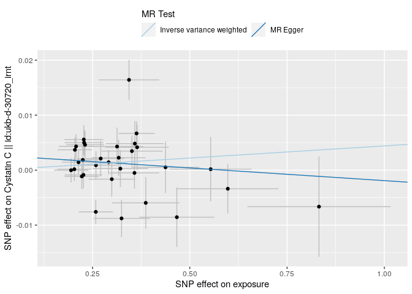

</div>

<div class="cell-output-display">


</div>

<div class="cell-output-display">


</div>

<div class="cell-output-display">


</div>

<div class="cell-output-display">


</div>

<div class="cell-output-display">


</div>

    Warning: Removed 1 rows containing missing values (`geom_errorbarh()`).
    Removed 1 rows containing missing values (`geom_point()`).

<div class="cell-output-display">


</div>

    Warning: Removed 1 rows containing missing values (`geom_errorbarh()`).
    Removed 1 rows containing missing values (`geom_point()`).

<div class="cell-output-display">


</div>

    Warning: Removed 1 rows containing missing values (`geom_errorbarh()`).
    Removed 1 rows containing missing values (`geom_point()`).

<div class="cell-output-display">


</div>

    Warning: Removed 1 rows containing missing values (`geom_errorbarh()`).
    Removed 1 rows containing missing values (`geom_point()`).

<div class="cell-output-display">


</div>

    Warning: Removed 1 rows containing missing values (`geom_errorbarh()`).
    Removed 1 rows containing missing values (`geom_point()`).

<div class="cell-output-display">


</div>

    Warning: Removed 1 rows containing missing values (`geom_errorbarh()`).
    Removed 1 rows containing missing values (`geom_point()`).

<div class="cell-output-display">


</div>

    Warning: Removed 1 rows containing missing values (`geom_errorbarh()`).
    Removed 1 rows containing missing values (`geom_point()`).

<div class="cell-output-display">


</div>

    Warning: Removed 1 rows containing missing values (`geom_errorbarh()`).
    Removed 1 rows containing missing values (`geom_point()`).

<div class="cell-output-display">


</div>

    Warning: Removed 1 rows containing missing values (`geom_errorbarh()`).
    Removed 1 rows containing missing values (`geom_point()`).

<div class="cell-output-display">


</div>

    Warning: Removed 1 rows containing missing values (`geom_errorbarh()`).
    Removed 1 rows containing missing values (`geom_point()`).

<div class="cell-output-display">


</div>

    Warning: Removed 1 rows containing missing values (`geom_errorbarh()`).
    Removed 1 rows containing missing values (`geom_point()`).

<div class="cell-output-display">


</div>

    Warning: Removed 1 rows containing missing values (`geom_errorbarh()`).
    Removed 1 rows containing missing values (`geom_point()`).

<div class="cell-output-display">


</div>

    Warning: Removed 1 rows containing missing values (`geom_errorbarh()`).
    Removed 1 rows containing missing values (`geom_point()`).

<div class="cell-output-display">


</div>

    Warning: Removed 1 rows containing missing values (`geom_errorbarh()`).
    Removed 1 rows containing missing values (`geom_point()`).

<div class="cell-output-display">


</div>

    Warning: Removed 1 rows containing missing values (`geom_errorbarh()`).
    Removed 1 rows containing missing values (`geom_point()`).

<div class="cell-output-display">


</div>

    Warning: Removed 1 rows containing missing values (`geom_errorbarh()`).
    Removed 1 rows containing missing values (`geom_point()`).

<div class="cell-output-display">


</div>

    Warning: Removed 1 rows containing missing values (`geom_errorbarh()`).
    Removed 1 rows containing missing values (`geom_point()`).

<div class="cell-output-display">


</div>

    Warning: Removed 1 rows containing missing values (`geom_errorbarh()`).
    Removed 1 rows containing missing values (`geom_point()`).

<div class="cell-output-display">


</div>

<div class="cell-output-display">


</div>

<div class="cell-output-display">

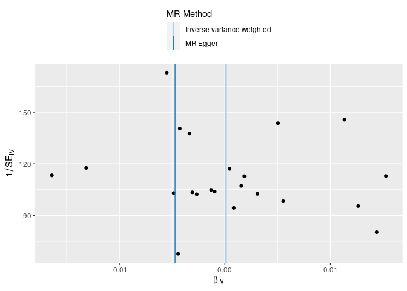

</div>

<div class="cell-output-display">


</div>

<div class="cell-output-display">


</div>

<div class="cell-output-display">


</div>

<div class="cell-output-display">


</div>

<div class="cell-output-display">


</div>

<div class="cell-output-display">


</div>

### MR for id trait ncase group_name year author consortium sex pmid population unit sample_size build ncontrol category subcategory ontology note mr nsnp priority sd outcomes

    Extracting data for 32 SNP(s) from 4 GWAS(s)

    Server code: 502; Server is possibly experiencing traffic, trying again...
    Server code: 502; Server is possibly experiencing traffic, trying again...
    Server code: 502; Server is possibly experiencing traffic, trying again...
    Server code: 502; Server is possibly experiencing traffic, trying again...
    Server code: 502; Server is possibly experiencing traffic, trying again...
    Server code: 502; Server is possibly experiencing traffic, trying again...

    Server error: 502

    Failed to retrieve results from server. See error status message in the returned object and contact the developers if the problem persists.

    Finding proxies for 32 SNPs in outcome ebi-a-GCST003374

    Extracting data for 32 SNP(s) from 1 GWAS(s)

    Server code: 502; Server is possibly experiencing traffic, trying again...

    Retry succeeded!

    Finding proxies for 32 SNPs in outcome ieu-a-1102

    Extracting data for 32 SNP(s) from 1 GWAS(s)

    Server code: 502; Server is possibly experiencing traffic, trying again...

    Retry succeeded!

    Finding proxies for 32 SNPs in outcome finn-b-N14_CHRONKIDNEYDIS

    Extracting data for 32 SNP(s) from 1 GWAS(s)

    Server code: 502; Server is possibly experiencing traffic, trying again...
    Server code: 502; Server is possibly experiencing traffic, trying again...
    Server code: 502; Server is possibly experiencing traffic, trying again...
    Server code: 502; Server is possibly experiencing traffic, trying again...
    Server code: 502; Server is possibly experiencing traffic, trying again...
    Server code: 502; Server is possibly experiencing traffic, trying again...

    Server error: 502

    Failed to retrieve results from server. See error status message in the returned object and contact the developers if the problem persists.

    Finding proxies for 32 SNPs in outcome ebi-a-GCST008026

    Extracting data for 32 SNP(s) from 1 GWAS(s)

    Harmonising exposure (W9v8KN) and Chronic kidney disease || id:ebi-a-GCST003374 (ebi-a-GCST003374)

    Harmonising exposure (W9v8KN) and Chronic kidney disease || id:ebi-a-GCST008026 (ebi-a-GCST008026)

    Harmonising exposure (W9v8KN) and Chronic kidney disease || id:ieu-a-1102 (ieu-a-1102)

    Analysing 'W9v8KN' on 'ebi-a-GCST003374'

    Analysing 'W9v8KN' on 'ebi-a-GCST008026'

    Analysing 'W9v8KN' on 'ieu-a-1102'

    Warning in !is.null(caption) && !is.na(caption): 'length(x) = 22 > 1' in
    coercion to 'logical(1)'

| id.exposure | id.outcome       | outcome                                         | exposure | method                    | nsnp |          b |        se |      pval |
|:------------|:-----------------|:------------------------------------------------|:---------|:--------------------------|-----:|-----------:|----------:|----------:|
| W9v8KN      | ebi-a-GCST003374 | Chronic kidney disease \|\| id:ebi-a-GCST003374 | exposure | MR Egger                  |   22 |  0.0194686 | 0.0612416 | 0.7538574 |
| W9v8KN      | ebi-a-GCST003374 | Chronic kidney disease \|\| id:ebi-a-GCST003374 | exposure | Inverse variance weighted |   22 | -0.0039835 | 0.0146735 | 0.7860267 |
| W9v8KN      | ebi-a-GCST008026 | Chronic kidney disease \|\| id:ebi-a-GCST008026 | exposure | MR Egger                  |   32 |  0.0355521 | 0.0856021 | 0.6808650 |
| W9v8KN      | ebi-a-GCST008026 | Chronic kidney disease \|\| id:ebi-a-GCST008026 | exposure | Inverse variance weighted |   32 |  0.0025792 | 0.0214029 | 0.9040809 |
| W9v8KN      | ieu-a-1102       | Chronic kidney disease \|\| id:ieu-a-1102       | exposure | MR Egger                  |   22 |  0.0201953 | 0.0613752 | 0.7455416 |
| W9v8KN      | ieu-a-1102       | Chronic kidney disease \|\| id:ieu-a-1102       | exposure | Inverse variance weighted |   22 | -0.0036792 | 0.0146486 | 0.8016850 |

MR Egger and MR IVW for id Table: MR Egger and MR IVW for trait Table:
MR Egger and MR IVW for ncase Table: MR Egger and MR IVW for group_name
Table: MR Egger and MR IVW for year Table: MR Egger and MR IVW for
author Table: MR Egger and MR IVW for consortium Table: MR Egger and MR
IVW for sex Table: MR Egger and MR IVW for pmid Table: MR Egger and MR
IVW for population Table: MR Egger and MR IVW for unit Table: MR Egger
and MR IVW for sample_size Table: MR Egger and MR IVW for build Table:
MR Egger and MR IVW for ncontrol Table: MR Egger and MR IVW for category
Table: MR Egger and MR IVW for subcategory Table: MR Egger and MR IVW
for ontology Table: MR Egger and MR IVW for note Table: MR Egger and MR
IVW for mr Table: MR Egger and MR IVW for nsnp Table: MR Egger and MR
IVW for priority Table: MR Egger and MR IVW for sd

    Warning in !is.null(caption) && !is.na(caption): 'length(x) = 22 > 1' in
    coercion to 'logical(1)'

| id.exposure | id.outcome       | outcome                                         | exposure | method                    |        Q | Q_df |    Q_pval |
|:------------|:-----------------|:------------------------------------------------|:---------|:--------------------------|---------:|-----:|----------:|
| W9v8KN      | ebi-a-GCST003374 | Chronic kidney disease \|\| id:ebi-a-GCST003374 | exposure | MR Egger                  | 20.49628 |   20 | 0.4272945 |
| W9v8KN      | ebi-a-GCST003374 | Chronic kidney disease \|\| id:ebi-a-GCST003374 | exposure | Inverse variance weighted | 20.65596 |   21 | 0.4801191 |
| W9v8KN      | ebi-a-GCST008026 | Chronic kidney disease \|\| id:ebi-a-GCST008026 | exposure | MR Egger                  | 22.64494 |   30 | 0.8295702 |
| W9v8KN      | ebi-a-GCST008026 | Chronic kidney disease \|\| id:ebi-a-GCST008026 | exposure | Inverse variance weighted | 22.80321 |   31 | 0.8561873 |
| W9v8KN      | ieu-a-1102       | Chronic kidney disease \|\| id:ieu-a-1102       | exposure | MR Egger                  | 20.60006 |   20 | 0.4209992 |
| W9v8KN      | ieu-a-1102       | Chronic kidney disease \|\| id:ieu-a-1102       | exposure | Inverse variance weighted | 20.76563 |   21 | 0.4733349 |

Heterogeneity test for id Table: Heterogeneity test for trait Table:
Heterogeneity test for ncase Table: Heterogeneity test for group_name
Table: Heterogeneity test for year Table: Heterogeneity test for author
Table: Heterogeneity test for consortium Table: Heterogeneity test for
sex Table: Heterogeneity test for pmid Table: Heterogeneity test for
population Table: Heterogeneity test for unit Table: Heterogeneity test
for sample_size Table: Heterogeneity test for build Table: Heterogeneity
test for ncontrol Table: Heterogeneity test for category Table:
Heterogeneity test for subcategory Table: Heterogeneity test for
ontology Table: Heterogeneity test for note Table: Heterogeneity test
for mr Table: Heterogeneity test for nsnp Table: Heterogeneity test for
priority Table: Heterogeneity test for sd

    Warning in !is.null(caption) && !is.na(caption): 'length(x) = 22 > 1' in
    coercion to 'logical(1)'

| id.exposure | id.outcome       | outcome                                         | exposure | egger_intercept |        se |      pval |
|:------------|:-----------------|:------------------------------------------------|:---------|----------------:|----------:|----------:|
| W9v8KN      | ebi-a-GCST003374 | Chronic kidney disease \|\| id:ebi-a-GCST003374 | exposure |      -0.0067277 | 0.0170437 | 0.6972190 |
| W9v8KN      | ebi-a-GCST008026 | Chronic kidney disease \|\| id:ebi-a-GCST008026 | exposure |      -0.0093742 | 0.0235639 | 0.6935777 |
| W9v8KN      | ieu-a-1102       | Chronic kidney disease \|\| id:ieu-a-1102       | exposure |      -0.0068502 | 0.0170857 | 0.6927207 |

Pleiotropy test for id Table: Pleiotropy test for trait Table:
Pleiotropy test for ncase Table: Pleiotropy test for group_name Table:
Pleiotropy test for year Table: Pleiotropy test for author Table:
Pleiotropy test for consortium Table: Pleiotropy test for sex Table:
Pleiotropy test for pmid Table: Pleiotropy test for population Table:
Pleiotropy test for unit Table: Pleiotropy test for sample_size Table:
Pleiotropy test for build Table: Pleiotropy test for ncontrol Table:
Pleiotropy test for category Table: Pleiotropy test for subcategory
Table: Pleiotropy test for ontology Table: Pleiotropy test for note
Table: Pleiotropy test for mr Table: Pleiotropy test for nsnp Table:
Pleiotropy test for priority Table: Pleiotropy test for sd

    Warning in !is.null(caption) && !is.na(caption): 'length(x) = 22 > 1' in
    coercion to 'logical(1)'

| exposure | outcome                                         | id.exposure | id.outcome       | samplesize | SNP                             |          b |        se |         p |
|:---------|:------------------------------------------------|:------------|:-----------------|-----------:|:--------------------------------|-----------:|----------:|----------:|
| exposure | Chronic kidney disease \|\| id:ebi-a-GCST003374 | W9v8KN      | ebi-a-GCST003374 |     117165 | rs10840912                      |  0.0030891 | 0.0794351 | 0.9689790 |
| exposure | Chronic kidney disease \|\| id:ebi-a-GCST003374 | W9v8KN      | ebi-a-GCST003374 |     117165 | rs11100901                      |  0.0923077 | 0.0791209 | 0.2433450 |
| exposure | Chronic kidney disease \|\| id:ebi-a-GCST003374 | W9v8KN      | ebi-a-GCST003374 |     117165 | rs11140030                      |  0.0701107 | 0.1180812 | 0.5526793 |
| exposure | Chronic kidney disease \|\| id:ebi-a-GCST003374 | W9v8KN      | ebi-a-GCST003374 |     117165 | rs11172113                      | -0.0995537 | 0.0514933 | 0.0531951 |
| exposure | Chronic kidney disease \|\| id:ebi-a-GCST003374 | W9v8KN      | ebi-a-GCST003374 |     117165 | rs115074093                     | -0.0226876 | 0.0785340 | 0.7726664 |
| exposure | Chronic kidney disease \|\| id:ebi-a-GCST003374 | W9v8KN      | ebi-a-GCST003374 |     117165 | rs11759769                      |  0.0422222 | 0.0800000 | 0.5976536 |
| exposure | Chronic kidney disease \|\| id:ebi-a-GCST003374 | W9v8KN      | ebi-a-GCST003374 |     117165 | rs12226396                      | -0.0462107 | 0.0800986 | 0.5639914 |
| exposure | Chronic kidney disease \|\| id:ebi-a-GCST003374 | W9v8KN      | ebi-a-GCST003374 |     117165 | rs13198397                      |  0.0165148 | 0.0569476 | 0.7718162 |
| exposure | Chronic kidney disease \|\| id:ebi-a-GCST003374 | W9v8KN      | ebi-a-GCST003374 |     117165 | rs1652244                       | -0.0529610 | 0.0770342 | 0.4917677 |
| exposure | Chronic kidney disease \|\| id:ebi-a-GCST003374 | W9v8KN      | ebi-a-GCST003374 |     117165 | rs199454                        |  0.0243431 | 0.0695518 | 0.7263387 |
| exposure | Chronic kidney disease \|\| id:ebi-a-GCST003374 | W9v8KN      | ebi-a-GCST003374 |     117165 | rs2383206                       | -0.0270669 | 0.0738189 | 0.7138677 |
| exposure | Chronic kidney disease \|\| id:ebi-a-GCST003374 | W9v8KN      | ebi-a-GCST003374 |     117165 | rs2424245                       |  0.1324086 | 0.0693569 | 0.0562504 |
| exposure | Chronic kidney disease \|\| id:ebi-a-GCST003374 | W9v8KN      | ebi-a-GCST003374 |     117165 | rs2590784                       | -0.1214029 | 0.0719424 | 0.0915072 |
| exposure | Chronic kidney disease \|\| id:ebi-a-GCST003374 | W9v8KN      | ebi-a-GCST003374 |     117165 | rs2681492                       |  0.1089994 | 0.0558971 | 0.0511761 |
| exposure | Chronic kidney disease \|\| id:ebi-a-GCST003374 | W9v8KN      | ebi-a-GCST003374 |     117165 | rs4653694                       |  0.0383387 | 0.0894569 | 0.6682351 |
| exposure | Chronic kidney disease \|\| id:ebi-a-GCST003374 | W9v8KN      | ebi-a-GCST003374 |     117165 | rs6584579                       | -0.0513347 | 0.0821355 | 0.5319711 |
| exposure | Chronic kidney disease \|\| id:ebi-a-GCST003374 | W9v8KN      | ebi-a-GCST003374 |     117165 | rs7072877                       | -0.0316428 | 0.0780234 | 0.6850692 |
| exposure | Chronic kidney disease \|\| id:ebi-a-GCST003374 | W9v8KN      | ebi-a-GCST003374 |     117165 | rs7301566                       | -0.0092879 | 0.0580495 | 0.8728811 |
| exposure | Chronic kidney disease \|\| id:ebi-a-GCST003374 | W9v8KN      | ebi-a-GCST003374 |     117165 | rs74637014                      |  0.0528607 | 0.0715174 | 0.4598278 |
| exposure | Chronic kidney disease \|\| id:ebi-a-GCST003374 | W9v8KN      | ebi-a-GCST003374 |     117165 | rs7745460                       |  0.0016727 | 0.0808475 | 0.9834932 |
| exposure | Chronic kidney disease \|\| id:ebi-a-GCST003374 | W9v8KN      | ebi-a-GCST003374 |     117165 | rs79341671                      | -0.0853271 | 0.0602309 | 0.1565804 |
| exposure | Chronic kidney disease \|\| id:ebi-a-GCST003374 | W9v8KN      | ebi-a-GCST003374 |     117165 | rs9349379                       | -0.0184471 | 0.0468062 | 0.6934942 |
| exposure | Chronic kidney disease \|\| id:ebi-a-GCST003374 | W9v8KN      | ebi-a-GCST003374 |     117165 | All - Inverse variance weighted | -0.0039835 | 0.0146735 | 0.7860267 |
| exposure | Chronic kidney disease \|\| id:ebi-a-GCST003374 | W9v8KN      | ebi-a-GCST003374 |     117165 | All - MR Egger                  |  0.0194686 | 0.0612416 | 0.7538574 |
| exposure | Chronic kidney disease \|\| id:ebi-a-GCST008026 | W9v8KN      | ebi-a-GCST008026 |       2872 | rs10840912                      |  0.1011112 | 0.1244501 | 0.4165256 |
| exposure | Chronic kidney disease \|\| id:ebi-a-GCST008026 | W9v8KN      | ebi-a-GCST008026 |       2872 | rs11100901                      | -0.0149087 | 0.1346316 | 0.9118247 |
| exposure | Chronic kidney disease \|\| id:ebi-a-GCST008026 | W9v8KN      | ebi-a-GCST008026 |       2872 | rs11140030                      |  0.0090746 | 0.1287506 | 0.9438097 |
| exposure | Chronic kidney disease \|\| id:ebi-a-GCST008026 | W9v8KN      | ebi-a-GCST008026 |       2872 | rs11172113                      |  0.0074449 | 0.0837721 | 0.9291845 |
| exposure | Chronic kidney disease \|\| id:ebi-a-GCST008026 | W9v8KN      | ebi-a-GCST008026 |       2872 | rs115074093                     |  0.1946652 | 0.2654872 | 0.4634135 |
| exposure | Chronic kidney disease \|\| id:ebi-a-GCST008026 | W9v8KN      | ebi-a-GCST008026 |       2872 | rs11759769                      |  0.4225884 | 0.1533938 | 0.0058705 |
| exposure | Chronic kidney disease \|\| id:ebi-a-GCST008026 | W9v8KN      | ebi-a-GCST008026 |       2872 | rs12226396                      | -0.1156359 | 0.1098530 | 0.2925054 |
| exposure | Chronic kidney disease \|\| id:ebi-a-GCST008026 | W9v8KN      | ebi-a-GCST008026 |       2872 | rs13198397                      |  0.0411586 | 0.1084895 | 0.7044066 |
| exposure | Chronic kidney disease \|\| id:ebi-a-GCST008026 | W9v8KN      | ebi-a-GCST008026 |       2872 | rs148521708                     | -0.1173304 | 0.1850158 | 0.5259736 |
| exposure | Chronic kidney disease \|\| id:ebi-a-GCST008026 | W9v8KN      | ebi-a-GCST008026 |       2872 | rs1652244                       | -0.1488397 | 0.1522037 | 0.3281247 |
| exposure | Chronic kidney disease \|\| id:ebi-a-GCST008026 | W9v8KN      | ebi-a-GCST008026 |       2872 | rs1777335                       | -0.1351660 | 0.1135643 | 0.2339617 |
| exposure | Chronic kidney disease \|\| id:ebi-a-GCST008026 | W9v8KN      | ebi-a-GCST008026 |       2872 | rs199454                        | -0.0291522 | 0.0918443 | 0.7509330 |
| exposure | Chronic kidney disease \|\| id:ebi-a-GCST008026 | W9v8KN      | ebi-a-GCST008026 |       2872 | rs2383206                       |  0.0169351 | 0.1159951 | 0.8839224 |
| exposure | Chronic kidney disease \|\| id:ebi-a-GCST008026 | W9v8KN      | ebi-a-GCST008026 |       2872 | rs2424245                       | -0.0502897 | 0.0863559 | 0.5603282 |
| exposure | Chronic kidney disease \|\| id:ebi-a-GCST008026 | W9v8KN      | ebi-a-GCST008026 |       2872 | rs2590784                       | -0.0552936 | 0.1059829 | 0.6018639 |
| exposure | Chronic kidney disease \|\| id:ebi-a-GCST008026 | W9v8KN      | ebi-a-GCST008026 |       2872 | rs2681492                       |  0.1025542 | 0.0901750 | 0.2554210 |
| exposure | Chronic kidney disease \|\| id:ebi-a-GCST008026 | W9v8KN      | ebi-a-GCST008026 |       2872 | rs41444548                      | -0.2237194 | 0.2607523 | 0.3909053 |
| exposure | Chronic kidney disease \|\| id:ebi-a-GCST008026 | W9v8KN      | ebi-a-GCST008026 |       2872 | rs4653694                       | -0.0867834 | 0.1530748 | 0.5707586 |
| exposure | Chronic kidney disease \|\| id:ebi-a-GCST008026 | W9v8KN      | ebi-a-GCST008026 |       2872 | rs55980066                      |  0.0107567 | 0.1386712 | 0.9381702 |
| exposure | Chronic kidney disease \|\| id:ebi-a-GCST008026 | W9v8KN      | ebi-a-GCST008026 |       2872 | rs61941733                      | -0.0699657 | 0.1404973 | 0.6184938 |
| exposure | Chronic kidney disease \|\| id:ebi-a-GCST008026 | W9v8KN      | ebi-a-GCST008026 |       2872 | rs6584579                       |  0.0693850 | 0.1215729 | 0.5681843 |
| exposure | Chronic kidney disease \|\| id:ebi-a-GCST008026 | W9v8KN      | ebi-a-GCST008026 |       2872 | rs6912572                       |  0.0814717 | 0.1347197 | 0.5453450 |
| exposure | Chronic kidney disease \|\| id:ebi-a-GCST008026 | W9v8KN      | ebi-a-GCST008026 |       2872 | rs7072877                       | -0.0885314 | 0.1119419 | 0.4290203 |
| exposure | Chronic kidney disease \|\| id:ebi-a-GCST008026 | W9v8KN      | ebi-a-GCST008026 |       2872 | rs71526759                      |  0.3488411 | 0.1886251 | 0.0644018 |
| exposure | Chronic kidney disease \|\| id:ebi-a-GCST008026 | W9v8KN      | ebi-a-GCST008026 |       2872 | rs72675157                      |  0.1306874 | 0.1852422 | 0.4805022 |
| exposure | Chronic kidney disease \|\| id:ebi-a-GCST008026 | W9v8KN      | ebi-a-GCST008026 |       2872 | rs72802873                      |  0.0278438 | 0.1733218 | 0.8723708 |
| exposure | Chronic kidney disease \|\| id:ebi-a-GCST008026 | W9v8KN      | ebi-a-GCST008026 |       2872 | rs7301566                       | -0.0867016 | 0.1237345 | 0.4834860 |
| exposure | Chronic kidney disease \|\| id:ebi-a-GCST008026 | W9v8KN      | ebi-a-GCST008026 |       2872 | rs74637014                      |  0.0151044 | 0.1154792 | 0.8959355 |
| exposure | Chronic kidney disease \|\| id:ebi-a-GCST008026 | W9v8KN      | ebi-a-GCST008026 |       2872 | rs7745460                       | -0.0371450 | 0.0879258 | 0.6726908 |
| exposure | Chronic kidney disease \|\| id:ebi-a-GCST008026 | W9v8KN      | ebi-a-GCST008026 |       2872 | rs79341671                      | -0.0495637 | 0.1683687 | 0.7684709 |
| exposure | Chronic kidney disease \|\| id:ebi-a-GCST008026 | W9v8KN      | ebi-a-GCST008026 |       2872 | rs9349379                       |  0.0612715 | 0.0788037 | 0.4368518 |
| exposure | Chronic kidney disease \|\| id:ebi-a-GCST008026 | W9v8KN      | ebi-a-GCST008026 |       2872 | rs9508309                       | -0.0070755 | 0.1891716 | 0.9701642 |
| exposure | Chronic kidney disease \|\| id:ebi-a-GCST008026 | W9v8KN      | ebi-a-GCST008026 |       2872 | All - Inverse variance weighted |  0.0025792 | 0.0214029 | 0.9040809 |
| exposure | Chronic kidney disease \|\| id:ebi-a-GCST008026 | W9v8KN      | ebi-a-GCST008026 |       2872 | All - MR Egger                  |  0.0355521 | 0.0856021 | 0.6808650 |
| exposure | Chronic kidney disease \|\| id:ieu-a-1102       | W9v8KN      | ieu-a-1102       |     118140 | rs10840912                      |  0.0030891 | 0.0794351 | 0.9689790 |
| exposure | Chronic kidney disease \|\| id:ieu-a-1102       | W9v8KN      | ieu-a-1102       |     118140 | rs11100901                      |  0.0923077 | 0.0791209 | 0.2433450 |
| exposure | Chronic kidney disease \|\| id:ieu-a-1102       | W9v8KN      | ieu-a-1102       |     118140 | rs11140030                      |  0.0701107 | 0.1180812 | 0.5526793 |
| exposure | Chronic kidney disease \|\| id:ieu-a-1102       | W9v8KN      | ieu-a-1102       |     118140 | rs11172113                      | -0.0995537 | 0.0514933 | 0.0531951 |
| exposure | Chronic kidney disease \|\| id:ieu-a-1102       | W9v8KN      | ieu-a-1102       |     118140 | rs115074093                     | -0.0226876 | 0.0785340 | 0.7726664 |
| exposure | Chronic kidney disease \|\| id:ieu-a-1102       | W9v8KN      | ieu-a-1102       |     118140 | rs11759769                      |  0.0422222 | 0.0800000 | 0.5976536 |
| exposure | Chronic kidney disease \|\| id:ieu-a-1102       | W9v8KN      | ieu-a-1102       |     118140 | rs12226396                      | -0.0462107 | 0.0800986 | 0.5639914 |
| exposure | Chronic kidney disease \|\| id:ieu-a-1102       | W9v8KN      | ieu-a-1102       |     118140 | rs13198397                      |  0.0165148 | 0.0569476 | 0.7718162 |
| exposure | Chronic kidney disease \|\| id:ieu-a-1102       | W9v8KN      | ieu-a-1102       |     118140 | rs1652244                       | -0.0529610 | 0.0770342 | 0.4917677 |
| exposure | Chronic kidney disease \|\| id:ieu-a-1102       | W9v8KN      | ieu-a-1102       |     118140 | rs199454                        |  0.0239567 | 0.0695518 | 0.7305121 |
| exposure | Chronic kidney disease \|\| id:ieu-a-1102       | W9v8KN      | ieu-a-1102       |     118140 | rs2383206                       | -0.0270669 | 0.0738189 | 0.7138677 |
| exposure | Chronic kidney disease \|\| id:ieu-a-1102       | W9v8KN      | ieu-a-1102       |     118140 | rs2424245                       |  0.1324086 | 0.0693569 | 0.0562504 |
| exposure | Chronic kidney disease \|\| id:ieu-a-1102       | W9v8KN      | ieu-a-1102       |     118140 | rs2590784                       | -0.1214029 | 0.0719424 | 0.0915072 |
| exposure | Chronic kidney disease \|\| id:ieu-a-1102       | W9v8KN      | ieu-a-1102       |     118140 | rs2681492                       |  0.1089994 | 0.0558971 | 0.0511761 |
| exposure | Chronic kidney disease \|\| id:ieu-a-1102       | W9v8KN      | ieu-a-1102       |     118140 | rs4653694                       |  0.0415335 | 0.0798722 | 0.6030636 |
| exposure | Chronic kidney disease \|\| id:ieu-a-1102       | W9v8KN      | ieu-a-1102       |     118140 | rs6584579                       | -0.0513347 | 0.0821355 | 0.5319711 |
| exposure | Chronic kidney disease \|\| id:ieu-a-1102       | W9v8KN      | ieu-a-1102       |     118140 | rs7072877                       | -0.0316428 | 0.0780234 | 0.6850692 |
| exposure | Chronic kidney disease \|\| id:ieu-a-1102       | W9v8KN      | ieu-a-1102       |     118140 | rs7301566                       | -0.0092879 | 0.0580495 | 0.8728811 |
| exposure | Chronic kidney disease \|\| id:ieu-a-1102       | W9v8KN      | ieu-a-1102       |     118140 | rs74637014                      |  0.0559701 | 0.0746269 | 0.4532547 |
| exposure | Chronic kidney disease \|\| id:ieu-a-1102       | W9v8KN      | ieu-a-1102       |     118140 | rs7745460                       |  0.0016727 | 0.0808475 | 0.9834932 |
| exposure | Chronic kidney disease \|\| id:ieu-a-1102       | W9v8KN      | ieu-a-1102       |     118140 | rs79341671                      | -0.0853271 | 0.0602309 | 0.1565804 |
| exposure | Chronic kidney disease \|\| id:ieu-a-1102       | W9v8KN      | ieu-a-1102       |     118140 | rs9349379                       | -0.0184471 | 0.0468062 | 0.6934942 |
| exposure | Chronic kidney disease \|\| id:ieu-a-1102       | W9v8KN      | ieu-a-1102       |     118140 | All - Inverse variance weighted | -0.0036792 | 0.0146486 | 0.8016850 |
| exposure | Chronic kidney disease \|\| id:ieu-a-1102       | W9v8KN      | ieu-a-1102       |     118140 | All - MR Egger                  |  0.0201953 | 0.0613752 | 0.7455416 |

Single SNP analysis for id Table: Single SNP analysis for trait Table:
Single SNP analysis for ncase Table: Single SNP analysis for group_name
Table: Single SNP analysis for year Table: Single SNP analysis for
author Table: Single SNP analysis for consortium Table: Single SNP
analysis for sex Table: Single SNP analysis for pmid Table: Single SNP
analysis for population Table: Single SNP analysis for unit Table:
Single SNP analysis for sample_size Table: Single SNP analysis for build
Table: Single SNP analysis for ncontrol Table: Single SNP analysis for
category Table: Single SNP analysis for subcategory Table: Single SNP
analysis for ontology Table: Single SNP analysis for note Table: Single
SNP analysis for mr Table: Single SNP analysis for nsnp Table: Single
SNP analysis for priority Table: Single SNP analysis for sd

    Warning in !is.null(caption) && !is.na(caption): 'length(x) = 22 > 1' in
    coercion to 'logical(1)'

<div class="cell-output-display">


</div>

| exposure | outcome                                         | id.exposure | id.outcome       | samplesize | SNP         |          b |        se |         p |
|:---------|:------------------------------------------------|:------------|:-----------------|-----------:|:------------|-----------:|----------:|----------:|
| exposure | Chronic kidney disease \|\| id:ebi-a-GCST003374 | W9v8KN      | ebi-a-GCST003374 |     117165 | rs10840912  | -0.0042333 | 0.0151704 | 0.7802034 |
| exposure | Chronic kidney disease \|\| id:ebi-a-GCST003374 | W9v8KN      | ebi-a-GCST003374 |     117165 | rs11100901  | -0.0074133 | 0.0149326 | 0.6195749 |
| exposure | Chronic kidney disease \|\| id:ebi-a-GCST003374 | W9v8KN      | ebi-a-GCST003374 |     117165 | rs11140030  | -0.0051456 | 0.0148825 | 0.7295322 |
| exposure | Chronic kidney disease \|\| id:ebi-a-GCST003374 | W9v8KN      | ebi-a-GCST003374 |     117165 | rs11172113  |  0.0044629 | 0.0153082 | 0.7706407 |
| exposure | Chronic kidney disease \|\| id:ebi-a-GCST003374 | W9v8KN      | ebi-a-GCST003374 |     117165 | rs115074093 | -0.0033069 | 0.0151579 | 0.8273025 |
| exposure | Chronic kidney disease \|\| id:ebi-a-GCST003374 | W9v8KN      | ebi-a-GCST003374 |     117165 | rs11759769  | -0.0055921 | 0.0150423 | 0.7100737 |
| exposure | Chronic kidney disease \|\| id:ebi-a-GCST003374 | W9v8KN      | ebi-a-GCST003374 |     117165 | rs12226396  | -0.0025171 | 0.0150630 | 0.8672859 |
| exposure | Chronic kidney disease \|\| id:ebi-a-GCST003374 | W9v8KN      | ebi-a-GCST003374 |     117165 | rs13198397  | -0.0054412 | 0.0153814 | 0.7235256 |
| exposure | Chronic kidney disease \|\| id:ebi-a-GCST003374 | W9v8KN      | ebi-a-GCST003374 |     117165 | rs1652244   | -0.0021395 | 0.0150353 | 0.8868432 |
| exposure | Chronic kidney disease \|\| id:ebi-a-GCST003374 | W9v8KN      | ebi-a-GCST003374 |     117165 | rs199454    | -0.0053030 | 0.0151914 | 0.7270285 |
| exposure | Chronic kidney disease \|\| id:ebi-a-GCST003374 | W9v8KN      | ebi-a-GCST003374 |     117165 | rs2383206   | -0.0030339 | 0.0151783 | 0.8415729 |
| exposure | Chronic kidney disease \|\| id:ebi-a-GCST003374 | W9v8KN      | ebi-a-GCST003374 |     117165 | rs2424245   | -0.0103745 | 0.0150134 | 0.4895566 |
| exposure | Chronic kidney disease \|\| id:ebi-a-GCST003374 | W9v8KN      | ebi-a-GCST003374 |     117165 | rs2590784   |  0.0011133 | 0.0149886 | 0.9407923 |
| exposure | Chronic kidney disease \|\| id:ebi-a-GCST003374 | W9v8KN      | ebi-a-GCST003374 |     117165 | rs2681492   | -0.0123455 | 0.0152069 | 0.4168837 |
| exposure | Chronic kidney disease \|\| id:ebi-a-GCST003374 | W9v8KN      | ebi-a-GCST003374 |     117165 | rs4653694   | -0.0051537 | 0.0150326 | 0.7317240 |
| exposure | Chronic kidney disease \|\| id:ebi-a-GCST003374 | W9v8KN      | ebi-a-GCST003374 |     117165 | rs6584579   | -0.0024224 | 0.0150296 | 0.8719553 |
| exposure | Chronic kidney disease \|\| id:ebi-a-GCST003374 | W9v8KN      | ebi-a-GCST003374 |     117165 | rs7072877   | -0.0029693 | 0.0151352 | 0.8444636 |
| exposure | Chronic kidney disease \|\| id:ebi-a-GCST003374 | W9v8KN      | ebi-a-GCST003374 |     117165 | rs7301566   | -0.0036214 | 0.0154094 | 0.8141989 |
| exposure | Chronic kidney disease \|\| id:ebi-a-GCST003374 | W9v8KN      | ebi-a-GCST003374 |     117165 | rs74637014  | -0.0064816 | 0.0149925 | 0.6655075 |
| exposure | Chronic kidney disease \|\| id:ebi-a-GCST003374 | W9v8KN      | ebi-a-GCST003374 |     117165 | rs7745460   | -0.0041761 | 0.0151622 | 0.7829851 |
| exposure | Chronic kidney disease \|\| id:ebi-a-GCST003374 | W9v8KN      | ebi-a-GCST003374 |     117165 | rs79341671  |  0.0011490 | 0.0151294 | 0.9394627 |
| exposure | Chronic kidney disease \|\| id:ebi-a-GCST003374 | W9v8KN      | ebi-a-GCST003374 |     117165 | rs9349379   | -0.0024071 | 0.0156636 | 0.8778676 |
| exposure | Chronic kidney disease \|\| id:ebi-a-GCST003374 | W9v8KN      | ebi-a-GCST003374 |     117165 | All         | -0.0039835 | 0.0146735 | 0.7860267 |
| exposure | Chronic kidney disease \|\| id:ebi-a-GCST008026 | W9v8KN      | ebi-a-GCST008026 |       2872 | rs10840912  | -0.0004239 | 0.0217266 | 0.9844343 |
| exposure | Chronic kidney disease \|\| id:ebi-a-GCST008026 | W9v8KN      | ebi-a-GCST008026 |       2872 | rs11100901  |  0.0030326 | 0.0216786 | 0.8887460 |
| exposure | Chronic kidney disease \|\| id:ebi-a-GCST008026 | W9v8KN      | ebi-a-GCST008026 |       2872 | rs11140030  |  0.0023946 | 0.0217049 | 0.9121507 |
| exposure | Chronic kidney disease \|\| id:ebi-a-GCST008026 | W9v8KN      | ebi-a-GCST008026 |       2872 | rs11172113  |  0.0022394 | 0.0221376 | 0.9194238 |
| exposure | Chronic kidney disease \|\| id:ebi-a-GCST008026 | W9v8KN      | ebi-a-GCST008026 |       2872 | rs115074093 |  0.0013226 | 0.0214728 | 0.9508840 |
| exposure | Chronic kidney disease \|\| id:ebi-a-GCST008026 | W9v8KN      | ebi-a-GCST008026 |       2872 | rs11759769  | -0.0057600 | 0.0216143 | 0.7898613 |
| exposure | Chronic kidney disease \|\| id:ebi-a-GCST008026 | W9v8KN      | ebi-a-GCST008026 |       2872 | rs12226396  |  0.0072436 | 0.0218210 | 0.7399216 |
| exposure | Chronic kidney disease \|\| id:ebi-a-GCST008026 | W9v8KN      | ebi-a-GCST008026 |       2872 | rs13198397  |  0.0010169 | 0.0218319 | 0.9628486 |
| exposure | Chronic kidney disease \|\| id:ebi-a-GCST008026 | W9v8KN      | ebi-a-GCST008026 |       2872 | rs148521708 |  0.0042056 | 0.0215475 | 0.8452527 |
| exposure | Chronic kidney disease \|\| id:ebi-a-GCST008026 | W9v8KN      | ebi-a-GCST008026 |       2872 | rs1652244   |  0.0056338 | 0.0216177 | 0.7943939 |
| exposure | Chronic kidney disease \|\| id:ebi-a-GCST008026 | W9v8KN      | ebi-a-GCST008026 |       2872 | rs1777335   |  0.0076520 | 0.0217934 | 0.7255033 |
| exposure | Chronic kidney disease \|\| id:ebi-a-GCST008026 | W9v8KN      | ebi-a-GCST008026 |       2872 | rs199454    |  0.0044013 | 0.0220088 | 0.8414956 |
| exposure | Chronic kidney disease \|\| id:ebi-a-GCST008026 | W9v8KN      | ebi-a-GCST008026 |       2872 | rs2383206   |  0.0020732 | 0.0217768 | 0.9241532 |
| exposure | Chronic kidney disease \|\| id:ebi-a-GCST008026 | W9v8KN      | ebi-a-GCST008026 |       2872 | rs2424245   |  0.0060393 | 0.0220921 | 0.7845685 |
| exposure | Chronic kidney disease \|\| id:ebi-a-GCST008026 | W9v8KN      | ebi-a-GCST008026 |       2872 | rs2590784   |  0.0050397 | 0.0218531 | 0.8176107 |
| exposure | Chronic kidney disease \|\| id:ebi-a-GCST008026 | W9v8KN      | ebi-a-GCST008026 |       2872 | rs2681492   | -0.0033890 | 0.0220324 | 0.8777524 |
| exposure | Chronic kidney disease \|\| id:ebi-a-GCST008026 | W9v8KN      | ebi-a-GCST008026 |       2872 | rs41444548  |  0.0041142 | 0.0214753 | 0.8480728 |
| exposure | Chronic kidney disease \|\| id:ebi-a-GCST008026 | W9v8KN      | ebi-a-GCST008026 |       2872 | rs4653694   |  0.0043610 | 0.0216152 | 0.8401057 |
| exposure | Chronic kidney disease \|\| id:ebi-a-GCST008026 | W9v8KN      | ebi-a-GCST008026 |       2872 | rs55980066  |  0.0023797 | 0.0216624 | 0.9125269 |
| exposure | Chronic kidney disease \|\| id:ebi-a-GCST008026 | W9v8KN      | ebi-a-GCST008026 |       2872 | rs61941733  |  0.0043027 | 0.0216556 | 0.8425067 |
| exposure | Chronic kidney disease \|\| id:ebi-a-GCST008026 | W9v8KN      | ebi-a-GCST008026 |       2872 | rs6584579   |  0.0004424 | 0.0217424 | 0.9837648 |
| exposure | Chronic kidney disease \|\| id:ebi-a-GCST008026 | W9v8KN      | ebi-a-GCST008026 |       2872 | rs6912572   |  0.0005364 | 0.0216782 | 0.9802578 |
| exposure | Chronic kidney disease \|\| id:ebi-a-GCST008026 | W9v8KN      | ebi-a-GCST008026 |       2872 | rs7072877   |  0.0060362 | 0.0218051 | 0.7819138 |
| exposure | Chronic kidney disease \|\| id:ebi-a-GCST008026 | W9v8KN      | ebi-a-GCST008026 |       2872 | rs71526759  | -0.0019370 | 0.0215420 | 0.9283518 |
| exposure | Chronic kidney disease \|\| id:ebi-a-GCST008026 | W9v8KN      | ebi-a-GCST008026 |       2872 | rs72675157  |  0.0008459 | 0.0215472 | 0.9686848 |
| exposure | Chronic kidney disease \|\| id:ebi-a-GCST008026 | W9v8KN      | ebi-a-GCST008026 |       2872 | rs72802873  |  0.0021880 | 0.0215679 | 0.9191961 |
| exposure | Chronic kidney disease \|\| id:ebi-a-GCST008026 | W9v8KN      | ebi-a-GCST008026 |       2872 | rs7301566   |  0.0053329 | 0.0217304 | 0.8061381 |
| exposure | Chronic kidney disease \|\| id:ebi-a-GCST008026 | W9v8KN      | ebi-a-GCST008026 |       2872 | rs74637014  |  0.0021337 | 0.0217802 | 0.9219616 |
| exposure | Chronic kidney disease \|\| id:ebi-a-GCST008026 | W9v8KN      | ebi-a-GCST008026 |       2872 | rs7745460   |  0.0050812 | 0.0220666 | 0.8178831 |
| exposure | Chronic kidney disease \|\| id:ebi-a-GCST008026 | W9v8KN      | ebi-a-GCST008026 |       2872 | rs79341671  |  0.0034356 | 0.0215779 | 0.8734954 |
| exposure | Chronic kidney disease \|\| id:ebi-a-GCST008026 | W9v8KN      | ebi-a-GCST008026 |       2872 | rs9349379   | -0.0020950 | 0.0222388 | 0.9249458 |
| exposure | Chronic kidney disease \|\| id:ebi-a-GCST008026 | W9v8KN      | ebi-a-GCST008026 |       2872 | rs9508309   |  0.0027044 | 0.0215412 | 0.9000916 |
| exposure | Chronic kidney disease \|\| id:ebi-a-GCST008026 | W9v8KN      | ebi-a-GCST008026 |       2872 | All         |  0.0025792 | 0.0214029 | 0.9040809 |
| exposure | Chronic kidney disease \|\| id:ieu-a-1102       | W9v8KN      | ieu-a-1102       |     118140 | rs10840912  | -0.0039175 | 0.0151841 | 0.7964053 |
| exposure | Chronic kidney disease \|\| id:ieu-a-1102       | W9v8KN      | ieu-a-1102       |     118140 | rs11100901  | -0.0070862 | 0.0149063 | 0.6345129 |
| exposure | Chronic kidney disease \|\| id:ieu-a-1102       | W9v8KN      | ieu-a-1102       |     118140 | rs11140030  | -0.0048326 | 0.0148982 | 0.7456543 |
| exposure | Chronic kidney disease \|\| id:ieu-a-1102       | W9v8KN      | ieu-a-1102       |     118140 | rs11172113  |  0.0047627 | 0.0152799 | 0.7552702 |
| exposure | Chronic kidney disease \|\| id:ieu-a-1102       | W9v8KN      | ieu-a-1102       |     118140 | rs115074093 | -0.0029941 | 0.0151708 | 0.8435474 |
| exposure | Chronic kidney disease \|\| id:ieu-a-1102       | W9v8KN      | ieu-a-1102       |     118140 | rs11759769  | -0.0052716 | 0.0150580 | 0.7262723 |
| exposure | Chronic kidney disease \|\| id:ieu-a-1102       | W9v8KN      | ieu-a-1102       |     118140 | rs12226396  | -0.0022075 | 0.0150754 | 0.8835803 |
| exposure | Chronic kidney disease \|\| id:ieu-a-1102       | W9v8KN      | ieu-a-1102       |     118140 | rs13198397  | -0.0051101 | 0.0153959 | 0.7399557 |
| exposure | Chronic kidney disease \|\| id:ieu-a-1102       | W9v8KN      | ieu-a-1102       |     118140 | rs1652244   | -0.0018304 | 0.0150475 | 0.9031843 |
| exposure | Chronic kidney disease \|\| id:ieu-a-1102       | W9v8KN      | ieu-a-1102       |     118140 | rs199454    | -0.0049620 | 0.0152080 | 0.7442138 |
| exposure | Chronic kidney disease \|\| id:ieu-a-1102       | W9v8KN      | ieu-a-1102       |     118140 | rs2383206   | -0.0027205 | 0.0151908 | 0.8578672 |
| exposure | Chronic kidney disease \|\| id:ieu-a-1102       | W9v8KN      | ieu-a-1102       |     118140 | rs2424245   | -0.0100333 | 0.0149867 | 0.5031886 |
| exposure | Chronic kidney disease \|\| id:ieu-a-1102       | W9v8KN      | ieu-a-1102       |     118140 | rs2590784   |  0.0014126 | 0.0149620 | 0.9247819 |
| exposure | Chronic kidney disease \|\| id:ieu-a-1102       | W9v8KN      | ieu-a-1102       |     118140 | rs2681492   | -0.0119884 | 0.0151791 | 0.4296484 |
| exposure | Chronic kidney disease \|\| id:ieu-a-1102       | W9v8KN      | ieu-a-1102       |     118140 | rs4653694   | -0.0052529 | 0.0150622 | 0.7272767 |
| exposure | Chronic kidney disease \|\| id:ieu-a-1102       | W9v8KN      | ieu-a-1102       |     118140 | rs6584579   | -0.0021136 | 0.0150420 | 0.8882523 |
| exposure | Chronic kidney disease \|\| id:ieu-a-1102       | W9v8KN      | ieu-a-1102       |     118140 | rs7072877   | -0.0026576 | 0.0151478 | 0.8607325 |
| exposure | Chronic kidney disease \|\| id:ieu-a-1102       | W9v8KN      | ieu-a-1102       |     118140 | rs7301566   | -0.0032978 | 0.0154219 | 0.8306724 |
| exposure | Chronic kidney disease \|\| id:ieu-a-1102       | W9v8KN      | ieu-a-1102       |     118140 | rs74637014  | -0.0060697 | 0.0149770 | 0.6852819 |
| exposure | Chronic kidney disease \|\| id:ieu-a-1102       | W9v8KN      | ieu-a-1102       |     118140 | rs7745460   | -0.0038609 | 0.0151759 | 0.7991785 |
| exposure | Chronic kidney disease \|\| id:ieu-a-1102       | W9v8KN      | ieu-a-1102       |     118140 | rs79341671  |  0.0014538 | 0.0151020 | 0.9233083 |
| exposure | Chronic kidney disease \|\| id:ieu-a-1102       | W9v8KN      | ieu-a-1102       |     118140 | rs9349379   | -0.0020757 | 0.0156740 | 0.8946429 |
| exposure | Chronic kidney disease \|\| id:ieu-a-1102       | W9v8KN      | ieu-a-1102       |     118140 | All         | -0.0036792 | 0.0146486 | 0.8016850 |

Leave one out analysis for id Table: Leave one out analysis for trait
Table: Leave one out analysis for ncase Table: Leave one out analysis
for group_name Table: Leave one out analysis for year Table: Leave one
out analysis for author Table: Leave one out analysis for consortium
Table: Leave one out analysis for sex Table: Leave one out analysis for
pmid Table: Leave one out analysis for population Table: Leave one out
analysis for unit Table: Leave one out analysis for sample_size Table:
Leave one out analysis for build Table: Leave one out analysis for
ncontrol Table: Leave one out analysis for category Table: Leave one out
analysis for subcategory Table: Leave one out analysis for ontology
Table: Leave one out analysis for note Table: Leave one out analysis for
mr Table: Leave one out analysis for nsnp Table: Leave one out analysis
for priority Table: Leave one out analysis for sd

### Plots for id trait ncase group_name year author consortium sex pmid population unit sample_size build ncontrol category subcategory ontology note mr nsnp priority sd outcomes

<div class="cell-output-display">


</div>

<div class="cell-output-display">


</div>

<div class="cell-output-display">


</div>

    Warning: Removed 1 rows containing missing values (`geom_errorbarh()`).
    Removed 1 rows containing missing values (`geom_point()`).

<div class="cell-output-display">


</div>

    Warning: Removed 1 rows containing missing values (`geom_errorbarh()`).
    Removed 1 rows containing missing values (`geom_point()`).

<div class="cell-output-display">


</div>

    Warning: Removed 1 rows containing missing values (`geom_errorbarh()`).
    Removed 1 rows containing missing values (`geom_point()`).

<div class="cell-output-display">


</div>

    Warning: Removed 1 rows containing missing values (`geom_errorbarh()`).
    Removed 1 rows containing missing values (`geom_point()`).

<div class="cell-output-display">


</div>

    Warning: Removed 1 rows containing missing values (`geom_errorbarh()`).
    Removed 1 rows containing missing values (`geom_point()`).

<div class="cell-output-display">


</div>

    Warning: Removed 1 rows containing missing values (`geom_errorbarh()`).
    Removed 1 rows containing missing values (`geom_point()`).

<div class="cell-output-display">


</div>

<div class="cell-output-display">


</div>

<div class="cell-output-display">


</div>

<div class="cell-output-display">


</div>

``` r
# MR RAPS
fmd_lead_snps <- readxl::read_xlsx(fmd_lead_snps_file, skip = 2) %>%
    dplyr::filter(`P-value` < 10^-5) 
fmd_filt <- fmd %>%
    dplyr::filter(SNP %in% fmd_lead_snps$rsID)
ckd <- TwoSampleMR::extract_outcome_data(
    snps = fmd_filt$SNP,
    outcomes = ckd_outcomes$id[3] # use only the third gwas for CKD!
)
dat <- TwoSampleMR::harmonise_data(exposure_dat = fmd_filt, outcome_dat = ckd)

#TwoSampleMR::mr(dat, method_list = c("mr_raps")) %>%
#    knitr::kable() %>%
#    print()
res_raps <- mr.raps::mr.raps.mle(b_exp = dat$beta.exposure, 
                    b_out = dat$beta.outcome,
                    se_exp = dat$se.exposure,
                    se_out = dat$se.outcome,
                    over.dispersion = FALSE,
                    loss.function = "huber",
                    diagnostics = TRUE
                    )
print(res_raps)
```

``` r
TwoSampleMR::mr_report(dat, 
    output_path = here::here("analysis", "results"),
    output_type = "md",
    author = "Fred Boehm",
    study = "Two Sample MR"
)
```

``` r
sessioninfo::session_info()
```

     Session info 
     setting  value
     version  R version 4.2.3 (2023-03-15)
     os       Ubuntu 18.04.6 LTS
     system   x86_64, linux-gnu
     ui       X11
     language en_US:
     collate  en_US.UTF-8
     ctype    en_US.UTF-8
     tz       America/Detroit
     date     2023-04-18
     pandoc   1.19.2.4 @ /usr/bin/ (via rmarkdown)

     Packages 
     package     * version date (UTC) lib source
     cellranger    1.1.0   2016-07-27 [2] CRAN (R 4.0.3)
     cli           3.6.1   2023-03-23 [1] CRAN (R 4.2.3)
     codetools     0.2-19  2023-02-01 [1] CRAN (R 4.2.2)
     colorspace    2.1-0   2023-01-23 [1] CRAN (R 4.2.2)
     crul          1.3     2022-09-03 [1] CRAN (R 4.2.3)
     curl          5.0.0   2023-01-12 [1] CRAN (R 4.2.2)
     data.table    1.14.8  2023-02-17 [1] CRAN (R 4.2.2)
     digest        0.6.31  2022-12-11 [1] CRAN (R 4.2.2)
     dplyr         1.1.1   2023-03-22 [1] CRAN (R 4.2.3)
     evaluate      0.20    2023-01-17 [1] CRAN (R 4.2.2)
     fansi         1.0.4   2023-01-22 [1] CRAN (R 4.2.2)
     farver        2.1.1   2022-07-06 [1] CRAN (R 4.2.3)
     fastmap       1.1.1   2023-02-24 [1] CRAN (R 4.2.3)
     foreach       1.5.2   2022-02-02 [2] CRAN (R 4.2.0)
     generics      0.1.3   2022-07-05 [1] CRAN (R 4.2.3)
     ggplot2       3.4.2   2023-04-03 [1] CRAN (R 4.2.3)
     ggrepel       0.9.3   2023-02-03 [1] CRAN (R 4.2.3)
     glmnet        4.1-7   2023-03-23 [1] CRAN (R 4.2.3)
     glue          1.6.2   2022-02-24 [1] CRAN (R 4.2.0)
     gridExtra     2.3     2017-09-09 [2] CRAN (R 4.0.3)
     gtable        0.3.3   2023-03-21 [1] CRAN (R 4.2.3)
     here          1.0.1   2020-12-13 [2] CRAN (R 4.1.1)
     htmltools     0.5.5   2023-03-23 [1] CRAN (R 4.2.3)
     httpcode      0.3.0   2020-04-10 [1] CRAN (R 4.2.2)
     httr          1.4.5   2023-02-24 [1] CRAN (R 4.2.3)
     ieugwasr      0.1.5   2023-04-13 [1] Github (mrcieu/ieugwasr@33e4629)
     iterators     1.0.14  2022-02-05 [2] CRAN (R 4.2.0)
     jsonlite      1.8.4   2022-12-06 [1] CRAN (R 4.2.3)
     knitr         1.42    2023-01-25 [1] CRAN (R 4.2.3)
     labeling      0.4.2   2020-10-20 [2] CRAN (R 4.0.3)
     lattice       0.21-8  2023-04-05 [1] CRAN (R 4.2.3)
     lifecycle     1.0.3   2022-10-07 [1] CRAN (R 4.2.2)
     lubridate     1.9.2   2023-02-10 [1] CRAN (R 4.2.3)
     magrittr    * 2.0.3   2022-03-30 [1] CRAN (R 4.2.0)
     Matrix        1.5-4   2023-04-04 [1] CRAN (R 4.2.3)
     mr.raps       0.4.1   2023-04-18 [1] Github (qingyuanzhao/mr.raps@2a23d84)
     munsell       0.5.0   2018-06-12 [2] CRAN (R 4.0.3)
     nortest       1.0-4   2015-07-30 [2] CRAN (R 4.0.3)
     pillar        1.9.0   2023-03-22 [1] CRAN (R 4.2.3)
     pkgconfig     2.0.3   2019-09-22 [2] CRAN (R 4.0.3)
     plyr          1.8.8   2022-11-11 [1] CRAN (R 4.2.3)
     R6            2.5.1   2021-08-19 [2] CRAN (R 4.1.1)
     Rcpp          1.0.10  2023-01-22 [1] CRAN (R 4.2.2)
     readxl        1.4.2   2023-02-09 [1] CRAN (R 4.2.3)
     rlang         1.1.0   2023-03-14 [1] CRAN (R 4.2.2)
     rmarkdown     2.21    2023-03-26 [1] CRAN (R 4.2.3)
     rootSolve     1.8.2.3 2021-09-29 [2] CRAN (R 4.1.1)
     rprojroot     2.0.3   2022-04-02 [2] CRAN (R 4.2.0)
     rsnps         0.5.0.0 2022-01-28 [1] CRAN (R 4.2.3)
     scales        1.2.1   2022-08-20 [1] CRAN (R 4.2.3)
     sessioninfo   1.2.2   2021-12-06 [1] CRAN (R 4.1.2)
     shape         1.4.6   2021-05-19 [2] CRAN (R 4.1.1)
     stringi       1.7.12  2023-01-11 [1] CRAN (R 4.2.2)
     stringr       1.5.0   2022-12-02 [1] CRAN (R 4.2.3)
     survival      3.5-5   2023-03-12 [1] CRAN (R 4.2.3)
     tibble        3.2.1   2023-03-20 [1] CRAN (R 4.2.3)
     tidyselect    1.2.0   2022-10-10 [1] CRAN (R 4.2.2)
     timechange    0.2.0   2023-01-11 [1] CRAN (R 4.2.2)
     TwoSampleMR   0.5.6   2023-04-13 [1] Github (MRCIEU/TwoSampleMR@f856a15)
     utf8          1.2.3   2023-01-31 [1] CRAN (R 4.2.3)
     vctrs         0.6.1   2023-03-22 [1] CRAN (R 4.2.3)
     withr         2.5.0   2022-03-03 [1] CRAN (R 4.2.0)
     xfun          0.38    2023-03-24 [1] CRAN (R 4.2.3)
     yaml          2.3.7   2023-01-23 [1] CRAN (R 4.2.3)

     [1] /net/mulan/home/fredboe/R/x86_64-pc-linux-gnu-library/4.0
     [2] /net/mario/cluster/lib/R/site-library-bionic-40
     [3] /usr/local/lib/R/site-library
     [4] /usr/lib/R/site-library
     [5] /usr/lib/R/library

    
