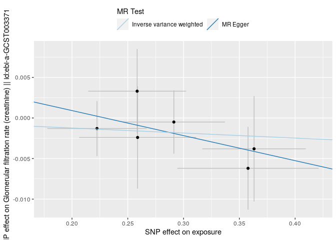
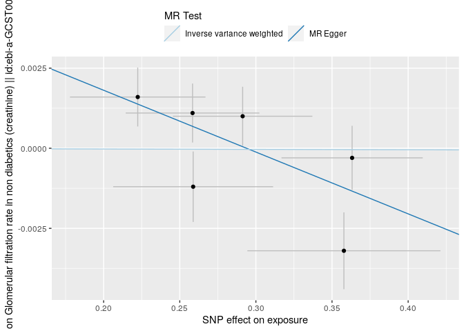
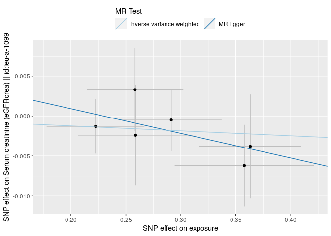
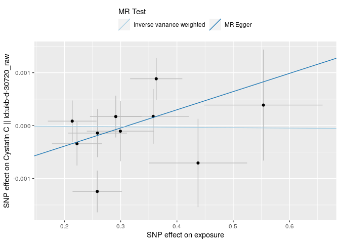
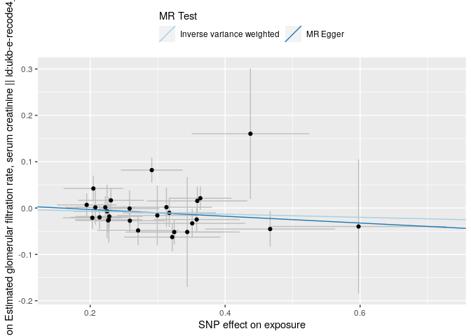
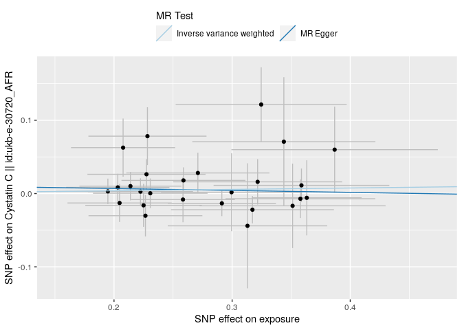
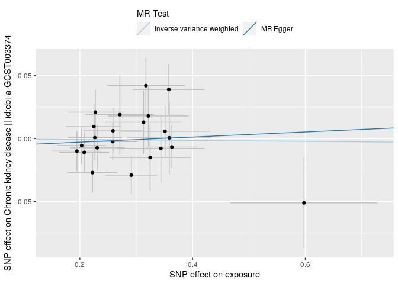

Creatinine & Cystatin C & CKD as possible consequences of FMD
================
Fred Boehm
4/18/23

``` r
library(magrittr)
```

``` r
#ieugwasr::api_status()
ao <- TwoSampleMR::available_outcomes()
```

    API: public: http://gwas-api.mrcieu.ac.uk/

``` r
cr_ind <- grepl("creatinine", ao$trait, ignore.case = TRUE) 
ki_ind <- grepl("kidney", ao$trait, ignore.case = TRUE) 
cc_ind <- grepl("cystatin", ao$trait, ignore.case = TRUE)
cyc_outcomes <- ao[cc_ind, ] %>%
    dplyr::filter(stringr::str_detect(string = trait, pattern = "Cystatin C") | stringr::str_detect(string = trait, pattern = "eGFRcys") | stringr::str_detect(string = trait, pattern = "Glomerular filtration rate"))
# get ckd outcomes
ckd_outcomes <- ao[ki_ind, ] %>%
    dplyr::filter(stringr::str_detect(string = trait, pattern = "Chronic"))
ckd_outcomes %>%
    knitr::kable() %>%
    knitr::knit_print()
```

| id                        | trait                  | ncase | group_name | year | author    | consortium | sex               |     pmid | population                 | unit     | sample_size | build       | ncontrol | category | subcategory | ontology | note               |  mr |     nsnp | priority |  sd |
|:--------------------------|:-----------------------|------:|:-----------|-----:|:----------|:-----------|:------------------|---------:|:---------------------------|:---------|------------:|:------------|---------:|:---------|:------------|:---------|:-------------------|----:|---------:|---------:|----:|
| ebi-a-GCST003374          | Chronic kidney disease | 12385 | public     | 2016 | Pattaro C | NA         | NA                | 26831199 | European                   | NA       |      117165 | HG19/GRCh37 |   104780 | NA       | NA          | NA       | NA                 |   1 |  2179497 |        0 |  NA |
| ieu-a-1102                | Chronic kidney disease | 12385 | public     | 2015 | Pattaro   | CKDGen     | Males and Females | 26831199 | Mixed                      | log odds |      117165 | HG19/GRCh37 |   104780 | Disease  | Kidney      | NA       | NA                 |   1 |  2191877 |        1 |  NA |
| finn-b-N14_CHRONKIDNEYDIS | Chronic kidney disease |  3902 | public     | 2021 | NA        | NA         | Males and Females |       NA | European                   | NA       |          NA | HG19/GRCh37 |   212841 | Binary   | NA          | NA       | N14_CHRONKIDNEYDIS |   1 | 16380459 |        0 |  NA |
| ebi-a-GCST008026          | Chronic kidney disease |  1533 | public     | 2019 | Wojcik GL | NA         | NA                | 31217584 | Hispanic or Latin American | NA       |       20920 | HG19/GRCh37 |     1339 | NA       | NA          | NA       | NA                 |   1 | 17624171 |        0 |  NA |

``` r
cyc_outcomes %>%
    knitr::kable() %>%
    knitr::knit_print()
```

| id               | trait                                   | ncase | group_name | year | author       | consortium | sex               |     pmid | population                                                         | unit                | sample_size | build       | ncontrol | category    | subcategory | ontology    | note                                                                               |  mr |     nsnp | priority |   sd |
|:-----------------|:----------------------------------------|------:|:-----------|-----:|:-------------|:-----------|:------------------|---------:|:-------------------------------------------------------------------|:--------------------|------------:|:------------|---------:|:------------|:------------|:------------|:-----------------------------------------------------------------------------------|----:|---------:|---------:|-----:|
| ukb-e-30720_MID  | Cystatin C                              |  1500 | public     | 2020 | Pan-UKB team | NA         | Males and Females |       NA | Greater Middle Eastern (Middle Eastern, North African, or Persian) | NA                  |        1500 | HG19/GRCh37 |        0 | Continuous  | NA          | NA          | NA                                                                                 |   1 | 11896897 |        0 |   NA |
| ukb-e-30720_AFR  | Cystatin C                              |  6213 | public     | 2020 | Pan-UKB team | NA         | Males and Females |       NA | African American or Afro-Caribbean                                 | NA                  |        6213 | HG19/GRCh37 |        0 | Continuous  | NA          | NA          | NA                                                                                 |   1 | 15531997 |        0 |   NA |
| ukb-d-30720_irnt | Cystatin C                              |    NA | public     | 2018 | Neale lab    | NA         | Males and Females |       NA | European                                                           | NA                  |          NA | HG19/GRCh37 |       NA | Metabolites | NA          | NA          | NA                                                                                 |   1 | 13586047 |        0 |   NA |
| prot-c-2609_59_2 | Cystatin C                              |    NA | public     | 2019 | Suhre K      | NA         | Males and Females | 28240269 | European                                                           | NA                  |          NA | HG19/GRCh37 |       NA | Continuous  | NA          | EFO_0007937 | name=Cystatin-C; chr=20; start=23626706; end=23638473; entrez=1471; uniprot=P01034 |   1 |   501428 |        0 |   NA |
| ukb-e-30720_EAS  | Cystatin C                              |  2573 | public     | 2020 | Pan-UKB team | NA         | Males and Females |       NA | East Asian                                                         | NA                  |        2573 | HG19/GRCh37 |        0 | Continuous  | NA          | NA          | NA                                                                                 |   1 |  8258675 |        0 |   NA |
| ukb-d-30720_raw  | Cystatin C                              |    NA | public     | 2018 | Neale lab    | NA         | Males and Females |       NA | European                                                           | NA                  |          NA | HG19/GRCh37 |       NA | Metabolites | NA          | NA          | NA                                                                                 |   1 | 13586047 |        0 |   NA |
| ieu-a-1106       | Serum cystatin C (eGFRcys)              |    NA | public     | 2015 | Pattaro      | CKDGen     | Males and Females | 26831199 | Mixed                                                              | log ml/min/1.73 m^2 |       33152 | HG19/GRCh37 |       NA | Risk factor | Kidney      | NA          | NA                                                                                 |   1 |  2197556 |        1 | 0.23 |
| ebi-a-GCST003375 | Glomerular filtration rate (cystatin C) |    NA | public     | 2016 | Pattaro C    | NA         | NA                | 26831199 | European                                                           | NA                  |       32834 | HG19/GRCh37 |       NA | NA          | NA          | NA          | NA                                                                                 |   1 |  2153636 |        0 |   NA |
| ukb-e-30720_CSA  | Cystatin C                              |  8422 | public     | 2020 | Pan-UKB team | NA         | Males and Females |       NA | South Asian                                                        | NA                  |        8422 | HG19/GRCh37 |        0 | Continuous  | NA          | NA          | NA                                                                                 |   1 |  9811995 |        0 |   NA |

``` r
# creatinine
cre_outcomes <- ao[cr_ind, ] %>%
    dplyr::filter(!(stringr::str_detect(string = trait, pattern = "urine")) & !(stringr::str_detect(string = trait, pattern = "Urinary")))
cre_outcomes %>% 
    knitr::kable() %>%
    knitr::knit_print()
```

| id                | trait                                                              | ncase | group_name | year | author       | consortium | sex               |     pmid | population                                                         | unit                | sample_size | build       | ncontrol | category    | subcategory | ontology | note                                                                          |  mr |     nsnp | priority |       sd |
|:------------------|:-------------------------------------------------------------------|------:|:-----------|-----:|:-------------|:-----------|:------------------|---------:|:-------------------------------------------------------------------|:--------------------|------------:|:------------|---------:|:------------|:------------|:---------|:------------------------------------------------------------------------------|----:|---------:|---------:|---------:|
| ebi-a-GCST003401  | Glomerular filtration rate in non diabetics (creatinine)           |    NA | public     | 2016 | Pattaro C    | NA         | NA                | 26831199 | European                                                           | NA                  |      118448 | HG19/GRCh37 |       NA | NA          | NA          | NA       | NA                                                                            |   1 |  2118555 |        0 |       NA |
| ukb-e-30700_EAS   | Creatinine                                                         |  2571 | public     | 2020 | Pan-UKB team | NA         | Males and Females |       NA | East Asian                                                         | NA                  |        2571 | HG19/GRCh37 |        0 | Continuous  | NA          | NA       | NA                                                                            |   1 |  8258983 |        0 |       NA |
| ukb-e-recode6_MID | Estimated glomerular filtration rate, serum creatinine + cystain C |  1504 | public     | 2020 | Pan-UKB team | NA         | Males and Females |       NA | Greater Middle Eastern (Middle Eastern, North African, or Persian) | NA                  |        1504 | HG19/GRCh37 |        0 | Continuous  | NA          | NA       | NA                                                                            |   1 | 11891553 |        0 |       NA |
| ebi-a-GCST003371  | Glomerular filtration rate (creatinine)                            |    NA | public     | 2016 | Pattaro C    | NA         | NA                | 26831199 | African unspecified                                                | NA                  |       16840 | HG19/GRCh37 |       NA | NA          | NA          | NA       | NA                                                                            |   1 |  2423741 |        0 |       NA |
| ebi-a-GCST003373  | Glomerular filtration rate in diabetics (creatinine)               |    NA | public     | 2016 | Pattaro C    | NA         | NA                | 26831199 | European                                                           | NA                  |       11522 | HG19/GRCh37 |       NA | NA          | NA          | NA       | NA                                                                            |   1 |  2169300 |        0 |       NA |
| ukb-e-recode6_CSA | Estimated glomerular filtration rate, serum creatinine + cystain C |  8431 | public     | 2020 | Pan-UKB team | NA         | Males and Females |       NA | South Asian                                                        | NA                  |        8431 | HG19/GRCh37 |        0 | Continuous  | NA          | NA       | NA                                                                            |   1 |  9812217 |        0 |       NA |
| ukb-e-30700_MID   | Creatinine                                                         |  1498 | public     | 2020 | Pan-UKB team | NA         | Males and Females |       NA | Greater Middle Eastern (Middle Eastern, North African, or Persian) | NA                  |        1498 | HG19/GRCh37 |        0 | Continuous  | NA          | NA       | NA                                                                            |   1 | 11901524 |        0 |       NA |
| ukb-e-recode6_EAS | Estimated glomerular filtration rate, serum creatinine + cystain C |  2576 | public     | 2020 | Pan-UKB team | NA         | Males and Females |       NA | East Asian                                                         | NA                  |        2576 | HG19/GRCh37 |        0 | Continuous  | NA          | NA       | NA                                                                            |   1 |  8258311 |        0 |       NA |
| ukb-e-recode6_AFR | Estimated glomerular filtration rate, serum creatinine + cystain C |  6218 | public     | 2020 | Pan-UKB team | NA         | Males and Females |       NA | African American or Afro-Caribbean                                 | NA                  |        6218 | HG19/GRCh37 |        0 | Continuous  | NA          | NA       | NA                                                                            |   1 | 15531955 |        0 |       NA |
| ebi-a-GCST003372  | Glomerular filtration rate (creatinine)                            |    NA | public     | 2016 | Pattaro C    | NA         | NA                | 26831199 | European                                                           | NA                  |      133413 | HG19/GRCh37 |       NA | NA          | NA          | NA       | NA                                                                            |   1 |  2116469 |        0 |       NA |
| ukb-e-recode4_MID | Estimated glomerular filtration rate, serum creatinine             |  1502 | public     | 2020 | Pan-UKB team | NA         | Males and Females |       NA | Greater Middle Eastern (Middle Eastern, North African, or Persian) | NA                  |        1502 | HG19/GRCh37 |        0 | Continuous  | NA          | NA       | NA                                                                            |   1 | 11892972 |        0 |       NA |
| ieu-a-1103        | Serum creatinine (eGFRcrea)                                        |    NA | public     | 2015 | Pattaro      | CKDGen     | Males and Females | 26831199 | Mixed                                                              | log ml/min/1.73 m^2 |       11529 | HG19/GRCh37 |       NA | Risk factor | Kidney      | NA       | In subjects with diabetes mellitus                                            |   1 |  2197064 |        3 | 0.240000 |
| ukb-e-30700_CSA   | Creatinine                                                         |  8422 | public     | 2020 | Pan-UKB team | NA         | Males and Females |       NA | South Asian                                                        | NA                  |        8422 | HG19/GRCh37 |        0 | Continuous  | NA          | NA       | NA                                                                            |   1 |  9812063 |        0 |       NA |
| ieu-a-1105        | Serum creatinine (eGFRcrea)                                        |    NA | public     | 2015 | Pattaro      | CKDGen     | Males and Females | 26831199 | Mixed                                                              | log ml/min/1.73 m^2 |      133814 | HG19/GRCh37 |       NA | Risk factor | Kidney      | NA       | NA                                                                            |   1 |  2198208 |        1 | 0.240000 |
| ukb-d-30700_raw   | Creatinine                                                         |    NA | public     | 2018 | Neale lab    | NA         | Males and Females |       NA | European                                                           | NA                  |          NA | HG19/GRCh37 |       NA | Metabolites | NA          | NA       | NA                                                                            |   1 | 13585973 |        0 |       NA |
| ebi-a-GCST005066  | Creatinine levels                                                  |    NA | public     | 2017 | Prins BP     | NA         | NA                | 28887542 | European                                                           | NA                  |        9803 | HG19/GRCh37 |       NA | NA          | NA          | NA       | NA                                                                            |   1 | 16819595 |        0 |       NA |
| met-c-850         | Creatinine                                                         |    NA | public     | 2016 | Kettunen     | NA         | Males and Females | 27005778 | European                                                           | SD                  |       24810 | HG19/GRCh37 |       NA | Metabolites | Amino acid  | NA       | SD value comes from the original untransformed distribution of the ERF cohort |   1 | 12087816 |        1 | 0.220000 |
| bbj-a-61          | Serum creatinine                                                   |    NA | public     | 2019 | Ishigaki K   | NA         | Males and Females | 29403010 | East Asian                                                         | NA                  |      142097 | HG19/GRCh37 |       NA | Continuous  | NA          | NA       | NA                                                                            |   1 |  6108953 |        0 |       NA |
| ieu-a-1104        | Serum creatinine (eGFRcrea)                                        |    NA | public     | 2015 | Pattaro      | CKDGen     | Males and Females | 26831199 | Mixed                                                              | log ml/min/1.73 m^2 |      118460 | HG19/GRCh37 |       NA | Risk factor | Kidney      | NA       | Subjects with diabetes mellitus excluded                                      |   1 |  2198288 |        2 | 0.240000 |
| met-d-Creatinine  | Creatinine                                                         |    NA | public     | 2020 | Borges CM    | NA         | Males and Females |       NA | European                                                           | NA                  |      110058 | HG19/GRCh37 |       NA | Continuous  | NA          | NA       | NA                                                                            |   1 | 12321875 |        0 |       NA |
| ukb-e-recode4_EAS | Estimated glomerular filtration rate, serum creatinine             |  2574 | public     | 2020 | Pan-UKB team | NA         | Males and Females |       NA | East Asian                                                         | NA                  |        2574 | HG19/GRCh37 |        0 | Continuous  | NA          | NA       | NA                                                                            |   1 |  8258762 |        0 |       NA |
| ieu-a-1099        | Serum creatinine (eGFRcrea)                                        |    NA | public     | 2015 | Pattaro      | CKDGen     | Males and Females | 26831199 | African American or Afro-Caribbean                                 | log ml/min/1.73 m^2 |       16474 | HG19/GRCh37 |       NA | Risk factor | Kidney      | NA       | NA                                                                            |   1 |  2453513 |        1 | 0.240000 |
| met-a-309         | Creatinine                                                         |    NA | public     | 2014 | Shin         | NA         | Males and Females | 24816252 | European                                                           | log10 units         |        7810 | HG19/GRCh37 |       NA | Metabolites | Amino acid  | NA       | NA                                                                            |   1 |  2545671 |        1 | 0.078003 |
| ukb-e-recode4_CSA | Estimated glomerular filtration rate, serum creatinine             |  8432 | public     | 2020 | Pan-UKB team | NA         | Males and Females |       NA | South Asian                                                        | NA                  |        8432 | HG19/GRCh37 |        0 | Continuous  | NA          | NA       | NA                                                                            |   1 |  9812249 |        0 |       NA |
| ukb-e-recode4_AFR | Estimated glomerular filtration rate, serum creatinine             |  6217 | public     | 2020 | Pan-UKB team | NA         | Males and Females |       NA | African American or Afro-Caribbean                                 | NA                  |        6217 | HG19/GRCh37 |        0 | Continuous  | NA          | NA       | NA                                                                            |   1 | 15531881 |        0 |       NA |
| ukb-d-30700_irnt  | Creatinine                                                         |    NA | public     | 2018 | Neale lab    | NA         | Males and Females |       NA | European                                                           | NA                  |          NA | HG19/GRCh37 |       NA | Metabolites | NA          | NA       | NA                                                                            |   1 | 13585973 |        0 |       NA |
| ukb-e-30700_AFR   | Creatinine                                                         |  6212 | public     | 2020 | Pan-UKB team | NA         | Males and Females |       NA | African American or Afro-Caribbean                                 | NA                  |        6212 | HG19/GRCh37 |        0 | Continuous  | NA          | NA       | NA                                                                            |   1 | 15531868 |        0 |       NA |

``` r
outcomes <- list(creatinine = cre_outcomes, cystatin = cyc_outcomes, ckd = ckd_outcomes)
```

``` r
fmd_file <- here::here("analysis", "data", "fmd", "GCST90026612_buildGRCh37.tsv")
fmd <- TwoSampleMR::read_exposure_data(filename = fmd_file,
                                        sep = "\t",
                                        snp_col = "SNP",
                                        beta_col = "BETA",
                                        effect_allele_col = "EA",
                                        other_allele_col = "OA",
                                        eaf_col = "EAF",
                                        se_col = "SE",
                                        pval_col = "p_value",
                                        chr_col = "chromosome",
                                        pos_col = "base_pair_location",
                                        ncase_col = "N_cases",
                                        ncontrol_col = "N_ctrls"
                                        )
```

    No phenotype name specified, defaulting to 'exposure'.

    Generating sample size from ncase and ncontrol

``` r
#fmd <- vroom::vroom(fmd_file) %>%
#    dplyr::mutate(chr_pos = paste0("chr", chromosome, ":", base_pair_location))
fmd_lead_snps_file <- here::here("analysis", "data", "fmd", "41467_2021_26174_MOESM4_ESM.xlsx") 

for (threshold in c(10 ^ -6, 10 ^ -5)){
    fmd_lead_snps <- readxl::read_xlsx(fmd_lead_snps_file, skip = 2) %>%
        dplyr::filter(`P-value` < threshold) 
    fmd_filt <- fmd %>%
        dplyr::filter(SNP %in% fmd_lead_snps$rsID)
    cat("## MR for ", threshold, " threshold\n")
    # loop over outcomes object
    for (i in seq_along(outcomes)){
        cat("### MR for ", names(outcomes)[i], " outcomes\n")
        out <- outcomes[[i]]
        oo <- TwoSampleMR::extract_outcome_data(
            snps = fmd_filt$SNP,
            outcomes = out$id
        )
        dat <- TwoSampleMR::harmonise_data(exposure_dat = fmd_filt, outcome_dat = oo)
        res <- TwoSampleMR::mr(dat, method_list = c("mr_egger_regression", "mr_ivw")) 
        res %>%
            knitr::kable(caption = paste0("MR Egger and MR IVW for ", names(outcomes)[i])) %>%
            knitr::knit_print()
        TwoSampleMR::mr_heterogeneity(dat) %>%
            knitr::kable(caption = paste0("Heterogeneity test for ", names(outcomes)[i])) %>%
            knitr::knit_print()
        TwoSampleMR::mr_pleiotropy_test(dat) %>%
            knitr::kable(caption = paste0("Pleiotropy test for ", names(outcomes)[i])) %>%
            knitr::knit_print()
        res_ss <- TwoSampleMR::mr_singlesnp(dat) 
        res_ss %>%
            knitr::kable(caption = paste0("Single SNP analysis for ", names(outcomes)[i])) %>%
            knitr::knit_print()
        loo <- TwoSampleMR::mr_leaveoneout(dat) 
        loo %>%
            knitr::kable(caption = paste0("Leave one out analysis for ", names(outcomes)[i])) %>%
            knitr::knit_print()
        cat("### Plots for ", names(outcomes)[i], " outcomes\n")
        pp <- TwoSampleMR::mr_scatter_plot(res, dat)
        for (index in seq_along(pp)){
            print(pp[[index]])
        }
#        p2 <- TwoSampleMR::mr_forest_plot(res_ss)
#        for (index in seq_along(p2)){
#            print(p2[[index]])
#        }
#        p3 <- TwoSampleMR::mr_leaveoneout_plot(loo)
#        for (index in seq_along(p3)){
#            print(p3[[index]])
#        }
#        p4 <- TwoSampleMR::mr_funnel_plot(res_ss)
#        for (index in seq_along(p4)){ 
#            print(p4[[index]])
#        }
    }
}
```

## MR for 1e-06 threshold

### MR for creatinine outcomes

    Extracting data for 10 SNP(s) from 27 GWAS(s)

    Finding proxies for 6 SNPs in outcome ebi-a-GCST003401

    Extracting data for 6 SNP(s) from 1 GWAS(s)

    Finding proxies for 1 SNPs in outcome ukb-e-30700_EAS

    Extracting data for 1 SNP(s) from 1 GWAS(s)

    Finding proxies for 6 SNPs in outcome ebi-a-GCST003371

    Extracting data for 6 SNP(s) from 1 GWAS(s)

    Finding proxies for 6 SNPs in outcome ebi-a-GCST003373

    Extracting data for 6 SNP(s) from 1 GWAS(s)

    Finding proxies for 1 SNPs in outcome ukb-e-recode6_EAS

    Extracting data for 1 SNP(s) from 1 GWAS(s)

    Finding proxies for 2 SNPs in outcome ukb-e-recode6_AFR

    Extracting data for 2 SNP(s) from 1 GWAS(s)

    Finding proxies for 6 SNPs in outcome ebi-a-GCST003372

    Extracting data for 6 SNP(s) from 1 GWAS(s)

    Finding proxies for 6 SNPs in outcome ieu-a-1103

    Extracting data for 6 SNP(s) from 1 GWAS(s)

    Finding proxies for 6 SNPs in outcome ieu-a-1105

    Extracting data for 6 SNP(s) from 1 GWAS(s)

    Finding proxies for 9 SNPs in outcome ebi-a-GCST005066

    Extracting data for 9 SNP(s) from 1 GWAS(s)

    Finding proxies for 2 SNPs in outcome bbj-a-61

    Extracting data for 2 SNP(s) from 1 GWAS(s)

    Finding proxies for 6 SNPs in outcome ieu-a-1104

    Extracting data for 6 SNP(s) from 1 GWAS(s)

    Finding proxies for 1 SNPs in outcome ukb-e-recode4_EAS

    Extracting data for 1 SNP(s) from 1 GWAS(s)

    Finding proxies for 6 SNPs in outcome ieu-a-1099

    Extracting data for 6 SNP(s) from 1 GWAS(s)

    Finding proxies for 5 SNPs in outcome met-a-309

    Extracting data for 5 SNP(s) from 1 GWAS(s)

    Finding proxies for 10 SNPs in outcome ukb-e-recode4_AFR

    Extracting data for 10 SNP(s) from 1 GWAS(s)

    Finding proxies for 10 SNPs in outcome ukb-e-30700_AFR

    Extracting data for 10 SNP(s) from 1 GWAS(s)

    Harmonising exposure (B4oQuw) and Serum creatinine || id:bbj-a-61 (bbj-a-61)

    Harmonising exposure (B4oQuw) and Glomerular filtration rate (creatinine) || id:ebi-a-GCST003371 (ebi-a-GCST003371)

    Harmonising exposure (B4oQuw) and Glomerular filtration rate (creatinine) || id:ebi-a-GCST003372 (ebi-a-GCST003372)

    Harmonising exposure (B4oQuw) and Glomerular filtration rate in diabetics (creatinine) || id:ebi-a-GCST003373 (ebi-a-GCST003373)

    Harmonising exposure (B4oQuw) and Glomerular filtration rate in non diabetics (creatinine) || id:ebi-a-GCST003401 (ebi-a-GCST003401)

    Harmonising exposure (B4oQuw) and Creatinine levels || id:ebi-a-GCST005066 (ebi-a-GCST005066)

    Removing the following SNPs for being palindromic with intermediate allele frequencies:
    rs72802873

    Harmonising exposure (B4oQuw) and Serum creatinine (eGFRcrea) || id:ieu-a-1099 (ieu-a-1099)

    Harmonising exposure (B4oQuw) and Serum creatinine (eGFRcrea) || id:ieu-a-1103 (ieu-a-1103)

    Harmonising exposure (B4oQuw) and Serum creatinine (eGFRcrea) || id:ieu-a-1104 (ieu-a-1104)

    Harmonising exposure (B4oQuw) and Serum creatinine (eGFRcrea) || id:ieu-a-1105 (ieu-a-1105)

    Harmonising exposure (B4oQuw) and Creatinine || id:met-a-309 (met-a-309)

    Harmonising exposure (B4oQuw) and Creatinine || id:met-c-850 (met-c-850)

    Harmonising exposure (B4oQuw) and Creatinine || id:met-d-Creatinine (met-d-Creatinine)

    Harmonising exposure (B4oQuw) and Creatinine || id:ukb-d-30700_irnt (ukb-d-30700_irnt)

    Harmonising exposure (B4oQuw) and Creatinine || id:ukb-d-30700_raw (ukb-d-30700_raw)

    Harmonising exposure (B4oQuw) and Creatinine || id:ukb-e-30700_CSA (ukb-e-30700_CSA)

    Harmonising exposure (B4oQuw) and Creatinine || id:ukb-e-30700_EAS (ukb-e-30700_EAS)

    Harmonising exposure (B4oQuw) and Creatinine || id:ukb-e-30700_MID (ukb-e-30700_MID)

    Harmonising exposure (B4oQuw) and Estimated glomerular filtration rate, serum creatinine || id:ukb-e-recode4_CSA (ukb-e-recode4_CSA)

    Harmonising exposure (B4oQuw) and Estimated glomerular filtration rate, serum creatinine || id:ukb-e-recode4_EAS (ukb-e-recode4_EAS)

    Harmonising exposure (B4oQuw) and Estimated glomerular filtration rate, serum creatinine || id:ukb-e-recode4_MID (ukb-e-recode4_MID)

    Harmonising exposure (B4oQuw) and Estimated glomerular filtration rate, serum creatinine + cystain C || id:ukb-e-recode6_AFR (ukb-e-recode6_AFR)

    Harmonising exposure (B4oQuw) and Estimated glomerular filtration rate, serum creatinine + cystain C || id:ukb-e-recode6_CSA (ukb-e-recode6_CSA)

    Harmonising exposure (B4oQuw) and Estimated glomerular filtration rate, serum creatinine + cystain C || id:ukb-e-recode6_EAS (ukb-e-recode6_EAS)

    Harmonising exposure (B4oQuw) and Estimated glomerular filtration rate, serum creatinine + cystain C || id:ukb-e-recode6_MID (ukb-e-recode6_MID)

    Analysing 'B4oQuw' on 'bbj-a-61'

    Analysing 'B4oQuw' on 'ebi-a-GCST003371'

    Analysing 'B4oQuw' on 'ebi-a-GCST003372'

    Analysing 'B4oQuw' on 'ebi-a-GCST003373'

    Analysing 'B4oQuw' on 'ebi-a-GCST003401'

    No SNPs available for MR analysis of 'B4oQuw' on 'ebi-a-GCST005066'

    Analysing 'B4oQuw' on 'ieu-a-1099'

    Analysing 'B4oQuw' on 'ieu-a-1103'

    Analysing 'B4oQuw' on 'ieu-a-1104'

    Analysing 'B4oQuw' on 'ieu-a-1105'

    Analysing 'B4oQuw' on 'met-a-309'

    Analysing 'B4oQuw' on 'met-c-850'

    Analysing 'B4oQuw' on 'met-d-Creatinine'

    Analysing 'B4oQuw' on 'ukb-d-30700_irnt'

    Analysing 'B4oQuw' on 'ukb-d-30700_raw'

    Analysing 'B4oQuw' on 'ukb-e-30700_CSA'

    Analysing 'B4oQuw' on 'ukb-e-30700_EAS'

    Analysing 'B4oQuw' on 'ukb-e-30700_MID'

    Analysing 'B4oQuw' on 'ukb-e-recode4_CSA'

    Analysing 'B4oQuw' on 'ukb-e-recode4_EAS'

    Analysing 'B4oQuw' on 'ukb-e-recode4_MID'

    Analysing 'B4oQuw' on 'ukb-e-recode6_AFR'

    Analysing 'B4oQuw' on 'ukb-e-recode6_CSA'

    Analysing 'B4oQuw' on 'ukb-e-recode6_EAS'

    Analysing 'B4oQuw' on 'ukb-e-recode6_MID'

    Not enough SNPs available for Heterogeneity analysis of 'B4oQuw' on 'ebi-a-GCST005066'

    Not enough SNPs available for pleiotropy analysis of 'B4oQuw' on 'ebi-a-GCST005066'

### Plots for creatinine outcomes

<div class="cell-output-display">


</div>

<div class="cell-output-display">



</div>

<div class="cell-output-display">


</div>

<div class="cell-output-display">


</div>

<div class="cell-output-display">



</div>

<div class="cell-output-display">


</div>

<div class="cell-output-display">



</div>

<div class="cell-output-display">


</div>

<div class="cell-output-display">


</div>

<div class="cell-output-display">


</div>

<div class="cell-output-display">


</div>

<div class="cell-output-display">


</div>

<div class="cell-output-display">


</div>

<div class="cell-output-display">


</div>

<div class="cell-output-display">


</div>

<div class="cell-output-display">


</div>

<div class="cell-output-display">


</div>

<div class="cell-output-display">


</div>

<div class="cell-output-display">


</div>

<div class="cell-output-display">


</div>

<div class="cell-output-display">


</div>

<div class="cell-output-display">


</div>

<div class="cell-output-display">


</div>

<div class="cell-output-display">


</div>

### MR for cystatin outcomes

    Extracting data for 10 SNP(s) from 9 GWAS(s)

    Finding proxies for 2 SNPs in outcome ukb-e-30720_AFR

    Extracting data for 2 SNP(s) from 1 GWAS(s)

    Finding proxies for 7 SNPs in outcome prot-c-2609_59_2

    Extracting data for 7 SNP(s) from 1 GWAS(s)

    Finding proxies for 1 SNPs in outcome ukb-e-30720_EAS

    Extracting data for 1 SNP(s) from 1 GWAS(s)

    Finding proxies for 6 SNPs in outcome ieu-a-1106

    Extracting data for 6 SNP(s) from 1 GWAS(s)

    Finding proxies for 6 SNPs in outcome ebi-a-GCST003375

    Extracting data for 6 SNP(s) from 1 GWAS(s)

    Harmonising exposure (B4oQuw) and Glomerular filtration rate (cystatin C) || id:ebi-a-GCST003375 (ebi-a-GCST003375)

    Harmonising exposure (B4oQuw) and Serum cystatin C (eGFRcys) || id:ieu-a-1106 (ieu-a-1106)

    Harmonising exposure (B4oQuw) and Cystatin C || id:prot-c-2609_59_2 (prot-c-2609_59_2)

    Harmonising exposure (B4oQuw) and Cystatin C || id:ukb-d-30720_irnt (ukb-d-30720_irnt)

    Harmonising exposure (B4oQuw) and Cystatin C || id:ukb-d-30720_raw (ukb-d-30720_raw)

    Harmonising exposure (B4oQuw) and Cystatin C || id:ukb-e-30720_AFR (ukb-e-30720_AFR)

    Harmonising exposure (B4oQuw) and Cystatin C || id:ukb-e-30720_CSA (ukb-e-30720_CSA)

    Harmonising exposure (B4oQuw) and Cystatin C || id:ukb-e-30720_EAS (ukb-e-30720_EAS)

    Harmonising exposure (B4oQuw) and Cystatin C || id:ukb-e-30720_MID (ukb-e-30720_MID)

    Analysing 'B4oQuw' on 'ebi-a-GCST003375'

    Analysing 'B4oQuw' on 'ieu-a-1106'

    Analysing 'B4oQuw' on 'prot-c-2609_59_2'

    Analysing 'B4oQuw' on 'ukb-d-30720_irnt'

    Analysing 'B4oQuw' on 'ukb-d-30720_raw'

    Analysing 'B4oQuw' on 'ukb-e-30720_AFR'

    Analysing 'B4oQuw' on 'ukb-e-30720_CSA'

    Analysing 'B4oQuw' on 'ukb-e-30720_EAS'

    Analysing 'B4oQuw' on 'ukb-e-30720_MID'

<div class="cell-output-display">


</div>

### Plots for cystatin outcomes

<div class="cell-output-display">


</div>

<div class="cell-output-display">


</div>

<div class="cell-output-display">


</div>

<div class="cell-output-display">


</div>

<div class="cell-output-display">



</div>

<div class="cell-output-display">


</div>

<div class="cell-output-display">


</div>

<div class="cell-output-display">


</div>

### MR for ckd outcomes

    Extracting data for 10 SNP(s) from 4 GWAS(s)

    Finding proxies for 6 SNPs in outcome ebi-a-GCST003374

    Extracting data for 6 SNP(s) from 1 GWAS(s)

    Finding proxies for 6 SNPs in outcome ieu-a-1102

    Extracting data for 6 SNP(s) from 1 GWAS(s)

    Harmonising exposure (B4oQuw) and Chronic kidney disease || id:ebi-a-GCST003374 (ebi-a-GCST003374)

    Harmonising exposure (B4oQuw) and Chronic kidney disease || id:ebi-a-GCST008026 (ebi-a-GCST008026)

    Harmonising exposure (B4oQuw) and Chronic kidney disease || id:finn-b-N14_CHRONKIDNEYDIS (finn-b-N14_CHRONKIDNEYDIS)

    Harmonising exposure (B4oQuw) and Chronic kidney disease || id:ieu-a-1102 (ieu-a-1102)

    Analysing 'B4oQuw' on 'ebi-a-GCST003374'

    Analysing 'B4oQuw' on 'ebi-a-GCST008026'

    Analysing 'B4oQuw' on 'finn-b-N14_CHRONKIDNEYDIS'

    Analysing 'B4oQuw' on 'ieu-a-1102'

<div class="cell-output-display">


</div>

### Plots for ckd outcomes

<div class="cell-output-display">


</div>

<div class="cell-output-display">


</div>

<div class="cell-output-display">


</div>

## MR for 1e-05 threshold

### MR for creatinine outcomes

    Extracting data for 32 SNP(s) from 27 GWAS(s)

    Finding proxies for 16 SNPs in outcome ebi-a-GCST003401

    Extracting data for 16 SNP(s) from 1 GWAS(s)

    Finding proxies for 5 SNPs in outcome ukb-e-30700_EAS

    Extracting data for 5 SNP(s) from 1 GWAS(s)

    Finding proxies for 19 SNPs in outcome ebi-a-GCST003371

    Extracting data for 19 SNP(s) from 1 GWAS(s)

    Finding proxies for 16 SNPs in outcome ebi-a-GCST003373

    Extracting data for 16 SNP(s) from 1 GWAS(s)

    Finding proxies for 2 SNPs in outcome ukb-e-recode6_CSA

    Extracting data for 2 SNP(s) from 1 GWAS(s)

    Finding proxies for 5 SNPs in outcome ukb-e-recode6_EAS

    Extracting data for 5 SNP(s) from 1 GWAS(s)

    Finding proxies for 9 SNPs in outcome ukb-e-recode6_AFR

    Extracting data for 9 SNP(s) from 1 GWAS(s)

    Finding proxies for 16 SNPs in outcome ebi-a-GCST003372

    Extracting data for 16 SNP(s) from 1 GWAS(s)

    Finding proxies for 16 SNPs in outcome ieu-a-1103

    Extracting data for 16 SNP(s) from 1 GWAS(s)

    Finding proxies for 2 SNPs in outcome ukb-e-30700_CSA

    Extracting data for 2 SNP(s) from 1 GWAS(s)

    Finding proxies for 16 SNPs in outcome ieu-a-1105

    Extracting data for 16 SNP(s) from 1 GWAS(s)

    Finding proxies for 27 SNPs in outcome ebi-a-GCST005066

    Extracting data for 27 SNP(s) from 1 GWAS(s)

    Finding proxies for 8 SNPs in outcome bbj-a-61

    Extracting data for 8 SNP(s) from 1 GWAS(s)

    Finding proxies for 16 SNPs in outcome ieu-a-1104

    Extracting data for 16 SNP(s) from 1 GWAS(s)

    Finding proxies for 5 SNPs in outcome ukb-e-recode4_EAS

    Extracting data for 5 SNP(s) from 1 GWAS(s)

    Finding proxies for 17 SNPs in outcome ieu-a-1099

    Extracting data for 17 SNP(s) from 1 GWAS(s)

    Finding proxies for 15 SNPs in outcome met-a-309

    Extracting data for 15 SNP(s) from 1 GWAS(s)

    Finding proxies for 2 SNPs in outcome ukb-e-recode4_CSA

    Extracting data for 2 SNP(s) from 1 GWAS(s)

    Finding proxies for 32 SNPs in outcome ukb-e-recode4_AFR

    Extracting data for 32 SNP(s) from 1 GWAS(s)

    Finding proxies for 32 SNPs in outcome ukb-e-30700_AFR

    Extracting data for 32 SNP(s) from 1 GWAS(s)

    Harmonising exposure (B4oQuw) and Serum creatinine || id:bbj-a-61 (bbj-a-61)

    Harmonising exposure (B4oQuw) and Glomerular filtration rate (creatinine) || id:ebi-a-GCST003371 (ebi-a-GCST003371)

    Harmonising exposure (B4oQuw) and Glomerular filtration rate (creatinine) || id:ebi-a-GCST003372 (ebi-a-GCST003372)

    Harmonising exposure (B4oQuw) and Glomerular filtration rate in diabetics (creatinine) || id:ebi-a-GCST003373 (ebi-a-GCST003373)

    Harmonising exposure (B4oQuw) and Glomerular filtration rate in non diabetics (creatinine) || id:ebi-a-GCST003401 (ebi-a-GCST003401)

    Harmonising exposure (B4oQuw) and Creatinine levels || id:ebi-a-GCST005066 (ebi-a-GCST005066)

    Removing the following SNPs for being palindromic with intermediate allele frequencies:
    rs72675157, rs72802873

    Harmonising exposure (B4oQuw) and Serum creatinine (eGFRcrea) || id:ieu-a-1099 (ieu-a-1099)

    Harmonising exposure (B4oQuw) and Serum creatinine (eGFRcrea) || id:ieu-a-1103 (ieu-a-1103)

    Harmonising exposure (B4oQuw) and Serum creatinine (eGFRcrea) || id:ieu-a-1104 (ieu-a-1104)

    Harmonising exposure (B4oQuw) and Serum creatinine (eGFRcrea) || id:ieu-a-1105 (ieu-a-1105)

    Harmonising exposure (B4oQuw) and Creatinine || id:met-a-309 (met-a-309)

    Harmonising exposure (B4oQuw) and Creatinine || id:met-c-850 (met-c-850)

    Harmonising exposure (B4oQuw) and Creatinine || id:met-d-Creatinine (met-d-Creatinine)

    Harmonising exposure (B4oQuw) and Creatinine || id:ukb-d-30700_irnt (ukb-d-30700_irnt)

    Harmonising exposure (B4oQuw) and Creatinine || id:ukb-d-30700_raw (ukb-d-30700_raw)

    Harmonising exposure (B4oQuw) and Creatinine || id:ukb-e-30700_CSA (ukb-e-30700_CSA)

    Harmonising exposure (B4oQuw) and Creatinine || id:ukb-e-30700_EAS (ukb-e-30700_EAS)

    Harmonising exposure (B4oQuw) and Creatinine || id:ukb-e-30700_MID (ukb-e-30700_MID)

    Harmonising exposure (B4oQuw) and Estimated glomerular filtration rate, serum creatinine || id:ukb-e-recode4_CSA (ukb-e-recode4_CSA)

    Harmonising exposure (B4oQuw) and Estimated glomerular filtration rate, serum creatinine || id:ukb-e-recode4_EAS (ukb-e-recode4_EAS)

    Harmonising exposure (B4oQuw) and Estimated glomerular filtration rate, serum creatinine || id:ukb-e-recode4_MID (ukb-e-recode4_MID)

    Harmonising exposure (B4oQuw) and Estimated glomerular filtration rate, serum creatinine + cystain C || id:ukb-e-recode6_AFR (ukb-e-recode6_AFR)

    Harmonising exposure (B4oQuw) and Estimated glomerular filtration rate, serum creatinine + cystain C || id:ukb-e-recode6_CSA (ukb-e-recode6_CSA)

    Harmonising exposure (B4oQuw) and Estimated glomerular filtration rate, serum creatinine + cystain C || id:ukb-e-recode6_EAS (ukb-e-recode6_EAS)

    Harmonising exposure (B4oQuw) and Estimated glomerular filtration rate, serum creatinine + cystain C || id:ukb-e-recode6_MID (ukb-e-recode6_MID)

    Analysing 'B4oQuw' on 'bbj-a-61'

    Analysing 'B4oQuw' on 'ebi-a-GCST003371'

    Analysing 'B4oQuw' on 'ebi-a-GCST003372'

    Analysing 'B4oQuw' on 'ebi-a-GCST003373'

    Analysing 'B4oQuw' on 'ebi-a-GCST003401'

    Analysing 'B4oQuw' on 'ebi-a-GCST005066'

    Analysing 'B4oQuw' on 'ieu-a-1099'

    Analysing 'B4oQuw' on 'ieu-a-1103'

    Analysing 'B4oQuw' on 'ieu-a-1104'

    Analysing 'B4oQuw' on 'ieu-a-1105'

    Analysing 'B4oQuw' on 'met-a-309'

    Analysing 'B4oQuw' on 'met-c-850'

    Analysing 'B4oQuw' on 'met-d-Creatinine'

    Analysing 'B4oQuw' on 'ukb-d-30700_irnt'

    Analysing 'B4oQuw' on 'ukb-d-30700_raw'

    Analysing 'B4oQuw' on 'ukb-e-30700_CSA'

    Analysing 'B4oQuw' on 'ukb-e-30700_EAS'

    Analysing 'B4oQuw' on 'ukb-e-30700_MID'

    Analysing 'B4oQuw' on 'ukb-e-recode4_CSA'

    Analysing 'B4oQuw' on 'ukb-e-recode4_EAS'

    Analysing 'B4oQuw' on 'ukb-e-recode4_MID'

    Analysing 'B4oQuw' on 'ukb-e-recode6_AFR'

    Analysing 'B4oQuw' on 'ukb-e-recode6_CSA'

    Analysing 'B4oQuw' on 'ukb-e-recode6_EAS'

    Analysing 'B4oQuw' on 'ukb-e-recode6_MID'

<div class="cell-output-display">


</div>

### Plots for creatinine outcomes

<div class="cell-output-display">


</div>

<div class="cell-output-display">


</div>

<div class="cell-output-display">


</div>

<div class="cell-output-display">


</div>

<div class="cell-output-display">


</div>

<div class="cell-output-display">


</div>

<div class="cell-output-display">


</div>

<div class="cell-output-display">


</div>

<div class="cell-output-display">


</div>

<div class="cell-output-display">


</div>

<div class="cell-output-display">


</div>

<div class="cell-output-display">


</div>

<div class="cell-output-display">


</div>

<div class="cell-output-display">


</div>

<div class="cell-output-display">


</div>

<div class="cell-output-display">


</div>

<div class="cell-output-display">


</div>

<div class="cell-output-display">


</div>

<div class="cell-output-display">


</div>

<div class="cell-output-display">



</div>

<div class="cell-output-display">


</div>

<div class="cell-output-display">


</div>

<div class="cell-output-display">


</div>

<div class="cell-output-display">


</div>

### MR for cystatin outcomes

    Extracting data for 32 SNP(s) from 9 GWAS(s)

    Finding proxies for 9 SNPs in outcome ukb-e-30720_AFR

    Extracting data for 9 SNP(s) from 1 GWAS(s)

    Finding proxies for 26 SNPs in outcome prot-c-2609_59_2

    Extracting data for 26 SNP(s) from 1 GWAS(s)

    Finding proxies for 5 SNPs in outcome ukb-e-30720_EAS

    Extracting data for 5 SNP(s) from 1 GWAS(s)

    Finding proxies for 16 SNPs in outcome ieu-a-1106

    Extracting data for 16 SNP(s) from 1 GWAS(s)

    Finding proxies for 16 SNPs in outcome ebi-a-GCST003375

    Extracting data for 16 SNP(s) from 1 GWAS(s)

    Finding proxies for 2 SNPs in outcome ukb-e-30720_CSA

    Extracting data for 2 SNP(s) from 1 GWAS(s)

    Harmonising exposure (B4oQuw) and Glomerular filtration rate (cystatin C) || id:ebi-a-GCST003375 (ebi-a-GCST003375)

    Harmonising exposure (B4oQuw) and Serum cystatin C (eGFRcys) || id:ieu-a-1106 (ieu-a-1106)

    Harmonising exposure (B4oQuw) and Cystatin C || id:prot-c-2609_59_2 (prot-c-2609_59_2)

    Harmonising exposure (B4oQuw) and Cystatin C || id:ukb-d-30720_irnt (ukb-d-30720_irnt)

    Harmonising exposure (B4oQuw) and Cystatin C || id:ukb-d-30720_raw (ukb-d-30720_raw)

    Harmonising exposure (B4oQuw) and Cystatin C || id:ukb-e-30720_AFR (ukb-e-30720_AFR)

    Harmonising exposure (B4oQuw) and Cystatin C || id:ukb-e-30720_CSA (ukb-e-30720_CSA)

    Harmonising exposure (B4oQuw) and Cystatin C || id:ukb-e-30720_EAS (ukb-e-30720_EAS)

    Harmonising exposure (B4oQuw) and Cystatin C || id:ukb-e-30720_MID (ukb-e-30720_MID)

    Analysing 'B4oQuw' on 'ebi-a-GCST003375'

    Analysing 'B4oQuw' on 'ieu-a-1106'

    Analysing 'B4oQuw' on 'prot-c-2609_59_2'

    Analysing 'B4oQuw' on 'ukb-d-30720_irnt'

    Analysing 'B4oQuw' on 'ukb-d-30720_raw'

    Analysing 'B4oQuw' on 'ukb-e-30720_AFR'

    Analysing 'B4oQuw' on 'ukb-e-30720_CSA'

    Analysing 'B4oQuw' on 'ukb-e-30720_EAS'

    Analysing 'B4oQuw' on 'ukb-e-30720_MID'

<div class="cell-output-display">


</div>

### Plots for cystatin outcomes

<div class="cell-output-display">


</div>

<div class="cell-output-display">


</div>

<div class="cell-output-display">


</div>

<div class="cell-output-display">


</div>

<div class="cell-output-display">


</div>

<div class="cell-output-display">



</div>

<div class="cell-output-display">


</div>

<div class="cell-output-display">


</div>

### MR for ckd outcomes

    Extracting data for 32 SNP(s) from 4 GWAS(s)

    Finding proxies for 16 SNPs in outcome ebi-a-GCST003374

    Extracting data for 16 SNP(s) from 1 GWAS(s)

    Finding proxies for 16 SNPs in outcome ieu-a-1102

    Extracting data for 16 SNP(s) from 1 GWAS(s)

    Harmonising exposure (B4oQuw) and Chronic kidney disease || id:ebi-a-GCST003374 (ebi-a-GCST003374)

    Harmonising exposure (B4oQuw) and Chronic kidney disease || id:ebi-a-GCST008026 (ebi-a-GCST008026)

    Harmonising exposure (B4oQuw) and Chronic kidney disease || id:finn-b-N14_CHRONKIDNEYDIS (finn-b-N14_CHRONKIDNEYDIS)

    Harmonising exposure (B4oQuw) and Chronic kidney disease || id:ieu-a-1102 (ieu-a-1102)

    Analysing 'B4oQuw' on 'ebi-a-GCST003374'

    Analysing 'B4oQuw' on 'ebi-a-GCST008026'

    Analysing 'B4oQuw' on 'finn-b-N14_CHRONKIDNEYDIS'

    Analysing 'B4oQuw' on 'ieu-a-1102'

<div class="cell-output-display">


</div>

### Plots for ckd outcomes

<div class="cell-output-display">



</div>

<div class="cell-output-display">


</div>

<div class="cell-output-display">


</div>

<div class="cell-output-display">


</div>

``` r
sessioninfo::session_info()
```

     Session info 
     setting  value
     version  R version 4.2.3 (2023-03-15)
     os       Ubuntu 18.04.6 LTS
     system   x86_64, linux-gnu
     ui       X11
     language en_US:
     collate  en_US.UTF-8
     ctype    en_US.UTF-8
     tz       America/Detroit
     date     2023-04-18
     pandoc   1.19.2.4 @ /usr/bin/ (via rmarkdown)

     Packages 
     package     * version date (UTC) lib source
     cellranger    1.1.0   2016-07-27 [2] CRAN (R 4.0.3)
     cli           3.6.1   2023-03-23 [1] CRAN (R 4.2.3)
     codetools     0.2-19  2023-02-01 [1] CRAN (R 4.2.2)
     colorspace    2.1-0   2023-01-23 [1] CRAN (R 4.2.2)
     crul          1.3     2022-09-03 [1] CRAN (R 4.2.3)
     curl          5.0.0   2023-01-12 [1] CRAN (R 4.2.2)
     data.table    1.14.8  2023-02-17 [1] CRAN (R 4.2.2)
     digest        0.6.31  2022-12-11 [1] CRAN (R 4.2.2)
     dplyr         1.1.1   2023-03-22 [1] CRAN (R 4.2.3)
     evaluate      0.20    2023-01-17 [1] CRAN (R 4.2.2)
     fansi         1.0.4   2023-01-22 [1] CRAN (R 4.2.2)
     farver        2.1.1   2022-07-06 [1] CRAN (R 4.2.3)
     fastmap       1.1.1   2023-02-24 [1] CRAN (R 4.2.3)
     foreach       1.5.2   2022-02-02 [2] CRAN (R 4.2.0)
     generics      0.1.3   2022-07-05 [1] CRAN (R 4.2.3)
     ggplot2       3.4.2   2023-04-03 [1] CRAN (R 4.2.3)
     ggrepel       0.9.3   2023-02-03 [1] CRAN (R 4.2.3)
     glmnet        4.1-7   2023-03-23 [1] CRAN (R 4.2.3)
     glue          1.6.2   2022-02-24 [1] CRAN (R 4.2.0)
     gridExtra     2.3     2017-09-09 [2] CRAN (R 4.0.3)
     gtable        0.3.3   2023-03-21 [1] CRAN (R 4.2.3)
     here          1.0.1   2020-12-13 [2] CRAN (R 4.1.1)
     htmltools     0.5.5   2023-03-23 [1] CRAN (R 4.2.3)
     httpcode      0.3.0   2020-04-10 [1] CRAN (R 4.2.2)
     httr          1.4.5   2023-02-24 [1] CRAN (R 4.2.3)
     ieugwasr      0.1.5   2023-04-13 [1] Github (mrcieu/ieugwasr@33e4629)
     iterators     1.0.14  2022-02-05 [2] CRAN (R 4.2.0)
     jsonlite      1.8.4   2022-12-06 [1] CRAN (R 4.2.3)
     knitr         1.42    2023-01-25 [1] CRAN (R 4.2.3)
     labeling      0.4.2   2020-10-20 [2] CRAN (R 4.0.3)
     lattice       0.21-8  2023-04-05 [1] CRAN (R 4.2.3)
     lifecycle     1.0.3   2022-10-07 [1] CRAN (R 4.2.2)
     lubridate     1.9.2   2023-02-10 [1] CRAN (R 4.2.3)
     magrittr    * 2.0.3   2022-03-30 [1] CRAN (R 4.2.0)
     Matrix        1.5-4   2023-04-04 [1] CRAN (R 4.2.3)
     mr.raps       0.4.1   2023-04-18 [1] Github (qingyuanzhao/mr.raps@2a23d84)
     munsell       0.5.0   2018-06-12 [2] CRAN (R 4.0.3)
     nortest       1.0-4   2015-07-30 [2] CRAN (R 4.0.3)
     pillar        1.9.0   2023-03-22 [1] CRAN (R 4.2.3)
     pkgconfig     2.0.3   2019-09-22 [2] CRAN (R 4.0.3)
     plyr          1.8.8   2022-11-11 [1] CRAN (R 4.2.3)
     R6            2.5.1   2021-08-19 [2] CRAN (R 4.1.1)
     Rcpp          1.0.10  2023-01-22 [1] CRAN (R 4.2.2)
     readxl        1.4.2   2023-02-09 [1] CRAN (R 4.2.3)
     rlang         1.1.0   2023-03-14 [1] CRAN (R 4.2.2)
     rmarkdown     2.21    2023-03-26 [1] CRAN (R 4.2.3)
     rootSolve     1.8.2.3 2021-09-29 [2] CRAN (R 4.1.1)
     rprojroot     2.0.3   2022-04-02 [2] CRAN (R 4.2.0)
     rsnps         0.5.0.0 2022-01-28 [1] CRAN (R 4.2.3)
     scales        1.2.1   2022-08-20 [1] CRAN (R 4.2.3)
     sessioninfo   1.2.2   2021-12-06 [1] CRAN (R 4.1.2)
     shape         1.4.6   2021-05-19 [2] CRAN (R 4.1.1)
     stringi       1.7.12  2023-01-11 [1] CRAN (R 4.2.2)
     stringr       1.5.0   2022-12-02 [1] CRAN (R 4.2.3)
     survival      3.5-5   2023-03-12 [1] CRAN (R 4.2.3)
     tibble        3.2.1   2023-03-20 [1] CRAN (R 4.2.3)
     tidyselect    1.2.0   2022-10-10 [1] CRAN (R 4.2.2)
     timechange    0.2.0   2023-01-11 [1] CRAN (R 4.2.2)
     TwoSampleMR   0.5.6   2023-04-13 [1] Github (MRCIEU/TwoSampleMR@f856a15)
     utf8          1.2.3   2023-01-31 [1] CRAN (R 4.2.3)
     vctrs         0.6.1   2023-03-22 [1] CRAN (R 4.2.3)
     withr         2.5.0   2022-03-03 [1] CRAN (R 4.2.0)
     xfun          0.38    2023-03-24 [1] CRAN (R 4.2.3)
     yaml          2.3.7   2023-01-23 [1] CRAN (R 4.2.3)

     [1] /net/mulan/home/fredboe/R/x86_64-pc-linux-gnu-library/4.0
     [2] /net/mario/cluster/lib/R/site-library-bionic-40
     [3] /usr/local/lib/R/site-library
     [4] /usr/lib/R/site-library
     [5] /usr/lib/R/library

    
