Creatinine & Cystatin C & CKD as possible consequences of FMD
================
Fred Boehm
4/18/23

``` r
library(magrittr)
```

``` r
#ieugwasr::api_status()
ao <- TwoSampleMR::available_outcomes()
```

    API: public: http://gwas-api.mrcieu.ac.uk/

``` r
cr_ind <- grepl("creatinine", ao$trait, ignore.case = TRUE) 
ki_ind <- grepl("kidney", ao$trait, ignore.case = TRUE) 
cc_ind <- grepl("cystatin", ao$trait, ignore.case = TRUE)
cyc_outcomes <- ao[cc_ind, ] %>%
    dplyr::filter(stringr::str_detect(string = trait, pattern = "Cystatin C") | stringr::str_detect(string = trait, pattern = "eGFRcys") | stringr::str_detect(string = trait, pattern = "Glomerular filtration rate"))
# get ckd outcomes
ckd_outcomes <- ao[ki_ind, ] %>%
    dplyr::filter(stringr::str_detect(string = trait, pattern = "Chronic"))
ckd_outcomes %>%
    knitr::kable() %>%
    knitr::knit_print()
```

| id                        | trait                  | ncase | group_name | year | author    | consortium | sex               |     pmid | population                 | unit     | sample_size | build       | ncontrol | category | subcategory | ontology | note               |  mr |     nsnp | priority |  sd |
|:--------------------------|:-----------------------|------:|:-----------|-----:|:----------|:-----------|:------------------|---------:|:---------------------------|:---------|------------:|:------------|---------:|:---------|:------------|:---------|:-------------------|----:|---------:|---------:|----:|
| ebi-a-GCST003374          | Chronic kidney disease | 12385 | public     | 2016 | Pattaro C | NA         | NA                | 26831199 | European                   | NA       |      117165 | HG19/GRCh37 |   104780 | NA       | NA          | NA       | NA                 |   1 |  2179497 |        0 |  NA |
| ieu-a-1102                | Chronic kidney disease | 12385 | public     | 2015 | Pattaro   | CKDGen     | Males and Females | 26831199 | Mixed                      | log odds |      117165 | HG19/GRCh37 |   104780 | Disease  | Kidney      | NA       | NA                 |   1 |  2191877 |        1 |  NA |
| finn-b-N14_CHRONKIDNEYDIS | Chronic kidney disease |  3902 | public     | 2021 | NA        | NA         | Males and Females |       NA | European                   | NA       |          NA | HG19/GRCh37 |   212841 | Binary   | NA          | NA       | N14_CHRONKIDNEYDIS |   1 | 16380459 |        0 |  NA |
| ebi-a-GCST008026          | Chronic kidney disease |  1533 | public     | 2019 | Wojcik GL | NA         | NA                | 31217584 | Hispanic or Latin American | NA       |       20920 | HG19/GRCh37 |     1339 | NA       | NA          | NA       | NA                 |   1 | 17624171 |        0 |  NA |

``` r
cyc_outcomes %>%
    knitr::kable() %>%
    knitr::knit_print()
```

| id               | trait                                   | ncase | group_name | year | author       | consortium | sex               |     pmid | population                                                         | unit                | sample_size | build       | ncontrol | category    | subcategory | ontology    | note                                                                               |  mr |     nsnp | priority |   sd |
|:-----------------|:----------------------------------------|------:|:-----------|-----:|:-------------|:-----------|:------------------|---------:|:-------------------------------------------------------------------|:--------------------|------------:|:------------|---------:|:------------|:------------|:------------|:-----------------------------------------------------------------------------------|----:|---------:|---------:|-----:|
| ukb-e-30720_MID  | Cystatin C                              |  1500 | public     | 2020 | Pan-UKB team | NA         | Males and Females |       NA | Greater Middle Eastern (Middle Eastern, North African, or Persian) | NA                  |        1500 | HG19/GRCh37 |        0 | Continuous  | NA          | NA          | NA                                                                                 |   1 | 11896897 |        0 |   NA |
| ukb-e-30720_AFR  | Cystatin C                              |  6213 | public     | 2020 | Pan-UKB team | NA         | Males and Females |       NA | African American or Afro-Caribbean                                 | NA                  |        6213 | HG19/GRCh37 |        0 | Continuous  | NA          | NA          | NA                                                                                 |   1 | 15531997 |        0 |   NA |
| ukb-d-30720_irnt | Cystatin C                              |    NA | public     | 2018 | Neale lab    | NA         | Males and Females |       NA | European                                                           | NA                  |          NA | HG19/GRCh37 |       NA | Metabolites | NA          | NA          | NA                                                                                 |   1 | 13586047 |        0 |   NA |
| prot-c-2609_59_2 | Cystatin C                              |    NA | public     | 2019 | Suhre K      | NA         | Males and Females | 28240269 | European                                                           | NA                  |          NA | HG19/GRCh37 |       NA | Continuous  | NA          | EFO_0007937 | name=Cystatin-C; chr=20; start=23626706; end=23638473; entrez=1471; uniprot=P01034 |   1 |   501428 |        0 |   NA |
| ukb-e-30720_EAS  | Cystatin C                              |  2573 | public     | 2020 | Pan-UKB team | NA         | Males and Females |       NA | East Asian                                                         | NA                  |        2573 | HG19/GRCh37 |        0 | Continuous  | NA          | NA          | NA                                                                                 |   1 |  8258675 |        0 |   NA |
| ukb-d-30720_raw  | Cystatin C                              |    NA | public     | 2018 | Neale lab    | NA         | Males and Females |       NA | European                                                           | NA                  |          NA | HG19/GRCh37 |       NA | Metabolites | NA          | NA          | NA                                                                                 |   1 | 13586047 |        0 |   NA |
| ieu-a-1106       | Serum cystatin C (eGFRcys)              |    NA | public     | 2015 | Pattaro      | CKDGen     | Males and Females | 26831199 | Mixed                                                              | log ml/min/1.73 m^2 |       33152 | HG19/GRCh37 |       NA | Risk factor | Kidney      | NA          | NA                                                                                 |   1 |  2197556 |        1 | 0.23 |
| ebi-a-GCST003375 | Glomerular filtration rate (cystatin C) |    NA | public     | 2016 | Pattaro C    | NA         | NA                | 26831199 | European                                                           | NA                  |       32834 | HG19/GRCh37 |       NA | NA          | NA          | NA          | NA                                                                                 |   1 |  2153636 |        0 |   NA |
| ukb-e-30720_CSA  | Cystatin C                              |  8422 | public     | 2020 | Pan-UKB team | NA         | Males and Females |       NA | South Asian                                                        | NA                  |        8422 | HG19/GRCh37 |        0 | Continuous  | NA          | NA          | NA                                                                                 |   1 |  9811995 |        0 |   NA |

``` r
# creatinine
cre_outcomes <- ao[cr_ind, ] %>%
    dplyr::filter(!(stringr::str_detect(string = trait, pattern = "urine")) & !(stringr::str_detect(string = trait, pattern = "Urinary")))
cre_outcomes %>% 
    knitr::kable() %>%
    knitr::knit_print()
```

| id                | trait                                                              | ncase | group_name | year | author       | consortium | sex               |     pmid | population                                                         | unit                | sample_size | build       | ncontrol | category    | subcategory | ontology | note                                                                          |  mr |     nsnp | priority |       sd |
|:------------------|:-------------------------------------------------------------------|------:|:-----------|-----:|:-------------|:-----------|:------------------|---------:|:-------------------------------------------------------------------|:--------------------|------------:|:------------|---------:|:------------|:------------|:---------|:------------------------------------------------------------------------------|----:|---------:|---------:|---------:|
| ebi-a-GCST003401  | Glomerular filtration rate in non diabetics (creatinine)           |    NA | public     | 2016 | Pattaro C    | NA         | NA                | 26831199 | European                                                           | NA                  |      118448 | HG19/GRCh37 |       NA | NA          | NA          | NA       | NA                                                                            |   1 |  2118555 |        0 |       NA |
| ukb-e-30700_EAS   | Creatinine                                                         |  2571 | public     | 2020 | Pan-UKB team | NA         | Males and Females |       NA | East Asian                                                         | NA                  |        2571 | HG19/GRCh37 |        0 | Continuous  | NA          | NA       | NA                                                                            |   1 |  8258983 |        0 |       NA |
| ukb-e-recode6_MID | Estimated glomerular filtration rate, serum creatinine + cystain C |  1504 | public     | 2020 | Pan-UKB team | NA         | Males and Females |       NA | Greater Middle Eastern (Middle Eastern, North African, or Persian) | NA                  |        1504 | HG19/GRCh37 |        0 | Continuous  | NA          | NA       | NA                                                                            |   1 | 11891553 |        0 |       NA |
| ebi-a-GCST003371  | Glomerular filtration rate (creatinine)                            |    NA | public     | 2016 | Pattaro C    | NA         | NA                | 26831199 | African unspecified                                                | NA                  |       16840 | HG19/GRCh37 |       NA | NA          | NA          | NA       | NA                                                                            |   1 |  2423741 |        0 |       NA |
| ebi-a-GCST003373  | Glomerular filtration rate in diabetics (creatinine)               |    NA | public     | 2016 | Pattaro C    | NA         | NA                | 26831199 | European                                                           | NA                  |       11522 | HG19/GRCh37 |       NA | NA          | NA          | NA       | NA                                                                            |   1 |  2169300 |        0 |       NA |
| ukb-e-recode6_CSA | Estimated glomerular filtration rate, serum creatinine + cystain C |  8431 | public     | 2020 | Pan-UKB team | NA         | Males and Females |       NA | South Asian                                                        | NA                  |        8431 | HG19/GRCh37 |        0 | Continuous  | NA          | NA       | NA                                                                            |   1 |  9812217 |        0 |       NA |
| ukb-e-30700_MID   | Creatinine                                                         |  1498 | public     | 2020 | Pan-UKB team | NA         | Males and Females |       NA | Greater Middle Eastern (Middle Eastern, North African, or Persian) | NA                  |        1498 | HG19/GRCh37 |        0 | Continuous  | NA          | NA       | NA                                                                            |   1 | 11901524 |        0 |       NA |
| ukb-e-recode6_EAS | Estimated glomerular filtration rate, serum creatinine + cystain C |  2576 | public     | 2020 | Pan-UKB team | NA         | Males and Females |       NA | East Asian                                                         | NA                  |        2576 | HG19/GRCh37 |        0 | Continuous  | NA          | NA       | NA                                                                            |   1 |  8258311 |        0 |       NA |
| ukb-e-recode6_AFR | Estimated glomerular filtration rate, serum creatinine + cystain C |  6218 | public     | 2020 | Pan-UKB team | NA         | Males and Females |       NA | African American or Afro-Caribbean                                 | NA                  |        6218 | HG19/GRCh37 |        0 | Continuous  | NA          | NA       | NA                                                                            |   1 | 15531955 |        0 |       NA |
| ebi-a-GCST003372  | Glomerular filtration rate (creatinine)                            |    NA | public     | 2016 | Pattaro C    | NA         | NA                | 26831199 | European                                                           | NA                  |      133413 | HG19/GRCh37 |       NA | NA          | NA          | NA       | NA                                                                            |   1 |  2116469 |        0 |       NA |
| ukb-e-recode4_MID | Estimated glomerular filtration rate, serum creatinine             |  1502 | public     | 2020 | Pan-UKB team | NA         | Males and Females |       NA | Greater Middle Eastern (Middle Eastern, North African, or Persian) | NA                  |        1502 | HG19/GRCh37 |        0 | Continuous  | NA          | NA       | NA                                                                            |   1 | 11892972 |        0 |       NA |
| ieu-a-1103        | Serum creatinine (eGFRcrea)                                        |    NA | public     | 2015 | Pattaro      | CKDGen     | Males and Females | 26831199 | Mixed                                                              | log ml/min/1.73 m^2 |       11529 | HG19/GRCh37 |       NA | Risk factor | Kidney      | NA       | In subjects with diabetes mellitus                                            |   1 |  2197064 |        3 | 0.240000 |
| ukb-e-30700_CSA   | Creatinine                                                         |  8422 | public     | 2020 | Pan-UKB team | NA         | Males and Females |       NA | South Asian                                                        | NA                  |        8422 | HG19/GRCh37 |        0 | Continuous  | NA          | NA       | NA                                                                            |   1 |  9812063 |        0 |       NA |
| ieu-a-1105        | Serum creatinine (eGFRcrea)                                        |    NA | public     | 2015 | Pattaro      | CKDGen     | Males and Females | 26831199 | Mixed                                                              | log ml/min/1.73 m^2 |      133814 | HG19/GRCh37 |       NA | Risk factor | Kidney      | NA       | NA                                                                            |   1 |  2198208 |        1 | 0.240000 |
| ukb-d-30700_raw   | Creatinine                                                         |    NA | public     | 2018 | Neale lab    | NA         | Males and Females |       NA | European                                                           | NA                  |          NA | HG19/GRCh37 |       NA | Metabolites | NA          | NA       | NA                                                                            |   1 | 13585973 |        0 |       NA |
| ebi-a-GCST005066  | Creatinine levels                                                  |    NA | public     | 2017 | Prins BP     | NA         | NA                | 28887542 | European                                                           | NA                  |        9803 | HG19/GRCh37 |       NA | NA          | NA          | NA       | NA                                                                            |   1 | 16819595 |        0 |       NA |
| met-c-850         | Creatinine                                                         |    NA | public     | 2016 | Kettunen     | NA         | Males and Females | 27005778 | European                                                           | SD                  |       24810 | HG19/GRCh37 |       NA | Metabolites | Amino acid  | NA       | SD value comes from the original untransformed distribution of the ERF cohort |   1 | 12087816 |        1 | 0.220000 |
| bbj-a-61          | Serum creatinine                                                   |    NA | public     | 2019 | Ishigaki K   | NA         | Males and Females | 29403010 | East Asian                                                         | NA                  |      142097 | HG19/GRCh37 |       NA | Continuous  | NA          | NA       | NA                                                                            |   1 |  6108953 |        0 |       NA |
| ieu-a-1104        | Serum creatinine (eGFRcrea)                                        |    NA | public     | 2015 | Pattaro      | CKDGen     | Males and Females | 26831199 | Mixed                                                              | log ml/min/1.73 m^2 |      118460 | HG19/GRCh37 |       NA | Risk factor | Kidney      | NA       | Subjects with diabetes mellitus excluded                                      |   1 |  2198288 |        2 | 0.240000 |
| met-d-Creatinine  | Creatinine                                                         |    NA | public     | 2020 | Borges CM    | NA         | Males and Females |       NA | European                                                           | NA                  |      110058 | HG19/GRCh37 |       NA | Continuous  | NA          | NA       | NA                                                                            |   1 | 12321875 |        0 |       NA |
| ukb-e-recode4_EAS | Estimated glomerular filtration rate, serum creatinine             |  2574 | public     | 2020 | Pan-UKB team | NA         | Males and Females |       NA | East Asian                                                         | NA                  |        2574 | HG19/GRCh37 |        0 | Continuous  | NA          | NA       | NA                                                                            |   1 |  8258762 |        0 |       NA |
| ieu-a-1099        | Serum creatinine (eGFRcrea)                                        |    NA | public     | 2015 | Pattaro      | CKDGen     | Males and Females | 26831199 | African American or Afro-Caribbean                                 | log ml/min/1.73 m^2 |       16474 | HG19/GRCh37 |       NA | Risk factor | Kidney      | NA       | NA                                                                            |   1 |  2453513 |        1 | 0.240000 |
| met-a-309         | Creatinine                                                         |    NA | public     | 2014 | Shin         | NA         | Males and Females | 24816252 | European                                                           | log10 units         |        7810 | HG19/GRCh37 |       NA | Metabolites | Amino acid  | NA       | NA                                                                            |   1 |  2545671 |        1 | 0.078003 |
| ukb-e-recode4_CSA | Estimated glomerular filtration rate, serum creatinine             |  8432 | public     | 2020 | Pan-UKB team | NA         | Males and Females |       NA | South Asian                                                        | NA                  |        8432 | HG19/GRCh37 |        0 | Continuous  | NA          | NA       | NA                                                                            |   1 |  9812249 |        0 |       NA |
| ukb-e-recode4_AFR | Estimated glomerular filtration rate, serum creatinine             |  6217 | public     | 2020 | Pan-UKB team | NA         | Males and Females |       NA | African American or Afro-Caribbean                                 | NA                  |        6217 | HG19/GRCh37 |        0 | Continuous  | NA          | NA       | NA                                                                            |   1 | 15531881 |        0 |       NA |
| ukb-d-30700_irnt  | Creatinine                                                         |    NA | public     | 2018 | Neale lab    | NA         | Males and Females |       NA | European                                                           | NA                  |          NA | HG19/GRCh37 |       NA | Metabolites | NA          | NA       | NA                                                                            |   1 | 13585973 |        0 |       NA |
| ukb-e-30700_AFR   | Creatinine                                                         |  6212 | public     | 2020 | Pan-UKB team | NA         | Males and Females |       NA | African American or Afro-Caribbean                                 | NA                  |        6212 | HG19/GRCh37 |        0 | Continuous  | NA          | NA       | NA                                                                            |   1 | 15531868 |        0 |       NA |

``` r
outcomes <- list(creatinine = cre_outcomes, cystatin = cyc_outcomes, ckd = ckd_outcomes)
```

``` r
fmd_file <- here::here("analysis", "data", "fmd", "GCST90026612_buildGRCh37.tsv")
fmd <- TwoSampleMR::read_exposure_data(filename = fmd_file,
                                        sep = "\t",
                                        snp_col = "SNP",
                                        beta_col = "BETA",
                                        effect_allele_col = "EA",
                                        other_allele_col = "OA",
                                        eaf_col = "EAF",
                                        se_col = "SE",
                                        pval_col = "p_value",
                                        chr_col = "chromosome",
                                        pos_col = "base_pair_location",
                                        ncase_col = "N_cases",
                                        ncontrol_col = "N_ctrls"
                                        )
```

    No phenotype name specified, defaulting to 'exposure'.

    Generating sample size from ncase and ncontrol

``` r
#fmd <- vroom::vroom(fmd_file) %>%
#    dplyr::mutate(chr_pos = paste0("chr", chromosome, ":", base_pair_location))
fmd_lead_snps_file <- here::here("analysis", "data", "fmd", "41467_2021_26174_MOESM4_ESM.xlsx") 

for (threshold in c(10 ^ -6, 10 ^ -5)){
    fmd_lead_snps <- readxl::read_xlsx(fmd_lead_snps_file, skip = 2) %>%
        dplyr::filter(`P-value` < threshold) 
    fmd_filt <- fmd %>%
        dplyr::filter(SNP %in% fmd_lead_snps$rsID)
    cat("## MR for ", threshold, " threshold\n")
    # loop over outcomes object
    for (i in seq_along(outcomes)){
        cat("### MR for ", names(outcomes)[i], " outcomes and ", threshold, "threshold \n")
        out <- outcomes[[i]]
        oo <- TwoSampleMR::extract_outcome_data(
            snps = fmd_filt$SNP,
            outcomes = out$id
        )
        dat <- TwoSampleMR::harmonise_data(exposure_dat = fmd_filt, outcome_dat = oo)
        res <- TwoSampleMR::mr(dat, method_list = c("mr_egger_regression", "mr_ivw")) 
        res %>%
            knitr::kable(caption = paste0("MR Egger and MR IVW for ", names(outcomes)[i])) %>%
            print()
        TwoSampleMR::mr_heterogeneity(dat) %>%
            knitr::kable(caption = paste0("Heterogeneity test for ", names(outcomes)[i])) %>%
            print()
        TwoSampleMR::mr_pleiotropy_test(dat) %>%
            knitr::kable(caption = paste0("Pleiotropy test for ", names(outcomes)[i])) %>%
            print()
        res_ss <- TwoSampleMR::mr_singlesnp(dat) 
        #res_ss %>%
        #    knitr::kable(caption = paste0("Single SNP analysis for ", names(outcomes)[i])) %>%
        #    print()
        loo <- TwoSampleMR::mr_leaveoneout(dat) 
        #loo %>%
        #    knitr::kable(caption = paste0("Leave one out analysis for ", names(outcomes)[i])) %>%
        #    print()
        cat("### Plots for ", names(outcomes)[i], " outcomes\n")
        pp <- TwoSampleMR::mr_scatter_plot(res, dat)
        for (index in seq_along(pp)){
            print(pp[[index]])
        }
#        p2 <- TwoSampleMR::mr_forest_plot(res_ss)
#        for (index in seq_along(p2)){
#            print(p2[[index]])
#        }
#        p3 <- TwoSampleMR::mr_leaveoneout_plot(loo)
#        for (index in seq_along(p3)){
#            print(p3[[index]])
#        }
#        p4 <- TwoSampleMR::mr_funnel_plot(res_ss)
#        for (index in seq_along(p4)){ 
#            print(p4[[index]])
#        }
    }
}
```

## MR for 1e-06 threshold

### MR for creatinine outcomes and 1e-06 threshold

    Extracting data for 10 SNP(s) from 27 GWAS(s)

    Finding proxies for 6 SNPs in outcome ebi-a-GCST003401

    Extracting data for 6 SNP(s) from 1 GWAS(s)

    Finding proxies for 1 SNPs in outcome ukb-e-30700_EAS

    Extracting data for 1 SNP(s) from 1 GWAS(s)

    Finding proxies for 6 SNPs in outcome ebi-a-GCST003371

    Extracting data for 6 SNP(s) from 1 GWAS(s)

    Finding proxies for 6 SNPs in outcome ebi-a-GCST003373

    Extracting data for 6 SNP(s) from 1 GWAS(s)

    Finding proxies for 1 SNPs in outcome ukb-e-recode6_EAS

    Extracting data for 1 SNP(s) from 1 GWAS(s)

    Finding proxies for 2 SNPs in outcome ukb-e-recode6_AFR

    Extracting data for 2 SNP(s) from 1 GWAS(s)

    Finding proxies for 6 SNPs in outcome ebi-a-GCST003372

    Extracting data for 6 SNP(s) from 1 GWAS(s)

    Finding proxies for 6 SNPs in outcome ieu-a-1103

    Extracting data for 6 SNP(s) from 1 GWAS(s)

    Finding proxies for 6 SNPs in outcome ieu-a-1105

    Extracting data for 6 SNP(s) from 1 GWAS(s)

    Finding proxies for 9 SNPs in outcome ebi-a-GCST005066

    Extracting data for 9 SNP(s) from 1 GWAS(s)

    Finding proxies for 2 SNPs in outcome bbj-a-61

    Extracting data for 2 SNP(s) from 1 GWAS(s)

    Finding proxies for 6 SNPs in outcome ieu-a-1104

    Extracting data for 6 SNP(s) from 1 GWAS(s)

    Finding proxies for 1 SNPs in outcome ukb-e-recode4_EAS

    Extracting data for 1 SNP(s) from 1 GWAS(s)

    Finding proxies for 6 SNPs in outcome ieu-a-1099

    Extracting data for 6 SNP(s) from 1 GWAS(s)

    Finding proxies for 5 SNPs in outcome met-a-309

    Extracting data for 5 SNP(s) from 1 GWAS(s)

    Finding proxies for 10 SNPs in outcome ukb-e-recode4_AFR

    Extracting data for 10 SNP(s) from 1 GWAS(s)

    Finding proxies for 10 SNPs in outcome ukb-e-30700_AFR

    Extracting data for 10 SNP(s) from 1 GWAS(s)

    Harmonising exposure (dCtz8h) and Serum creatinine || id:bbj-a-61 (bbj-a-61)

    Harmonising exposure (dCtz8h) and Glomerular filtration rate (creatinine) || id:ebi-a-GCST003371 (ebi-a-GCST003371)

    Harmonising exposure (dCtz8h) and Glomerular filtration rate (creatinine) || id:ebi-a-GCST003372 (ebi-a-GCST003372)

    Harmonising exposure (dCtz8h) and Glomerular filtration rate in diabetics (creatinine) || id:ebi-a-GCST003373 (ebi-a-GCST003373)

    Harmonising exposure (dCtz8h) and Glomerular filtration rate in non diabetics (creatinine) || id:ebi-a-GCST003401 (ebi-a-GCST003401)

    Harmonising exposure (dCtz8h) and Creatinine levels || id:ebi-a-GCST005066 (ebi-a-GCST005066)

    Removing the following SNPs for being palindromic with intermediate allele frequencies:
    rs72802873

    Harmonising exposure (dCtz8h) and Serum creatinine (eGFRcrea) || id:ieu-a-1099 (ieu-a-1099)

    Harmonising exposure (dCtz8h) and Serum creatinine (eGFRcrea) || id:ieu-a-1103 (ieu-a-1103)

    Harmonising exposure (dCtz8h) and Serum creatinine (eGFRcrea) || id:ieu-a-1104 (ieu-a-1104)

    Harmonising exposure (dCtz8h) and Serum creatinine (eGFRcrea) || id:ieu-a-1105 (ieu-a-1105)

    Harmonising exposure (dCtz8h) and Creatinine || id:met-a-309 (met-a-309)

    Harmonising exposure (dCtz8h) and Creatinine || id:met-c-850 (met-c-850)

    Harmonising exposure (dCtz8h) and Creatinine || id:met-d-Creatinine (met-d-Creatinine)

    Harmonising exposure (dCtz8h) and Creatinine || id:ukb-d-30700_irnt (ukb-d-30700_irnt)

    Harmonising exposure (dCtz8h) and Creatinine || id:ukb-d-30700_raw (ukb-d-30700_raw)

    Harmonising exposure (dCtz8h) and Creatinine || id:ukb-e-30700_CSA (ukb-e-30700_CSA)

    Harmonising exposure (dCtz8h) and Creatinine || id:ukb-e-30700_EAS (ukb-e-30700_EAS)

    Harmonising exposure (dCtz8h) and Creatinine || id:ukb-e-30700_MID (ukb-e-30700_MID)

    Harmonising exposure (dCtz8h) and Estimated glomerular filtration rate, serum creatinine || id:ukb-e-recode4_CSA (ukb-e-recode4_CSA)

    Harmonising exposure (dCtz8h) and Estimated glomerular filtration rate, serum creatinine || id:ukb-e-recode4_EAS (ukb-e-recode4_EAS)

    Harmonising exposure (dCtz8h) and Estimated glomerular filtration rate, serum creatinine || id:ukb-e-recode4_MID (ukb-e-recode4_MID)

    Harmonising exposure (dCtz8h) and Estimated glomerular filtration rate, serum creatinine + cystain C || id:ukb-e-recode6_AFR (ukb-e-recode6_AFR)

    Harmonising exposure (dCtz8h) and Estimated glomerular filtration rate, serum creatinine + cystain C || id:ukb-e-recode6_CSA (ukb-e-recode6_CSA)

    Harmonising exposure (dCtz8h) and Estimated glomerular filtration rate, serum creatinine + cystain C || id:ukb-e-recode6_EAS (ukb-e-recode6_EAS)

    Harmonising exposure (dCtz8h) and Estimated glomerular filtration rate, serum creatinine + cystain C || id:ukb-e-recode6_MID (ukb-e-recode6_MID)

    Analysing 'dCtz8h' on 'bbj-a-61'

    Analysing 'dCtz8h' on 'ebi-a-GCST003371'

    Analysing 'dCtz8h' on 'ebi-a-GCST003372'

    Analysing 'dCtz8h' on 'ebi-a-GCST003373'

    Analysing 'dCtz8h' on 'ebi-a-GCST003401'

    No SNPs available for MR analysis of 'dCtz8h' on 'ebi-a-GCST005066'

    Analysing 'dCtz8h' on 'ieu-a-1099'

    Analysing 'dCtz8h' on 'ieu-a-1103'

    Analysing 'dCtz8h' on 'ieu-a-1104'

    Analysing 'dCtz8h' on 'ieu-a-1105'

    Analysing 'dCtz8h' on 'met-a-309'

    Analysing 'dCtz8h' on 'met-c-850'

    Analysing 'dCtz8h' on 'met-d-Creatinine'

    Analysing 'dCtz8h' on 'ukb-d-30700_irnt'

    Analysing 'dCtz8h' on 'ukb-d-30700_raw'

    Analysing 'dCtz8h' on 'ukb-e-30700_CSA'

    Analysing 'dCtz8h' on 'ukb-e-30700_EAS'

    Analysing 'dCtz8h' on 'ukb-e-30700_MID'

    Analysing 'dCtz8h' on 'ukb-e-recode4_CSA'

    Analysing 'dCtz8h' on 'ukb-e-recode4_EAS'

    Analysing 'dCtz8h' on 'ukb-e-recode4_MID'

    Analysing 'dCtz8h' on 'ukb-e-recode6_AFR'

    Analysing 'dCtz8h' on 'ukb-e-recode6_CSA'

    Analysing 'dCtz8h' on 'ukb-e-recode6_EAS'

    Analysing 'dCtz8h' on 'ukb-e-recode6_MID'

| id.exposure | id.outcome        | outcome                                                                                      | exposure | method                    | nsnp |          b |        se |      pval |
|:------------|:------------------|:---------------------------------------------------------------------------------------------|:---------|:--------------------------|-----:|-----------:|----------:|----------:|
| dCtz8h      | bbj-a-61          | Serum creatinine \|\| id:bbj-a-61                                                            | exposure | MR Egger                  |    8 |  0.0499417 | 0.0301375 | 0.1485704 |
| dCtz8h      | bbj-a-61          | Serum creatinine \|\| id:bbj-a-61                                                            | exposure | Inverse variance weighted |    8 |  0.0123866 | 0.0064465 | 0.0546740 |
| dCtz8h      | ebi-a-GCST003371  | Glomerular filtration rate (creatinine) \|\| id:ebi-a-GCST003371                             | exposure | MR Egger                  |    6 | -0.0308532 | 0.0372892 | 0.4545137 |
| dCtz8h      | ebi-a-GCST003371  | Glomerular filtration rate (creatinine) \|\| id:ebi-a-GCST003371                             | exposure | Inverse variance weighted |    6 | -0.0061951 | 0.0067330 | 0.3575187 |
| dCtz8h      | ebi-a-GCST003372  | Glomerular filtration rate (creatinine) \|\| id:ebi-a-GCST003372                             | exposure | MR Egger                  |    6 | -0.0165371 | 0.0117344 | 0.2315461 |
| dCtz8h      | ebi-a-GCST003372  | Glomerular filtration rate (creatinine) \|\| id:ebi-a-GCST003372                             | exposure | Inverse variance weighted |    6 |  0.0003982 | 0.0022811 | 0.8614306 |
| dCtz8h      | ebi-a-GCST003373  | Glomerular filtration rate in diabetics (creatinine) \|\| id:ebi-a-GCST003373                | exposure | MR Egger                  |    6 |  0.0129421 | 0.0310583 | 0.6982864 |
| dCtz8h      | ebi-a-GCST003373  | Glomerular filtration rate in diabetics (creatinine) \|\| id:ebi-a-GCST003373                | exposure | Inverse variance weighted |    6 |  0.0091430 | 0.0054407 | 0.0928662 |
| dCtz8h      | ebi-a-GCST003401  | Glomerular filtration rate in non diabetics (creatinine) \|\| id:ebi-a-GCST003401            | exposure | MR Egger                  |    6 | -0.0192922 | 0.0112303 | 0.1609486 |
| dCtz8h      | ebi-a-GCST003401  | Glomerular filtration rate in non diabetics (creatinine) \|\| id:ebi-a-GCST003401            | exposure | Inverse variance weighted |    6 | -0.0001174 | 0.0023362 | 0.9599103 |
| dCtz8h      | ieu-a-1099        | Serum creatinine (eGFRcrea) \|\| id:ieu-a-1099                                               | exposure | MR Egger                  |    6 | -0.0308532 | 0.0372892 | 0.4545137 |
| dCtz8h      | ieu-a-1099        | Serum creatinine (eGFRcrea) \|\| id:ieu-a-1099                                               | exposure | Inverse variance weighted |    6 | -0.0061951 | 0.0067330 | 0.3575187 |
| dCtz8h      | ieu-a-1103        | Serum creatinine (eGFRcrea) \|\| id:ieu-a-1103                                               | exposure | MR Egger                  |    6 |  0.0067788 | 0.0313663 | 0.8394699 |
| dCtz8h      | ieu-a-1103        | Serum creatinine (eGFRcrea) \|\| id:ieu-a-1103                                               | exposure | Inverse variance weighted |    6 |  0.0097090 | 0.0054835 | 0.0766305 |
| dCtz8h      | ieu-a-1104        | Serum creatinine (eGFRcrea) \|\| id:ieu-a-1104                                               | exposure | MR Egger                  |    6 | -0.0192922 | 0.0112303 | 0.1609486 |
| dCtz8h      | ieu-a-1104        | Serum creatinine (eGFRcrea) \|\| id:ieu-a-1104                                               | exposure | Inverse variance weighted |    6 | -0.0001174 | 0.0023362 | 0.9599103 |
| dCtz8h      | ieu-a-1105        | Serum creatinine (eGFRcrea) \|\| id:ieu-a-1105                                               | exposure | MR Egger                  |    6 | -0.0165371 | 0.0117344 | 0.2315461 |
| dCtz8h      | ieu-a-1105        | Serum creatinine (eGFRcrea) \|\| id:ieu-a-1105                                               | exposure | Inverse variance weighted |    6 |  0.0003982 | 0.0022811 | 0.8614306 |
| dCtz8h      | met-a-309         | Creatinine \|\| id:met-a-309                                                                 | exposure | MR Egger                  |    7 |  0.0077628 | 0.0122444 | 0.5539534 |
| dCtz8h      | met-a-309         | Creatinine \|\| id:met-a-309                                                                 | exposure | Inverse variance weighted |    7 |  0.0003025 | 0.0023047 | 0.8955630 |
| dCtz8h      | met-c-850         | Creatinine \|\| id:met-c-850                                                                 | exposure | MR Egger                  |   10 | -0.0075323 | 0.0577060 | 0.8993710 |
| dCtz8h      | met-c-850         | Creatinine \|\| id:met-c-850                                                                 | exposure | Inverse variance weighted |   10 | -0.0094108 | 0.0130688 | 0.4714682 |
| dCtz8h      | met-d-Creatinine  | Creatinine \|\| id:met-d-Creatinine                                                          | exposure | MR Egger                  |   10 |  0.0132141 | 0.0258887 | 0.6235400 |
| dCtz8h      | met-d-Creatinine  | Creatinine \|\| id:met-d-Creatinine                                                          | exposure | Inverse variance weighted |   10 | -0.0015789 | 0.0058517 | 0.7872929 |
| dCtz8h      | ukb-d-30700_irnt  | Creatinine \|\| id:ukb-d-30700_irnt                                                          | exposure | MR Egger                  |   10 | -0.0001481 | 0.0176663 | 0.9935173 |
| dCtz8h      | ukb-d-30700_irnt  | Creatinine \|\| id:ukb-d-30700_irnt                                                          | exposure | Inverse variance weighted |   10 | -0.0014697 | 0.0039077 | 0.7068343 |
| dCtz8h      | ukb-d-30700_raw   | Creatinine \|\| id:ukb-d-30700_raw                                                           | exposure | MR Egger                  |   10 |  0.1666358 | 0.2830819 | 0.5723378 |
| dCtz8h      | ukb-d-30700_raw   | Creatinine \|\| id:ukb-d-30700_raw                                                           | exposure | Inverse variance weighted |   10 | -0.0141400 | 0.0642586 | 0.8258330 |
| dCtz8h      | ukb-e-30700_CSA   | Creatinine \|\| id:ukb-e-30700_CSA                                                           | exposure | MR Egger                  |   10 |  0.0586437 | 0.0797263 | 0.4830016 |
| dCtz8h      | ukb-e-30700_CSA   | Creatinine \|\| id:ukb-e-30700_CSA                                                           | exposure | Inverse variance weighted |   10 | -0.0072278 | 0.0180108 | 0.6881986 |
| dCtz8h      | ukb-e-30700_EAS   | Creatinine \|\| id:ukb-e-30700_EAS                                                           | exposure | MR Egger                  |    9 | -0.0957629 | 0.2176767 | 0.6732495 |
| dCtz8h      | ukb-e-30700_EAS   | Creatinine \|\| id:ukb-e-30700_EAS                                                           | exposure | Inverse variance weighted |    9 | -0.0113026 | 0.0414677 | 0.7851878 |
| dCtz8h      | ukb-e-30700_MID   | Creatinine \|\| id:ukb-e-30700_MID                                                           | exposure | MR Egger                  |   10 | -0.0218519 | 0.1920704 | 0.9122231 |
| dCtz8h      | ukb-e-30700_MID   | Creatinine \|\| id:ukb-e-30700_MID                                                           | exposure | Inverse variance weighted |   10 | -0.0404553 | 0.0426389 | 0.3427280 |
| dCtz8h      | ukb-e-recode4_CSA | Estimated glomerular filtration rate, serum creatinine \|\| id:ukb-e-recode4_CSA             | exposure | MR Egger                  |   10 | -0.0621916 | 0.0842668 | 0.4815808 |
| dCtz8h      | ukb-e-recode4_CSA | Estimated glomerular filtration rate, serum creatinine \|\| id:ukb-e-recode4_CSA             | exposure | Inverse variance weighted |   10 |  0.0100960 | 0.0190316 | 0.5957763 |
| dCtz8h      | ukb-e-recode4_EAS | Estimated glomerular filtration rate, serum creatinine \|\| id:ukb-e-recode4_EAS             | exposure | MR Egger                  |    9 |  0.1467836 | 0.2313737 | 0.5459854 |
| dCtz8h      | ukb-e-recode4_EAS | Estimated glomerular filtration rate, serum creatinine \|\| id:ukb-e-recode4_EAS             | exposure | Inverse variance weighted |    9 |  0.0172917 | 0.0446034 | 0.6982555 |
| dCtz8h      | ukb-e-recode4_MID | Estimated glomerular filtration rate, serum creatinine \|\| id:ukb-e-recode4_MID             | exposure | MR Egger                  |   10 |  0.0884764 | 0.1914320 | 0.6562606 |
| dCtz8h      | ukb-e-recode4_MID | Estimated glomerular filtration rate, serum creatinine \|\| id:ukb-e-recode4_MID             | exposure | Inverse variance weighted |   10 |  0.0416306 | 0.0426853 | 0.3294156 |
| dCtz8h      | ukb-e-recode6_AFR | Estimated glomerular filtration rate, serum creatinine + cystain C \|\| id:ukb-e-recode6_AFR | exposure | MR Egger                  |    8 |  0.1033332 | 0.1504416 | 0.5178195 |
| dCtz8h      | ukb-e-recode6_AFR | Estimated glomerular filtration rate, serum creatinine + cystain C \|\| id:ukb-e-recode6_AFR | exposure | Inverse variance weighted |    8 | -0.0048997 | 0.0254327 | 0.8472315 |
| dCtz8h      | ukb-e-recode6_CSA | Estimated glomerular filtration rate, serum creatinine + cystain C \|\| id:ukb-e-recode6_CSA | exposure | MR Egger                  |   10 |  0.0061082 | 0.0757059 | 0.9376756 |
| dCtz8h      | ukb-e-recode6_CSA | Estimated glomerular filtration rate, serum creatinine + cystain C \|\| id:ukb-e-recode6_CSA | exposure | Inverse variance weighted |   10 | -0.0039735 | 0.0161974 | 0.8062096 |
| dCtz8h      | ukb-e-recode6_EAS | Estimated glomerular filtration rate, serum creatinine + cystain C \|\| id:ukb-e-recode6_EAS | exposure | MR Egger                  |    9 | -0.0203177 | 0.1564582 | 0.9003296 |
| dCtz8h      | ukb-e-recode6_EAS | Estimated glomerular filtration rate, serum creatinine + cystain C \|\| id:ukb-e-recode6_EAS | exposure | Inverse variance weighted |    9 |  0.0512823 | 0.0299376 | 0.0867176 |
| dCtz8h      | ukb-e-recode6_MID | Estimated glomerular filtration rate, serum creatinine + cystain C \|\| id:ukb-e-recode6_MID | exposure | MR Egger                  |   10 | -0.2459247 | 0.1697991 | 0.1855576 |
| dCtz8h      | ukb-e-recode6_MID | Estimated glomerular filtration rate, serum creatinine + cystain C \|\| id:ukb-e-recode6_MID | exposure | Inverse variance weighted |   10 | -0.0549468 | 0.0406841 | 0.1768325 |

MR Egger and MR IVW for creatinine

    Not enough SNPs available for Heterogeneity analysis of 'dCtz8h' on 'ebi-a-GCST005066'

| id.exposure | id.outcome        | outcome                                                                                      | exposure | method                    |          Q | Q_df |    Q_pval |
|:------------|:------------------|:---------------------------------------------------------------------------------------------|:---------|:--------------------------|-----------:|-----:|----------:|
| dCtz8h      | bbj-a-61          | Serum creatinine \|\| id:bbj-a-61                                                            | exposure | MR Egger                  |  7.7016991 |    6 | 0.2607822 |
| dCtz8h      | bbj-a-61          | Serum creatinine \|\| id:bbj-a-61                                                            | exposure | Inverse variance weighted |  9.7823684 |    7 | 0.2012456 |
| dCtz8h      | ebi-a-GCST003371  | Glomerular filtration rate (creatinine) \|\| id:ebi-a-GCST003371                             | exposure | MR Egger                  |  1.2315592 |    4 | 0.8728758 |
| dCtz8h      | ebi-a-GCST003371  | Glomerular filtration rate (creatinine) \|\| id:ebi-a-GCST003371                             | exposure | Inverse variance weighted |  1.6835695 |    5 | 0.8909632 |
| dCtz8h      | ebi-a-GCST003372  | Glomerular filtration rate (creatinine) \|\| id:ebi-a-GCST003372                             | exposure | MR Egger                  |  9.1776352 |    4 | 0.0568096 |
| dCtz8h      | ebi-a-GCST003372  | Glomerular filtration rate (creatinine) \|\| id:ebi-a-GCST003372                             | exposure | Inverse variance weighted | 14.1080713 |    5 | 0.0149373 |
| dCtz8h      | ebi-a-GCST003373  | Glomerular filtration rate in diabetics (creatinine) \|\| id:ebi-a-GCST003373                | exposure | MR Egger                  |  2.0260851 |    4 | 0.7309609 |
| dCtz8h      | ebi-a-GCST003373  | Glomerular filtration rate in diabetics (creatinine) \|\| id:ebi-a-GCST003373                | exposure | Inverse variance weighted |  2.0415212 |    5 | 0.8433705 |
| dCtz8h      | ebi-a-GCST003401  | Glomerular filtration rate in non diabetics (creatinine) \|\| id:ebi-a-GCST003401            | exposure | MR Egger                  |  8.0019344 |    4 | 0.0915074 |
| dCtz8h      | ebi-a-GCST003401  | Glomerular filtration rate in non diabetics (creatinine) \|\| id:ebi-a-GCST003401            | exposure | Inverse variance weighted | 14.0197423 |    5 | 0.0154845 |
| dCtz8h      | ieu-a-1099        | Serum creatinine (eGFRcrea) \|\| id:ieu-a-1099                                               | exposure | MR Egger                  |  1.2315592 |    4 | 0.8728758 |
| dCtz8h      | ieu-a-1099        | Serum creatinine (eGFRcrea) \|\| id:ieu-a-1099                                               | exposure | Inverse variance weighted |  1.6835695 |    5 | 0.8909632 |
| dCtz8h      | ieu-a-1103        | Serum creatinine (eGFRcrea) \|\| id:ieu-a-1103                                               | exposure | MR Egger                  |  0.6768435 |    4 | 0.9541536 |
| dCtz8h      | ieu-a-1103        | Serum creatinine (eGFRcrea) \|\| id:ieu-a-1103                                               | exposure | Inverse variance weighted |  0.6858457 |    5 | 0.9837365 |
| dCtz8h      | ieu-a-1104        | Serum creatinine (eGFRcrea) \|\| id:ieu-a-1104                                               | exposure | MR Egger                  |  8.0019344 |    4 | 0.0915074 |
| dCtz8h      | ieu-a-1104        | Serum creatinine (eGFRcrea) \|\| id:ieu-a-1104                                               | exposure | Inverse variance weighted | 14.0197423 |    5 | 0.0154845 |
| dCtz8h      | ieu-a-1105        | Serum creatinine (eGFRcrea) \|\| id:ieu-a-1105                                               | exposure | MR Egger                  |  9.1776352 |    4 | 0.0568096 |
| dCtz8h      | ieu-a-1105        | Serum creatinine (eGFRcrea) \|\| id:ieu-a-1105                                               | exposure | Inverse variance weighted | 14.1080713 |    5 | 0.0149373 |
| dCtz8h      | met-a-309         | Creatinine \|\| id:met-a-309                                                                 | exposure | MR Egger                  |  1.8676258 |    5 | 0.8671416 |
| dCtz8h      | met-a-309         | Creatinine \|\| id:met-a-309                                                                 | exposure | Inverse variance weighted |  2.2524867 |    6 | 0.8950751 |
| dCtz8h      | met-c-850         | Creatinine \|\| id:met-c-850                                                                 | exposure | MR Egger                  |  3.4535408 |    8 | 0.9027653 |
| dCtz8h      | met-c-850         | Creatinine \|\| id:met-c-850                                                                 | exposure | Inverse variance weighted |  3.4546578 |    9 | 0.9435185 |
| dCtz8h      | met-d-Creatinine  | Creatinine \|\| id:met-d-Creatinine                                                          | exposure | MR Egger                  | 14.1794616 |    8 | 0.0772061 |
| dCtz8h      | met-d-Creatinine  | Creatinine \|\| id:met-d-Creatinine                                                          | exposure | Inverse variance weighted | 14.7919207 |    9 | 0.0968124 |
| dCtz8h      | ukb-d-30700_irnt  | Creatinine \|\| id:ukb-d-30700_irnt                                                          | exposure | MR Egger                  | 22.3455857 |    8 | 0.0043143 |
| dCtz8h      | ukb-d-30700_irnt  | Creatinine \|\| id:ukb-d-30700_irnt                                                          | exposure | Inverse variance weighted | 22.3621282 |    9 | 0.0077995 |
| dCtz8h      | ukb-d-30700_raw   | Creatinine \|\| id:ukb-d-30700_raw                                                           | exposure | MR Egger                  | 15.3281788 |    8 | 0.0530697 |
| dCtz8h      | ukb-d-30700_raw   | Creatinine \|\| id:ukb-d-30700_raw                                                           | exposure | Inverse variance weighted | 16.1550279 |    9 | 0.0637139 |
| dCtz8h      | ukb-e-30700_CSA   | Creatinine \|\| id:ukb-e-30700_CSA                                                           | exposure | MR Egger                  |  4.8544748 |    8 | 0.7730109 |
| dCtz8h      | ukb-e-30700_CSA   | Creatinine \|\| id:ukb-e-30700_CSA                                                           | exposure | Inverse variance weighted |  5.5738276 |    9 | 0.7816966 |
| dCtz8h      | ukb-e-30700_EAS   | Creatinine \|\| id:ukb-e-30700_EAS                                                           | exposure | MR Egger                  | 12.1169412 |    7 | 0.0967782 |
| dCtz8h      | ukb-e-30700_EAS   | Creatinine \|\| id:ukb-e-30700_EAS                                                           | exposure | Inverse variance weighted | 12.3885604 |    8 | 0.1346910 |
| dCtz8h      | ukb-e-30700_MID   | Creatinine \|\| id:ukb-e-30700_MID                                                           | exposure | MR Egger                  | 10.0707811 |    8 | 0.2600931 |
| dCtz8h      | ukb-e-30700_MID   | Creatinine \|\| id:ukb-e-30700_MID                                                           | exposure | Inverse variance weighted | 10.0832830 |    9 | 0.3437852 |
| dCtz8h      | ukb-e-recode4_CSA | Estimated glomerular filtration rate, serum creatinine \|\| id:ukb-e-recode4_CSA             | exposure | MR Egger                  |  4.5382666 |    8 | 0.8055926 |
| dCtz8h      | ukb-e-recode4_CSA | Estimated glomerular filtration rate, serum creatinine \|\| id:ukb-e-recode4_CSA             | exposure | Inverse variance weighted |  5.3137129 |    9 | 0.8061487 |
| dCtz8h      | ukb-e-recode4_EAS | Estimated glomerular filtration rate, serum creatinine \|\| id:ukb-e-recode4_EAS             | exposure | MR Egger                  | 13.0150376 |    7 | 0.0717428 |
| dCtz8h      | ukb-e-recode4_EAS | Estimated glomerular filtration rate, serum creatinine \|\| id:ukb-e-recode4_EAS             | exposure | Inverse variance weighted | 13.6220475 |    8 | 0.0921642 |
| dCtz8h      | ukb-e-recode4_MID | Estimated glomerular filtration rate, serum creatinine \|\| id:ukb-e-recode4_MID             | exposure | MR Egger                  |  8.9066808 |    8 | 0.3502294 |
| dCtz8h      | ukb-e-recode4_MID | Estimated glomerular filtration rate, serum creatinine \|\| id:ukb-e-recode4_MID             | exposure | Inverse variance weighted |  8.9772588 |    9 | 0.4393761 |
| dCtz8h      | ukb-e-recode6_AFR | Estimated glomerular filtration rate, serum creatinine + cystain C \|\| id:ukb-e-recode6_AFR | exposure | MR Egger                  |  1.7975838 |    6 | 0.9373418 |
| dCtz8h      | ukb-e-recode6_AFR | Estimated glomerular filtration rate, serum creatinine + cystain C \|\| id:ukb-e-recode6_AFR | exposure | Inverse variance weighted |  2.3303971 |    7 | 0.9393181 |
| dCtz8h      | ukb-e-recode6_CSA | Estimated glomerular filtration rate, serum creatinine + cystain C \|\| id:ukb-e-recode6_CSA | exposure | MR Egger                  |  8.9151692 |    8 | 0.3495027 |
| dCtz8h      | ukb-e-recode6_CSA | Estimated glomerular filtration rate, serum creatinine + cystain C \|\| id:ukb-e-recode6_CSA | exposure | Inverse variance weighted |  8.9359944 |    9 | 0.4432034 |
| dCtz8h      | ukb-e-recode6_EAS | Estimated glomerular filtration rate, serum creatinine + cystain C \|\| id:ukb-e-recode6_EAS | exposure | MR Egger                  |  8.9000681 |    7 | 0.2599106 |
| dCtz8h      | ukb-e-recode6_EAS | Estimated glomerular filtration rate, serum creatinine + cystain C \|\| id:ukb-e-recode6_EAS | exposure | Inverse variance weighted |  9.1776017 |    8 | 0.3275361 |
| dCtz8h      | ukb-e-recode6_MID | Estimated glomerular filtration rate, serum creatinine + cystain C \|\| id:ukb-e-recode6_MID | exposure | MR Egger                  |  8.1854621 |    8 | 0.4155667 |
| dCtz8h      | ukb-e-recode6_MID | Estimated glomerular filtration rate, serum creatinine + cystain C \|\| id:ukb-e-recode6_MID | exposure | Inverse variance weighted |  9.5556052 |    9 | 0.3876432 |

Heterogeneity test for creatinine

    Not enough SNPs available for pleiotropy analysis of 'dCtz8h' on 'ebi-a-GCST005066'

| id.exposure | id.outcome        | outcome                                                                                      | exposure | egger_intercept |        se |      pval |
|:------------|:------------------|:---------------------------------------------------------------------------------------------|:---------|----------------:|----------:|----------:|
| dCtz8h      | bbj-a-61          | Serum creatinine \|\| id:bbj-a-61                                                            | exposure |      -0.0111908 | 0.0087898 | 0.2500619 |
| dCtz8h      | ebi-a-GCST003371  | Glomerular filtration rate (creatinine) \|\| id:ebi-a-GCST003371                             | exposure |       0.0070805 | 0.0105315 | 0.5382201 |
| dCtz8h      | ebi-a-GCST003372  | Glomerular filtration rate (creatinine) \|\| id:ebi-a-GCST003372                             | exposure |       0.0050186 | 0.0034235 | 0.2165513 |
| dCtz8h      | ebi-a-GCST003373  | Glomerular filtration rate in diabetics (creatinine) \|\| id:ebi-a-GCST003373                | exposure |      -0.0011250 | 0.0090551 | 0.9071168 |
| dCtz8h      | ebi-a-GCST003401  | Glomerular filtration rate in non diabetics (creatinine) \|\| id:ebi-a-GCST003401            | exposure |       0.0056688 | 0.0032684 | 0.1578664 |
| dCtz8h      | ieu-a-1099        | Serum creatinine (eGFRcrea) \|\| id:ieu-a-1099                                               | exposure |       0.0070805 | 0.0105315 | 0.5382201 |
| dCtz8h      | ieu-a-1103        | Serum creatinine (eGFRcrea) \|\| id:ieu-a-1103                                               | exposure |       0.0008706 | 0.0091761 | 0.9289733 |
| dCtz8h      | ieu-a-1104        | Serum creatinine (eGFRcrea) \|\| id:ieu-a-1104                                               | exposure |       0.0056688 | 0.0032684 | 0.1578664 |
| dCtz8h      | ieu-a-1105        | Serum creatinine (eGFRcrea) \|\| id:ieu-a-1105                                               | exposure |       0.0050186 | 0.0034235 | 0.2165513 |
| dCtz8h      | met-a-309         | Creatinine \|\| id:met-a-309                                                                 | exposure |      -0.0022783 | 0.0036725 | 0.5621920 |
| dCtz8h      | met-c-850         | Creatinine \|\| id:met-c-850                                                                 | exposure |      -0.0005600 | 0.0167549 | 0.9741572 |
| dCtz8h      | met-d-Creatinine  | Creatinine \|\| id:met-d-Creatinine                                                          | exposure |      -0.0045256 | 0.0076988 | 0.5728596 |
| dCtz8h      | ukb-d-30700_irnt  | Creatinine \|\| id:ukb-d-30700_irnt                                                          | exposure |      -0.0004043 | 0.0052539 | 0.9405475 |
| dCtz8h      | ukb-d-30700_raw   | Creatinine \|\| id:ukb-d-30700_raw                                                           | exposure |      -0.0553045 | 0.0841875 | 0.5296726 |
| dCtz8h      | ukb-e-30700_CSA   | Creatinine \|\| id:ukb-e-30700_CSA                                                           | exposure |      -0.0203234 | 0.0239622 | 0.4210066 |
| dCtz8h      | ukb-e-30700_EAS   | Creatinine \|\| id:ukb-e-30700_EAS                                                           | exposure |       0.0248868 | 0.0628256 | 0.7038095 |
| dCtz8h      | ukb-e-30700_MID   | Creatinine \|\| id:ukb-e-30700_MID                                                           | exposure |      -0.0056852 | 0.0570488 | 0.9230699 |
| dCtz8h      | ukb-e-recode4_CSA | Estimated glomerular filtration rate, serum creatinine \|\| id:ukb-e-recode4_CSA             | exposure |       0.0223044 | 0.0253288 | 0.4042150 |
| dCtz8h      | ukb-e-recode4_EAS | Estimated glomerular filtration rate, serum creatinine \|\| id:ukb-e-recode4_EAS             | exposure |      -0.0381583 | 0.0667828 | 0.5856126 |
| dCtz8h      | ukb-e-recode4_MID | Estimated glomerular filtration rate, serum creatinine \|\| id:ukb-e-recode4_MID             | exposure |      -0.0143144 | 0.0568528 | 0.8075583 |
| dCtz8h      | ukb-e-recode6_AFR | Estimated glomerular filtration rate, serum creatinine + cystain C \|\| id:ukb-e-recode6_AFR | exposure |      -0.0293663 | 0.0402311 | 0.4929286 |
| dCtz8h      | ukb-e-recode6_CSA | Estimated glomerular filtration rate, serum creatinine + cystain C \|\| id:ukb-e-recode6_CSA | exposure |      -0.0031106 | 0.0227544 | 0.8946439 |
| dCtz8h      | ukb-e-recode6_EAS | Estimated glomerular filtration rate, serum creatinine + cystain C \|\| id:ukb-e-recode6_EAS | exposure |       0.0211014 | 0.0451650 | 0.6545455 |
| dCtz8h      | ukb-e-recode6_MID | Estimated glomerular filtration rate, serum creatinine + cystain C \|\| id:ukb-e-recode6_MID | exposure |       0.0583608 | 0.0504330 | 0.2805744 |

Pleiotropy test for creatinine

### Plots for creatinine outcomes

<div class="cell-output-display">

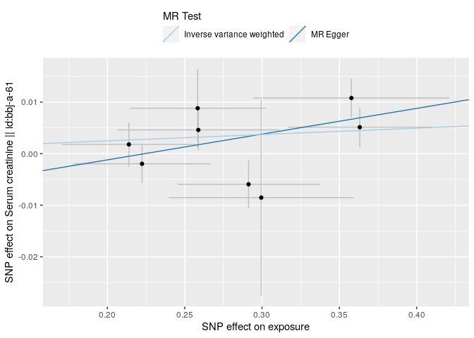

</div>

<div class="cell-output-display">

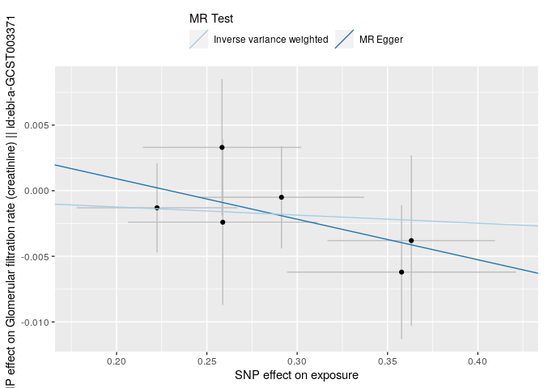

</div>

<div class="cell-output-display">

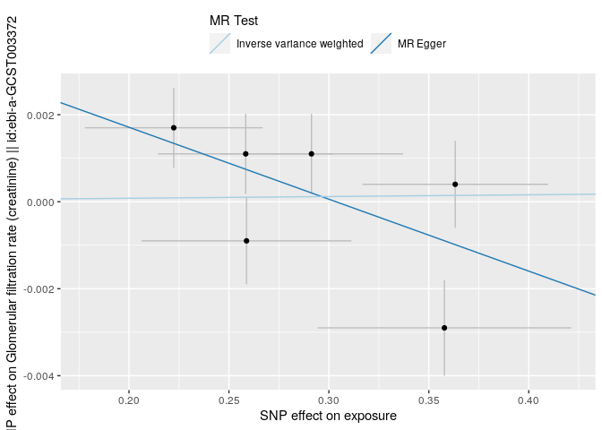

</div>

<div class="cell-output-display">

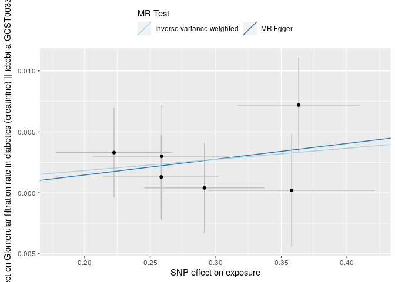

</div>

<div class="cell-output-display">

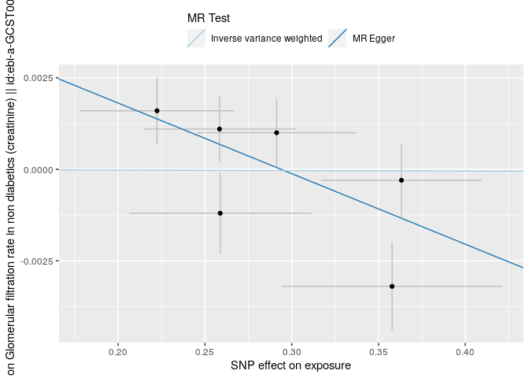

</div>

<div class="cell-output-display">

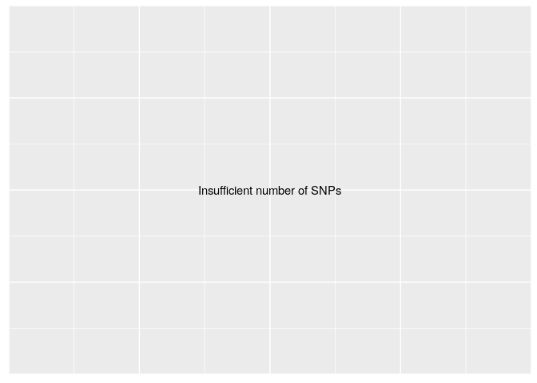

</div>

<div class="cell-output-display">

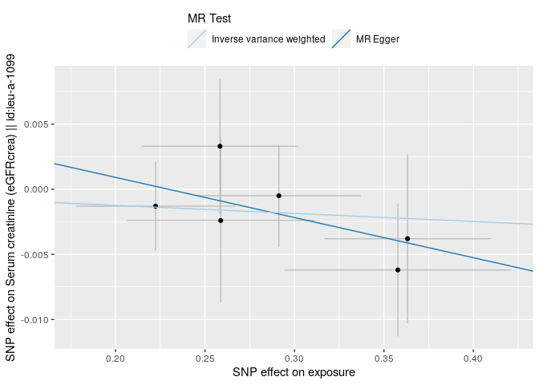

</div>

<div class="cell-output-display">

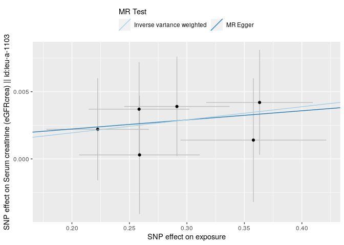

</div>

<div class="cell-output-display">

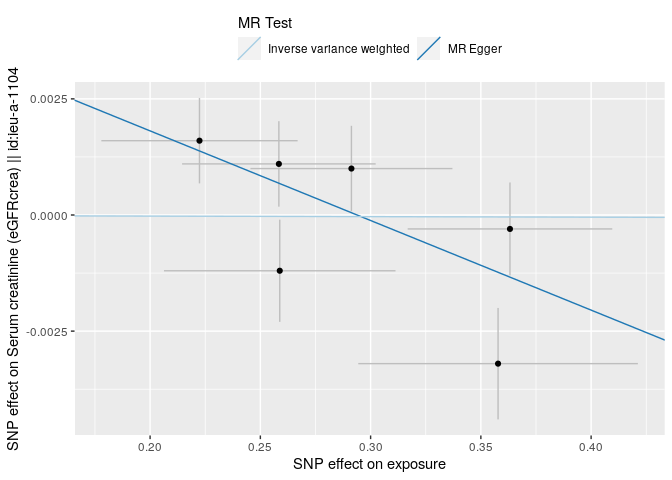

</div>

<div class="cell-output-display">


</div>

<div class="cell-output-display">

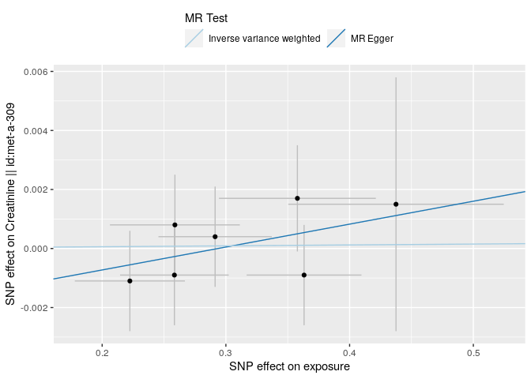

</div>

<div class="cell-output-display">

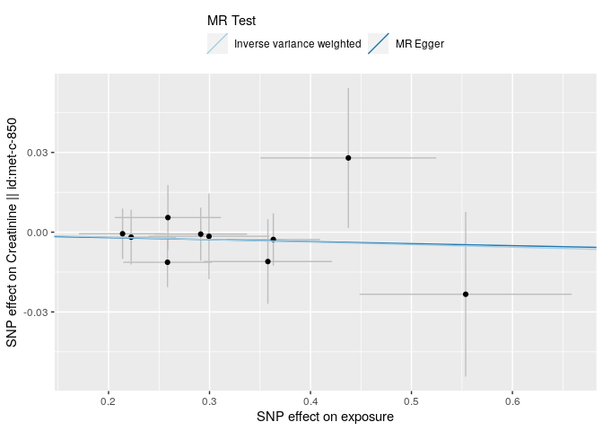

</div>

<div class="cell-output-display">

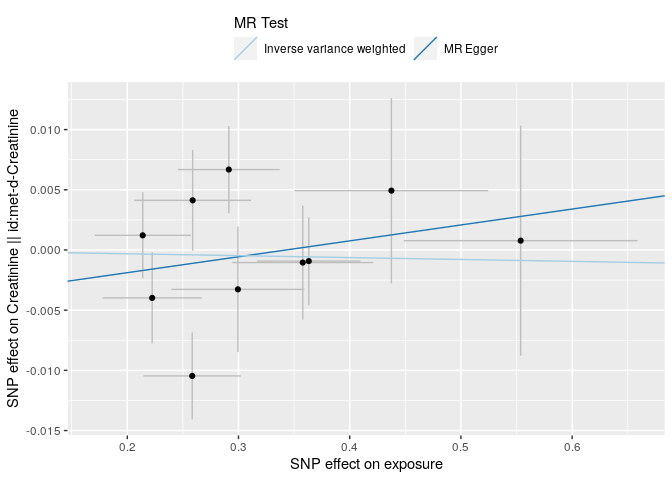

</div>

<div class="cell-output-display">

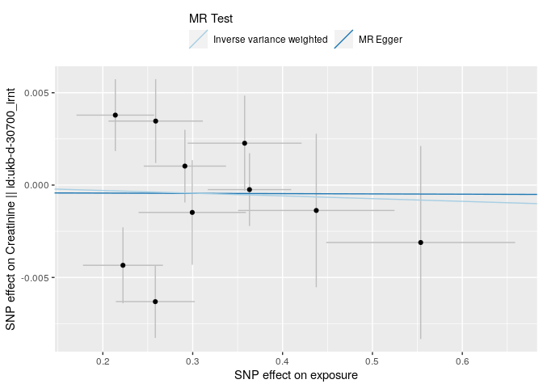

</div>

<div class="cell-output-display">

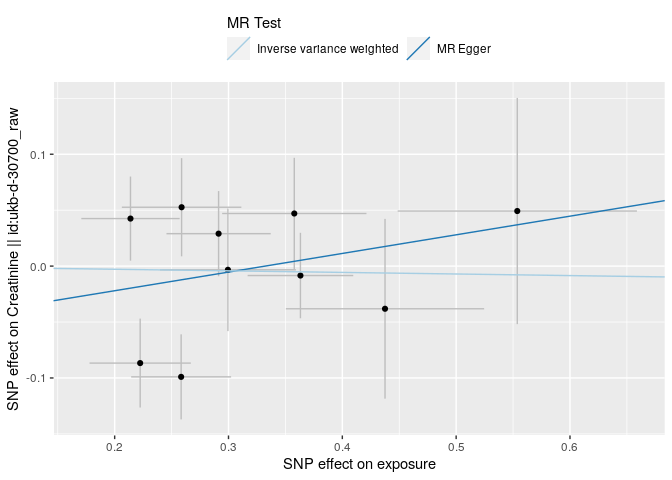

</div>

<div class="cell-output-display">

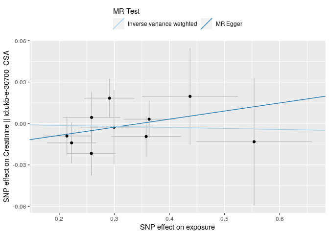

</div>

<div class="cell-output-display">

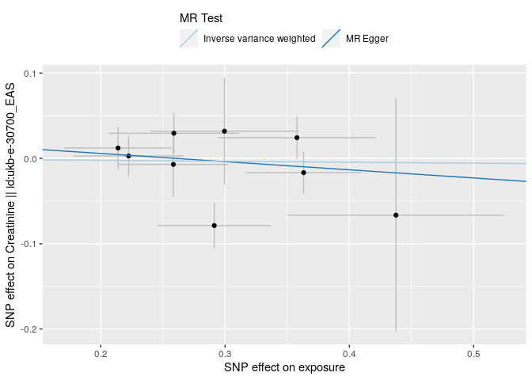

</div>

<div class="cell-output-display">

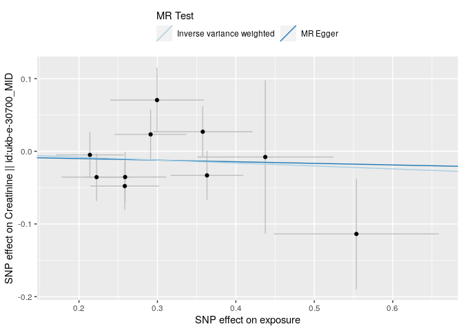

</div>

<div class="cell-output-display">

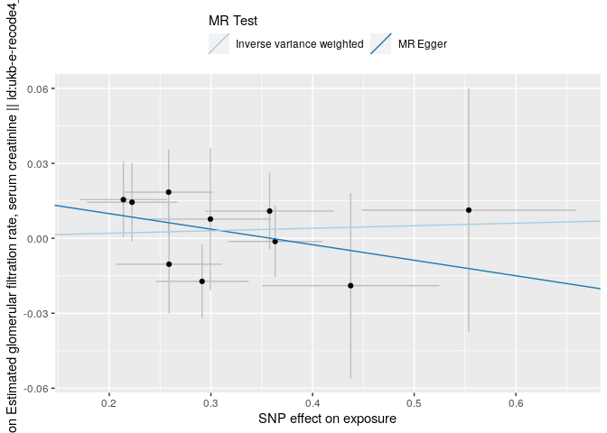

</div>

<div class="cell-output-display">

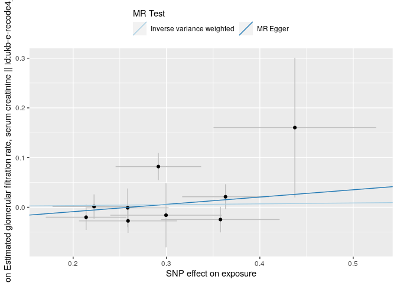

</div>

<div class="cell-output-display">

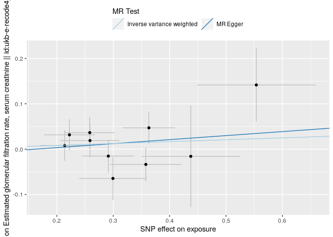

</div>

<div class="cell-output-display">

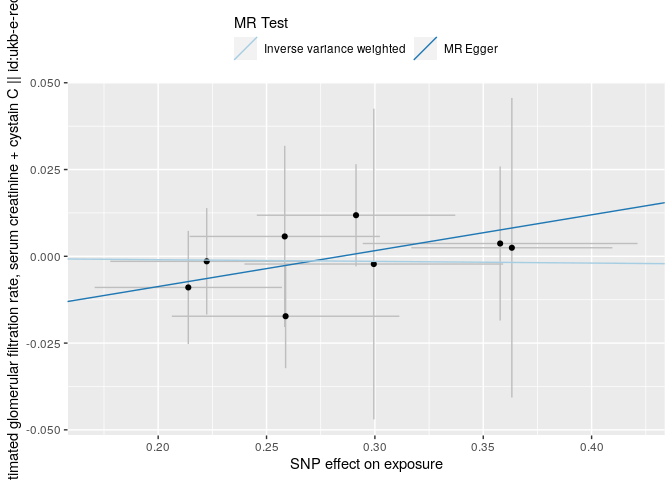

</div>

<div class="cell-output-display">

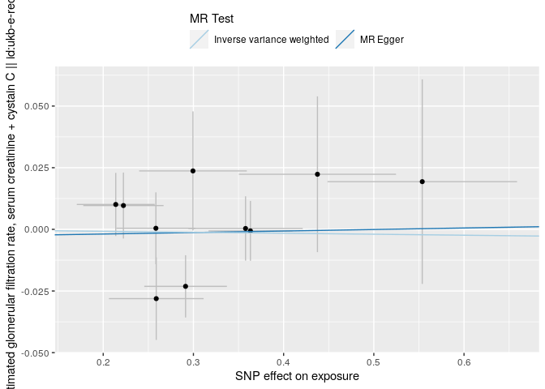

</div>

<div class="cell-output-display">


</div>

### MR for cystatin outcomes and 1e-06 threshold

    Extracting data for 10 SNP(s) from 9 GWAS(s)

    Finding proxies for 2 SNPs in outcome ukb-e-30720_AFR

    Extracting data for 2 SNP(s) from 1 GWAS(s)

    Finding proxies for 7 SNPs in outcome prot-c-2609_59_2

    Extracting data for 7 SNP(s) from 1 GWAS(s)

    Finding proxies for 1 SNPs in outcome ukb-e-30720_EAS

    Extracting data for 1 SNP(s) from 1 GWAS(s)

    Finding proxies for 6 SNPs in outcome ieu-a-1106

    Extracting data for 6 SNP(s) from 1 GWAS(s)

    Finding proxies for 6 SNPs in outcome ebi-a-GCST003375

    Extracting data for 6 SNP(s) from 1 GWAS(s)

    Harmonising exposure (dCtz8h) and Glomerular filtration rate (cystatin C) || id:ebi-a-GCST003375 (ebi-a-GCST003375)

    Harmonising exposure (dCtz8h) and Serum cystatin C (eGFRcys) || id:ieu-a-1106 (ieu-a-1106)

    Harmonising exposure (dCtz8h) and Cystatin C || id:prot-c-2609_59_2 (prot-c-2609_59_2)

    Harmonising exposure (dCtz8h) and Cystatin C || id:ukb-d-30720_irnt (ukb-d-30720_irnt)

    Harmonising exposure (dCtz8h) and Cystatin C || id:ukb-d-30720_raw (ukb-d-30720_raw)

    Harmonising exposure (dCtz8h) and Cystatin C || id:ukb-e-30720_AFR (ukb-e-30720_AFR)

    Harmonising exposure (dCtz8h) and Cystatin C || id:ukb-e-30720_CSA (ukb-e-30720_CSA)

    Harmonising exposure (dCtz8h) and Cystatin C || id:ukb-e-30720_EAS (ukb-e-30720_EAS)

    Harmonising exposure (dCtz8h) and Cystatin C || id:ukb-e-30720_MID (ukb-e-30720_MID)

    Analysing 'dCtz8h' on 'ebi-a-GCST003375'

    Analysing 'dCtz8h' on 'ieu-a-1106'

    Analysing 'dCtz8h' on 'prot-c-2609_59_2'

    Analysing 'dCtz8h' on 'ukb-d-30720_irnt'

    Analysing 'dCtz8h' on 'ukb-d-30720_raw'

    Analysing 'dCtz8h' on 'ukb-e-30720_AFR'

    Analysing 'dCtz8h' on 'ukb-e-30720_CSA'

    Analysing 'dCtz8h' on 'ukb-e-30720_EAS'

    Analysing 'dCtz8h' on 'ukb-e-30720_MID'

<div class="cell-output-display">

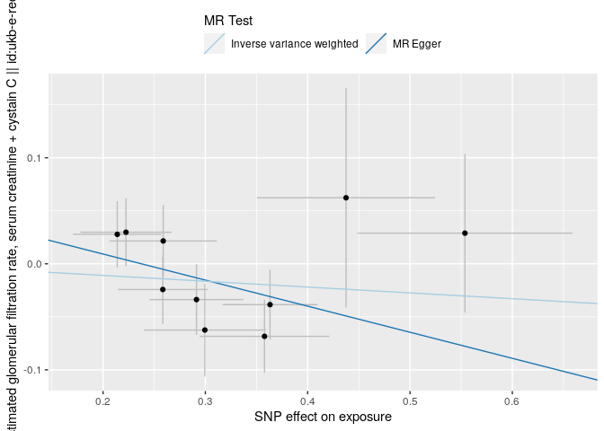

</div>

| id.exposure | id.outcome       | outcome                                                          | exposure | method                    | nsnp |          b |        se |      pval |
|:------------|:-----------------|:-----------------------------------------------------------------|:---------|:--------------------------|-----:|-----------:|----------:|----------:|
| dCtz8h      | ebi-a-GCST003375 | Glomerular filtration rate (cystatin C) \|\| id:ebi-a-GCST003375 | exposure | MR Egger                  |    6 | -0.0102715 | 0.0209548 | 0.6496807 |
| dCtz8h      | ebi-a-GCST003375 | Glomerular filtration rate (cystatin C) \|\| id:ebi-a-GCST003375 | exposure | Inverse variance weighted |    6 | -0.0005065 | 0.0033731 | 0.8806472 |
| dCtz8h      | ieu-a-1106       | Serum cystatin C (eGFRcys) \|\| id:ieu-a-1106                    | exposure | MR Egger                  |    6 | -0.0102715 | 0.0209548 | 0.6496807 |
| dCtz8h      | ieu-a-1106       | Serum cystatin C (eGFRcys) \|\| id:ieu-a-1106                    | exposure | Inverse variance weighted |    6 | -0.0005065 | 0.0033731 | 0.8806472 |
| dCtz8h      | prot-c-2609_59_2 | Cystatin C \|\| id:prot-c-2609_59_2                              | exposure | MR Egger                  |    6 | -0.3811137 | 0.5644642 | 0.5365802 |
| dCtz8h      | prot-c-2609_59_2 | Cystatin C \|\| id:prot-c-2609_59_2                              | exposure | Inverse variance weighted |    6 | -0.0091609 | 0.0941108 | 0.9224551 |
| dCtz8h      | ukb-d-30720_irnt | Cystatin C \|\| id:ukb-d-30720_irnt                              | exposure | MR Egger                  |   10 |  0.0191350 | 0.0186923 | 0.3359400 |
| dCtz8h      | ukb-d-30720_irnt | Cystatin C \|\| id:ukb-d-30720_irnt                              | exposure | Inverse variance weighted |   10 |  0.0013242 | 0.0043741 | 0.7620868 |
| dCtz8h      | ukb-d-30720_raw  | Cystatin C \|\| id:ukb-d-30720_raw                               | exposure | MR Egger                  |   10 |  0.0034374 | 0.0028112 | 0.2562191 |
| dCtz8h      | ukb-d-30720_raw  | Cystatin C \|\| id:ukb-d-30720_raw                               | exposure | Inverse variance weighted |   10 | -0.0000791 | 0.0006829 | 0.9077318 |
| dCtz8h      | ukb-e-30720_AFR  | Cystatin C \|\| id:ukb-e-30720_AFR                               | exposure | MR Egger                  |    8 | -0.1359232 | 0.1786155 | 0.4755016 |
| dCtz8h      | ukb-e-30720_AFR  | Cystatin C \|\| id:ukb-e-30720_AFR                               | exposure | Inverse variance weighted |    8 |  0.0027891 | 0.0301980 | 0.9264126 |
| dCtz8h      | ukb-e-30720_CSA  | Cystatin C \|\| id:ukb-e-30720_CSA                               | exposure | MR Egger                  |   10 | -0.0078977 | 0.0882685 | 0.9309050 |
| dCtz8h      | ukb-e-30720_CSA  | Cystatin C \|\| id:ukb-e-30720_CSA                               | exposure | Inverse variance weighted |   10 |  0.0034604 | 0.0188193 | 0.8541113 |
| dCtz8h      | ukb-e-30720_EAS  | Cystatin C \|\| id:ukb-e-30720_EAS                               | exposure | MR Egger                  |    9 |  0.0348597 | 0.1842157 | 0.8552799 |
| dCtz8h      | ukb-e-30720_EAS  | Cystatin C \|\| id:ukb-e-30720_EAS                               | exposure | Inverse variance weighted |    9 | -0.0593502 | 0.0353765 | 0.0934112 |
| dCtz8h      | ukb-e-30720_MID  | Cystatin C \|\| id:ukb-e-30720_MID                               | exposure | MR Egger                  |   10 |  0.3034197 | 0.2034669 | 0.1742350 |
| dCtz8h      | ukb-e-30720_MID  | Cystatin C \|\| id:ukb-e-30720_MID                               | exposure | Inverse variance weighted |   10 |  0.0656700 | 0.0490388 | 0.1805238 |

MR Egger and MR IVW for cystatin

| id.exposure | id.outcome       | outcome                                                          | exposure | method                    |         Q | Q_df |    Q_pval |
|:------------|:-----------------|:-----------------------------------------------------------------|:---------|:--------------------------|----------:|-----:|----------:|
| dCtz8h      | ebi-a-GCST003375 | Glomerular filtration rate (cystatin C) \|\| id:ebi-a-GCST003375 | exposure | MR Egger                  |  6.368350 |    4 | 0.1732767 |
| dCtz8h      | ebi-a-GCST003375 | Glomerular filtration rate (cystatin C) \|\| id:ebi-a-GCST003375 | exposure | Inverse variance weighted |  6.725029 |    5 | 0.2419065 |
| dCtz8h      | ieu-a-1106       | Serum cystatin C (eGFRcys) \|\| id:ieu-a-1106                    | exposure | MR Egger                  |  6.368350 |    4 | 0.1732767 |
| dCtz8h      | ieu-a-1106       | Serum cystatin C (eGFRcys) \|\| id:ieu-a-1106                    | exposure | Inverse variance weighted |  6.725029 |    5 | 0.2419065 |
| dCtz8h      | prot-c-2609_59_2 | Cystatin C \|\| id:prot-c-2609_59_2                              | exposure | MR Egger                  |  9.886757 |    4 | 0.0423791 |
| dCtz8h      | prot-c-2609_59_2 | Cystatin C \|\| id:prot-c-2609_59_2                              | exposure | Inverse variance weighted | 10.994613 |    5 | 0.0514869 |
| dCtz8h      | ukb-d-30720_irnt | Cystatin C \|\| id:ukb-d-30720_irnt                              | exposure | MR Egger                  | 19.815452 |    8 | 0.0110573 |
| dCtz8h      | ukb-d-30720_irnt | Cystatin C \|\| id:ukb-d-30720_irnt                              | exposure | Inverse variance weighted | 22.195149 |    9 | 0.0082806 |
| dCtz8h      | ukb-d-30720_raw  | Cystatin C \|\| id:ukb-d-30720_raw                               | exposure | MR Egger                  | 14.049098 |    8 | 0.0804946 |
| dCtz8h      | ukb-d-30720_raw  | Cystatin C \|\| id:ukb-d-30720_raw                               | exposure | Inverse variance weighted | 16.956974 |    9 | 0.0493940 |
| dCtz8h      | ukb-e-30720_AFR  | Cystatin C \|\| id:ukb-e-30720_AFR                               | exposure | MR Egger                  |  1.417774 |    6 | 0.9647683 |
| dCtz8h      | ukb-e-30720_AFR  | Cystatin C \|\| id:ukb-e-30720_AFR                               | exposure | Inverse variance weighted |  2.038623 |    7 | 0.9576717 |
| dCtz8h      | ukb-e-30720_CSA  | Cystatin C \|\| id:ukb-e-30720_CSA                               | exposure | MR Egger                  |  9.006794 |    8 | 0.3417232 |
| dCtz8h      | ukb-e-30720_CSA  | Cystatin C \|\| id:ukb-e-30720_CSA                               | exposure | Inverse variance weighted |  9.026438 |    9 | 0.4348373 |
| dCtz8h      | ukb-e-30720_EAS  | Cystatin C \|\| id:ukb-e-30720_EAS                               | exposure | MR Egger                  |  8.675600 |    7 | 0.2767931 |
| dCtz8h      | ukb-e-30720_EAS  | Cystatin C \|\| id:ukb-e-30720_EAS                               | exposure | Inverse variance weighted |  9.013452 |    8 | 0.3411624 |
| dCtz8h      | ukb-e-30720_MID  | Cystatin C \|\| id:ukb-e-30720_MID                               | exposure | MR Egger                  |  9.919298 |    8 | 0.2707359 |
| dCtz8h      | ukb-e-30720_MID  | Cystatin C \|\| id:ukb-e-30720_MID                               | exposure | Inverse variance weighted | 11.711439 |    9 | 0.2300701 |

Heterogeneity test for cystatin

| id.exposure | id.outcome       | outcome                                                          | exposure | egger_intercept |        se |      pval |
|:------------|:-----------------|:-----------------------------------------------------------------|:---------|----------------:|----------:|----------:|
| dCtz8h      | ebi-a-GCST003375 | Glomerular filtration rate (cystatin C) \|\| id:ebi-a-GCST003375 | exposure |       0.0028648 | 0.0060525 | 0.6606589 |
| dCtz8h      | ieu-a-1106       | Serum cystatin C (eGFRcys) \|\| id:ieu-a-1106                    | exposure |       0.0028648 | 0.0060525 | 0.6606589 |
| dCtz8h      | prot-c-2609_59_2 | Cystatin C \|\| id:prot-c-2609_59_2                              | exposure |       0.1115957 | 0.1666874 | 0.5398439 |
| dCtz8h      | ukb-d-30720_irnt | Cystatin C \|\| id:ukb-d-30720_irnt                              | exposure |      -0.0054488 | 0.0055590 | 0.3557075 |
| dCtz8h      | ukb-d-30720_raw  | Cystatin C \|\| id:ukb-d-30720_raw                               | exposure |      -0.0010758 | 0.0008360 | 0.2341498 |
| dCtz8h      | ukb-e-30720_AFR  | Cystatin C \|\| id:ukb-e-30720_AFR                               | exposure |       0.0376351 | 0.0477640 | 0.4607181 |
| dCtz8h      | ukb-e-30720_CSA  | Cystatin C \|\| id:ukb-e-30720_CSA                               | exposure |       0.0035042 | 0.0265284 | 0.8981740 |
| dCtz8h      | ukb-e-30720_EAS  | Cystatin C \|\| id:ukb-e-30720_EAS                               | exposure |      -0.0277648 | 0.0531780 | 0.6177030 |
| dCtz8h      | ukb-e-30720_MID  | Cystatin C \|\| id:ukb-e-30720_MID                               | exposure |      -0.0726628 | 0.0604396 | 0.2636462 |

Pleiotropy test for cystatin

### Plots for cystatin outcomes

<div class="cell-output-display">

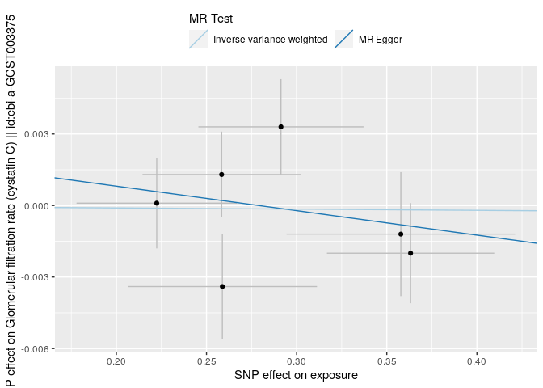

</div>

<div class="cell-output-display">

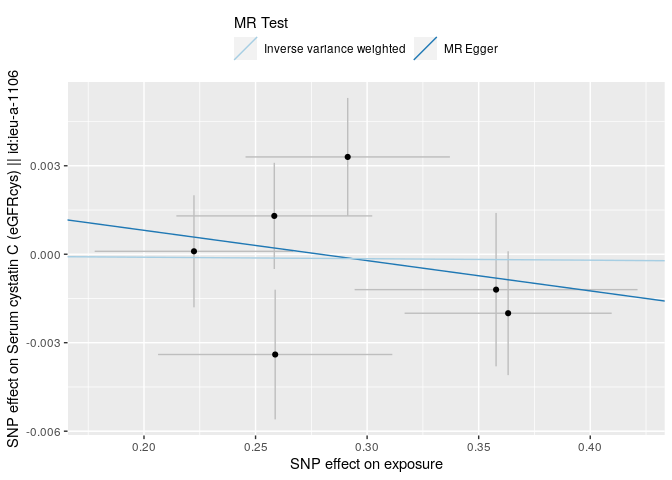

</div>

<div class="cell-output-display">


</div>

<div class="cell-output-display">

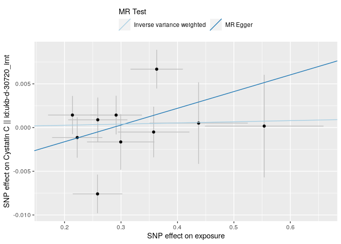

</div>

<div class="cell-output-display">

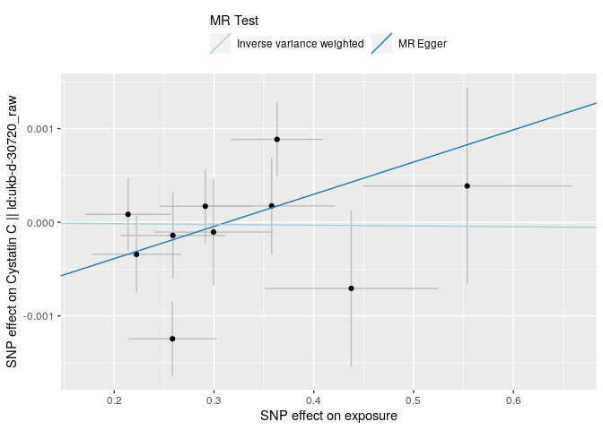

</div>

<div class="cell-output-display">

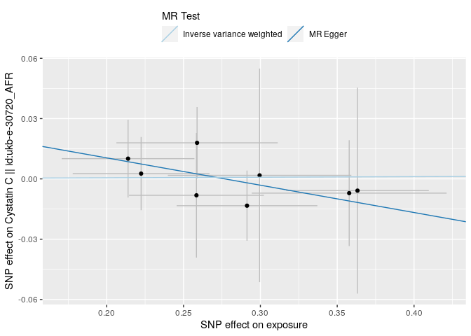

</div>

<div class="cell-output-display">

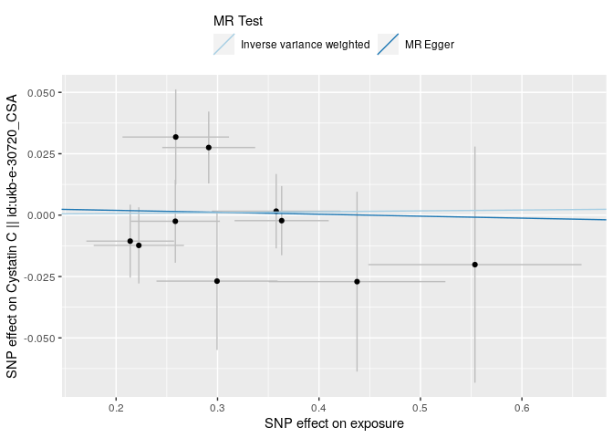

</div>

<div class="cell-output-display">

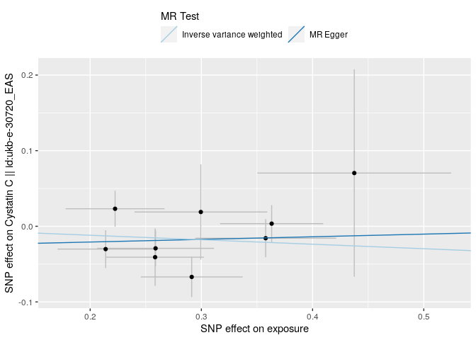

</div>

### MR for ckd outcomes and 1e-06 threshold

    Extracting data for 10 SNP(s) from 4 GWAS(s)

    Finding proxies for 6 SNPs in outcome ebi-a-GCST003374

    Extracting data for 6 SNP(s) from 1 GWAS(s)

    Finding proxies for 6 SNPs in outcome ieu-a-1102

    Extracting data for 6 SNP(s) from 1 GWAS(s)

    Harmonising exposure (dCtz8h) and Chronic kidney disease || id:ebi-a-GCST003374 (ebi-a-GCST003374)

    Harmonising exposure (dCtz8h) and Chronic kidney disease || id:ebi-a-GCST008026 (ebi-a-GCST008026)

    Harmonising exposure (dCtz8h) and Chronic kidney disease || id:finn-b-N14_CHRONKIDNEYDIS (finn-b-N14_CHRONKIDNEYDIS)

    Harmonising exposure (dCtz8h) and Chronic kidney disease || id:ieu-a-1102 (ieu-a-1102)

    Analysing 'dCtz8h' on 'ebi-a-GCST003374'

    Analysing 'dCtz8h' on 'ebi-a-GCST008026'

    Analysing 'dCtz8h' on 'finn-b-N14_CHRONKIDNEYDIS'

    Analysing 'dCtz8h' on 'ieu-a-1102'

<div class="cell-output-display">


</div>

| id.exposure | id.outcome                | outcome                                                  | exposure | method                    | nsnp |          b |        se |      pval |
|:------------|:--------------------------|:---------------------------------------------------------|:---------|:--------------------------|-----:|-----------:|----------:|----------:|
| dCtz8h      | ebi-a-GCST003374          | Chronic kidney disease \|\| id:ebi-a-GCST003374          | exposure | MR Egger                  |    6 |  0.2015762 | 0.1833087 | 0.3332176 |
| dCtz8h      | ebi-a-GCST003374          | Chronic kidney disease \|\| id:ebi-a-GCST003374          | exposure | Inverse variance weighted |    6 | -0.0174349 | 0.0330881 | 0.5982461 |
| dCtz8h      | ebi-a-GCST008026          | Chronic kidney disease \|\| id:ebi-a-GCST008026          | exposure | MR Egger                  |   10 |  0.3480330 | 0.1562425 | 0.0565154 |
| dCtz8h      | ebi-a-GCST008026          | Chronic kidney disease \|\| id:ebi-a-GCST008026          | exposure | Inverse variance weighted |   10 |  0.0110253 | 0.0339760 | 0.7455584 |
| dCtz8h      | finn-b-N14_CHRONKIDNEYDIS | Chronic kidney disease \|\| id:finn-b-N14_CHRONKIDNEYDIS | exposure | MR Egger                  |   10 | -0.1442641 | 0.1433502 | 0.3437007 |
| dCtz8h      | finn-b-N14_CHRONKIDNEYDIS | Chronic kidney disease \|\| id:finn-b-N14_CHRONKIDNEYDIS | exposure | Inverse variance weighted |   10 | -0.0672683 | 0.0327985 | 0.0402714 |
| dCtz8h      | ieu-a-1102                | Chronic kidney disease \|\| id:ieu-a-1102                | exposure | MR Egger                  |    6 |  0.2015762 | 0.1833087 | 0.3332176 |
| dCtz8h      | ieu-a-1102                | Chronic kidney disease \|\| id:ieu-a-1102                | exposure | Inverse variance weighted |    6 | -0.0174349 | 0.0330881 | 0.5982461 |

MR Egger and MR IVW for ckd

| id.exposure | id.outcome                | outcome                                                  | exposure | method                    |         Q | Q_df |    Q_pval |
|:------------|:--------------------------|:---------------------------------------------------------|:---------|:--------------------------|----------:|-----:|----------:|
| dCtz8h      | ebi-a-GCST003374          | Chronic kidney disease \|\| id:ebi-a-GCST003374          | exposure | MR Egger                  |  7.405151 |    4 | 0.1159652 |
| dCtz8h      | ebi-a-GCST003374          | Chronic kidney disease \|\| id:ebi-a-GCST003374          | exposure | Inverse variance weighted | 10.128906 |    5 | 0.0716641 |
| dCtz8h      | ebi-a-GCST008026          | Chronic kidney disease \|\| id:ebi-a-GCST008026          | exposure | MR Egger                  |  2.645165 |    8 | 0.9546177 |
| dCtz8h      | ebi-a-GCST008026          | Chronic kidney disease \|\| id:ebi-a-GCST008026          | exposure | Inverse variance weighted |  7.528531 |    9 | 0.5822647 |
| dCtz8h      | finn-b-N14_CHRONKIDNEYDIS | Chronic kidney disease \|\| id:finn-b-N14_CHRONKIDNEYDIS | exposure | MR Egger                  |  5.726122 |    8 | 0.6778792 |
| dCtz8h      | finn-b-N14_CHRONKIDNEYDIS | Chronic kidney disease \|\| id:finn-b-N14_CHRONKIDNEYDIS | exposure | Inverse variance weighted |  6.030554 |    9 | 0.7368565 |
| dCtz8h      | ieu-a-1102                | Chronic kidney disease \|\| id:ieu-a-1102                | exposure | MR Egger                  |  7.405151 |    4 | 0.1159652 |
| dCtz8h      | ieu-a-1102                | Chronic kidney disease \|\| id:ieu-a-1102                | exposure | Inverse variance weighted | 10.128906 |    5 | 0.0716641 |

Heterogeneity test for ckd

| id.exposure | id.outcome                | outcome                                                  | exposure | egger_intercept |        se |      pval |
|:------------|:--------------------------|:---------------------------------------------------------|:---------|----------------:|----------:|----------:|
| dCtz8h      | ebi-a-GCST003374          | Chronic kidney disease \|\| id:ebi-a-GCST003374          | exposure |      -0.0647158 | 0.0533536 | 0.2918767 |
| dCtz8h      | ebi-a-GCST008026          | Chronic kidney disease \|\| id:ebi-a-GCST008026          | exposure |      -0.0983777 | 0.0445181 | 0.0580961 |
| dCtz8h      | finn-b-N14_CHRONKIDNEYDIS | Chronic kidney disease \|\| id:finn-b-N14_CHRONKIDNEYDIS | exposure |       0.0230972 | 0.0418615 | 0.5961892 |
| dCtz8h      | ieu-a-1102                | Chronic kidney disease \|\| id:ieu-a-1102                | exposure |      -0.0647158 | 0.0533536 | 0.2918767 |

Pleiotropy test for ckd

### Plots for ckd outcomes

<div class="cell-output-display">


</div>

<div class="cell-output-display">


</div>

<div class="cell-output-display">


</div>

## MR for 1e-05 threshold

### MR for creatinine outcomes and 1e-05 threshold

    Extracting data for 32 SNP(s) from 27 GWAS(s)

    Finding proxies for 16 SNPs in outcome ebi-a-GCST003401

    Extracting data for 16 SNP(s) from 1 GWAS(s)

    Finding proxies for 5 SNPs in outcome ukb-e-30700_EAS

    Extracting data for 5 SNP(s) from 1 GWAS(s)

    Finding proxies for 19 SNPs in outcome ebi-a-GCST003371

    Extracting data for 19 SNP(s) from 1 GWAS(s)

    Finding proxies for 16 SNPs in outcome ebi-a-GCST003373

    Extracting data for 16 SNP(s) from 1 GWAS(s)

    Finding proxies for 2 SNPs in outcome ukb-e-recode6_CSA

    Extracting data for 2 SNP(s) from 1 GWAS(s)

    Finding proxies for 5 SNPs in outcome ukb-e-recode6_EAS

    Extracting data for 5 SNP(s) from 1 GWAS(s)

    Finding proxies for 9 SNPs in outcome ukb-e-recode6_AFR

    Extracting data for 9 SNP(s) from 1 GWAS(s)

    Finding proxies for 16 SNPs in outcome ebi-a-GCST003372

    Extracting data for 16 SNP(s) from 1 GWAS(s)

    Finding proxies for 16 SNPs in outcome ieu-a-1103

    Extracting data for 16 SNP(s) from 1 GWAS(s)

    Finding proxies for 2 SNPs in outcome ukb-e-30700_CSA

    Extracting data for 2 SNP(s) from 1 GWAS(s)

    Finding proxies for 16 SNPs in outcome ieu-a-1105

    Extracting data for 16 SNP(s) from 1 GWAS(s)

    Finding proxies for 27 SNPs in outcome ebi-a-GCST005066

    Extracting data for 27 SNP(s) from 1 GWAS(s)

    Finding proxies for 8 SNPs in outcome bbj-a-61

    Extracting data for 8 SNP(s) from 1 GWAS(s)

    Finding proxies for 16 SNPs in outcome ieu-a-1104

    Extracting data for 16 SNP(s) from 1 GWAS(s)

    Finding proxies for 5 SNPs in outcome ukb-e-recode4_EAS

    Extracting data for 5 SNP(s) from 1 GWAS(s)

    Finding proxies for 17 SNPs in outcome ieu-a-1099

    Extracting data for 17 SNP(s) from 1 GWAS(s)

    Finding proxies for 15 SNPs in outcome met-a-309

    Extracting data for 15 SNP(s) from 1 GWAS(s)

    Finding proxies for 2 SNPs in outcome ukb-e-recode4_CSA

    Extracting data for 2 SNP(s) from 1 GWAS(s)

    Finding proxies for 32 SNPs in outcome ukb-e-recode4_AFR

    Extracting data for 32 SNP(s) from 1 GWAS(s)

    Finding proxies for 32 SNPs in outcome ukb-e-30700_AFR

    Extracting data for 32 SNP(s) from 1 GWAS(s)

    Harmonising exposure (dCtz8h) and Serum creatinine || id:bbj-a-61 (bbj-a-61)

    Harmonising exposure (dCtz8h) and Glomerular filtration rate (creatinine) || id:ebi-a-GCST003371 (ebi-a-GCST003371)

    Harmonising exposure (dCtz8h) and Glomerular filtration rate (creatinine) || id:ebi-a-GCST003372 (ebi-a-GCST003372)

    Harmonising exposure (dCtz8h) and Glomerular filtration rate in diabetics (creatinine) || id:ebi-a-GCST003373 (ebi-a-GCST003373)

    Harmonising exposure (dCtz8h) and Glomerular filtration rate in non diabetics (creatinine) || id:ebi-a-GCST003401 (ebi-a-GCST003401)

    Harmonising exposure (dCtz8h) and Creatinine levels || id:ebi-a-GCST005066 (ebi-a-GCST005066)

    Removing the following SNPs for being palindromic with intermediate allele frequencies:
    rs72675157, rs72802873

    Harmonising exposure (dCtz8h) and Serum creatinine (eGFRcrea) || id:ieu-a-1099 (ieu-a-1099)

    Harmonising exposure (dCtz8h) and Serum creatinine (eGFRcrea) || id:ieu-a-1103 (ieu-a-1103)

    Harmonising exposure (dCtz8h) and Serum creatinine (eGFRcrea) || id:ieu-a-1104 (ieu-a-1104)

    Harmonising exposure (dCtz8h) and Serum creatinine (eGFRcrea) || id:ieu-a-1105 (ieu-a-1105)

    Harmonising exposure (dCtz8h) and Creatinine || id:met-a-309 (met-a-309)

    Harmonising exposure (dCtz8h) and Creatinine || id:met-c-850 (met-c-850)

    Harmonising exposure (dCtz8h) and Creatinine || id:met-d-Creatinine (met-d-Creatinine)

    Harmonising exposure (dCtz8h) and Creatinine || id:ukb-d-30700_irnt (ukb-d-30700_irnt)

    Harmonising exposure (dCtz8h) and Creatinine || id:ukb-d-30700_raw (ukb-d-30700_raw)

    Harmonising exposure (dCtz8h) and Creatinine || id:ukb-e-30700_CSA (ukb-e-30700_CSA)

    Harmonising exposure (dCtz8h) and Creatinine || id:ukb-e-30700_EAS (ukb-e-30700_EAS)

    Harmonising exposure (dCtz8h) and Creatinine || id:ukb-e-30700_MID (ukb-e-30700_MID)

    Harmonising exposure (dCtz8h) and Estimated glomerular filtration rate, serum creatinine || id:ukb-e-recode4_CSA (ukb-e-recode4_CSA)

    Harmonising exposure (dCtz8h) and Estimated glomerular filtration rate, serum creatinine || id:ukb-e-recode4_EAS (ukb-e-recode4_EAS)

    Harmonising exposure (dCtz8h) and Estimated glomerular filtration rate, serum creatinine || id:ukb-e-recode4_MID (ukb-e-recode4_MID)

    Harmonising exposure (dCtz8h) and Estimated glomerular filtration rate, serum creatinine + cystain C || id:ukb-e-recode6_AFR (ukb-e-recode6_AFR)

    Harmonising exposure (dCtz8h) and Estimated glomerular filtration rate, serum creatinine + cystain C || id:ukb-e-recode6_CSA (ukb-e-recode6_CSA)

    Harmonising exposure (dCtz8h) and Estimated glomerular filtration rate, serum creatinine + cystain C || id:ukb-e-recode6_EAS (ukb-e-recode6_EAS)

    Harmonising exposure (dCtz8h) and Estimated glomerular filtration rate, serum creatinine + cystain C || id:ukb-e-recode6_MID (ukb-e-recode6_MID)

    Analysing 'dCtz8h' on 'bbj-a-61'

    Analysing 'dCtz8h' on 'ebi-a-GCST003371'

    Analysing 'dCtz8h' on 'ebi-a-GCST003372'

    Analysing 'dCtz8h' on 'ebi-a-GCST003373'

    Analysing 'dCtz8h' on 'ebi-a-GCST003401'

    Analysing 'dCtz8h' on 'ebi-a-GCST005066'

    Analysing 'dCtz8h' on 'ieu-a-1099'

    Analysing 'dCtz8h' on 'ieu-a-1103'

    Analysing 'dCtz8h' on 'ieu-a-1104'

    Analysing 'dCtz8h' on 'ieu-a-1105'

    Analysing 'dCtz8h' on 'met-a-309'

    Analysing 'dCtz8h' on 'met-c-850'

    Analysing 'dCtz8h' on 'met-d-Creatinine'

    Analysing 'dCtz8h' on 'ukb-d-30700_irnt'

    Analysing 'dCtz8h' on 'ukb-d-30700_raw'

    Analysing 'dCtz8h' on 'ukb-e-30700_CSA'

    Analysing 'dCtz8h' on 'ukb-e-30700_EAS'

    Analysing 'dCtz8h' on 'ukb-e-30700_MID'

    Analysing 'dCtz8h' on 'ukb-e-recode4_CSA'

    Analysing 'dCtz8h' on 'ukb-e-recode4_EAS'

    Analysing 'dCtz8h' on 'ukb-e-recode4_MID'

    Analysing 'dCtz8h' on 'ukb-e-recode6_AFR'

    Analysing 'dCtz8h' on 'ukb-e-recode6_CSA'

    Analysing 'dCtz8h' on 'ukb-e-recode6_EAS'

    Analysing 'dCtz8h' on 'ukb-e-recode6_MID'

<div class="cell-output-display">

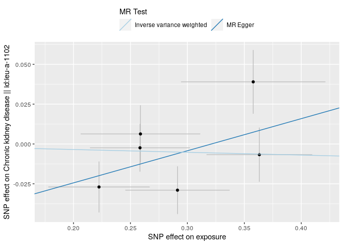

</div>

| id.exposure | id.outcome        | outcome                                                                                      | exposure | method                    | nsnp |          b |        se |      pval |
|:------------|:------------------|:---------------------------------------------------------------------------------------------|:---------|:--------------------------|-----:|-----------:|----------:|----------:|
| dCtz8h      | bbj-a-61          | Serum creatinine \|\| id:bbj-a-61                                                            | exposure | MR Egger                  |   25 |  0.0128537 | 0.0184256 | 0.4924182 |
| dCtz8h      | bbj-a-61          | Serum creatinine \|\| id:bbj-a-61                                                            | exposure | Inverse variance weighted |   25 |  0.0054835 | 0.0042422 | 0.1961481 |
| dCtz8h      | ebi-a-GCST003371  | Glomerular filtration rate (creatinine) \|\| id:ebi-a-GCST003371                             | exposure | MR Egger                  |   17 | -0.0264792 | 0.0198244 | 0.2015668 |
| dCtz8h      | ebi-a-GCST003371  | Glomerular filtration rate (creatinine) \|\| id:ebi-a-GCST003371                             | exposure | Inverse variance weighted |   17 | -0.0017984 | 0.0040301 | 0.6554312 |
| dCtz8h      | ebi-a-GCST003372  | Glomerular filtration rate (creatinine) \|\| id:ebi-a-GCST003372                             | exposure | MR Egger                  |   22 | -0.0022542 | 0.0038870 | 0.5684270 |
| dCtz8h      | ebi-a-GCST003372  | Glomerular filtration rate (creatinine) \|\| id:ebi-a-GCST003372                             | exposure | Inverse variance weighted |   22 |  0.0006485 | 0.0009328 | 0.4869557 |
| dCtz8h      | ebi-a-GCST003373  | Glomerular filtration rate in diabetics (creatinine) \|\| id:ebi-a-GCST003373                | exposure | MR Egger                  |   22 |  0.0175560 | 0.0147321 | 0.2473332 |
| dCtz8h      | ebi-a-GCST003373  | Glomerular filtration rate in diabetics (creatinine) \|\| id:ebi-a-GCST003373                | exposure | Inverse variance weighted |   22 |  0.0068345 | 0.0034873 | 0.0500159 |
| dCtz8h      | ebi-a-GCST003401  | Glomerular filtration rate in non diabetics (creatinine) \|\| id:ebi-a-GCST003401            | exposure | MR Egger                  |   22 | -0.0019845 | 0.0039097 | 0.6172937 |
| dCtz8h      | ebi-a-GCST003401  | Glomerular filtration rate in non diabetics (creatinine) \|\| id:ebi-a-GCST003401            | exposure | Inverse variance weighted |   22 |  0.0001475 | 0.0009389 | 0.8751233 |
| dCtz8h      | ebi-a-GCST005066  | Creatinine levels \|\| id:ebi-a-GCST005066                                                   | exposure | MR Egger                  |    5 | -0.0386598 | 0.0731864 | 0.6339163 |
| dCtz8h      | ebi-a-GCST005066  | Creatinine levels \|\| id:ebi-a-GCST005066                                                   | exposure | Inverse variance weighted |    5 | -0.0055446 | 0.0151699 | 0.7147382 |
| dCtz8h      | ieu-a-1099        | Serum creatinine (eGFRcrea) \|\| id:ieu-a-1099                                               | exposure | MR Egger                  |   18 | -0.0263980 | 0.0197804 | 0.2007044 |
| dCtz8h      | ieu-a-1099        | Serum creatinine (eGFRcrea) \|\| id:ieu-a-1099                                               | exposure | Inverse variance weighted |   18 | -0.0017349 | 0.0039704 | 0.6621391 |
| dCtz8h      | ieu-a-1103        | Serum creatinine (eGFRcrea) \|\| id:ieu-a-1103                                               | exposure | MR Egger                  |   22 |  0.0171054 | 0.0147631 | 0.2602445 |
| dCtz8h      | ieu-a-1103        | Serum creatinine (eGFRcrea) \|\| id:ieu-a-1103                                               | exposure | Inverse variance weighted |   22 |  0.0078838 | 0.0034976 | 0.0241907 |
| dCtz8h      | ieu-a-1104        | Serum creatinine (eGFRcrea) \|\| id:ieu-a-1104                                               | exposure | MR Egger                  |   22 | -0.0019225 | 0.0038506 | 0.6230295 |
| dCtz8h      | ieu-a-1104        | Serum creatinine (eGFRcrea) \|\| id:ieu-a-1104                                               | exposure | Inverse variance weighted |   22 |  0.0002100 | 0.0009273 | 0.8208003 |
| dCtz8h      | ieu-a-1105        | Serum creatinine (eGFRcrea) \|\| id:ieu-a-1105                                               | exposure | MR Egger                  |   22 | -0.0023269 | 0.0039031 | 0.5577498 |
| dCtz8h      | ieu-a-1105        | Serum creatinine (eGFRcrea) \|\| id:ieu-a-1105                                               | exposure | Inverse variance weighted |   22 |  0.0005969 | 0.0009319 | 0.5218064 |
| dCtz8h      | met-a-309         | Creatinine \|\| id:met-a-309                                                                 | exposure | MR Egger                  |   23 |  0.0044165 | 0.0058343 | 0.4574674 |
| dCtz8h      | met-a-309         | Creatinine \|\| id:met-a-309                                                                 | exposure | Inverse variance weighted |   23 |  0.0002016 | 0.0014342 | 0.8882386 |
| dCtz8h      | met-c-850         | Creatinine \|\| id:met-c-850                                                                 | exposure | MR Egger                  |   32 |  0.0157893 | 0.0264676 | 0.5552833 |
| dCtz8h      | met-c-850         | Creatinine \|\| id:met-c-850                                                                 | exposure | Inverse variance weighted |   32 |  0.0086967 | 0.0077450 | 0.2614854 |
| dCtz8h      | met-d-Creatinine  | Creatinine \|\| id:met-d-Creatinine                                                          | exposure | MR Egger                  |   32 | -0.0131280 | 0.0120110 | 0.2830949 |
| dCtz8h      | met-d-Creatinine  | Creatinine \|\| id:met-d-Creatinine                                                          | exposure | Inverse variance weighted |   32 | -0.0015599 | 0.0034603 | 0.6521399 |
| dCtz8h      | ukb-d-30700_irnt  | Creatinine \|\| id:ukb-d-30700_irnt                                                          | exposure | MR Egger                  |   32 | -0.0128036 | 0.0075095 | 0.0985357 |
| dCtz8h      | ukb-d-30700_irnt  | Creatinine \|\| id:ukb-d-30700_irnt                                                          | exposure | Inverse variance weighted |   32 |  0.0011776 | 0.0022465 | 0.6001364 |
| dCtz8h      | ukb-d-30700_raw   | Creatinine \|\| id:ukb-d-30700_raw                                                           | exposure | MR Egger                  |   32 | -0.2102256 | 0.1470066 | 0.1630380 |
| dCtz8h      | ukb-d-30700_raw   | Creatinine \|\| id:ukb-d-30700_raw                                                           | exposure | Inverse variance weighted |   32 |  0.0212036 | 0.0432709 | 0.6241201 |
| dCtz8h      | ukb-e-30700_CSA   | Creatinine \|\| id:ukb-e-30700_CSA                                                           | exposure | MR Egger                  |   31 | -0.0448662 | 0.0466442 | 0.3440608 |
| dCtz8h      | ukb-e-30700_CSA   | Creatinine \|\| id:ukb-e-30700_CSA                                                           | exposure | Inverse variance weighted |   31 |  0.0016166 | 0.0121353 | 0.8940236 |
| dCtz8h      | ukb-e-30700_EAS   | Creatinine \|\| id:ukb-e-30700_EAS                                                           | exposure | MR Egger                  |   28 |  0.0737186 | 0.0923397 | 0.4319045 |
| dCtz8h      | ukb-e-30700_EAS   | Creatinine \|\| id:ukb-e-30700_EAS                                                           | exposure | Inverse variance weighted |   28 |  0.0324147 | 0.0215917 | 0.1332893 |
| dCtz8h      | ukb-e-30700_MID   | Creatinine \|\| id:ukb-e-30700_MID                                                           | exposure | MR Egger                  |   32 | -0.1010045 | 0.0940365 | 0.2913419 |
| dCtz8h      | ukb-e-30700_MID   | Creatinine \|\| id:ukb-e-30700_MID                                                           | exposure | Inverse variance weighted |   32 |  0.0149530 | 0.0268029 | 0.5769230 |
| dCtz8h      | ukb-e-recode4_CSA | Estimated glomerular filtration rate, serum creatinine \|\| id:ukb-e-recode4_CSA             | exposure | MR Egger                  |   31 |  0.0359981 | 0.0514303 | 0.4895422 |
| dCtz8h      | ukb-e-recode4_CSA | Estimated glomerular filtration rate, serum creatinine \|\| id:ukb-e-recode4_CSA             | exposure | Inverse variance weighted |   31 | -0.0005135 | 0.0132619 | 0.9691129 |
| dCtz8h      | ukb-e-recode4_EAS | Estimated glomerular filtration rate, serum creatinine \|\| id:ukb-e-recode4_EAS             | exposure | MR Egger                  |   28 | -0.0732097 | 0.0948043 | 0.4469476 |
| dCtz8h      | ukb-e-recode4_EAS | Estimated glomerular filtration rate, serum creatinine \|\| id:ukb-e-recode4_EAS             | exposure | Inverse variance weighted |   28 | -0.0333392 | 0.0221598 | 0.1324543 |
| dCtz8h      | ukb-e-recode4_MID | Estimated glomerular filtration rate, serum creatinine \|\| id:ukb-e-recode4_MID             | exposure | MR Egger                  |   32 |  0.0886423 | 0.1025355 | 0.3941713 |
| dCtz8h      | ukb-e-recode4_MID | Estimated glomerular filtration rate, serum creatinine \|\| id:ukb-e-recode4_MID             | exposure | Inverse variance weighted |   32 | -0.0200701 | 0.0290142 | 0.4891048 |
| dCtz8h      | ukb-e-recode6_AFR | Estimated glomerular filtration rate, serum creatinine + cystain C \|\| id:ukb-e-recode6_AFR | exposure | MR Egger                  |   26 |  0.0236646 | 0.0800836 | 0.7701544 |
| dCtz8h      | ukb-e-recode6_AFR | Estimated glomerular filtration rate, serum creatinine + cystain C \|\| id:ukb-e-recode6_AFR | exposure | Inverse variance weighted |   26 | -0.0179155 | 0.0161376 | 0.2669261 |
| dCtz8h      | ukb-e-recode6_CSA | Estimated glomerular filtration rate, serum creatinine + cystain C \|\| id:ukb-e-recode6_CSA | exposure | MR Egger                  |   31 |  0.0282916 | 0.0396871 | 0.4816259 |
| dCtz8h      | ukb-e-recode6_CSA | Estimated glomerular filtration rate, serum creatinine + cystain C \|\| id:ukb-e-recode6_CSA | exposure | Inverse variance weighted |   31 |  0.0052903 | 0.0103115 | 0.6079163 |
| dCtz8h      | ukb-e-recode6_EAS | Estimated glomerular filtration rate, serum creatinine + cystain C \|\| id:ukb-e-recode6_EAS | exposure | MR Egger                  |   28 | -0.0797180 | 0.0902880 | 0.3853654 |
| dCtz8h      | ukb-e-recode6_EAS | Estimated glomerular filtration rate, serum creatinine + cystain C \|\| id:ukb-e-recode6_EAS | exposure | Inverse variance weighted |   28 | -0.0068753 | 0.0213090 | 0.7469626 |
| dCtz8h      | ukb-e-recode6_MID | Estimated glomerular filtration rate, serum creatinine + cystain C \|\| id:ukb-e-recode6_MID | exposure | MR Egger                  |   32 | -0.1443502 | 0.0937049 | 0.1339273 |
| dCtz8h      | ukb-e-recode6_MID | Estimated glomerular filtration rate, serum creatinine + cystain C \|\| id:ukb-e-recode6_MID | exposure | Inverse variance weighted |   32 | -0.0348145 | 0.0266288 | 0.1910775 |

MR Egger and MR IVW for creatinine

| id.exposure | id.outcome        | outcome                                                                                      | exposure | method                    |         Q | Q_df |    Q_pval |
|:------------|:------------------|:---------------------------------------------------------------------------------------------|:---------|:--------------------------|----------:|-----:|----------:|
| dCtz8h      | bbj-a-61          | Serum creatinine \|\| id:bbj-a-61                                                            | exposure | MR Egger                  | 41.761353 |   23 | 0.0096773 |
| dCtz8h      | bbj-a-61          | Serum creatinine \|\| id:bbj-a-61                                                            | exposure | Inverse variance weighted | 42.068745 |   24 | 0.0126779 |
| dCtz8h      | ebi-a-GCST003371  | Glomerular filtration rate (creatinine) \|\| id:ebi-a-GCST003371                             | exposure | MR Egger                  | 10.334852 |   15 | 0.7981650 |
| dCtz8h      | ebi-a-GCST003371  | Glomerular filtration rate (creatinine) \|\| id:ebi-a-GCST003371                             | exposure | Inverse variance weighted | 11.951617 |   16 | 0.7473036 |
| dCtz8h      | ebi-a-GCST003372  | Glomerular filtration rate (creatinine) \|\| id:ebi-a-GCST003372                             | exposure | MR Egger                  | 25.015036 |   20 | 0.2008565 |
| dCtz8h      | ebi-a-GCST003372  | Glomerular filtration rate (creatinine) \|\| id:ebi-a-GCST003372                             | exposure | Inverse variance weighted | 25.756071 |   21 | 0.2159031 |
| dCtz8h      | ebi-a-GCST003373  | Glomerular filtration rate in diabetics (creatinine) \|\| id:ebi-a-GCST003373                | exposure | MR Egger                  | 16.978583 |   20 | 0.6543639 |
| dCtz8h      | ebi-a-GCST003373  | Glomerular filtration rate in diabetics (creatinine) \|\| id:ebi-a-GCST003373                | exposure | Inverse variance weighted | 17.539673 |   21 | 0.6779194 |
| dCtz8h      | ebi-a-GCST003401  | Glomerular filtration rate in non diabetics (creatinine) \|\| id:ebi-a-GCST003401            | exposure | MR Egger                  | 23.929181 |   20 | 0.2454994 |
| dCtz8h      | ebi-a-GCST003401  | Glomerular filtration rate in non diabetics (creatinine) \|\| id:ebi-a-GCST003401            | exposure | Inverse variance weighted | 24.307540 |   21 | 0.2783972 |
| dCtz8h      | ebi-a-GCST005066  | Creatinine levels \|\| id:ebi-a-GCST005066                                                   | exposure | MR Egger                  |  7.705743 |    3 | 0.0525012 |
| dCtz8h      | ebi-a-GCST005066  | Creatinine levels \|\| id:ebi-a-GCST005066                                                   | exposure | Inverse variance weighted |  8.261309 |    4 | 0.0824617 |
| dCtz8h      | ieu-a-1099        | Serum creatinine (eGFRcrea) \|\| id:ieu-a-1099                                               | exposure | MR Egger                  | 10.339615 |   16 | 0.8483013 |
| dCtz8h      | ieu-a-1099        | Serum creatinine (eGFRcrea) \|\| id:ieu-a-1099                                               | exposure | Inverse variance weighted | 11.959505 |   17 | 0.8025831 |
| dCtz8h      | ieu-a-1103        | Serum creatinine (eGFRcrea) \|\| id:ieu-a-1103                                               | exposure | MR Egger                  | 11.360839 |   20 | 0.9363227 |
| dCtz8h      | ieu-a-1103        | Serum creatinine (eGFRcrea) \|\| id:ieu-a-1103                                               | exposure | Inverse variance weighted | 11.774211 |   21 | 0.9455136 |
| dCtz8h      | ieu-a-1104        | Serum creatinine (eGFRcrea) \|\| id:ieu-a-1104                                               | exposure | MR Egger                  | 23.158743 |   20 | 0.2810673 |
| dCtz8h      | ieu-a-1104        | Serum creatinine (eGFRcrea) \|\| id:ieu-a-1104                                               | exposure | Inverse variance weighted | 23.536547 |   21 | 0.3160513 |
| dCtz8h      | ieu-a-1105        | Serum creatinine (eGFRcrea) \|\| id:ieu-a-1105                                               | exposure | MR Egger                  | 25.260152 |   20 | 0.1916590 |
| dCtz8h      | ieu-a-1105        | Serum creatinine (eGFRcrea) \|\| id:ieu-a-1105                                               | exposure | Inverse variance weighted | 26.012639 |   21 | 0.2059675 |
| dCtz8h      | met-a-309         | Creatinine \|\| id:met-a-309                                                                 | exposure | MR Egger                  | 13.007827 |   21 | 0.9083496 |
| dCtz8h      | met-a-309         | Creatinine \|\| id:met-a-309                                                                 | exposure | Inverse variance weighted | 13.563315 |   22 | 0.9162510 |
| dCtz8h      | met-c-850         | Creatinine \|\| id:met-c-850                                                                 | exposure | MR Egger                  | 25.617622 |   30 | 0.6944968 |
| dCtz8h      | met-c-850         | Creatinine \|\| id:met-c-850                                                                 | exposure | Inverse variance weighted | 25.696154 |   31 | 0.7357516 |
| dCtz8h      | met-d-Creatinine  | Creatinine \|\| id:met-d-Creatinine                                                          | exposure | MR Egger                  | 43.637094 |   30 | 0.0514266 |
| dCtz8h      | met-d-Creatinine  | Creatinine \|\| id:met-d-Creatinine                                                          | exposure | Inverse variance weighted | 45.108442 |   31 | 0.0487532 |
| dCtz8h      | ukb-d-30700_irnt  | Creatinine \|\| id:ukb-d-30700_irnt                                                          | exposure | MR Egger                  | 57.003687 |   30 | 0.0020899 |
| dCtz8h      | ukb-d-30700_irnt  | Creatinine \|\| id:ukb-d-30700_irnt                                                          | exposure | Inverse variance weighted | 64.179393 |   31 | 0.0004220 |
| dCtz8h      | ukb-d-30700_raw   | Creatinine \|\| id:ukb-d-30700_raw                                                           | exposure | MR Egger                  | 58.359276 |   30 | 0.0014480 |
| dCtz8h      | ukb-d-30700_raw   | Creatinine \|\| id:ukb-d-30700_raw                                                           | exposure | Inverse variance weighted | 63.611853 |   31 | 0.0004958 |
| dCtz8h      | ukb-e-30700_CSA   | Creatinine \|\| id:ukb-e-30700_CSA                                                           | exposure | MR Egger                  | 32.424977 |   29 | 0.3015326 |
| dCtz8h      | ukb-e-30700_CSA   | Creatinine \|\| id:ukb-e-30700_CSA                                                           | exposure | Inverse variance weighted | 33.615786 |   30 | 0.2964522 |
| dCtz8h      | ukb-e-30700_EAS   | Creatinine \|\| id:ukb-e-30700_EAS                                                           | exposure | MR Egger                  | 29.850995 |   26 | 0.2738302 |
| dCtz8h      | ukb-e-30700_EAS   | Creatinine \|\| id:ukb-e-30700_EAS                                                           | exposure | Inverse variance weighted | 30.094420 |   27 | 0.3099280 |
| dCtz8h      | ukb-e-30700_MID   | Creatinine \|\| id:ukb-e-30700_MID                                                           | exposure | MR Egger                  | 30.656729 |   30 | 0.4324195 |
| dCtz8h      | ukb-e-30700_MID   | Creatinine \|\| id:ukb-e-30700_MID                                                           | exposure | Inverse variance weighted | 32.344903 |   31 | 0.4001775 |
| dCtz8h      | ukb-e-recode4_CSA | Estimated glomerular filtration rate, serum creatinine \|\| id:ukb-e-recode4_CSA             | exposure | MR Egger                  | 35.296114 |   29 | 0.1949805 |
| dCtz8h      | ukb-e-recode4_CSA | Estimated glomerular filtration rate, serum creatinine \|\| id:ukb-e-recode4_CSA             | exposure | Inverse variance weighted | 35.953949 |   30 | 0.2095889 |
| dCtz8h      | ukb-e-recode4_EAS | Estimated glomerular filtration rate, serum creatinine \|\| id:ukb-e-recode4_EAS             | exposure | MR Egger                  | 29.897120 |   26 | 0.2718952 |
| dCtz8h      | ukb-e-recode4_EAS | Estimated glomerular filtration rate, serum creatinine \|\| id:ukb-e-recode4_EAS             | exposure | Inverse variance weighted | 30.112638 |   27 | 0.3091166 |
| dCtz8h      | ukb-e-recode4_MID | Estimated glomerular filtration rate, serum creatinine \|\| id:ukb-e-recode4_MID             | exposure | MR Egger                  | 32.423684 |   30 | 0.3480890 |
| dCtz8h      | ukb-e-recode4_MID | Estimated glomerular filtration rate, serum creatinine \|\| id:ukb-e-recode4_MID             | exposure | Inverse variance weighted | 33.743546 |   31 | 0.3362051 |
| dCtz8h      | ukb-e-recode6_AFR | Estimated glomerular filtration rate, serum creatinine + cystain C \|\| id:ukb-e-recode6_AFR | exposure | MR Egger                  | 21.154249 |   24 | 0.6296097 |
| dCtz8h      | ukb-e-recode6_AFR | Estimated glomerular filtration rate, serum creatinine + cystain C \|\| id:ukb-e-recode6_AFR | exposure | Inverse variance weighted | 21.435237 |   25 | 0.6681072 |
| dCtz8h      | ukb-e-recode6_CSA | Estimated glomerular filtration rate, serum creatinine + cystain C \|\| id:ukb-e-recode6_CSA | exposure | MR Egger                  | 28.955506 |   29 | 0.4673854 |
| dCtz8h      | ukb-e-recode6_CSA | Estimated glomerular filtration rate, serum creatinine + cystain C \|\| id:ukb-e-recode6_CSA | exposure | Inverse variance weighted | 29.315718 |   30 | 0.5010602 |
| dCtz8h      | ukb-e-recode6_EAS | Estimated glomerular filtration rate, serum creatinine + cystain C \|\| id:ukb-e-recode6_EAS | exposure | MR Egger                  | 40.563635 |   26 | 0.0343164 |
| dCtz8h      | ukb-e-recode6_EAS | Estimated glomerular filtration rate, serum creatinine + cystain C \|\| id:ukb-e-recode6_EAS | exposure | Inverse variance weighted | 41.639762 |   27 | 0.0357068 |
| dCtz8h      | ukb-e-recode6_MID | Estimated glomerular filtration rate, serum creatinine + cystain C \|\| id:ukb-e-recode6_MID | exposure | MR Egger                  | 31.663441 |   30 | 0.3833418 |
| dCtz8h      | ukb-e-recode6_MID | Estimated glomerular filtration rate, serum creatinine + cystain C \|\| id:ukb-e-recode6_MID | exposure | Inverse variance weighted | 33.230215 |   31 | 0.3590430 |

Heterogeneity test for creatinine

| id.exposure | id.outcome        | outcome                                                                                      | exposure | egger_intercept |        se |      pval |
|:------------|:------------------|:---------------------------------------------------------------------------------------------|:---------|----------------:|----------:|----------:|
| dCtz8h      | bbj-a-61          | Serum creatinine \|\| id:bbj-a-61                                                            | exposure |      -0.0021559 | 0.0052398 | 0.6845480 |
| dCtz8h      | ebi-a-GCST003371  | Glomerular filtration rate (creatinine) \|\| id:ebi-a-GCST003371                             | exposure |       0.0066409 | 0.0052228 | 0.2229061 |
| dCtz8h      | ebi-a-GCST003372  | Glomerular filtration rate (creatinine) \|\| id:ebi-a-GCST003372                             | exposure |       0.0008350 | 0.0010848 | 0.4504611 |
| dCtz8h      | ebi-a-GCST003373  | Glomerular filtration rate in diabetics (creatinine) \|\| id:ebi-a-GCST003373                | exposure |      -0.0030493 | 0.0040709 | 0.4625408 |
| dCtz8h      | ebi-a-GCST003401  | Glomerular filtration rate in non diabetics (creatinine) \|\| id:ebi-a-GCST003401            | exposure |       0.0006135 | 0.0010910 | 0.5801299 |
| dCtz8h      | ebi-a-GCST005066  | Creatinine levels \|\| id:ebi-a-GCST005066                                                   | exposure |       0.0110358 | 0.0237292 | 0.6735569 |
| dCtz8h      | ieu-a-1099        | Serum creatinine (eGFRcrea) \|\| id:ieu-a-1099                                               | exposure |       0.0066297 | 0.0052090 | 0.2212913 |
| dCtz8h      | ieu-a-1103        | Serum creatinine (eGFRcrea) \|\| id:ieu-a-1103                                               | exposure |      -0.0026230 | 0.0040797 | 0.5275662 |
| dCtz8h      | ieu-a-1104        | Serum creatinine (eGFRcrea) \|\| id:ieu-a-1104                                               | exposure |       0.0006133 | 0.0010737 | 0.5742253 |
| dCtz8h      | ieu-a-1105        | Serum creatinine (eGFRcrea) \|\| id:ieu-a-1105                                               | exposure |       0.0008405 | 0.0010890 | 0.4492140 |
| dCtz8h      | met-a-309         | Creatinine \|\| id:met-a-309                                                                 | exposure |      -0.0012330 | 0.0016544 | 0.4643446 |
| dCtz8h      | met-c-850         | Creatinine \|\| id:met-c-850                                                                 | exposure |      -0.0021279 | 0.0075933 | 0.7812202 |
| dCtz8h      | met-d-Creatinine  | Creatinine \|\| id:met-d-Creatinine                                                          | exposure |       0.0034709 | 0.0034511 | 0.3225791 |
| dCtz8h      | ukb-d-30700_irnt  | Creatinine \|\| id:ukb-d-30700_irnt                                                          | exposure |       0.0041890 | 0.0021556 | 0.0614136 |
| dCtz8h      | ukb-d-30700_raw   | Creatinine \|\| id:ukb-d-30700_raw                                                           | exposure |       0.0693400 | 0.0421980 | 0.1107821 |
| dCtz8h      | ukb-e-30700_CSA   | Creatinine \|\| id:ukb-e-30700_CSA                                                           | exposure |       0.0136187 | 0.0131964 | 0.3106018 |
| dCtz8h      | ukb-e-30700_EAS   | Creatinine \|\| id:ukb-e-30700_EAS                                                           | exposure |      -0.0119225 | 0.0258926 | 0.6490155 |
| dCtz8h      | ukb-e-30700_MID   | Creatinine \|\| id:ukb-e-30700_MID                                                           | exposure |       0.0344001 | 0.0267642 | 0.2085200 |
| dCtz8h      | ukb-e-recode4_CSA | Estimated glomerular filtration rate, serum creatinine \|\| id:ukb-e-recode4_CSA             | exposure |      -0.0106973 | 0.0145506 | 0.4681338 |
| dCtz8h      | ukb-e-recode4_EAS | Estimated glomerular filtration rate, serum creatinine \|\| id:ukb-e-recode4_EAS             | exposure |       0.0115087 | 0.0265835 | 0.6686389 |
| dCtz8h      | ukb-e-recode4_MID | Estimated glomerular filtration rate, serum creatinine \|\| id:ukb-e-recode4_MID             | exposure |      -0.0322413 | 0.0291755 | 0.2779092 |
| dCtz8h      | ukb-e-recode6_AFR | Estimated glomerular filtration rate, serum creatinine + cystain C \|\| id:ukb-e-recode6_AFR | exposure |      -0.0110999 | 0.0209399 | 0.6009250 |
| dCtz8h      | ukb-e-recode6_CSA | Estimated glomerular filtration rate, serum creatinine + cystain C \|\| id:ukb-e-recode6_CSA | exposure |      -0.0067386 | 0.0112277 | 0.5530499 |
| dCtz8h      | ukb-e-recode6_EAS | Estimated glomerular filtration rate, serum creatinine + cystain C \|\| id:ukb-e-recode6_EAS | exposure |       0.0210282 | 0.0253194 | 0.4138066 |
| dCtz8h      | ukb-e-recode6_MID | Estimated glomerular filtration rate, serum creatinine + cystain C \|\| id:ukb-e-recode6_MID | exposure |       0.0324873 | 0.0266643 | 0.2325727 |

Pleiotropy test for creatinine

### Plots for creatinine outcomes

<div class="cell-output-display">

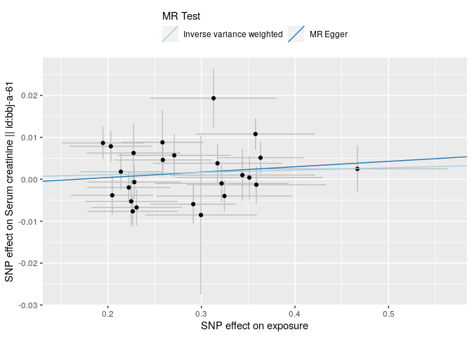

</div>

<div class="cell-output-display">

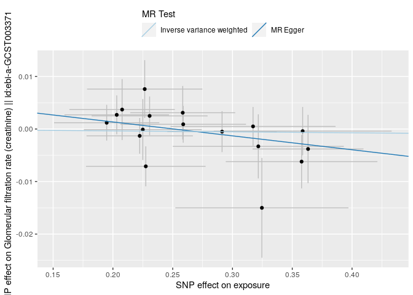

</div>

<div class="cell-output-display">

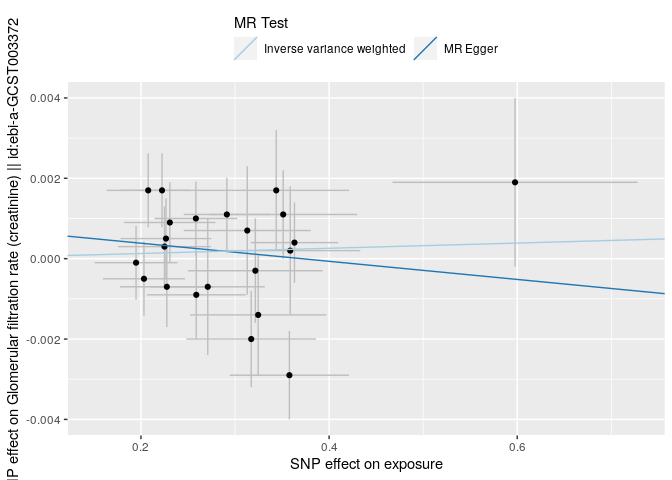

</div>

<div class="cell-output-display">

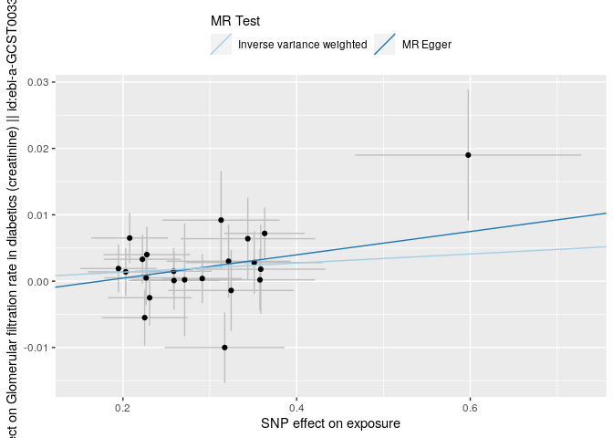

</div>

<div class="cell-output-display">

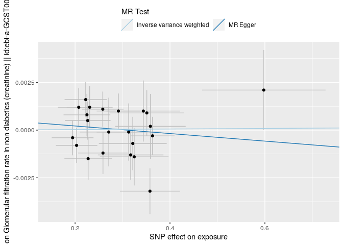

</div>

<div class="cell-output-display">

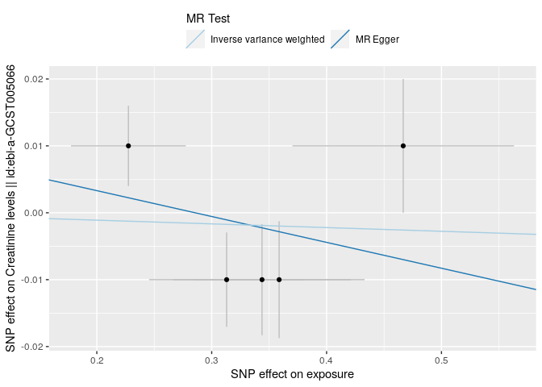

</div>

<div class="cell-output-display">

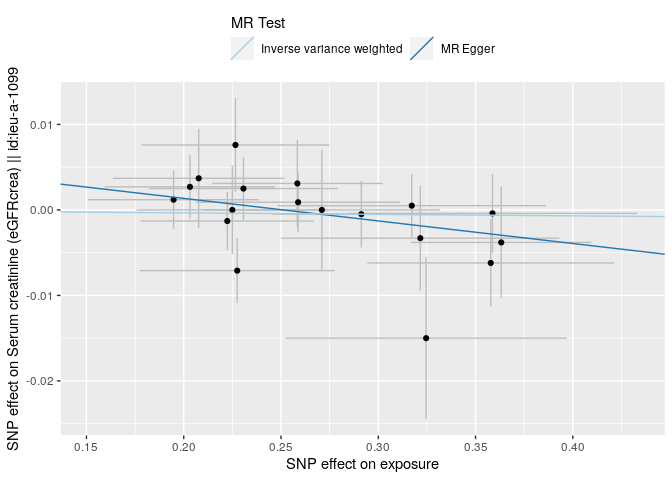

</div>

<div class="cell-output-display">

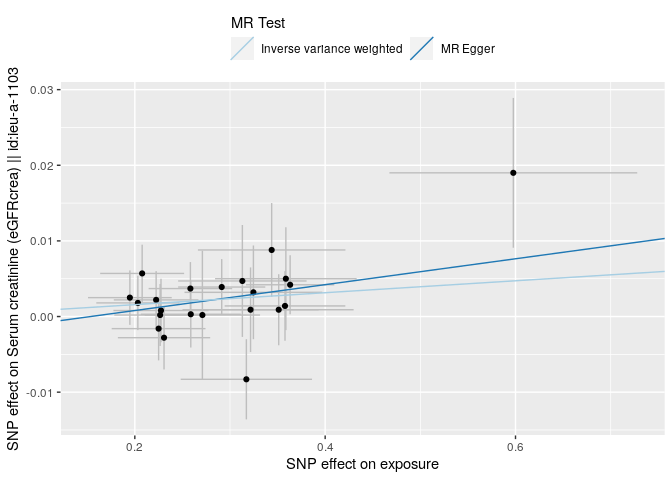

</div>

<div class="cell-output-display">

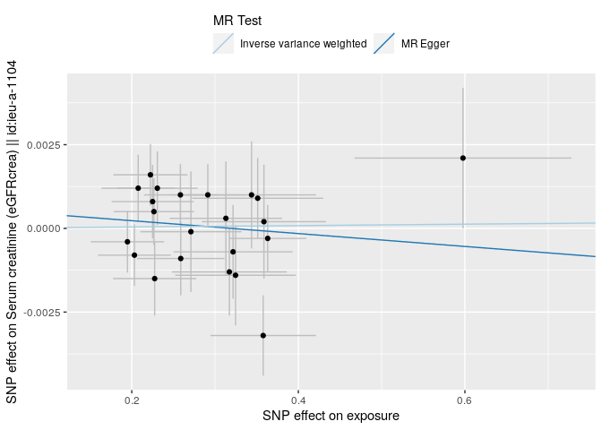

</div>

<div class="cell-output-display">

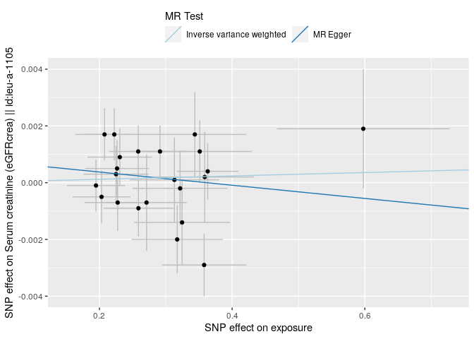

</div>

<div class="cell-output-display">

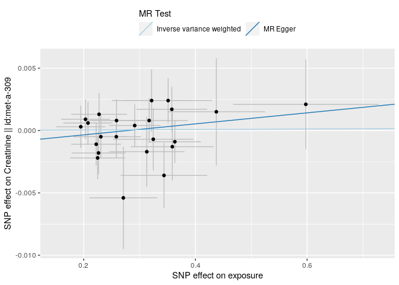

</div>

<div class="cell-output-display">

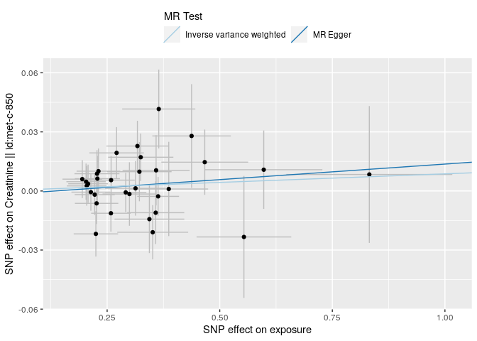

</div>

<div class="cell-output-display">


</div>

<div class="cell-output-display">


</div>

<div class="cell-output-display">

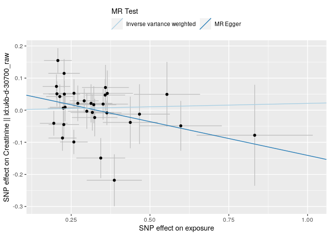

</div>

<div class="cell-output-display">

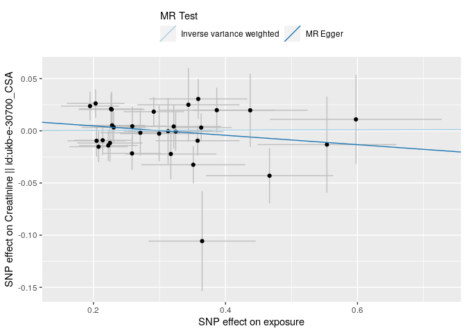

</div>

<div class="cell-output-display">

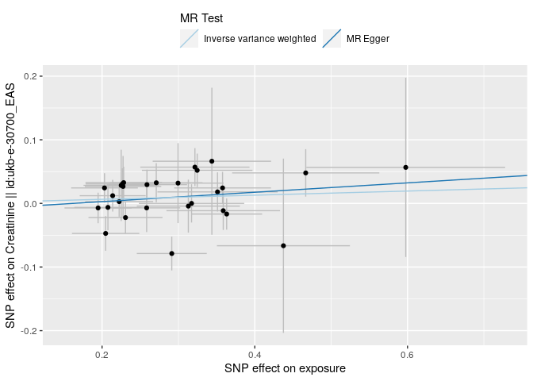

</div>

<div class="cell-output-display">

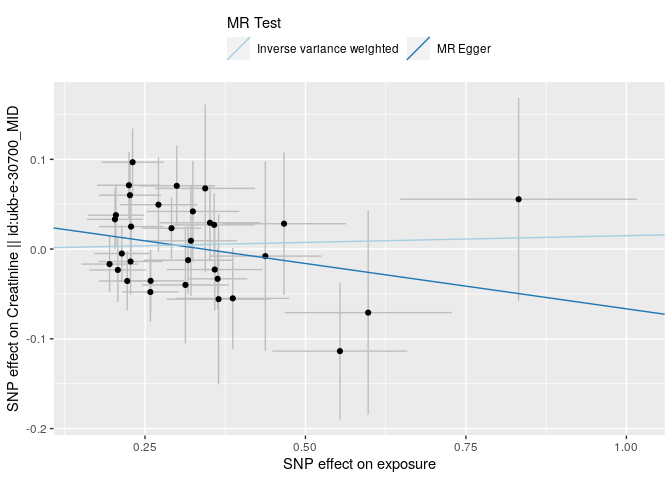

</div>

<div class="cell-output-display">


</div>

<div class="cell-output-display">

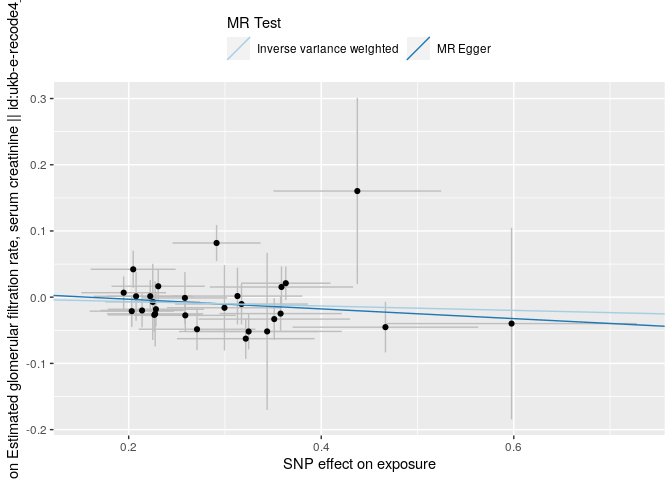

</div>

<div class="cell-output-display">

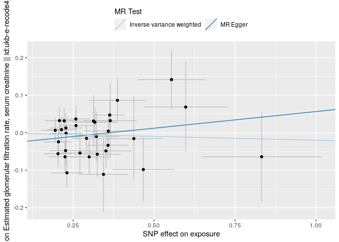

</div>

<div class="cell-output-display">

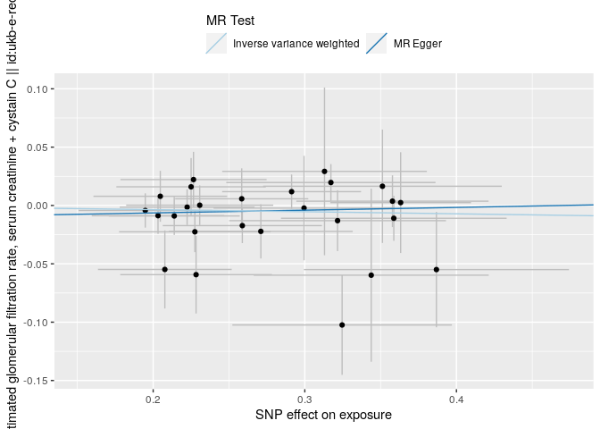

</div>

<div class="cell-output-display">

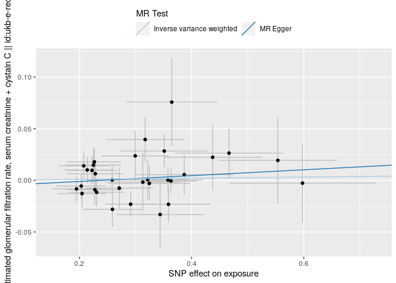

</div>

<div class="cell-output-display">

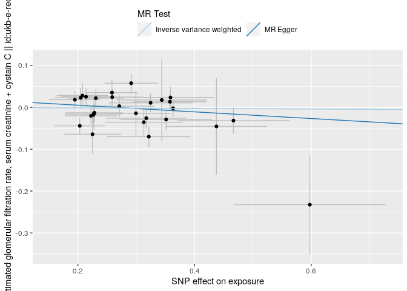

</div>

### MR for cystatin outcomes and 1e-05 threshold

    Extracting data for 32 SNP(s) from 9 GWAS(s)

    Finding proxies for 9 SNPs in outcome ukb-e-30720_AFR

    Extracting data for 9 SNP(s) from 1 GWAS(s)

    Finding proxies for 26 SNPs in outcome prot-c-2609_59_2

    Extracting data for 26 SNP(s) from 1 GWAS(s)

    Finding proxies for 5 SNPs in outcome ukb-e-30720_EAS

    Extracting data for 5 SNP(s) from 1 GWAS(s)

    Finding proxies for 16 SNPs in outcome ieu-a-1106

    Extracting data for 16 SNP(s) from 1 GWAS(s)

    Finding proxies for 16 SNPs in outcome ebi-a-GCST003375

    Extracting data for 16 SNP(s) from 1 GWAS(s)

    Finding proxies for 2 SNPs in outcome ukb-e-30720_CSA

    Extracting data for 2 SNP(s) from 1 GWAS(s)

    Harmonising exposure (dCtz8h) and Glomerular filtration rate (cystatin C) || id:ebi-a-GCST003375 (ebi-a-GCST003375)

    Harmonising exposure (dCtz8h) and Serum cystatin C (eGFRcys) || id:ieu-a-1106 (ieu-a-1106)

    Harmonising exposure (dCtz8h) and Cystatin C || id:prot-c-2609_59_2 (prot-c-2609_59_2)

    Harmonising exposure (dCtz8h) and Cystatin C || id:ukb-d-30720_irnt (ukb-d-30720_irnt)

    Harmonising exposure (dCtz8h) and Cystatin C || id:ukb-d-30720_raw (ukb-d-30720_raw)

    Harmonising exposure (dCtz8h) and Cystatin C || id:ukb-e-30720_AFR (ukb-e-30720_AFR)

    Harmonising exposure (dCtz8h) and Cystatin C || id:ukb-e-30720_CSA (ukb-e-30720_CSA)

    Harmonising exposure (dCtz8h) and Cystatin C || id:ukb-e-30720_EAS (ukb-e-30720_EAS)

    Harmonising exposure (dCtz8h) and Cystatin C || id:ukb-e-30720_MID (ukb-e-30720_MID)

    Analysing 'dCtz8h' on 'ebi-a-GCST003375'

    Analysing 'dCtz8h' on 'ieu-a-1106'

    Analysing 'dCtz8h' on 'prot-c-2609_59_2'

    Analysing 'dCtz8h' on 'ukb-d-30720_irnt'

    Analysing 'dCtz8h' on 'ukb-d-30720_raw'

    Analysing 'dCtz8h' on 'ukb-e-30720_AFR'

    Analysing 'dCtz8h' on 'ukb-e-30720_CSA'

    Analysing 'dCtz8h' on 'ukb-e-30720_EAS'

    Analysing 'dCtz8h' on 'ukb-e-30720_MID'

<div class="cell-output-display">


</div>

| id.exposure | id.outcome       | outcome                                                          | exposure | method                    | nsnp |          b |        se |      pval |
|:------------|:-----------------|:-----------------------------------------------------------------|:---------|:--------------------------|-----:|-----------:|----------:|----------:|
| dCtz8h      | ebi-a-GCST003375 | Glomerular filtration rate (cystatin C) \|\| id:ebi-a-GCST003375 | exposure | MR Egger                  |   22 | -0.0047170 | 0.0078820 | 0.5562530 |
| dCtz8h      | ebi-a-GCST003375 | Glomerular filtration rate (cystatin C) \|\| id:ebi-a-GCST003375 | exposure | Inverse variance weighted |   22 |  0.0000851 | 0.0018554 | 0.9634128 |
| dCtz8h      | ieu-a-1106       | Serum cystatin C (eGFRcys) \|\| id:ieu-a-1106                    | exposure | MR Egger                  |   22 | -0.0047170 | 0.0078820 | 0.5562530 |
| dCtz8h      | ieu-a-1106       | Serum cystatin C (eGFRcys) \|\| id:ieu-a-1106                    | exposure | Inverse variance weighted |   22 |  0.0000851 | 0.0018554 | 0.9634128 |
| dCtz8h      | prot-c-2609_59_2 | Cystatin C \|\| id:prot-c-2609_59_2                              | exposure | MR Egger                  |   12 |  0.3634559 | 0.2493712 | 0.1756571 |
| dCtz8h      | prot-c-2609_59_2 | Cystatin C \|\| id:prot-c-2609_59_2                              | exposure | Inverse variance weighted |   12 |  0.0197584 | 0.0676286 | 0.7701641 |
| dCtz8h      | ukb-d-30720_irnt | Cystatin C \|\| id:ukb-d-30720_irnt                              | exposure | MR Egger                  |   32 | -0.0046196 | 0.0094538 | 0.6286399 |
| dCtz8h      | ukb-d-30720_irnt | Cystatin C \|\| id:ukb-d-30720_irnt                              | exposure | Inverse variance weighted |   32 |  0.0044105 | 0.0027091 | 0.1035216 |
| dCtz8h      | ukb-d-30720_raw  | Cystatin C \|\| id:ukb-d-30720_raw                               | exposure | MR Egger                  |   32 | -0.0013967 | 0.0014745 | 0.3510972 |
| dCtz8h      | ukb-d-30720_raw  | Cystatin C \|\| id:ukb-d-30720_raw                               | exposure | Inverse variance weighted |   32 |  0.0004471 | 0.0004274 | 0.2954599 |
| dCtz8h      | ukb-e-30720_AFR  | Cystatin C \|\| id:ukb-e-30720_AFR                               | exposure | MR Egger                  |   26 | -0.0260616 | 0.0950943 | 0.7863827 |
| dCtz8h      | ukb-e-30720_AFR  | Cystatin C \|\| id:ukb-e-30720_AFR                               | exposure | Inverse variance weighted |   26 |  0.0189964 | 0.0191633 | 0.3215414 |
| dCtz8h      | ukb-e-30720_CSA  | Cystatin C \|\| id:ukb-e-30720_CSA                               | exposure | MR Egger                  |   31 | -0.0388525 | 0.0459918 | 0.4051551 |
| dCtz8h      | ukb-e-30720_CSA  | Cystatin C \|\| id:ukb-e-30720_CSA                               | exposure | Inverse variance weighted |   31 | -0.0070651 | 0.0119448 | 0.5541965 |
| dCtz8h      | ukb-e-30720_EAS  | Cystatin C \|\| id:ukb-e-30720_EAS                               | exposure | MR Egger                  |   28 |  0.0928496 | 0.1074996 | 0.3956400 |
| dCtz8h      | ukb-e-30720_EAS  | Cystatin C \|\| id:ukb-e-30720_EAS                               | exposure | Inverse variance weighted |   28 |  0.0097064 | 0.0253413 | 0.7017003 |
| dCtz8h      | ukb-e-30720_MID  | Cystatin C \|\| id:ukb-e-30720_MID                               | exposure | MR Egger                  |   32 |  0.1716698 | 0.1092570 | 0.1266136 |
| dCtz8h      | ukb-e-30720_MID  | Cystatin C \|\| id:ukb-e-30720_MID                               | exposure | Inverse variance weighted |   32 |  0.0426665 | 0.0310709 | 0.1696917 |

MR Egger and MR IVW for cystatin

| id.exposure | id.outcome       | outcome                                                          | exposure | method                    |        Q | Q_df |    Q_pval |
|:------------|:-----------------|:-----------------------------------------------------------------|:---------|:--------------------------|---------:|-----:|----------:|
| dCtz8h      | ebi-a-GCST003375 | Glomerular filtration rate (cystatin C) \|\| id:ebi-a-GCST003375 | exposure | MR Egger                  | 16.93654 |   20 | 0.6570903 |
| dCtz8h      | ebi-a-GCST003375 | Glomerular filtration rate (cystatin C) \|\| id:ebi-a-GCST003375 | exposure | Inverse variance weighted | 17.32951 |   21 | 0.6909488 |
| dCtz8h      | ieu-a-1106       | Serum cystatin C (eGFRcys) \|\| id:ieu-a-1106                    | exposure | MR Egger                  | 16.93654 |   20 | 0.6570903 |
| dCtz8h      | ieu-a-1106       | Serum cystatin C (eGFRcys) \|\| id:ieu-a-1106                    | exposure | Inverse variance weighted | 17.32951 |   21 | 0.6909488 |
| dCtz8h      | prot-c-2609_59_2 | Cystatin C \|\| id:prot-c-2609_59_2                              | exposure | MR Egger                  | 18.16783 |   10 | 0.0521977 |
| dCtz8h      | prot-c-2609_59_2 | Cystatin C \|\| id:prot-c-2609_59_2                              | exposure | Inverse variance weighted | 21.86766 |   11 | 0.0254188 |
| dCtz8h      | ukb-d-30720_irnt | Cystatin C \|\| id:ukb-d-30720_irnt                              | exposure | MR Egger                  | 71.56714 |   30 | 0.0000299 |
| dCtz8h      | ukb-d-30720_irnt | Cystatin C \|\| id:ukb-d-30720_irnt                              | exposure | Inverse variance weighted | 73.93845 |   31 | 0.0000228 |
| dCtz8h      | ukb-d-30720_raw  | Cystatin C \|\| id:ukb-d-30720_raw                               | exposure | MR Egger                  | 54.57879 |   30 | 0.0039603 |
| dCtz8h      | ukb-d-30720_raw  | Cystatin C \|\| id:ukb-d-30720_raw                               | exposure | Inverse variance weighted | 57.67796 |   31 | 0.0025094 |
| dCtz8h      | ukb-e-30720_AFR  | Cystatin C \|\| id:ukb-e-30720_AFR                               | exposure | MR Egger                  | 21.49321 |   24 | 0.6094868 |
| dCtz8h      | ukb-e-30720_AFR  | Cystatin C \|\| id:ukb-e-30720_AFR                               | exposure | Inverse variance weighted | 21.72722 |   25 | 0.6514424 |
| dCtz8h      | ukb-e-30720_CSA  | Cystatin C \|\| id:ukb-e-30720_CSA                               | exposure | MR Egger                  | 28.52899 |   29 | 0.4897835 |
| dCtz8h      | ukb-e-30720_CSA  | Cystatin C \|\| id:ukb-e-30720_CSA                               | exposure | Inverse variance weighted | 29.04123 |   30 | 0.5154313 |
| dCtz8h      | ukb-e-30720_EAS  | Cystatin C \|\| id:ukb-e-30720_EAS                               | exposure | MR Egger                  | 40.44469 |   26 | 0.0352632 |
| dCtz8h      | ukb-e-30720_EAS  | Cystatin C \|\| id:ukb-e-30720_EAS                               | exposure | Inverse variance weighted | 41.43077 |   27 | 0.0374211 |
| dCtz8h      | ukb-e-30720_MID  | Cystatin C \|\| id:ukb-e-30720_MID                               | exposure | MR Egger                  | 36.33602 |   30 | 0.1972811 |
| dCtz8h      | ukb-e-30720_MID  | Cystatin C \|\| id:ukb-e-30720_MID                               | exposure | Inverse variance weighted | 38.17053 |   31 | 0.1756941 |

Heterogeneity test for cystatin

| id.exposure | id.outcome       | outcome                                                          | exposure | egger_intercept |        se |      pval |
|:------------|:-----------------|:-----------------------------------------------------------------|:---------|----------------:|----------:|----------:|
| dCtz8h      | ebi-a-GCST003375 | Glomerular filtration rate (cystatin C) \|\| id:ebi-a-GCST003375 | exposure |       0.0013522 | 0.0021570 | 0.5378356 |
| dCtz8h      | ieu-a-1106       | Serum cystatin C (eGFRcys) \|\| id:ieu-a-1106                    | exposure |       0.0013522 | 0.0021570 | 0.5378356 |
| dCtz8h      | prot-c-2609_59_2 | Cystatin C \|\| id:prot-c-2609_59_2                              | exposure |      -0.1073903 | 0.0752534 | 0.1840355 |
| dCtz8h      | ukb-d-30720_irnt | Cystatin C \|\| id:ukb-d-30720_irnt                              | exposure |       0.0027056 | 0.0027137 | 0.3267357 |
| dCtz8h      | ukb-d-30720_raw  | Cystatin C \|\| id:ukb-d-30720_raw                               | exposure |       0.0005524 | 0.0004233 | 0.2017523 |
| dCtz8h      | ukb-e-30720_AFR  | Cystatin C \|\| id:ukb-e-30720_AFR                               | exposure |       0.0120285 | 0.0248652 | 0.6329482 |
| dCtz8h      | ukb-e-30720_CSA  | Cystatin C \|\| id:ukb-e-30720_CSA                               | exposure |       0.0093164 | 0.0130169 | 0.4798927 |
| dCtz8h      | ukb-e-30720_EAS  | Cystatin C \|\| id:ukb-e-30720_EAS                               | exposure |      -0.0240024 | 0.0301470 | 0.4331379 |
| dCtz8h      | ukb-e-30720_MID  | Cystatin C \|\| id:ukb-e-30720_MID                               | exposure |      -0.0382705 | 0.0310965 | 0.2279971 |

Pleiotropy test for cystatin

### Plots for cystatin outcomes

<div class="cell-output-display">

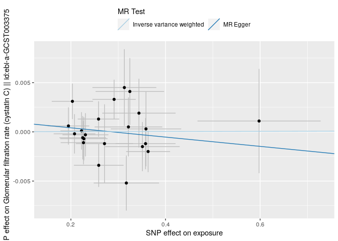

</div>

<div class="cell-output-display">

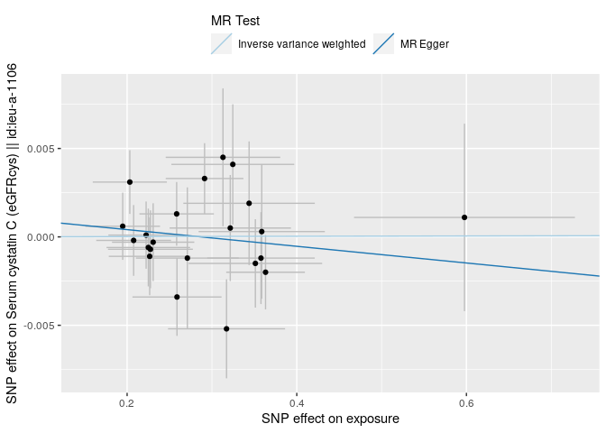

</div>

<div class="cell-output-display">


</div>

<div class="cell-output-display">

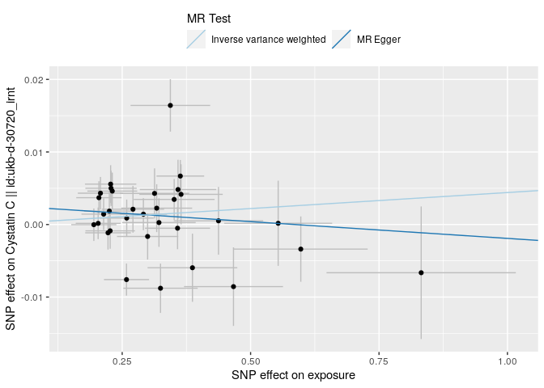

</div>

<div class="cell-output-display">

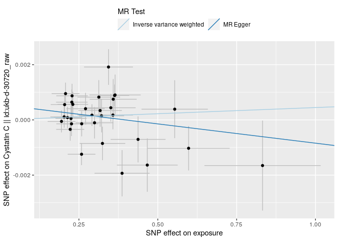

</div>

<div class="cell-output-display">

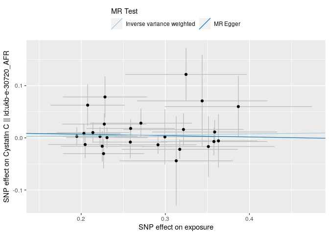

</div>

<div class="cell-output-display">


</div>

<div class="cell-output-display">

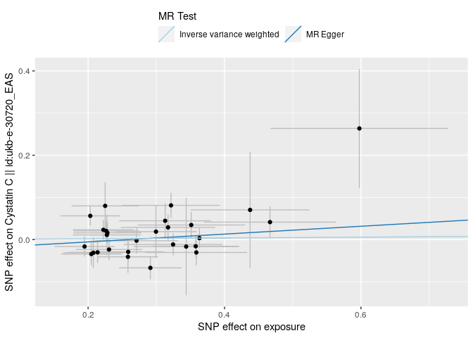

</div>

### MR for ckd outcomes and 1e-05 threshold

    Extracting data for 32 SNP(s) from 4 GWAS(s)

    Finding proxies for 16 SNPs in outcome ebi-a-GCST003374

    Extracting data for 16 SNP(s) from 1 GWAS(s)

    Finding proxies for 16 SNPs in outcome ieu-a-1102

    Extracting data for 16 SNP(s) from 1 GWAS(s)

    Harmonising exposure (dCtz8h) and Chronic kidney disease || id:ebi-a-GCST003374 (ebi-a-GCST003374)

    Harmonising exposure (dCtz8h) and Chronic kidney disease || id:ebi-a-GCST008026 (ebi-a-GCST008026)

    Harmonising exposure (dCtz8h) and Chronic kidney disease || id:finn-b-N14_CHRONKIDNEYDIS (finn-b-N14_CHRONKIDNEYDIS)

    Harmonising exposure (dCtz8h) and Chronic kidney disease || id:ieu-a-1102 (ieu-a-1102)

    Analysing 'dCtz8h' on 'ebi-a-GCST003374'

    Analysing 'dCtz8h' on 'ebi-a-GCST008026'

    Analysing 'dCtz8h' on 'finn-b-N14_CHRONKIDNEYDIS'

    Analysing 'dCtz8h' on 'ieu-a-1102'

<div class="cell-output-display">

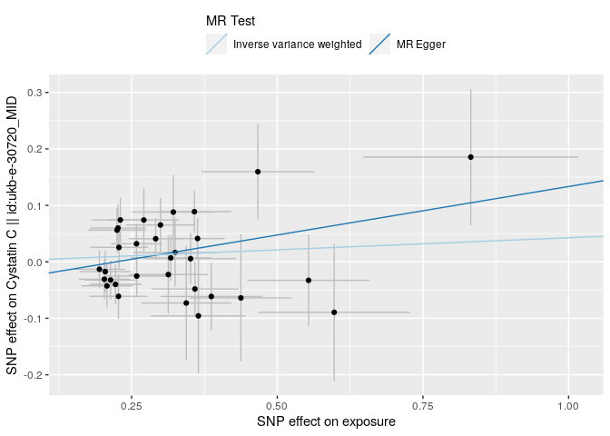

</div>

| id.exposure | id.outcome                | outcome                                                  | exposure | method                    | nsnp |          b |        se |      pval |
|:------------|:--------------------------|:---------------------------------------------------------|:---------|:--------------------------|-----:|-----------:|----------:|----------:|
| dCtz8h      | ebi-a-GCST003374          | Chronic kidney disease \|\| id:ebi-a-GCST003374          | exposure | MR Egger                  |   22 |  0.0201953 | 0.0613752 | 0.7455416 |
| dCtz8h      | ebi-a-GCST003374          | Chronic kidney disease \|\| id:ebi-a-GCST003374          | exposure | Inverse variance weighted |   22 | -0.0036792 | 0.0146486 | 0.8016850 |
| dCtz8h      | ebi-a-GCST008026          | Chronic kidney disease \|\| id:ebi-a-GCST008026          | exposure | MR Egger                  |   32 |  0.0355521 | 0.0856021 | 0.6808650 |
| dCtz8h      | ebi-a-GCST008026          | Chronic kidney disease \|\| id:ebi-a-GCST008026          | exposure | Inverse variance weighted |   32 |  0.0025792 | 0.0214029 | 0.9040809 |
| dCtz8h      | finn-b-N14_CHRONKIDNEYDIS | Chronic kidney disease \|\| id:finn-b-N14_CHRONKIDNEYDIS | exposure | MR Egger                  |   32 | -0.0547442 | 0.0706851 | 0.4447081 |
| dCtz8h      | finn-b-N14_CHRONKIDNEYDIS | Chronic kidney disease \|\| id:finn-b-N14_CHRONKIDNEYDIS | exposure | Inverse variance weighted |   32 | -0.0052262 | 0.0211068 | 0.8044390 |
| dCtz8h      | ieu-a-1102                | Chronic kidney disease \|\| id:ieu-a-1102                | exposure | MR Egger                  |   22 |  0.0201953 | 0.0613752 | 0.7455416 |
| dCtz8h      | ieu-a-1102                | Chronic kidney disease \|\| id:ieu-a-1102                | exposure | Inverse variance weighted |   22 | -0.0036792 | 0.0146486 | 0.8016850 |

MR Egger and MR IVW for ckd

| id.exposure | id.outcome                | outcome                                                  | exposure | method                    |        Q | Q_df |    Q_pval |
|:------------|:--------------------------|:---------------------------------------------------------|:---------|:--------------------------|---------:|-----:|----------:|
| dCtz8h      | ebi-a-GCST003374          | Chronic kidney disease \|\| id:ebi-a-GCST003374          | exposure | MR Egger                  | 20.60006 |   20 | 0.4209992 |
| dCtz8h      | ebi-a-GCST003374          | Chronic kidney disease \|\| id:ebi-a-GCST003374          | exposure | Inverse variance weighted | 20.76563 |   21 | 0.4733349 |
| dCtz8h      | ebi-a-GCST008026          | Chronic kidney disease \|\| id:ebi-a-GCST008026          | exposure | MR Egger                  | 22.64494 |   30 | 0.8295702 |
| dCtz8h      | ebi-a-GCST008026          | Chronic kidney disease \|\| id:ebi-a-GCST008026          | exposure | Inverse variance weighted | 22.80321 |   31 | 0.8561873 |
| dCtz8h      | finn-b-N14_CHRONKIDNEYDIS | Chronic kidney disease \|\| id:finn-b-N14_CHRONKIDNEYDIS | exposure | MR Egger                  | 37.49716 |   30 | 0.1630912 |
| dCtz8h      | finn-b-N14_CHRONKIDNEYDIS | Chronic kidney disease \|\| id:finn-b-N14_CHRONKIDNEYDIS | exposure | Inverse variance weighted | 38.17161 |   31 | 0.1756634 |
| dCtz8h      | ieu-a-1102                | Chronic kidney disease \|\| id:ieu-a-1102                | exposure | MR Egger                  | 20.60006 |   20 | 0.4209992 |
| dCtz8h      | ieu-a-1102                | Chronic kidney disease \|\| id:ieu-a-1102                | exposure | Inverse variance weighted | 20.76563 |   21 | 0.4733349 |

Heterogeneity test for ckd

| id.exposure | id.outcome                | outcome                                                  | exposure | egger_intercept |        se |      pval |
|:------------|:--------------------------|:---------------------------------------------------------|:---------|----------------:|----------:|----------:|
| dCtz8h      | ebi-a-GCST003374          | Chronic kidney disease \|\| id:ebi-a-GCST003374          | exposure |      -0.0068502 | 0.0170857 | 0.6927207 |
| dCtz8h      | ebi-a-GCST008026          | Chronic kidney disease \|\| id:ebi-a-GCST008026          | exposure |      -0.0093742 | 0.0235639 | 0.6935777 |
| dCtz8h      | finn-b-N14_CHRONKIDNEYDIS | Chronic kidney disease \|\| id:finn-b-N14_CHRONKIDNEYDIS | exposure |       0.0151499 | 0.0206240 | 0.4683016 |
| dCtz8h      | ieu-a-1102                | Chronic kidney disease \|\| id:ieu-a-1102                | exposure |      -0.0068502 | 0.0170857 | 0.6927207 |

Pleiotropy test for ckd

### Plots for ckd outcomes

<div class="cell-output-display">

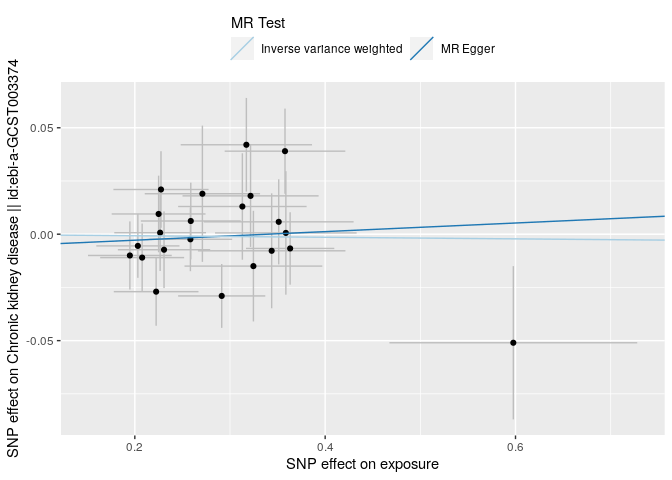

</div>

<div class="cell-output-display">

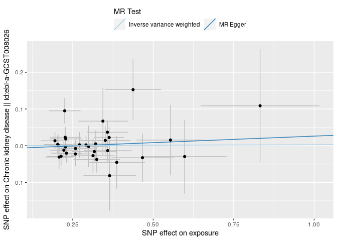

</div>

<div class="cell-output-display">

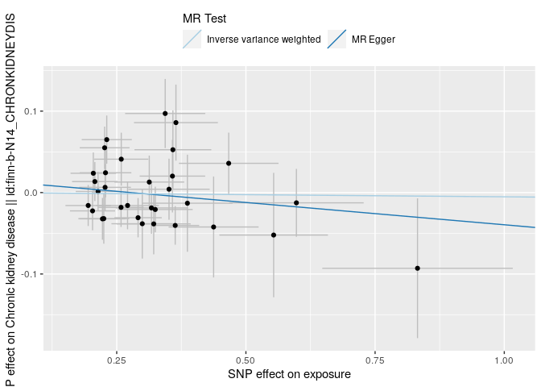

</div>

<div class="cell-output-display">


</div>

``` r
sessioninfo::session_info()
```

    ─ Session info ───────────────────────────────────────────────────────────────
     setting  value
     version  R version 4.2.3 (2023-03-15)
     os       Ubuntu 18.04.6 LTS
     system   x86_64, linux-gnu
     ui       X11
     language en_US:
     collate  en_US.UTF-8
     ctype    en_US.UTF-8
     tz       America/Detroit
     date     2023-04-18
     pandoc   1.19.2.4 @ /usr/bin/ (via rmarkdown)

    ─ Packages ───────────────────────────────────────────────────────────────────
     package     * version date (UTC) lib source
     cellranger    1.1.0   2016-07-27 [2] CRAN (R 4.0.3)
     cli           3.6.1   2023-03-23 [1] CRAN (R 4.2.3)
     codetools     0.2-19  2023-02-01 [1] CRAN (R 4.2.2)
     colorspace    2.1-0   2023-01-23 [1] CRAN (R 4.2.2)
     crul          1.3     2022-09-03 [1] CRAN (R 4.2.3)
     curl          5.0.0   2023-01-12 [1] CRAN (R 4.2.2)
     data.table    1.14.8  2023-02-17 [1] CRAN (R 4.2.2)
     digest        0.6.31  2022-12-11 [1] CRAN (R 4.2.2)
     dplyr         1.1.1   2023-03-22 [1] CRAN (R 4.2.3)
     evaluate      0.20    2023-01-17 [1] CRAN (R 4.2.2)
     fansi         1.0.4   2023-01-22 [1] CRAN (R 4.2.2)
     farver        2.1.1   2022-07-06 [1] CRAN (R 4.2.3)
     fastmap       1.1.1   2023-02-24 [1] CRAN (R 4.2.3)
     foreach       1.5.2   2022-02-02 [2] CRAN (R 4.2.0)
     generics      0.1.3   2022-07-05 [1] CRAN (R 4.2.3)
     ggplot2       3.4.2   2023-04-03 [1] CRAN (R 4.2.3)
     ggrepel       0.9.3   2023-02-03 [1] CRAN (R 4.2.3)
     glmnet        4.1-7   2023-03-23 [1] CRAN (R 4.2.3)
     glue          1.6.2   2022-02-24 [1] CRAN (R 4.2.0)
     gridExtra     2.3     2017-09-09 [2] CRAN (R 4.0.3)
     gtable        0.3.3   2023-03-21 [1] CRAN (R 4.2.3)
     here          1.0.1   2020-12-13 [2] CRAN (R 4.1.1)
     htmltools     0.5.5   2023-03-23 [1] CRAN (R 4.2.3)
     httpcode      0.3.0   2020-04-10 [1] CRAN (R 4.2.2)
     httr          1.4.5   2023-02-24 [1] CRAN (R 4.2.3)
     ieugwasr      0.1.5   2023-04-13 [1] Github (mrcieu/ieugwasr@33e4629)
     iterators     1.0.14  2022-02-05 [2] CRAN (R 4.2.0)
     jsonlite      1.8.4   2022-12-06 [1] CRAN (R 4.2.3)
     knitr         1.42    2023-01-25 [1] CRAN (R 4.2.3)
     labeling      0.4.2   2020-10-20 [2] CRAN (R 4.0.3)
     lattice       0.21-8  2023-04-05 [1] CRAN (R 4.2.3)
     lifecycle     1.0.3   2022-10-07 [1] CRAN (R 4.2.2)
     lubridate     1.9.2   2023-02-10 [1] CRAN (R 4.2.3)
     magrittr    * 2.0.3   2022-03-30 [1] CRAN (R 4.2.0)
     Matrix        1.5-4   2023-04-04 [1] CRAN (R 4.2.3)
     mr.raps       0.4.1   2023-04-18 [1] Github (qingyuanzhao/mr.raps@2a23d84)
     munsell       0.5.0   2018-06-12 [2] CRAN (R 4.0.3)
     nortest       1.0-4   2015-07-30 [2] CRAN (R 4.0.3)
     pillar        1.9.0   2023-03-22 [1] CRAN (R 4.2.3)
     pkgconfig     2.0.3   2019-09-22 [2] CRAN (R 4.0.3)
     plyr          1.8.8   2022-11-11 [1] CRAN (R 4.2.3)
     R6            2.5.1   2021-08-19 [2] CRAN (R 4.1.1)
     Rcpp          1.0.10  2023-01-22 [1] CRAN (R 4.2.2)
     readxl        1.4.2   2023-02-09 [1] CRAN (R 4.2.3)
     rlang         1.1.0   2023-03-14 [1] CRAN (R 4.2.2)
     rmarkdown     2.21    2023-03-26 [1] CRAN (R 4.2.3)
     rootSolve     1.8.2.3 2021-09-29 [2] CRAN (R 4.1.1)
     rprojroot     2.0.3   2022-04-02 [2] CRAN (R 4.2.0)
     rsnps         0.5.0.0 2022-01-28 [1] CRAN (R 4.2.3)
     scales        1.2.1   2022-08-20 [1] CRAN (R 4.2.3)
     sessioninfo   1.2.2   2021-12-06 [1] CRAN (R 4.1.2)
     shape         1.4.6   2021-05-19 [2] CRAN (R 4.1.1)
     stringi       1.7.12  2023-01-11 [1] CRAN (R 4.2.2)
     stringr       1.5.0   2022-12-02 [1] CRAN (R 4.2.3)
     survival      3.5-5   2023-03-12 [1] CRAN (R 4.2.3)
     tibble        3.2.1   2023-03-20 [1] CRAN (R 4.2.3)
     tidyselect    1.2.0   2022-10-10 [1] CRAN (R 4.2.2)
     timechange    0.2.0   2023-01-11 [1] CRAN (R 4.2.2)
     TwoSampleMR   0.5.6   2023-04-13 [1] Github (MRCIEU/TwoSampleMR@f856a15)
     utf8          1.2.3   2023-01-31 [1] CRAN (R 4.2.3)
     vctrs         0.6.1   2023-03-22 [1] CRAN (R 4.2.3)
     withr         2.5.0   2022-03-03 [1] CRAN (R 4.2.0)
     xfun          0.38    2023-03-24 [1] CRAN (R 4.2.3)
     yaml          2.3.7   2023-01-23 [1] CRAN (R 4.2.3)

     [1] /net/mulan/home/fredboe/R/x86_64-pc-linux-gnu-library/4.0
     [2] /net/mario/cluster/lib/R/site-library-bionic-40
     [3] /usr/local/lib/R/site-library
     [4] /usr/lib/R/site-library
     [5] /usr/lib/R/library

    ──────────────────────────────────────────────────────────────────────────────

``` r
# git commit info
gr <- git2r::repository(here::here()) %>%
    git2r::commits()
gr[[1]] 
```

    [f93ef20] 2023-04-18: deleted code for some tables
