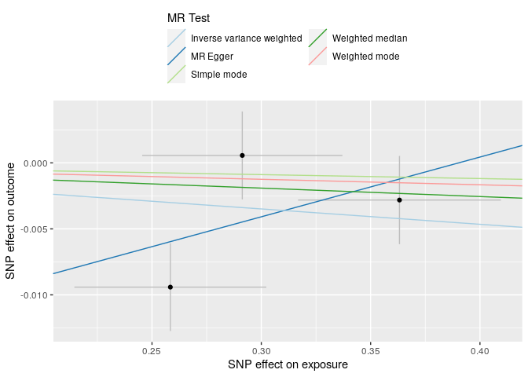
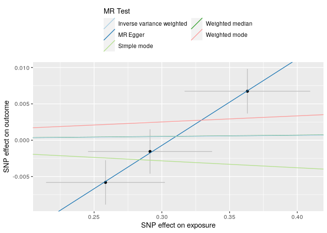
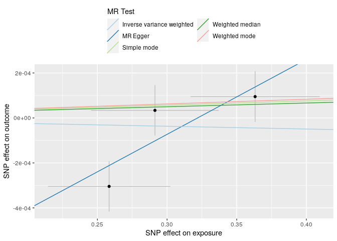
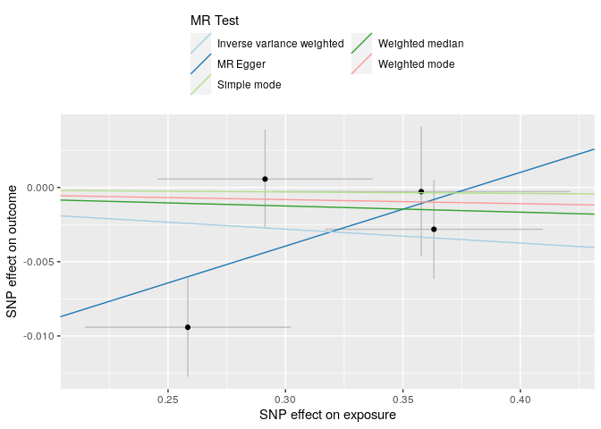
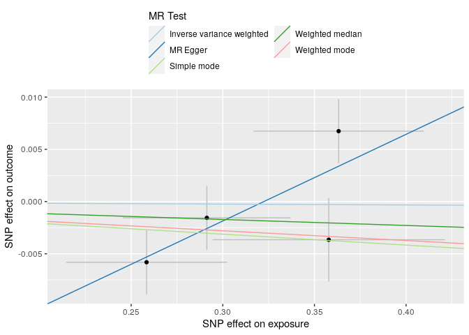
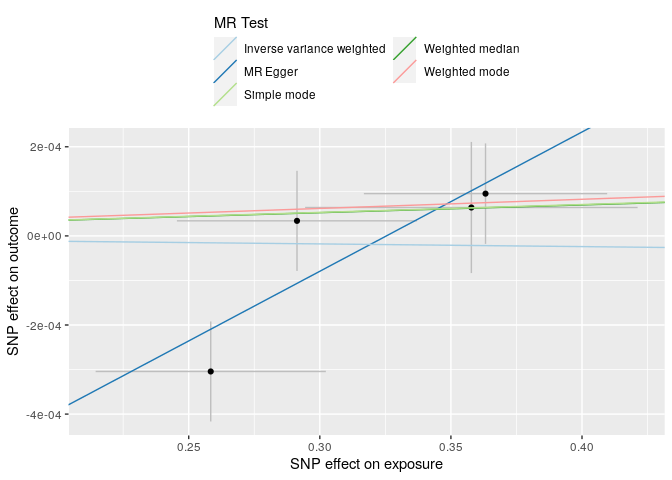
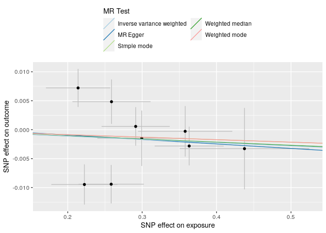
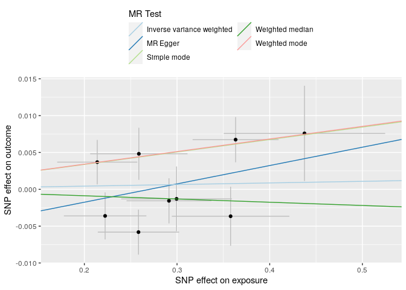
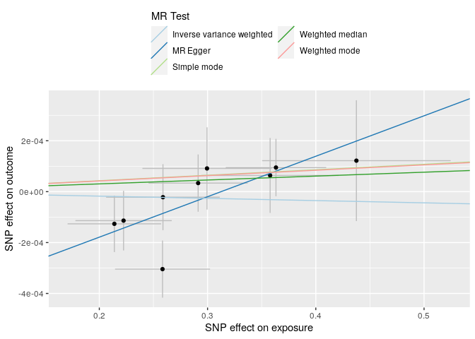

Creatinine & Cystatin C & CKD as possible consequences of FMD
================

    No phenotype name specified, defaulting to 'exposure'.

    Generating sample size from ncase and ncontrol

    API: public: http://gwas-api.mrcieu.ac.uk/

    Please look at vignettes for options on running this locally if you need to run many instances of this command.

    Clumping k9ycpa, 7 variants, using EUR population reference

    Removing 4 of 7 variants due to LD with other variants or absence from LD reference panel

    No phenotype name specified, defaulting to 'outcome'.

    Warning in TwoSampleMR::format_data(., type = "outcome", effect_allele_col = "A1", : The following columns are not present but are helpful for harmonisation
    eaf

    Harmonising exposure (k9ycpa) and outcome (f9960g)

    Analysing 'k9ycpa' on 'f9960g'

## /net/mulan/home/fredboe/research/fmdmr/analysis/data/ukb_for_munge_sumstats/30700_irnt.gwas.imputed_v3.female.varorder.tsv.gz

### pvalue threshold: 1e-08

| id.exposure | id.outcome | outcome | exposure | method                    | nsnp |          b |        se |      pval |
|:------------|:-----------|:--------|:---------|:--------------------------|-----:|-----------:|----------:|----------:|
| k9ycpa      | f9960g     | outcome | exposure | MR Egger                  |    3 |  0.0452620 | 0.0834409 | 0.6835853 |
| k9ycpa      | f9960g     | outcome | exposure | Weighted median           |    3 | -0.0063779 | 0.0078041 | 0.4137877 |
| k9ycpa      | f9960g     | outcome | exposure | Inverse variance weighted |    3 | -0.0116360 | 0.0101951 | 0.2537287 |
| k9ycpa      | f9960g     | outcome | exposure | Simple mode               |    3 | -0.0029696 | 0.0095193 | 0.7845911 |
| k9ycpa      | f9960g     | outcome | exposure | Weighted mode             |    3 | -0.0041515 | 0.0080730 | 0.6582680 |

| id.exposure | id.outcome | outcome | exposure | method                    |        Q | Q_df |    Q_pval |
|:------------|:-----------|:--------|:---------|:--------------------------|---------:|-----:|----------:|
| k9ycpa      | f9960g     | outcome | exposure | MR Egger                  | 3.591777 |    1 | 0.0580661 |
| k9ycpa      | f9960g     | outcome | exposure | Inverse variance weighted | 5.296403 |    2 | 0.0707784 |

| id.exposure | id.outcome | outcome | exposure | egger_intercept |       se |      pval |
|:------------|:-----------|:--------|:---------|----------------:|---------:|----------:|
| k9ycpa      | f9960g     | outcome | exposure |      -0.0176615 | 0.025637 | 0.6159646 |

    No phenotype name specified, defaulting to 'outcome'.

    Warning in TwoSampleMR::format_data(., type = "outcome", effect_allele_col = "A1", : The following columns are not present but are helpful for harmonisation
    eaf

    Harmonising exposure (k9ycpa) and outcome (9LVE2t)

    Analysing 'k9ycpa' on '9LVE2t'

<div class="cell-output-display">



</div>

## /net/mulan/home/fredboe/research/fmdmr/analysis/data/ukb_for_munge_sumstats/30720_irnt.gwas.imputed_v3.female.varorder.tsv.gz

### pvalue threshold: 1e-08

| id.exposure | id.outcome | outcome | exposure | method                    | nsnp |          b |        se |      pval |
|:------------|:-----------|:--------|:---------|:--------------------------|-----:|-----------:|----------:|----------:|
| k9ycpa      | 9LVE2t     | outcome | exposure | MR Egger                  |    3 |  0.1190633 | 0.0404611 | 0.2085469 |
| k9ycpa      | 9LVE2t     | outcome | exposure | Weighted median           |    3 |  0.0017131 | 0.0076760 | 0.8233969 |
| k9ycpa      | 9LVE2t     | outcome | exposure | Inverse variance weighted |    3 |  0.0016671 | 0.0119379 | 0.8889355 |
| k9ycpa      | 9LVE2t     | outcome | exposure | Simple mode               |    3 | -0.0094901 | 0.0145717 | 0.5817055 |
| k9ycpa      | 9LVE2t     | outcome | exposure | Weighted mode             |    3 |  0.0083734 | 0.0134339 | 0.5966924 |

| id.exposure | id.outcome | outcome | exposure | method                    |         Q | Q_df |    Q_pval |
|:------------|:-----------|:--------|:---------|:--------------------------|----------:|-----:|----------:|
| k9ycpa      | 9LVE2t     | outcome | exposure | MR Egger                  | 0.0065192 |    1 | 0.9356475 |
| k9ycpa      | 9LVE2t     | outcome | exposure | Inverse variance weighted | 8.5989536 |    2 | 0.0135757 |

| id.exposure | id.outcome | outcome | exposure | egger_intercept |        se |      pval |
|:------------|:-----------|:--------|:---------|----------------:|----------:|----------:|
| k9ycpa      | 9LVE2t     | outcome | exposure |      -0.0364406 | 0.0124316 | 0.2092993 |

    No phenotype name specified, defaulting to 'outcome'.

    Warning in TwoSampleMR::format_data(., type = "outcome", effect_allele_col = "A1", : The following columns are not present but are helpful for harmonisation
    eaf

    Harmonising exposure (k9ycpa) and outcome (0GP7ue)

    Analysing 'k9ycpa' on '0GP7ue'

<div class="cell-output-display">



</div>

## /net/mulan/home/fredboe/research/fmdmr/analysis/data/ukb_for_munge_sumstats/N18.gwas.imputed_v3.female.tsv.gz

### pvalue threshold: 1e-08

| id.exposure | id.outcome | outcome | exposure | method                    | nsnp |          b |        se |      pval |
|:------------|:-----------|:--------|:---------|:--------------------------|-----:|-----------:|----------:|----------:|
| k9ycpa      | 0GP7ue     | outcome | exposure | MR Egger                  |    3 |  0.0033322 | 0.0022448 | 0.3774020 |
| k9ycpa      | 0GP7ue     | outcome | exposure | Weighted median           |    3 |  0.0001662 | 0.0002721 | 0.5413082 |
| k9ycpa      | 0GP7ue     | outcome | exposure | Inverse variance weighted |    3 | -0.0001231 | 0.0004176 | 0.7681797 |
| k9ycpa      | 0GP7ue     | outcome | exposure | Simple mode               |    3 |  0.0001893 | 0.0003090 | 0.6024462 |
| k9ycpa      | 0GP7ue     | outcome | exposure | Weighted mode             |    3 |  0.0002079 | 0.0002570 | 0.5034785 |

| id.exposure | id.outcome | outcome | exposure | method                    |       Q | Q_df |    Q_pval |
|:------------|:-----------|:--------|:---------|:--------------------------|--------:|-----:|----------:|
| k9ycpa      | 0GP7ue     | outcome | exposure | MR Egger                  | 2.28424 |    1 | 0.1306942 |
| k9ycpa      | 0GP7ue     | outcome | exposure | Inverse variance weighted | 7.80838 |    2 | 0.0201573 |

| id.exposure | id.outcome | outcome | exposure | egger_intercept |        se |      pval |
|:------------|:-----------|:--------|:---------|----------------:|----------:|----------:|
| k9ycpa      | 0GP7ue     | outcome | exposure |      -0.0010726 | 0.0006897 | 0.3638075 |

    Please look at vignettes for options on running this locally if you need to run many instances of this command.

    Clumping k9ycpa, 27 variants, using EUR population reference

    Removing 23 of 27 variants due to LD with other variants or absence from LD reference panel

    No phenotype name specified, defaulting to 'outcome'.

    Warning in TwoSampleMR::format_data(., type = "outcome", effect_allele_col = "A1", : The following columns are not present but are helpful for harmonisation
    eaf

    Harmonising exposure (k9ycpa) and outcome (8GIczE)

    Analysing 'k9ycpa' on '8GIczE'

<div class="cell-output-display">



</div>

## /net/mulan/home/fredboe/research/fmdmr/analysis/data/ukb_for_munge_sumstats/30700_irnt.gwas.imputed_v3.female.varorder.tsv.gz

### pvalue threshold: 1e-07

| id.exposure | id.outcome | outcome | exposure | method                    | nsnp |          b |        se |      pval |
|:------------|:-----------|:--------|:---------|:--------------------------|-----:|-----------:|----------:|----------:|
| k9ycpa      | 8GIczE     | outcome | exposure | MR Egger                  |    4 |  0.0496276 | 0.0532251 | 0.4495575 |
| k9ycpa      | 8GIczE     | outcome | exposure | Weighted median           |    4 | -0.0041630 | 0.0068188 | 0.5415160 |
| k9ycpa      | 8GIczE     | outcome | exposure | Inverse variance weighted |    4 | -0.0093667 | 0.0078296 | 0.2315698 |
| k9ycpa      | 8GIczE     | outcome | exposure | Simple mode               |    4 | -0.0010033 | 0.0084989 | 0.9134853 |
| k9ycpa      | 8GIczE     | outcome | exposure | Weighted mode             |    4 | -0.0027275 | 0.0080105 | 0.7559372 |

| id.exposure | id.outcome | outcome | exposure | method                    |        Q | Q_df |    Q_pval |
|:------------|:-----------|:--------|:---------|:--------------------------|---------:|-----:|----------:|
| k9ycpa      | 8GIczE     | outcome | exposure | MR Egger                  | 3.641596 |    2 | 0.1618965 |
| k9ycpa      | 8GIczE     | outcome | exposure | Inverse variance weighted | 5.924049 |    3 | 0.1153645 |

| id.exposure | id.outcome | outcome | exposure | egger_intercept |        se |     pval |
|:------------|:-----------|:--------|:---------|----------------:|----------:|---------:|
| k9ycpa      | 8GIczE     | outcome | exposure |      -0.0188337 | 0.0168215 | 0.379286 |

    No phenotype name specified, defaulting to 'outcome'.

    Warning in TwoSampleMR::format_data(., type = "outcome", effect_allele_col = "A1", : The following columns are not present but are helpful for harmonisation
    eaf

    Harmonising exposure (k9ycpa) and outcome (hjsJwF)

    Analysing 'k9ycpa' on 'hjsJwF'

<div class="cell-output-display">



</div>

## /net/mulan/home/fredboe/research/fmdmr/analysis/data/ukb_for_munge_sumstats/30720_irnt.gwas.imputed_v3.female.varorder.tsv.gz

### pvalue threshold: 1e-07

| id.exposure | id.outcome | outcome | exposure | method                    | nsnp |          b |        se |      pval |
|:------------|:-----------|:--------|:---------|:--------------------------|-----:|-----------:|----------:|----------:|
| k9ycpa      | hjsJwF     | outcome | exposure | MR Egger                  |    4 |  0.0829785 | 0.0515057 | 0.2484739 |
| k9ycpa      | hjsJwF     | outcome | exposure | Weighted median           |    4 | -0.0057269 | 0.0076661 | 0.4550372 |
| k9ycpa      | hjsJwF     | outcome | exposure | Inverse variance weighted |    4 | -0.0008171 | 0.0091070 | 0.9285072 |
| k9ycpa      | hjsJwF     | outcome | exposure | Simple mode               |    4 | -0.0104251 | 0.0112744 | 0.4233369 |
| k9ycpa      | hjsJwF     | outcome | exposure | Weighted mode             |    4 | -0.0093331 | 0.0149531 | 0.5767675 |

| id.exposure | id.outcome | outcome | exposure | method                    |        Q | Q_df |    Q_pval |
|:------------|:-----------|:--------|:---------|:--------------------------|---------:|-----:|----------:|
| k9ycpa      | hjsJwF     | outcome | exposure | MR Egger                  | 4.037562 |    2 | 0.1328173 |
| k9ycpa      | hjsJwF     | outcome | exposure | Inverse variance weighted | 9.489793 |    3 | 0.0234402 |

| id.exposure | id.outcome | outcome | exposure | egger_intercept |        se |      pval |
|:------------|:-----------|:--------|:---------|----------------:|----------:|----------:|
| k9ycpa      | hjsJwF     | outcome | exposure |      -0.0267513 | 0.0162781 | 0.2420182 |

    No phenotype name specified, defaulting to 'outcome'.

    Warning in TwoSampleMR::format_data(., type = "outcome", effect_allele_col = "A1", : The following columns are not present but are helpful for harmonisation
    eaf

    Harmonising exposure (k9ycpa) and outcome (gw7Cs1)

    Analysing 'k9ycpa' on 'gw7Cs1'

<div class="cell-output-display">



</div>

## /net/mulan/home/fredboe/research/fmdmr/analysis/data/ukb_for_munge_sumstats/N18.gwas.imputed_v3.female.tsv.gz

### pvalue threshold: 1e-07

| id.exposure | id.outcome | outcome | exposure | method                    | nsnp |          b |        se |      pval |
|:------------|:-----------|:--------|:---------|:--------------------------|-----:|-----------:|----------:|----------:|
| k9ycpa      | gw7Cs1     | outcome | exposure | MR Egger                  |    4 |  0.0031264 | 0.0014522 | 0.1642015 |
| k9ycpa      | gw7Cs1     | outcome | exposure | Weighted median           |    4 |  0.0001739 | 0.0002427 | 0.4736530 |
| k9ycpa      | gw7Cs1     | outcome | exposure | Inverse variance weighted |    4 | -0.0000602 | 0.0003114 | 0.8466688 |
| k9ycpa      | gw7Cs1     | outcome | exposure | Simple mode               |    4 |  0.0001761 | 0.0002698 | 0.5603644 |
| k9ycpa      | gw7Cs1     | outcome | exposure | Weighted mode             |    4 |  0.0002056 | 0.0002331 | 0.4427067 |

| id.exposure | id.outcome | outcome | exposure | method                    |        Q | Q_df |    Q_pval |
|:------------|:-----------|:--------|:---------|:--------------------------|---------:|-----:|----------:|
| k9ycpa      | gw7Cs1     | outcome | exposure | MR Egger                  | 2.381616 |    2 | 0.3039755 |
| k9ycpa      | gw7Cs1     | outcome | exposure | Inverse variance weighted | 8.232177 |    3 | 0.0414493 |

| id.exposure | id.outcome | outcome | exposure | egger_intercept |       se |      pval |
|:------------|:-----------|:--------|:---------|----------------:|---------:|----------:|
| k9ycpa      | gw7Cs1     | outcome | exposure |      -0.0010173 | 0.000459 | 0.1569732 |

    Please look at vignettes for options on running this locally if you need to run many instances of this command.

    Clumping k9ycpa, 88 variants, using EUR population reference

    Removing 78 of 88 variants due to LD with other variants or absence from LD reference panel

    No phenotype name specified, defaulting to 'outcome'.

    Warning in TwoSampleMR::format_data(., type = "outcome", effect_allele_col = "A1", : The following columns are not present but are helpful for harmonisation
    eaf

    Harmonising exposure (k9ycpa) and outcome (UQIUQz)

    Removing the following SNPs for being palindromic with intermediate allele frequencies:
    rs72802873

    Analysing 'k9ycpa' on 'UQIUQz'

<div class="cell-output-display">



</div>

## /net/mulan/home/fredboe/research/fmdmr/analysis/data/ukb_for_munge_sumstats/30700_irnt.gwas.imputed_v3.female.varorder.tsv.gz

### pvalue threshold: 1e-06

| id.exposure | id.outcome | outcome | exposure | method                    | nsnp |          b |        se |      pval |
|:------------|:-----------|:--------|:---------|:--------------------------|-----:|-----------:|----------:|----------:|
| k9ycpa      | UQIUQz     | outcome | exposure | MR Egger                  |    9 | -0.0077117 | 0.0370119 | 0.8408821 |
| k9ycpa      | UQIUQz     | outcome | exposure | Weighted median           |    9 | -0.0054017 | 0.0062392 | 0.3866175 |
| k9ycpa      | UQIUQz     | outcome | exposure | Inverse variance weighted |    9 | -0.0056231 | 0.0070805 | 0.4270969 |
| k9ycpa      | UQIUQz     | outcome | exposure | Simple mode               |    9 | -0.0043119 | 0.0094996 | 0.6619593 |
| k9ycpa      | UQIUQz     | outcome | exposure | Weighted mode             |    9 | -0.0043119 | 0.0073669 | 0.5744776 |

| id.exposure | id.outcome | outcome | exposure | method                    |        Q | Q_df |    Q_pval |
|:------------|:-----------|:--------|:---------|:--------------------------|---------:|-----:|----------:|
| k9ycpa      | UQIUQz     | outcome | exposure | MR Egger                  | 21.18876 |    7 | 0.0035006 |
| k9ycpa      | UQIUQz     | outcome | exposure | Inverse variance weighted | 21.19882 |    8 | 0.0066376 |

| id.exposure | id.outcome | outcome | exposure | egger_intercept |        se |      pval |
|:------------|:-----------|:--------|:---------|----------------:|----------:|----------:|
| k9ycpa      | UQIUQz     | outcome | exposure |       0.0006184 | 0.0107263 | 0.9556395 |

    No phenotype name specified, defaulting to 'outcome'.

    Warning in TwoSampleMR::format_data(., type = "outcome", effect_allele_col = "A1", : The following columns are not present but are helpful for harmonisation
    eaf

    Harmonising exposure (k9ycpa) and outcome (oOmOKK)

    Removing the following SNPs for being palindromic with intermediate allele frequencies:
    rs72802873

    Analysing 'k9ycpa' on 'oOmOKK'

<div class="cell-output-display">



</div>

## /net/mulan/home/fredboe/research/fmdmr/analysis/data/ukb_for_munge_sumstats/30720_irnt.gwas.imputed_v3.female.varorder.tsv.gz

### pvalue threshold: 1e-06

| id.exposure | id.outcome | outcome | exposure | method                    | nsnp |          b |        se |      pval |
|:------------|:-----------|:--------|:---------|:--------------------------|-----:|-----------:|----------:|----------:|
| k9ycpa      | oOmOKK     | outcome | exposure | MR Egger                  |    9 |  0.0248932 | 0.0275548 | 0.3963324 |
| k9ycpa      | oOmOKK     | outcome | exposure | Weighted median           |    9 | -0.0043895 | 0.0061798 | 0.4775224 |
| k9ycpa      | oOmOKK     | outcome | exposure | Inverse variance weighted |    9 |  0.0021690 | 0.0055307 | 0.6949327 |
| k9ycpa      | oOmOKK     | outcome | exposure | Simple mode               |    9 |  0.0169004 | 0.0135925 | 0.2489346 |
| k9ycpa      | oOmOKK     | outcome | exposure | Weighted mode             |    9 |  0.0170935 | 0.0131089 | 0.2285137 |

| id.exposure | id.outcome | outcome | exposure | method                    |        Q | Q_df |    Q_pval |
|:------------|:-----------|:--------|:---------|:--------------------------|---------:|-----:|----------:|
| k9ycpa      | oOmOKK     | outcome | exposure | MR Egger                  | 13.90388 |    7 | 0.0529176 |
| k9ycpa      | oOmOKK     | outcome | exposure | Inverse variance weighted | 15.31372 |    8 | 0.0533249 |

| id.exposure | id.outcome | outcome | exposure | egger_intercept |        se |      pval |
|:------------|:-----------|:--------|:---------|----------------:|----------:|----------:|
| k9ycpa      | oOmOKK     | outcome | exposure |      -0.0067277 | 0.0079855 | 0.4273572 |

    No phenotype name specified, defaulting to 'outcome'.

    Warning in TwoSampleMR::format_data(., type = "outcome", effect_allele_col = "A1", : The following columns are not present but are helpful for harmonisation
    eaf

    Harmonising exposure (k9ycpa) and outcome (zlWA1U)

    Removing the following SNPs for being palindromic with intermediate allele frequencies:
    rs72802873

    Analysing 'k9ycpa' on 'zlWA1U'

<div class="cell-output-display">



</div>

## /net/mulan/home/fredboe/research/fmdmr/analysis/data/ukb_for_munge_sumstats/N18.gwas.imputed_v3.female.tsv.gz

### pvalue threshold: 1e-06

| id.exposure | id.outcome | outcome | exposure | method                    | nsnp |          b |        se |      pval |
|:------------|:-----------|:--------|:---------|:--------------------------|-----:|-----------:|----------:|----------:|
| k9ycpa      | zlWA1U     | outcome | exposure | MR Egger                  |    9 |  0.0015896 | 0.0007178 | 0.0623772 |
| k9ycpa      | zlWA1U     | outcome | exposure | Weighted median           |    9 |  0.0001531 | 0.0001909 | 0.4226793 |
| k9ycpa      | zlWA1U     | outcome | exposure | Inverse variance weighted |    9 | -0.0000879 | 0.0001707 | 0.6065618 |
| k9ycpa      | zlWA1U     | outcome | exposure | Simple mode               |    9 |  0.0002152 | 0.0002930 | 0.4835762 |
| k9ycpa      | zlWA1U     | outcome | exposure | Weighted mode             |    9 |  0.0002104 | 0.0002417 | 0.4093837 |

| id.exposure | id.outcome | outcome | exposure | method                    |         Q | Q_df |    Q_pval |
|:------------|:-----------|:--------|:---------|:--------------------------|----------:|-----:|----------:|
| k9ycpa      | zlWA1U     | outcome | exposure | MR Egger                  |  5.126035 |    7 | 0.6445857 |
| k9ycpa      | zlWA1U     | outcome | exposure | Inverse variance weighted | 10.826083 |    8 | 0.2117496 |

| id.exposure | id.outcome | outcome | exposure | egger_intercept |       se |      pval |
|:------------|:-----------|:--------|:---------|----------------:|---------:|----------:|
| k9ycpa      | zlWA1U     | outcome | exposure |      -0.0004966 | 0.000208 | 0.0483477 |

<div class="cell-output-display">



</div>

``` r
sessioninfo::session_info()
```

    ─ Session info ───────────────────────────────────────────────────────────────
     setting  value
     version  R version 4.3.0 (2023-04-21)
     os       Ubuntu 18.04.6 LTS
     system   x86_64, linux-gnu
     ui       X11
     language en_US:
     collate  en_US.UTF-8
     ctype    en_US.UTF-8
     tz       America/Detroit
     date     2023-05-12
     pandoc   1.19.2.4 @ /usr/bin/ (via rmarkdown)

    ─ Packages ───────────────────────────────────────────────────────────────────
     package     * version date (UTC) lib source
     bit           4.0.5   2022-11-15 [1] CRAN (R 4.2.2)
     bit64         4.0.5   2020-08-30 [2] CRAN (R 4.0.3)
     cli           3.6.1   2023-03-23 [1] CRAN (R 4.2.3)
     codetools     0.2-19  2023-02-01 [1] CRAN (R 4.2.2)
     colorspace    2.1-0   2023-01-23 [1] CRAN (R 4.2.2)
     crayon        1.5.2   2022-09-29 [1] CRAN (R 4.2.1)
     crul          1.3     2022-09-03 [1] CRAN (R 4.2.3)
     curl          5.0.0   2023-01-12 [1] CRAN (R 4.2.2)
     data.table    1.14.8  2023-02-17 [1] CRAN (R 4.2.2)
     digest        0.6.31  2022-12-11 [1] CRAN (R 4.2.2)
     dplyr         1.1.1   2023-03-22 [1] CRAN (R 4.2.3)
     evaluate      0.20    2023-01-17 [1] CRAN (R 4.2.2)
     fansi         1.0.4   2023-01-22 [1] CRAN (R 4.2.2)
     farver        2.1.1   2022-07-06 [1] CRAN (R 4.2.3)
     fastmap       1.1.1   2023-02-24 [1] CRAN (R 4.2.3)
     foreach       1.5.2   2022-02-02 [2] CRAN (R 4.2.0)
     generics      0.1.3   2022-07-05 [1] CRAN (R 4.2.3)
     ggplot2       3.4.2   2023-04-03 [1] CRAN (R 4.2.3)
     ggrepel       0.9.3   2023-02-03 [1] CRAN (R 4.2.3)
     glmnet        4.1-7   2023-03-23 [1] CRAN (R 4.2.3)
     glue          1.6.2   2022-02-24 [1] CRAN (R 4.2.0)
     gridExtra     2.3     2017-09-09 [2] CRAN (R 4.0.3)
     gtable        0.3.3   2023-03-21 [1] CRAN (R 4.2.3)
     here          1.0.1   2020-12-13 [2] CRAN (R 4.1.1)
     htmltools     0.5.5   2023-03-23 [1] CRAN (R 4.2.3)
     httpcode      0.3.0   2020-04-10 [1] CRAN (R 4.2.2)
     httr          1.4.5   2023-02-24 [1] CRAN (R 4.2.3)
     ieugwasr      0.1.5   2023-04-13 [1] Github (mrcieu/ieugwasr@33e4629)
     iterators     1.0.14  2022-02-05 [2] CRAN (R 4.2.0)
     jsonlite      1.8.4   2022-12-06 [1] CRAN (R 4.2.3)
     knitr         1.42    2023-01-25 [1] CRAN (R 4.2.3)
     labeling      0.4.2   2020-10-20 [2] CRAN (R 4.0.3)
     lattice       0.21-8  2023-04-05 [1] CRAN (R 4.2.3)
     lifecycle     1.0.3   2022-10-07 [1] CRAN (R 4.2.2)
     magrittr    * 2.0.3   2022-03-30 [1] CRAN (R 4.2.0)
     Matrix        1.5-4   2023-04-04 [1] CRAN (R 4.2.3)
     mr.raps       0.4.1   2023-04-18 [1] Github (qingyuanzhao/mr.raps@2a23d84)
     munsell       0.5.0   2018-06-12 [2] CRAN (R 4.0.3)
     nortest       1.0-4   2015-07-30 [2] CRAN (R 4.0.3)
     pillar        1.9.0   2023-03-22 [1] CRAN (R 4.2.3)
     pkgconfig     2.0.3   2019-09-22 [2] CRAN (R 4.0.3)
     plyr          1.8.8   2022-11-11 [1] CRAN (R 4.2.3)
     R6            2.5.1   2021-08-19 [2] CRAN (R 4.1.1)
     Rcpp          1.0.10  2023-01-22 [1] CRAN (R 4.2.2)
     rlang         1.1.0   2023-03-14 [1] CRAN (R 4.2.2)
     rmarkdown     2.21    2023-03-26 [1] CRAN (R 4.2.3)
     rootSolve     1.8.2.3 2021-09-29 [2] CRAN (R 4.1.1)
     rprojroot     2.0.3   2022-04-02 [2] CRAN (R 4.2.0)
     rsnps         0.5.0.0 2022-01-28 [1] CRAN (R 4.2.3)
     scales        1.2.1   2022-08-20 [1] CRAN (R 4.2.3)
     sessioninfo   1.2.2   2021-12-06 [1] CRAN (R 4.1.2)
     shape         1.4.6   2021-05-19 [2] CRAN (R 4.1.1)
     stringi       1.7.12  2023-01-11 [1] CRAN (R 4.2.2)
     stringr       1.5.0   2022-12-02 [1] CRAN (R 4.2.3)
     survival      3.5-5   2023-03-12 [1] CRAN (R 4.2.3)
     tibble        3.2.1   2023-03-20 [1] CRAN (R 4.2.3)
     tidyselect    1.2.0   2022-10-10 [1] CRAN (R 4.2.2)
     TwoSampleMR   0.5.6   2023-04-13 [1] Github (MRCIEU/TwoSampleMR@f856a15)
     tzdb          0.3.0   2022-03-28 [2] CRAN (R 4.2.0)
     utf8          1.2.3   2023-01-31 [1] CRAN (R 4.2.3)
     vctrs         0.6.1   2023-03-22 [1] CRAN (R 4.2.3)
     vroom         1.6.1   2023-01-22 [1] CRAN (R 4.2.2)
     withr         2.5.0   2022-03-03 [1] CRAN (R 4.2.0)
     xfun          0.38    2023-03-24 [1] CRAN (R 4.2.3)
     yaml          2.3.7   2023-01-23 [1] CRAN (R 4.2.3)

     [1] /net/mulan/home/fredboe/R/x86_64-pc-linux-gnu-library/4.0
     [2] /net/mario/cluster/lib/R/site-library-bionic-40
     [3] /usr/local/lib/R/site-library
     [4] /usr/lib/R/site-library
     [5] /usr/lib/R/library

    ──────────────────────────────────────────────────────────────────────────────

``` r
# git commit info
gr <- git2r::repository(here::here()) %>%
    git2r::commits()
gr[[1]] 
```

    [42c826e] 2023-05-12: feat: set echo = FALSE and added heterogeneity and pleiotropy test results
