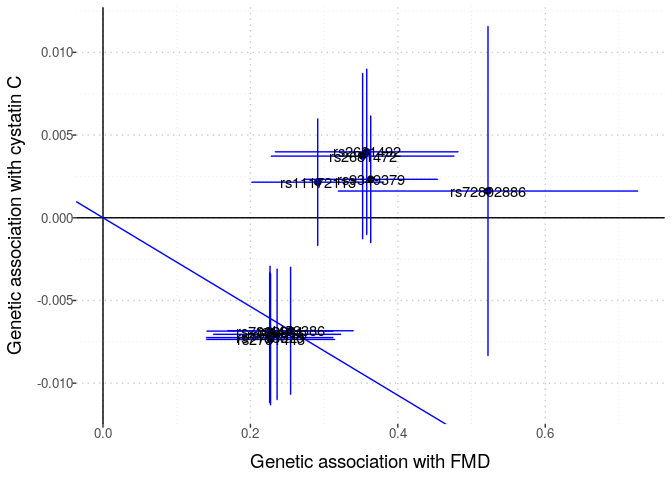
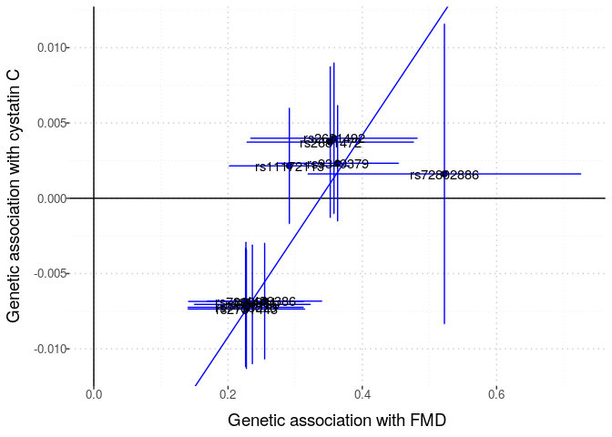
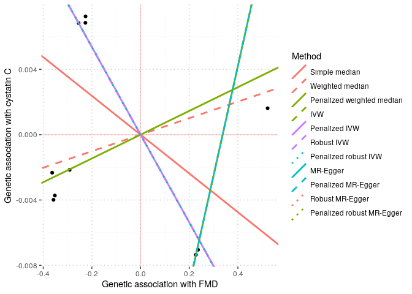
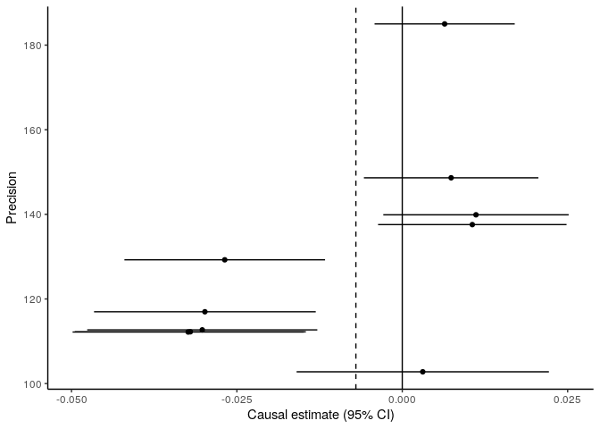
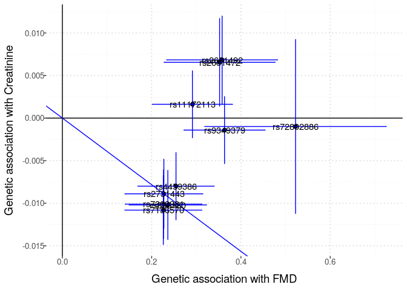
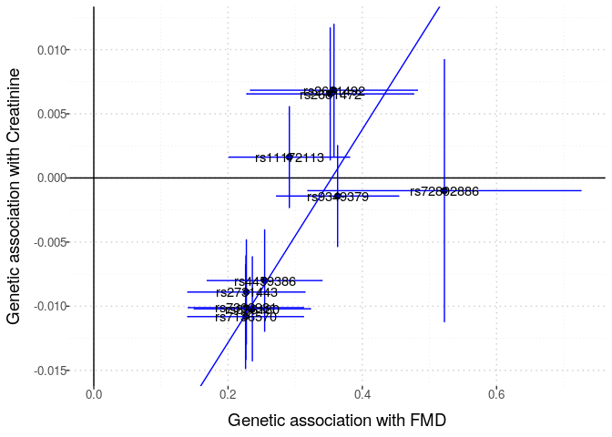
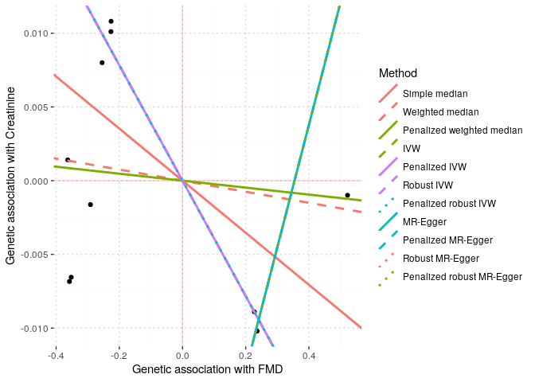
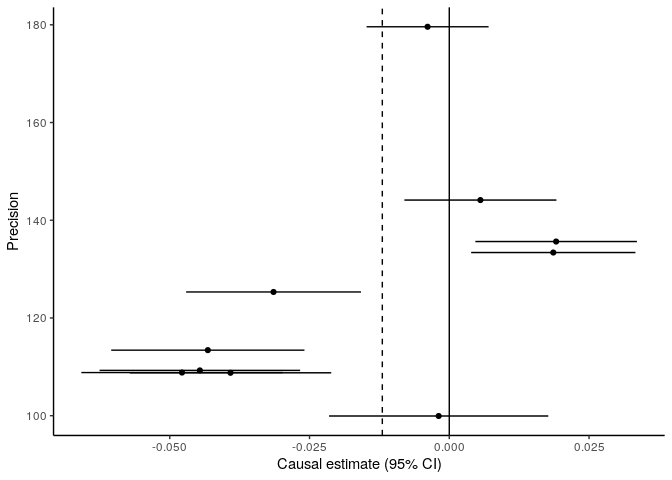

Exploring the creatinine GWAS summary statistics & FMD GWAS
meta-analysis summary statistics
================

We want to “explore” the two results files to see how many SNPs are
available in each, and to see how many SNPs are in both files. This
information will inform 2-sample MR studies to assess the causal effect
of FMD on creatinine levels.

First, we read into R the FMD summary statistics file.

``` r
#fmd_file <- here::here("data", "fmd_meta_gwas", 
#                        "meta_analyse_FMD_FUMA_FR_MAYO_DEFINE_POL_MGI_FEIRI_HRC_all_2020-08-12.tab")
fmd_file <- here::here("data", "fmd", "GCST90026612_buildGRCh37.tsv")
fmd_tib <- vroom::vroom(fmd_file)
```

    Rows: 5483710 Columns: 12
    ── Column specification ────────────────────────────────────────────────────────
    Delimiter: "\t"
    chr (3): SNP, OA, EA
    dbl (9): chromosome, base_pair_location, EAF, BETA, SE, p_value, Het_P, N_ca...

    ℹ Use `spec()` to retrieve the full column specification for this data.
    ℹ Specify the column types or set `show_col_types = FALSE` to quiet this message.

`fmd_tib` has the summary statistics in a different format. It has 12
columns in total:

“MarkerName” “rsID”  
“CHROM”  
“POS”  
“REF”  
“ALT”  
“P”  
“BETA”  
“SE”  
“N”  
“Rsq_min”  
“Rsq_max”

``` r
library(magrittr)
```

``` r
# https://cran.r-project.org/web/packages/LDlinkR/vignettes/LDlinkR.html
# follow steps at above url to use LDlinkR to get LD matrix for use with MendelianRandomization R pkg
ld_token <- "3fbdb0673b22"


remove_offdiagonal_ones <- function(symm_matrix, threshold = 0.9){
    nr <- nrow(symm_matrix)
    bad_list <- list()
    for (row in 1:nr){
        foo <- upper.tri(symm_matrix, diag = FALSE)[row,]
        bar <- symm_matrix[row, ] > threshold
        bad_list[[row]] <- which(foo & bar)
    }
    bad_indices <- unique(do.call("c", bad_list))
    if (length(bad_indices) == 0){
        return(symm_matrix)
    } else {
        out <- as.matrix(symm_matrix[- bad_indices, - bad_indices])
        rownames(out) <- colnames(out) <- colnames(symm_matrix)[- bad_indices]
        return(out)
    }
}
```

### Barton Cystatin C

``` r
barton_file <- here::here("data", "barton2021_cystatinC", "GCST90025945_buildGRCh37.tsv")
barton_tib <- vroom::vroom(barton_file)
```

    Rows: 5515075 Columns: 15
    ── Column specification ────────────────────────────────────────────────────────
    Delimiter: "\t"
    chr  (2): ALLELE1, ALLELE0
    dbl (13): chromosome, base_pair_location, GENPOS, A1FREQ, INFO, CHISQ_LINREG...

    ℹ Use `spec()` to retrieve the full column specification for this data.
    ℹ Specify the column types or set `show_col_types = FALSE` to quiet this message.

``` r
# find shared snps
small_dat_pre <- fmd_tib %>%
     dplyr::filter(p_value < 1e-6)  %>% # choose pvalue threshold     
     dplyr::inner_join(barton_tib, by = c("chromosome", "base_pair_location"))
# harmonised? 
small_dat <- small_dat_pre %>%
    dplyr::mutate(harmonised = OA == ALLELE0)
(all.equal(small_dat$harmonised, TRUE))
```

    [1] "Lengths (11, 1) differ (comparison on first 1 components)"

``` r
ld_list <- list()
for (chr in 1:22){
    fmd_onechr <- small_dat %>%
        dplyr::filter(chromosome == chr)
    if (nrow(fmd_onechr) > 1){
        foo <- LDlinkR::LDmatrix(fmd_onechr$SNP, 
                pop = "CEU", 
                r2d = "r2", 
                genome_build = "grch37",
                token = ld_token, 
                file = FALSE
                ) 
        
        bar <- foo %>% 
                    dplyr::select(-1) %>%
                    as.matrix() %>%
                    remove_offdiagonal_ones(threshold = 0.99)

        # remove rows & cols for highly correlated SNPs 

        ld_list[[chr]] <- bar
    }
    if (nrow(fmd_onechr) == 1){
        ld_list[[chr]] <- as.matrix(1)
        colnames(ld_list[[chr]]) <- fmd_onechr$SNP      
    }
    if (nrow(fmd_onechr) == 0){
        ld_list[[chr]] <- NA
    }
}
```


    LDlink server is working...

``` r
# remove NAs
ld_list_nona <- ld_list[!is.na(ld_list)]
ld_mat <- as.matrix(Matrix::bdiag(ld_list_nona))
rn <- do.call(c, lapply(ld_list_nona, colnames))
rownames(ld_mat) <- rn
colnames(ld_mat) <- rn
```

``` r
small_dat_no_ld <- small_dat %>%
    dplyr::filter(SNP %in% rownames(ld_mat))
```

``` r
input <- MendelianRandomization::mr_input(
            bx = small_dat_no_ld$BETA, 
            bxse = small_dat_no_ld$SE, 
            by = small_dat_no_ld$beta, 
            byse = small_dat_no_ld$standard_error,
            corr = ld_mat,
            exposure = "FMD",
            outcome = "cystatin C",
            snps = rownames(ld_mat)
        )
```

``` r
MendelianRandomization::mr_allmethods(input)
```

                        Method Estimate Std Error 95% CI         P-value
                 Simple median   -0.012     0.004  -0.020 -0.003   0.006
               Weighted median    0.005     0.004  -0.003  0.013   0.224
     Penalized weighted median    0.007     0.004   0.000  0.015   0.050
                                                                        
                           IVW   -0.027     0.004  -0.035 -0.019   0.000
                 Penalized IVW   -0.027     0.004  -0.035 -0.019   0.000
                    Robust IVW   -0.027     0.004  -0.035 -0.019   0.000
          Penalized robust IVW   -0.027     0.004  -0.035 -0.019   0.000
                                                                        
                      MR-Egger    0.067     0.013   0.041  0.093   0.000
                   (intercept)   -0.023     0.003  -0.029 -0.016   0.000
            Penalized MR-Egger    0.067     0.013   0.041  0.093   0.000
                   (intercept)   -0.023     0.003  -0.029 -0.016   0.000
               Robust MR-Egger    0.067     0.013   0.041  0.093   0.000
                   (intercept)   -0.023     0.003  -0.029 -0.016   0.000
     Penalized robust MR-Egger    0.067     0.013   0.041  0.093   0.000
                   (intercept)   -0.023     0.003  -0.029 -0.016   0.000

``` r
MendelianRandomization::mr_egger(input, correl = ld_mat)
```


    MR-Egger method
    (variants correlated, random-effect model)

    Number of Variants =  10 

    ------------------------------------------------------------------
          Method Estimate Std Error  95% CI        p-value
        MR-Egger    0.067     0.013  0.041,  0.093   0.000
     (intercept)   -0.023     0.003 -0.029, -0.016   0.000
    ------------------------------------------------------------------
    Residual Standard Error :  1.403 
    Heterogeneity test statistic = 15.7465 on 8 degrees of freedom, (p-value = 0.0462)

``` r
MendelianRandomization::mr_plot(input, interactive = FALSE, line = "ivw", labels = TRUE, orientate = TRUE)
```



``` r
MendelianRandomization::mr_plot(input, interactive = FALSE, line = "egger", labels = TRUE, orientate = TRUE)
```



``` r
MendelianRandomization::mr_plot(MendelianRandomization::mr_allmethods(input, method = "all"), 
                                interactive = FALSE, 
                                labels = TRUE, orientate = TRUE)
```



``` r
MendelianRandomization::mr_funnel(input)
```



## Barton Creatinine analysis

``` r
barton_file <- here::here("data", "barton2021_creatinine", "GCST90025946_buildGRCh37.tsv")
barton_tib <- vroom::vroom(barton_file)
```

    Rows: 5515075 Columns: 15
    ── Column specification ────────────────────────────────────────────────────────
    Delimiter: "\t"
    chr  (2): ALLELE1, ALLELE0
    dbl (13): chromosome, base_pair_location, GENPOS, A1FREQ, INFO, CHISQ_LINREG...

    ℹ Use `spec()` to retrieve the full column specification for this data.
    ℹ Specify the column types or set `show_col_types = FALSE` to quiet this message.

``` r
# find shared snps
small_dat_pre <- fmd_tib %>%
     dplyr::filter(p_value < 1e-6)  %>% # choose pvalue threshold     
     dplyr::inner_join(barton_tib, by = c("chromosome", "base_pair_location"))
# harmonised? 
small_dat <- small_dat_pre %>%
    dplyr::mutate(harmonised = OA == ALLELE0) 
(all.equal(small_dat$harmonised, TRUE))
```

    [1] "Lengths (11, 1) differ (comparison on first 1 components)"

``` r
ld_list <- list()
for (chr in 1:22){
    fmd_onechr <- small_dat %>%
        dplyr::filter(chromosome == chr)
    if (nrow(fmd_onechr) > 1){
        foo <- LDlinkR::LDmatrix(fmd_onechr$SNP, 
                pop = "CEU", 
                r2d = "r2", 
                genome_build = "grch37",
                token = ld_token, 
                file = FALSE
                ) 
        
        bar <- foo %>% 
                    dplyr::select(-1) %>%
                    as.matrix() %>%
                    remove_offdiagonal_ones(threshold = 0.99)

        # remove rows & cols for highly correlated SNPs 

        ld_list[[chr]] <- bar
    }
    if (nrow(fmd_onechr) == 1){
        ld_list[[chr]] <- as.matrix(1)
        colnames(ld_list[[chr]]) <- fmd_onechr$SNP
    }
    if (nrow(fmd_onechr) == 0){
        ld_list[[chr]] <- NA
    }
}
```


    LDlink server is working...

``` r
# remove NAs
ld_list_nona <- ld_list[!is.na(ld_list)]
ld_mat <- as.matrix(Matrix::bdiag(ld_list_nona))
rn <- do.call(c, lapply(ld_list_nona, colnames))
rownames(ld_mat) <- rn
colnames(ld_mat) <- rn
```

``` r
small_dat_no_ld <- small_dat %>%
    dplyr::filter(SNP %in% rownames(ld_mat))
```

``` r
input <- MendelianRandomization::mr_input(
            bx = small_dat_no_ld$BETA, 
            bxse = small_dat_no_ld$SE, 
            by = small_dat_no_ld$beta, 
            byse = small_dat_no_ld$standard_error,
            corr = ld_mat,
            exposure = "FMD",
            outcome = "Creatinine",
            snps = rownames(ld_mat)
        )
```

``` r
MendelianRandomization::mr_allmethods(input)
```

                        Method Estimate Std Error 95% CI         P-value
                 Simple median   -0.018     0.005  -0.027 -0.008   0.000
               Weighted median   -0.004     0.005  -0.013  0.006   0.444
     Penalized weighted median   -0.002     0.005  -0.012  0.007   0.613
                                                                        
                           IVW   -0.039     0.005  -0.049 -0.029   0.000
                 Penalized IVW   -0.039     0.005  -0.049 -0.029   0.000
                    Robust IVW   -0.039     0.005  -0.049 -0.029   0.000
          Penalized robust IVW   -0.039     0.005  -0.049 -0.029   0.000
                                                                        
                      MR-Egger    0.083     0.020   0.044  0.122   0.000
                   (intercept)   -0.029     0.005  -0.039 -0.020   0.000
            Penalized MR-Egger    0.083     0.020   0.044  0.122   0.000
                   (intercept)   -0.029     0.005  -0.039 -0.020   0.000
               Robust MR-Egger    0.083     0.020   0.044  0.122   0.000
                   (intercept)   -0.029     0.005  -0.039 -0.020   0.000
     Penalized robust MR-Egger    0.083     0.020   0.044  0.122   0.000
                   (intercept)   -0.029     0.005  -0.039 -0.020   0.000

``` r
MendelianRandomization::mr_egger(input, correl = ld_mat)
```


    MR-Egger method
    (variants correlated, random-effect model)

    Number of Variants =  10 

    ------------------------------------------------------------------
          Method Estimate Std Error  95% CI        p-value
        MR-Egger    0.083     0.020  0.044,  0.122   0.000
     (intercept)   -0.029     0.005 -0.039, -0.020   0.000
    ------------------------------------------------------------------
    Residual Standard Error :  2.003 
    Heterogeneity test statistic = 32.0863 on 8 degrees of freedom, (p-value = 1e-04)

``` r
MendelianRandomization::mr_plot(input, interactive = FALSE, line = "ivw", labels = TRUE, orientate = TRUE)
```



``` r
MendelianRandomization::mr_plot(input, interactive = FALSE, line = "egger", labels = TRUE, orientate = TRUE)
```



``` r
MendelianRandomization::mr_plot(MendelianRandomization::mr_allmethods(input, method = "all"), 
                                interactive = FALSE, 
                                labels = TRUE, orientate = TRUE)
```



``` r
MendelianRandomization::mr_funnel(input)
```


