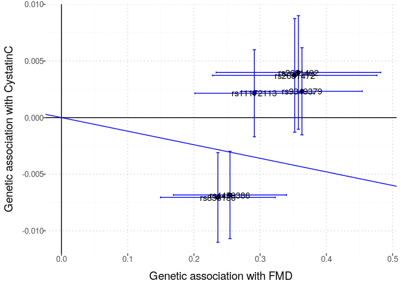
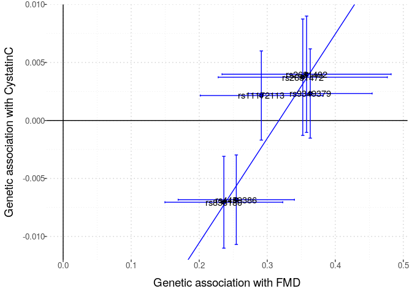
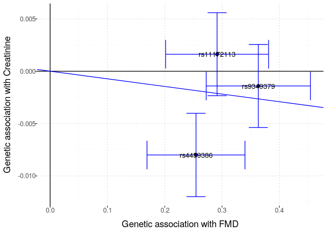

Barton et al. GWAS summary statistics & FMD GWAS meta-analysis summary
statistics
================
Fred Boehm

- <a href="#cystatinc-with-p-value-threshold-1e-06"
  id="toc-cystatinc-with-p-value-threshold-1e-06"><span
  class="toc-section-number">1</span>
  <code>CystatinC with p-value threshold:  1e-06</code></a>
- <a href="#cystatinc-with-p-value-threshold-1e-07"
  id="toc-cystatinc-with-p-value-threshold-1e-07"><span
  class="toc-section-number">2</span>
  <code>CystatinC with p-value threshold:  1e-07</code></a>
- <a href="#cystatinc-with-p-value-threshold-1e-08"
  id="toc-cystatinc-with-p-value-threshold-1e-08"><span
  class="toc-section-number">3</span>
  <code>CystatinC with p-value threshold:  1e-08</code></a>
- <a href="#creatinine-with-p-value-threshold-1e-06"
  id="toc-creatinine-with-p-value-threshold-1e-06"><span
  class="toc-section-number">4</span>
  <code>Creatinine with p-value threshold:  1e-06</code></a>
- <a href="#creatinine-with-p-value-threshold-1e-07"
  id="toc-creatinine-with-p-value-threshold-1e-07"><span
  class="toc-section-number">5</span>
  <code>Creatinine with p-value threshold:  1e-07</code></a>
- <a href="#creatinine-with-p-value-threshold-1e-08"
  id="toc-creatinine-with-p-value-threshold-1e-08"><span
  class="toc-section-number">6</span>
  <code>Creatinine with p-value threshold:  1e-08</code></a>

We want to “explore” the two results files to see how many SNPs are
available in each, and to see how many SNPs are in both files. This
information will inform 2-sample MR studies to assess the causal effect
of FMD on creatinine levels.

First, we read into R the FMD summary statistics file.

``` r
fmd_file <- here::here("data", "fmd", "GCST90026612_buildGRCh37.tsv")
fmd_tib <- vroom::vroom(fmd_file)
```

    Rows: 5483710 Columns: 12
    ── Column specification ────────────────────────────────────────────────────────
    Delimiter: "\t"
    chr (3): SNP, OA, EA
    dbl (9): chromosome, base_pair_location, EAF, BETA, SE, p_value, Het_P, N_ca...

    ℹ Use `spec()` to retrieve the full column specification for this data.
    ℹ Specify the column types or set `show_col_types = FALSE` to quiet this message.

``` r
library(magrittr)
```

``` r
# https://cran.r-project.org/web/packages/LDlinkR/vignettes/LDlinkR.html
# follow steps at above url to use LDlinkR to get LD matrix for use with MendelianRandomization R pkg
ld_token <- "3fbdb0673b22"
# define function
remove_offdiagonal_ones <- function(symm_matrix, threshold = 0.9){
    nr <- nrow(symm_matrix)
    bad_list <- list()
    for (row in 1:nr){
        foo <- upper.tri(symm_matrix, diag = FALSE)[row,]
        bar <- symm_matrix[row, ] > threshold
        bad_list[[row]] <- which(foo & bar)
    }
    bad_indices <- unique(do.call("c", bad_list))
    if (length(bad_indices) == 0){
        return(symm_matrix)
    } else {
        out <- as.matrix(symm_matrix[- bad_indices, - bad_indices])
        rownames(out) <- colnames(out) <- colnames(symm_matrix)[- bad_indices]
        return(out)
    }
}
```

``` r
outcomes <- c("CystatinC", "Creatinine")
p_thresholds <- c(1e-06, 1e-07, 1e-08)
ld_file <- here::here("data", "fmd", "ld_matrix.rds")
for (outcome in outcomes){
    for (p_threshold in p_thresholds){
        if (outcome == "CystatinC"){
            barton_file <- here::here("data", "barton2021_cystatinC", "GCST90025945_buildGRCh37.tsv")
        }
        if (outcome == "Creatinine"){
            barton_file <- here::here("data", "barton2021_creatinine", "GCST90025946_buildGRCh37.tsv")
        }
        barton_tib <- vroom::vroom(barton_file)
        # find shared snps
        small_dat_pre <- fmd_tib %>%
            dplyr::filter(p_value < p_threshold)  %>% # choose pvalue threshold     
            dplyr::inner_join(barton_tib, by = c("chromosome", "base_pair_location"))
        # harmonised? 
        small_dat <- small_dat_pre %>%
            dplyr::mutate(harmonised = OA == ALLELE0)
        (all.equal(small_dat$harmonised, rep(TRUE, length(small_dat$harmonised))))
        # make ld matrix if ld_file doesn't exist
        if (file.exists(ld_file)){
            ld_mat <- readRDS(ld_file)
        } else {
            ld_list <- list()
            pt <- min(p_thresholds)
            for (chr in 1:22){
                fmd_onechr <- small_dat %>%
                    dplyr::filter(chromosome == chr)
                if (nrow(fmd_onechr) > 1){
                    foo <- LDlinkR::LDmatrix(fmd_onechr$SNP, 
                            pop = "CEU", 
                            r2d = "r2", 
                            genome_build = "grch37",
                            token = ld_token, 
                            file = FALSE
                            ) 
                    
                    bar <- foo %>% 
                                dplyr::select(-1) %>%
                                as.matrix() %>%
                                remove_offdiagonal_ones(threshold = 0.99)

                    # remove rows & cols for highly correlated SNPs 

                    ld_list[[chr]] <- bar
                }
                if (nrow(fmd_onechr) == 1){
                    ld_list[[chr]] <- as.matrix(1)
                    colnames(ld_list[[chr]]) <- fmd_onechr$SNP      
                }
                if (nrow(fmd_onechr) == 0){
                    ld_list[[chr]] <- NA
                }
            }
            # remove NAs
            ld_list_nona <- ld_list[!is.na(ld_list)]
            ld_mat <- as.matrix(Matrix::bdiag(ld_list_nona))
            rn <- do.call(c, lapply(ld_list_nona, colnames))
            rownames(ld_mat) <- rn
            colnames(ld_mat) <- rn
            # save ld matrix
            saveRDS(ld_mat, ld_file)
        }

        # filter to remove highly correlated SNPs
        small_dat_no_ld <- small_dat %>%
            dplyr::filter(SNP %in% rownames(ld_mat))
        ld_mat_small <- ld_mat[rownames(ld_mat) %in% small_dat_no_ld$SNP, 
                               colnames(ld_mat) %in% small_dat_no_ld$SNP]
        print(nrow(small_dat_no_ld))
        # make input object
        input <- MendelianRandomization::mr_input(
                    bx = small_dat_no_ld$BETA, 
                    bxse = small_dat_no_ld$SE, 
                    by = small_dat_no_ld$beta, 
                    byse = small_dat_no_ld$standard_error,
                    corr = ld_mat_small,
                    exposure = "FMD",
                    outcome = outcome,
                    snps = rownames(ld_mat_small)
                )
        # make header for collection of graphs for each iteration of loop
        cat('\n\n## `', outcome, "with p-value threshold: ", p_threshold, '`\n\n')    
        # MR analyses   
        result <- MendelianRandomization::mr_allmethods(input)
        result@Values %>% 
            dplyr::mutate_if(is.numeric, signif, digits = 2) %>%
            dplyr::mutate("Number of SNPs" = length(result@Data@snps)) %>%
            dplyr::rename("95% CI lower" = 4, "95% CI upper" = 5) %>%
            knitr::kable() %>%
            print()
        ivw_res <- MendelianRandomization::mr_ivw(input, correl = TRUE)
        egger_res <- MendelianRandomization::mr_egger(input, correl = TRUE)

        # MR plots
        MendelianRandomization::mr_plot(input, interactive = FALSE, line = "ivw", labels = TRUE, orientate = TRUE) %>%
            print()
        MendelianRandomization::mr_plot(input, interactive = FALSE, line = "egger", labels = TRUE, orientate = TRUE) %>%
            print()
    }
}
```

    Rows: 5515075 Columns: 15
    ── Column specification ────────────────────────────────────────────────────────
    Delimiter: "\t"
    chr  (2): ALLELE1, ALLELE0
    dbl (13): chromosome, base_pair_location, GENPOS, A1FREQ, INFO, CHISQ_LINREG...

    ℹ Use `spec()` to retrieve the full column specification for this data.
    ℹ Specify the column types or set `show_col_types = FALSE` to quiet this message.

\[1\] 10

## `CystatinC with p-value threshold:  1e-06`

| Method                    | Estimate | Std Error | 95% CI lower | 95% CI upper | P-value | Number of SNPs |
|:--------------------------|---------:|----------:|-------------:|-------------:|--------:|---------------:|
| Simple median             |  -0.0120 |    0.0043 |     -2.0e-02 |      -0.0034 | 5.8e-03 |             10 |
| Weighted median           |   0.0051 |    0.0042 |     -3.1e-03 |       0.0130 | 2.2e-01 |             10 |
| Penalized weighted median |   0.0073 |    0.0037 |      5.9e-06 |       0.0150 | 5.0e-02 |             10 |
| IVW                       |  -0.0270 |    0.0039 |     -3.5e-02 |      -0.0190 | 0.0e+00 |             10 |
| Penalized IVW             |  -0.0270 |    0.0039 |     -3.5e-02 |      -0.0190 | 0.0e+00 |             10 |
| Robust IVW                |  -0.0270 |    0.0039 |     -3.5e-02 |      -0.0190 | 0.0e+00 |             10 |
| Penalized robust IVW      |  -0.0270 |    0.0039 |     -3.5e-02 |      -0.0190 | 0.0e+00 |             10 |
| MR-Egger                  |   0.0670 |    0.0130 |      4.1e-02 |       0.0930 | 6.0e-07 |             10 |
| (intercept)               |  -0.0230 |    0.0032 |     -2.9e-02 |      -0.0160 | 0.0e+00 |             10 |
| Penalized MR-Egger        |   0.0670 |    0.0130 |      4.1e-02 |       0.0930 | 6.0e-07 |             10 |
| (intercept)               |  -0.0230 |    0.0032 |     -2.9e-02 |      -0.0160 | 0.0e+00 |             10 |
| Robust MR-Egger           |   0.0670 |    0.0130 |      4.1e-02 |       0.0930 | 6.0e-07 |             10 |
| (intercept)               |  -0.0230 |    0.0032 |     -2.9e-02 |      -0.0160 | 0.0e+00 |             10 |
| Penalized robust MR-Egger |   0.0670 |    0.0130 |      4.1e-02 |       0.0930 | 6.0e-07 |             10 |
| (intercept)               |  -0.0230 |    0.0032 |     -2.9e-02 |      -0.0160 | 0.0e+00 |             10 |

<div class="cell-output-display">


</div>

    Rows: 5515075 Columns: 15
    ── Column specification ────────────────────────────────────────────────────────
    Delimiter: "\t"
    chr  (2): ALLELE1, ALLELE0
    dbl (13): chromosome, base_pair_location, GENPOS, A1FREQ, INFO, CHISQ_LINREG...

    ℹ Use `spec()` to retrieve the full column specification for this data.
    ℹ Specify the column types or set `show_col_types = FALSE` to quiet this message.

<div class="cell-output-display">


</div>

\[1\] 6

## `CystatinC with p-value threshold:  1e-07`

| Method                    | Estimate | Std Error | 95% CI lower | 95% CI upper | P-value | Number of SNPs |
|:--------------------------|---------:|----------:|-------------:|-------------:|--------:|---------------:|
| Simple median             |   0.0069 |    0.0039 |     -0.00066 |       0.0140 | 7.3e-02 |              6 |
| Weighted median           |   0.0069 |    0.0038 |     -0.00058 |       0.0140 | 7.1e-02 |              6 |
| Penalized weighted median |   0.0077 |    0.0038 |      0.00029 |       0.0150 | 4.2e-02 |              6 |
| IVW                       |  -0.0120 |    0.0081 |     -0.02800 |       0.0039 | 1.4e-01 |              6 |
| Penalized IVW             |  -0.0120 |    0.0081 |     -0.02800 |       0.0039 | 1.4e-01 |              6 |
| Robust IVW                |  -0.0120 |    0.0081 |     -0.02800 |       0.0039 | 1.4e-01 |              6 |
| Penalized robust IVW      |  -0.0120 |    0.0081 |     -0.02800 |       0.0039 | 1.4e-01 |              6 |
| MR-Egger                  |   0.0900 |    0.0190 |      0.05200 |       0.1300 | 3.5e-06 |              6 |
| (intercept)               |  -0.0290 |    0.0054 |     -0.03900 |      -0.0180 | 1.0e-07 |              6 |
| Penalized MR-Egger        |   0.0900 |    0.0190 |      0.05200 |       0.1300 | 3.5e-06 |              6 |
| (intercept)               |  -0.0290 |    0.0054 |     -0.03900 |      -0.0180 | 1.0e-07 |              6 |
| Robust MR-Egger           |   0.0900 |    0.0190 |      0.05200 |       0.1300 | 3.5e-06 |              6 |
| (intercept)               |  -0.0290 |    0.0054 |     -0.03900 |      -0.0180 | 1.0e-07 |              6 |
| Penalized robust MR-Egger |   0.0900 |    0.0190 |      0.05200 |       0.1300 | 3.5e-06 |              6 |
| (intercept)               |  -0.0290 |    0.0054 |     -0.03900 |      -0.0180 | 1.0e-07 |              6 |

<div class="cell-output-display">



</div>

    Rows: 5515075 Columns: 15
    ── Column specification ────────────────────────────────────────────────────────
    Delimiter: "\t"
    chr  (2): ALLELE1, ALLELE0
    dbl (13): chromosome, base_pair_location, GENPOS, A1FREQ, INFO, CHISQ_LINREG...

    ℹ Use `spec()` to retrieve the full column specification for this data.
    ℹ Specify the column types or set `show_col_types = FALSE` to quiet this message.

<div class="cell-output-display">



</div>

\[1\] 3

## `CystatinC with p-value threshold:  1e-08`

| Method                    | Estimate | Std Error | 95% CI lower | 95% CI upper | P-value | Number of SNPs |
|:--------------------------|---------:|----------:|-------------:|-------------:|--------:|---------------:|
| Simple median             |  0.00640 |    0.0051 |      -0.0036 |       0.0160 |    0.21 |              3 |
| Weighted median           |  0.00650 |    0.0047 |      -0.0026 |       0.0160 |    0.16 |              3 |
| Penalized weighted median |  0.00680 |    0.0045 |      -0.0020 |       0.0160 |    0.13 |              3 |
| IVW                       | -0.00085 |    0.0037 |      -0.0081 |       0.0064 |    0.82 |              3 |
| Penalized IVW             | -0.00085 |    0.0037 |      -0.0081 |       0.0064 |    0.82 |              3 |
| Robust IVW                | -0.00085 |    0.0037 |      -0.0081 |       0.0064 |    0.82 |              3 |
| Penalized robust IVW      | -0.00085 |    0.0037 |      -0.0081 |       0.0064 |    0.82 |              3 |
| MR-Egger                  |  0.07300 |    0.0610 |      -0.0460 |       0.1900 |    0.23 |              3 |
| (intercept)               | -0.02300 |    0.0190 |      -0.0600 |       0.0140 |    0.22 |              3 |
| Penalized MR-Egger        |  0.07300 |    0.0610 |      -0.0460 |       0.1900 |    0.23 |              3 |
| (intercept)               | -0.02300 |    0.0190 |      -0.0600 |       0.0140 |    0.22 |              3 |
| Robust MR-Egger           |  0.07300 |    0.0610 |      -0.0460 |       0.1900 |    0.23 |              3 |
| (intercept)               | -0.02300 |    0.0190 |      -0.0600 |       0.0140 |    0.22 |              3 |
| Penalized robust MR-Egger |  0.07300 |    0.0610 |      -0.0460 |       0.1900 |    0.23 |              3 |
| (intercept)               | -0.02300 |    0.0190 |      -0.0600 |       0.0140 |    0.22 |              3 |

<div class="cell-output-display">


</div>

    Rows: 5515075 Columns: 15
    ── Column specification ────────────────────────────────────────────────────────
    Delimiter: "\t"
    chr  (2): ALLELE1, ALLELE0
    dbl (13): chromosome, base_pair_location, GENPOS, A1FREQ, INFO, CHISQ_LINREG...

    ℹ Use `spec()` to retrieve the full column specification for this data.
    ℹ Specify the column types or set `show_col_types = FALSE` to quiet this message.

<div class="cell-output-display">


</div>

\[1\] 10

## `Creatinine with p-value threshold:  1e-06`

| Method                    | Estimate | Std Error | 95% CI lower | 95% CI upper | P-value | Number of SNPs |
|:--------------------------|---------:|----------:|-------------:|-------------:|--------:|---------------:|
| Simple median             |  -0.0180 |    0.0048 |       -0.027 |      -0.0083 | 2.2e-04 |             10 |
| Weighted median           |  -0.0038 |    0.0049 |       -0.013 |       0.0059 | 4.4e-01 |             10 |
| Penalized weighted median |  -0.0024 |    0.0047 |       -0.012 |       0.0068 | 6.1e-01 |             10 |
| IVW                       |  -0.0390 |    0.0052 |       -0.049 |      -0.0290 | 0.0e+00 |             10 |
| Penalized IVW             |  -0.0390 |    0.0052 |       -0.049 |      -0.0290 | 0.0e+00 |             10 |
| Robust IVW                |  -0.0390 |    0.0052 |       -0.049 |      -0.0290 | 0.0e+00 |             10 |
| Penalized robust IVW      |  -0.0390 |    0.0052 |       -0.049 |      -0.0290 | 0.0e+00 |             10 |
| MR-Egger                  |   0.0830 |    0.0200 |        0.044 |       0.1200 | 2.4e-05 |             10 |
| (intercept)               |  -0.0290 |    0.0047 |       -0.039 |      -0.0200 | 0.0e+00 |             10 |
| Penalized MR-Egger        |   0.0830 |    0.0200 |        0.044 |       0.1200 | 2.4e-05 |             10 |
| (intercept)               |  -0.0290 |    0.0047 |       -0.039 |      -0.0200 | 0.0e+00 |             10 |
| Robust MR-Egger           |   0.0830 |    0.0200 |        0.044 |       0.1200 | 2.4e-05 |             10 |
| (intercept)               |  -0.0290 |    0.0047 |       -0.039 |      -0.0200 | 0.0e+00 |             10 |
| Penalized robust MR-Egger |   0.0830 |    0.0200 |        0.044 |       0.1200 | 2.4e-05 |             10 |
| (intercept)               |  -0.0290 |    0.0047 |       -0.039 |      -0.0200 | 0.0e+00 |             10 |

<div class="cell-output-display">


</div>

    Rows: 5515075 Columns: 15
    ── Column specification ────────────────────────────────────────────────────────
    Delimiter: "\t"
    chr  (2): ALLELE1, ALLELE0
    dbl (13): chromosome, base_pair_location, GENPOS, A1FREQ, INFO, CHISQ_LINREG...

    ℹ Use `spec()` to retrieve the full column specification for this data.
    ℹ Specify the column types or set `show_col_types = FALSE` to quiet this message.

<div class="cell-output-display">


</div>

\[1\] 6

## `Creatinine with p-value threshold:  1e-07`

| Method                    | Estimate | Std Error | 95% CI lower | 95% CI upper | P-value | Number of SNPs |
|:--------------------------|---------:|----------:|-------------:|-------------:|--------:|---------------:|
| Simple median             |  0.00084 |    0.0043 |      -0.0075 |      0.00920 | 0.84000 |              6 |
| Weighted median           |  0.00120 |    0.0043 |      -0.0073 |      0.00960 | 0.78000 |              6 |
| Penalized weighted median |  0.00210 |    0.0050 |      -0.0076 |      0.01200 | 0.68000 |              6 |
| IVW                       | -0.01800 |    0.0098 |      -0.0370 |      0.00095 | 0.06300 |              6 |
| Penalized IVW             | -0.01800 |    0.0098 |      -0.0370 |      0.00095 | 0.06300 |              6 |
| Robust IVW                | -0.01800 |    0.0098 |      -0.0370 |      0.00095 | 0.06300 |              6 |
| Penalized robust IVW      | -0.01800 |    0.0098 |      -0.0370 |      0.00095 | 0.06300 |              6 |
| MR-Egger                  |  0.09800 |    0.0310 |       0.0380 |      0.16000 | 0.00140 |              6 |
| (intercept)               | -0.03300 |    0.0085 |      -0.0490 |     -0.01600 | 0.00013 |              6 |
| Penalized MR-Egger        |  0.09800 |    0.0310 |       0.0380 |      0.16000 | 0.00140 |              6 |
| (intercept)               | -0.03300 |    0.0085 |      -0.0490 |     -0.01600 | 0.00013 |              6 |
| Robust MR-Egger           |  0.09800 |    0.0310 |       0.0380 |      0.16000 | 0.00140 |              6 |
| (intercept)               | -0.03300 |    0.0085 |      -0.0490 |     -0.01600 | 0.00013 |              6 |
| Penalized robust MR-Egger |  0.09800 |    0.0310 |       0.0380 |      0.16000 | 0.00140 |              6 |
| (intercept)               | -0.03300 |    0.0085 |      -0.0490 |     -0.01600 | 0.00013 |              6 |

<div class="cell-output-display">


</div>

    Rows: 5515075 Columns: 15
    ── Column specification ────────────────────────────────────────────────────────
    Delimiter: "\t"
    chr  (2): ALLELE1, ALLELE0
    dbl (13): chromosome, base_pair_location, GENPOS, A1FREQ, INFO, CHISQ_LINREG...

    ℹ Use `spec()` to retrieve the full column specification for this data.
    ℹ Specify the column types or set `show_col_types = FALSE` to quiet this message.

<div class="cell-output-display">


</div>

\[1\] 3

## `Creatinine with p-value threshold:  1e-08`

| Method                    | Estimate | Std Error | 95% CI lower | 95% CI upper | P-value | Number of SNPs |
|:--------------------------|---------:|----------:|-------------:|-------------:|--------:|---------------:|
| Simple median             |  -0.0039 |    0.0054 |      -0.0140 |      0.00670 |   0.470 |              3 |
| Weighted median           |  -0.0030 |    0.0051 |      -0.0130 |      0.00690 |   0.560 |              3 |
| Penalized weighted median |  -0.0002 |    0.0046 |      -0.0092 |      0.00880 |   0.970 |              3 |
| IVW                       |  -0.0073 |    0.0038 |      -0.0150 |      0.00021 |   0.057 |              3 |
| Penalized IVW             |  -0.0073 |    0.0038 |      -0.0150 |      0.00021 |   0.057 |              3 |
| Robust IVW                |  -0.0073 |    0.0038 |      -0.0150 |      0.00021 |   0.057 |              3 |
| Penalized robust IVW      |  -0.0073 |    0.0038 |      -0.0150 |      0.00021 |   0.057 |              3 |
| MR-Egger                  |   0.0470 |    0.0760 |      -0.1000 |      0.20000 |   0.540 |              3 |
| (intercept)               |  -0.0170 |    0.0230 |      -0.0630 |      0.02900 |   0.480 |              3 |
| Penalized MR-Egger        |   0.0470 |    0.0760 |      -0.1000 |      0.20000 |   0.540 |              3 |
| (intercept)               |  -0.0170 |    0.0230 |      -0.0630 |      0.02900 |   0.480 |              3 |
| Robust MR-Egger           |   0.0470 |    0.0760 |      -0.1000 |      0.20000 |   0.540 |              3 |
| (intercept)               |  -0.0170 |    0.0230 |      -0.0630 |      0.02900 |   0.480 |              3 |
| Penalized robust MR-Egger |   0.0470 |    0.0760 |      -0.1000 |      0.20000 |   0.540 |              3 |
| (intercept)               |  -0.0170 |    0.0230 |      -0.0630 |      0.02900 |   0.480 |              3 |

<div class="cell-output-display">



</div>

<div class="cell-output-display">


</div>
