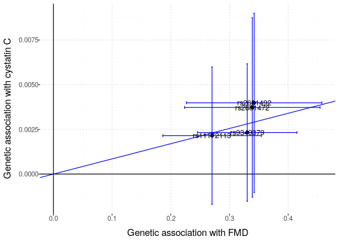
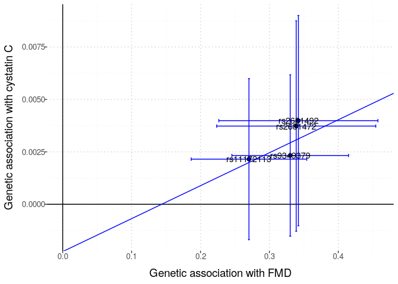
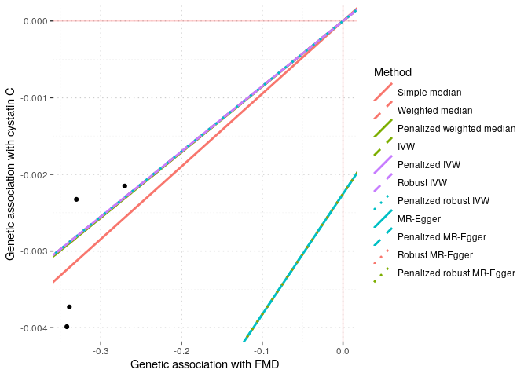
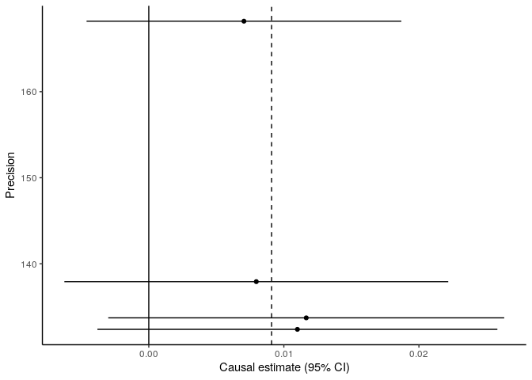
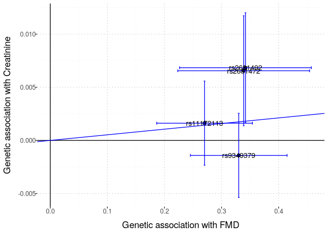
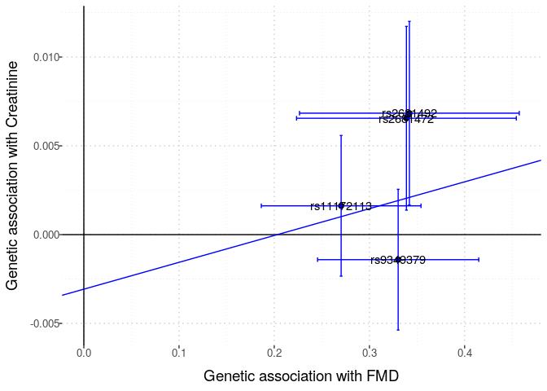
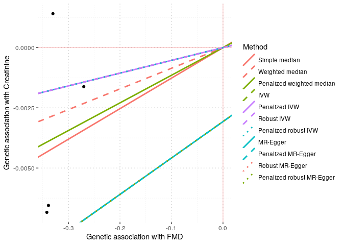
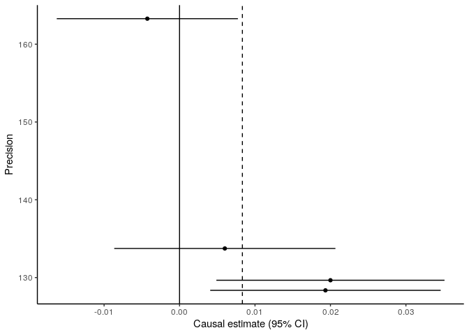

Exploring the creatinine GWAS summary statistics & FMD GWAS
meta-analysis summary statistics
================

We want to “explore” the two results files to see how many SNPs are
available in each, and to see how many SNPs are in both files. This
information will inform 2-sample MR studies to assess the causal effect
of FMD on creatinine levels.

First, we read into R the creatinine summary statistics file.

``` r
fmd_file <- here::here("data", "fmd_meta_gwas", 
                        "meta_analyse_FMD_FUMA_FR_MAYO_DEFINE_POL_MGI_FEIRI_HRC_all_2020-08-12.tab")
fmd_tib <- vroom::vroom(fmd_file)
```

    Rows: 6477066 Columns: 12
    ── Column specification ────────────────────────────────────────────────────────
    Delimiter: "\t"
    chr (4): MarkerName, rsID, REF, ALT
    dbl (8): CHROM, POS, P, BETA, SE, N, Rsq_min, Rsq_max

    ℹ Use `spec()` to retrieve the full column specification for this data.
    ℹ Specify the column types or set `show_col_types = FALSE` to quiet this message.

`fmd_tib` has the summary statistics in a different format. It has 12
columns in total:

“MarkerName” “rsID”  
“CHROM”  
“POS”  
“REF”  
“ALT”  
“P”  
“BETA”  
“SE”  
“N”  
“Rsq_min”  
“Rsq_max”

``` r
library(magrittr)
```

``` r
# https://cran.r-project.org/web/packages/LDlinkR/vignettes/LDlinkR.html
# follow steps at above url to use LDlinkR to get LD matrix for use with MendelianRandomization R pkg
ld_token <- "3fbdb0673b22"


remove_offdiagonal_ones <- function(symm_matrix, threshold = 0.9){
    nr <- nrow(symm_matrix)
    bad_list <- list()
    for (row in 1:nr){
        foo <- upper.tri(symm_matrix, diag = FALSE)[row,]
        bar <- symm_matrix[row, ] > threshold
        bad_list[[row]] <- which(foo & bar)
    }
    bad_indices <- unique(do.call("c", bad_list))
    if (length(bad_indices) == 0){
        return(symm_matrix)
    } else {
        out <- as.matrix(symm_matrix[- bad_indices, - bad_indices])
        rownames(out) <- colnames(out) <- colnames(symm_matrix)[- bad_indices]
        return(out)
    }
}
```

### Barton Cystatin C

``` r
barton_file <- here::here("data", "barton2021_cystatinC", "GCST90025945_buildGRCh37.tsv")
barton_tib <- vroom::vroom(barton_file)
```

    Rows: 5515075 Columns: 15
    ── Column specification ────────────────────────────────────────────────────────
    Delimiter: "\t"
    chr  (2): ALLELE1, ALLELE0
    dbl (13): chromosome, base_pair_location, GENPOS, A1FREQ, INFO, CHISQ_LINREG...

    ℹ Use `spec()` to retrieve the full column specification for this data.
    ℹ Specify the column types or set `show_col_types = FALSE` to quiet this message.

``` r
# find shared snps
small_dat <- fmd_tib %>%
     dplyr::inner_join(barton_tib, by = c("CHROM" = "chromosome", "POS" = "base_pair_location")) %>%
     dplyr::filter(P < 1e-8)  # choose pvalue threshold     

# harmonised? 
small_dat %>%
    dplyr::filter(REF == ALLELE0) # same 7 rows
```

    # A tibble: 5 × 25
      MarkerName rsID  CHROM    POS REF   ALT          P   BETA     SE     N Rsq_min
      <chr>      <chr> <dbl>  <dbl> <chr> <chr>    <dbl>  <dbl>  <dbl> <dbl>   <dbl>
    1 6:1290395… rs93…     6 1.29e7 A     G     2.04e-14 -0.330 0.0432  9062   0.815
    2 12:575272… rs11…    12 5.75e7 T     C     2.64e-10 -0.270 0.0428  9062   0.875
    3 12:900089… rs26…    12 9.00e7 A     G     8.68e- 9 -0.339 0.0589  9062   0.968
    4 12:900130… rs26…    12 9.00e7 T     C     6.52e- 9 -0.342 0.0589  9062   0.968
    5 12:900605… rs17…    12 9.01e7 G     A     5.92e- 9 -0.344 0.059   9062   0.985
    # … with 14 more variables: Rsq_max <dbl>, GENPOS <dbl>, ALLELE1 <chr>,
    #   ALLELE0 <chr>, A1FREQ <dbl>, INFO <dbl>, CHISQ_LINREG <dbl>,
    #   P_LINREG <dbl>, beta <dbl>, standard_error <dbl>, CHISQ_BOLT_LMM_INF <dbl>,
    #   P_BOLT_LMM_INF <dbl>, CHISQ_BOLT_LMM <dbl>, p_value <dbl>

``` r
ld_list <- list()
for (chr in 1:22){
    fmd_onechr <- small_dat %>%
        dplyr::filter(CHROM == chr)
    if (nrow(fmd_onechr) > 1){
        foo <- LDlinkR::LDmatrix(fmd_onechr$rsID, 
                pop = "CEU", 
                r2d = "r2", 
                genome_build = "grch37",
                token = ld_token, 
                file = FALSE
                ) 
        
        bar <- foo %>% 
                    dplyr::select(-1) %>%
                    as.matrix() %>%
                    remove_offdiagonal_ones(threshold = 0.99)

        # remove rows & cols for highly correlated SNPs 

        ld_list[[chr]] <- bar
    }
    if (nrow(fmd_onechr) == 1){
        ld_list[[chr]] <- as.matrix(1)
        colnames(ld_list[[chr]]) <- fmd_onechr$rsID       
    }
    if (nrow(fmd_onechr) == 0){
        ld_list[[chr]] <- NA
    }
}
```


    LDlink server is working...

``` r
# remove NAs
ld_list_nona <- ld_list[!is.na(ld_list)]
ld_mat <- as.matrix(Matrix::bdiag(ld_list_nona))
rn <- do.call(c, lapply(ld_list_nona, colnames))
rownames(ld_mat) <- rn
colnames(ld_mat) <- rn
```

``` r
small_dat_no_ld <- small_dat %>%
    dplyr::filter(rsID %in% rownames(ld_mat))
```

``` r
input <- MendelianRandomization::mr_input(
            bx = small_dat_no_ld$BETA, 
            bxse = small_dat_no_ld$SE, 
            by = small_dat_no_ld$beta, 
            byse = small_dat_no_ld$standard_error,
            corr = ld_mat,
            exposure = "FMD",
            outcome = "cystatin C",
            snps = rownames(ld_mat)
        )
```

``` r
MendelianRandomization::mr_allmethods(input)
```

                        Method Estimate Std Error 95% CI        P-value
                 Simple median    0.009     0.004   0.001 0.018   0.021
               Weighted median    0.009     0.004   0.001 0.017   0.037
     Penalized weighted median    0.009     0.004   0.001 0.017   0.037
                                                                       
                           IVW    0.009     0.004   0.001 0.016   0.030
                 Penalized IVW    0.009     0.004   0.001 0.016   0.030
                    Robust IVW    0.009     0.004   0.001 0.016   0.030
          Penalized robust IVW    0.009     0.004   0.001 0.016   0.030
                                                                       
                      MR-Egger    0.016     0.038  -0.059 0.091   0.681
                   (intercept)   -0.002     0.012  -0.026 0.021   0.850
            Penalized MR-Egger    0.016     0.038  -0.059 0.091   0.681
                   (intercept)   -0.002     0.012  -0.026 0.021   0.850
               Robust MR-Egger    0.016     0.038  -0.059 0.091   0.681
                   (intercept)   -0.002     0.012  -0.026 0.021   0.850
     Penalized robust MR-Egger    0.016     0.038  -0.059 0.091   0.681
                   (intercept)   -0.002     0.012  -0.026 0.021   0.850

``` r
MendelianRandomization::mr_egger(input, correl = ld_mat)
```


    MR-Egger method
    (variants correlated, random-effect model)

    Number of Variants =  4 

    ------------------------------------------------------------------
          Method Estimate Std Error  95% CI       p-value
        MR-Egger    0.016     0.038 -0.059, 0.091   0.681
     (intercept)   -0.002     0.012 -0.026, 0.021   0.850
    ------------------------------------------------------------------
    Residual Standard Error :  0.364 
    Residual standard error is set to 1 in calculation of confidence interval when its estimate is less than 1.
    Heterogeneity test statistic = 0.2657 on 2 degrees of freedom, (p-value = 0.8756)

``` r
MendelianRandomization::mr_plot(input, interactive = FALSE, line = "ivw", labels = TRUE, orientate = TRUE)
```



``` r
MendelianRandomization::mr_plot(input, interactive = FALSE, line = "egger", labels = TRUE, orientate = TRUE)
```



``` r
MendelianRandomization::mr_plot(MendelianRandomization::mr_allmethods(input, method = "all"), 
                                interactive = FALSE, 
                                labels = TRUE, orientate = TRUE)
```



``` r
MendelianRandomization::mr_funnel(input)
```



## Barton Creatinine analysis

``` r
barton_file <- here::here("data", "barton2021_creatinine", "GCST90025946_buildGRCh37.tsv")
barton_tib <- vroom::vroom(barton_file)
```

    Rows: 5515075 Columns: 15
    ── Column specification ────────────────────────────────────────────────────────
    Delimiter: "\t"
    chr  (2): ALLELE1, ALLELE0
    dbl (13): chromosome, base_pair_location, GENPOS, A1FREQ, INFO, CHISQ_LINREG...

    ℹ Use `spec()` to retrieve the full column specification for this data.
    ℹ Specify the column types or set `show_col_types = FALSE` to quiet this message.

``` r
# find shared snps
small_dat <- fmd_tib %>%
     dplyr::inner_join(barton_tib, by = c("CHROM" = "chromosome", "POS" = "base_pair_location")) %>%
     dplyr::filter(P < 1e-8) # choose pvalue threshold     
# harmonised? 
small_dat %>%
    dplyr::filter(REF == ALLELE0) 
```

    # A tibble: 5 × 25
      MarkerName rsID  CHROM    POS REF   ALT          P   BETA     SE     N Rsq_min
      <chr>      <chr> <dbl>  <dbl> <chr> <chr>    <dbl>  <dbl>  <dbl> <dbl>   <dbl>
    1 6:1290395… rs93…     6 1.29e7 A     G     2.04e-14 -0.330 0.0432  9062   0.815
    2 12:575272… rs11…    12 5.75e7 T     C     2.64e-10 -0.270 0.0428  9062   0.875
    3 12:900089… rs26…    12 9.00e7 A     G     8.68e- 9 -0.339 0.0589  9062   0.968
    4 12:900130… rs26…    12 9.00e7 T     C     6.52e- 9 -0.342 0.0589  9062   0.968
    5 12:900605… rs17…    12 9.01e7 G     A     5.92e- 9 -0.344 0.059   9062   0.985
    # … with 14 more variables: Rsq_max <dbl>, GENPOS <dbl>, ALLELE1 <chr>,
    #   ALLELE0 <chr>, A1FREQ <dbl>, INFO <dbl>, CHISQ_LINREG <dbl>,
    #   P_LINREG <dbl>, beta <dbl>, standard_error <dbl>, CHISQ_BOLT_LMM_INF <dbl>,
    #   P_BOLT_LMM_INF <dbl>, CHISQ_BOLT_LMM <dbl>, p_value <dbl>

``` r
ld_list <- list()
for (chr in 1:22){
    fmd_onechr <- small_dat %>%
        dplyr::filter(CHROM == chr)
    if (nrow(fmd_onechr) > 1){
        foo <- LDlinkR::LDmatrix(fmd_onechr$rsID, 
                pop = "CEU", 
                r2d = "r2", 
                genome_build = "grch37",
                token = ld_token, 
                file = FALSE
                ) 
        
        bar <- foo %>% 
                    dplyr::select(-1) %>%
                    as.matrix() %>%
                    remove_offdiagonal_ones(threshold = 0.99)

        # remove rows & cols for highly correlated SNPs 

        ld_list[[chr]] <- bar
    }
    if (nrow(fmd_onechr) == 1){
        ld_list[[chr]] <- as.matrix(1)
        colnames(ld_list[[chr]]) <- fmd_onechr$rsID       
    }
    if (nrow(fmd_onechr) == 0){
        ld_list[[chr]] <- NA
    }
}
```


    LDlink server is working...

``` r
# remove NAs
ld_list_nona <- ld_list[!is.na(ld_list)]
ld_mat <- as.matrix(Matrix::bdiag(ld_list_nona))
rn <- do.call(c, lapply(ld_list_nona, colnames))
rownames(ld_mat) <- rn
colnames(ld_mat) <- rn
```

``` r
small_dat_no_ld <- small_dat %>%
    dplyr::filter(rsID %in% rownames(ld_mat))
```

``` r
input <- MendelianRandomization::mr_input(
            bx = small_dat_no_ld$BETA, 
            bxse = small_dat_no_ld$SE, 
            by = small_dat_no_ld$beta, 
            byse = small_dat_no_ld$standard_error,
            corr = ld_mat,
            exposure = "FMD",
            outcome = "Creatinine",
            snps = rownames(ld_mat)
        )
```

``` r
MendelianRandomization::mr_plot(input, interactive = FALSE, line = "ivw", labels = TRUE, orientate = TRUE)
```



``` r
MendelianRandomization::mr_plot(input, interactive = FALSE, line = "egger", labels = TRUE, orientate = TRUE)
```



``` r
MendelianRandomization::mr_plot(MendelianRandomization::mr_allmethods(input, method = "all"), 
                                interactive = FALSE, 
                                labels = TRUE, orientate = TRUE)
```



``` r
MendelianRandomization::mr_funnel(input)
```


