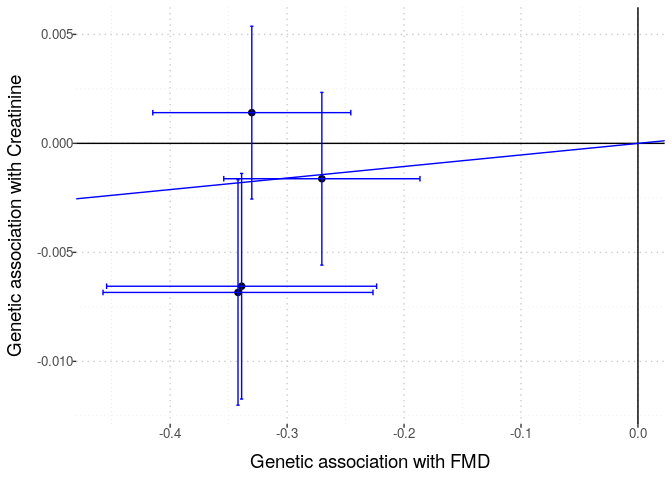

Exploring the creatinine GWAS summary statistics & FMD GWAS
meta-analysis summary statistics
================

We want to “explore” the two results files to see how many SNPs are
available in each, and to see how many SNPs are in both files. This
information will inform 2-sample MR studies to assess the causal effect
of FMD on creatinine levels.

First, we read into R the creatinine summary statistics file.

``` r
cre_file <- here::here("ukb_gwas", "biomarkers-30700-both_sexes-irnt.tsv.bgz")
cre_tib <- vroom::vroom(cre_file)
```

``` r
fmd_file <- here::here("data", "fmd_meta_gwas", 
                        "meta_analyse_FMD_FUMA_FR_MAYO_DEFINE_POL_MGI_FEIRI_HRC_all_2020-08-12.tab")
fmd_tib <- vroom::vroom(fmd_file)
```

    Rows: 6477066 Columns: 12
    ── Column specification ────────────────────────────────────────────────────────
    Delimiter: "\t"
    chr (4): MarkerName, rsID, REF, ALT
    dbl (8): CHROM, POS, P, BETA, SE, N, Rsq_min, Rsq_max

    ℹ Use `spec()` to retrieve the full column specification for this data.
    ℹ Specify the column types or set `show_col_types = FALSE` to quiet this message.

It looks like the way to identify (and, ultimately, match) markers in
the two studies involves using the four columns in the Creatinine
results file:

“chr”  
“pos”  
“ref”  
“alt”

Note that the Neale Lab seems to not list an rs identifier for the
markers. I need to pay attention to the genomic build that is used in
both the Neale Lab analysis and in the FMD meta-analysis. Hopefully the
two studies use the same genomic build, but, if not, I’ll need to
account for that in the “pos” values.

`fmd_tib`, on the other hand, has the summary statistics in a different
format. It has 12 columns in total:

“MarkerName” “rsID”  
“CHROM”  
“POS”  
“REF”  
“ALT”  
“P”  
“BETA”  
“SE”  
“N”  
“Rsq_min”  
“Rsq_max”

Let’s look at only Chr1 for now, just for an example.

``` r
library(magrittr)
```

We see that there are 495,323 markers on Chr1 that are in both data
sets.

How many Chr 1 SNPs are in the FMD meta-analysis?

``` r
fmd_tib %>%
    dplyr::filter(CHROM == 1) %>%
    dim()
```

    [1] 495398     12

There are 495,398 SNPs on Chr1 in the FMD file. Thus only 75 FMD file
Chr 1 SNPs are not in the Neale Lab data. It seems most likely that the
two files are using the same genomic build. It’s hard to think that
there would be such a high overlap rate if they used different builds.
However, I still need to look at the documentation - ie, the FMD paper -
to be sure about this.

## Stanzick et al. 2021 data

``` r
stanzick_file <- here::here("stanzick2021", "metal_eGFR_meta_ea1.TBL.map.annot.gc.gz")
stanzick_tib <- vroom::vroom(stanzick_file)
```

``` r
#kettunen_file <- here::here("kettunen2016", "harmonised", "GCST90132719.tsv.gz")
kettunen_file <- here::here("kettunen2016", "GCST90132719_buildGRCh37.txt.gz")
kettunen_tib <- vroom::vroom(kettunen_file)
```

``` r
# find shared snps
#shared_snps <- intersect(fmd_tib$rsID, kettunen_tib$hm_rsid)
shared_snps <- intersect(fmd_tib$rsID, kettunen_tib$ID)
# length(shared_snps) 
# there are 6.4 million shared snps!
fmd_small <- fmd_tib %>%
    dplyr::filter(rsID %in% shared_snps) %>%
    dplyr::filter(P < 1e-6) # choose pvalue threshold
kettunen_small <- kettunen_tib %>%
    #dplyr::filter(hm_rsid %in% fmd_small$rsID)
    dplyr::filter(ID %in% fmd_small$rsID)
```

``` r
# check that effect allele is the same between the two tibbles
kettunen_small %>%
    dplyr::inner_join(fmd_small, by = c("ID" = "rsID")) %>% 
    dplyr::mutate(harmonised = EA == ALT) %>%
    dplyr::select(harmonised) %>% unlist() %>% all()
```

``` r
# https://cran.r-project.org/web/packages/LDlinkR/vignettes/LDlinkR.html
# follow steps at above url to use LDlinkR to get LD matrix for use with MendelianRandomization R pkg
ld_token <- "3fbdb0673b22"


remove_offdiagonal_ones <- function(symm_matrix, threshold = 0.9){
    nr <- nrow(symm_matrix)
    bad_list <- list()
    for (row in 1:nr){
        foo <- upper.tri(symm_matrix, diag = FALSE)[row,]
        bar <- symm_matrix[row, ] > threshold
        bad_list[[row]] <- which(foo & bar)
    }
    bad_indices <- unique(do.call("c", bad_list))
    if (length(bad_indices) == 0){
        return(symm_matrix)
    } else {
        out <- as.matrix(symm_matrix[- bad_indices, - bad_indices])
        rownames(out) <- colnames(out) <- colnames(symm_matrix)[- bad_indices]
        return(out)
    }
}
```

``` r
ld_list <- list()
for (chr in 1:22){
    fmd_onechr <- fmd_small %>%
        dplyr::filter(CHROM == chr)
    if (nrow(fmd_onechr) > 1){
        foo <- LDlinkR::LDmatrix(fmd_onechr$rsID, 
                pop = "CEU", 
                r2d = "r2", 
                genome_build = "grch37",
                token = ld_token, 
                file = FALSE
                ) 
        
        bar <- foo %>% 
                    dplyr::select(-1) %>%
                    as.matrix() %>%
                    remove_offdiagonal_ones()

        # remove rows & cols for highly correlated SNPs 
        # (ie, LD > 0.95)

        ld_list[[chr]] <- bar
    }
    if (nrow(fmd_onechr) == 1){
        ld_list[[chr]] <- as.matrix(1)
        colnames(ld_list[[chr]]) <- fmd_onechr$rsID       
    }
    if (nrow(fmd_onechr) == 0){
        ld_list[[chr]] <- NA
    }
}
# remove NAs
ld_list_nona <- ld_list[!is.na(ld_list)]
ld_mat <- as.matrix(Matrix::bdiag(ld_list_nona))
rn <- do.call(c, lapply(ld_list_nona, colnames))
rownames(ld_mat) <- rn
colnames(ld_mat) <- rn
```

``` r
input <- MendelianRandomization::mr_input(
            bx = fmd_small$BETA[fmd_small$rsID %in% colnames(ld_mat)], 
            bxse = fmd_small$SE[fmd_small$rsID %in% colnames(ld_mat)], 
            #by = kettunen_small$beta[kettunen_small$hm_rsid %in% colnames(ld_mat)], 
            by = kettunen_small$beta[kettunen_small$ID %in% colnames(ld_mat)], 
            #byse = kettunen_small$standard_error[kettunen_small$hm_rsid %in% colnames(ld_mat)], 
            byse = kettunen_small$se[kettunen_small$ID %in% colnames(ld_mat)], 
            corr = ld_mat,
            exposure = "FMD",
            outcome = "creatinine",
            snps = rownames(ld_mat)
        )
```

``` r
MendelianRandomization::mr_ivw(input)
```

``` r
MendelianRandomization::mr_plot(input)
```

### Barton Cystatin C

``` r
barton_file <- here::here("data", "barton2021_cystatinC", "GCST90025945_buildGRCh37.tsv")
barton_tib <- vroom::vroom(barton_file)
```

    Rows: 5515075 Columns: 15
    ── Column specification ────────────────────────────────────────────────────────
    Delimiter: "\t"
    chr  (2): ALLELE1, ALLELE0
    dbl (13): chromosome, base_pair_location, GENPOS, A1FREQ, INFO, CHISQ_LINREG...

    ℹ Use `spec()` to retrieve the full column specification for this data.
    ℹ Specify the column types or set `show_col_types = FALSE` to quiet this message.

``` r
# find shared snps
small_dat <- fmd_tib %>%
     dplyr::inner_join(barton_tib, by = c("CHROM" = "chromosome", "POS" = "base_pair_location")) %>%
     dplyr::filter(P < 1e-8) # choose pvalue threshold     
# harmonised? 
small_dat %>%
    dplyr::filter(REF == ALLELE0) # same 7 rows
```

    # A tibble: 5 × 25
      MarkerName rsID  CHROM    POS REF   ALT          P   BETA     SE     N Rsq_min
      <chr>      <chr> <dbl>  <dbl> <chr> <chr>    <dbl>  <dbl>  <dbl> <dbl>   <dbl>
    1 6:1290395… rs93…     6 1.29e7 A     G     2.04e-14 -0.330 0.0432  9062   0.815
    2 12:575272… rs11…    12 5.75e7 T     C     2.64e-10 -0.270 0.0428  9062   0.875
    3 12:900089… rs26…    12 9.00e7 A     G     8.68e- 9 -0.339 0.0589  9062   0.968
    4 12:900130… rs26…    12 9.00e7 T     C     6.52e- 9 -0.342 0.0589  9062   0.968
    5 12:900605… rs17…    12 9.01e7 G     A     5.92e- 9 -0.344 0.059   9062   0.985
    # … with 14 more variables: Rsq_max <dbl>, GENPOS <dbl>, ALLELE1 <chr>,
    #   ALLELE0 <chr>, A1FREQ <dbl>, INFO <dbl>, CHISQ_LINREG <dbl>,
    #   P_LINREG <dbl>, beta <dbl>, standard_error <dbl>, CHISQ_BOLT_LMM_INF <dbl>,
    #   P_BOLT_LMM_INF <dbl>, CHISQ_BOLT_LMM <dbl>, p_value <dbl>

``` r
ld_list <- list()
for (chr in 1:22){
    fmd_onechr <- small_dat %>%
        dplyr::filter(CHROM == chr)
    if (nrow(fmd_onechr) > 1){
        foo <- LDlinkR::LDmatrix(fmd_onechr$rsID, 
                pop = "CEU", 
                r2d = "r2", 
                genome_build = "grch37",
                token = ld_token, 
                file = FALSE
                ) 
        
        bar <- foo %>% 
                    dplyr::select(-1) %>%
                    as.matrix() %>%
                    remove_offdiagonal_ones(threshold = 0.99)

        # remove rows & cols for highly correlated SNPs 

        ld_list[[chr]] <- bar
    }
    if (nrow(fmd_onechr) == 1){
        ld_list[[chr]] <- as.matrix(1)
        colnames(ld_list[[chr]]) <- fmd_onechr$rsID       
    }
    if (nrow(fmd_onechr) == 0){
        ld_list[[chr]] <- NA
    }
}
```


    LDlink server is working...

``` r
# remove NAs
ld_list_nona <- ld_list[!is.na(ld_list)]
ld_mat <- as.matrix(Matrix::bdiag(ld_list_nona))
rn <- do.call(c, lapply(ld_list_nona, colnames))
rownames(ld_mat) <- rn
colnames(ld_mat) <- rn
```

``` r
small_dat_no_ld <- small_dat %>%
    dplyr::filter(rsID %in% rownames(ld_mat))
```

``` r
input <- MendelianRandomization::mr_input(
            bx = small_dat_no_ld$BETA, 
            bxse = small_dat_no_ld$SE, 
            by = small_dat_no_ld$beta, 
            byse = small_dat_no_ld$standard_error,
            corr = ld_mat,
            exposure = "FMD",
            outcome = "cystatin C",
            snps = rownames(ld_mat)
        )
```

``` r
MendelianRandomization::mr_allmethods(input)
```

                        Method Estimate Std Error 95% CI        P-value
                 Simple median    0.009     0.004   0.001 0.018   0.021
               Weighted median    0.009     0.004   0.001 0.017   0.037
     Penalized weighted median    0.009     0.004   0.001 0.017   0.037
                                                                       
                           IVW    0.009     0.004   0.001 0.016   0.030
                 Penalized IVW    0.009     0.004   0.001 0.016   0.030
                    Robust IVW    0.009     0.004   0.001 0.016   0.030
          Penalized robust IVW    0.009     0.004   0.001 0.016   0.030
                                                                       
                      MR-Egger    0.016     0.038  -0.059 0.091   0.681
                   (intercept)   -0.002     0.012  -0.026 0.021   0.850
            Penalized MR-Egger    0.016     0.038  -0.059 0.091   0.681
                   (intercept)   -0.002     0.012  -0.026 0.021   0.850
               Robust MR-Egger    0.016     0.038  -0.059 0.091   0.681
                   (intercept)   -0.002     0.012  -0.026 0.021   0.850
     Penalized robust MR-Egger    0.016     0.038  -0.059 0.091   0.681
                   (intercept)   -0.002     0.012  -0.026 0.021   0.850

``` r
MendelianRandomization::mr_egger(input, correl = ld_mat)
```


    MR-Egger method
    (variants correlated, random-effect model)

    Number of Variants =  4 

    ------------------------------------------------------------------
          Method Estimate Std Error  95% CI       p-value
        MR-Egger    0.016     0.038 -0.059, 0.091   0.681
     (intercept)   -0.002     0.012 -0.026, 0.021   0.850
    ------------------------------------------------------------------
    Residual Standard Error :  0.364 
    Residual standard error is set to 1 in calculation of confidence interval when its estimate is less than 1.
    Heterogeneity test statistic = 0.2657 on 2 degrees of freedom, (p-value = 0.8756)

``` r
MendelianRandomization::mr_plot(input, interactive = FALSE)
```


## Barton Creatinine analysis

``` r
barton_file <- here::here("data", "barton2021_creatinine", "GCST90025946_buildGRCh37.tsv")
barton_tib <- vroom::vroom(barton_file)
```

    Rows: 5515075 Columns: 15
    ── Column specification ────────────────────────────────────────────────────────
    Delimiter: "\t"
    chr  (2): ALLELE1, ALLELE0
    dbl (13): chromosome, base_pair_location, GENPOS, A1FREQ, INFO, CHISQ_LINREG...

    ℹ Use `spec()` to retrieve the full column specification for this data.
    ℹ Specify the column types or set `show_col_types = FALSE` to quiet this message.

``` r
# find shared snps
small_dat <- fmd_tib %>%
     dplyr::inner_join(barton_tib, by = c("CHROM" = "chromosome", "POS" = "base_pair_location")) %>%
     dplyr::filter(P < 1e-8) # choose pvalue threshold     
# harmonised? 
small_dat %>%
    dplyr::filter(REF == ALLELE0) 
```

    # A tibble: 5 × 25
      MarkerName rsID  CHROM    POS REF   ALT          P   BETA     SE     N Rsq_min
      <chr>      <chr> <dbl>  <dbl> <chr> <chr>    <dbl>  <dbl>  <dbl> <dbl>   <dbl>
    1 6:1290395… rs93…     6 1.29e7 A     G     2.04e-14 -0.330 0.0432  9062   0.815
    2 12:575272… rs11…    12 5.75e7 T     C     2.64e-10 -0.270 0.0428  9062   0.875
    3 12:900089… rs26…    12 9.00e7 A     G     8.68e- 9 -0.339 0.0589  9062   0.968
    4 12:900130… rs26…    12 9.00e7 T     C     6.52e- 9 -0.342 0.0589  9062   0.968
    5 12:900605… rs17…    12 9.01e7 G     A     5.92e- 9 -0.344 0.059   9062   0.985
    # … with 14 more variables: Rsq_max <dbl>, GENPOS <dbl>, ALLELE1 <chr>,
    #   ALLELE0 <chr>, A1FREQ <dbl>, INFO <dbl>, CHISQ_LINREG <dbl>,
    #   P_LINREG <dbl>, beta <dbl>, standard_error <dbl>, CHISQ_BOLT_LMM_INF <dbl>,
    #   P_BOLT_LMM_INF <dbl>, CHISQ_BOLT_LMM <dbl>, p_value <dbl>

``` r
ld_list <- list()
for (chr in 1:22){
    fmd_onechr <- small_dat %>%
        dplyr::filter(CHROM == chr)
    if (nrow(fmd_onechr) > 1){
        foo <- LDlinkR::LDmatrix(fmd_onechr$rsID, 
                pop = "CEU", 
                r2d = "r2", 
                genome_build = "grch37",
                token = ld_token, 
                file = FALSE
                ) 
        
        bar <- foo %>% 
                    dplyr::select(-1) %>%
                    as.matrix() %>%
                    remove_offdiagonal_ones(threshold = 0.99)

        # remove rows & cols for highly correlated SNPs 

        ld_list[[chr]] <- bar
    }
    if (nrow(fmd_onechr) == 1){
        ld_list[[chr]] <- as.matrix(1)
        colnames(ld_list[[chr]]) <- fmd_onechr$rsID       
    }
    if (nrow(fmd_onechr) == 0){
        ld_list[[chr]] <- NA
    }
}
```


    LDlink server is working...

``` r
# remove NAs
ld_list_nona <- ld_list[!is.na(ld_list)]
ld_mat <- as.matrix(Matrix::bdiag(ld_list_nona))
rn <- do.call(c, lapply(ld_list_nona, colnames))
rownames(ld_mat) <- rn
colnames(ld_mat) <- rn
```

``` r
small_dat_no_ld <- small_dat %>%
    dplyr::filter(rsID %in% rownames(ld_mat))
```

``` r
input <- MendelianRandomization::mr_input(
            bx = small_dat_no_ld$BETA, 
            bxse = small_dat_no_ld$SE, 
            #by = kettunen_small$beta[kettunen_small$hm_rsid %in% colnames(ld_mat)], 
            by = small_dat_no_ld$beta, 
            #byse = kettunen_small$standard_error[kettunen_small$hm_rsid %in% colnames(ld_mat)], 
            byse = small_dat_no_ld$standard_error,
            corr = ld_mat,
            exposure = "FMD",
            outcome = "Creatinine",
            snps = rownames(ld_mat)
        )
```

``` r
MendelianRandomization::mr_allmethods(input)
```

                        Method Estimate Std Error 95% CI        P-value
                 Simple median    0.013     0.005   0.003 0.022   0.009
               Weighted median    0.009     0.005  -0.002 0.019   0.096
     Penalized weighted median    0.011     0.005   0.002 0.021   0.019
                                                                       
                           IVW    0.005     0.006  -0.006 0.017   0.358
                 Penalized IVW    0.005     0.006  -0.006 0.017   0.358
                    Robust IVW    0.005     0.006  -0.006 0.017   0.358
          Penalized robust IVW    0.005     0.006  -0.006 0.017   0.358
                                                                       
                      MR-Egger    0.015     0.068  -0.119 0.149   0.825
                   (intercept)   -0.003     0.021  -0.045 0.039   0.885
            Penalized MR-Egger    0.015     0.068  -0.119 0.149   0.825
                   (intercept)   -0.003     0.021  -0.045 0.039   0.885
               Robust MR-Egger    0.015     0.068  -0.119 0.149   0.825
                   (intercept)   -0.003     0.021  -0.045 0.039   0.885
     Penalized robust MR-Egger    0.015     0.068  -0.119 0.149   0.825
                   (intercept)   -0.003     0.021  -0.045 0.039   0.885

``` r
MendelianRandomization::mr_egger(input, correl = ld_mat)
```


    MR-Egger method
    (variants correlated, random-effect model)

    Number of Variants =  4 

    ------------------------------------------------------------------
          Method Estimate Std Error  95% CI       p-value
        MR-Egger    0.015     0.068 -0.119, 0.149   0.825
     (intercept)   -0.003     0.021 -0.045, 0.039   0.885
    ------------------------------------------------------------------
    Residual Standard Error :  1.735 
    Heterogeneity test statistic = 6.0172 on 2 degrees of freedom, (p-value = 0.0494)

``` r
MendelianRandomization::mr_plot(input, interactive = FALSE)
```


